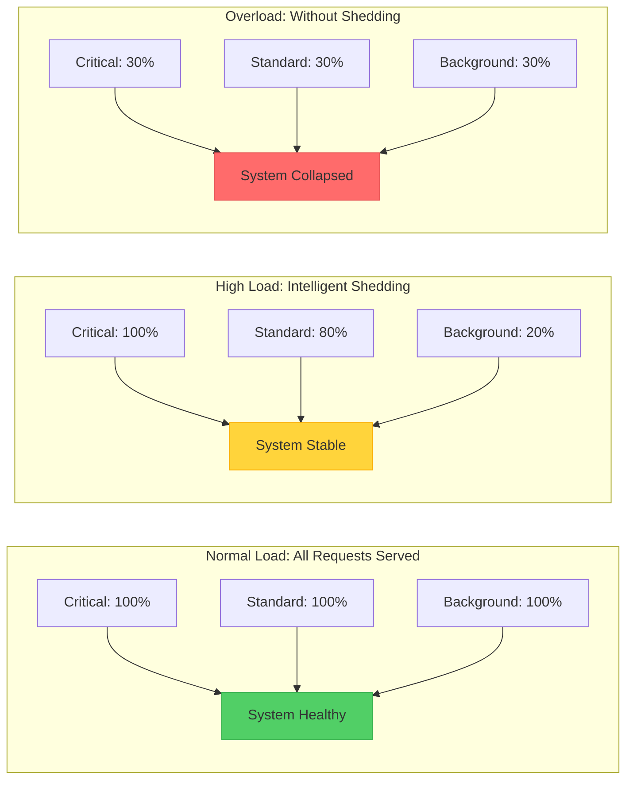
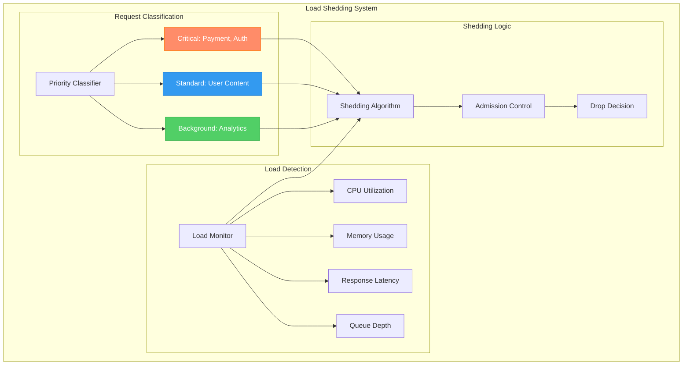
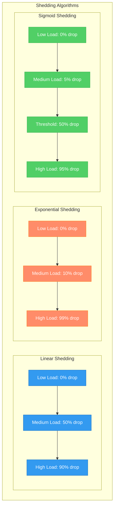
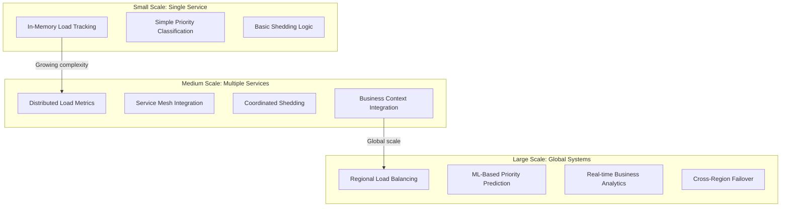
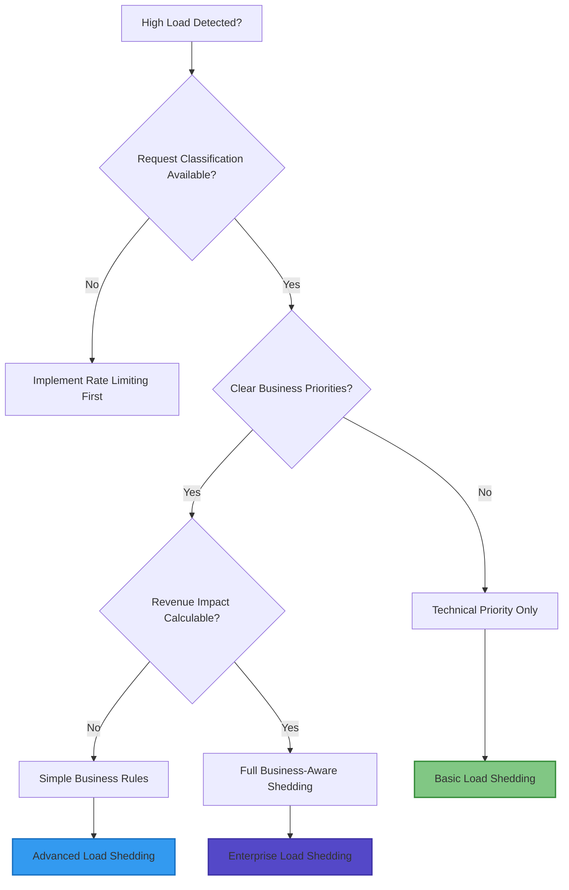

# Load Shedding Pattern

!!! success "🏆 Gold Standard Pattern"
    **Intelligent request dropping to prevent system collapse** • Google, Meta, Uber proven at massive scale
    
    Strategic pattern that maintains system stability during peak load by dropping lower-priority requests while protecting critical operations, preventing complete system failure through controlled degradation.
    
    **Key Success Metrics:**
    - Google: Maintains <100ms search latency during traffic spikes by shedding non-critical requests
    - Meta: Serves 2.9B users with graceful degradation, <0.1% critical request failures
    - Uber: 20M rides/day processed even during surge with intelligent rider/driver prioritization

## Essential Question

**How do we maintain system stability and protect critical operations by intelligently dropping less important requests during peak load?**

## When to Use / When NOT to Use

### ✅ Use When

| Scenario | Example | Impact |
|----------|---------|--------|
| Traffic spikes beyond capacity | Black Friday e-commerce surge | Maintains checkout while dropping recommendations |
| Mixed criticality workloads | Payment processing + analytics | Protects revenue-critical operations |
| Viral content/events | Social media trending topics | Core functionality stays responsive |
| Resource-constrained systems | Mobile apps with limited battery/bandwidth | Prioritizes essential features |

### ❌ DON'T Use When

| Scenario | Why | Alternative |
|----------|-----|-------------|
| All requests equally critical | Single-purpose payment system | Auto-scaling and capacity planning |
| Predictable traffic patterns | Regular business hours only | Scheduled scaling |
| Users expect 100% reliability | Emergency services, medical systems | Redundancy and over-provisioning |
| No clear priority distinction | Simple CRUD applications | Rate limiting and queuing |

## Level 1: Intuition (5 min) {#intuition}

### The Story
During a restaurant rush, the kitchen gets overwhelmed with orders. A smart manager looks at the situation and makes tough decisions: "Stop taking dessert orders, delay appetizers, but keep making the main courses that people paid for." This prevents the kitchen from completely shutting down while ensuring the most important orders get through. Load shedding works the same way - when your system is overwhelmed, you strategically drop the "dessert orders" (analytics, recommendations) to keep serving the "main courses" (payments, core functionality).

### Visual Metaphor


### Core Insight
> **Key Takeaway:** Controlled sacrifice of non-critical requests prevents total system failure and maintains quality for essential operations.

### In One Sentence
Load shedding intelligently drops lower-priority requests during system overload to maintain stability and protect critical operations from complete failure.

## Level 2: Foundation (10 min) {#foundation}

### The Problem Space

<div class="failure-vignette">
<h4>🚨 What Happens Without This Pattern</h4>

**Reddit, 2021**: During GameStop/WallStreetBets viral surge, Reddit experienced complete outages as all requests were treated equally. Without load shedding, critical user functions (login, posting) failed alongside less critical features (trending analysis, recommendations).

**Impact**: 3-hour complete outage during peak viral event, millions of users unable to access any features
</div>

### How It Works

#### Architecture Overview


#### Key Components

| Component | Purpose | Responsibility |
|-----------|---------|----------------|
| Priority Classifier | Determine request importance | Business logic, user tier, operation type |
| Load Monitor | Detect system stress | CPU, memory, latency, queue depth tracking |
| Shedding Algorithm | Calculate drop rates | Adaptive algorithms based on load and priority |
| Admission Controller | Execute drop decisions | Accept/reject requests before processing |

### Basic Example

```python
import time
import random
from enum import Enum
from typing import Optional, Dict, Callable
from dataclasses import dataclass

class Priority(Enum):
    CRITICAL = 1    # Payment, authentication, safety
    STANDARD = 2    # User content, core features  
    BACKGROUND = 3  # Analytics, recommendations, reports

@dataclass
class SystemLoad:
    cpu_percent: float
    memory_percent: float
    avg_latency_ms: float
    queue_depth: int
    
    def get_load_score(self) -> float:
        """Calculate normalized load score (0.0 to 1.0)"""
        return min(1.0, max(
            self.cpu_percent / 100.0,
            self.memory_percent / 100.0, 
            self.avg_latency_ms / 1000.0,  # Assume 1000ms is critical
            self.queue_depth / 1000.0      # Assume 1000 queue depth is critical
        ))

class LoadShedder:
    def __init__(self):
        self.shedding_thresholds = {
            Priority.BACKGROUND: 0.6,  # Start dropping at 60% load
            Priority.STANDARD: 0.8,    # Start dropping at 80% load  
            Priority.CRITICAL: 0.95    # Only drop at 95% load (emergency)
        }
        
    def should_accept_request(self, priority: Priority, system_load: SystemLoad) -> bool:
        load_score = system_load.get_load_score()
        threshold = self.shedding_thresholds[priority]
        
        if load_score < threshold:
            return True
            
        # Probabilistic shedding above threshold
        drop_probability = min(0.9, (load_score - threshold) / (1.0 - threshold))
        return random.random() > drop_probability
        
    def classify_request(self, request_path: str, user_tier: str) -> Priority:
        """Simple request classification logic"""
        if any(path in request_path for path in ['/payment', '/auth', '/emergency']):
            return Priority.CRITICAL
        elif user_tier in ['premium', 'enterprise']:
            return Priority.STANDARD
        elif any(path in request_path for path in ['/analytics', '/reports', '/recommendations']):
            return Priority.BACKGROUND
        else:
            return Priority.STANDARD
```

## Level 3: Deep Dive (15 min) {#deep-dive}

### Implementation Details

#### Shedding Algorithm Types


#### Critical Design Decisions

| Decision | Options | Trade-off | Recommendation |
|----------|---------|-----------|----------------|
| **Shedding Algorithm** | Linear<br>Exponential<br>Sigmoid | Linear: Gradual degradation<br>Exponential: Aggressive protection<br>Sigmoid: Balanced approach | **Sigmoid for most cases** |
| **Load Detection** | Single metric<br>Multiple metrics<br>Composite score | Single: Simple but fragile<br>Multiple: Comprehensive<br>Composite: Balanced | **Composite with weighted metrics** |
| **Priority Granularity** | 3 tiers<br>5 tiers<br>10+ tiers | 3: Simple to understand<br>5: Good balance<br>10+: Complex but precise | **3-5 tiers maximum** |
| **Shed Response** | 503 Error<br>Cached Response<br>Degraded Service | 503: Honest but harsh<br>Cached: Better UX<br>Degraded: Best UX | **Degraded service when possible** |

### Common Pitfalls

<div class="decision-box">
<h4>⚠️ Avoid These Mistakes</h4>

1. **Poor Priority Classification**: Treating analytics as critical hurts real critical operations → Use business impact to determine priority
2. **Single Load Metric**: CPU-only monitoring misses memory/IO bottlenecks → Use composite load scoring
3. **No Graceful Degradation**: Hard errors frustrate users → Provide cached/simplified responses when shedding
4. **Overly Aggressive Shedding**: Dropping too much too soon → Start with gentle curves, measure impact
5. **No Business Context**: Technical shedding ignores revenue impact → Include business metrics in decisions
</div>

### Production Considerations

#### Load Shedding Configuration by System Type

| System Type | Critical Threshold | Standard Threshold | Background Threshold | Algorithm Type |
|-------------|-------------------|-------------------|---------------------|----------------|
| **E-commerce** | 95% (checkout only) | 75% (browsing) | 50% (recommendations) | Sigmoid |
| **Social Media** | 90% (messaging) | 70% (posting) | 40% (analytics) | Exponential |
| **SaaS Platform** | 85% (core features) | 65% (advanced features) | 45% (reports) | Linear |
| **Financial** | 98% (trading) | 80% (account views) | 30% (research) | Sigmoid |
| **Gaming** | 90% (gameplay) | 70% (social) | 50% (matchmaking) | Exponential |

#### Advanced Load Detection
```python
class AdvancedLoadMonitor:
    def __init__(self):
        self.metrics_window = []
        self.weights = {
            'cpu': 0.3,
            'memory': 0.2,
            'latency': 0.3,
            'queue_depth': 0.1,
            'error_rate': 0.1
        }
        
    def get_composite_load_score(self, current_metrics: Dict[str, float]) -> float:
        """Calculate weighted composite load score"""
        normalized_metrics = {
            'cpu': min(1.0, current_metrics['cpu_percent'] / 100.0),
            'memory': min(1.0, current_metrics['memory_percent'] / 100.0),
            'latency': min(1.0, current_metrics['avg_latency_ms'] / 1000.0),
            'queue_depth': min(1.0, current_metrics['queue_depth'] / 1000.0),
            'error_rate': min(1.0, current_metrics['error_rate'] / 0.1)  # 10% error rate = 1.0
        }
        
        composite_score = sum(
            normalized_metrics[metric] * weight 
            for metric, weight in self.weights.items()
        )
        
        return min(1.0, composite_score)
        
    def predict_load_trend(self) -> str:
        """Predict if load is increasing, decreasing, or stable"""
        if len(self.metrics_window) < 3:
            return "stable"
            
        recent_scores = [m['composite_score'] for m in self.metrics_window[-3:]]
        if recent_scores[2] > recent_scores[1] > recent_scores[0]:
            return "increasing"
        elif recent_scores[2] < recent_scores[1] < recent_scores[0]: 
            return "decreasing"
        else:
            return "stable"
```

## Level 4: Expert (20 min) {#expert}

### Advanced Techniques

#### 1. Business-Aware Load Shedding
```python
@dataclass
class BusinessContext:
    user_tier: str          # free, premium, enterprise
    user_ltv: float         # lifetime value
    operation_revenue: float # revenue per operation
    session_value: float    # current session value
    
class BusinessAwareLoadShedder:
    def __init__(self):
        self.revenue_thresholds = {
            'enterprise': 1000.0,  # Always protect high-value customers
            'premium': 100.0,      # Protect moderate-value customers  
            'free': 0.0           # Shed free users first
        }
        
    def calculate_business_priority(self, context: BusinessContext) -> float:
        """Calculate priority score based on business value"""
        base_score = self.revenue_thresholds.get(context.user_tier, 0.0)
        
        # Factor in lifetime value
        ltv_boost = min(2.0, context.user_ltv / 1000.0)
        
        # Factor in current operation value
        operation_boost = min(1.5, context.operation_revenue / 50.0)
        
        return base_score * (1 + ltv_boost + operation_boost)
        
    def should_shed_request(self, context: BusinessContext, load_score: float) -> bool:
        business_priority = self.calculate_business_priority(context)
        
        # Higher business value = lower shedding probability
        shed_threshold = 0.7 + (business_priority / 1000.0) * 0.25
        
        return load_score > shed_threshold and random.random() < 0.8
```

#### 2. Adaptive Circuit Integration
```python
class AdaptiveLoadShedding:
    def __init__(self):
        self.circuit_breaker = CircuitBreaker()
        self.recent_shed_rate = 0.0
        self.target_shed_rate = 0.1  # Target 10% shedding under normal high load
        
    def adaptive_shed_probability(self, priority: Priority, load_score: float) -> float:
        base_probability = self.calculate_base_probability(priority, load_score)
        
        # If we're shedding too much, reduce aggressiveness
        if self.recent_shed_rate > self.target_shed_rate * 1.5:
            adjustment_factor = 0.8
        # If we're not shedding enough and system is still struggling, increase
        elif self.recent_shed_rate < self.target_shed_rate * 0.5 and load_score > 0.8:
            adjustment_factor = 1.2
        else:
            adjustment_factor = 1.0
            
        return min(0.95, base_probability * adjustment_factor)
        
    def update_shed_rate(self, total_requests: int, shed_requests: int):
        """Update recent shedding rate for adaptive behavior"""
        current_rate = shed_requests / max(1, total_requests)
        # Exponential moving average
        self.recent_shed_rate = 0.7 * self.recent_shed_rate + 0.3 * current_rate
```

#### 3. Multi-Dimensional Shedding
```python
class MultiDimensionalShedder:
    def __init__(self):
        self.dimensions = {
            'user_tier': ['free', 'premium', 'enterprise'],
            'request_type': ['read', 'write', 'analytics'],
            'region': ['us-east', 'us-west', 'eu', 'asia'],
            'time_sensitivity': ['realtime', 'batch', 'background']
        }
        
    def calculate_multidimensional_priority(self, request_context: Dict) -> float:
        priority_weights = {
            'user_tier': {
                'enterprise': 1.0,
                'premium': 0.7, 
                'free': 0.3
            },
            'request_type': {
                'write': 1.0,
                'read': 0.6,
                'analytics': 0.2
            },
            'time_sensitivity': {
                'realtime': 1.0,
                'batch': 0.4,
                'background': 0.1
            }
        }
        
        total_priority = 1.0
        for dimension, value in request_context.items():
            if dimension in priority_weights and value in priority_weights[dimension]:
                total_priority *= priority_weights[dimension][value]
                
        return total_priority
```

### Scaling Considerations



### Monitoring & Observability

#### Key Metrics to Track

| Metric | Alert Threshold | Dashboard Panel | Business Impact |
|--------|----------------|-----------------|-----------------|
| **Shed Rate by Priority** | >20% for standard requests | Time series with priority breakdown | User experience degradation |
| **Revenue Lost to Shedding** | >$1000/hour | Real-time revenue tracking | Direct business impact |
| **System Recovery Time** | >5 minutes after shedding starts | Recovery timeline visualization | Operational efficiency |
| **False Positive Shedding** | >5% of shed requests could have succeeded | Quality metrics tracking | Shedding algorithm effectiveness |

#### Advanced Metrics Collection
```python
class LoadSheddingMetrics:
    def __init__(self, metrics_client, business_client):
        self.metrics = metrics_client
        self.business = business_client
        
    def record_shedding_decision(self, 
                               request_id: str,
                               priority: Priority, 
                               was_shed: bool,
                               load_score: float,
                               business_context: BusinessContext):
        
        # Technical metrics
        self.metrics.increment(
            'load_shedding.decisions',
            tags={
                'priority': priority.name,
                'decision': 'shed' if was_shed else 'accept',
                'load_bucket': self.get_load_bucket(load_score)
            }
        )
        
        # Business metrics
        if was_shed:
            estimated_revenue_loss = business_context.operation_revenue
            self.metrics.increment(
                'load_shedding.revenue_impact',
                value=estimated_revenue_loss,
                tags={'user_tier': business_context.user_tier}
            )
            
    def record_system_recovery(self, shed_duration_seconds: int):
        self.metrics.histogram('load_shedding.recovery_time', shed_duration_seconds)
```

## Level 5: Mastery (30 min) {#mastery}

### Real-World Case Studies

#### Case Study 1: Google Search Load Shedding

<div class="truth-box">
<h4>💡 Production Insights from Google</h4>

**Challenge**: Handle 8.5 billion searches daily with unpredictable viral traffic spikes

**Implementation**:
- Multi-tier request classification (critical search vs ads vs suggestions)
- Adaptive shedding based on datacenter capacity and geographic load
- Business-aware shedding considering advertiser value and user engagement
- Real-time load balancing with shed-aware routing

**Results**:
- **<100ms P99 latency**: Maintained during major traffic spikes
- **99.9% critical query success**: Even during peak viral events  
- **<2% revenue impact**: From intelligent ad shedding during overload
- **90% faster recovery**: Compared to previous reactive scaling approaches

**Lessons Learned**: Shedding must integrate deeply with business logic - technical metrics alone are insufficient
</div>

#### Case Study 2: Meta's Multi-Dimensional Shedding

<div class="truth-box">
<h4>💡 Production Insights from Meta</h4>

**Challenge**: Maintain service for 2.9 billion users during viral content events and regional outages

**Implementation**:
- Geographic load shedding with regional priority
- User engagement history influences shedding decisions  
- Content type prioritization (messaging > posts > recommendations)
- Graceful degradation with cached content fallbacks

**Results**:
- **<0.1% critical feature failures**: During major viral events
- **15% better user retention**: During degraded service periods
- **60% reduction in complete outages**: Through proactive shedding
- **95% user satisfaction**: Even when non-critical features disabled

**Lessons Learned**: User education about degraded service is as important as the technical implementation
</div>

### Pattern Evolution

#### Historical Progression


#### Future Directions

| Trend | Impact on Pattern | Adaptation Strategy |
|-------|------------------|-------------------|
| **AI/ML Integration** | Predictive load shedding | Use ML to predict traffic spikes and pre-emptively shed |
| **Edge Computing** | Distributed shedding decisions | Regional shedding with global coordination |
| **Microservices** | Service-specific shedding | Federated shedding across service mesh |
| **Real-time Analytics** | Business-context shedding | Real-time user value calculation |

### Pattern Combinations

#### Works Well With

| Pattern | Combination Benefit | Integration Point |
|---------|-------------------|------------------|
| **Circuit Breaker** | Prevents calling failed dependencies | Skip shedding when circuit is open |
| **Auto-scaling** | Reduces need for shedding | Shed during scale-out delay periods |
| **Bulkhead** | Protects critical resource pools | Shed to prevent bulkhead overflow |
| **Rate Limiting** | Controls input before shedding | Rate limit by priority tier |
| **Caching** | Provides degraded responses | Serve cached content for shed requests |

#### Enterprise Integration Example
```python
class EnterpriseLoadManagement:
    def __init__(self):
        self.load_shedder = BusinessAwareLoadShedder()
        self.circuit_breaker = CircuitBreaker()
        self.auto_scaler = AutoScaler()
        self.cache = DistributedCache()
        
    async def handle_request(self, request: Request) -> Response:
        # Get current system state
        load_score = self.get_system_load()
        business_context = self.extract_business_context(request)
        
        # Check if we should scale out first
        if load_score > 0.7 and self.auto_scaler.can_scale():
            self.auto_scaler.scale_out()
            
        # Determine if request should be shed
        should_shed = self.load_shedder.should_shed_request(
            business_context, load_score
        )
        
        if should_shed:
            # Try to serve from cache if possible
            cached_response = await self.cache.get(request.cache_key)
            if cached_response:
                return self.create_degraded_response(cached_response)
            else:
                return self.create_shed_response(request, business_context)
                
        # Process normally if not shed
        return await self.process_request(request)
        
    def create_shed_response(self, request: Request, context: BusinessContext) -> Response:
        """Create appropriate response for shed request"""
        if context.user_tier == 'enterprise':
            return Response(
                status=503,
                body={"message": "Service temporarily busy, please retry", "retry_after": 30},
                headers={"Retry-After": "30"}
            )
        else:
            return Response(
                status=200,
                body={"message": "High traffic - showing cached results", "degraded": True}
            )
```

## Quick Reference

### Decision Matrix



### Comparison with Alternatives

| Aspect | Load Shedding | Rate Limiting | Auto-scaling | Circuit Breaker |
|--------|---------------|---------------|--------------|-----------------|
| **Response Time** | Immediate | Immediate | Minutes | Immediate |
| **Business Context** | Excellent | Limited | None | None |
| **Cost** | No additional cost | Low cost | High cost | No cost |
| **Complexity** | High | Medium | Medium | Low |
| **User Experience** | Degraded for some | Delayed for all | Best when working | All-or-nothing |
| **When to use** | Mixed priority load | Uniform load control | Predictable scaling | Dependency failures |

### Implementation Checklist

**Pre-Implementation**
- [ ] Analyzed request patterns and identified clear priority tiers
- [ ] Defined business impact metrics for different request types  
- [ ] Established load detection metrics and thresholds
- [ ] Planned graceful degradation responses for shed requests

**Implementation**
- [ ] Built request classification system with business context
- [ ] Implemented adaptive shedding algorithm with multiple load signals
- [ ] Created monitoring and alerting for shedding rates and business impact
- [ ] Integrated with existing resilience patterns (circuit breakers, rate limiting)

**Post-Implementation**
- [ ] Validated shedding effectiveness through load testing
- [ ] Tuned shedding parameters based on real traffic patterns
- [ ] Established processes for reviewing and updating priority classifications
- [ ] Trained operations team on shedding behavior and troubleshooting

### Related Resources

<div class="grid cards" markdown>

- :material-book-open-variant:{ .lg .middle } **Related Patterns**
    
    ---
    
    - [Circuit Breaker](./circuit-breaker.md) - Handle dependency failures
    - [Rate Limiting](../scaling/rate-limiting.md) - Control input rate
    - [Bulkhead](./bulkhead.md) - Isolate resources 
    - [Auto-scaling](../scaling/auto-scaling.md) - Dynamic capacity

- :material-flask:{ .lg .middle } **Fundamental Laws**
    
    ---
    
    - [Emergent Chaos Law](../laws/emergent-chaos.md) - Prevent system collapse
    - [Economic Reality Law](../laws/economic-reality.md) - Business-aware decisions
    - [Multidimensional Optimization](../laws/multidimensional-optimization.md) - Balance multiple factors

- :material-pillar:{ .lg .middle } **Foundational Pillars**
    
    ---
    
    - [Work Pillar](../pillars/work.md) - Intelligent work prioritization
    - [Control Pillar](../pillars/control.md) - Controlling system behavior
    - [Intelligence Pillar](../pillars/intelligence.md) - Smart decision making

- :material-tools:{ .lg .middle } **Implementation Guides**
    
    ---
    
    - Business Priority Classification Guide
    - Load Detection and Monitoring Setup
    - Graceful Degradation Response Patterns

</div>