# Load Shedding Pattern

!!! info "🥈 Silver Tier Pattern"
    **Drop wisely to survive** • Essential for high-scale systems
    
    Load shedding prevents system collapse by intelligently rejecting requests when approaching capacity. Used by every major internet service during traffic spikes. The key is choosing what to drop.
    
    **Best For:** API gateways, web services, streaming platforms

## Essential Question

**How do we maintain system stability by selectively dropping requests when approaching capacity limits?**

## When to Use / When NOT to Use

### ✅ Use When

| Scenario | Example | Impact |
|----------|---------|--------|
| Traffic spikes | Black Friday sales | Protect checkout flow |
| DDoS attacks | Malicious traffic | Maintain legitimate service |
| Resource constraints | Database overload | Prevent cascade failure |
| Multi-tenant systems | SaaS platforms | Fair resource allocation |

### ❌ DON'T Use When

| Scenario | Why | Alternative |
|----------|-----|-------------|
| Unlimited resources | Can scale infinitely | Auto-scaling |
| All requests equal | No prioritization possible | Round-robin limiting |
| Batch processing | No real-time pressure | Queue with backpressure |
| Fixed user base | Predictable load | Capacity planning |

## Level 1: Intuition (5 min) {#intuition}

### The Nightclub Bouncer Analogy

```mermaid
graph LR
    subgraph "Nightclub at Capacity"
        Q[Queue] --> B[Bouncer]
        B -->|VIP| I1[✅ Immediate Entry]
        B -->|Regular| I2[⏱️ Wait in Line]
        B -->|Overcrowded| I3[❌ Come Back Later]
    end
    
    subgraph "System Load Shedding"
        R[Requests] --> LS[Load Shedder]
        LS -->|Critical| A1[✅ Process]
        LS -->|Normal| A2[⏱️ Queue]
        LS -->|Low Priority| A3[❌ Reject]
    end
    
    style I1 fill:#51cf66,stroke:#2f9e44
    style I3 fill:#ff6b6b,stroke:#c92a2a
    style A1 fill:#51cf66,stroke:#2f9e44
    style A3 fill:#ff6b6b,stroke:#c92a2a
```



### Core Insight
> **Key Takeaway:** Better to serve some requests well than all requests poorly. Strategic rejection preserves system stability.

## Level 2: Foundation (10 min) {#foundation}

### The Problem Space

<div class="failure-vignette">
<h4>🚨 What Happens Without Load Shedding</h4>

**Facebook, 2010**: Like button launch caused cascade failure. Without load shedding, memcached exhaustion led to database overload, taking down the entire site for hours.

**Impact**: Site-wide outage, millions of users affected, emergency all-hands response required
</div>

### Load Shedding Strategies


### Priority Classification

| Priority | Examples | Accept Until | Business Impact |
|----------|----------|--------------|-----------------|
| **Critical** | Payments, Login | 95% load | Revenue, Access |
| **High** | Checkout, Search | 80% load | Conversion |
| **Normal** | Browse, View | 60% load | Engagement |
| **Low** | Analytics, Logs | 40% load | Insights |

## Level 3: Deep Dive (15 min) {#deep-dive}

### Load Shedding Implementation

```yaml
load_shedding:
  strategies:
    - name: priority_based
      thresholds:
        critical: 0.95
        high: 0.80
        normal: 0.60
        low: 0.40
        
    - name: adaptive_shedding
      algorithm: gradient_descent
      target_latency: 100ms
      adjustment_interval: 10s
      
    - name: token_bucket
      rate: 1000
      burst: 100
      refill_interval: 1s
      
  monitoring:
    metrics:
      - requests_accepted
      - requests_shed
      - shed_by_priority
      - system_load
      
  responses:
    503_service_unavailable:
      retry_after: 30
      body: "System at capacity, please retry"
```

### Advanced Shedding Algorithms

| Algorithm | How it Works | Pros | Cons |
|-----------|--------------|------|------|
| **Adaptive Random** | Increase drop % with load | Simple, fair | No business logic |
| **Weighted Fair Queue** | Priority × wait time | Prevents starvation | Complex |
| **Cost-Based** | Drop by resource cost | Optimizes throughput | Needs cost model |
| **Predictive** | ML-based prediction | Proactive | Training required |

### Common Pitfalls

<div class="decision-box">
<h4>⚠️ Avoid These Mistakes</h4>

1. **Binary shedding**: All or nothing → Implement gradual shedding levels
2. **No client feedback**: Silent drops → Return proper 503 + Retry-After
3. **Poor prioritization**: Wrong priorities → Align with business value
4. **Shedding too late**: Already overloaded → Start early (60-70% load)
</div>

## Level 4: Expert (20 min) {#expert}

### Multi-Layer Load Shedding


### Adaptive Load Shedding

```python
class AdaptiveLoadShedder:
    def __init__(self):
        self.target_latency = 100  # ms
        self.shed_ratio = 0.0
        self.alpha = 0.1  # Learning rate
        
    def update_shed_ratio(self, current_latency):
        # Gradient descent to find optimal shed ratio
        error = current_latency - self.target_latency
        self.shed_ratio += self.alpha * error / self.target_latency
        self.shed_ratio = max(0, min(1, self.shed_ratio))
        
    def should_accept(self, priority_score):
        # Higher priority score = more likely to accept
        threshold = 1 - self.shed_ratio
        return random.random() * priority_score > threshold
```

### Load Shedding Metrics

| Metric | Formula | Target | Alert Threshold |
|--------|---------|--------|-----------------|
| **Shed Rate** | Shed / Total | < 5% | > 10% |
| **Priority Distribution** | By tier % | Follows plan | Deviation > 20% |
| **Goodput** | Successful / Total | > 95% | < 90% |
| **Revenue Impact** | Lost revenue/hour | Minimize | > $1000/hour |

## Level 5: Mastery (25 min) {#mastery}

### Real-World Case Studies

<div class="truth-box">
<h4>💡 Google Search Load Shedding</h4>

**Challenge**: Handle 100K+ QPS with consistent <100ms latency

**Implementation**: 
- Multi-tier shedding: Edge → Frontend → Backend
- Feature degradation: Disable spell check, instant results
- Priority scoring: Query type + user history
- Adaptive thresholds based on datacenter load

**Results**: 
- 99.9% availability during 10x traffic spikes
- <1% of queries fully shed
- 50ms p99 latency maintained
- Graceful degradation invisible to most users

**Key Learning**: Shed features, not requests - most users prefer fast basic results over slow full results
</div>

### Business-Aware Shedding

| Request Type | Business Value | Priority Score | Shedding Strategy |
|--------------|----------------|----------------|-------------------|
| **Checkout** | $100/request | 1.0 | Never shed |
| **Add to Cart** | $10/request | 0.8 | Shed at 90% load |
| **Search** | $1/request | 0.5 | Degrade features |
| **Browse** | $0.1/request | 0.3 | Aggressive shedding |
| **Analytics** | $0.01/request | 0.1 | First to shed |

### Testing Load Shedding


## Quick Reference

### Decision Flowchart


### Implementation Checklist

**Pre-Implementation**
- [ ] Classify requests by priority
- [ ] Define load thresholds
- [ ] Calculate business impact
- [ ] Design client retry strategy

**Implementation**
- [ ] Add request classification
- [ ] Implement shedding logic
- [ ] Return proper HTTP codes
- [ ] Add monitoring/metrics

**Post-Implementation**
- [ ] Load test all scenarios
- [ ] Validate priority accuracy
- [ ] Monitor business metrics
- [ ] Document for operations

### Related Resources

<div class="grid cards" markdown>

- :material-book-open-variant:{ .lg .middle } **Related Patterns**
    
    ---
    
    - [Rate Limiting](../scaling/rate-limiting.md) - Prevent overload
    - [Circuit Breaker](./circuit-breaker.md) - Fail fast
    - [Backpressure](../communication/backpressure.md) - Flow control

- :material-flask:{ .lg .middle } **Fundamental Laws**
    
    ---
    
    - [Law 1: Correlated Failure](../../part1-axioms/law1-failure/) - Overload cascades
    - [Law 3: Emergent Chaos](../../part1-axioms/law3-emergence/) - Load patterns emerge
    - [Law 7: Economic Reality](../../part1-axioms/law7-economics/) - Business priorities

</div>