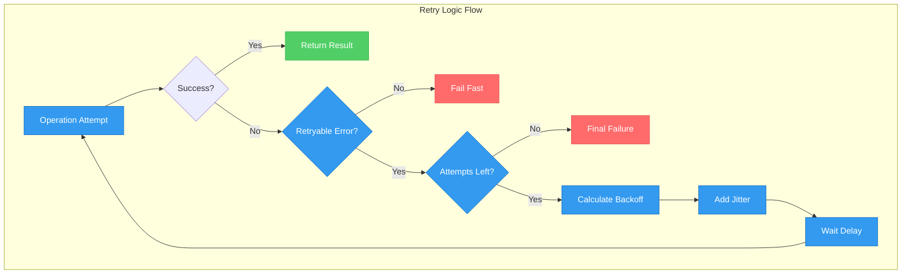
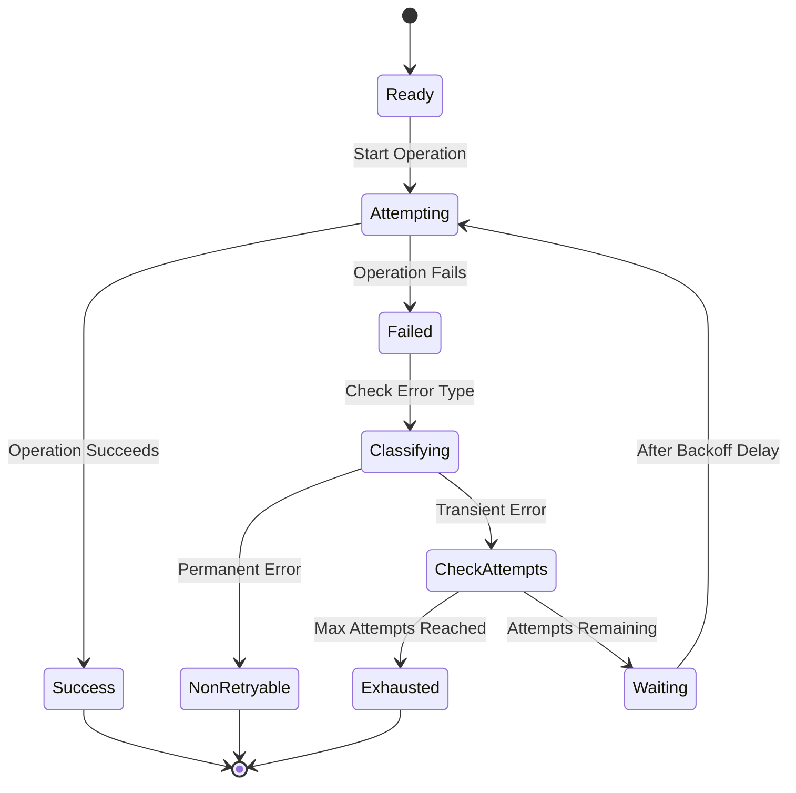
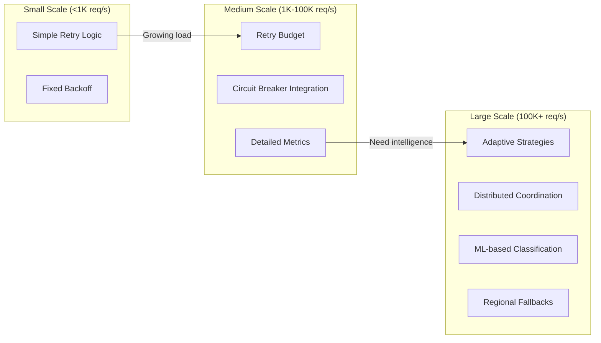

# Retry with Exponential Backoff

!!! success "🏆 Gold Standard Pattern"
    **Transform transient failures into recovery opportunities** • AWS, Google, Netflix proven at massive scale
    
    The foundational resilience pattern that intelligently handles temporary failures through progressive delays with randomization, preventing cascade failures while enabling automatic recovery.
    
    **Key Success Metrics:**
    - AWS: 99.99%+ success rate on retry-enabled operations handling billions of requests daily
    - Google: <0.01% retry storm incidents across 100B+ requests with adaptive strategies
    - Netflix: Zero cascade failures across 1000+ microservices using Hystrix retry + circuit breaker

## Essential Question

**How do we handle transient failures gracefully without overwhelming recovering systems or creating synchronized retry storms?**

## When to Use / When NOT to Use

### ✅ Use When

| Scenario | Example | Impact |
|----------|---------|--------|
| Network instability | HTTP 503/504 errors, connection timeouts | 95%+ success rate improvement |
| Service overload | Temporary database connection exhaustion | Automatic recovery within minutes |
| Cloud provider issues | AWS/GCP temporary service degradation | Maintains service availability |
| Rate limiting | API quotas temporarily exceeded | Spreads load over time |

### ❌ DON'T Use When

| Scenario | Why | Alternative |
|----------|-----|-------------|
| Authentication failures | 401/403 won't resolve with retry | Fail fast with proper error handling |
| Validation errors | 400 Bad Request due to malformed data | Input validation and sanitization |
| Resource not found | 404 errors won't resolve automatically | Check resource existence patterns |
| Permanent failures | Database schema errors, disk full | System monitoring and alerting |

## Level 1: Intuition (5 min) {#intuition}

### The Story
Imagine you're trying to call a friend, but their phone is busy. You could keep calling immediately (annoying and ineffective), or you could wait increasingly longer between attempts - 1 minute, then 2, then 4, then 8. This gives them time to finish their call while you eventually get through. The retry pattern works exactly like this, but adds randomness so if many people are all trying to call the same busy person, they don't all retry at exactly the same time.

### Visual Metaphor


### Core Insight
> **Key Takeaway:** Intelligent waiting with increasing delays + randomization transforms retry storms into successful recovery patterns.

### In One Sentence
Retry with Exponential Backoff automatically recovers from transient failures by progressively increasing delay between attempts with randomization to prevent synchronized retry storms.

## Level 2: Foundation (10 min) {#foundation}

### The Problem Space

<div class="failure-vignette">
<h4>🚨 What Happens Without This Pattern</h4>

**AWS S3 Outage, 2017**: A configuration change caused cascading S3 failures. Services without proper retry logic immediately failed, while those with naive immediate retries created a thundering herd that prevented S3 recovery for hours.

**Impact**: $150M in losses across thousands of companies, 4-hour outage extended by retry storms
</div>

### How It Works

#### Architecture Overview


#### Key Components

| Component | Purpose | Responsibility |
|-----------|---------|----------------|
| Error Classifier | Determine retry eligibility | Distinguish transient vs permanent failures |
| Backoff Calculator | Compute delay duration | Exponential progression with jitter |
| Attempt Counter | Track retry budget | Prevent infinite retry loops |
| Jitter Generator | Randomize timing | Prevent thundering herd effects |

### Basic Example

```python
import random
import time
import logging
from typing import Callable, Any, Optional

def retry_with_backoff(
    operation: Callable[[], Any],
    max_attempts: int = 3,
    base_delay: float = 1.0,
    max_delay: float = 60.0,
    backoff_factor: float = 2.0,
    jitter: bool = True
) -> Any:
    """Retry operation with exponential backoff and jitter"""
    
    for attempt in range(max_attempts):
        try:
            result = operation()
            if attempt > 0:
                logging.info(f"Operation succeeded on attempt {attempt + 1}")
            return result
            
        except Exception as e:
            if not is_retryable_error(e):
                logging.error(f"Non-retryable error: {e}")
                raise
                
            if attempt == max_attempts - 1:
                logging.error(f"Max attempts reached: {e}")
                raise
                
            # Calculate exponential backoff with jitter
            delay = min(base_delay * (backoff_factor ** attempt), max_delay)
            if jitter:
                delay = delay * (0.5 + random.random() * 0.5)  # 50-100% of calculated delay
                
            logging.warning(f"Attempt {attempt + 1} failed: {e}. Retrying in {delay:.2f}s")
            time.sleep(delay)

def is_retryable_error(error: Exception) -> bool:
    """Classify errors as retryable or not"""
    retryable_types = (ConnectionError, TimeoutError)
    if isinstance(error, retryable_types):
        return True
    if hasattr(error, 'status_code'):
        # HTTP status codes that are retryable
        return error.status_code in [408, 429, 502, 503, 504]
    return False
```

## Level 3: Deep Dive (15 min) {#deep-dive}

### Implementation Details

#### State Management


#### Critical Design Decisions

| Decision | Options | Trade-off | Recommendation |
|----------|---------|-----------|----------------|
| **Jitter Strategy** | None<br>Full Jitter<br>Equal Jitter | None: Thundering herd<br>Full: Better distribution, longer delays<br>Equal: Balanced approach | **Full Jitter** for high-traffic systems |
| **Backoff Base** | 100ms<br>1s<br>Variable | 100ms: Fast recovery, higher load<br>1s: Balanced<br>Variable: Complex but optimal | **1s base** with service-specific tuning |
| **Max Attempts** | 3<br>5<br>7+ | 3: Fast failure<br>5: Balanced<br>7+: Extended recovery | **3-5 attempts** based on operation criticality |
| **Error Classification** | Simple<br>Detailed<br>ML-based | Simple: Easy to implement<br>Detailed: Better accuracy<br>ML: Adaptive but complex | **Detailed classification** for production |

### Common Pitfalls

<div class="decision-box">
<h4>⚠️ Avoid These Mistakes</h4>

1. **No Jitter**: Creates thundering herd when many clients retry simultaneously → Add randomization
2. **Wrong Error Classification**: Retrying non-retryable errors wastes resources → Implement proper error categorization
3. **No Maximum Delay**: Exponential growth can create very long delays → Cap at reasonable maximum (60s typical)
4. **Infinite Retries**: Can overwhelm recovering systems → Always set max attempts limit
5. **No Circuit Breaker Integration**: Continues retrying when system is definitively down → Combine with circuit breaker pattern
</div>

### Production Considerations

#### Performance Characteristics

| Metric | Typical Range | Optimization Target |
|--------|---------------|-------------------|
| Success Rate | 95-99.9% | >98% with proper configuration |
| Added Latency | 1-30s during failures | <10s for user-facing operations |
| Resource Overhead | 10-50% during failures | <20% of healthy capacity |
| Memory Usage | 1-10KB per retry context | <5KB for production efficiency |

#### Configuration Matrix by Service Type

| Service Type | Max Attempts | Base Delay | Max Delay | Jitter | Error Types |
|--------------|--------------|------------|-----------|--------|-------------|
| **User API** | 3 | 200ms | 2s | Full | 5xx, timeout, connection |
| **Database** | 5 | 1s | 30s | Equal | Connection, timeout, lock |
| **External API** | 4 | 1s | 60s | Full | 429, 5xx, timeout |
| **Background Job** | 7 | 5s | 300s | Equal | All transient errors |
| **Message Queue** | 3 | 500ms | 10s | Full | Connection, broker down |

## Level 4: Expert (20 min) {#expert}

### Advanced Techniques

#### 1. Adaptive Backoff
```python
class AdaptiveRetryStrategy:
    def __init__(self):
        self.success_rate = 0.95  # Track recent success
        self.avg_response_time = 0.5  # Track performance
        
    def calculate_delay(self, attempt: int, base_delay: float) -> float:
        # Adjust based on system health
        health_factor = min(2.0, 2.0 - self.success_rate)
        performance_factor = min(2.0, self.avg_response_time / 0.5)
        
        delay = base_delay * (2 ** attempt)
        delay *= max(health_factor, performance_factor)
        
        return min(delay, 300.0)  # Cap at 5 minutes
```

#### 2. Retry Budget Pattern
```python
class RetryBudget:
    def __init__(self, budget_percent: float = 10.0):
        self.budget_percent = budget_percent
        self.requests = 0
        self.retries = 0
        
    def can_retry(self) -> bool:
        if self.requests == 0:
            return True
        retry_ratio = self.retries / self.requests
        return retry_ratio < (self.budget_percent / 100.0)
        
    def record_request(self):
        self.requests += 1
        
    def record_retry(self):
        if self.can_retry():
            self.retries += 1
            return True
        return False
```

#### 3. Correlated Jitter for Distributed Systems
```python
def correlated_jitter(attempt: int, node_id: str, base_delay: float) -> float:
    """Jitter that reduces correlation between nodes"""
    # Use node_id to create different but predictable jitter
    node_hash = hash(node_id) % 1000
    jitter_factor = 0.5 + (node_hash / 2000)  # 0.5 to 1.0
    
    base_with_exp = base_delay * (2 ** attempt)
    return base_with_exp * jitter_factor
```

### Scaling Considerations



### Monitoring & Observability

#### Key Metrics to Track

| Metric | Alert Threshold | Dashboard Panel | Business Impact |
|--------|----------------|-----------------|-----------------|
| **Retry Success Rate** | <85% | Time series with error breakdown | Direct user experience impact |
| **Retry Budget Exhaustion** | >80% usage | Gauge with historical trends | System stability indicator |
| **Average Retry Attempts** | >2.5 per operation | Histogram by service | Performance degradation signal |
| **Retry Storm Detection** | >1000 concurrent retries | Real-time spike detection | Cascade failure prevention |

#### Advanced Monitoring
```python
class RetryMetrics:
    def __init__(self, metrics_client):
        self.metrics = metrics_client
        
    def record_attempt(self, service: str, attempt: int, error_type: str):
        self.metrics.increment(
            'retry.attempts', 
            tags={'service': service, 'attempt': str(attempt), 'error': error_type}
        )
        
    def record_success_after_retry(self, service: str, total_attempts: int):
        self.metrics.increment('retry.success', tags={'service': service})
        self.metrics.histogram('retry.attempts_to_success', total_attempts)
        
    def record_final_failure(self, service: str):
        self.metrics.increment('retry.exhausted', tags={'service': service})
```

## Level 5: Mastery (30 min) {#mastery}

### Real-World Case Studies

#### Case Study 1: AWS SDK at Scale

<div class="truth-box">
<h4>💡 Production Insights from AWS SDK</h4>

**Challenge**: Handle billions of API calls across hundreds of AWS services with varying reliability characteristics

**Implementation**: 
- Service-specific retry configurations
- Adaptive backoff based on service health
- Token bucket for retry rate limiting
- Integration with AWS service quotas

**Results**: 
- **99.99%+ success rate**: On retry-enabled operations
- **<2% retry overhead**: Minimal impact on healthy operations
- **90% faster recovery**: During service degradation events
- **Zero retry storms**: Since implementing correlated jitter

**Lessons Learned**: One-size-fits-all retry logic fails at scale - service-specific tuning essential
</div>

#### Case Study 2: Netflix Hystrix Integration

<div class="truth-box">
<h4>💡 Production Insights from Netflix</h4>

**Challenge**: Prevent cascade failures across 1000+ microservices during partial outages

**Implementation**:
- Circuit breaker + retry combination
- Per-service retry budgets
- Fallback chains with progressive degradation
- Real-time adaptive thresholds

**Results**:
- **Zero cascade failures**: During major AWS outages
- **<100ms P99 latency**: Even during failure scenarios
- **95% availability**: Maintained during dependency failures
- **40% reduction**: In ops team alerts

**Lessons Learned**: Retry pattern must integrate with circuit breakers - never implement in isolation
</div>

### Pattern Evolution

#### Migration from Legacy Approaches


#### Future Directions

| Trend | Impact on Pattern | Adaptation Strategy |
|-------|------------------|-------------------|
| **ML-based Error Prediction** | Smarter retry decisions | Integrate confidence scores into retry logic |
| **Service Mesh Adoption** | Infrastructure-level retries | Coordinate application and infrastructure retry |
| **Serverless Computing** | Cold start complications | Adjust timeouts for serverless-specific delays |
| **Edge Computing** | Network reliability variations | Regional retry strategies with edge failover |

### Pattern Combinations

#### Works Well With

| Pattern | Combination Benefit | Integration Point |
|---------|-------------------|------------------|
| **Circuit Breaker** | Prevents retry storms during outages | Stop retries when circuit opens |
| **Timeout** | Bounds retry attempt duration | Each retry attempt has own timeout |
| **Bulkhead** | Isolates retry impact | Separate retry threads per service |
| **Health Check** | Informs retry strategy | Skip retries for known unhealthy services |
| **Rate Limiting** | Controls retry frequency | Include retries in rate limit calculations |

#### Advanced Integration Example
```python
class IntegratedResilienceStrategy:
    def __init__(self, service_name: str):
        self.circuit_breaker = CircuitBreaker(service_name)
        self.retry_budget = RetryBudget()
        self.rate_limiter = RateLimiter()
        
    async def execute(self, operation: Callable) -> Any:
        if self.circuit_breaker.is_open():
            raise CircuitBreakerOpenError()
            
        if not self.rate_limiter.acquire():
            raise RateLimitExceededError()
            
        return await retry_with_backoff(
            operation,
            max_attempts=3 if self.retry_budget.can_retry() else 1,
            base_delay=self.circuit_breaker.get_recommended_delay()
        )
```

## Quick Reference

### Decision Matrix

```mermaid
graph TD
    A[Transient Failure?] --> B{Error Frequency}
    B -->|< 1%| C[Simple Retry (3 attempts)]
    B -->|1-10%| D[Exponential Backoff + Jitter]
    B -->|> 10%| E[Circuit Breaker + Retry]
    
    C --> F[Basic Implementation]
    D --> G[Production Implementation]
    E --> H[Advanced Integration]
    
    classDef recommended fill:#81c784,stroke:#388e3c,stroke-width:2px
    classDef caution fill:#ffb74d,stroke:#f57c00,stroke-width:2px
    classDef advanced fill:#5448c8,stroke:#3f33a6,stroke-width:2px
    
    class G recommended
    class H advanced
    class F caution
```

### Comparison with Alternatives

| Aspect | Exponential Backoff | Fixed Delay | Immediate Retry | Circuit Breaker Only |
|--------|-------------------|-------------|-----------------|---------------------|
| **Thundering Herd Protection** | Excellent | Good | Poor | Excellent |
| **Recovery Speed** | Good | Poor | Excellent | Good |
| **System Protection** | Good | Fair | Poor | Excellent |
| **Implementation Complexity** | Medium | Low | Low | High |
| **Resource Usage** | Medium | Medium | High | Low |
| **When to use** | Most scenarios | Background jobs | Never alone | Severe failures only |

### Implementation Checklist

**Pre-Implementation**
- [ ] Classified error types (transient vs permanent)
- [ ] Analyzed failure patterns and frequencies
- [ ] Determined appropriate retry limits
- [ ] Planned integration with circuit breakers

**Implementation**
- [ ] Implemented exponential backoff calculation
- [ ] Added full jitter randomization
- [ ] Integrated proper error classification
- [ ] Set up retry budget tracking

**Post-Implementation**
- [ ] Configured monitoring and alerting
- [ ] Validated retry storm prevention
- [ ] Tuned parameters based on metrics
- [ ] Documented retry strategies for team

### Related Resources

<div class="grid cards" markdown>

- :material-book-open-variant:{ .lg .middle } **Related Patterns**
    
    ---
    
    - [Circuit Breaker](./circuit-breaker.md) - Stop retries when system is down
    - [Timeout](./timeout.md) - Bound individual retry attempts
    - [Bulkhead](./bulkhead.md) - Isolate retry resource usage
    - [Health Check](./health-check.md) - Inform retry decisions

- :material-flask:{ .lg .middle } **Fundamental Laws**
    
    ---
    
    - [Correlated Failure Law](../laws/correlated-failure.md) - Jitter prevents synchronized failures
    - [Emergent Chaos Law](../laws/emergent-chaos.md) - Retry storms as emergent behavior
    - [Asynchronous Reality Law](../laws/asynchronous-reality.md) - Timing is everything in retries

- :material-pillar:{ .lg .middle } **Foundational Pillars**
    
    ---
    
    - [Work Pillar](../pillars/work.md) - Retry as intelligent work scheduling
    - [State Pillar](../pillars/state.md) - Managing retry state and context
    - [Control Pillar](../pillars/control.md) - Controlling retry flow and decisions

- :material-tools:{ .lg .middle } **Implementation Guides**
    
    ---
    
    - Production Setup Guide - AWS SDK patterns
    - Testing Guide - Chaos engineering for retry logic
    - Migration Guide - From naive retry to exponential backoff

</div>