# Retry with Exponential Backoff

!!! success "🏆 Gold Standard Pattern"
    **Intelligent failure recovery** • AWS, Google Cloud, Netflix proven
    
    The essential pattern for handling transient failures in distributed systems. 
    Prevents cascade failures while maximizing success rates through exponential 
    backoff with jitter - handling billions of requests daily.

## Essential Question
**How do we distinguish between transient and permanent failures, retrying the former without creating thundering herds?**

## When to Use / When NOT to Use

### Use When
| Scenario | Example | Success Rate |
|----------|---------|--------------|
| Network timeouts | API calls | 95%+ recovery |
| Rate limiting | 429 errors | 99%+ recovery |
| Temporary unavailability | 503 errors | 90%+ recovery |
| Database deadlocks | Lock timeouts | 85%+ recovery |
| Service overload | 500 errors | 80%+ recovery |

### DON'T Use When
| Scenario | Why | Alternative |
|----------|-----|-------------|
| Business logic errors | Won't fix with retry | Fix the logic |
| Authentication failures | Credentials won't improve | Refresh token |
| Data validation errors | Bad data stays bad | Validate first |
| Resource not found | 404 won't change | Handle missing resource |
| Client errors (4xx) | Client issue won't resolve | Fix request |

## Level 1: Intuition (5 min)

### The Story
Imagine calling a busy restaurant. First busy signal? Try again in 1 second. 
Still busy? Wait 2 seconds. Then 4, 8, 16... Eventually you get through 
without overwhelming their phone system.

### Visual Metaphor


### Exponential Backoff Visualization

```mermaid
graph TB
    subgraph "Exponential Backoff Timeline"
        T0["0s: Initial Request<br/>❌ Failed"]
        T1["1s: Retry 1<br/>❌ Failed<br/>(wait = 1s)"]
        T2["3s: Retry 2<br/>❌ Failed<br/>(wait = 2s)"]
        T3["7s: Retry 3<br/>✅ Success!<br/>(wait = 4s)"]
        
        T0 -.->|"1s delay"| T1
        T1 -.->|"2s delay"| T2
        T2 -.->|"4s delay"| T3
    end
    
    subgraph "With Jitter (±25%)" 
        J0["0s: Request ❌"]
        J1["0.8s: Retry ❌<br/>(1s - 20%)"]
        J2["3.2s: Retry ❌<br/>(2s + 20%)"]
        J3["6.5s: Retry ✅<br/>(4s - 18%)"]
        
        J0 -.->|"0.8s"| J1
        J1 -.->|"2.4s"| J2
        J2 -.->|"3.3s"| J3
    end
    
    style T3 fill:#4ade80,stroke:#16a34a
    style J3 fill:#4ade80,stroke:#16a34a
```


### Thundering Herd Prevention


### Core Insight
<div class="axiom-box">
<h4>⚛️ Without Jitter = Thundering Herd</h4>

All clients retry at exactly 1s, 2s, 4s → synchronized storm → service dies.

**With Jitter**: Clients spread across 0.8-1.2s, 1.6-2.4s → gradual recovery.
</div>

## Level 2: Foundation (10 min)

### Key Formula
```
delay = min(base * (2 ^ attempt) + random_jitter, max_delay)
```

### Architecture Components
| Component | Purpose | Typical Values |
|-----------|---------|----------------|
| Base delay | Starting wait time | 100-1000ms |
| Multiplier | Growth factor | 2 (exponential) |
| Jitter | Randomization | ±25% of delay |
| Max retries | Failure limit | 3-5 attempts |
| Max delay | Cap on wait time | 30-60 seconds |

### Basic Implementation
```python
import random
import time

def retry_with_backoff(func, max_attempts=3, base_delay=1.0):
    """Exponential backoff with jitter"""
    for attempt in range(max_attempts):
        try:
            return func()
        except TransientError as e:
            if attempt == max_attempts - 1:
                raise
            
            # Calculate exponential delay with jitter
            delay = min(
                base_delay * (2 ** attempt) * (0.75 + random.random() * 0.5),
                30.0  # max delay
            )
            time.sleep(delay)
```

### Comparison of Strategies
| Strategy | Delay Pattern | Use Case | Thundering Herd Risk |
|----------|---------------|----------|---------------------|
| Fixed | 1s, 1s, 1s | Predictable outages | High |
| Linear | 1s, 2s, 3s | Gradual recovery | Medium |
| Exponential | 1s, 2s, 4s, 8s | Unknown duration | Low (with jitter) |
| Decorrelated | Random based on previous | AWS recommended | Lowest |

## Level 3: Deep Dive (15 min)

### Retry Decision Tree


### Retry Strategy Comparison


### Common Pitfalls

<div class="failure-vignette">
<h4>💥 The Retry Storm of 2019</h4>

A major e-commerce platform experienced a 15-minute database slowdown. Without jitter, 
all 10,000 application servers retried at exactly 1s, 2s, 4s intervals. The synchronized 
retry waves created 10x normal load, turning a minor slowdown into a 3-hour outage.

**Lesson**: Always add jitter. Always.
</div>

### Advanced Patterns

#### Circuit Breaker Integration
```python
def retry_with_circuit_breaker(func, circuit_breaker, **retry_kwargs):
    """Skip retries when circuit is open"""
    if circuit_breaker.is_open():
        raise CircuitOpenError("Circuit breaker is open")
    
    return retry_with_backoff(func, **retry_kwargs)
```

#### Retry Budget
```python
class RetryBudget:
    """Limit total retry overhead to 10% of requests"""
    def __init__(self, budget_percent=0.1):
        self.budget = budget_percent
        self.total_requests = 0
        self.retry_requests = 0
    
    def can_retry(self):
        if self.total_requests == 0:
            return True
        retry_rate = self.retry_requests / self.total_requests
        return retry_rate < self.budget
```

## Level 4: Expert (20 min)

### Production Strategies

| Strategy | When to Use | Implementation |
|----------|-------------|----------------|
| Circuit Breaker Integration | Repeated failures | Skip retries when circuit open |
| Adaptive Retry | Variable load | Adjust based on success rate |
| Priority-based | Mixed importance | High-priority gets more retries |
| Hedged Requests | Low latency critical | Parallel retry before timeout |
| Retry Budget | Prevent overload | Limit retry overhead to 10% |

### Real-world Implementations

#### AWS SDK Approach
```yaml
# AWS SDK default retry configuration
retry_config:
  mode: adaptive  # standard, adaptive, or legacy
  max_attempts: 3
  backoff_function: exponential
  base_delay: 100ms
  max_delay: 20s
  jitter: full
  retry_conditions:
    - throttling_errors
    - timeout_errors
    - server_errors
    - retryable_client_errors
```

#### Netflix Resilience4j
```java
RetryConfig config = RetryConfig.custom()
    .maxAttempts(3)
    .waitDuration(Duration.ofMillis(500))
    .intervalFunction(IntervalFunction.ofExponentialBackoff(
        500, 2, 5000  // initial, multiplier, max
    ))
    .retryOnException(e -> isRetryable(e))
    .retryOnResult(response -> response.statusCode() == 503)
    .build();
```

### Monitoring & Observability
```python
# Key metrics to track
metrics = {
    "retry_attempts": Counter("retry_attempts_total"),
    "retry_success": Counter("retry_success_total"),
    "retry_exhausted": Counter("retry_exhausted_total"),
    "retry_latency": Histogram("retry_latency_seconds"),
    "retry_budget_used": Gauge("retry_budget_percent"),
}

# Log context for debugging
logger.info("Retry attempt", extra={
    "attempt": attempt,
    "delay_ms": delay * 1000,
    "error_type": type(error).__name__,
    "service": target_service,
    "trace_id": trace_id,
})
```

## Level 5: Mastery (30 min)

### Advanced Implementation Patterns

#### Intelligent Error Classification
```python
class RetryClassifier:
    """Classify errors for retry decisions"""
    
    RETRYABLE_ERRORS = {
        # Network errors
        ConnectionError, TimeoutError, 
        
        # HTTP status codes
        429,  # Too Many Requests
        500,  # Internal Server Error
        502,  # Bad Gateway
        503,  # Service Unavailable
        504,  # Gateway Timeout
    }
    
    NON_RETRYABLE = {
        # Client errors
        400,  # Bad Request
        401,  # Unauthorized
        403,  # Forbidden
        404,  # Not Found
        422,  # Unprocessable Entity
    }
    
    def should_retry(self, error):
        if isinstance(error, tuple(self.RETRYABLE_ERRORS)):
            return True
        if hasattr(error, 'status_code'):
            return error.status_code in self.RETRYABLE_ERRORS
        return False
```

#### Production-Grade Implementation
```python
class ProductionRetryClient:
    """Full-featured retry client with all best practices"""
    
    def __init__(self, config):
        self.config = config
        self.circuit_breaker = CircuitBreaker()
        self.retry_budget = RetryBudget()
        self.metrics = MetricsCollector()
        
    async def execute_with_retry(self, func, context):
        start_time = time.time()
        last_error = None
        
        for attempt in range(1, self.config.max_attempts + 1):
            # Check circuit breaker
            if self.circuit_breaker.is_open():
                raise CircuitOpenError()
            
            # Check retry budget
            if attempt > 1 and not self.retry_budget.can_retry():
                raise RetryBudgetExceeded()
            
            try:
                # Execute with timeout
                result = await asyncio.wait_for(
                    func(),
                    timeout=self.config.timeout
                )
                
                # Success - record metrics
                self.metrics.record_success(attempt, time.time() - start_time)
                self.circuit_breaker.record_success()
                
                return result
                
            except Exception as error:
                last_error = error
                
                # Check if retryable
                if not self.should_retry(error) or attempt == self.config.max_attempts:
                    self.metrics.record_failure(attempt, type(error))
                    self.circuit_breaker.record_failure()
                    raise
                
                # Calculate backoff
                delay = self.calculate_delay(attempt)
                
                # Log retry attempt
                logger.warning(
                    f"Retry attempt {attempt} after {delay}s",
                    extra={
                        "error": str(error),
                        "context": context,
                        "delay": delay
                    }
                )
                
                # Wait with jitter
                await asyncio.sleep(delay)
                
        raise last_error
```

### Migration Strategy

1. **Audit Current Retry Logic**
   ```bash
   # Find all retry implementations
   grep -r "retry\|backoff\|attempt" --include="*.py" .
   ```

2. **Implement Gradually**
   ```python
   # Feature flag rollout
   if feature_flags.is_enabled("smart_retry", user_id):
       return smart_retry_client.execute(func)
   else:
       return legacy_retry(func)
   ```

3. **Monitor Impact**
   - Retry rate changes
   - Success rate improvements
   - Downstream service load
   - P99 latency impact

## Quick Reference

### Decision Matrix
| Factor | Low Retry | Medium Retry | High Retry |
|--------|-----------|--------------|------------|
| Request cost | High | Medium | Low |
| Idempotency | Maybe | Yes | Required |
| Time sensitivity | Critical | Important | Flexible |
| Error rate | <1% | 1-5% | >5% |
| Downstream impact | Severe | Moderate | Minimal |

### Configuration Templates
```yaml
# Conservative (financial transactions)
conservative:
  base_delay_ms: 1000
  max_attempts: 3
  max_delay_ms: 5000
  jitter_factor: 0.1
  retry_budget: 0.05

# Standard (typical APIs)
standard:
  base_delay_ms: 500
  max_attempts: 4
  max_delay_ms: 15000
  jitter_factor: 0.25
  retry_budget: 0.10

# Aggressive (read-only, resilient)
aggressive:
  base_delay_ms: 100
  max_attempts: 5
  max_delay_ms: 30000
  jitter_factor: 0.5
  retry_budget: 0.20
```

### Production Checklist ✓
- [ ] Identify transient vs permanent errors
- [ ] Verify operation idempotency
- [ ] Add jitter to prevent thundering herds
- [ ] Set reasonable max attempts (3-5)
- [ ] Configure max delay cap
- [ ] Implement retry budgets
- [ ] Add comprehensive logging
- [ ] Monitor retry metrics
- [ ] Test failure scenarios
- [ ] Document retry behavior
- [ ] Consider circuit breaker integration
- [ ] Plan for graceful degradation

## Related Patterns
- **[Circuit Breaker](../resilience/circuit-breaker.md)**: Prevent retries during outages
- **[Timeout](../resilience/timeout.md)**: Bound retry attempts in time
- **[Bulkhead](../resilience/bulkhead.md)**: Isolate retry impacts
- **[Rate Limiting](../scaling/rate-limiting.md)**: Respect upstream limits
- **[Load Shedding](../resilience/load-shedding.md)**: Drop retries under load
- **[Backpressure](../scaling/backpressure.md)**: Signal retry storms upstream
- **[Health Checks](../resilience/health-checks.md)**: Skip retries for unhealthy services

## References
- [AWS Architecture Blog: Exponential Backoff and Jitter](https://aws.amazon.com/blogs/architecture/exponential-backoff-and-jitter/)
- [Google Cloud: Implementing Exponential Backoff](https://cloud.google.com/storage/docs/exponential-backoff)
- [Marc Brooker: Timeouts, Retries, and Backoff with Jitter](https://brooker.co.za/blog/2015/03/21/backoff.html)