## The Complete Blueprint

Retry with Exponential Backoff is the fundamental resilience pattern that transforms transient failures from system-breaking cascades into graceful recovery opportunities. At its core, this pattern implements intelligent failure handling by automatically retrying failed operations with progressively increasing delays, combined with randomized jitter to prevent synchronized retry storms. The pattern operates on a simple but powerful principle: when services fail due to temporary overload or network issues, immediate retries often make the problem worse, but well-spaced retries with exponential delays give systems time to recover while preventing thundering herds. This approach has proven essential across every major distributed system, from cloud APIs handling millions of requests to database connections managing transaction retries, making it one of the most fundamental patterns for building resilient distributed architectures.

```mermaid
graph TD
    A["🔄 Operation Fails"] --> B{"❓ Retryable Error?"}
    B -->|"❌ No"| C["🛑 Fail Fast"]
    B -->|"✅ Yes"| D{"📊 Retry Budget OK?"}
    D -->|"❌ Exhausted"| E["⏰ Circuit Breaker"]
    D -->|"✅ Available"| F["📐 Calculate Backoff"]
    F --> G["🎲 Add Jitter"]
    G --> H["⏳ Wait: base_delay × 2^attempt"]
    H --> I["🔁 Retry Operation"]
    I -->|"✅ Success"| J["🎉 Operation Complete"]
    I -->|"❌ Failure"| K{"🔢 Max Attempts?"}
    K -->|"❌ More attempts"| F
    K -->|"✅ Exhausted"| L["💥 Final Failure"]
    
    style A fill:#ff6b6b,stroke:#e55353
    style J fill:#51cf66,stroke:#37b24d
    style C fill:#ff8c69,stroke:#fd7e14
    style E fill:#ffd43b,stroke:#fab005
    style L fill:#ff6b6b,stroke:#e55353
```



### What You'll Master

- **Intelligent Failure Classification**: Distinguish between transient failures worth retrying and permanent failures that need immediate attention
- **Exponential Backoff Mathematics**: Calculate optimal delay progressions that balance quick recovery with system stability
- **Jitter Implementation**: Prevent thundering herds through randomization techniques that distribute retry attempts across time
- **Retry Budget Management**: Control retry overhead to prevent retries from overwhelming healthy system capacity
- **Circuit Breaker Integration**: Combine retry logic with circuit breakers to stop retrying when systems are definitively down
- **Production Monitoring**: Track retry rates, success patterns, and system recovery metrics to optimize retry behavior

# Retry with Exponential Backoff

!!! success "🏆 Gold Standard Pattern"
**Implementation available in production systems**

## Essential Question
**How do we distinguish between transient and permanent failures, retrying the former without creating thundering herds?**

## When to Use / When NOT to Use

### Use When
| Scenario | Example | Success Rate |
|----------|---------|--------------|
| Network timeouts | API calls | 95%+ recovery |
| Rate limiting | 429 errors | 99%+ recovery |
| Temporary unavailability | 503 errors | 90%+ recovery |
| Database deadlocks | Lock timeouts | 85%+ recovery |
| Service overload | 500 errors | 80%+ recovery |

### DON'T Use When
| Scenario | Why | Alternative |
|----------|-----|-------------|
| Business logic errors | Won't fix with retry | Fix the logic |
| Authentication failures | Credentials won't improve | Refresh token |
| Data validation errors | Bad data stays bad | Validate first |
| Resource not found | 404 won't change | Handle missing resource |
| Client errors (4xx) | Client issue won't resolve | Fix request |

### The Story
Imagine calling a busy restaurant. First busy signal? Try again in 1 second. 
Still busy? Wait 2 seconds. Then 4, 8, 16... Eventually you get through 
without overwhelming their phone system.

### Visual Metaphor
### Exponential Backoff Visualization
### Thundering Herd Prevention
### Core Insight
<div class="axiom-box">
<h4>⚛️ Without Jitter = Thundering Herd</h4>

All clients retry at exactly 1s, 2s, 4s → synchronized storm → service dies.

**With Jitter**: Clients spread across 0.8-1.2s, 1.6-2.4s → gradual recovery.
</div>

### Key Formula
**Implementation Concept:** See production systems for actual code

### Architecture Components
| Component | Purpose | Typical Values |
|-----------|---------|----------------|
| Base delay | Starting wait time | 100-1000ms |
| Multiplier | Growth factor | 2 (exponential) |
| Jitter | Randomization | ±25% of delay |
| Max retries | Failure limit | 3-5 attempts |
| Max delay | Cap on wait time | 30-60 seconds |

### Basic Implementation

```python
# Production-ready Python implementation
import asyncio
import random
import time
from enum import Enum
from typing import Callable, Optional, TypeVar, Union

class RetryError(Exception):
    """Base exception for retry failures"""
    pass

class ExhaustedRetriesError(RetryError):
    """Raised when all retry attempts are exhausted"""
    def __init__(self, attempts: int, last_exception: Exception):
        self.attempts = attempts
        self.last_exception = last_exception
        super().__init__(f"Exhausted {attempts} retry attempts. Last error: {last_exception}")

T = TypeVar('T')

class ExponentialBackoff:
    def __init__(self, 
                 base_delay: float = 1.0,
                 max_delay: float = 60.0, 
                 max_attempts: int = 5,
                 jitter: bool = True,
                 backoff_factor: float = 2.0):
        self.base_delay = base_delay
        self.max_delay = max_delay
        self.max_attempts = max_attempts
        self.jitter = jitter
        self.backoff_factor = backoff_factor
    
    def calculate_delay(self, attempt: int) -> float:
        """Calculate delay for given attempt number (0-indexed)"""
        delay = self.base_delay * (self.backoff_factor ** attempt)
        delay = min(delay, self.max_delay)
        
        if self.jitter:
            # Add ±25% jitter to prevent thundering herd
            jitter_range = delay * 0.25
            delay += random.uniform(-jitter_range, jitter_range)
            delay = max(0.1, delay)  # Ensure minimum delay
        
        return delay
    
    async def retry_async(self, 
                         func: Callable[..., T],
                         *args, **kwargs) -> T:
        """Retry async function with exponential backoff"""
        last_exception = None
        
        for attempt in range(self.max_attempts):
            try:
                return await func(*args, **kwargs)
            except Exception as e:
                last_exception = e
                
                # Check if error is retryable
                if not self._is_retryable_error(e):
                    raise
                
                # Don't delay after the last attempt
                if attempt == self.max_attempts - 1:
                    break
                
                delay = self.calculate_delay(attempt)
                await asyncio.sleep(delay)
        
        raise ExhaustedRetriesError(self.max_attempts, last_exception)
    
    def _is_retryable_error(self, error: Exception) -> bool:
        """Determine if error is worth retrying"""
        # Network and temporary errors are retryable
        retryable_exceptions = (
            ConnectionError,
            TimeoutError,
            OSError,  # Network-related OS errors
        )
        
        # HTTP status code based retry logic
        if hasattr(error, 'response') and hasattr(error.response, 'status_code'):
            status = error.response.status_code
            # Retry on 5xx server errors and specific 4xx errors
            if 500 <= status < 600:  # Server errors
                return True
            if status in [408, 429, 503, 504]:  # Specific client errors worth retrying
                return True
            return False  # Don't retry other 4xx errors
        
        return isinstance(error, retryable_exceptions)
```

```java
// Production-ready Java implementation
public class ExponentialBackoffRetry {
    private final double baseDelayMs;
    private final double maxDelayMs;
    private final int maxAttempts;
    private final double backoffFactor;
    private final boolean useJitter;
    private final Random random = new Random();
    
    public ExponentialBackoffRetry(double baseDelayMs, double maxDelayMs, 
                                  int maxAttempts, double backoffFactor, boolean useJitter) {
        this.baseDelayMs = baseDelayMs;
        this.maxDelayMs = maxDelayMs;
        this.maxAttempts = maxAttempts;
        this.backoffFactor = backoffFactor;
        this.useJitter = useJitter;
    }
    
    public <T> T execute(Supplier<T> operation) throws Exception {
        Exception lastException = null;
        
        for (int attempt = 0; attempt < maxAttempts; attempt++) {
            try {
                return operation.get();
            } catch (Exception e) {
                lastException = e;
                
                if (!isRetryableException(e)) {
                    throw e;
                }
                
                if (attempt == maxAttempts - 1) {
                    break;
                }
                
                double delay = calculateDelay(attempt);
                Thread.sleep((long) delay);
            }
        }
        
        throw new ExhaustedRetriesException(maxAttempts, lastException);
    }
    
    private double calculateDelay(int attempt) {
        double delay = baseDelayMs * Math.pow(backoffFactor, attempt);
        delay = Math.min(delay, maxDelayMs);
        
        if (useJitter) {
            double jitterRange = delay * 0.25;
            delay += (random.nextDouble() * 2 - 1) * jitterRange;
            delay = Math.max(100, delay); // Minimum 100ms delay
        }
        
        return delay;
    }
    
    private boolean isRetryableException(Exception e) {
        // Network and I/O exceptions are generally retryable
        if (e instanceof IOException || e instanceof SocketTimeoutException) {
            return true;
        }
        
        // HTTP client specific retries
        if (e instanceof HttpClientException) {
            int status = ((HttpClientException) e).getStatusCode();
            return status >= 500 || status == 408 || status == 429 || status == 503 || status == 504;
        }
        
        return false;
    }
}
```

```go
// Production-ready Go implementation
package retry

import (
    "context"
    "fmt"
    "math"
    "math/rand"
    "net"
    "net/http"
    "time"
)

type BackoffStrategy interface {
    NextDelay(attempt int) time.Duration
}

type ExponentialBackoff struct {
    BaseDelay     time.Duration
    MaxDelay      time.Duration
    BackoffFactor float64
    Jitter        bool
    rand          *rand.Rand
}

func NewExponentialBackoff(baseDelay, maxDelay time.Duration) *ExponentialBackoff {
    return &ExponentialBackoff{
        BaseDelay:     baseDelay,
        MaxDelay:      maxDelay,
        BackoffFactor: 2.0,
        Jitter:        true,
        rand:          rand.New(rand.NewSource(time.Now().UnixNano())),
    }
}

func (eb *ExponentialBackoff) NextDelay(attempt int) time.Duration {
    delay := float64(eb.BaseDelay) * math.Pow(eb.BackoffFactor, float64(attempt))
    
    if delay > float64(eb.MaxDelay) {
        delay = float64(eb.MaxDelay)
    }
    
    if eb.Jitter {
        jitterRange := delay * 0.25
        delay += (eb.rand.Float64()*2 - 1) * jitterRange
    }
    
    if delay < float64(100*time.Millisecond) {
        delay = float64(100 * time.Millisecond)
    }
    
    return time.Duration(delay)
}

type Retrier struct {
    MaxAttempts int
    Strategy    BackoffStrategy
}

func (r *Retrier) Do(ctx context.Context, fn func() error) error {
    var lastErr error
    
    for attempt := 0; attempt < r.MaxAttempts; attempt++ {
        if err := fn(); err != nil {
            lastErr = err
            
            if !r.isRetryable(err) {
                return err
            }
            
            if attempt == r.MaxAttempts-1 {
                break
            }
            
            delay := r.Strategy.NextDelay(attempt)
            
            select {
            case <-ctx.Done():
                return ctx.Err()
            case <-time.After(delay):
                continue
            }
        } else {
            return nil
        }
    }
    
    return fmt.Errorf("exhausted %d attempts, last error: %w", r.MaxAttempts, lastErr)
}

func (r *Retrier) isRetryable(err error) bool {
    // Network errors are retryable
    if netErr, ok := err.(net.Error); ok {
        return netErr.Timeout() || netErr.Temporary()
    }
    
    // HTTP status code based retries
    if httpErr, ok := err.(*http.ResponseError); ok {
        status := httpErr.StatusCode
        return status >= 500 || status == 408 || status == 429 || status == 503 || status == 504
    }
    
    return false
}
```

### Comparison of Strategies
| Strategy | Delay Pattern | Use Case | Thundering Herd Risk |
|----------|---------------|----------|---------------------|
| Fixed | 1s, 1s, 1s | Predictable outages | High |
| Linear | 1s, 2s, 3s | Gradual recovery | Medium |
| Exponential | 1s, 2s, 4s, 8s | Unknown duration | Low (with jitter) |
| Decorrelated | Random based on previous | AWS recommended | Lowest |

### Retry Decision Tree


### Retry Strategy Comparison

| Strategy | Formula | Delays (seconds) | Pros | Cons |
|----------|---------|------------------|------|------|
| **Fixed** | `delay = base` | 1, 1, 1, 1 | Simple, predictable | Thundering herd risk |
| **Linear** | `delay = base × attempt` | 1, 2, 3, 4 | Gradual increase | Still synchronized |
| **Exponential** | `delay = base × 2^attempt` | 1, 2, 4, 8 | Quick backing off | Can become too long |
| **Exponential with Cap** | `min(base × 2^attempt, max)` | 1, 2, 4, 8, 10 | Bounded delays | Predictable ceiling |
| **Full Jitter** | `random(0, base × 2^attempt)` | [0-1], [0-2], [0-4] | Eliminates correlation | Unpredictable timing |
| **Decorrelated Jitter** | `random(base, prev_delay × 3)` | 1, [1-3], [1-9] | AWS recommended | More complex |

### Common Pitfalls

| Pitfall | Impact | Solution |
|---------|--------|---------|
| **No jitter** | Thundering herd effect | Add ±25% randomization |
| **Retrying non-transient errors** | Wasted resources | Classify errors properly |
| **No retry budget** | Resource exhaustion | Limit retry overhead to 10% |
| **Ignoring circuit breaker state** | Continued failures | Check circuit before retry |
| **Fixed backoff in distributed systems** | Synchronized retry storms | Use exponential backoff |
| **No timeout on retries** | Hanging operations | Set overall operation timeout |
| **Retrying too many times** | Slow failure detection | Limit to 3-5 attempts typically |
| **Not logging retry attempts** | Invisible reliability issues | Log attempt count and delays |

<div class="failure-vignette">
<h4>💥 The Retry Storm of 2019</h4>

A major e-commerce platform experienced a 15-minute database slowdown. Without jitter, 
all 10,000 application servers retried at exactly 1s, 2s, 4s intervals. The synchronized 
retry waves created 10x normal load, turning a minor slowdown into a 3-hour outage.

**Lesson**: Always add jitter. Always.
</div>

#### Circuit Breaker Integration

```python
# Retry with Circuit Breaker Integration
class RetryWithCircuitBreaker:
    def __init__(self, circuit_breaker, retry_strategy):
        self.circuit_breaker = circuit_breaker
        self.retry_strategy = retry_strategy
    
    async def execute(self, operation, *args, **kwargs):
        # Check circuit breaker state before retrying
        if self.circuit_breaker.is_open():
            raise CircuitOpenError("Circuit breaker is open, skipping retry")
        
        for attempt in range(self.retry_strategy.max_attempts):
            try:
                result = await self.circuit_breaker.call(operation, *args, **kwargs)
                return result
            except CircuitOpenError:
                # Circuit opened during retry sequence, stop retrying
                raise
            except Exception as e:
                if not self.retry_strategy.is_retryable(e):
                    raise
                
                if attempt == self.retry_strategy.max_attempts - 1:
                    raise ExhaustedRetriesError(self.retry_strategy.max_attempts, e)
                
                delay = self.retry_strategy.calculate_delay(attempt)
                await asyncio.sleep(delay)
```

#### Retry Budget

```python
# Retry Budget Implementation
class RetryBudget:
    """Limits retry overhead to prevent resource exhaustion"""
    
    def __init__(self, budget_ratio: float = 0.1, window_seconds: int = 60):
        self.budget_ratio = budget_ratio  # 10% of requests can be retries
        self.window_seconds = window_seconds
        self.request_count = 0
        self.retry_count = 0
        self.window_start = time.time()
        self._lock = asyncio.Lock()
    
    async def can_retry(self) -> bool:
        """Check if we have budget for another retry"""
        async with self._lock:
            now = time.time()
            
            # Reset window if needed
            if now - self.window_start > self.window_seconds:
                self.request_count = 0
                self.retry_count = 0
                self.window_start = now
            
            # Check if retry ratio is within budget
            if self.request_count == 0:
                return True
            
            current_ratio = self.retry_count / self.request_count
            return current_ratio < self.budget_ratio
    
    async def record_request(self):
        """Record a new request"""
        async with self._lock:
            self.request_count += 1
    
    async def record_retry(self):
        """Record a retry attempt"""
        async with self._lock:
            self.retry_count += 1
    
    def get_stats(self) -> dict:
        """Get current retry budget statistics"""
        return {
            'request_count': self.request_count,
            'retry_count': self.retry_count,
            'retry_ratio': self.retry_count / max(1, self.request_count),
            'budget_ratio': self.budget_ratio,
            'budget_available': self.retry_count / max(1, self.request_count) < self.budget_ratio
        }

# Usage with retry logic
class BudgetAwareRetrier:
    def __init__(self, retry_budget, backoff_strategy):
        self.retry_budget = retry_budget
        self.backoff_strategy = backoff_strategy
    
    async def execute(self, operation, *args, **kwargs):
        await self.retry_budget.record_request()
        
        last_exception = None
        for attempt in range(self.backoff_strategy.max_attempts):
            try:
                return await operation(*args, **kwargs)
            except Exception as e:
                last_exception = e
                
                if not self.backoff_strategy.is_retryable(e):
                    raise
                
                if attempt == self.backoff_strategy.max_attempts - 1:
                    break
                
                # Check retry budget before attempting retry
                if not await self.retry_budget.can_retry():
                    raise BudgetExhaustedException("Retry budget exhausted")
                
                await self.retry_budget.record_retry()
                delay = self.backoff_strategy.calculate_delay(attempt)
                await asyncio.sleep(delay)
        
        raise ExhaustedRetriesError(self.backoff_strategy.max_attempts, last_exception)
```

### Production Strategies

| Strategy | When to Use | Implementation |
|----------|-------------|----------------|
| Circuit Breaker Integration | Repeated failures | Skip retries when circuit open |
| Adaptive Retry | Variable load | Adjust based on success rate |
| Priority-based | Mixed importance | High-priority gets more retries |
| Hedged Requests | Low latency critical | Parallel retry before timeout |
| Retry Budget | Prevent overload | Limit retry overhead to 10% |

#### AWS SDK Approach

```python
# AWS SDK Style Implementation
class AWSStyleRetry:
    """AWS SDK implements adaptive retry with token bucket"""
    
    def __init__(self):
        self.retry_capacity = 100  # Token bucket capacity
        self.current_capacity = 100
        self.last_refill = time.time()
        self.min_capacity = 1
        self.refill_rate = 10  # tokens per second
        
    def acquire_retry_token(self, cost: int = 5) -> bool:
        """Acquire tokens for retry attempt"""
        now = time.time()
        time_passed = now - self.last_refill
        
        # Refill tokens based on time passed
        tokens_to_add = int(time_passed * self.refill_rate)
        self.current_capacity = min(
            self.retry_capacity, 
            self.current_capacity + tokens_to_add
        )
        self.last_refill = now
        
        if self.current_capacity >= cost:
            self.current_capacity -= cost
            return True
        return False
    
    def release_retry_token(self, cost: int = 5):
        """Release tokens on successful retry"""
        self.current_capacity = min(
            self.retry_capacity,
            self.current_capacity + cost
        )

# Decorrelated Jitter (AWS recommended)
def decorrelated_jitter(base_delay: float, max_delay: float, prev_delay: float) -> float:
    """AWS recommended jitter strategy"""
    return min(max_delay, random.uniform(base_delay, prev_delay * 3.0))
```

#### Netflix Resilience4j

```java
// Netflix Resilience4j Style Implementation
public class NetflixStyleRetry {
    private final IntervalFunction intervalFunction;
    private final Predicate<Exception> retryPredicate;
    private final int maxAttempts;
    private final RetryMetrics metrics;
    
    public static NetflixStyleRetry ofDefaults() {
        return new Builder()
            .maxAttempts(3)
            .intervalFunction(IntervalFunction.ofExponentialBackoff(1000, 2.0))
            .retryOnException(throwable -> 
                throwable instanceof IOException ||
                (throwable instanceof HttpException && 
                 ((HttpException) throwable).getStatusCode() >= 500))
            .build();
    }
    
    public <T> T executeSupplier(Supplier<T> supplier) {
        Context context = Context.of("retry", getName());
        return executeSupplier(supplier, context);
    }
    
    private <T> T executeSupplier(Supplier<T> supplier, Context context) {
        Exception lastException = null;
        
        for (int attempt = 0; attempt < maxAttempts; attempt++) {
            try {
                long start = System.nanoTime();
                T result = supplier.get();
                
                metrics.recordSuccess(System.nanoTime() - start);
                
                if (attempt > 0) {
                    publishRetrySuccessEvent(attempt);
                }
                
                return result;
            } catch (Exception e) {
                lastException = e;
                metrics.recordFailure(System.nanoTime() - start);
                
                if (!retryPredicate.test(e) || attempt == maxAttempts - 1) {
                    publishRetryExhaustedEvent(attempt + 1, e);
                    throw e;
                }
                
                long delay = intervalFunction.apply(attempt);
                publishRetryEvent(attempt + 1, delay, e);
                
                try {
                    Thread.sleep(delay);
                } catch (InterruptedException ie) {
                    Thread.currentThread().interrupt();
                    throw new RuntimeException(ie);
                }
            }
        }
        
        throw new RuntimeException("Unexpected state", lastException);
    }
    
    // Event publishing for monitoring
    private void publishRetryEvent(int attempt, long delay, Exception e) {
        // Publish to metrics/monitoring system
    }
}
```

### Monitoring & Observability

#### Key Metrics to Track

| Metric | Purpose | Alert Threshold | Dashboard |
|--------|---------|----------------|----------|
| **Retry Rate** | Overall system health | >10% of requests | Primary KPI |
| **Success Rate by Attempt** | Retry effectiveness | <50% success on attempt 2 | Retry analysis |
| **Retry Latency Distribution** | User experience impact | P95 > 5 seconds | Performance |
| **Circuit Breaker Integration** | Coordination effectiveness | >1% circuit conflicts | System health |
| **Retry Budget Utilization** | Resource consumption | >80% budget used | Capacity |

#### Intelligent Error Classification

```python
class RetryClassifier:
    """Intelligently classify errors for retry decisions"""
    
    def __init__(self):
        # Track error patterns for learning
        self.error_stats = defaultdict(lambda: {
            'count': 0,
            'retry_success_rate': 0.0,
            'avg_recovery_time': 0.0
        })
    
    def is_retryable(self, error: Exception, context: dict = None) -> bool:
        """Determine if error should be retried based on type and context"""
        error_type = type(error).__name__
        
        # Hard-coded rules for known error types
        if isinstance(error, (ConnectionError, TimeoutError)):
            return True
            
        # HTTP status-based classification
        if hasattr(error, 'response') and hasattr(error.response, 'status_code'):
            status = error.response.status_code
            
            # Never retry authentication/authorization errors
            if status in [401, 403]:
                return False
                
            # Always retry server errors and specific client errors
            if status >= 500 or status in [408, 429, 502, 503, 504]:
                return True
                
            # Learn from 4xx patterns
            if 400 <= status < 500:
                return self._should_retry_4xx(error, context)
        
        # Business logic errors are generally not retryable
        if isinstance(error, (ValueError, TypeError, AttributeError)):
            return False
            
        # Default: retry unknown network-related errors
        return self._is_network_related(error)
    
    def _should_retry_4xx(self, error, context) -> bool:
        """Learn whether 4xx errors are worth retrying"""
        error_key = f"4xx_{error.response.status_code}"
        stats = self.error_stats[error_key]
        
        # If we have enough data and success rate is low, don't retry
        if stats['count'] > 10 and stats['retry_success_rate'] < 0.1:
            return False
            
        # Special cases based on context
        if context and context.get('service_type') == 'payment':
            # Payment services: be more conservative with 4xx retries
            return error.response.status_code in [408, 429]
            
        return True  # Default to retrying while learning
    
    def record_retry_outcome(self, error: Exception, attempt: int, 
                           success: bool, duration: float):
        """Record retry outcomes for learning"""
        error_key = type(error).__name__
        stats = self.error_stats[error_key]
        
        stats['count'] += 1
        
        # Update success rate with exponential moving average
        alpha = 0.1  # Learning rate
        if success:
            stats['retry_success_rate'] = (
                (1 - alpha) * stats['retry_success_rate'] + alpha * 1.0
            )
            
            # Update average recovery time
            stats['avg_recovery_time'] = (
                (1 - alpha) * stats['avg_recovery_time'] + alpha * duration
            )

# Usage
classifier = RetryClassifier()

# During retry logic
if classifier.is_retryable(exception, {'service_type': 'payment'}):
    # Perform retry
    success = retry_operation()
    classifier.record_retry_outcome(exception, attempt, success, duration)
```

#### Production-Grade Implementation

```python
class ProductionRetryClient:
    """Production-ready retry client with comprehensive monitoring"""
    
    def __init__(self, 
                 metrics_client,
                 circuit_breaker,
                 retry_budget,
                 classifier):
        self.metrics = metrics_client
        self.circuit_breaker = circuit_breaker
        self.retry_budget = retry_budget
        self.classifier = classifier
        
        # Retry strategies for different service types
        self.strategies = {
            'default': ExponentialBackoff(base_delay=1.0, max_attempts=3),
            'payment': ExponentialBackoff(base_delay=0.5, max_attempts=5),
            'analytics': ExponentialBackoff(base_delay=2.0, max_attempts=2),
            'cache': ExponentialBackoff(base_delay=0.1, max_attempts=4)
        }
    
    async def execute(self, operation, service_type='default', context=None):
        """Execute operation with comprehensive retry logic"""
        strategy = self.strategies.get(service_type, self.strategies['default'])
        start_time = time.time()
        
        # Emit request metric
        self.metrics.increment('retry.requests', tags={'service': service_type})
        await self.retry_budget.record_request()
        
        last_exception = None
        
        for attempt in range(strategy.max_attempts):
            attempt_start = time.time()
            
            try:
                # Check circuit breaker before each attempt
                if self.circuit_breaker.is_open():
                    self.metrics.increment('retry.circuit_open', 
                                         tags={'service': service_type})
                    raise CircuitOpenError("Circuit breaker is open")
                
                # Execute operation
                result = await operation()
                
                # Record success metrics
                total_duration = time.time() - start_time
                self.metrics.timing('retry.duration', total_duration * 1000,
                                  tags={'service': service_type, 
                                       'attempt': attempt + 1,
                                       'outcome': 'success'})
                
                if attempt > 0:
                    self.metrics.increment('retry.eventual_success',
                                         tags={'service': service_type,
                                              'attempts': attempt + 1})
                
                return result
                
            except Exception as e:
                last_exception = e
                attempt_duration = time.time() - attempt_start
                
                # Record attempt failure
                self.metrics.timing('retry.attempt_duration', 
                                  attempt_duration * 1000,
                                  tags={'service': service_type,
                                       'attempt': attempt + 1,
                                       'error_type': type(e).__name__})
                
                # Check if error is retryable
                if not self.classifier.is_retryable(e, context):
                    self.metrics.increment('retry.non_retryable',
                                         tags={'service': service_type,
                                              'error_type': type(e).__name__})
                    raise
                
                # Check if this is the last attempt
                if attempt == strategy.max_attempts - 1:
                    break
                
                # Check retry budget
                if not await self.retry_budget.can_retry():
                    self.metrics.increment('retry.budget_exhausted',
                                         tags={'service': service_type})
                    raise BudgetExhaustedException("Retry budget exhausted")
                
                # Calculate and perform backoff
                delay = strategy.calculate_delay(attempt)
                
                self.metrics.increment('retry.attempt',
                                     tags={'service': service_type,
                                          'attempt': attempt + 1,
                                          'error_type': type(e).__name__})
                
                await self.retry_budget.record_retry()
                await asyncio.sleep(delay)
        
        # All retries exhausted
        total_duration = time.time() - start_time
        self.metrics.timing('retry.duration', total_duration * 1000,
                          tags={'service': service_type,
                               'attempts': strategy.max_attempts,
                               'outcome': 'failure'})
        
        self.metrics.increment('retry.exhausted',
                             tags={'service': service_type,
                                  'final_error': type(last_exception).__name__})
        
        # Record learning data
        self.classifier.record_retry_outcome(
            last_exception, strategy.max_attempts, False, total_duration
        )
        
        raise ExhaustedRetriesError(strategy.max_attempts, last_exception)
```

### Decision Matrix

| Factor | Score (1-5) | Reasoning |
|--------|-------------|-----------|
| **Complexity** | 3 | Moderate complexity with backoff algorithms, jitter, and retry classification |
| **Performance Impact** | 4 | Excellent recovery from transient failures with minimal overhead when implemented correctly |
| **Operational Overhead** | 3 | Requires monitoring retry rates, tuning backoff parameters, and preventing retry storms |
| **Team Expertise Required** | 3 | Understanding of failure types, backoff strategies, and distributed systems timing |
| **Scalability** | 5 | Essential for scalable systems - prevents cascade failures and enables graceful degradation |

**Overall Recommendation**: ✅ **RECOMMENDED** - Gold standard pattern essential for any distributed system dealing with transient failures.

### Real-World Production Examples

#### Google Cloud Spanner
- **Implementation**: Adaptive retry with client-side rate limiting
- **Configuration**: Exponential backoff starting at 1s, max 32s, with decorrelated jitter
- **Results**: 99.999% availability with <0.1% retry overhead
- **Key Insight**: Combines server-side admission control with client-side backoff

#### Stripe Payment Processing
- **Implementation**: Multi-tier retry strategy based on payment type
- **Configuration**: Card payments (3 attempts, 1s base), ACH (5 attempts, 30s base)
- **Results**: 4x improvement in payment success rates, 50% reduction in support tickets
- **Key Insight**: Different payment methods need different retry characteristics

#### Netflix Video Streaming
- **Implementation**: Hystrix-based retry with circuit breaker integration
- **Configuration**: 3 attempts with 100ms base delay for metadata, 1 retry for video chunks
- **Results**: 99.9% stream success rate despite 15% infrastructure failure rate
- **Key Insight**: User-facing operations need faster failure detection than background processes

#### Amazon DynamoDB SDK
- **Implementation**: Token bucket retry limiter with adaptive rate adjustment
- **Configuration**: 50ms base delay, 20s max, capacity-based retry limits
- **Results**: Handles traffic spikes 10x normal load with graceful degradation
- **Key Insight**: Retry budget prevents retry storms from overwhelming recovering services

## Related Laws

This pattern directly addresses several fundamental distributed systems laws:

- **[Law 1: Correlated Failure](../../core-principles/laws/correlated-failure.md)**: Poor retry patterns can create correlated failures when all clients retry simultaneously, but proper jitter and backoff reduces correlation
- **[Law 2: Asynchronous Reality](../../core-principles/laws/asynchronous-reality.md)**: Retries handle the reality that network delays and processing times are unpredictable, and temporary failures are inevitable in distributed systems
- **[Law 3: Cognitive Load](../../core-principles/laws/cognitive-load.md)**: Retry logic adds complexity to debugging ("Was this the original request or retry #3?") but is essential for reliability
- **[Law 4: Emergent Chaos](../../core-principles/laws/emergent-chaos.md)**: Without proper backoff, synchronized retries can create thundering herds and retry storms that amplify system chaos rather than resolve it
- **[Law 6: Multidimensional Optimization](../../core-principles/laws/multidimensional-optimization.md)**: Retry strategies embody trade-offs between availability (retry more), latency (retry less), and system load (careful backoff)
- **[Law 7: Economic Reality](../../core-principles/laws/economic-reality.md)**: Proper retry patterns prevent wasted resources while maximizing successful operations, directly impacting system costs and efficiency

## Related Patterns

### Complementary Patterns (Work Well Together)

| Pattern | Relationship | Integration Strategy | When to Combine |
|---------|--------------|---------------------|------------------|
| **[Circuit Breaker](./circuit-breaker.md)** | **Essential partner** - Circuit breaker prevents retries when service is definitively down | Always check circuit breaker state before retrying. Circuit breaker timeout should be longer than total retry duration including backoff | Always - Prevents retry storms against failing services |
| **[Timeout](./timeout.md)** | **Foundational requirement** - Timeout bounds individual retry attempts | Set retry timeout < circuit breaker timeout < total operation timeout. Each retry attempt needs its own timeout boundary | Always - Retries are meaningless without timeouts |
| **[Rate Limiting](../scaling/rate-limiting.md)** | **Retry budget enforcement** - Prevents retries from overwhelming system capacity | Implement retry budget (max 10% of requests can be retries). Use token bucket to limit retry rate | High-traffic systems where retry amplification is a concern |
| **[Load Balancing](../scaling/load-balancing.md)** | **Failure distribution** - Spreads retry attempts across healthy backend instances | Retry on different backend instances when possible. Use retry-aware load balancing that considers attempt history | Multi-instance services where individual servers may be experiencing issues |

### Prerequisite Patterns (Required Before This Pattern)

| Pattern | Relationship | Implementation | Why It's Required |
|---------|--------------|----------------|------------------|
| **[Health Check](./health-check.md)** | **Failure detection** - Identifies which failures are worth retrying | Use health check results to inform retry classification. Don't retry against known-unhealthy services | Prevents retries against permanently failed services |
| **[Observability/Logging](../observability/)** | **Debug support** - Essential for understanding retry behavior | Log every retry attempt with correlation IDs, attempt numbers, and backoff delays | Retry logic creates complex request flows that are impossible to debug without proper logging |

### Extension Patterns (Build Upon Retry)

| Pattern | Relationship | Implementation | When to Extend |
|---------|--------------|----------------|----------------|
| **[Hedged Requests](./hedged-requests.md)** | **Latency optimization** - Start parallel request instead of waiting for retry delay | Send hedged request after percentile-based delay rather than waiting for timeout + retry | Ultra-low latency requirements where tail latency is critical |
| **[Bulkhead](./bulkhead.md)** | **Retry isolation** - Separate retry traffic from fresh requests | Use separate thread pools/connection pools for retries vs original requests | High-throughput services where retry amplification could overwhelm capacity |

### Alternative Patterns (Different Approaches)

| Pattern | Relationship | Trade-offs | When to Choose Retry Instead |
|---------|--------------|------------|------------------------------|
| **[Queue-based Processing](../coordination/distributed-queue.md)** | **Async retry** - Defers retry attempts to background processing | Queue: Better throughput, eventual consistency vs Retry: Synchronous, immediate feedback | When client needs immediate response and can't wait for eventual processing |
| **[Cached Fallback](../scaling/caching-strategies.md)** | **Alternative response** - Returns stale/cached data instead of retrying | Cache: Faster response, potentially stale data vs Retry: Fresh data, higher latency | When data freshness is critical and clients can tolerate brief delays |

### Advanced Pattern Combinations

#### Adaptive Retry with Circuit Breaker
```python
class AdaptiveRetryCircuitBreaker:
    def __init__(self):
        self.circuit_breaker = CircuitBreaker(failure_threshold=5, timeout=30)
        self.retry_strategy = ExponentialBackoff(base_delay=1.0, max_attempts=3)
        self.success_rate_tracker = SuccessRateTracker(window_size=100)
    
    async def execute_with_adaptive_retry(self, operation):
        # Adapt retry attempts based on recent success rate
        success_rate = self.success_rate_tracker.get_recent_success_rate()
        if success_rate < 0.5:
            self.retry_strategy.max_attempts = 1  # Reduce retries when system is struggling
        elif success_rate > 0.9:
            self.retry_strategy.max_attempts = 5  # More aggressive retries when system is healthy
        
        return await self.circuit_breaker.execute(
            lambda: self.retry_strategy.execute(operation)
        )
```

#### Retry Budget with Load Balancing
```python
class RetryBudgetLoadBalancer:
    def __init__(self, servers):
        self.servers = servers
        self.retry_budget = RetryBudget(budget_ratio=0.1)  # Max 10% retries
        self.server_health = {server: HealthTracker() for server in servers}
    
    async def execute_with_retry_budget(self, operation):
        for attempt in range(3):
            # Select server based on health and retry history
            server = self.select_best_server_for_attempt(attempt)
            
            if not await self.retry_budget.can_retry():
                raise BudgetExhaustedException()
            
            try:
                result = await operation(server)
                self.server_health[server].record_success()
                return result
            except RetryableException as e:
                self.server_health[server].record_failure()
                if attempt < 2:  # Not the last attempt
                    await self.retry_budget.record_retry()
                    delay = calculate_backoff(attempt)
                    await asyncio.sleep(delay)
                else:
                    raise
```

### Implementation Priority Guide

**Phase 1: Basic Retry (Week 1)**
1. **Error Classification** - Implement logic to distinguish retryable vs non-retryable errors
2. **Basic Exponential Backoff** - Start with simple base_delay * 2^attempt
3. **Jitter Implementation** - Add ±25% randomization to prevent thundering herds

**Phase 2: Integration (Week 2)**
1. **Timeout Integration** - Ensure retry timeout < circuit breaker timeout
2. **Circuit Breaker Coordination** - Check circuit state before each retry attempt
3. **Logging Enhancement** - Add correlation IDs and attempt tracking

**Phase 3: Advanced Features (Week 3+)**
1. **Retry Budget** - Implement adaptive retry limiting based on system load
2. **Load Balancer Integration** - Retry on different backend instances
3. **Adaptive Thresholds** - Adjust retry behavior based on success rates

### Migration Strategy

**Process Steps:**
- Initialize system
- Process requests
- Handle responses
- Manage failures

