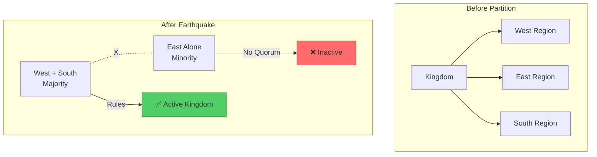
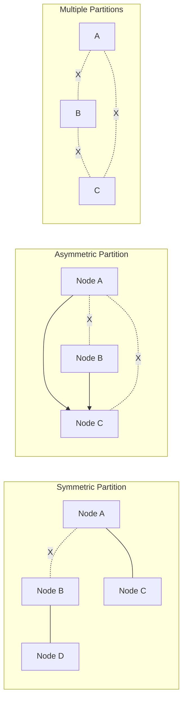
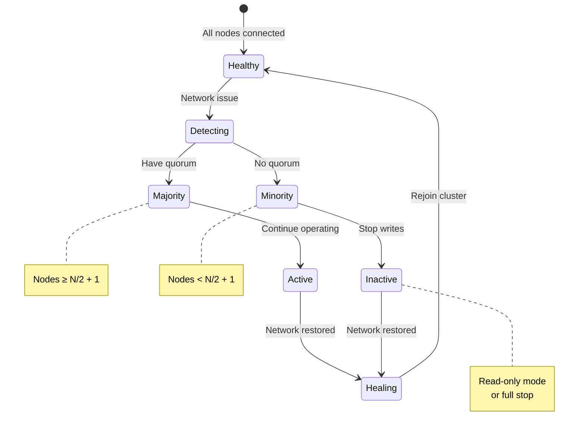
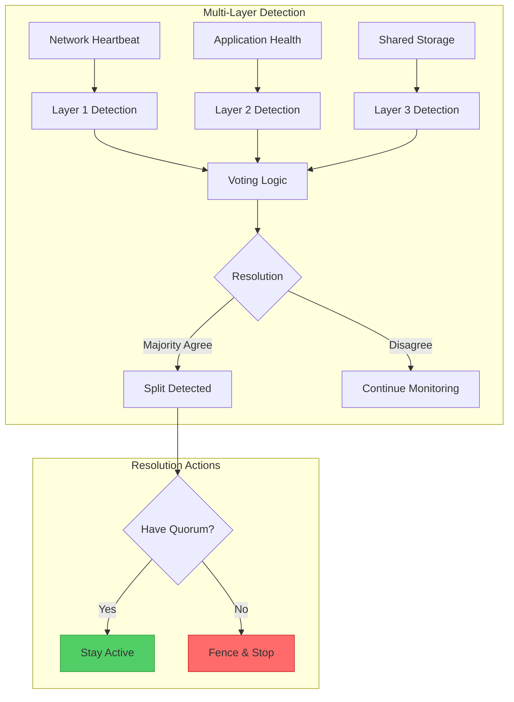
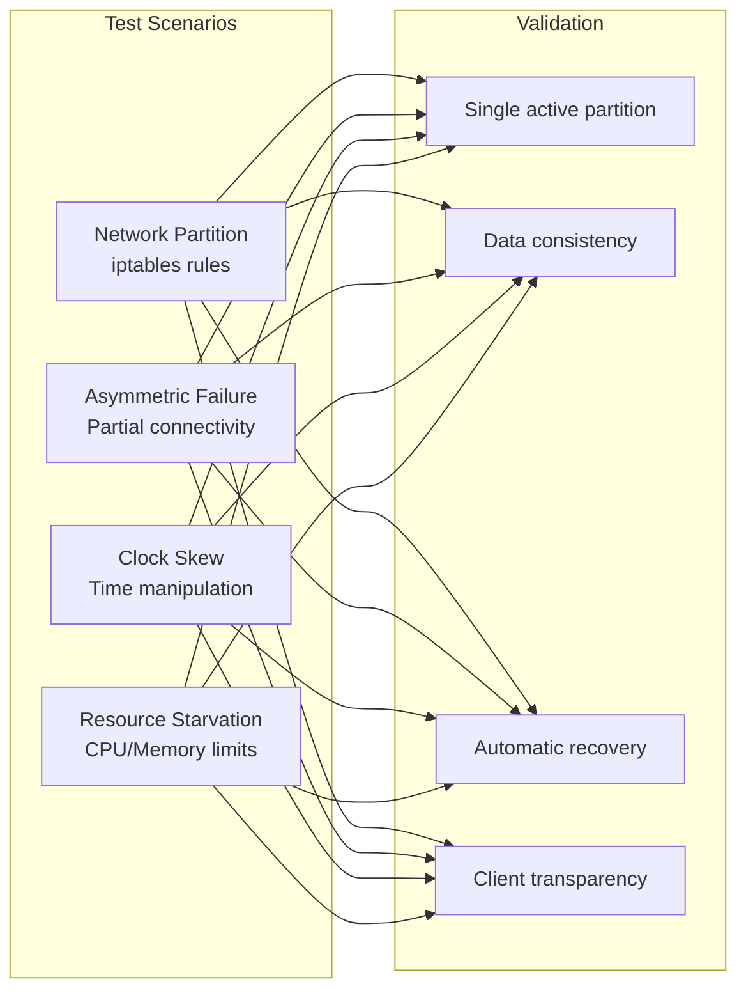
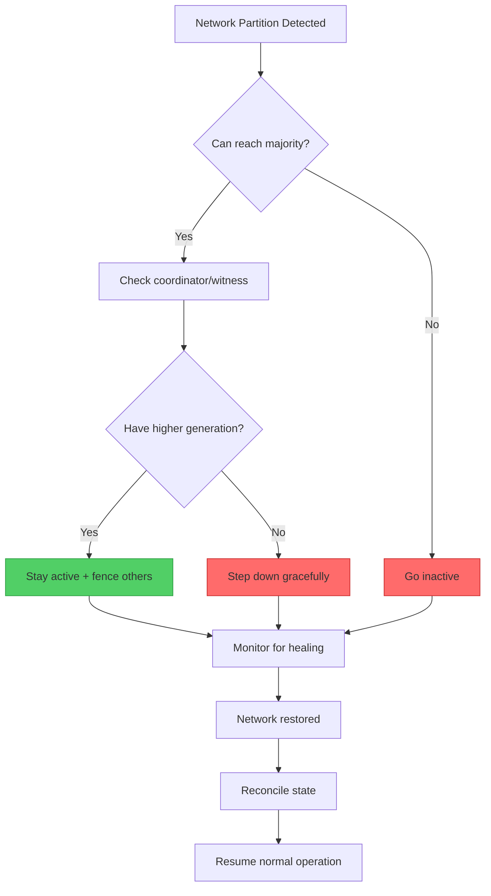

# Split-Brain Detection & Resolution

!!! info "🥈 Silver Tier Pattern"
    **Prevent conflicting decisions during network partitions** • Critical for consistency
    
    Split-brain resolution ensures only one partition remains authoritative during network failures. Essential for distributed databases and cluster managers but requires careful implementation of quorum or external arbitration.
    
    **Best For:** Distributed databases, consensus systems, cluster management

## Essential Question

**How do we prevent conflicting decisions when network partitions divide a distributed system?**

## When to Use / When NOT to Use

### ✅ Use When

| Scenario | Example | Impact |
|----------|---------|--------|
| Distributed databases | MySQL Cluster, MongoDB | Prevent conflicting writes |
| Cluster management | Kubernetes, Mesos | Single leader election |
| Distributed locks | Zookeeper, etcd | Mutual exclusion |
| Master-master replication | Multi-DC databases | Avoid divergent state |

### ❌ DON'T Use When

| Scenario | Why | Alternative |
|----------|-----|-------------|
| Eventually consistent | Conflicts resolved later | CRDTs, vector clocks |
| Read-only systems | No writes to conflict | Simple replication |
| Single datacenter | Network partitions rare | Leader election |
| Stateless services | No state to protect | Load balancing |

## Level 1: Intuition (5 min) {#intuition}

### The Divided Kingdom Analogy



### Core Insight
> **Key Takeaway:** When the network splits, use pre-agreed rules (like majority quorum) to ensure only one partition stays active.

## Level 2: Foundation (10 min) {#foundation}

### The Problem Space

<div class="failure-vignette">
<h4>🚨 What Happens Without Split-Brain Protection</h4>

**GitHub, 2012**: MySQL cluster experienced network partition. Both datacenters promoted masters, accepting writes independently. When partition healed, massive data conflicts required manual resolution and some data loss.

**Impact**: 6-hour outage, data inconsistencies, manual conflict resolution for days
</div>

### Split-Brain Scenarios



### Resolution Strategies

| Strategy | How it Works | Pros | Cons |
|----------|--------------|------|------|
| **Static Quorum** | Majority wins (N/2 + 1) | Simple, predictable | Minority unavailable |
| **Dynamic Quorum** | Adjust based on failures | Better availability | Complex |
| **External Arbitrator** | Third-party decides | Works with 2 nodes | SPOF, latency |
| **Witness/Tiebreaker** | Lightweight arbiter | Low resource | Extra component |

## Level 3: Deep Dive (15 min) {#deep-dive}

### Quorum-Based Resolution



### Implementation Patterns

```yaml
split_brain_config:
  detection:
    method: quorum_based
    cluster_size: 5
    min_quorum: 3
    
  heartbeat:
    interval: 1s
    timeout: 5s
    failure_threshold: 3
    
  resolution:
    strategy: stop_minority
    grace_period: 10s
    
  recovery:
    auto_rejoin: true
    sync_before_activate: true
    conflict_resolution: latest_epoch_wins
```

### Common Pitfalls

<div class="decision-box">
<h4>⚠️ Avoid These Mistakes</h4>

1. **Even number of nodes**: 50/50 split possible → Use odd numbers or add witness
2. **No fencing mechanism**: Old leader continues → Implement STONITH
3. **Slow detection**: Long timeouts → Balance speed vs false positives
4. **No recovery plan**: Manual intervention needed → Automate rejoin process
</div>

## Level 4: Expert (20 min) {#expert}

### Advanced Detection Mechanisms



### Generation-Based Resolution

```python
class GenerationBasedResolver:
    def __init__(self, node_id, coordinator_url):
        self.node_id = node_id
        self.coordinator = coordinator_url
        self.current_generation = 0
        self.is_active = False
        
    async def handle_partition(self):
        """Compete for new generation during partition"""
        try:
            # Try to increment generation
            new_gen = await self.coordinator.increment_generation(
                current=self.current_generation,
                node_id=self.node_id
            )
            
            if new_gen > self.current_generation:
                # We won - stay active
                self.current_generation = new_gen
                self.is_active = True
                await self.announce_leadership(new_gen)
            else:
                # Lost - go inactive
                self.is_active = False
                await self.enter_follower_mode()
                
        except CoordinatorUnreachable:
            # Can't reach coordinator - assume we're in minority
            self.is_active = False
            await self.shutdown_services()
```

### STONITH (Shoot The Other Node In The Head)

| Method | Implementation | Speed | Reliability |
|--------|----------------|-------|-------------|
| **Power Fencing** | IPMI/iLO power off | Fast | Very High |
| **Storage Fencing** | SCSI reservations | Fast | High |
| **Network Fencing** | Switch port disable | Medium | High |
| **Application Fencing** | Process termination | Fast | Medium |

## Level 5: Mastery (25 min) {#mastery}

### Real-World Case Studies

<div class="truth-box">
<h4>💡 MongoDB Replica Set Split-Brain</h4>

**Challenge**: Prevent split-brain in globally distributed replica sets

**Implementation**: 
- Raft-based consensus with term numbers
- Priority-based elections
- Arbiter nodes for even-numbered deployments
- Automatic rollback of minority writes

**Results**: 
- Zero split-brain incidents in production
- <10 second failover time
- Automatic recovery without data loss
- Works across WAN links

**Key Learning**: Use consensus protocols (Raft/Paxos) instead of simple heartbeats for critical systems
</div>

### Testing Split-Brain Scenarios



### Production Patterns

```yaml
# Kubernetes-style split-brain prevention
apiVersion: v1
kind: ConfigMap
metadata:
  name: cluster-config
data:
  quorum.yaml: |
    cluster:
      nodes: 5
      regions:
        - us-east: 2
        - us-west: 2
        - us-central: 1  # Tiebreaker
      
    split_brain_policy:
      detection:
        - network_heartbeat: 5s
        - storage_heartbeat: 10s
        - api_server_lease: 15s
      
      resolution:
        priority:
          1. region_majority
          2. storage_access
          3. highest_node_id
      
      fencing:
        - api_server_lease_revoke
        - pod_eviction
        - node_cordon
```

## Quick Reference

### Decision Flowchart



### Implementation Checklist

**Pre-Implementation**
- [ ] Choose odd number of nodes
- [ ] Design quorum strategy
- [ ] Select arbitrator/witness
- [ ] Plan fencing mechanism

**Implementation**
- [ ] Implement heartbeat monitoring
- [ ] Add generation/epoch tracking
- [ ] Create resolution logic
- [ ] Add automatic recovery

**Post-Implementation**
- [ ] Test all partition scenarios
- [ ] Verify single active partition
- [ ] Test automatic recovery
- [ ] Document procedures

### Related Resources

<div class="grid cards" markdown>

- :material-book-open-variant:{ .lg .middle } **Related Patterns**
    
    ---
    
    - [Leader Election](../coordination/leader-election.md) - Choose single leader
    - [Consensus](../coordination/consensus.md) - Agreement protocols
    - [Fencing Tokens](../coordination/fencing.md) - Prevent old leaders

- :material-flask:{ .lg .middle } **Fundamental Laws**
    
    ---
    
    - [Law 1: Correlated Failure](../../part1-axioms/law1-failure/) - Network partitions happen
    - [Law 2: Asynchronous Reality](../../part1-axioms/law2-asynchrony/) - Can't detect true failure
    - [Law 5: Distributed Knowledge](../../part1-axioms/law5-epistemology/) - Partial views differ

</div>