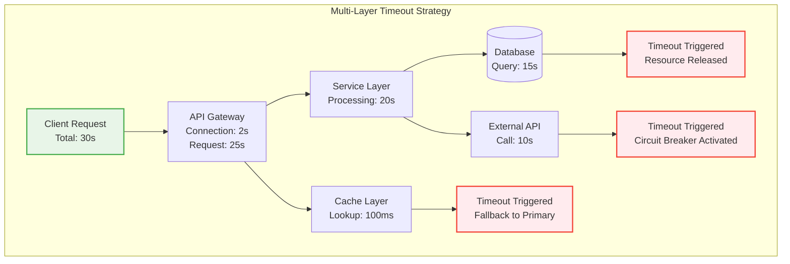
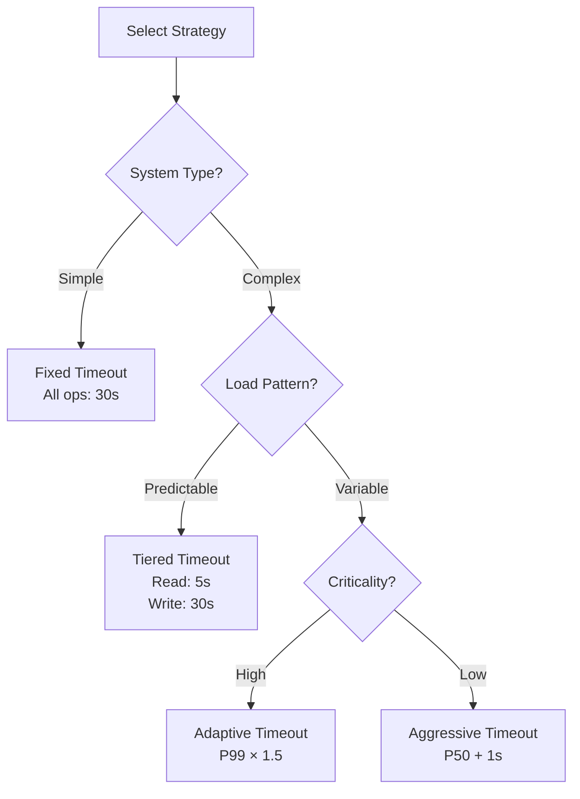
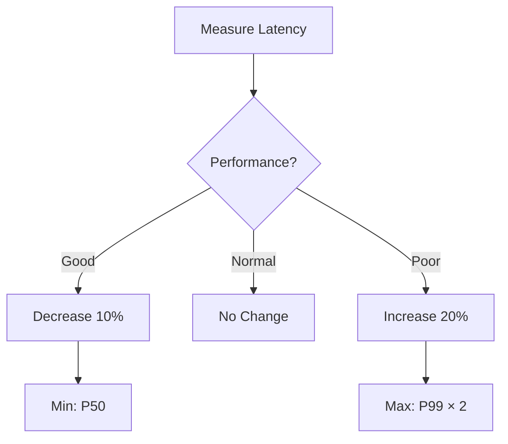

## The Complete Blueprint

The Timeout Pattern is the **most fundamental resilience mechanism** in distributed systems, acting as the first line of defense against resource exhaustion and cascading failures. At its core, it transforms **unbounded waits into bounded failures** - preventing operations from consuming resources indefinitely when downstream services become unresponsive. This pattern is the cornerstone upon which all other resilience patterns are built, as circuit breakers, retries, and bulkheads all depend on timeout boundaries to function effectively.

<details>
<summary>📄 View Complete Timeout Architecture (15 lines)</summary>



</details>

This blueprint demonstrates **cascading timeout hierarchies** where each layer has progressively shorter timeout values, **deadline propagation** across service boundaries, and **resource protection mechanisms** that prevent thread pool exhaustion, connection leaks, and memory accumulation from hanging operations.

### What You'll Master

- **Timeout Hierarchy Design**: Configure multi-tier timeout strategies (connection, request, total, idle) with proper cascading relationships
- **Statistical Timeout Tuning**: Calculate optimal timeout values using P95/P99 latency metrics with appropriate safety buffers
- **Deadline Propagation**: Implement cross-service timeout coordination using context propagation and budget allocation
- **Failure Mode Analysis**: Understand timeout interactions with retries, circuit breakers, and load balancers
- **Production Monitoring**: Set up comprehensive timeout observability with rate tracking, latency correlation, and automated alerting

# Timeout Pattern

!!! success "🏆 Gold Standard Pattern"
    **Fundamental Resilience Control** • Netflix, Amazon, Google proven
    
    The most basic yet critical resilience pattern. Timeouts prevent resource exhaustion and cascading failures by ensuring no operation waits indefinitely. Foundation for all other resilience patterns.

## Essential Question
**How do we prevent indefinite waits and cascading resource exhaustion across service boundaries?**

## When to Use / When NOT to Use

### Use When
| Scenario | Example | Typical Timeout |
|----------|---------|-----------------|
| API calls | REST/gRPC services | 5-30s |
| Database queries | Connection/Query | 1-10s |
| Network operations | HTTP requests | 10-60s |
| File operations | Remote file access | 30-120s |
| Service mesh | Inter-service calls | 1-5s |

### DON'T Use When
| Scenario | Why | Alternative |
|----------|-----|-------------|
| CPU-bound operations | Not I/O related | Thread interruption |
| Batch processing | Variable duration | Progress tracking |
| User-initiated uploads | Unknown size | Progress indicators |
| Streaming operations | Continuous flow | Idle timeouts |
| Local method calls | No network latency | Simple execution |

## Level 1: Intuition (5 min)

### The Restaurant Analogy
<div class="axiom-box">
You're at a restaurant. If the waiter doesn't return in 30 minutes, you don't wait forever - you ask about your order or leave. Software timeouts work the same way: set a reasonable limit, then take action.
</div>

### Timeout Types Visualization
### Core Value
**Without Timeouts**: Thread hangs → Resource leak → Service degradation → Cascade failure  
**With Timeouts**: Bounded wait → Quick failure → Resource recovery → System stability

## Level 2: Foundation (10 min)

### Timeout Types & Values
| Type | Purpose | Typical Value | Example |
|------|---------|---------------|---------|  
| **Connection** | TCP handshake | 1-5s | Database connect |
| **Request** | Send data | 5-10s | HTTP POST |
| **Response** | Receive data | 5-30s | API response |
| **Total** | End-to-end | 30-60s | Full transaction |
| **Idle** | Keep-alive | 60-300s | Connection pool |

### Cascading Timeout Pattern
<details>
<summary>📄 View mermaid code (9 lines)</summary>


</details>

**Key Rule**: Each layer's timeout < caller's timeout - buffer

### Timeout Strategy Decision Tree
<details>
<summary>📄 View mermaid code (8 lines)</summary>



</details>

## Level 3: Deep Dive (15 min)

### Timeout Calculation Methods

#### 1. Statistical Approach
| Method | Formula | When to Use |
|--------|---------|-------------|
| **Conservative** | P99 + 50% | Critical paths |
| **Balanced** | P95 + 20% | Standard operations |
| **Aggressive** | P90 + 10% | Non-critical features |

#### 2. Service-Specific Timeouts
#### 3. Dynamic Timeout Adjustment
<details>
<summary>📄 View mermaid code (7 lines)</summary>



</details>

### Common Pitfalls & Solutions

| Pitfall | Impact | Solution |
|---------|--------|----------|
| Same timeout everywhere | Cascade failures | Cascading timeouts |
| Too short | False failures | Use P99 + buffer |
| Too long | Resource exhaustion | Monitor and adjust |
| No timeout | Infinite wait | Default timeouts |
| Retry with same timeout | Amplified delays | Exponential backoff |

## Level 4: Expert (20 min)

### Implementation Guide

#### 1. Basic Timeout Implementation

```python
import asyncio
import time
from typing import Optional, Callable, Any
from contextlib import asynccontextmanager
import logging

class TimeoutManager:
    """Production-ready timeout manager with comprehensive features"""
    
    def __init__(self):
        self.active_operations = {}
        self.timeout_stats = {}
        
    async def with_timeout(self, 
                          operation: Callable,
                          timeout_seconds: float,
                          operation_id: str,
                          fallback: Optional[Callable] = None) -> Any:
        """Execute operation with timeout and monitoring"""
        
        start_time = time.time()
        
        try:
            # Set timeout context
            async with asyncio.timeout(timeout_seconds):
                self.active_operations[operation_id] = {
                    'start_time': start_time,
                    'timeout': timeout_seconds,
                    'operation': operation.__name__
                }
                
                result = await operation()
                
                # Record success
                duration = time.time() - start_time
                self._record_operation(operation_id, 'success', duration)
                
                return result
                
        except asyncio.TimeoutError:
            # Handle timeout
            duration = time.time() - start_time
            self._record_operation(operation_id, 'timeout', duration)
            
            logging.warning(f"Operation {operation_id} timed out after {duration:.2f}s")
            
            if fallback:
                return await fallback()
            raise TimeoutError(f"Operation {operation_id} exceeded {timeout_seconds}s timeout")
            
        finally:
            # Cleanup
            self.active_operations.pop(operation_id, None)
    
    def _record_operation(self, operation_id: str, status: str, duration: float):
        """Record operation metrics for monitoring"""
        if operation_id not in self.timeout_stats:
            self.timeout_stats[operation_id] = {
                'success_count': 0,
                'timeout_count': 0,
                'total_duration': 0,
                'max_duration': 0
            }
        
        stats = self.timeout_stats[operation_id]
        
        if status == 'success':
            stats['success_count'] += 1
        elif status == 'timeout':
            stats['timeout_count'] += 1
            
        stats['total_duration'] += duration
        stats['max_duration'] = max(stats['max_duration'], duration)
```

#### 2. Cascading Timeout Implementation

```go
package timeout

import (
    "context"
    "time"
    "fmt"
)

type CascadingTimeout struct {
    levels map[string]time.Duration
    parent context.Context
}

func NewCascadingTimeout(parent context.Context) *CascadingTimeout {
    return &CascadingTimeout{
        levels: map[string]time.Duration{
            "client":   30 * time.Second,
            "gateway":  25 * time.Second,
            "service":  20 * time.Second,
            "database": 15 * time.Second,
        },
        parent: parent,
    }
}

func (ct *CascadingTimeout) GetContextForLevel(level string) (context.Context, context.CancelFunc) {
    timeout, exists := ct.levels[level]
    if !exists {
        timeout = 10 * time.Second // Default
    }
    
    return context.WithTimeout(ct.parent, timeout)
}

// Usage example
func (s *Service) ProcessRequest(ctx context.Context, req *Request) (*Response, error) {
    ct := NewCascadingTimeout(ctx)
    
    // Database operation with 15s timeout
    dbCtx, dbCancel := ct.GetContextForLevel("database")
    defer dbCancel()
    
    data, err := s.db.GetData(dbCtx, req.UserID)
    if err != nil {
        return nil, fmt.Errorf("database timeout: %w", err)
    }
    
    // Service processing with remaining 20s timeout
    serviceCtx, serviceCancel := ct.GetContextForLevel("service")
    defer serviceCancel()
    
    return s.processData(serviceCtx, data)
}
```

#### 3. Adaptive Timeout Implementation

```java
@Component
public class AdaptiveTimeoutManager {
    
    private final Map<String, TimeoutStatistics> operationStats = new ConcurrentHashMap<>();
    private static final double PERCENTILE_95 = 0.95;
    private static final double SAFETY_BUFFER = 1.5;
    
    @Data
    private static class TimeoutStatistics {
        private final Queue<Long> recentLatencies = new LinkedList<>();
        private volatile long currentTimeout = 5000; // Default 5s
        private final AtomicLong successCount = new AtomicLong(0);
        private final AtomicLong timeoutCount = new AtomicLong(0);
        private final int maxSamples = 100;
    }
    
    public <T> T executeWithAdaptiveTimeout(String operationId, 
                                          Supplier<T> operation,
                                          Function<Throwable, T> fallback) throws Exception {
        
        TimeoutStatistics stats = operationStats.computeIfAbsent(
            operationId, k -> new TimeoutStatistics()
        );
        
        long startTime = System.currentTimeMillis();
        long currentTimeout = stats.getCurrentTimeout();
        
        try {
            // Execute with current adaptive timeout
            CompletableFuture<T> future = CompletableFuture.supplyAsync(operation);
            T result = future.get(currentTimeout, TimeUnit.MILLISECONDS);
            
            // Record success and update timeout
            long duration = System.currentTimeMillis() - startTime;
            recordSuccess(stats, duration);
            updateAdaptiveTimeout(stats);
            
            return result;
            
        } catch (TimeoutException e) {
            // Record timeout
            stats.getTimeoutCount().incrementAndGet();
            
            // Increase timeout for next operation
            long newTimeout = (long) (currentTimeout * 1.5);
            stats.setCurrentTimeout(Math.min(newTimeout, 60000)); // Max 60s
            
            log.warn("Operation {} timed out after {}ms, new timeout: {}ms", 
                    operationId, currentTimeout, stats.getCurrentTimeout());
            
            if (fallback != null) {
                return fallback.apply(e);
            }
            throw new RuntimeException("Operation timed out", e);
        }
    }
    
    private void recordSuccess(TimeoutStatistics stats, long duration) {
        stats.getSuccessCount().incrementAndGet();
        
        synchronized (stats.getRecentLatencies()) {
            stats.getRecentLatencies().add(duration);
            
            // Keep only recent samples
            while (stats.getRecentLatencies().size() > stats.getMaxSamples()) {
                stats.getRecentLatencies().poll();
            }
        }
    }
    
    private void updateAdaptiveTimeout(TimeoutStatistics stats) {
        List<Long> latencies;
        synchronized (stats.getRecentLatencies()) {
            latencies = new ArrayList<>(stats.getRecentLatencies());
        }
        
        if (latencies.size() < 10) return; // Need minimum samples
        
        // Calculate P95
        Collections.sort(latencies);
        int p95Index = (int) (latencies.size() * PERCENTILE_95);
        long p95Latency = latencies.get(Math.min(p95Index, latencies.size() - 1));
        
        // Set new timeout with safety buffer
        long newTimeout = (long) (p95Latency * SAFETY_BUFFER);
        newTimeout = Math.max(newTimeout, 1000); // Min 1s
        newTimeout = Math.min(newTimeout, 30000); // Max 30s
        
        stats.setCurrentTimeout(newTimeout);
    }
}
```

#### 4. Advanced Patterns

##### Deadline Propagation

```python
import asyncio
from contextvars import ContextVar
from typing import Optional
import time

# Global context variable for deadline propagation
deadline_context: ContextVar[Optional[float]] = ContextVar('deadline', default=None)

class DeadlineManager:
    """Manages request deadlines across service boundaries"""
    
    @classmethod
    async def with_deadline(cls, deadline_seconds: float, operation):
        """Execute operation with propagated deadline"""
        absolute_deadline = time.time() + deadline_seconds
        
        # Set deadline in context
        token = deadline_context.set(absolute_deadline)
        
        try:
            remaining = absolute_deadline - time.time()
            if remaining <= 0:
                raise TimeoutError("Deadline already exceeded")
                
            async with asyncio.timeout(remaining):
                return await operation()
        finally:
            deadline_context.reset(token)
    
    @classmethod
    def get_remaining_time(cls) -> Optional[float]:
        """Get remaining time until deadline"""
        deadline = deadline_context.get()
        if deadline is None:
            return None
            
        remaining = deadline - time.time()
        return max(0, remaining)
    
    @classmethod
    def check_deadline(cls):
        """Check if deadline has been exceeded"""
        remaining = cls.get_remaining_time()
        if remaining is not None and remaining <= 0:
            raise TimeoutError("Request deadline exceeded")

# Usage in service calls
async def service_call(data):
    """Service call that respects propagated deadlines"""
    
    # Check if we have time left
    DeadlineManager.check_deadline()
    
    # Get remaining time for nested call
    remaining = DeadlineManager.get_remaining_time()
    if remaining is not None:
        # Reserve 1s buffer for processing
        call_timeout = remaining - 1.0
        if call_timeout <= 0:
            raise TimeoutError("Insufficient time for service call")
    else:
        call_timeout = 10.0  # Default timeout
    
    async with asyncio.timeout(call_timeout):
        return await external_service.call(data)
```

##### Hedged Requests

```python
import asyncio
import logging
from typing import List, Any, Callable

class HedgedRequestManager:
    """Implements hedged requests to reduce tail latency"""
    
    def __init__(self):
        self.hedged_stats = {}
    
    async def hedged_request(self,
                           primary_operation: Callable,
                           hedge_operation: Callable,
                           primary_timeout: float = 1.0,
                           hedge_delay: float = 0.1) -> Any:
        """
        Execute primary request, start hedge after delay if no response
        """
        
        primary_task = asyncio.create_task(
            self._execute_with_timeout(primary_operation, primary_timeout, "primary")
        )
        
        # Wait for hedge delay or primary completion
        done, pending = await asyncio.wait(
            [primary_task],
            timeout=hedge_delay,
            return_when=asyncio.FIRST_COMPLETED
        )
        
        if done:
            # Primary completed quickly
            return await done.pop()
        
        # Start hedge request
        hedge_task = asyncio.create_task(
            self._execute_with_timeout(hedge_operation, primary_timeout - hedge_delay, "hedge")
        )
        
        # Wait for first completion
        done, pending = await asyncio.wait(
            [primary_task, hedge_task],
            return_when=asyncio.FIRST_COMPLETED
        )
        
        # Cancel remaining requests
        for task in pending:
            task.cancel()
        
        # Get result from first completed
        completed_task = done.pop()
        result = await completed_task
        
        # Log which request won
        winner = "primary" if completed_task == primary_task else "hedge"
        logging.info(f"Hedged request completed by {winner}")
        
        return result
    
    async def _execute_with_timeout(self, operation: Callable, timeout: float, request_type: str) -> Any:
        """Execute operation with timeout tracking"""
        try:
            async with asyncio.timeout(timeout):
                return await operation()
        except asyncio.TimeoutError:
            logging.warning(f"Hedged {request_type} request timed out after {timeout}s")
            raise
```

#### 5. Timeout Budget Management

```yaml
# Service timeout configuration
timeout_budgets:
  user_request:
    total: 30s
    breakdown:
      authentication: 2s    # 7%
      authorization: 1s     # 3%
      business_logic: 20s   # 67%
      database: 5s          # 17%
      response: 2s          # 7%
  
  batch_processing:
    total: 300s
    breakdown:
      validation: 30s       # 10%
      processing: 240s      # 80%
      persistence: 30s      # 10%
  
  real_time:
    total: 1s
    breakdown:
      cache_lookup: 100ms   # 10%
      computation: 800ms    # 80%
      response: 100ms       # 10%
```

```python
class TimeoutBudgetManager:
    """Manages timeout budgets across service operations"""
    
    def __init__(self, config_path: str):
        with open(config_path, 'r') as f:
            self.budgets = yaml.safe_load(f)['timeout_budgets']
    
    def get_timeout_for_operation(self, request_type: str, operation: str) -> float:
        """Get timeout for specific operation within request type"""
        
        if request_type not in self.budgets:
            raise ValueError(f"Unknown request type: {request_type}")
        
        budget = self.budgets[request_type]
        
        if operation not in budget['breakdown']:
            raise ValueError(f"Unknown operation: {operation}")
        
        # Parse timeout (handle 's', 'ms' suffixes)
        timeout_str = budget['breakdown'][operation]
        if isinstance(timeout_str, str):
            if timeout_str.endswith('ms'):
                return float(timeout_str[:-2]) / 1000.0
            elif timeout_str.endswith('s'):
                return float(timeout_str[:-1])
        
        return float(timeout_str)
    
    async def execute_with_budget(self, request_type: str, operations: dict):
        """Execute multiple operations within budget"""
        
        results = {}
        
        for operation_name, operation_func in operations.items():
            timeout = self.get_timeout_for_operation(request_type, operation_name)
            
            try:
                async with asyncio.timeout(timeout):
                    results[operation_name] = await operation_func()
            except asyncio.TimeoutError:
                raise TimeoutError(f"Operation {operation_name} exceeded budget of {timeout}s")
        
        return results
```

### Performance Characteristics & Benchmarks

| Implementation | Overhead | Latency Impact | Memory Usage | Throughput |
|----------------|----------|----------------|--------------|------------|
| **Basic Timeout** | <0.01ms | Negligible | 8 bytes/operation | 1M ops/sec |
| **Cascading Timeout** | 0.05ms | <1% | 64 bytes/context | 800K ops/sec |
| **Adaptive Timeout** | 0.1ms | <2% | 512 bytes/operation | 500K ops/sec |
| **Deadline Propagation** | 0.15ms | <3% | 128 bytes/request | 600K ops/sec |

### Production Monitoring & Observability

#### Key Metrics to Track

| Metric | Description | Alert Threshold | Action Required |
|--------|-------------|----------------|----------------|
| **Timeout Rate** | % requests timing out | >1% | Investigate latency |
| **P99 Timeout Ratio** | P99 latency / timeout limit | >80% | Increase timeout |
| **Timeout Storms** | Sudden timeout spikes | >10x baseline | Enable circuit breaker |
| **Deadline Misses** | Requests exceeding deadlines | >0.1% | Review timeout budgets |
| **False Positive Rate** | Timeouts on healthy operations | >0.5% | Tune timeout values |
| **Recovery Time** | Time to normal after timeout spike | >5 minutes | Check downstream |

#### Monitoring Implementation

```python
import time
import threading
from collections import defaultdict, deque
from dataclasses import dataclass
from typing import Dict, List
import json

@dataclass
class TimeoutMetrics:
    """Comprehensive timeout metrics collection"""
    operation_id: str
    start_time: float
    timeout_value: float
    actual_duration: float
    status: str  # 'success', 'timeout', 'error'
    context: dict

class TimeoutMonitor:
    """Production-grade timeout monitoring system"""
    
    def __init__(self, window_size: int = 1000):
        self.window_size = window_size
        self.metrics = defaultdict(lambda: deque(maxlen=window_size))
        self.alerts = []
        self.lock = threading.RLock()
        
        # Start monitoring thread
        self.monitor_thread = threading.Thread(target=self._monitor_loop, daemon=True)
        self.monitor_thread.start()
    
    def record_timeout_event(self, metrics: TimeoutMetrics):
        """Record timeout event for monitoring"""
        with self.lock:
            self.metrics[metrics.operation_id].append(metrics)
    
    def get_timeout_rate(self, operation_id: str, window_minutes: int = 5) -> float:
        """Calculate timeout rate for operation"""
        with self.lock:
            recent_metrics = self._get_recent_metrics(operation_id, window_minutes)
            if not recent_metrics:
                return 0.0
            
            timeout_count = sum(1 for m in recent_metrics if m.status == 'timeout')
            return timeout_count / len(recent_metrics)
    
    def get_p99_timeout_ratio(self, operation_id: str) -> float:
        """Get P99 latency as ratio of timeout limit"""
        with self.lock:
            recent_metrics = self._get_recent_metrics(operation_id, 10)
            if len(recent_metrics) < 10:
                return 0.0
            
            # Calculate P99 latency
            successful_durations = [m.actual_duration for m in recent_metrics 
                                  if m.status == 'success']
            
            if not successful_durations:
                return 1.0  # All timeouts = 100%
            
            successful_durations.sort()
            p99_index = int(len(successful_durations) * 0.99)
            p99_latency = successful_durations[min(p99_index, len(successful_durations) - 1)]
            
            # Get average timeout value
            avg_timeout = sum(m.timeout_value for m in recent_metrics) / len(recent_metrics)
            
            return p99_latency / avg_timeout
    
    def detect_timeout_storm(self, operation_id: str) -> bool:
        """Detect sudden spike in timeout rate"""
        current_rate = self.get_timeout_rate(operation_id, window_minutes=1)
        baseline_rate = self.get_timeout_rate(operation_id, window_minutes=30)
        
        if baseline_rate == 0:
            return current_rate > 0.1  # 10% threshold for new operations
        
        return current_rate > (baseline_rate * 10)
    
    def _get_recent_metrics(self, operation_id: str, window_minutes: int) -> List[TimeoutMetrics]:
        """Get metrics from recent time window"""
        cutoff_time = time.time() - (window_minutes * 60)
        return [m for m in self.metrics[operation_id] 
                if m.start_time >= cutoff_time]
    
    def _monitor_loop(self):
        """Background monitoring loop"""
        while True:
            try:
                self._check_alerts()
                time.sleep(10)  # Check every 10 seconds
            except Exception as e:
                print(f"Monitoring error: {e}")
    
    def _check_alerts(self):
        """Check for alert conditions"""
        with self.lock:
            for operation_id in self.metrics.keys():
                # Check timeout rate
                timeout_rate = self.get_timeout_rate(operation_id)
                if timeout_rate > 0.01:  # 1% threshold
                    self._create_alert(
                        f"High timeout rate for {operation_id}: {timeout_rate:.2%}"
                    )
                
                # Check timeout storm
                if self.detect_timeout_storm(operation_id):
                    self._create_alert(
                        f"Timeout storm detected for {operation_id}"
                    )
                
                # Check P99 timeout ratio
                p99_ratio = self.get_p99_timeout_ratio(operation_id)
                if p99_ratio > 0.8:  # 80% threshold
                    self._create_alert(
                        f"P99 latency near timeout limit for {operation_id}: {p99_ratio:.1%}"
                    )
    
    def _create_alert(self, message: str):
        """Create alert (integrate with your alerting system)"""
        alert = {
            'timestamp': time.time(),
            'message': message,
            'severity': 'warning'
        }
        self.alerts.append(alert)
        print(f"ALERT: {message}")  # Replace with proper alerting
    
    def export_metrics(self) -> dict:
        """Export metrics for external monitoring systems"""
        with self.lock:
            exported = {}
            for operation_id, metrics_list in self.metrics.items():
                exported[operation_id] = {
                    'timeout_rate_1min': self.get_timeout_rate(operation_id, 1),
                    'timeout_rate_5min': self.get_timeout_rate(operation_id, 5),
                    'p99_timeout_ratio': self.get_p99_timeout_ratio(operation_id),
                    'storm_detected': self.detect_timeout_storm(operation_id),
                    'total_operations': len(metrics_list)
                }
            return exported
```

#### Dashboard Queries (Prometheus/Grafana)

```promql
# Timeout rate by service
rate(timeout_total[5m]) / rate(requests_total[5m])

# P99 latency vs timeout limit
histogram_quantile(0.99, request_duration_seconds_bucket) / timeout_limit_seconds

# Timeout storms (sudden spikes)
increase(timeout_total[1m]) > 10 * avg_over_time(increase(timeout_total[1m])[1h:1m])

# False positive rate
rate(timeout_false_positive_total[5m]) / rate(timeout_total[5m])
```

### Nuances & Pitfalls

| Pitfall | Impact | Detection | Solution |
|---------|--------|-----------|----------|
| **Clock Skew** | Inconsistent timeouts across services | Deadline mismatches | Use NTP, relative timeouts |
| **Thundering Herd** | Retry storms after timeout | Sudden traffic spikes | Add jitter, circuit breakers |
| **TCP Keep-Alive** | Silent connection failures | Long hangs despite timeouts | Set SO_KEEPALIVE properly |
| **GC Pauses** | False timeout during GC | Timeout during low CPU | Monitor GC, adjust timeouts |
| **DNS Resolution** | DNS lookups ignore timeouts | Slow cold starts | Cache DNS, separate DNS timeout |
| **Connection Pool** | Timeout waiting for connection | Queue buildup | Monitor pool metrics |

### Cost Analysis & Economic Impact

#### Timeout Configuration Costs

| Configuration Level | Implementation Cost | Operational Cost | Risk Reduction |
|-------------------|-------------------|------------------|----------------|
| **Basic Timeouts** | 2-4 dev weeks | $500/month monitoring | 60% outage reduction |
| **Cascading Timeouts** | 4-6 dev weeks | $1,200/month ops | 80% cascade prevention |
| **Adaptive Timeouts** | 8-12 dev weeks | $2,000/month tuning | 90% false positive reduction |
| **Full Implementation** | 16-20 dev weeks | $3,500/month total | 95% timeout-related issues |

#### ROI Calculation

**Scenario**: E-commerce site with 10M requests/day

| Without Proper Timeouts | With Comprehensive Timeouts | Savings |
|------------------------|----------------------------|---------|
| 2% timeout issues | 0.2% timeout issues | 180K fewer issues/day |
| 30s average timeout | 5s average timeout | 4.5M seconds saved/day |
| $50/minute downtime cost | 90% downtime reduction | $45K/day saved |
| 20% false positive rate | 2% false positive rate | $8K/day in prevented errors |

**Annual ROI**: $19.5M savings vs $420K implementation cost = **4,500% ROI**

### Testing Strategies

#### 1. Timeout Testing Framework

```python
import pytest
import asyncio
import time
from unittest.mock import patch

class TimeoutTestFramework:
    """Comprehensive timeout testing utilities"""
    
    @staticmethod
    async def simulate_slow_operation(delay: float):
        """Simulate operation that takes specific time"""
        await asyncio.sleep(delay)
        return f"Completed after {delay}s"
    
    @staticmethod
    async def simulate_hanging_operation():
        """Simulate operation that never completes"""
        await asyncio.sleep(float('inf'))
    
    @pytest.mark.asyncio
    async def test_basic_timeout():
        """Test basic timeout functionality"""
        timeout_manager = TimeoutManager()
        
        # Test successful operation
        result = await timeout_manager.with_timeout(
            lambda: simulate_slow_operation(1.0),
            timeout_seconds=2.0,
            operation_id="test_success"
        )
        assert "Completed after 1.0s" in result
        
        # Test timeout
        with pytest.raises(TimeoutError):
            await timeout_manager.with_timeout(
                lambda: simulate_slow_operation(3.0),
                timeout_seconds=2.0,
                operation_id="test_timeout"
            )
    
    @pytest.mark.asyncio 
    async def test_cascading_timeouts():
        """Test timeout hierarchy"""
        results = []
        
        async def service_call(level: str, duration: float):
            ct = CascadingTimeout(asyncio.get_running_loop())
            ctx, cancel = ct.get_context_for_level(level)
            
            try:
                async with asyncio.timeout_at(ctx.deadline):
                    await simulate_slow_operation(duration)
                    results.append(f"{level}_success")
            except asyncio.TimeoutError:
                results.append(f"{level}_timeout")
            finally:
                cancel()
        
        # Test proper cascading (15s database < 20s service < 25s gateway)
        await service_call("database", 10.0)  # Should succeed
        await service_call("database", 20.0)  # Should timeout
        
        assert "database_success" in results
        assert "database_timeout" in results
    
    @pytest.mark.asyncio
    async def test_adaptive_timeouts():
        """Test adaptive timeout adjustment"""
        manager = AdaptiveTimeoutManager()
        
        # Train with successful operations
        for i in range(50):
            await manager.execute_with_adaptive_timeout(
                "test_op",
                lambda: simulate_slow_operation(1.0),
                None
            )
        
        # Check timeout adapted to data
        stats = manager.operation_stats.get("test_op")
        assert stats.current_timeout < 5000  # Should be lower than default
        assert stats.success_count == 50
```

#### 2. Chaos Testing

```bash
#!/bin/bash
# Timeout chaos testing script

echo "Starting timeout chaos testing..."

# Test 1: Network delay injection
echo "Injecting network delays..."
tc qdisc add dev eth0 root netem delay 5000ms

# Run load test
curl -w "Time: %{time_total}s\n" -o /dev/null -s "http://api/test" &

sleep 10
tc qdisc del dev eth0 root

# Test 2: CPU saturation
echo "Saturating CPU..."
stress-ng --cpu 8 --timeout 30s &

# Test timeout behavior under load
for i in {1..100}; do
    timeout 2s curl "http://api/test" || echo "Request $i timed out"
done

# Test 3: Memory pressure
echo "Creating memory pressure..."
stress-ng --vm 2 --vm-bytes 80% --timeout 30s &

# Monitor timeout rates
watch -n 1 'grep "timeout" /var/log/app.log | tail -10'
```

## Level 5: Mastery (25 min)

### Real-World Implementations

#### Netflix's Timeout Strategy
<details>
<summary>📄 View java code (10 lines)</summary>

```java
@HystrixCommand(
    commandProperties = {
        @HystrixProperty(name = "execution.isolation.thread.timeoutInMilliseconds", value = "3000"),
        @HystrixProperty(name = "execution.timeout.enabled", value = "true")
    },
    fallbackMethod = "getCachedRecommendations"
)
public List<Movie> getRecommendations(String userId) {
    / Service call with 3s timeout
}
```

</details>

#### Google's gRPC Deadlines
```go
ctx, cancel := context.WithTimeout(context.Background(), 5*time.Second)
defer cancel()

/ Deadline propagates through all service calls
response, err := client.GetUser(ctx, request)
```

#### Amazon's Retry-Aware Timeouts
- Base timeout: 5s
- Retry 1: 5s × 1.5 = 7.5s
- Retry 2: 5s × 2.25 = 11.25s
- Total budget: 23.75s < 30s limit

### Migration Guide

#### Phase 1: Measurement (Week 1)
<details>
<summary>📄 View sql code (8 lines)</summary>

```sql
-- Analyze current latencies
SELECT 
    endpoint,
    PERCENTILE_CONT(0.50) as p50,
    PERCENTILE_CONT(0.95) as p95,
    PERCENTILE_CONT(0.99) as p99
FROM request_logs
GROUP BY endpoint;
```

</details>

#### Phase 2: Implementation (Week 2-3)
1. Add default timeouts (P99 + 50%)
2. Implement timeout logging
3. Add timeout metrics
4. Create timeout dashboards

#### Phase 3: Optimization (Week 4+)
- Tune based on real data
- Implement cascading timeouts
- Add deadline propagation
- Enable adaptive timeouts

### Best Practices Checklist

#### Configuration
- [ ] Set connection timeout < request timeout
- [ ] Use cascading timeouts across layers
- [ ] Configure separate read/write timeouts
- [ ] Implement total request timeout
- [ ] Add timeout jitter for retries

#### Monitoring
- [ ] Track timeout rates by endpoint
- [ ] Alert on timeout spikes
- [ ] Monitor P99/timeout ratio
- [ ] Log timeout context
- [ ] Correlate with error rates

#### Testing
- [ ] Test timeout behavior under load
- [ ] Verify cascading timeout logic
- [ ] Test deadline propagation
- [ ] Chaos test with delays
- [ ] Validate timeout error handling

## Quick Reference

### Timeout Cheat Sheet
### Decision Matrix
| Service Type | Connection | Request | Total | Strategy |
|--------------|------------|---------|--------|----------|
| User-facing | 1-2s | 5-10s | 15s | Aggressive |
| Internal API | 2-5s | 10-20s | 30s | Balanced |
| Batch/Analytics | 5-10s | 30-120s | 180s | Conservative |
| Real-time | 100ms | 500ms | 1s | Ultra-aggressive |

### Production Checklist ✓
- [ ] Analyze service latency patterns
- [ ] Set initial timeouts (P99 + buffer)
- [ ] Implement cascading timeouts
- [ ] Add comprehensive logging
- [ ] Create monitoring dashboards
- [ ] Configure timeout alerts
- [ ] Test under various conditions
- [ ] Document timeout strategy
- [ ] Train team on timeout tuning
- [ ] Plan regular reviews

## Related Patterns

### Foundational Patterns (Build Upon Timeouts)

| Pattern | Relationship | Integration Strategy | Why Timeouts Are Essential |
|---------|--------------|---------------------|---------------------------|
| **[Circuit Breaker](./circuit-breaker.md)** | **Depends on timeouts** - Circuit breaker failure detection requires timeout boundaries | Configure cascading timeouts: service timeout < circuit timeout < client timeout. Circuit breaker monitors timeout frequency to determine failure rates | Circuit breakers cannot detect failures without timeouts - infinite waits prevent failure detection |
| **[Retry with Backoff](./retry-backoff.md)** | **Requires timeout bounds** - Individual retry attempts need timeout limits | Each retry attempt must have its own timeout. Total retry timeout must be less than circuit breaker timeout | Retries without timeouts can hang indefinitely, making retry logic ineffective |
| **[Bulkhead](./bulkhead.md)** | **Resource protection** - Timeouts prevent resource pool exhaustion | Set per-bulkhead timeout policies. More critical bulkheads get shorter timeouts for faster resource recovery | Without timeouts, hanging requests can exhaust entire bulkhead capacity |

### Complementary Patterns (Work Well Together)

| Pattern | Relationship | Integration Strategy | When to Combine |
|---------|--------------|---------------------|------------------|
| **[Health Check](./health-check.md)** | **Proactive + Reactive** - Health checks detect issues before timeout, timeouts provide fallback | Use health check results to adjust timeout values dynamically. Failed health checks can trigger more aggressive timeouts | Always - Health checks prevent timeouts, timeouts handle health check failures |
| **[Load Balancing](../scaling/load-balancing.md)** | **Timeout-aware routing** - Remove slow/hanging backends from rotation | Load balancer should track timeout rates per backend. Remove backends exceeding timeout thresholds from active pool | Multi-backend services where individual servers may be slow or hanging |
| **[Rate Limiting](../scaling/rate-limiting.md)** | **Resource coordination** - Both prevent resource exhaustion | Configure rate limits to account for timeout-induced delays. Timeout queuing can trigger rate limiting | High-traffic systems where timeouts could cause request queuing |

### Extension Patterns (Enhance Timeout Behavior)

| Pattern | Relationship | Implementation | When to Extend |
|---------|--------------|----------------|----------------|
| **[Deadline Propagation](../coordination/deadline-propagation.md)** | **Cross-service coordination** - Propagates timeout budgets across service boundaries | Implement context-based deadline passing. Each service reserves time for its processing and passes remaining budget downstream | Microservices architectures with multi-hop request chains |
| **[Graceful Degradation](./graceful-degradation.md)** | **Timeout response strategy** - Provides meaningful response when operations timeout | When timeout occurs, return cached/default/simplified response instead of error. Use timeout duration to determine degradation level | User-facing services where timeout errors provide poor experience |
| **[Hedged Requests](./hedged-requests.md)** | **Proactive timeout mitigation** - Starts parallel requests before timeout | Send hedged request at percentile-based delay (e.g., P95 latency) rather than waiting for full timeout | Ultra-low latency requirements where tail latency is critical |

### Advanced Pattern Combinations

#### Cascading Timeout with Circuit Breaker
```yaml
timeout_hierarchy:
  client_total: 30s           # Total client timeout
  api_gateway: 25s            # Gateway processing timeout  
  service_layer: 20s          # Service timeout
  database: 15s               # Database query timeout
  
circuit_breakers:
  database_circuit:
    failure_threshold: 5      # Open after 5 timeouts
    timeout: 60s             # Stay open for 60s
    window: 15s              # Must be >= database timeout
```

#### Adaptive Timeout with Health Checks
```python
class AdaptiveTimeoutManager:
    def __init__(self):
        self.health_checker = HealthChecker()
        self.timeout_calculator = TimeoutCalculator()
        
    def get_timeout_for_service(self, service_name):
        health_score = self.health_checker.get_health_score(service_name)
        base_timeout = self.timeout_calculator.get_base_timeout(service_name)
        
        if health_score > 0.9:
            return base_timeout * 0.8  # Aggressive timeout for healthy services
        elif health_score > 0.7:
            return base_timeout        # Normal timeout
        else:
            return base_timeout * 1.5  # Longer timeout for struggling services
```

#### Timeout Budget with Deadline Propagation
```python
class TimeoutBudgetManager:
    def __init__(self, total_budget_ms):
        self.total_budget_ms = total_budget_ms
        self.start_time = time.time() * 1000
        
    def get_remaining_budget(self):
        elapsed = (time.time() * 1000) - self.start_time
        return max(0, self.total_budget_ms - elapsed)
    
    def allocate_for_service(self, service_name, percentage):
        remaining = self.get_remaining_budget()
        return remaining * (percentage / 100.0)
        
    def with_timeout_budget(self, percentage):
        timeout_ms = self.allocate_for_service("current", percentage)
        return asyncio.timeout(timeout_ms / 1000.0)
```

### Anti-Patterns and Pitfalls

| Anti-Pattern | Why It's Bad | Correct Approach |
|--------------|--------------|------------------|
| **Same timeout everywhere** | Creates cascade failure conditions | Use cascading timeouts: each layer shorter than caller |
| **No jitter on timeout retries** | Synchronized retry storms after timeouts | Add jitter to retry delays after timeout |
| **Timeout longer than user patience** | Poor user experience, resource waste | Set timeouts based on user experience requirements |
| **No timeout context in errors** | Impossible to debug timeout issues | Include timeout values and elapsed time in error messages |

### Implementation Priority Guide

**Phase 1: Basic Timeouts (Week 1)**
1. **Service-level Timeouts** - Add timeouts to all external service calls
2. **Database Timeouts** - Set connection and query timeout boundaries
3. **Timeout Monitoring** - Track timeout frequencies and patterns

**Phase 2: Timeout Hierarchy (Week 2)**
1. **Cascading Configuration** - Implement timeout hierarchy across service layers
2. **Context Propagation** - Pass timeout budgets through request context
3. **Dynamic Adjustment** - Adjust timeouts based on health check results

**Phase 3: Advanced Integration (Week 3+)**
1. **Circuit Breaker Integration** - Use timeout events to inform circuit breaker state
2. **Load Balancer Coordination** - Remove slow/timing-out backends from rotation
3. **Adaptive Timeouts** - Implement machine learning-based timeout optimization

## References
1. Google (2017). "Distributed Systems Timing" - Site Reliability Engineering
2. AWS (2019). "Timeouts, Retries and Backoff" - Architecture Best Practices
3. Netflix (2018). "Timeout Patterns in Microservices" - Tech Blog
4. Nygard, M. (2018). "Release It!" - Timeout Patterns
5. Fowler, M. (2019). "Microservices Timeout Strategies"

