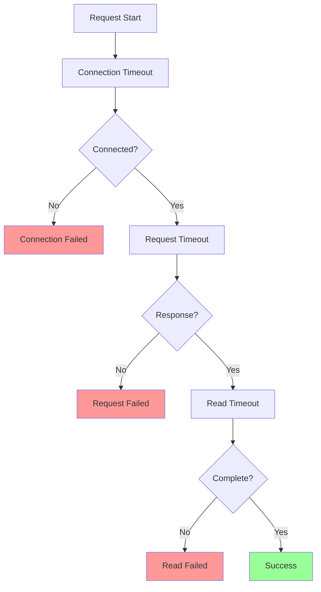
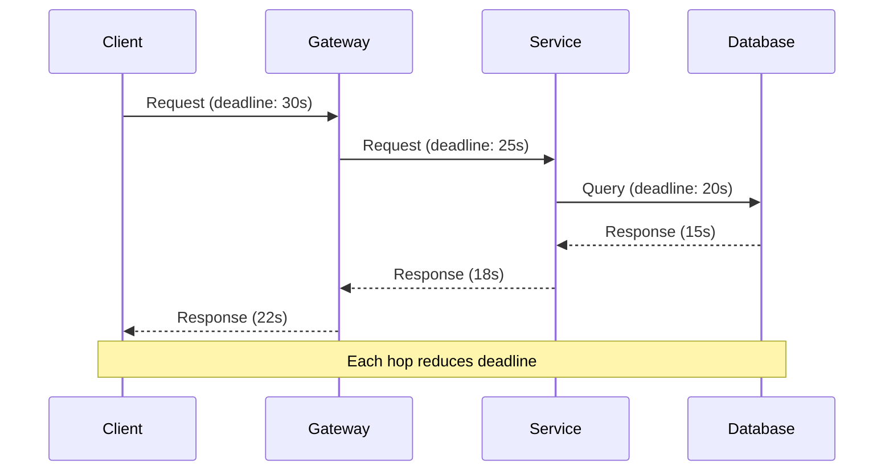

# Timeout Pattern

!!! success "🏆 Gold Standard Pattern"
    **Fundamental Resilience Control** • Netflix, Amazon, Google proven
    
    The most basic yet critical resilience pattern. Timeouts prevent resource exhaustion and cascading failures by ensuring no operation waits indefinitely. Foundation for all other resilience patterns.

## Essential Question
**How do we prevent indefinite waits and cascading resource exhaustion across service boundaries?**

## When to Use / When NOT to Use

### Use When
| Scenario | Example | Typical Timeout |
|----------|---------|-----------------|
| API calls | REST/gRPC services | 5-30s |
| Database queries | Connection/Query | 1-10s |
| Network operations | HTTP requests | 10-60s |
| File operations | Remote file access | 30-120s |
| Service mesh | Inter-service calls | 1-5s |

### DON'T Use When
| Scenario | Why | Alternative |
|----------|-----|-------------|
| CPU-bound operations | Not I/O related | Thread interruption |
| Batch processing | Variable duration | Progress tracking |
| User-initiated uploads | Unknown size | Progress indicators |
| Streaming operations | Continuous flow | Idle timeouts |
| Local method calls | No network latency | Simple execution |

## Level 1: Intuition (5 min)

### The Restaurant Analogy
<div class="axiom-box">
You're at a restaurant. If the waiter doesn't return in 30 minutes, you don't wait forever - you ask about your order or leave. Software timeouts work the same way: set a reasonable limit, then take action.
</div>

### Timeout Types Visualization


### Core Value
**Without Timeouts**: Thread hangs → Resource leak → Service degradation → Cascade failure  
**With Timeouts**: Bounded wait → Quick failure → Resource recovery → System stability

## Level 2: Foundation (10 min)

### Timeout Types & Values
| Type | Purpose | Typical Value | Example |
|------|---------|---------------|---------|  
| **Connection** | TCP handshake | 1-5s | Database connect |
| **Request** | Send data | 5-10s | HTTP POST |
| **Response** | Receive data | 5-30s | API response |
| **Total** | End-to-end | 30-60s | Full transaction |
| **Idle** | Keep-alive | 60-300s | Connection pool |

### Cascading Timeout Pattern


**Key Rule**: Each layer's timeout < caller's timeout - buffer

### Timeout Strategy Decision Tree


## Level 3: Deep Dive (15 min)

### Timeout Calculation Methods

#### 1. Statistical Approach
| Method | Formula | When to Use |
|--------|---------|-------------|
| **Conservative** | P99 + 50% | Critical paths |
| **Balanced** | P95 + 20% | Standard operations |
| **Aggressive** | P90 + 10% | Non-critical features |

#### 2. Service-Specific Timeouts
```yaml
timeouts:
  services:
    payment:
      connection: 5s
      request: 30s
      total: 45s
    search:
      connection: 1s
      request: 3s
      total: 5s
    analytics:
      connection: 2s
      request: 60s
      total: 90s
```

#### 3. Dynamic Timeout Adjustment


### Common Pitfalls & Solutions

| Pitfall | Impact | Solution |
|---------|--------|----------|
| Same timeout everywhere | Cascade failures | Cascading timeouts |
| Too short | False failures | Use P99 + buffer |
| Too long | Resource exhaustion | Monitor and adjust |
| No timeout | Infinite wait | Default timeouts |
| Retry with same timeout | Amplified delays | Exponential backoff |

## Level 4: Expert (20 min)

### Advanced Patterns

#### 1. Deadline Propagation


#### 2. Hedged Requests
| Strategy | Primary Timeout | Backup Timeout | Use Case |
|----------|----------------|----------------|-----------|
| **Aggressive Hedge** | P50 | Immediate | Read-heavy, cached |
| **Conservative Hedge** | P90 | P50 | Expensive operations |
| **Tail Hedge** | P95 | P90 | Latency-sensitive |

#### 3. Timeout Budgets
```yaml
request_budget:
  total: 30s
  breakdown:
    auth: 2s (7%)
    validation: 1s (3%)
    business_logic: 20s (67%)
    database: 5s (17%)
    response: 2s (6%)
```

### Production Monitoring

#### Key Metrics
| Metric | Alert Threshold | Action |
|--------|----------------|--------|
| Timeout rate | >1% | Investigate latency |
| P99 timeout ratio | >80% of limit | Increase timeout |
| Timeout storms | >10x baseline | Circuit breaker |
| Deadline misses | >0.1% | Review budgets |

## Level 5: Mastery (25 min)

### Real-World Implementations

#### Netflix's Timeout Strategy
```java
@HystrixCommand(
    commandProperties = {
        @HystrixProperty(name = "execution.isolation.thread.timeoutInMilliseconds", value = "3000"),
        @HystrixProperty(name = "execution.timeout.enabled", value = "true")
    },
    fallbackMethod = "getCachedRecommendations"
)
public List<Movie> getRecommendations(String userId) {
    // Service call with 3s timeout
}
```

#### Google's gRPC Deadlines
```go
ctx, cancel := context.WithTimeout(context.Background(), 5*time.Second)
defer cancel()

// Deadline propagates through all service calls
response, err := client.GetUser(ctx, request)
```

#### Amazon's Retry-Aware Timeouts
- Base timeout: 5s
- Retry 1: 5s × 1.5 = 7.5s
- Retry 2: 5s × 2.25 = 11.25s
- Total budget: 23.75s < 30s limit

### Migration Guide

#### Phase 1: Measurement (Week 1)
```sql
-- Analyze current latencies
SELECT 
    endpoint,
    PERCENTILE_CONT(0.50) as p50,
    PERCENTILE_CONT(0.95) as p95,
    PERCENTILE_CONT(0.99) as p99
FROM request_logs
GROUP BY endpoint;
```

#### Phase 2: Implementation (Week 2-3)
1. Add default timeouts (P99 + 50%)
2. Implement timeout logging
3. Add timeout metrics
4. Create timeout dashboards

#### Phase 3: Optimization (Week 4+)
- Tune based on real data
- Implement cascading timeouts
- Add deadline propagation
- Enable adaptive timeouts

### Best Practices Checklist

#### Configuration
- [ ] Set connection timeout < request timeout
- [ ] Use cascading timeouts across layers
- [ ] Configure separate read/write timeouts
- [ ] Implement total request timeout
- [ ] Add timeout jitter for retries

#### Monitoring
- [ ] Track timeout rates by endpoint
- [ ] Alert on timeout spikes
- [ ] Monitor P99/timeout ratio
- [ ] Log timeout context
- [ ] Correlate with error rates

#### Testing
- [ ] Test timeout behavior under load
- [ ] Verify cascading timeout logic
- [ ] Test deadline propagation
- [ ] Chaos test with delays
- [ ] Validate timeout error handling

## Quick Reference

### Timeout Cheat Sheet
```yaml
# Service Timeout Defaults
api_gateway:
  connection: 5s
  request: 25s
  idle: 300s

microservice:
  connection: 2s
  request: 20s
  idle: 120s

database:
  connection: 3s
  query: 15s
  transaction: 30s

cache:
  connection: 1s
  get: 100ms
  set: 500ms

# Cascading Formula
next_timeout = current_timeout * 0.8
```

### Decision Matrix
| Service Type | Connection | Request | Total | Strategy |
|--------------|------------|---------|--------|----------|
| User-facing | 1-2s | 5-10s | 15s | Aggressive |
| Internal API | 2-5s | 10-20s | 30s | Balanced |
| Batch/Analytics | 5-10s | 30-120s | 180s | Conservative |
| Real-time | 100ms | 500ms | 1s | Ultra-aggressive |

### Production Checklist ✓
- [ ] Analyze service latency patterns
- [ ] Set initial timeouts (P99 + buffer)
- [ ] Implement cascading timeouts
- [ ] Add comprehensive logging
- [ ] Create monitoring dashboards
- [ ] Configure timeout alerts
- [ ] Test under various conditions
- [ ] Document timeout strategy
- [ ] Train team on timeout tuning
- [ ] Plan regular reviews

## Related Patterns
- **[Circuit Breaker](./circuit-breaker.md)**: Timeouts trigger circuit state changes
- **[Retry with Backoff](./retry-backoff.md)**: Timeout-aware retry strategies
- **[Bulkhead](./bulkhead.md)**: Isolate timeout impacts
- **[Deadline Propagation](../coordination/deadline-propagation.md)**: Cross-service timeout coordination
- **[Health Check](./health-check.md)**: Timeout-based health detection

## References
1. Google (2017). "Distributed Systems Timing" - Site Reliability Engineering
2. AWS (2019). "Timeouts, Retries and Backoff" - Architecture Best Practices
3. Netflix (2018). "Timeout Patterns in Microservices" - Tech Blog
4. Nygard, M. (2018). "Release It!" - Timeout Patterns
5. Fowler, M. (2019). "Microservices Timeout Strategies"