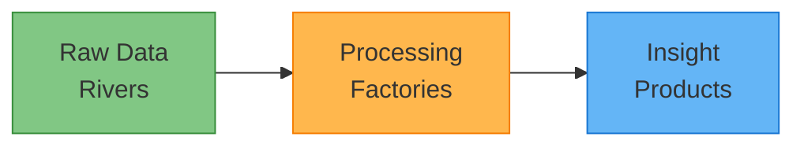
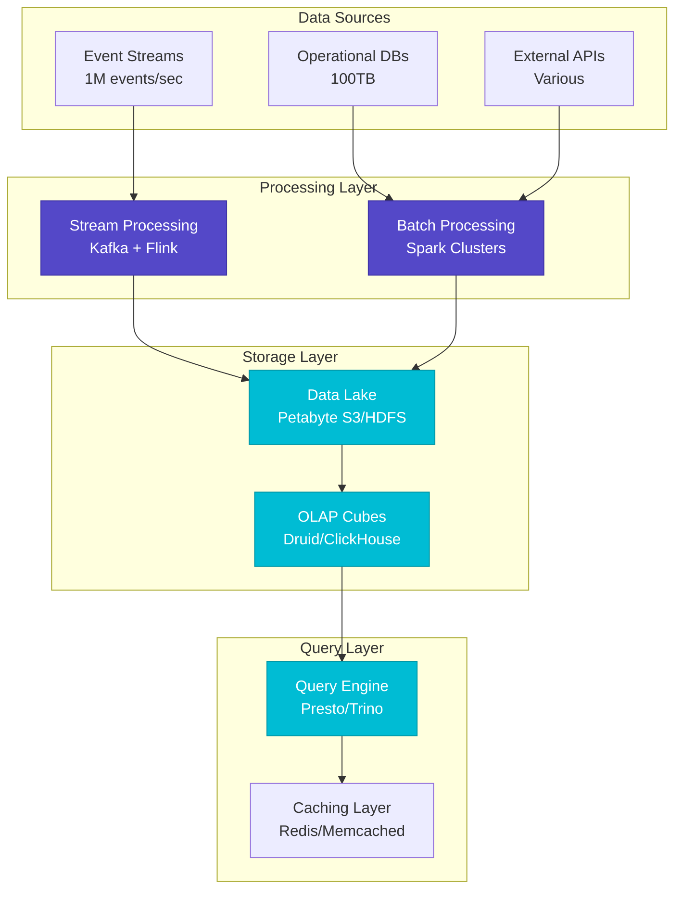
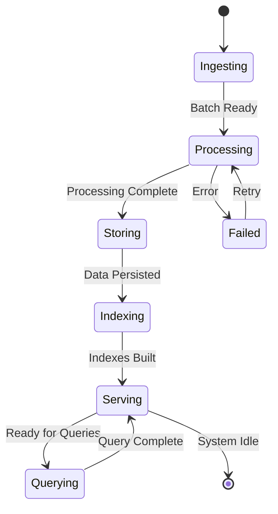
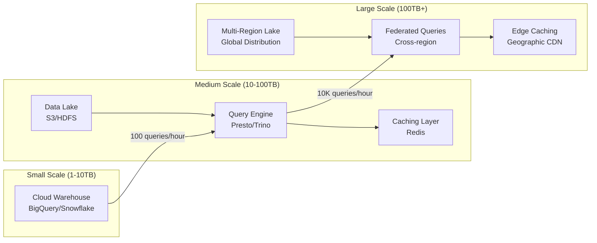
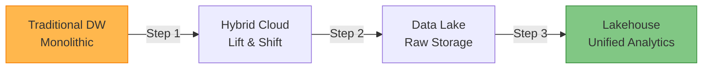
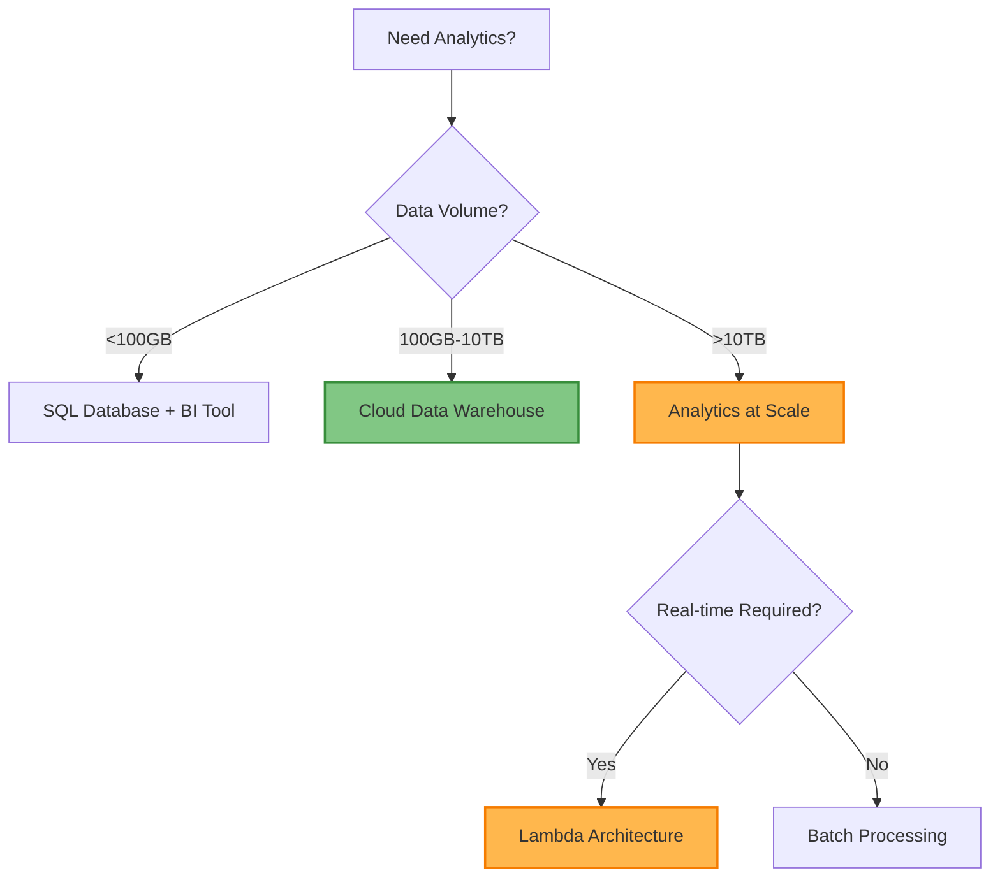

# Analytics at Scale Pattern

!!! info "🥈 Silver Tier Pattern"
    **Petabyte-scale data processing with sub-second query performance** • Netflix, Uber, Airbnb proven at scale
    
    Essential for organizations processing massive datasets but requires significant infrastructure investment and specialized expertise. Modern cloud analytics services reduce complexity considerably.
    
    **Best For:** Business intelligence platforms, real-time dashboards, ML pipelines with >1TB daily data volume

## Essential Question

**How do we process petabyte-scale datasets to deliver sub-second insights to thousands of concurrent analysts?**

## When to Use / When NOT to Use

### ✅ Use When

| Scenario | Example | Impact |
|----------|---------|--------|
| Massive data volumes | >1TB daily, >100TB historical | Sub-second queries on petabytes |
| High user concurrency | >100 concurrent analysts | Support thousands of dashboard users |
| Real-time insights required | Live business metrics | Decisions based on current data |
| Complex analytical queries | Multi-table joins, aggregations | Advanced BI and ML workloads |

### ❌ DON'T Use When

| Scenario | Why | Alternative |
|----------|-----|-------------|
| Small data volumes (<100GB) | Over-engineered, expensive | Operational DB + BI tool |
| Limited budget (<$10K/month) | Infrastructure costs too high | Cloud data warehouse |
| No data engineering team | Requires specialized expertise | Managed analytics services |
| Simple reporting needs | Basic SQL queries sufficient | Traditional data warehouse |

---

## Level 1: Intuition (5 min) {#intuition}

### The Story
Imagine Netflix needs to analyze viewing patterns from 200 million subscribers generating 500TB of data daily. Traditional databases would collapse under this load, but an analytics-at-scale system processes this data in real-time, powering personalized recommendations and business dashboards that help Netflix make million-dollar content decisions in seconds.

### Visual Metaphor


### Core Insight
> **Key Takeaway:** Analytics at scale transforms massive data rivers into instant insights through distributed processing and intelligent storage strategies.

### In One Sentence
Analytics at Scale processes petabyte datasets by distributing computation across hundreds of nodes and pre-aggregating queries to achieve sub-second response times.

## Level 2: Foundation (10 min) {#foundation}

### The Problem Space

<div class="failure-vignette">
<h4>🚨 What Happens Without This Pattern</h4>

**Major Retailer, 2019**: During Black Friday, their traditional analytics system couldn't process the spike in transaction data. Dashboards showed stale data from 4 hours ago, causing executives to make pricing decisions based on outdated information, resulting in $2M in lost revenue from incorrect inventory allocation.

**Impact**: 4-hour data delays, incorrect business decisions, $2M revenue loss
</div>

### How It Works

#### Architecture Overview


#### Key Components

| Component | Purpose | Responsibility |
|-----------|---------|----------------|
| Stream Processing | Real-time data ingestion | Handle high-velocity data streams |
| Data Lake | Massive storage | Store raw and processed data at scale |
| OLAP Engine | Fast aggregations | Pre-compute common query patterns |
| Query Engine | Distributed queries | Execute complex analytical queries |

### Basic Example

```python
# Analytics pipeline core concept
def analytics_pipeline():
    """Shows essential analytics at scale flow"""
    # 1. Ingest streaming data
    stream = kafka_consumer.consume("events")
    
    # 2. Process in micro-batches
    processed = spark.process(stream, batch_size="10s")
    
    # 3. Store in columnar format
    processed.write.parquet("s3://datalake/events/")
    
    # 4. Query with distributed engine
    result = presto.query("SELECT * FROM events WHERE...")
    
    return result
```

## Level 3: Deep Dive (15 min) {#deep-dive}

### Implementation Details

#### State Management


#### Critical Design Decisions

| Decision | Options | Trade-off | Recommendation |
|----------|---------|-----------|----------------|
| **Processing Model** | Lambda<br>Kappa | Lambda: Complex but flexible<br>Kappa: Simple but stream-only | Lambda for mixed workloads |
| **Storage Format** | Row<br>Columnar | Row: Fast writes<br>Columnar: Fast analytics | Columnar (Parquet/ORC) |
| **Query Engine** | Presto<br>Spark SQL | Presto: Low latency<br>Spark: Better for ETL | Presto for interactive queries |

### Common Pitfalls

<div class="decision-box">
<h4>⚠️ Avoid These Mistakes</h4>

1. **Over-engineering Early**: Starting with complex architecture before validating requirements → Begin with cloud data warehouse, scale gradually
2. **Ignoring Data Quality**: Poor data leads to wrong business decisions → Implement validation pipelines from day one  
3. **No Query Optimization**: Slow dashboards frustrate users → Proper indexing, partitioning, and caching strategy
</div>

### Production Considerations

#### Performance Characteristics

| Metric | Typical Range | Optimization Target |
|--------|---------------|-------------------|
| Query Latency | 100ms-10s | <1s for dashboards |
| Throughput | 1K-100K queries/hour | Scale with user growth |
| Data Freshness | 1min-1hour | <5min for real-time use cases |
| Storage Efficiency | 50-90% compression | Minimize storage costs |

## Level 4: Expert (20 min) {#expert}

### Advanced Techniques

#### Optimization Strategies

1. **Pre-aggregation with OLAP Cubes**
   - When to apply: Repetitive dashboard queries on large datasets
   - Impact: 100-1000x query performance improvement
   - Trade-off: Additional storage cost and complexity

2. **Adaptive Query Caching**
   - When to apply: Popular queries with stable results
   - Impact: 80-95% latency reduction for cached queries
   - Trade-off: Cache invalidation complexity

### Scaling Considerations



### Monitoring & Observability

#### Key Metrics to Track

| Metric | Alert Threshold | Dashboard Panel |
|--------|----------------|-----------------|
| Query Latency P95 | >5 seconds | Response time distribution |
| Data Freshness | >15 minutes | Time since last update |
| System Error Rate | >1% | Failed queries over time |
| Cost per Query | >$0.10 | Resource utilization trends |

## Level 5: Mastery (30 min) {#mastery}

### Real-World Case Studies

#### Case Study 1: Netflix at Scale

<div class="truth-box">
<h4>💡 Production Insights from Netflix</h4>

**Challenge**: Process 500TB daily viewing data to power recommendations for 200M+ users

**Implementation**: 
- Lambda architecture with Kafka + Spark for batch processing
- Druid for real-time analytics serving
- S3 data lake with 100PB storage

**Results**: 
- Query Latency: <1s for 99% of dashboard queries
- Data Volume: 500TB/day processed with 99.9% reliability
- User Impact: Powers personalization for 200M+ subscribers

**Lessons Learned**: Pre-aggregation is crucial for user-facing analytics; invest heavily in data quality pipelines
</div>

### Pattern Evolution

#### Migration from Legacy



#### Future Directions

| Trend | Impact on Pattern | Adaptation Strategy |
|-------|------------------|-------------------|
| **Serverless Computing** | Reduced operational overhead | Adopt managed services (BigQuery, Athena) |
| **Real-time ML** | Tighter integration needed | Stream processing with ML inference |
| **Data Mesh** | Decentralized ownership | Federated query engines across domains |

### Pattern Combinations

#### Works Well With

| Pattern | Combination Benefit | Integration Point |
|---------|-------------------|------------------|
| [CQRS](../architecture/cqrs.md) | Separate read/write models | Query-optimized analytics storage |
| [Event Sourcing](../data-management/event-sourcing.md) | Complete audit trail | Event streams feed analytics pipeline |
| [Cache-Aside](../scaling/caching-strategies.md) | Faster query response | Cache frequent analytical results |

## Quick Reference

### Decision Matrix



### Comparison with Alternatives

| Aspect | Analytics at Scale | Cloud Data Warehouse | Operational Analytics |
|--------|-------------------|---------------------|---------------------|
| Complexity | High | Medium | Low |
| Performance | Excellent (<1s) | Good (1-5s) | Poor (>10s) |
| Scalability | Unlimited | High (100TB+) | Limited (<1TB) |
| Cost | High ($100K+/month) | Medium ($10K+/month) | Low (<$1K/month) |
| When to use | >10TB, >100 users | 1-10TB, <100 users | <1TB, <10 users |

### Implementation Checklist

**Pre-Implementation**
- [ ] Validated data volume >1TB daily or >100TB historical
- [ ] Confirmed >100 concurrent analyst requirement
- [ ] Budget approved for $100K+ infrastructure investment
- [ ] Data engineering team hired or trained

**Implementation**  
- [ ] Data lake infrastructure deployed (S3/HDFS)
- [ ] Stream processing pipeline established (Kafka + Flink)
- [ ] Query engine configured (Presto/Trino)
- [ ] Monitoring and alerting implemented

**Post-Implementation**
- [ ] Performance benchmarks established (<1s query latency)
- [ ] Cost monitoring and optimization implemented
- [ ] Data quality validation pipelines deployed
- [ ] User training and documentation completed

### Related Resources

<div class="grid cards" markdown>

- :material-book-open-variant:{ .lg .middle } **Related Patterns**
    
    ---
    
    - [Stream Processing](../data-management/streaming.md) - Real-time data ingestion
    - [CQRS](../architecture/cqrs.md) - Separate analytics queries  
    - [Data Lake](../data-management/data-lake.md) - Massive storage foundation

- :material-flask:{ .lg .middle } **Fundamental Laws**
    
    ---
    
    - [Law 2: Asynchronous Reality](../../part1-axioms/law2/) - Distributed processing
    - [Law 4: Multidimensional Optimization](../../part1-axioms/law4/) - Performance vs. cost trade-offs

- :material-pillar:{ .lg .middle } **Foundational Pillars**
    
    ---
    
    - [State Distribution](../../part2-pillars/state/) - Distributed data storage
    - [Work Distribution](../../part2-pillars/work/) - Parallel query processing

- :material-tools:{ .lg .middle } **Implementation Guides**
    
    ---
    
    - [Analytics Setup Guide](../../excellence/guides/analytics-setup.md)
    - [Performance Optimization](../../excellence/guides/query-optimization.md)
    - [Cost Management](../../excellence/guides/analytics-cost-control.md)

</div>