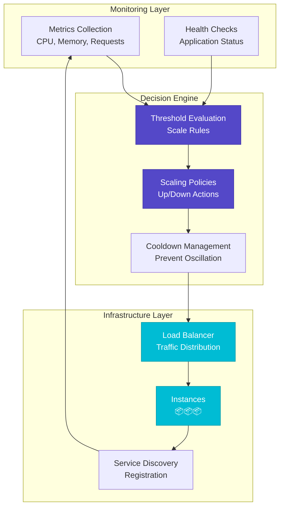
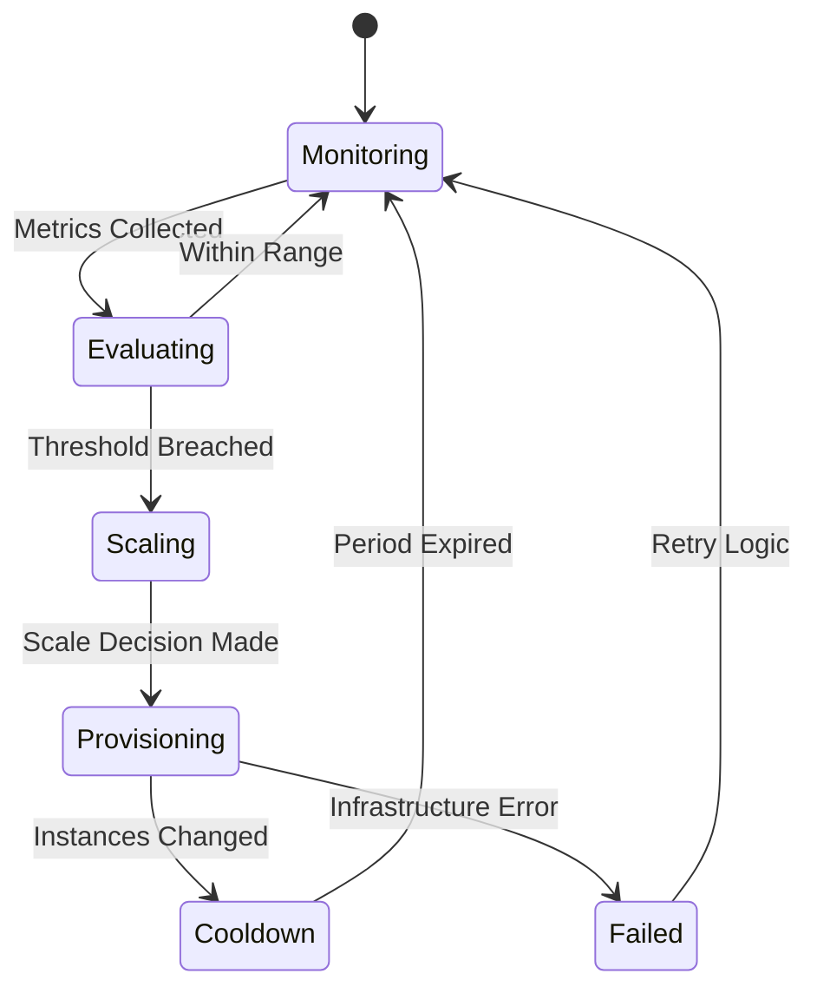
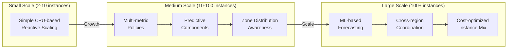
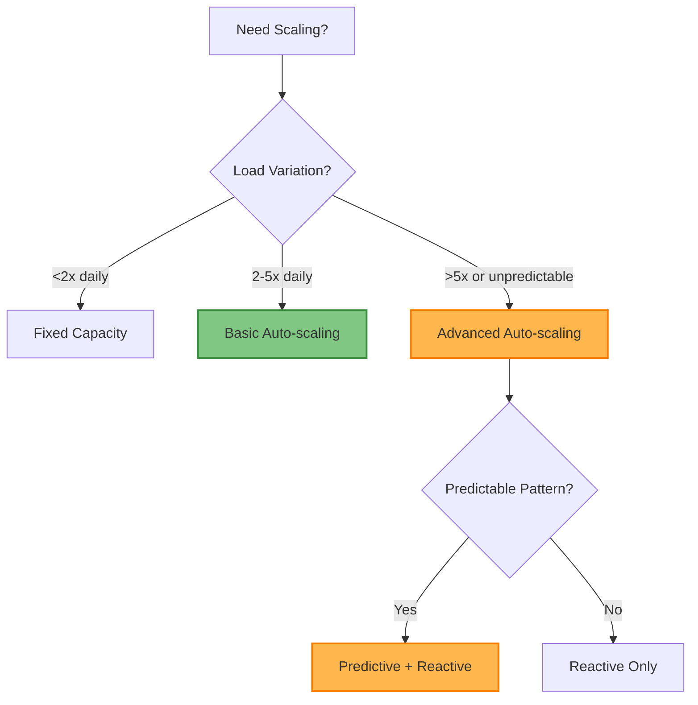

# Auto-scaling Pattern

!!! info "🥈 Silver Tier Pattern"
    **Dynamic resource scaling that adapts to demand patterns** • Uber, Netflix, Spotify proven at scale
    
    Powerful for handling variable workloads but requires careful tuning to avoid oscillation and cold start issues. Success depends on proper metrics selection, threshold configuration, and cooldown management.
    
    **Best For:** Cloud-native applications with predictable or measurable load patterns requiring cost optimization

## Essential Question

**How do we automatically adjust system capacity to match fluctuating demand while minimizing costs and maintaining performance?**

## When to Use / When NOT to Use

### ✅ Use When

| Scenario | Example | Impact |
|----------|---------|--------|
| Variable load patterns | >3x daily traffic variation | 20-60% cost savings through right-sizing |
| Cloud-native architecture | Stateless microservices | Automatic capacity adjustment |
| Cost optimization pressure | Budget constraints | Eliminate over-provisioning waste |
| Predictable scaling patterns | Business hours, seasonal spikes | Proactive resource management |

### ❌ DON'T Use When

| Scenario | Why | Alternative |
|----------|-----|-------------|
| Constant load (<20% variation) | No benefit, adds complexity | Fixed capacity provisioning |
| Stateful services | Data consistency issues | Manual scaling with coordination |
| Sub-minute response requirements | Scale-up delay too high | Over-provision with buffer |
| Complex dependencies | Coordinated scaling needed | Orchestrated manual scaling |

---

## Level 1: Intuition (5 min) {#intuition}

### The Story
Imagine a restaurant that automatically adds tables during busy hours and removes them when quiet. Auto-scaling works similarly - when your application sees increased traffic (hungry customers), it automatically spins up more servers (adds tables). When traffic decreases, it removes unnecessary servers to save money, just like the restaurant storing unused tables.

### Visual Metaphor


### Core Insight
> **Key Takeaway:** Auto-scaling automatically matches resource capacity to actual demand, reducing costs during low usage while maintaining performance during spikes.

### In One Sentence
Auto-scaling monitors system metrics and automatically adds or removes compute resources based on predefined thresholds to optimize cost and performance.

## Level 2: Foundation (10 min) {#foundation}

### The Problem Space

<div class="failure-vignette">
<h4>🚨 What Happens Without This Pattern</h4>

**E-commerce Company, 2020**: During Black Friday, their fixed-capacity system couldn't handle 10x normal traffic. Customer checkout failures lasted 4 hours, resulting in $5M lost sales. Meanwhile, during off-peak hours, they paid for 80% unused server capacity year-round, wasting $200K annually.

**Impact**: $5M revenue loss, 80% resource waste, poor customer experience
</div>

### How It Works

#### Architecture Overview


#### Key Components

| Component | Purpose | Responsibility |
|-----------|---------|----------------|
| Metrics Collection | Monitor system health | Track CPU, memory, request rate, latency |
| Decision Engine | Evaluate scaling rules | Apply thresholds and cooldown logic |
| Infrastructure Manager | Execute scaling actions | Launch/terminate instances, update load balancer |
| Health Checks | Validate instance readiness | Ensure new instances are serving traffic |

### Basic Example

```python
# Auto-scaling core concept
def auto_scaling_logic():
    """Shows essential auto-scaling decision flow"""
    # 1. Collect current metrics
    cpu_usage = get_average_cpu_usage()
    instance_count = get_current_instances()
    
    # 2. Apply scaling rules
    if cpu_usage > 80 and not in_cooldown():
        scale_out(instance_count * 1.5)  # 50% increase
    elif cpu_usage < 30 and instance_count > min_instances:
        scale_in(instance_count * 0.8)   # 20% decrease
    
    # 3. Start cooldown period
    start_cooldown(minutes=5)
```

## Level 3: Deep Dive (15 min) {#deep-dive}

### Implementation Details

#### State Management


#### Critical Design Decisions

| Decision | Options | Trade-off | Recommendation |
|----------|---------|-----------|----------------|
| **Scaling Metric** | CPU vs Request Rate | CPU: Simple<br>Request Rate: More accurate | Request rate for web apps |
| **Scaling Speed** | Conservative vs Aggressive | Conservative: Slower but stable<br>Aggressive: Fast but risky | Start conservative, tune based on data |
| **Instance Type** | Uniform vs Mixed | Uniform: Simple<br>Mixed: Cost optimized | Mixed with spot instances |

### Common Pitfalls

<div class="decision-box">
<h4>⚠️ Avoid These Mistakes</h4>

1. **Scaling Too Quickly**: Aggressive thresholds cause flapping → Use appropriate cooldown periods (5-10 minutes)
2. **Wrong Metrics**: CPU doesn't reflect application load → Use request rate or queue depth for better accuracy
3. **No Maximum Limits**: Runaway scaling costs → Always set reasonable max instance limits
</div>

### Production Considerations

#### Performance Characteristics

| Metric | Typical Range | Optimization Target |
|--------|---------------|-------------------|
| Scale-up Time | 2-5 minutes | <3 minutes including cold start |
| Scale-down Time | 5-10 minutes | Conservative to avoid oscillation |
| Metric Collection | 30-60 seconds | Balance responsiveness vs overhead |
| Cost Reduction | 20-60% | Depends on load variation |

## Level 4: Expert (20 min) {#expert}

### Advanced Techniques

#### Optimization Strategies

1. **Predictive Scaling with ML**
   - When to apply: Regular, predictable traffic patterns
   - Impact: Proactive scaling eliminates scale-up delays
   - Trade-off: Complexity vs improved user experience

2. **Multi-Metric Scaling Policies**
   - When to apply: Complex applications with multiple bottlenecks
   - Impact: More accurate scaling decisions
   - Trade-off: Configuration complexity vs precision

### Scaling Considerations



### Monitoring & Observability

#### Key Metrics to Track

| Metric | Alert Threshold | Dashboard Panel |
|--------|----------------|-----------------|
| Scaling Events | >5 per hour | Scaling frequency and triggers |
| Time to Scale | >5 minutes | Scale-up/down duration tracking |
| Cost per Request | 20% increase | Resource efficiency monitoring |
| Flapping Detection | >3 events in 10min | Oscillation prevention alerts |

## Level 5: Mastery (30 min) {#mastery}

### Real-World Case Studies

#### Case Study 1: Netflix at Scale

<div class="truth-box">
<h4>💡 Production Insights from Netflix</h4>

**Challenge**: Handle massive traffic spikes during popular show releases while optimizing AWS costs

**Implementation**: 
- Scryer predictive scaling using ensemble ML models
- Multiple scaling policies based on request rate, CPU, and custom metrics
- Chaos engineering to test scaling behavior under failures

**Results**: 
- Scale-up Time: <2 minutes for 10x traffic increase
- Cost Savings: 35% reduction in compute costs
- Reliability: 99.99% availability during major content launches

**Lessons Learned**: Predictive scaling is essential for known traffic patterns; always test scaling under failure conditions
</div>

### Pattern Evolution

#### Migration from Fixed Capacity


#### Future Directions

| Trend | Impact on Pattern | Adaptation Strategy |
|-------|------------------|-------------------|
| **Serverless Computing** | Finer-grained scaling | Function-level auto-scaling |
| **Edge Computing** | Geographic scaling | Location-aware scaling policies |
| **Kubernetes** | Container orchestration | Pod-level horizontal scaling |

### Pattern Combinations

#### Works Well With

| Pattern | Combination Benefit | Integration Point |
|---------|-------------------|------------------|
| [Load Balancing](load-balancing.md) | Traffic distribution during scaling | Instance registration/deregistration |
| [Circuit Breaker](../resilience/circuit-breaker.md) | Graceful degradation during scale-up | Prevent cascade failures |
| [Health Check](../resilience/health-check.md) | Instance readiness validation | Safe traffic routing |

## Quick Reference

### Decision Matrix



### Comparison with Alternatives

| Aspect | Auto-scaling | Fixed Capacity | Manual Scaling |
|--------|-------------|----------------|----------------|
| Cost Efficiency | High (20-60% savings) | Low (overprovisioning) | Medium (delayed response) |
| Operational Overhead | Low (automated) | Very Low | High (manual work) |
| Response Time | Medium (2-5 min) | Instant | Slow (hours) |
| Complexity | Medium-High | Low | Low |
| When to use | Variable loads | Constant loads | Development/testing |

### Implementation Checklist

**Pre-Implementation**
- [ ] Analyzed traffic patterns to confirm >2x variation
- [ ] Verified application is stateless and scalable
- [ ] Identified appropriate scaling metrics (CPU, request rate)
- [ ] Set realistic min/max instance limits

**Implementation**
- [ ] Configured basic reactive scaling policies
- [ ] Set up monitoring for scaling events and costs
- [ ] Implemented health checks for new instances
- [ ] Established cooldown periods to prevent flapping

**Post-Implementation**
- [ ] Load tested scaling behavior under various scenarios
- [ ] Tuned thresholds based on real traffic data
- [ ] Set up alerting for scaling anomalies
- [ ] Documented scaling policies and troubleshooting procedures

### Related Resources

<div class="grid cards" markdown>

- :material-book-open-variant:{ .lg .middle } **Related Patterns**
    
    ---
    
    - [Load Balancing](load-balancing.md) - Traffic distribution foundation
    - [Health Check](../resilience/health-check.md) - Instance readiness validation
    - [Circuit Breaker](../resilience/circuit-breaker.md) - Failure protection during scaling

- :material-flask:{ .lg .middle } **Fundamental Laws**
    
    ---
    
    - [Law 2: Asynchronous Reality](../../part1-axioms/law2/) - Distributed scaling coordination
    - [Law 7: Economic Reality](../../part1-axioms/law7/) - Cost optimization trade-offs

- :material-pillar:{ .lg .middle } **Foundational Pillars**
    
    ---
    
    - [Work Distribution](../../part2-pillars/work/) - Distributing load across instances
    - [Control Distribution](../../part2-pillars/control/) - Distributed scaling decisions

- :material-tools:{ .lg .middle } **Implementation Guides**
    
    ---
    
    - [Auto-scaling Setup Guide](../../excellence/guides/autoscaling-setup.md)
    - [Metrics Selection Guide](../../excellence/guides/scaling-metrics.md)
    - [Cost Optimization Guide](../../excellence/guides/scaling-cost-optimization.md)

</div>