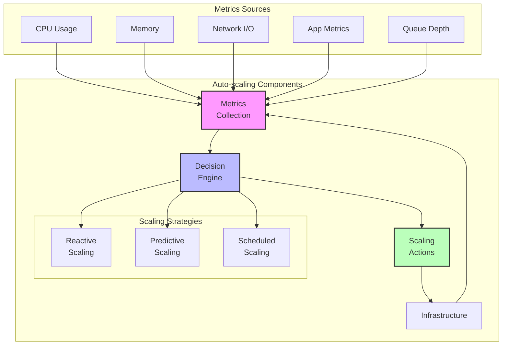
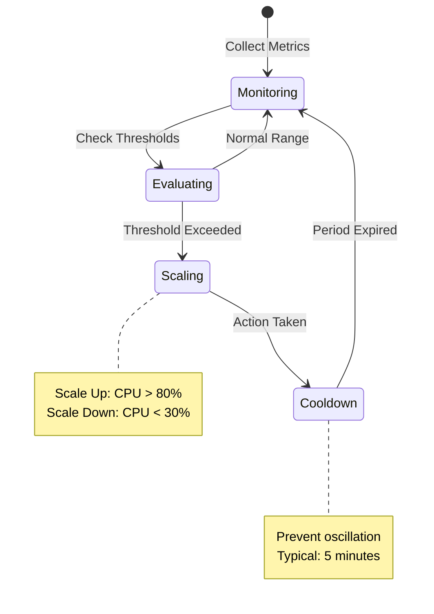
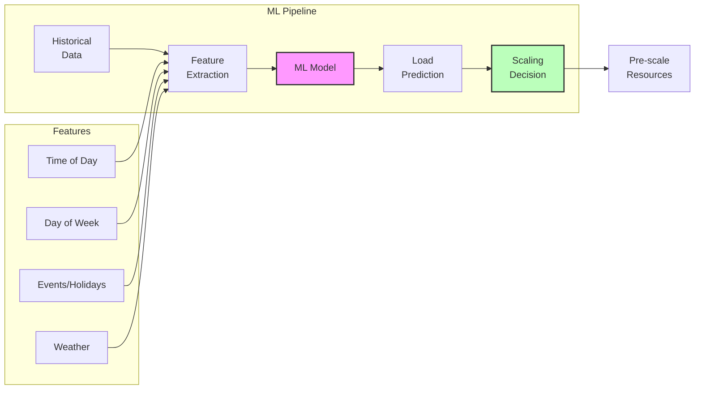
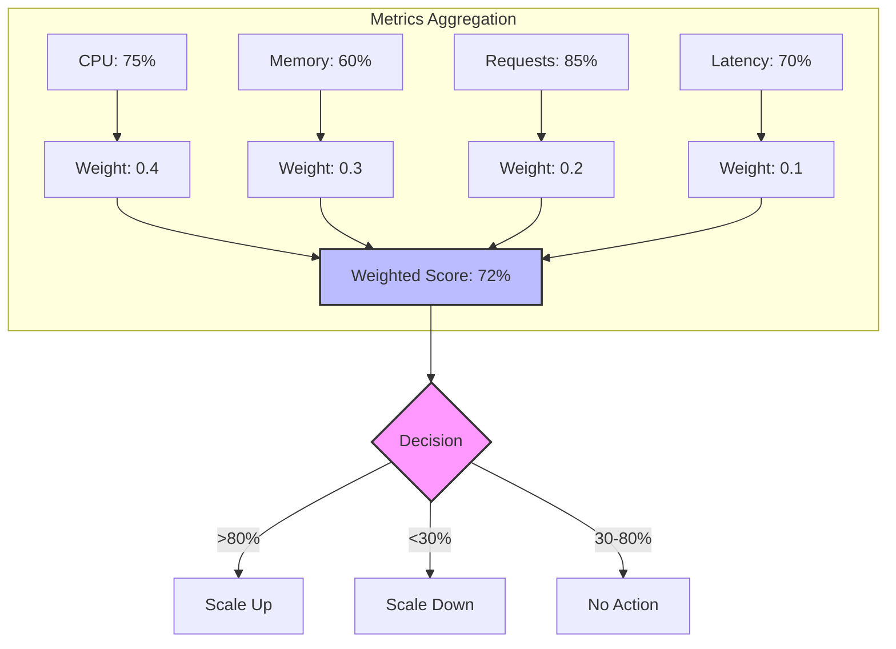
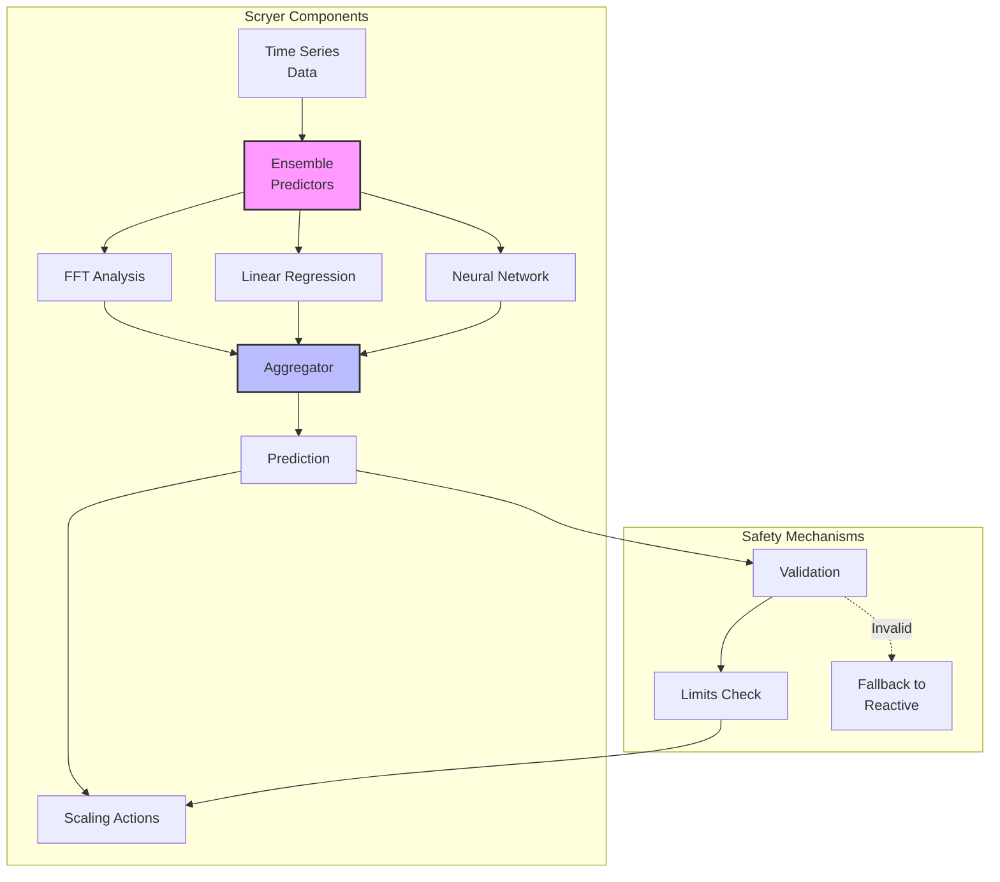
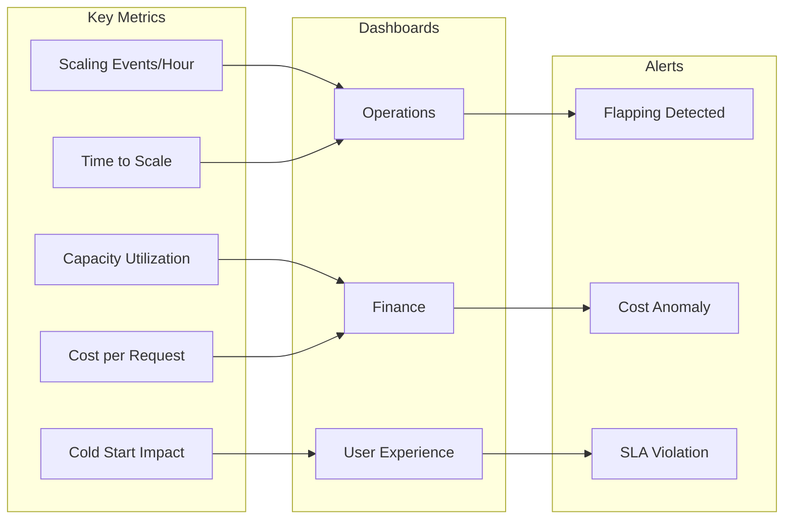
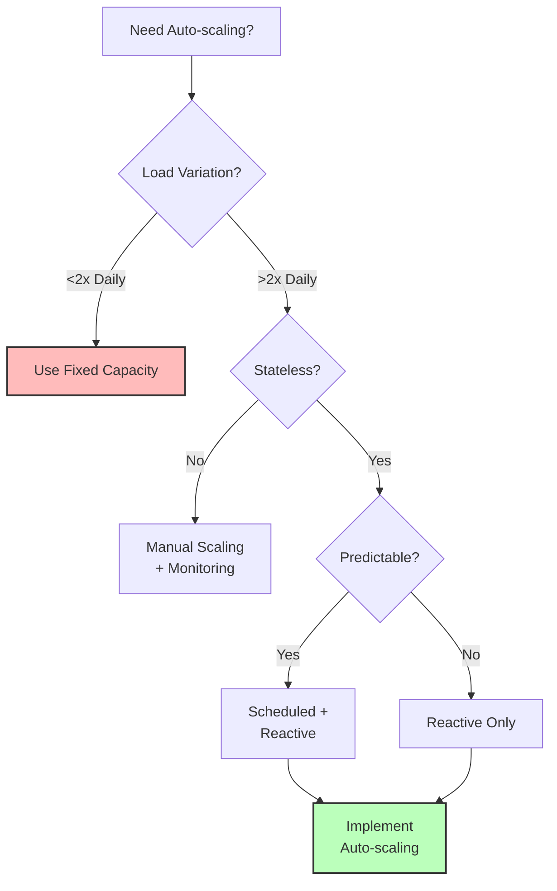

# Auto-scaling Pattern

!!! warning "🥈 Silver Tier Pattern"
    **Powerful but requires careful tuning** • Use when you have variable workloads
    
    Auto-scaling can save costs and handle spikes, but misconfiguration leads to thrashing, cold starts, and instability. Requires continuous monitoring and adjustment of scaling policies, thresholds, and cooldown periods to work effectively.

## Essential Questions

!!! question "Before Implementing Auto-scaling"
    1. **What's your traffic pattern?** Daily peaks? Seasonal? Unpredictable spikes?
    2. **What's your cold start time?** Can users tolerate 30s-5min delays?
    3. **What metrics correlate with load?** CPU? Memory? Queue depth? Custom metrics?
    4. **What's your cost tolerance?** Over-provision for safety or optimize aggressively?
    5. **Do you have stateful services?** Connection draining? Session affinity?

## When to Use / When NOT to Use

### Use Auto-scaling When:
- ✅ **Variable Load**: Traffic varies >3x daily or weekly
- ✅ **Cloud Environment**: Running on AWS/GCP/Azure with auto-scaling support
- ✅ **Stateless Services**: Applications can scale horizontally
- ✅ **Cost Pressure**: Need to optimize infrastructure spend
- ✅ **Predictable Patterns**: Load follows time-based or metric-based patterns

### DON'T Use Auto-scaling When:
- ❌ **Constant Load**: Traffic varies <20% throughout the day
- ❌ **Stateful Services**: Databases, caches, or connection-heavy services
- ❌ **Fast Response Required**: Can't tolerate 1-5 minute scale-up delays
- ❌ **Complex Dependencies**: Scaling requires coordinated changes
- ❌ **Regulatory Constraints**: Minimum capacity requirements

## Architecture Overview

## Decision Matrix: Choosing Scaling Strategy

| Strategy | Response Time | Accuracy | Complexity | Best For |
|----------|--------------|----------|------------|-----------|
| **Reactive** | 2-5 min | Medium | Low | Unpredictable spikes |
| **Predictive** | Proactive | High | High | Regular patterns |
| **Scheduled** | Exact | Perfect | Low | Known schedules |
| **Hybrid** | Fast | High | Medium | Most production systems |

## Implementation Strategies

### 1. Reactive Scaling (Most Common)

**Key Configuration Parameters**:

| Parameter | Typical Range | Impact |
|-----------|--------------|---------|
| Scale-up threshold | 70-80% | Lower = faster response, higher cost |
| Scale-down threshold | 20-40% | Higher = more stable, higher cost |
| Cooldown period | 300-600s | Shorter = more responsive, risk of flapping |
| Scale increment | 10-50% | Larger = faster scaling, potential waste |

### 2. Predictive Scaling (Advanced)

### 3. Multi-Metric Scaling

## Production Patterns

### Netflix Scryer Architecture

### AWS Auto Scaling Groups

| Policy Type | Use Case | Example Configuration |
|-------------|----------|---------------------|
| **Target Tracking** | Maintain specific metric | CPU = 70% ± 5% |
| **Step Scaling** | Graduated response | +2 instances if CPU >80% +4 if >90% |
| **Simple Scaling** | Binary decisions | Add 50% if CPU >80% |
| **Predictive** | Forecast-based | ML-driven, 10min ahead |

## Common Pitfalls & Solutions

| Pitfall | Impact | Solution |
|---------|--------|----------|
| **Flapping** | Constant scale up/down | Increase cooldown, add hysteresis |
| **Thundering Herd** | All instances scale together | Stagger scaling, use jitter |
| **Metric Lag** | Scaling too late | Use leading indicators, reduce collection interval |
| **Cold Starts** | User impact during scale-up | Pre-warm instances, use predictive scaling |
| **Cost Overrun** | Expensive mistakes | Set max limits, implement cost alerts |

## Implementation Checklist

### Phase 1: Foundation (Week 1-2)
- [ ] Identify key scaling metrics
- [ ] Establish baseline performance
- [ ] Define min/max instance limits
- [ ] Set up metric collection (1-min intervals)
- [ ] Implement basic reactive scaling

### Phase 2: Optimization (Week 3-4)
- [ ] Analyze scaling patterns
- [ ] Tune thresholds based on data
- [ ] Add multi-metric policies
- [ ] Implement cooldown periods
- [ ] Set up alerting for scaling events

### Phase 3: Advanced (Month 2+)
- [ ] Add predictive scaling
- [ ] Implement scheduled scaling
- [ ] Optimize for cost
- [ ] Add chaos testing
- [ ] Document runbooks

## Monitoring & Observability

## Cost Optimization Strategies

| Strategy | Savings | Complexity | Risk |
|----------|---------|------------|------|
| **Aggressive scale-down** | 20-30% | Low | Service degradation |
| **Spot instances** | 60-80% | Medium | Interruptions |
| **Reserved + Auto-scale** | 40-50% | Medium | Over-commitment |
| **Predictive pre-scaling** | 10-20% | High | Prediction errors |
| **Cross-region scaling** | 30-40% | High | Latency variance |

## Real-World Examples

### Uber: Demand-Based Scaling
- **Challenge**: 50x surge during events
- **Solution**: Geospatial predictive scaling
- **Result**: 35% cost reduction, <10s response

### Spotify: Playback Service
- **Pattern**: Morning/evening peaks
- **Approach**: Time-based + reactive hybrid
- **Outcome**: 40% infrastructure savings

### Airbnb: Search Infrastructure
- **Metrics**: Query rate + result computation time
- **Strategy**: Multi-dimensional scaling
- **Impact**: 3x capacity with same budget

## Quick Decision Guide

---

*"The best infrastructure is invisible—it grows when needed, shrinks when not."*

---

**Related Patterns**: [Load Balancing](load-balancing.md) | [Circuit Breaker](../resilience/circuit-breaker.md) | [Bulkhead](../resilience/bulkhead.md)

**Next**: [Backpressure Pattern →](backpressure.md)