## Fundamental Law Connections

### Scaling Correlation (Law 1)
Auto-scaling can create or prevent correlated failures:
- **Scaling Storms**: Multiple services scaling simultaneously exhaust resources
- **Shared Metric Correlation**: Services using same metrics scale together
- **Resource Pool Exhaustion**: Cloud provider limits hit during mass scaling
- **Mitigation**: Staggered scaling, diverse metrics, reserved capacity pools

### Scaling Delays (Law 2)
Timing is critical in auto-scaling effectiveness:
- **Metric Collection Lag**: 1-3 minute delays in metric aggregation
- **Instance Startup Time**: 2-5 minutes for new instances to become ready
- **Load Balancer Convergence**: 30-60 seconds to update routing
- **Prediction Requirements**: Must anticipate demand 5-10 minutes ahead

### Cost Optimization (Law 7)
Auto-scaling directly impacts economic efficiency:
- **Right-Sizing**: 20-60% cost savings through dynamic capacity
- **Spot Instance Integration**: 70-90% savings with interruption handling
- **Reserved Capacity Balance**: Optimize base load vs elastic capacity
- **Over-Provisioning Trade-offs**: Safety margin costs vs SLA penalties

### Emergent Behavior (Law 4)
- **Oscillation Patterns**: Rapid scale up/down cycles from poor tuning
- **Thundering Herd**: All instances scaling simultaneously
- **Cascade Scaling**: One service scaling triggers others
- **Feedback Loops**: Scaling affects metrics which trigger more scaling

### Multi-Objective Optimization (Law 6)
- **Cost vs Performance**: Cheaper instances vs faster response times
- **Availability vs Efficiency**: Over-provisioning vs resource utilization
- **Stability vs Responsiveness**: Conservative vs aggressive scaling
- **Predictive vs Reactive**: ML prediction costs vs reactive simplicity

## Case Studies with Law Applications

### Netflix: Predictive Scaling
**Laws Demonstrated**:
- **Law 1**: Regional isolation prevents global scaling correlation
- **Law 2**: 10-minute prediction window handles instance startup delays
- **Law 7**: 40% cost reduction through predictive scaling

**Key Insights**:
- Scryer ML system predicts demand patterns
- Separate scaling policies per service type
- Reserved capacity for baseline, spot for spikes

### Uber: Surge Scaling
**Laws Demonstrated**:
- **Law 4**: Prevented scaling oscillations with hysteresis bands
- **Law 6**: Balanced driver supply, rider demand, and infrastructure cost
- **Law 1**: City-level scaling isolation prevents global storms

**Key Insights**:
- Multi-dimensional scaling on rides, drivers, and geography
- Predictive pre-scaling for known events
- Graceful degradation when scaling limits hit

### Amazon Prime Day
**Laws Demonstrated**:
- **Law 1**: Service-specific scaling prevents correlation
- **Law 2**: Pre-warming instances hours before traffic
- **Law 7**: Mix of reserved, on-demand, and spot instances

**Key Insights**:
- Scaling rehearsals months in advance
- Service dependency mapping for ordered scaling
- Cost optimization through capacity planning

## The Complete Blueprint

Auto-scaling is the intelligent resource management pattern that automatically adjusts compute capacity in real-time based on demand metrics, transforming static infrastructure into a dynamic, cost-efficient system that responds to workload fluctuations without human intervention. The pattern operates through a continuous feedback loop: metrics collection systems monitor key indicators like CPU utilization, request rates, or queue depths; decision engines evaluate these metrics against configured thresholds and scaling policies; and infrastructure managers execute scaling actions by launching or terminating instances while updating load balancers. The sophistication lies in the coordination of multiple scaling triggers, cooldown periods to prevent oscillation, and health checks to ensure new instances are ready before receiving traffic. Advanced implementations incorporate predictive scaling using machine learning to anticipate demand spikes, multi-dimensional scaling policies that consider CPU, memory, and custom business metrics simultaneously, and cross-regional scaling strategies for global applications. This pattern has become fundamental to cloud-native architectures, enabling systems to handle everything from predictable daily traffic patterns to unexpected viral content spikes while optimizing costs through precise capacity matching.

```mermaid
flowchart TB
    subgraph "Metrics Collection Layer"
        M1["📊 CPU Utilization"]
        M2["🧠 Memory Usage"]
        M3["🔄 Request Rate"]
        M4["📬 Queue Depth"]
        M5["⚙️ Custom Metrics"]
    end
    
    subgraph "Decision Engine"
        D1["📏 Threshold Evaluation"]
        D2["⏱️ Cooldown Management"]
        D3["📋 Policy Resolution"]
        D4["🤖 ML Prediction (Optional)"]
    end
    
    subgraph "Scaling Actions"
        S1["⬆️ Scale Up<br/>(Add Instances)"]
        S2["⬇️ Scale Down<br/>(Remove Instances)"]
        S3["⚙️ Update Load Balancer"]
        S4["📊 Health Check"]
    end
    
    subgraph "Infrastructure Impact"
        I1["💰 Cost Optimization<br/>(20-60% savings)"]
        I2["⚡ Performance<br/>(Handle traffic spikes)"]
        I3["🎯 Availability<br/>(Automatic recovery)"]
    end
    
    M1 & M2 & M3 & M4 & M5 --> D1
    D1 --> D2
    D2 --> D3
    D3 --> D4
    D4 --> S1 & S2
    S1 & S2 --> S3
    S3 --> S4
    S4 --> I1 & I2 & I3
    
    style M1 fill:#ff6b6b,stroke:#e55353
    style D1 fill:#4ecdc4,stroke:#45a29e
    style S1 fill:#51cf66,stroke:#37b24d
    style I1 fill:#ffd43b,stroke:#fab005
```

### What You'll Master

- **Multi-Metric Scaling Design**: Configure sophisticated scaling policies that combine CPU, memory, request rate, and custom business metrics for accurate scaling decisions
- **Oscillation Prevention**: Implement cooldown periods, threshold hysteresis, and trend analysis to prevent rapid scale up/down cycles that waste resources
- **Predictive Scaling Implementation**: Deploy machine learning models that anticipate demand patterns and pre-scale infrastructure before traffic spikes occur
- **Cost Optimization Strategies**: Balance spot instances, reserved capacity, and on-demand resources to minimize costs while maintaining availability
- **Health-Aware Scaling**: Integrate health checks, readiness probes, and graceful shutdown procedures to ensure scaling events don't impact user experience
- **Cross-Regional Coordination**: Design scaling policies that work across multiple availability zones and regions for global applications

# Auto-scaling Pattern

## Table of Contents

- [Essential Question](#essential-question)
- [When to Use / When NOT to Use](#when-to-use-when-not-to-use)
  - [✅ Use When](#use-when)
  - [❌ DON'T Use When](#dont-use-when)
- [Level 1: Intuition (5 min) {#intuition}](#level-1-intuition-5-min-intuition)
  - [The Story](#the-story)
  - [Visual Metaphor](#visual-metaphor)
  - [Core Insight](#core-insight)
  - [In One Sentence](#in-one-sentence)
- [Level 2: Foundation (10 min) {#foundation}](#level-2-foundation-10-min-foundation)
  - [The Problem Space](#the-problem-space)
  - [How It Works](#how-it-works)
  - [Scaling Decision Flow](#scaling-decision-flow)
- [Level 3: Deep Dive (15 min) {#deep-dive}](#level-3-deep-dive-15-min-deep-dive)
  - [Implementation Details](#implementation-details)
  - [Common Pitfalls & Solutions](#common-pitfalls-solutions)
  - [Production Considerations](#production-considerations)
- [Level 4: Expert (20 min) {#expert}](#level-4-expert-20-min-expert)
  - [Advanced Techniques](#advanced-techniques)
  - [Scaling Considerations](#scaling-considerations)
  - [Monitoring & Observability](#monitoring-observability)
- [Level 5: Mastery (30 min) {#mastery}](#level-5-mastery-30-min-mastery)
  - [Real-World Case Studies](#real-world-case-studies)
  - [Pattern Evolution](#pattern-evolution)
  - [Pattern Combinations](#pattern-combinations)
- [Quick Reference](#quick-reference)
  - [Decision Matrix for Auto-scaling Adoption](#decision-matrix-for-auto-scaling-adoption)
  - [Auto-scaling vs Alternatives Comparison](#auto-scaling-vs-alternatives-comparison)
  - [Implementation Checklist](#implementation-checklist)
  - [Related Resources](#related-resources)

!!! info "🥈 Silver Tier Pattern"
    **Dynamic resource scaling that adapts to demand patterns** • Uber, Netflix, Spotify proven at scale
    
    Powerful for handling variable workloads but requires careful tuning to avoid oscillation and cold start issues. Success depends on proper metrics selection, threshold configuration, and cooldown management.
    
    **Best For:** Cloud-native applications with predictable or measurable load patterns requiring cost optimization

## Essential Question

**How do we automatically adjust system capacity to match fluctuating demand while minimizing costs and maintaining performance?**

## When to Use / When NOT to Use

### ✅ Use When

| Scenario | Example | Impact |
|----------|---------|--------|
| Variable load patterns | >3x daily traffic variation | 20-60% cost savings through right-sizing |
| Cloud-native architecture | Stateless microservices | Automatic capacity adjustment |
| Cost optimization pressure | Budget constraints | Eliminate over-provisioning waste |
| Predictable scaling patterns | Business hours, seasonal spikes | Proactive resource management |

### ❌ DON'T Use When

| Scenario | Why | Alternative |
|----------|-----|-------------|
| Constant load (<20% variation) | No benefit, adds complexity | Fixed capacity provisioning |
| Stateful services | Data consistency issues | Manual scaling with coordination |
| Sub-minute response requirements | Scale-up delay too high | Over-provision with buffer |
| Complex dependencies | Coordinated scaling needed | Orchestrated manual scaling |

---

## Level 1: Intuition (5 min) {#intuition}

### The Story
Imagine a restaurant that automatically adds tables during busy hours and removes them when quiet. Auto-scaling works similarly - when your application sees increased traffic (hungry customers), it automatically spins up more servers (adds tables). When traffic decreases, it removes unnecessary servers to save money, just like the restaurant storing unused tables.

### Visual Metaphor

```mermaid
flowchart TD
    A["📊 Traffic Load<br/>Monitoring"] --> B{"⚖️ Scaling Decision<br/>Engine"}
    B -->|Scale Up| C["⬆️ Add Resources<br/>🖥️→🖥️🖥️"]
    B -->|Scale Down| D["⬇️ Remove Resources<br/>🖥️🖥️🖥️→🖥️"]
    B -->|Stay| E["✅ Maintain Current<br/>🖥️🖥️"]
    
    C --> F["💰 Cost Optimization<br/>Match Demand"]
    D --> F
    E --> F
    
    style A fill:#ff6b6b,stroke:#e55353
    style B fill:#4ecdc4,stroke:#45a29e  
    style C fill:#81c784,stroke:#4caf50
    style D fill:#ffb74d,stroke:#ff9800
    style E fill:#90a4ae,stroke:#607d8b
    style F fill:#45b7d1,stroke:#2196f3
```

📄 View mermaid code (15 lines)

### Core Insight
> **Key Takeaway:** Auto-scaling automatically matches resource capacity to actual demand, reducing costs during low usage while maintaining performance during spikes.

### In One Sentence
Auto-scaling monitors system metrics and automatically adds or removes compute resources based on predefined thresholds to optimize cost and performance.

## Level 2: Foundation (10 min) {#foundation}

### The Problem Space

<h4>🚨 What Happens Without This Pattern</h4>

**E-commerce Company, 2020**: During Black Friday, their fixed-capacity system couldn't handle 10x normal traffic. Customer checkout failures lasted 4 hours, resulting in $5M lost sales. Meanwhile, during off-peak hours, they paid for 80% unused server capacity year-round, wasting $200K annually.

**Impact**: $5M revenue loss, 80% resource waste, poor customer experience

### How It Works

#### Architecture Overview

```mermaid
flowchart TB
    subgraph "Monitoring Layer"
        M1["CPU Usage<br/>📊"]
        M2["Memory Usage<br/>🧠"]
        M3["Request Rate<br/>🔄"]
        M4["Queue Depth<br/>📬"]
        M5["Custom Metrics<br/>⚙️"]
    end
    
    subgraph "Decision Engine"
        DE["Threshold Evaluation<br/>📏"]
        CD["Cooldown Logic<br/>⏱️"]
        SP["Scaling Policies<br/>📋"]
    end
    
    subgraph "Infrastructure Manager"
        LA["Launch Instances<br/>🚀"]
        TE["Terminate Instances<br/>🗑️"]
        LB["Update Load Balancer<br/>⚖️"]
    end
    
    M1 & M2 & M3 & M4 & M5 --> DE
    DE --> CD
    CD --> SP
    SP --> LA
    SP --> TE
    LA --> LB
    TE --> LB
    
    style DE fill:#4ecdc4,stroke:#45a29e
    style CD fill:#ffb74d,stroke:#ff9800
    style SP fill:#81c784,stroke:#4caf50
```

📄 View mermaid code (25 lines)

#### Key Components

| Component | Purpose | Responsibility | Response Time |
|-----------|---------|----------------|---------------|
| Metrics Collection | Monitor system health | Track CPU, memory, request rate, latency | 30-60 seconds |
| Decision Engine | Evaluate scaling rules | Apply thresholds and cooldown logic | <30 seconds |
| Infrastructure Manager | Execute scaling actions | Launch/terminate instances, update load balancer | 2-5 minutes |
| Health Checks | Validate instance readiness | Ensure new instances are serving traffic | 30-120 seconds |

### Scaling Decision Flow

```mermaid
flowchart TD
    START(["📊 Metric Collection"]) --> EVAL{"📏 Threshold Check"}
    
    EVAL -->|"Above Scale-Up<br/>Threshold"| SUP{"🔄 In Cooldown?"}
    EVAL -->|"Below Scale-Down<br/>Threshold"| SDN{"🔄 In Cooldown?"}
    EVAL -->|"Within Normal<br/>Range"| STAY["✅ No Action<br/>Monitor Continue"]
    
    SUP -->|"Yes"| WAIT1["⏱️ Wait for<br/>Cooldown"]
    SUP -->|"No"| SCALE_UP["⬆️ Scale Up<br/>Add Instances"]
    
    SDN -->|"Yes"| WAIT2["⏱️ Wait for<br/>Cooldown"]
    SDN -->|"No"| MAXCHECK{"🏠 At Min<br/>Capacity?"}
    
    MAXCHECK -->|"Yes"| STAY
    MAXCHECK -->|"No"| SCALE_DOWN["⬇️ Scale Down<br/>Remove Instances"]
    
    SCALE_UP --> MAXLIMIT{"🚨 At Max<br/>Capacity?"}
    MAXLIMIT -->|"Yes"| ALERT["🚨 Max Capacity<br/>Alert"]
    MAXLIMIT -->|"No"| LAUNCH["🚀 Launch<br/>New Instances"]
    
    SCALE_DOWN --> TERMINATE["🗑️ Terminate<br/>Instances"]
    
    LAUNCH --> HEALTH["🔍 Health Check<br/>New Instances"]
    HEALTH --> UPDATE_LB["⚖️ Update Load<br/>Balancer"]
    
    TERMINATE --> UPDATE_LB2["⚖️ Update Load<br/>Balancer"]
    
    UPDATE_LB --> COOLDOWN1["⏱️ Start Cooldown<br/>Timer"]
    UPDATE_LB2 --> COOLDOWN2["⏱️ Start Cooldown<br/>Timer"]
    ALERT --> COOLDOWN3["⏱️ Start Cooldown<br/>Timer"]
    
    WAIT1 --> START
    WAIT2 --> START
    STAY --> START
    COOLDOWN1 --> START
    COOLDOWN2 --> START
    COOLDOWN3 --> START
    
    style EVAL fill:#4ecdc4,stroke:#45a29e
    style SCALE_UP fill:#81c784,stroke:#4caf50
    style SCALE_DOWN fill:#ffb74d,stroke:#ff9800
    style ALERT fill:#ff6b6b,stroke:#e55353
```

📄 View mermaid code (35 lines)

## Level 3: Deep Dive (15 min) {#deep-dive}

### Implementation Details

#### Scaling Trigger Decision Matrix

```mermaid
flowchart TD
    START(["🎯 Select Scaling Triggers"]) --> WORKLOAD{"📊 Workload Type?"}
    
    WORKLOAD -->|"CPU Intensive<br/>(Compute Heavy)"| CPU_PATH["📊 CPU-Based Scaling"]
    WORKLOAD -->|"Memory Intensive<br/>(Data Processing)"| MEM_PATH["🧠 Memory-Based Scaling"]
    WORKLOAD -->|"I/O Intensive<br/>(Web Services)"| REQ_PATH["🔄 Request-Based Scaling"]
    WORKLOAD -->|"Queue-Based<br/>(Async Processing)"| QUEUE_PATH["📬 Queue-Depth Scaling"]
    WORKLOAD -->|"Business Logic<br/>(Complex Apps)"| CUSTOM_PATH["⚙️ Custom Metrics"]
    
    CPU_PATH --> CPU_CONFIG["⚙️ CPU Thresholds<br/>Scale-Up: >70%<br/>Scale-Down: <30%<br/>Cooldown: 5min"]
    
    MEM_PATH --> MEM_CONFIG["⚙️ Memory Thresholds<br/>Scale-Up: >80%<br/>Scale-Down: <40%<br/>Cooldown: 10min"]
    
    REQ_PATH --> REQ_CONFIG["⚙️ Request Thresholds<br/>Scale-Up: >100 RPS/instance<br/>Scale-Down: <20 RPS/instance<br/>Cooldown: 3min"]
    
    QUEUE_PATH --> QUEUE_CONFIG["⚙️ Queue Thresholds<br/>Scale-Up: >50 msgs/queue<br/>Scale-Down: <5 msgs/queue<br/>Cooldown: 2min"]
    
    CUSTOM_PATH --> CUSTOM_CONFIG["⚙️ Custom Thresholds<br/>Business KPIs<br/>Latency Percentiles<br/>Error Rates"]
    
    CPU_CONFIG --> MONITOR["📈 Monitor & Tune"]
    MEM_CONFIG --> MONITOR
    REQ_CONFIG --> MONITOR
    QUEUE_CONFIG --> MONITOR
    CUSTOM_CONFIG --> MONITOR
    
    MONITOR --> OPTIMIZE{"🎯 Optimization<br/>Needed?"}
    OPTIMIZE -->|"Yes"| TUNE["🔧 Adjust Thresholds<br/>Based on Performance"]
    OPTIMIZE -->|"No"| SUCCESS["✅ Optimal<br/>Configuration"]
    
    TUNE --> MONITOR
    
    style CPU_PATH fill:#ff6b6b,stroke:#e55353
    style MEM_PATH fill:#9c27b0,stroke:#7b1fa2
    style REQ_PATH fill:#4ecdc4,stroke:#45a29e
    style QUEUE_PATH fill:#ffb74d,stroke:#ff9800
    style CUSTOM_PATH fill:#81c784,stroke:#4caf50
    style SUCCESS fill:#4caf50,stroke:#388e3c
```

📄 View mermaid code (40 lines)

#### Critical Design Decisions

| Decision | Options | Trade-off | Recommendation | Impact |
|----------|---------|-----------|----------------|--------|
| **Scaling Metric** | CPU vs Request Rate vs Queue Depth | CPU: Simple but inaccurate Request Rate: Accurate for web Queue: Perfect for async | Request rate for web apps Queue depth for async | 20-40% scaling accuracy improvement |
| **Scaling Speed** | Conservative vs Aggressive | Conservative: Slower but stable Aggressive: Fast but risky | Start conservative, tune based on data | Conservative: 5-10min response Aggressive: 1-3min response |
| **Instance Type** | Uniform vs Mixed vs Spot | Uniform: Simple Mixed: Balanced Spot: Cost optimized | Mixed with 20% spot instances | 30-50% cost reduction with spot |
| **Threshold Strategy** | Single vs Multi-tier | Single: Simple Multi-tier: Nuanced response | Multi-tier for production loads | 15-25% better resource utilization |

#### Scaling Behavior Patterns

📄 View mermaid code (30 lines)

### Common Pitfalls & Solutions

<h4>⚠️ Scaling Anti-Patterns to Avoid</h4>

| Anti-Pattern | Symptom | Root Cause | Solution | Prevention |
|--------------|---------|------------|----------|------------|
| **Flapping/Oscillation** | Rapid scale up/down cycles | Thresholds too close | Wider threshold gap (30% difference) | Monitor scaling frequency |
| **Scaling Storms** | All instances scale simultaneously | No jitter in timing | Add randomized delays (10-30s) | Staggered scaling policies |
| **Cold Start Cascade** | Performance degrades during scale-up | New instances not ready | Pre-warm instances or faster startup | Health check optimization |
| **Metric Lag** | Scaling decisions based on old data | Delayed metric collection | Reduce collection interval to 30s | Real-time metric streaming |
| **Runaway Costs** | Unlimited scaling during failures | No max limits or circuit breaker | Set conservative max limits | Cost monitoring alerts |

#### Oscillation Prevention Flow

📄 View mermaid code (25 lines)

### Production Considerations

#### Performance Characteristics by Scaling Type

| Scaling Type | Scale-up Time | Scale-down Time | Metric Collection | Cost Impact | Best For |
|--------------|---------------|-----------------|-------------------|-------------|----------|
| **Reactive CPU** | 3-5 minutes | 5-10 minutes | 60 seconds | 20-35% savings | CPU-bound apps |
| **Reactive Request** | 2-3 minutes | 3-5 minutes | 30 seconds | 25-45% savings | Web applications |
| **Predictive ML** | 30-60 seconds | 2-3 minutes | 15 seconds | 35-60% savings | Predictable patterns |
| **Queue-based** | 1-2 minutes | 2-4 minutes | 15 seconds | 30-50% savings | Async processing |

#### Horizontal vs Vertical Scaling Comparison

| Factor | Horizontal Scaling | Vertical Scaling | Hybrid Approach |
|--------|-------------------|------------------|----------------|
| **Scalability** | Near-infinite (add instances) | Limited by hardware | Best of both |
| **Availability** | High (instance redundancy) | Lower (single point) | High with redundancy |
| **Cost** | Linear growth | Exponential growth | Optimized curve |
| **Complexity** | High (distributed state) | Low (single instance) | Medium complexity |
| **Implementation** | Load balancer required | Simple resize | Orchestrated approach |
| **Typical Use** | Stateless web services | Databases, monoliths | Modern applications |
| **AWS Example** | Auto Scaling Groups | EC2 instance resize | ASG + instance types |

#### Cost Optimization Matrix

📄 View mermaid code (30 lines)

| Strategy | Cost Savings | Complexity | Reliability | Implementation Time |
|----------|-------------|------------|-------------|-------------------|
| **Fixed Overprovisioning** | 0% (baseline) | Low | High | 1 day |
| **Basic CPU Scaling** | 20-35% | Medium | Medium | 1-2 weeks |
| **Multi-metric Scaling** | 30-45% | High | High | 2-4 weeks |
| **Predictive Scaling** | 40-60% | Very High | High | 1-3 months |
| **Spot + On-demand Mix** | 50-70% | High | Medium | 2-4 weeks |
| **Reserved + Auto-scaling** | 35-50% | Medium | High | 1-2 weeks |

## Level 4: Expert (20 min) {#expert}

### Advanced Techniques

#### Optimization Strategies

1. **Predictive Scaling with ML**
   - When to apply: Regular, predictable traffic patterns
   - Impact: Proactive scaling eliminates scale-up delays
   - Trade-off: Complexity vs improved user experience

2. **Multi-Metric Scaling Policies**
   - When to apply: Complex applications with multiple bottlenecks
   - Impact: More accurate scaling decisions
   - Trade-off: Configuration complexity vs precision

### Scaling Considerations

### Monitoring & Observability

#### Key Metrics to Track

| Metric | Alert Threshold | Dashboard Panel |
|--------|----------------|-----------------|
| Scaling Events | >5 per hour | Scaling frequency and triggers |
| Time to Scale | >5 minutes | Scale-up/down duration tracking |
| Cost per Request | 20% increase | Resource efficiency monitoring |
| Flapping Detection | >3 events in 10min | Oscillation prevention alerts |

## Level 5: Mastery (30 min) {#mastery}

### Real-World Case Studies

#### Case Study 1: Netflix - Predictive Scaling at Global Scale

<h4>💡 Netflix: Scryer Predictive Auto-scaling</h4>

**Challenge**: Handle 10x traffic spikes during popular show releases across 190+ countries

**Implementation Architecture**:

```mermaid
flowchart TB
    subgraph "Prediction Layer"
        ML["🤖 Scryer ML Models<br/>Ensemble Predictions"]
        HIST["📊 Historical Data<br/>7-day patterns"]
        EVENT["📅 Content Calendar<br/>Release schedule"]
    end
    
    subgraph "Decision Layer"
        PRED["🔮 Predictive Policy<br/>30min ahead"]
        REACT["⚡ Reactive Policy<br/>Real-time"]
        CHAOS["💥 Chaos Policy<br/>Failure response"]
    end
    
    subgraph "Execution Layer"
        ASG["📦 Auto Scaling Groups<br/>1000+ microservices"]
        SPOT["💰 Spot Fleet<br/>70% cost reduction"]
        REGION["🌍 Cross-region<br/>Global failover"]
    end
    
    HIST --> ML
    EVENT --> ML
    ML --> PRED
    
    PRED --> ASG
    REACT --> ASG
    CHAOS --> ASG
    
    ASG --> SPOT
    ASG --> REGION
    
    style ML fill:#e91e63,stroke:#ad1457
    style PRED fill:#4caf50,stroke:#2e7d32
    style ASG fill:#2196f3,stroke:#1565c0
```

📄 View Netflix scaling architecture (25 lines)

**Multi-layered Scaling Strategy**:
- **Predictive Layer**: 30-minute ahead ML predictions using viewing patterns
- **Reactive Layer**: Sub-2-minute response to actual demand spikes  
- **Chaos Layer**: Auto-scaling under regional failures and service degradation

**Results**:
- **Scale-up Time**: <90 seconds for 10x traffic increase
- **Cost Savings**: 40% reduction in compute costs vs fixed provisioning
- **Reliability**: 99.99% availability during major content launches
- **Global Reach**: Handles 230M+ subscribers across 6 continents

**Key Innovations**:
- Content-aware scaling (predict demand based on show popularity)
- Multi-dimensional scaling (CPU, memory, network, custom business metrics)
- Regional cascade prevention (avoid scaling storms across regions)

#### Case Study 2: Uber - Demand-Based Geographic Scaling

<h4>💡 Uber: Geographic Auto-scaling for Ride Demand</h4>

**Challenge**: Match compute capacity to ride demand across 10,000+ cities with timezone variations

**Implementation**:
- **Geo-sharded scaling**: Independent scaling per city/region
- **Demand prediction**: ML models using weather, events, historical patterns
- **Multi-tier scaling**: Different policies for dispatch, pricing, driver matching

**Scaling Triggers**:

| Trigger Type | Threshold | Response Time | Use Case |
|--------------|-----------|---------------|---------|
| **Ride Requests** | >200 requests/min/city | 60 seconds | Peak demand periods |
| **Driver Supply** | <10 available drivers | 30 seconds | Supply-demand imbalance |
| **Surge Pricing** | >2.0x multiplier | 45 seconds | Dynamic pricing events |
| **Event-based** | Concerts, sports games | Pre-scale 30min | Planned capacity increases |

**Results**:
- **Response Time**: <45 seconds median scaling response
- **Cost Optimization**: 55% reduction in compute costs
- **Availability**: 99.95% uptime during peak demand periods
- **Global Scale**: Supports 118M+ monthly users

#### Case Study 3: Amazon - Black Friday E-commerce Scaling

<h4>💡 Amazon: Multi-tier E-commerce Auto-scaling</h4>

**Challenge**: Handle 100x normal traffic on Black Friday while maintaining <100ms response times

**Multi-service Scaling Architecture**:

```mermaid
flowchart LR
    subgraph "Tier 1: Frontend"
        CDN["🌐 CloudFront<br/>Geographic scaling"]
        ALB["⚖️ Application LB<br/>Request routing"]
    end
    
    subgraph "Tier 2: Application"
        WEB["🖥️ Web Servers<br/>5-100 instances"]
        API["🔌 API Gateway<br/>Auto-throttling"]
    end
    
    subgraph "Tier 3: Processing"
        MICRO["⚙️ Microservices<br/>Independent scaling"]
        QUEUE["📬 SQS Queues<br/>Buffer scaling"]
    end
    
    subgraph "Tier 4: Data"
        CACHE["💾 ElastiCache<br/>Read scaling"]
        RDS["🗄️ RDS Read Replicas<br/>Database scaling"]
    end
    
    CDN --> ALB
    ALB --> WEB
    WEB --> API
    API --> MICRO
    MICRO --> QUEUE
    QUEUE --> CACHE
    CACHE --> RDS
    
    style CDN fill:#ff9800,stroke:#e65100
    style WEB fill:#2196f3,stroke:#0d47a1
    style MICRO fill:#4caf50,stroke:#1b5e20
    style RDS fill:#9c27b0,stroke:#4a148c
```

📄 View Amazon scaling tiers (20 lines)

**Coordinated Scaling Strategy**:
- **Pre-scaling**: 2 weeks before Black Friday, gradually increase baseline capacity
- **Layered policies**: Different scaling triggers for each tier
- **Circuit breakers**: Prevent cascade failures during extreme load

**Results**:
- **Peak Handling**: Successfully processed 100x normal traffic
- **Response Time**: Maintained <100ms P95 response times
- **Cost Efficiency**: 45% cost reduction vs fixed overprovisioning
- **Zero Downtime**: No service interruptions during peak periods

### Pattern Evolution

#### Migration Roadmap from Fixed Capacity

```mermaid
flowchart TD
    START(["🏁 Current State<br/>Fixed Overprovisioning"]) --> ASSESS["📊 Assessment Phase<br/>Traffic analysis<br/>Cost baseline"]
    
    ASSESS --> PHASE1["📈 Phase 1: Basic Reactive<br/>CPU-based scaling<br/>2-4 weeks"]
    
    PHASE1 --> P1_IMPL["⚙️ Implementation:<br/>• Single metric (CPU)<br/>• Conservative thresholds<br/>• Basic monitoring"]
    
    P1_IMPL --> P1_RESULTS["📊 Results:<br/>• 20-30% cost reduction<br/>• 3-5 min scale time<br/>• Occasional oscillation"]
    
    P1_RESULTS --> PHASE2["📊 Phase 2: Multi-metric<br/>Request + CPU + Memory<br/>4-6 weeks"]
    
    PHASE2 --> P2_IMPL["⚙️ Implementation:<br/>• Multiple metrics<br/>• Composite policies<br/>• Advanced monitoring"]
    
    P2_IMPL --> P2_RESULTS["📊 Results:<br/>• 30-45% cost reduction<br/>• 2-3 min scale time<br/>• Reduced flapping"]
    
    P2_RESULTS --> PHASE3["🤖 Phase 3: Predictive<br/>ML-driven scaling<br/>2-3 months"]
    
    PHASE3 --> P3_IMPL["⚙️ Implementation:<br/>• Historical analysis<br/>• ML model training<br/>• Predictive policies"]
    
    P3_IMPL --> P3_RESULTS["📊 Results:<br/>• 40-60% cost reduction<br/>• 30-90 sec scale time<br/>• Proactive scaling"]
    
    P3_RESULTS --> OPTIMIZE["🎯 Continuous Optimization<br/>• A/B test policies<br/>• Refine thresholds<br/>• Monitor KPIs"]
    
    style START fill:#ffb74d,stroke:#f57c00
    style PHASE1 fill:#81c784,stroke:#388e3c
    style PHASE2 fill:#4fc3f7,stroke:#0288d1
    style PHASE3 fill:#ba68c8,stroke:#7b1fa2
    style OPTIMIZE fill:#4caf50,stroke:#2e7d32
```

📄 View comprehensive migration path (35 lines)

#### Migration Success Metrics by Phase

| Phase | Timeline | Cost Reduction | Scale Time | Complexity | Success Rate |
|-------|----------|----------------|------------|------------|-------------|
| **Assessment** | 1-2 weeks | 0% (baseline) | N/A | Low | 95% |
| **Basic Reactive** | 2-4 weeks | 20-30% | 3-5 minutes | Medium | 85% |
| **Multi-metric** | 4-6 weeks | 30-45% | 2-3 minutes | High | 70% |
| **Predictive** | 2-3 months | 40-60% | 30-90 seconds | Very High | 55% |

#### Risk Mitigation by Phase

| Phase | Primary Risks | Mitigation Strategies | Rollback Plan |
|-------|---------------|----------------------|---------------|
| **Basic Reactive** | Oscillation, slow response | Conservative thresholds, extended cooldowns | Increase min instances |
| **Multi-metric** | Complex interactions | Gradual policy rollout, extensive monitoring | Revert to single metric |
| **Predictive** | Model accuracy, over-scaling | Canary deployments, hybrid reactive/predictive | Disable prediction, keep reactive |

#### Cloud Provider Scaling Comparison

| Feature | AWS Auto Scaling | GCP Autoscaler | Azure VMSS | Comparison Winner |
|---------|------------------|----------------|------------|------------------|
| **Scale-up Speed** | 2-3 minutes | 1-2 minutes | 2-4 minutes | GCP (fastest) |
| **Predictive Scaling** | ✅ Built-in | ✅ ML-based | ✅ Time-based | GCP (most advanced) |
| **Custom Metrics** | ✅ CloudWatch | ✅ Stackdriver | ✅ Azure Monitor | Tie (all comprehensive) |
| **Spot Integration** | ✅ Mixed instances | ✅ Preemptible VMs | ✅ Spot VMs | AWS (most mature) |
| **Multi-zone Scaling** | ✅ AZ-aware | ✅ Zone-aware | ✅ Zone-aware | Tie (all support) |
| **API Richness** | ✅ Comprehensive | ✅ Standard | ✅ Standard | AWS (most features) |
| **Cost Optimization** | ✅ Reserved + Spot | ✅ Sustained use | ✅ Reserved instances | AWS (most options) |

#### Provider-Specific Scaling Patterns

```mermaid
flowchart TB
    subgraph "AWS Auto Scaling"
        ASG1["📦 Auto Scaling Groups"]
        CW1["📊 CloudWatch Metrics"]
        ALB1["⚖️ Application Load Balancer"]
        SPOT1["💰 Spot Fleet Integration"]
        
        CW1 --> ASG1
        ASG1 --> ALB1
        ASG1 --> SPOT1
    end
    
    subgraph "GCP Autoscaler"
        MIG2["📦 Managed Instance Groups"]
        SD2["📊 Stackdriver Monitoring"]
        LB2["⚖️ Load Balancer"]
        PREV2["💰 Preemptible VMs"]
        
        SD2 --> MIG2
        MIG2 --> LB2
        MIG2 --> PREV2
    end
    
    subgraph "Azure VMSS"
        VMSS3["📦 Virtual Machine Scale Sets"]
        MON3["📊 Azure Monitor"]
        AGW3["⚖️ Application Gateway"]
        SPOT3["💰 Spot VMs"]
        
        MON3 --> VMSS3
        VMSS3 --> AGW3
        VMSS3 --> SPOT3
    end
    
    subgraph "Kubernetes HPA"
        HPA4["📦 Horizontal Pod Autoscaler"]
        PROM4["📊 Prometheus Metrics"]
        SVC4["⚖️ Service Load Balancing"]
        NODE4["💰 Node Pool Scaling"]
        
        PROM4 --> HPA4
        HPA4 --> SVC4
        HPA4 --> NODE4
    end
    
    style ASG1 fill:#ff9800,stroke:#e65100
    style MIG2 fill:#4285f4,stroke:#1a73e8
    style VMSS3 fill:#0078d4,stroke:#106ebe
    style HPA4 fill:#326ce5,stroke:#1a73e8
```

📄 View provider scaling architectures (40 lines)

#### Future Directions & Evolution

| Trend | Current Impact | 2025-2027 Projection | Adaptation Strategy |
|-------|----------------|----------------------|-------------------|
| **Serverless Computing** | Function-level scaling | 40% of new workloads serverless | Hybrid container + serverless scaling |
| **Edge Computing** | Geographic scaling | Edge-first architecture | Location-aware scaling policies |
| **AI/ML Integration** | Predictive scaling | AI-optimized resource allocation | Self-tuning scaling parameters |
| **Kubernetes Native** | Container orchestration | 60% of scaling on K8s | Pod-level horizontal/vertical scaling |
| **Multi-cloud** | Provider-specific scaling | Unified scaling across clouds | Cross-cloud scaling orchestration |
| **Sustainability** | Cost-focused scaling | Carbon-aware scaling | Green computing optimization |

#### Performance Impact Visualization During Scaling

📄 View scaling performance impact (25 lines)

| Time | Event | Response Time | Instance Count | Cost/Hour | Impact |
|------|-------|---------------|----------------|-----------|--------|
| 09:00 | Normal load | 200ms | 3 instances | $15 | Baseline performance |
| 09:05 | Traffic spike detected | 350ms | 3 instances | $15 | Slight degradation |
| 09:10 | **Scaling triggered** | 800ms | 3→6 instances | $15→$30 | **SLA breach during scale-up** |
| 09:15 | New instances ready | 450ms | 6 instances | $30 | Partial recovery |
| 09:20 | Load distributed | 250ms | 6 instances | $30 | Performance restored |
| 09:25 | Traffic normalizes | 220ms | 6 instances | $30 | Over-provisioned state |
| 09:30 | Scaled down | 200ms | 4 instances | $20 | Optimized state |

### Pattern Combinations

#### Works Well With

| Pattern | Combination Benefit | Integration Point |
|---------|-------------------|------------------|
| [Load Balancing](../scaling/load-balancing.md) | Traffic distribution during scaling | Instance registration/deregistration |
| [Circuit Breaker](../resilience/circuit-breaker.md) | Graceful degradation during scale-up | Prevent cascade failures |
| [Health Check](../resilience/health-check.md) | Instance readiness validation | Safe traffic routing |

## Quick Reference

### Decision Matrix for Auto-scaling Adoption

```mermaid
flowchart TD
    START(["🤔 Considering<br/>Auto-scaling?"]) --> LOAD{"📊 Load Variation<br/>>2x daily?"}
    
    LOAD -->|"No<br/>(<2x variation)"| NO_SCALING["❌ Don't Use Auto-scaling<br/>Fixed capacity is sufficient"]
    LOAD -->|"Yes<br/>(>2x variation)"| STATELESS{"🔄 Application<br/>Stateless?"}
    
    STATELESS -->|"No<br/>(Stateful)"| MANUAL["⚠️ Manual Scaling<br/>Coordinate with state"]
    STATELESS -->|"Yes<br/>(Stateless)"| CLOUD{"☁️ Cloud<br/>Infrastructure?"}
    
    CLOUD -->|"No<br/>(On-premises)"| LIMITED["⚠️ Limited Auto-scaling<br/>VM-level scaling only"]
    CLOUD -->|"Yes<br/>(Cloud-native)"| BUDGET{"💰 Budget for<br/>Scaling Infrastructure?"}
    
    BUDGET -->|"No<br/>(Cost sensitive)"| BASIC["✅ Basic Auto-scaling<br/>CPU-based policies"]
    BUDGET -->|"Yes<br/>(Investment ready)"| TRAFFIC{"📈 Traffic Pattern<br/>Predictable?"}
    
    TRAFFIC -->|"Unpredictable<br/>(Random spikes)"| REACTIVE["✅ Reactive Scaling<br/>Multi-metric policies"]
    TRAFFIC -->|"Predictable<br/>(Patterns/cycles)"| PREDICTIVE["✅ Predictive Scaling<br/>ML-driven policies"]
    
    NO_SCALING --> END1["📋 Outcome: Fixed capacity<br/>Simple, predictable costs"]
    MANUAL --> END2["📋 Outcome: Manual scaling<br/>Coordinated capacity changes"]
    LIMITED --> END3["📋 Outcome: VM auto-scaling<br/>Basic cloud benefits"]
    BASIC --> END4["📋 Outcome: 20-30% cost savings<br/>Simple implementation"]
    REACTIVE --> END5["📋 Outcome: 30-45% cost savings<br/>Fast response to spikes"]
    PREDICTIVE --> END6["📋 Outcome: 40-60% cost savings<br/>Proactive scaling"]
    
    style NO_SCALING fill:#ff6b6b,stroke:#e53935
    style BASIC fill:#81c784,stroke:#4caf50
    style REACTIVE fill:#4fc3f7,stroke:#0288d1
    style PREDICTIVE fill:#ba68c8,stroke:#7b1fa2
```

📄 View decision flowchart (30 lines)

### Auto-scaling vs Alternatives Comparison

| Aspect | Auto-scaling | Fixed Capacity | Manual Scaling |
|--------|-------------|----------------|----------------|
| Cost Efficiency | High (20-60% savings) | Low (overprovisioning) | Medium (delayed response) |
| Operational Overhead | Low (automated) | Very Low | High (manual work) |
| Response Time | Medium (2-5 min) | Instant | Slow (hours) |
| Complexity | Medium-High | Low | Low |
| When to use | Variable loads | Constant loads | Development/testing |

### Implementation Checklist

**Pre-Implementation**
- [ ] Analyzed traffic patterns to confirm >2x variation
- [ ] Verified application is stateless and scalable
- [ ] Identified appropriate scaling metrics (CPU, request rate)
- [ ] Set realistic min/max instance limits

**Implementation**
- [ ] Configured basic reactive scaling policies
- [ ] Set up monitoring for scaling events and costs
- [ ] Implemented health checks for new instances
- [ ] Established cooldown periods to prevent flapping

**Post-Implementation**
- [ ] Load tested scaling behavior under various scenarios
- [ ] Tuned thresholds based on real traffic data
- [ ] Set up alerting for scaling anomalies
- [ ] Documented scaling policies and troubleshooting procedures

### Related Resources

- :material-book-open-variant:{ .lg .middle } **Related Patterns**
    
    ---
    
    - [Load Balancing](../scaling/load-balancing.md) - Traffic distribution foundation
    - [Health Check](../resilience/health-check.md) - Instance readiness validation
    - [Circuit Breaker](../resilience/circuit-breaker.md) - Failure protection during scaling

- :material-flask:{ .lg .middle } **Fundamental Laws**
    
    ---
    
    - [Law 2: Asynchronous Reality](../../core-principles/laws/asynchronous-reality.md) - Distributed scaling coordination
    - [Law 7: Economic Reality](../../core-principles/laws/economic-reality.md) - Cost optimization trade-offs

- :material-pillar:{ .lg .middle } **Foundational Pillars**
    
    ---
    
    - [Work Distribution](../../core-principles/pillars/work-distribution.md) - Distributing load across instances
    - [Control Distribution](../../core-principles/pillars/control-distribution.md) - Distributed scaling decisions

- :material-tools:{ .lg .middle } **Implementation Guides**
    
    ---
    
    - <!-- TODO: Add Auto-scaling Setup Guide from Architects Handbook -->
    - <!-- TODO: Add Metrics Selection Guide from Architects Handbook -->
    - <!-- TODO: Add Cost Optimization Guide from Architects Handbook -->

