# Backpressure Pattern

!!! success "🏆 Gold Standard Pattern"
    **Flow control that prevents system overload through upstream rate limiting** • Netflix, LinkedIn, Discord proven at scale
    
    Essential for preventing system crashes in streaming and event-driven architectures. Backpressure ensures fast producers don't overwhelm slow consumers, maintaining system stability under varying loads.
    
    **Key Success Metrics:**
    - Netflix: Handles 4x traffic spikes without service degradation  
    - LinkedIn: 99.99% message delivery for 7T messages/day
    - Discord: 99.95% uptime during 15M concurrent user events

## Essential Question

**How do we prevent fast producers from overwhelming slow consumers in distributed systems?**

## When to Use / When NOT to Use

### ✅ Use When

| Scenario | Example | Impact |
|----------|---------|--------|
| Producer faster than consumer | Log aggregation: 1000 servers → 1 processor | Prevents memory exhaustion and crashes |
| Variable processing times | ML inference with different model complexity | Graceful handling of processing slowdowns |
| Bursty traffic patterns | E-commerce flash sales, viral content | Absorbs spikes without system failure |
| Multi-stage pipelines | ETL: Extract → Transform → Load | Coordinates flow across processing stages |

### ❌ DON'T Use When

| Scenario | Why | Alternative |
|----------|-----|-------------|
| Real-time requirements (<1ms) | Backpressure adds latency | Circuit breaker + failover |
| Simple request/response APIs | Over-engineered for basic patterns | Rate limiting at gateway |
| Unlimited cloud resources | Can scale horizontally instead | Auto-scaling with load balancers |
| Fire-and-forget acceptable | Message loss is tolerable | Simple message dropping |

---

## Level 1: Intuition (5 min) {#intuition}

### The Story
Imagine a highway where cars (messages) flow from a 6-lane highway (fast producer) to a single-lane tunnel (slow consumer). Without traffic control, cars pile up and create gridlock. Backpressure is like having traffic lights that slow down cars entering the highway when the tunnel gets congested, preventing crashes and maintaining steady flow.

### Visual Metaphor

```mermaid
graph LR
    A[Fast Producer<br/>🚗🚗🚗🚗🚗🚗] --> B[Traffic Control<br/>🚦]
    B --> C[Slow Consumer<br/>🚗]
    
    style A fill:#ff6b6b,stroke:#e55353
    style B fill:#4ecdc4,stroke:#45a29e  
    style C fill:#45b7d1,stroke:#3a9bc1
```

📄 View mermaid code (7 lines)

### Core Insight
> **Key Takeaway:** Backpressure prevents system overload by making fast producers slow down when slow consumers can't keep up, maintaining stability over raw throughput.

### In One Sentence
Backpressure signals upstream producers to reduce their rate when downstream consumers become overwhelmed, preventing cascading failures and maintaining system stability.

## Level 2: Foundation (10 min) {#foundation}

### The Problem Space

<h4>🚨 What Happens Without This Pattern</h4>

**Streaming Company, 2019**: During a viral video event, their log processing pipeline received 100x normal traffic. Without backpressure, the processing queue grew to 50GB in memory, causing OutOfMemoryError crashes across 200 servers. The cascade failure took down their entire analytics platform for 6 hours, losing $2M in ad revenue.

**Impact**: Complete system failure, 6-hour outage, $2M revenue loss, 200 servers crashed

### How It Works

#### Architecture Overview
#### Key Components

| Component | Purpose | Responsibility |
|-----------|---------|----------------|
| Backpressure Controller | Monitor system capacity | Signal producers to slow down when needed |
| Bounded Queue | Buffer and manage overflow | Apply dropping/blocking policies at capacity limits |
| Rate Limiter | Throttle upstream flow | Control producer rate based on downstream capacity |
| Health Monitor | Track consumer performance | Provide feedback on processing capability |

### Basic Example

📄 View decision logic

# Backpressure core concept
def backpressure_control():
    """Shows essential backpressure flow control"""
    # 1. Monitor downstream capacity
    queue_depth = get_queue_depth()
    processing_latency = get_consumer_latency()
    
    # 2. Apply backpressure when needed
    if queue_depth > 0.8:  # 80% full
        signal_slow_down(factor=0.5)  # Reduce rate by 50%
    elif processing_latency > target_latency:
        signal_throttle(adaptive=True)
    else:
        signal_normal_rate()

## Level 3: Deep Dive (15 min) {#deep-dive}

### Implementation Details

#### State Management
#### Critical Design Decisions

| Decision | Options | Trade-off | Recommendation |
|----------|---------|-----------|----------------|
| **Backpressure Strategy** | Block vs Drop | Block: No data loss Drop: Lower latency | Block for critical data, drop for metrics |
| **Signal Propagation** | Sync vs Async | Sync: Immediate Async: Decoupled | Async for better performance |
| **Capacity Threshold** | 70% vs 90% | Low: More responsive High: Better utilization | 80% for most use cases |

### Common Pitfalls

<h4>⚠️ Avoid These Mistakes</h4>

1. **No Timeout on Blocking**: Infinite waits cause deadlocks → Always add timeouts to blocking operations
2. **Credit Leaks**: Gradual throughput loss in credit-based systems → Implement credit accounting and recovery
3. **Cascade Propagation**: Backpressure spreads through entire system → Add isolation boundaries

### Production Considerations

#### Performance Characteristics

| Metric | Typical Range | Optimization Target |
|--------|---------------|-------------------|
| Queue Depth | 50-80% capacity | <70% to avoid pressure |
| Signal Latency | <10ms | Fast response to capacity changes |
| Drop Rate | <0.01% | Minimize data loss in drop strategies |
| Recovery Time | <30 seconds | Quick return to normal flow |

## Level 4: Expert (20 min) {#expert}

### Advanced Techniques

#### Optimization Strategies

1. **Adaptive Rate Control**
   - When to apply: Variable processing times and traffic patterns
   - Impact: 60% reduction in lag spikes through predictive adjustment
   - Trade-off: Implementation complexity vs improved stability

2. **Multi-Tier Backpressure**
   - When to apply: Complex multi-stage pipelines
   - Impact: Prevents bottleneck propagation across system boundaries
   - Trade-off: Coordination complexity vs system isolation

### Scaling Considerations

### Monitoring & Observability

#### Key Metrics to Track

| Metric | Alert Threshold | Dashboard Panel |
|--------|----------------|-----------------|
| Queue Depth Ratio | >85% capacity | Current/max capacity over time |
| Backpressure Events | >5 per minute | Frequency and duration of throttling |
| Message Drop Rate | >0.1% | Data loss tracking by component |
| Producer Block Time | >1 second | Impact on upstream services |

## Level 5: Mastery (30 min) {#mastery}

### Real-World Case Studies

#### Case Study 1: LinkedIn Kafka at Scale

<h4>💡 Production Insights from LinkedIn</h4>

**Challenge**: Handle 7 trillion messages per day without overwhelming consumers or losing data

**Implementation**: 
- Multi-level backpressure with consumer lag monitoring
- Adaptive batch sizing (100→10K messages based on pressure)
- Predictive partition rebalancing for hot topics
- Tiered storage with automatic cold data movement

**Results**: 
- Message Delivery: 99.99% success rate with zero OOM incidents
- Lag Reduction: 60% fewer lag spikes during traffic bursts  
- System Stability: 2+ years without backpressure-related outages

**Lessons Learned**: Predictive backpressure based on trends is more effective than reactive threshold-based approaches

### Pattern Evolution

#### Migration from No Flow Control

📄 View mermaid code (7 lines)

#### Future Directions

| Trend | Impact on Pattern | Adaptation Strategy |
|-------|------------------|-------------------|
| **Serverless Computing** | Function-level flow control | Event-driven backpressure signals |
| **Edge Computing** | Geographic flow coordination | Regional backpressure orchestration |
| **AI/ML Integration** | Predictive capacity management | ML models for proactive rate adjustment |

### Pattern Combinations

#### Works Well With

| Pattern | Combination Benefit | Integration Point |
|---------|-------------------|------------------|
| [Circuit Breaker](../resilience/circuit-breaker.md) | Prevent cascade failures | Backpressure triggers circuit opening |
| [Bulkhead](../resilience/bulkhead.md) | Resource isolation | Independent backpressure per partition |
| [Rate Limiting](../scaling/rate-limiting.md) | Gateway traffic control | Coordinated upstream and downstream limits |

## Quick Reference

### Decision Matrix

### Comparison with Alternatives

| Aspect | Backpressure | Rate Limiting | Auto-scaling |
|--------|-------------|---------------|--------------|
| Response Time | Fast (<10ms) | Medium (seconds) | Slow (minutes) |
| Resource Usage | Low overhead | Medium overhead | High cost |
| Data Preservation | High (blocking mode) | Medium | High |
| Complexity | Medium | Low | High |
| When to use | Producer-consumer mismatch | Client rate control | Variable capacity needs |

### Implementation Checklist

**Pre-Implementation**
- [ ] Identified producer-consumer rate mismatches
- [ ] Analyzed traffic patterns and burst characteristics  
- [ ] Determined data loss tolerance and strategy
- [ ] Designed monitoring and alerting for flow metrics

**Implementation**
- [ ] Configured bounded queues with appropriate capacity
- [ ] Implemented backpressure signaling mechanism
- [ ] Set up health monitoring for consumer performance
- [ ] Added timeout and recovery logic for blocking scenarios

**Post-Implementation**
- [ ] Load tested various backpressure scenarios
- [ ] Tuned thresholds based on production traffic patterns
- [ ] Verified graceful degradation during overload
- [ ] Documented troubleshooting procedures and runbooks

### Related Resources

- :material-book-open-variant:{ .lg .middle } **Related Patterns**
    
    ---
    
    - [Circuit Breaker](../resilience/circuit-breaker.md) - Fail fast during overload
    - [Rate Limiting](../scaling/rate-limiting.md) - Request throttling at boundaries
    - [Bulkhead](../resilience/bulkhead.md) - Resource isolation

- :material-flask:{ .lg .middle } **Fundamental Laws**
    
    ---
    
    - [Law 1: Correlated Failure](../../core-principles/laws/correlated-failure.md) - Preventing cascade failures
    - [Law 2: Asynchronous Reality](../../core-principles/laws/asynchronous-reality.md) - Distributed flow control

- :material-pillar:{ .lg .middle } **Foundational Pillars**
    
    ---
    
    - [Work Distribution](../../core-principles/pillars/work-distribution.md) - Load balancing across consumers
    - [Control Distribution](../../core-principles/pillars/control-distribution.md) - Distributed flow decisions

- :material-tools:{ .lg .middle } **Implementation Guides**
    
    ---
    
    - [Backpressure Setup Guide](../../architects-handbook/implementation-playbooks/guides/backpressure-setup.md)
    - [Flow Control Testing](../../architects-handbook/implementation-playbooks/guides/backpressure-testing.md)
    - [Performance Tuning](../../architects-handbook/implementation-playbooks/guides/backpressure-optimization.md)

