# Backpressure Pattern

!!! success "🏆 Gold Standard Pattern"
    **Flow Control for Stability** • Netflix, Akka, Kafka proven
    
    Essential for preventing system overload in streaming and event-driven architectures. Backpressure ensures fast producers don't overwhelm slow consumers, maintaining system stability under varying loads.
    
    **Key Success Metrics:**
    - Netflix: Handles 4x traffic spikes without service degradation
    - Akka: Automatic flow control for millions of actors
    - Kafka: Prevents OOM errors in high-throughput scenarios

## Essential Questions

!!! question "Critical Decision Points"
    1. **Can your system afford to lose messages?** → Determines drop vs block strategy
    2. **What's your latency tolerance?** → Influences buffering approach
    3. **Is load predictable or bursty?** → Guides adaptive vs static strategy
    4. **How critical is ordering?** → Affects queue and dropping strategies
    5. **What's the cost of a system crash?** → Justifies implementation complexity

## When to Use / When NOT to Use

### Use Backpressure When:

| Scenario | Why | Example |
|----------|-----|---------|
| **Producer >> Consumer Speed** | Prevents memory exhaustion | Log aggregation: 1000 servers → 1 processor |
| **Variable Processing Times** | Handles slowdowns gracefully | ML inference with varying model complexity |
| **Bursty Traffic Patterns** | Absorbs spikes without crash | E-commerce flash sales |
| **Multi-stage Pipelines** | Coordinates flow across stages | ETL: Extract → Transform → Load |
| **Resource-Constrained Systems** | Protects critical resources | IoT edge devices with limited memory |

### DON'T Use Backpressure When:

| Scenario | Why Use Instead | Example |
|----------|-----------------|---------|
| **Real-time Requirements** | Circuit Breaker + Failover | Trading systems (<1ms latency) |
| **Simple Request/Response** | Rate Limiting | REST APIs with predictable load |
| **Unlimited Resources** | Scale Horizontally | Cloud with auto-scaling |
| **Fire-and-Forget OK** | Message Dropping | Non-critical metrics collection |

## Quick Decision Matrix

```mermaid
graph TD
    Start["System Design"] --> Q1{"Producer Faster<br/>Than Consumer?"}
    Q1 -->|No| NoNeed["No Backpressure<br/>Needed ✓"]
    Q1 -->|Yes| Q2{"Can Lose<br/>Messages?"}
    
    Q2 -->|Yes| Q3{"Message<br/>Criticality?"}
    Q2 -->|No| Q4{"Latency<br/>Sensitive?"}
    
    Q3 -->|Low| DropOldest["Drop Oldest<br/>Strategy<br/>📊 Use for: Metrics"]
    Q3 -->|Medium| Sample["Sampling<br/>Strategy<br/>📊 Use for: Logs"]
    
    Q4 -->|Yes| Q5{"Traffic<br/>Pattern?"}
    Q4 -->|No| Block["Blocking<br/>Backpressure<br/>📊 Use for: Batch"]
    
    Q5 -->|Bursty| Adaptive["Adaptive<br/>Backpressure<br/>📊 Use for: Web APIs"]
    Q5 -->|Steady| Credit["Credit-Based<br/>Flow Control<br/>📊 Use for: Streaming"]
    
    style NoNeed fill:#4CAF50
    style DropOldest fill:#FF9800
    style Sample fill:#FF9800
    style Block fill:#2196F3
    style Adaptive fill:#9C27B0
    style Credit fill:#9C27B0
```



---

## Core Concept

**Backpressure**: A flow control mechanism where slow consumers signal fast producers to reduce their rate, preventing system overload.

### Visual Architecture

```mermaid
graph LR
    subgraph "Without Backpressure"
        P1["Producer<br/>1000 msg/s"] -->|Push| Q1["Queue<br/>💥 FULL"]
        Q1 -->|Overflow| X["❌ OOM<br/>Crash"]
        Q1 -.->|Blocked| C1["Consumer<br/>100 msg/s"]
    end
    
    subgraph "With Backpressure"
        P2["Producer<br/>1000→100 msg/s"] <-->|"Signal: Slow Down"| Q2["Queue<br/>✅ Stable"]
        Q2 -->|Flow Control| C2["Consumer<br/>100 msg/s"]
    end
    
    style X fill:#f44336
    style Q1 fill:#ff9800
    style Q2 fill:#4caf50
```



### Real-World Example: Netflix Video Streaming

| Component | Rate | Backpressure Strategy | Result |
|-----------|------|----------------------|--------|
| **CDN Edge** | 10 Gbps | Token bucket per stream | Prevents network saturation |
| **Transcoding** | 100 videos/min | Credit-based flow | Smooth processing without OOM |
| **Client Buffer** | Variable | Adaptive bitrate | Adjusts quality to prevent stalls |
| **Analytics** | 1M events/s | Sampling under pressure | Maintains insights without overload |

---

## Backpressure Strategy Comparison

### Strategy Selection Guide

| Strategy | When to Use | Latency Impact | Data Loss | Complexity | Real Example |
|----------|-------------|----------------|-----------|------------|---------------|
| **Blocking** | Lossless required | High (waits) | None | Low | Database writes |
| **Drop Newest** | Latest data less critical | None | High | Low | Metrics overflow |
| **Drop Oldest** | Fresh data critical | None | High | Low | Live video stream |
| **Credit-Based** | Precise control needed | Low | None | High | Kafka, gRPC |
| **Adaptive** | Variable load patterns | Medium | Configurable | High | Netflix streaming |
| **Buffering** | Handle bursts | Medium | None* | Medium | Message queues |

*Until buffer fills

### Visual Strategy Comparison

```mermaid
graph TB
    subgraph "Strategy Behaviors"
        subgraph "Blocking"
            B1[Producer] -->|"Wait"| B2[Full Queue]
            B2 -.->|"Blocked"| B3[Consumer]
        end
        
        subgraph "Drop Newest"
            D1[Producer] -->|"Reject New"| D2[Full Queue]
            D2 -->|"Process Old"| D3[Consumer]
            D1 -->|"❌ Drop"| D4[/dev/null]
        end
        
        subgraph "Credit-Based"
            C1[Producer] <-->|"Credits: 5"| C2[Consumer]
            C1 -->|"Send ≤ 5"| C2
            C2 -->|"Grant More"| C1
        end
    end
```

### Production Metrics That Matter

| Metric | Target | Alert Threshold | Why It Matters |
|--------|--------|-----------------|----------------|
| **Queue Depth** | <70% capacity | >85% | Memory pressure indicator |
| **Drop Rate** | <0.01% | >0.1% | Data loss tracking |
| **Block Time** | <100ms | >1s | Producer impact |
| **Credit Utilization** | 50-80% | <20% or >90% | Flow efficiency |
| **Processing Latency** | <p99 target | >2x p99 | Consumer health |

---

## Implementation Patterns

### Pattern 1: Bounded Queue with Strategy


### Pattern 2: Credit-Based Flow Control


### Pattern 3: Adaptive Rate Control


### Implementation Code Structure

```python
# Core Abstractions (No verbose implementation)
class BackpressureStrategy:
    """Base strategy for handling pressure"""
    def on_full(self, item): pass
    def on_available(self): pass

class BoundedQueue:
    """Queue with configurable backpressure"""
    def __init__(self, capacity, strategy):
        self.capacity = capacity
        self.strategy = strategy

class CreditFlowController:
    """Explicit credit-based flow control"""
    def __init__(self, initial_credits):
        self.credits = initial_credits
    
class AdaptiveRateController:
    """Dynamic rate adjustment based on metrics"""
    def __init__(self, target_latency_ms):
        self.target = target_latency_ms
```

---

## Production Deployment Guide

### Pre-Production Checklist

| Component | Requirement | Verification |
|-----------|-------------|--------------|
| **Queue Sizing** | 2x peak burst capacity | Load test with traffic replay |
| **Timeout Configuration** | 3x p99 processing time | Measure actual processing times |
| **Monitoring** | All key metrics exposed | Dashboard with alerts ready |
| **Failure Modes** | Graceful degradation tested | Chaos engineering scenarios |
| **Recovery** | Auto-recovery mechanisms | Kill processes, verify restart |

### Monitoring Dashboard


### Common Production Issues

| Issue | Symptoms | Root Cause | Solution |
|-------|----------|------------|----------|
| **Credit Starvation** | Zero throughput | Consumer not granting credits | Add credit timeout/recovery |
| **Cascade Blocking** | Multiple services stuck | Backpressure propagation | Circuit breakers at boundaries |
| **Memory Leak** | Gradual OOM | Unbounded retry queues | Limit retry buffers |
| **Thunder Herd** | Spike after recovery | All producers resume at once | Jittered restart delays |

---

## Real-World Case Studies

### Case Study 1: LinkedIn Kafka (7 Trillion Messages/Day)


**Key Implementations:**
- Consumer lag monitoring with predictive alerts
- Adaptive batch sizing (100→10K messages based on lag)
- Tiered storage moving cold data under pressure
- Smart partition rebalancing for hot topics

**Results:**
- 99.99% message delivery
- 60% reduction in lag spikes
- Zero OOM incidents in 2 years

### Case Study 2: Discord Real-time Messaging

**Scale:** 15M concurrent users, 4M messages/second

**Backpressure Strategy:**
1. **Gateway Layer:** Token bucket per connection (120 events/min)
2. **Service Mesh:** Circuit breakers with exponential backoff
3. **Database Layer:** Connection pooling with queue limits
4. **Client SDK:** Local buffering with intelligent retry

**Performance Gains:**
- 90% reduction in cascade failures
- 50ms p99 latency (from 200ms)
- 99.95% uptime during peak events

---

## Implementation Examples

### Example 1: Simple Bounded Queue (Python)

```python
from collections import deque
import asyncio

class BoundedQueue:
    def __init__(self, capacity, strategy='block'):
        self.capacity = capacity
        self.strategy = strategy
        self.queue = deque()
        
    async def put(self, item):
        if len(self.queue) >= self.capacity:
            if self.strategy == 'block':
                while len(self.queue) >= self.capacity:
                    await asyncio.sleep(0.01)
            elif self.strategy == 'drop_newest':
                return False  # Reject new item
            elif self.strategy == 'drop_oldest':
                self.queue.popleft()  # Remove oldest
        
        self.queue.append(item)
        return True
```

### Example 2: Credit-Based Flow (Go)

```go
type CreditFlow struct {
    credits chan struct{}
}

func NewCreditFlow(initial int) *CreditFlow {
    cf := &CreditFlow{
        credits: make(chan struct{}, initial),
    }
    // Fill initial credits
    for i := 0; i < initial; i++ {
        cf.credits <- struct{}{}
    }
    return cf
}

func (cf *CreditFlow) Acquire() {
    <-cf.credits  // Blocks if no credits
}

func (cf *CreditFlow) Release() {
    cf.credits <- struct{}{}
}
```

### Example 3: Adaptive Rate Control (Java)

```java
public class AdaptiveRateLimiter {
    private double currentRate;
    private final double targetLatency;
    private final CircularFifoQueue<Double> latencyHistory;
    
    public boolean tryAcquire() {
        long waitTime = (long)(1000.0 / currentRate);
        return rateLimiter.tryAcquire(waitTime);
    }
    
    public void recordLatency(double latencyMs) {
        latencyHistory.add(latencyMs);
        adjustRate();
    }
    
    private void adjustRate() {
        double avgLatency = latencyHistory.stream()
            .mapToDouble(Double::doubleValue)
            .average().orElse(targetLatency);
            
        if (avgLatency > targetLatency * 1.2) {
            currentRate *= 0.9;  // Decrease rate
        } else if (avgLatency < targetLatency * 0.8) {
            currentRate *= 1.1;  // Increase rate
        }
    }
}
```

---

## Performance Optimization

### Optimization Techniques

| Technique | Impact | Implementation Effort | Use When |
|-----------|--------|----------------------|----------|
| **Batch Signals** | -50% overhead | Low | High message rate |
| **Local Caching** | -30% latency | Medium | Repeated decisions |
| **Async Propagation** | -40% blocking | Medium | Multi-hop paths |
| **Predictive Scaling** | -60% lag spikes | High | Predictable patterns |
| **Hardware Offload** | -80% CPU | Very High | Extreme scale |

### Benchmarking Results


---

## Common Pitfalls & Solutions

| Pitfall | Impact | Solution |
|---------|--------|----------|
| **Infinite Blocking** | System deadlock | Add timeouts to all waits |
| **Credit Leaks** | Gradual throughput loss | Credit accounting & recovery |
| **Cascade Propagation** | Whole system slows | Isolation boundaries |
| **Over-aggressive Dropping** | Unnecessary data loss | Multi-tier drop policies |
| **Static Configuration** | Poor adaptation | Dynamic tuning based on load |

---

## Quick Reference

### Decision Flowchart

1. **Can lose data?** → Yes: Use dropping strategy | No: Continue
2. **Latency critical?** → Yes: Use credit-based | No: Continue  
3. **Bursty traffic?** → Yes: Use adaptive | No: Use blocking
4. **Multi-stage pipeline?** → Yes: Add coordination | No: Local only

### Configuration Template

```yaml
backpressure:
  strategy: adaptive  # block|drop_newest|drop_oldest|credit|adaptive
  
  queue:
    capacity: 10000
    high_watermark: 0.8  # Start backpressure
    low_watermark: 0.6   # Release backpressure
    
  credits:
    initial: 1000
    min: 100
    timeout: 30s
    
  adaptive:
    target_latency_ms: 100
    increase_rate: 1.1
    decrease_rate: 0.9
    
  monitoring:
    metrics_interval: 10s
    dashboard_url: /metrics/backpressure
```

### Essential Metrics to Track

```yaml
# Prometheus metrics example
backpressure_applied_total{strategy="blocking"}
queue_depth_ratio{queue="input"}  # Current/Max capacity
messages_dropped_total{reason="backpressure"}
producer_blocked_seconds_total
credit_starvation_total
processing_latency_seconds{quantile="0.99"}
```

---

## Related Patterns

- [Circuit Breaker](../resilience/circuit-breaker.md) - Fail fast under overload
- [Bulkhead](../resilience/bulkhead.md) - Isolate resources
- [Rate Limiting](../communication/rate-limiting.md) - Request throttling
- [Saga](../data-management/saga.md) - Distributed transaction flow

## References

- [Reactive Streams Specification](https://www.reactive-streams.org/)
- [TCP Flow Control RFC](https://tools.ietf.org/html/rfc793)
- [Kafka Consumer Groups](https://kafka.apache.org/documentation/#consumerconfigs)
- [Akka Streams Backpressure](https://doc.akka.io/docs/akka/current/stream/stream-flows-and-basics.html)