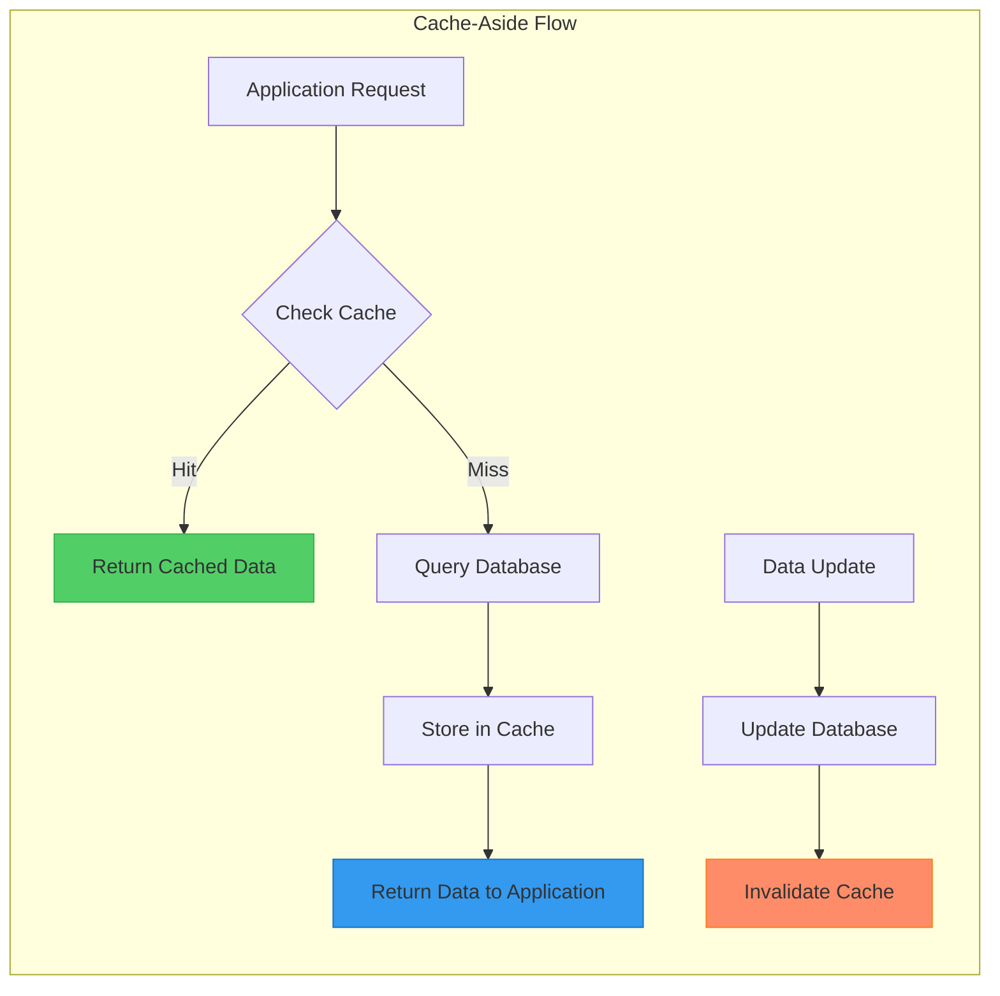
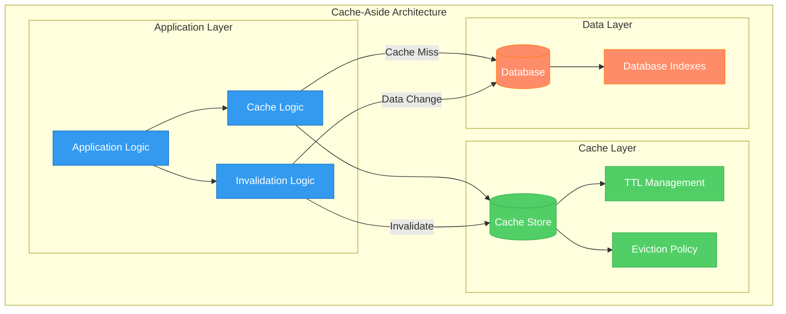
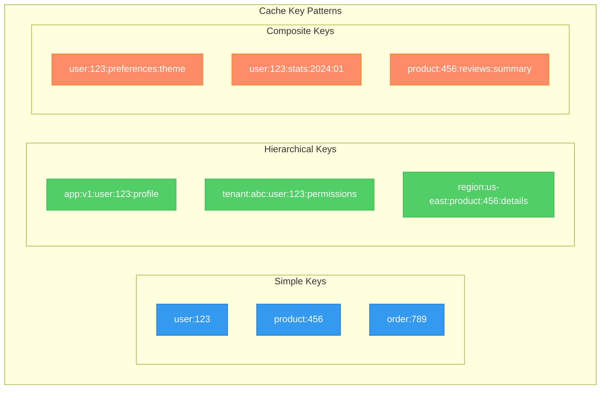
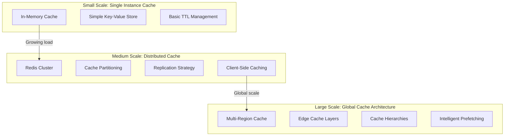
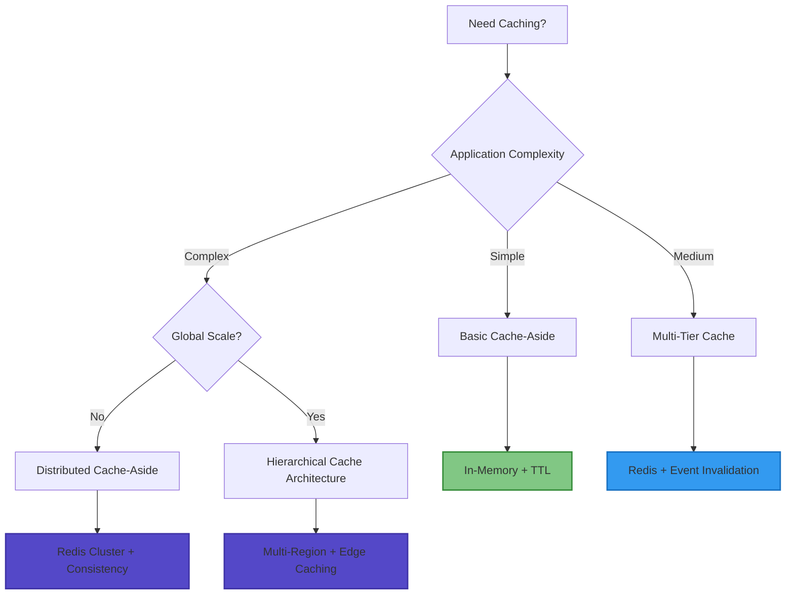

# Cache-Aside Pattern

!!! success "🏆 Gold Standard Pattern"
    **Application-controlled caching for optimal performance** • Twitter, LinkedIn, GitHub proven at massive scale
    
    The most flexible caching pattern where applications explicitly manage cache loading and invalidation, providing optimal control over performance vs consistency trade-offs.
    
    **Key Success Metrics:**
    - Twitter: <50ms read latency for 500M daily tweets with application-controlled timeline caching
    - LinkedIn: 95% cache hit rate with sub-10ms access for 900M+ profiles
    - GitHub: Millions of repository operations with intelligent cache-aside management

## Essential Question

**How do we achieve optimal read performance while maintaining data consistency and giving applications full control over caching strategy?**

## When to Use / When NOT to Use

### ✅ Use When

| Scenario | Example | Impact |
|----------|---------|--------|
| Read-heavy workloads | User profiles, product catalogs | 90%+ read performance improvement |
| Expensive computations | Complex analytics, aggregations | Eliminates repeated expensive operations |
| Slow external services | Third-party API responses | Reduces external dependency load |
| Frequently accessed data | Popular content, trending items | Dramatically improves user experience |

### ❌ DON'T Use When

| Scenario | Why | Alternative |
|----------|-----|-------------|
| Write-heavy workloads | Cache invalidation overhead exceeds benefits | Direct database access |
| Data must be real-time | Financial quotes, live scores | Push-based updates or polling |
| Simple CRUD operations | Basic database operations with fast DB | Database query optimization |
| Small datasets | Data fits comfortably in memory | In-memory database |

## Level 1: Intuition (5 min) {#intuition}

### The Story
Imagine you're a librarian helping students find books. Instead of walking to the stacks every time someone asks for a popular book, you keep frequently requested books on a cart next to your desk. When someone asks for "Introduction to Python," you first check your cart (cache). If it's there, you hand it over instantly. If not, you walk to the stacks (database), get the book, give it to the student, and also put a copy on your cart for next time. You decide what goes on the cart and when to remove books that haven't been requested lately.

### Visual Metaphor


### Core Insight
> **Key Takeaway:** Application controls all caching decisions, providing maximum flexibility for optimizing the performance-consistency trade-off.

### In One Sentence
Cache-aside pattern gives applications explicit control over cache management by loading data into cache on demand and invalidating cache entries when underlying data changes.

## Level 2: Foundation (10 min) {#foundation}

### The Problem Space

<div class="failure-vignette">
<h4>🚨 What Happens Without This Pattern</h4>

**Reddit, 2020**: During heavy load periods, repeated database queries for popular posts caused database overload. Without proper caching strategy, response times increased from 50ms to 3000ms, causing widespread timeouts.

**Impact**: 2-hour performance degradation affecting millions of users, demonstrating need for intelligent caching
</div>

### How It Works

#### Architecture Overview


#### Key Components

| Component | Purpose | Responsibility |
|-----------|---------|----------------|
| Cache Manager | Coordinate cache operations | Load, store, invalidate cache entries |
| Key Generator | Create cache keys | Namespace, version, and structure keys |
| TTL Manager | Handle expiration | Set and enforce time-based expiration |
| Invalidation Logic | Maintain consistency | Remove stale cache entries on updates |

### Basic Example

```python
import time
import hashlib
import json
from typing import Any, Optional, Dict, Callable
from dataclasses import dataclass
from abc import ABC, abstractmethod

class CacheStore(ABC):
    """Abstract cache store interface"""
    
    @abstractmethod
    def get(self, key: str) -> Optional[Any]:
        pass
        
    @abstractmethod
    def set(self, key: str, value: Any, ttl: int = None) -> None:
        pass
        
    @abstractmethod
    def delete(self, key: str) -> None:
        pass

class InMemoryCacheStore(CacheStore):
    """Simple in-memory cache implementation"""
    
    def __init__(self):
        self.data: Dict[str, Dict[str, Any]] = {}
        
    def get(self, key: str) -> Optional[Any]:
        if key not in self.data:
            return None
            
        entry = self.data[key]
        if self._is_expired(entry):
            del self.data[key]
            return None
            
        return entry['value']
        
    def set(self, key: str, value: Any, ttl: int = 3600) -> None:
        self.data[key] = {
            'value': value,
            'expires_at': time.time() + ttl if ttl else None
        }
        
    def delete(self, key: str) -> None:
        if key in self.data:
            del self.data[key]
            
    def _is_expired(self, entry: Dict[str, Any]) -> bool:
        expires_at = entry.get('expires_at')
        return expires_at is not None and time.time() > expires_at

class CacheAsideManager:
    """Cache-aside pattern implementation"""
    
    def __init__(self, cache_store: CacheStore, namespace: str = "app"):
        self.cache = cache_store  
        self.namespace = namespace
        self.hit_count = 0
        self.miss_count = 0
        
    def generate_key(self, entity: str, identifier: str, version: str = "v1") -> str:
        """Generate namespaced cache key"""
        return f"{self.namespace}:{entity}:{version}:{identifier}"
        
    def get_or_load(self, 
                   key: str, 
                   loader_func: Callable[[], Any],
                   ttl: int = 3600) -> Any:
        """Get from cache or load from data source"""
        
        # Try cache first
        cached_value = self.cache.get(key)
        if cached_value is not None:
            self.hit_count += 1
            return cached_value
            
        # Cache miss - load from data source
        self.miss_count += 1
        value = loader_func()
        
        # Store in cache for future requests
        if value is not None:
            self.cache.set(key, value, ttl)
            
        return value
        
    def invalidate(self, key: str) -> None:
        """Remove entry from cache"""
        self.cache.delete(key)
        
    def invalidate_pattern(self, pattern: str) -> None:
        """Invalidate multiple keys matching pattern"""
        # In production, use Redis SCAN or similar
        # This is a simplified implementation
        keys_to_delete = []
        for stored_key in getattr(self.cache, 'data', {}):
            if pattern in stored_key:
                keys_to_delete.append(stored_key)
                
        for key in keys_to_delete:
            self.cache.delete(key)
            
    def get_cache_stats(self) -> Dict[str, Any]:
        """Get cache performance statistics"""
        total_requests = self.hit_count + self.miss_count
        hit_rate = (self.hit_count / total_requests * 100) if total_requests > 0 else 0
        
        return {
            'hit_count': self.hit_count,
            'miss_count': self.miss_count,
            'hit_rate_percent': round(hit_rate, 2),
            'total_requests': total_requests
        }

# Usage Example
class UserService:
    def __init__(self, cache_manager: CacheAsideManager, database):
        self.cache = cache_manager
        self.db = database
        
    def get_user(self, user_id: str) -> Dict[str, Any]:
        """Get user with cache-aside pattern"""
        cache_key = self.cache.generate_key("user", user_id)
        
        return self.cache.get_or_load(
            key=cache_key,
            loader_func=lambda: self.db.get_user(user_id),
            ttl=1800  # 30 minutes
        )
        
    def update_user(self, user_id: str, user_data: Dict[str, Any]) -> None:
        """Update user and invalidate cache"""
        # Update database first
        self.db.update_user(user_id, user_data)
        
        # Invalidate cache
        cache_key = self.cache.generate_key("user", user_id)
        self.cache.invalidate(cache_key)
        
        # Optionally pre-populate cache with new data
        self.cache.cache.set(cache_key, user_data, 1800)
```

## Level 3: Deep Dive (15 min) {#deep-dive}

### Implementation Details

#### Cache Key Design Strategies


#### Critical Design Decisions

| Decision | Options | Trade-off | Recommendation |
|----------|---------|-----------|----------------|
| **Cache Population** | Lazy Loading<br>Cache Warming<br>Hybrid | Lazy: Simple, slower first request<br>Warming: Complex, faster access<br>Hybrid: Balanced | **Hybrid with critical data warming** |
| **Invalidation Strategy** | TTL Only<br>Event-based<br>Manual | TTL: Simple, may serve stale data<br>Event: Consistent, complex<br>Manual: Flexible, error-prone | **TTL + Event-based for critical data** |
| **Cache Stampede Protection** | Locks<br>Probabilistic Refresh<br>Queue | Locks: Safe, may block<br>Probabilistic: Smooth, complex<br>Queue: Decoupled, infrastructure | **Locks for simplicity** |
| **Serialization Format** | JSON<br>Binary<br>Compressed | JSON: Human readable, larger<br>Binary: Fast, not readable<br>Compressed: Small, CPU cost | **JSON for flexibility** |

### Common Pitfalls

<div class="decision-box">
<h4>⚠️ Avoid These Mistakes</h4>

1. **Cache Stampede**: Multiple threads loading same data simultaneously → Use locks or single-flight patterns
2. **Inconsistent Invalidation**: Cache not invalidated on data updates → Implement comprehensive invalidation strategy  
3. **Poor Key Design**: Keys that collide or don't scale → Use hierarchical, namespaced key patterns
4. **No Monitoring**: Can't detect cache effectiveness → Track hit rates, miss rates, and performance metrics
5. **Wrong TTL Values**: Too short wastes cache, too long serves stale data → Analyze data update frequency
</div>

### Production Considerations

#### Cache Configuration by Data Type

| Data Type | TTL | Key Pattern | Invalidation Strategy | Cache Size |
|-----------|-----|-------------|----------------------|------------|
| **User Profiles** | 30 min | user:v1:{id}:profile | Event-based on update | 10GB |
| **Product Catalog** | 4 hours | product:v1:{id}:details | Manual + TTL | 50GB |
| **Session Data** | 24 hours | session:{id}:data | TTL only | 5GB |
| **Configuration** | 1 hour | config:{env}:{service}:{key} | Event-based | 100MB |
| **Analytics Results** | 1 hour | analytics:{query_hash}:{date} | TTL only | 20GB |

#### Advanced Cache Implementation
```python
import asyncio
import pickle
from contextlib import asynccontextmanager
from typing import TypeVar, Generic, Awaitable

T = TypeVar('T')

class AsyncCacheAside(Generic[T]):
    """Production-ready async cache-aside implementation"""
    
    def __init__(self, cache_store, default_ttl: int = 3600):
        self.cache = cache_store
        self.default_ttl = default_ttl
        self.loading_locks = {}  # Prevent cache stampede
        
    async def get_or_load(self,
                         key: str,
                         loader: Callable[[], Awaitable[T]],
                         ttl: Optional[int] = None,
                         serialize: bool = True) -> T:
        """Async get with cache stampede protection"""
        
        # Try cache first
        cached_value = await self._get_from_cache(key, serialize)
        if cached_value is not None:
            return cached_value
            
        # Use lock to prevent multiple concurrent loads
        async with self._get_loading_lock(key):
            # Double-check cache after acquiring lock
            cached_value = await self._get_from_cache(key, serialize)
            if cached_value is not None:
                return cached_value
                
            # Load from data source
            value = await loader()
            
            # Store in cache
            if value is not None:
                await self._set_in_cache(key, value, ttl or self.default_ttl, serialize)
                
            return value
            
    @asynccontextmanager
    async def _get_loading_lock(self, key: str):
        """Get or create a lock for cache loading"""
        if key not in self.loading_locks:
            self.loading_locks[key] = asyncio.Lock()
            
        lock = self.loading_locks[key]
        
        try:
            async with lock:
                yield
        finally:
            # Clean up lock if no one waiting
            if not lock._waiters:  # No one waiting for lock
                self.loading_locks.pop(key, None)
                
    async def _get_from_cache(self, key: str, deserialize: bool) -> Optional[T]:
        """Get value from cache with optional deserialization"""
        raw_value = await self.cache.get(key)
        if raw_value is None:
            return None
            
        if deserialize and isinstance(raw_value, (bytes, str)):
            try:
                return pickle.loads(raw_value) if isinstance(raw_value, bytes) else json.loads(raw_value)
            except (pickle.UnpicklingError, json.JSONDecodeError):
                # Invalid cached data, remove it
                await self.cache.delete(key)
                return None
        
        return raw_value
        
    async def _set_in_cache(self, key: str, value: T, ttl: int, serialize: bool):
        """Set value in cache with optional serialization"""
        if serialize:
            serialized_value = pickle.dumps(value)
        else:
            serialized_value = value
            
        await self.cache.set(key, serialized_value, ttl)
        
    async def invalidate_pattern(self, pattern: str) -> int:
        """Invalidate all keys matching pattern"""
        return await self.cache.delete_pattern(pattern)
        
    async def warm_cache(self, 
                        keys_and_loaders: List[Tuple[str, Callable[[], Awaitable[T]]]],
                        concurrency: int = 10) -> None:
        """Warm cache with multiple keys concurrently"""
        
        semaphore = asyncio.Semaphore(concurrency)
        
        async def warm_single(key: str, loader: Callable[[], Awaitable[T]]):
            async with semaphore:
                try:
                    await self.get_or_load(key, loader)
                except Exception as e:
                    # Log error but don't fail entire warm-up
                    print(f"Cache warm failed for key {key}: {e}")
                    
        await asyncio.gather(*[
            warm_single(key, loader) 
            for key, loader in keys_and_loaders
        ])
```

## Level 4: Expert (20 min) {#expert}

### Advanced Techniques

#### 1. Probabilistic Cache Refresh
```python
import random
import math

class ProbabilisticCacheAside:
    """Prevents cache stampede with probabilistic refresh"""
    
    def __init__(self, cache_store, default_ttl: int = 3600):
        self.cache = cache_store
        self.default_ttl = default_ttl
        
    async def get_or_load_probabilistic(self,
                                       key: str,
                                       loader: Callable[[], Awaitable[T]],
                                       ttl: int = None,
                                       refresh_ahead_factor: float = 0.1) -> T:
        """Get with probabilistic refresh to prevent stampede"""
        
        ttl = ttl or self.default_ttl
        cached_entry = await self._get_cache_entry_with_metadata(key)
        
        if cached_entry is None:
            # Cache miss - load and store
            return await self._load_and_cache(key, loader, ttl)
            
        value, stored_at = cached_entry
        age = time.time() - stored_at
        
        # Probabilistic refresh: chance increases as TTL approaches
        refresh_probability = refresh_ahead_factor * (age / ttl)
        
        if age < ttl and random.random() > refresh_probability:
            # Return cached value
            return value
        elif age >= ttl:
            # Definitely refresh
            return await self._load_and_cache(key, loader, ttl)
        else:
            # Probabilistic background refresh
            asyncio.create_task(self._background_refresh(key, loader, ttl))
            return value
            
    async def _background_refresh(self, key: str, loader: Callable, ttl: int):
        """Refresh cache in background"""
        try:
            fresh_value = await loader()
            if fresh_value is not None:
                await self._set_cache_with_metadata(key, fresh_value, ttl)
        except Exception:
            # Log error, but don't propagate for background refresh
            pass
```

#### 2. Multi-Level Cache Hierarchy
```python
class HierarchicalCacheAside:
    """Cache-aside with L1 (memory) and L2 (Redis) tiers"""
    
    def __init__(self, l1_cache, l2_cache, l1_ttl: int = 300, l2_ttl: int = 3600):
        self.l1_cache = l1_cache  # Fast local cache
        self.l2_cache = l2_cache  # Distributed cache
        self.l1_ttl = l1_ttl
        self.l2_ttl = l2_ttl
        
    async def get_or_load(self, key: str, loader: Callable[[], Awaitable[T]]) -> T:
        """Get from cache hierarchy or load from source"""
        
        # Try L1 cache first (fastest)
        value = await self.l1_cache.get(key)
        if value is not None:
            return value
            
        # Try L2 cache
        value = await self.l2_cache.get(key)
        if value is not None:
            # Populate L1 cache
            await self.l1_cache.set(key, value, self.l1_ttl)
            return value
            
        # Cache miss - load from data source
        value = await loader()
        if value is not None:
            # Populate both cache levels
            await asyncio.gather(
                self.l1_cache.set(key, value, self.l1_ttl),
                self.l2_cache.set(key, value, self.l2_ttl)
            )
            
        return value
        
    async def invalidate(self, key: str):
        """Invalidate across all cache levels"""
        await asyncio.gather(
            self.l1_cache.delete(key),
            self.l2_cache.delete(key)
        )
```

#### 3. Cache-Aware Query Builder
```python
class CacheAwareQueryBuilder:
    """Query builder with automatic cache integration"""
    
    def __init__(self, cache_manager: CacheAsideManager, database):
        self.cache = cache_manager
        self.db = database
        
    def select(self, table: str):
        return CacheAwareQuery(self.cache, self.db, table)

class CacheAwareQuery:
    def __init__(self, cache_manager, database, table: str):
        self.cache = cache_manager
        self.db = database
        self.table = table
        self.conditions = []
        self.fields = "*"
        self.cache_ttl = 3600
        
    def where(self, field: str, value: Any):
        self.conditions.append((field, value))
        return self
        
    def cache_for(self, seconds: int):
        self.cache_ttl = seconds
        return self
        
    async def first(self) -> Optional[Dict[str, Any]]:
        """Execute query with cache-aside"""
        cache_key = self._generate_cache_key()
        
        return await self.cache.get_or_load(
            key=cache_key,
            loader_func=lambda: self._execute_query(),
            ttl=self.cache_ttl
        )
        
    def _generate_cache_key(self) -> str:
        """Generate cache key from query parameters"""
        condition_str = "|".join([f"{field}:{value}" for field, value in self.conditions])
        query_hash = hashlib.sha256(
            f"{self.table}:{self.fields}:{condition_str}".encode()
        ).hexdigest()[:16]
        
        return f"query:v1:{query_hash}"
        
    async def _execute_query(self) -> Optional[Dict[str, Any]]:
        """Execute the actual database query"""
        # Implementation depends on your database library
        query = f"SELECT {self.fields} FROM {self.table}"
        if self.conditions:
            where_clause = " AND ".join([f"{field} = ?" for field, _ in self.conditions])
            query += f" WHERE {where_clause}"
        
        return await self.db.fetchone(query, [value for _, value in self.conditions])
```

### Scaling Considerations



### Monitoring & Observability

#### Key Metrics to Track

| Metric | Alert Threshold | Dashboard Panel | Purpose |
|--------|----------------|-----------------|---------|
| **Cache Hit Rate** | <80% sustained | Time series by cache type | Performance optimization |
| **Cache Response Time** | >10ms P95 | Latency distribution | Cache performance health |
| **Cache Memory Usage** | >85% of allocated memory | Memory usage with eviction rates | Capacity planning |
| **Cache Stampede Events** | >10 concurrent loads per key | Concurrent load tracking | Stampede protection effectiveness |

#### Production Monitoring Implementation
```python
class CacheMetrics:
    def __init__(self, metrics_client):
        self.metrics = metrics_client
        
    def record_cache_operation(self, 
                             operation: str,  # get, set, delete
                             cache_type: str,  # l1, l2, database
                             hit: bool = None,
                             latency_ms: float = None):
        
        tags = {
            'operation': operation,
            'cache_type': cache_type
        }
        
        self.metrics.increment('cache.operations', tags=tags)
        
        if hit is not None:
            result_tags = {**tags, 'result': 'hit' if hit else 'miss'}
            self.metrics.increment('cache.requests', tags=result_tags)
            
        if latency_ms is not None:
            self.metrics.histogram('cache.latency', latency_ms, tags=tags)
            
    def record_cache_size(self, cache_type: str, size_bytes: int, item_count: int):
        """Record cache size metrics"""
        self.metrics.gauge('cache.size_bytes', size_bytes, tags={'type': cache_type})
        self.metrics.gauge('cache.item_count', item_count, tags={'type': cache_type})
        
    def record_stampede_event(self, key: str, concurrent_loads: int):
        """Record cache stampede event"""
        self.metrics.increment(
            'cache.stampede.events',
            tags={'severity': 'high' if concurrent_loads > 10 else 'low'}
        )
        self.metrics.histogram('cache.stampede.concurrent_loads', concurrent_loads)
```

## Level 5: Mastery (30 min) {#mastery}

### Real-World Case Studies

#### Case Study 1: LinkedIn's Profile Caching

<div class="truth-box">
<h4>💡 Production Insights from LinkedIn</h4>

**Challenge**: Serve 900M+ member profiles with sub-10ms latency while maintaining data freshness

**Implementation**:
- Multi-tier cache hierarchy (browser, CDN, application, database)
- Cache-aside for profile data with intelligent warming
- Event-driven invalidation for profile updates
- Probabilistic refresh to prevent stampede on popular profiles

**Results**:
- **95% cache hit rate**: Across all cache tiers
- **Sub-10ms response time**: For cached profile requests
- **50% reduction**: In database load compared to direct access
- **99.9% cache consistency**: Through event-driven invalidation

**Lessons Learned**: Cache hierarchy requires careful coordination - invalidation must propagate through all tiers
</div>

#### Case Study 2: GitHub's Repository Metadata Cache

<div class="truth-box">
<h4>💡 Production Insights from GitHub</h4>

**Challenge**: Handle millions of repository operations while keeping metadata fresh and reducing database load

**Implementation**:
- Cache-aside for repository metadata and file listings
- Smart cache warming for popular repositories
- Branch-aware cache keys for git operations
- Background cache refresh for frequently accessed repositories

**Results**:
- **80% reduction**: In database queries for repository metadata
- **3x faster**: Repository page load times
- **99.5% cache hit rate**: For repository file listings
- **<1% stale data**: Through intelligent invalidation strategies

**Lessons Learned**: Git-like versioned data requires sophisticated cache key strategies to handle branches and commits
</div>

### Pattern Evolution

#### Historical Development


#### Future Directions

| Trend | Impact on Pattern | Adaptation Strategy |
|-------|------------------|-------------------|
| **Machine Learning** | Predictive cache warming and eviction | ML-based access pattern analysis |
| **Edge Computing** | Regional cache distribution | Geo-aware cache hierarchies |
| **Serverless Functions** | Function-level caching requirements | Stateless cache-aside implementations |
| **Real-time Analytics** | Cache impact measurement | Real-time cache effectiveness monitoring |

### Pattern Combinations

#### Works Well With

| Pattern | Combination Benefit | Integration Point |
|---------|-------------------|------------------|
| **Database per Service** | Service-specific cache strategies | Independent cache invalidation per service |
| **Event Sourcing** | Event-driven cache invalidation | Events trigger cache updates automatically |
| **CQRS** | Separate read/write cache strategies | Cache optimized for query models |
| **API Gateway** | Centralized cache management | Gateway-level cache decisions |
| **Circuit Breaker** | Graceful degradation with stale cache | Serve cached data when database fails |

#### Enterprise Integration Example
```python
class EnterpriseCacheArchitecture:
    def __init__(self):
        self.l1_cache = LocalCache()  # In-memory
        self.l2_cache = RedisCache()  # Distributed
        self.l3_cache = CDNCache()    # Edge
        self.event_bus = EventBus()
        self.metrics = CacheMetrics()
        
    async def get_with_hierarchy(self, key: str, loader: Callable) -> Any:
        """Get data through cache hierarchy"""
        
        start_time = time.time()
        
        # Try each cache level
        for cache_level, cache in enumerate([self.l1_cache, self.l2_cache, self.l3_cache], 1):
            value = await cache.get(key)
            if value is not None:
                # Record metrics
                latency_ms = (time.time() - start_time) * 1000
                self.metrics.record_cache_operation(
                    'get', f'l{cache_level}', hit=True, latency_ms=latency_ms
                )
                
                # Populate higher-level caches
                await self._backfill_caches(key, value, cache_level - 1)
                return value
                
        # Cache miss - load from source
        value = await loader()
        if value is not None:
            # Populate all cache levels
            await self._populate_all_caches(key, value)
            
        return value
        
    async def invalidate_on_event(self, event: DomainEvent):
        """Event-driven cache invalidation"""
        invalidation_patterns = self._get_invalidation_patterns(event)
        
        for pattern in invalidation_patterns:
            await asyncio.gather(
                self.l1_cache.delete_pattern(pattern),
                self.l2_cache.delete_pattern(pattern),
                self.l3_cache.delete_pattern(pattern)
            )
            
    def _get_invalidation_patterns(self, event: DomainEvent) -> List[str]:
        """Determine cache patterns to invalidate based on event"""
        if event.type == "user.profile.updated":
            return [f"user:{event.user_id}:*"]
        elif event.type == "product.price.changed":
            return [f"product:{event.product_id}:*", "product:catalog:*"]
        # Add more event-to-pattern mappings
        return []
```

## Quick Reference

### Decision Matrix



### Comparison with Cache Patterns

| Aspect | Cache-Aside | Write-Through | Write-Behind | Read-Through |
|--------|-------------|---------------|--------------|--------------|
| **Application Control** | Full control | Limited | Limited | Limited |
| **Write Performance** | Fast (no cache write) | Slow (write to cache+DB) | Fast (async write) | Fast (no cache write) |
| **Read Performance** | Fast after cache population | Fast | Fast | Slow on first read |
| **Consistency** | Eventually consistent | Strong | Eventually | Strong |
| **Complexity** | Medium | Low | High | Low |
| **When to use** | Read-heavy with updates | Strong consistency needs | Write-heavy workloads | Simple read scenarios |

### Implementation Checklist

**Pre-Implementation**
- [ ] Analyzed read/write patterns and identified cacheable data
- [ ] Designed cache key strategy with proper namespacing
- [ ] Chosen appropriate cache store (Redis, Memcached, etc.)
- [ ] Planned TTL strategy based on data freshness requirements

**Implementation**
- [ ] Implemented cache-aside logic with proper error handling
- [ ] Added cache stampede protection for popular keys
- [ ] Created comprehensive invalidation strategy
- [ ] Integrated monitoring and metrics collection

**Post-Implementation**
- [ ] Validated cache hit rates and performance improvements
- [ ] Tuned TTL values based on actual data update patterns
- [ ] Established cache warming procedures for critical data
- [ ] Created runbooks for cache management and troubleshooting

### Related Resources

<div class="grid cards" markdown>

- :material-book-open-variant:{ .lg .middle } **Related Patterns**
    
    ---
    
    - [Database per Service](../architecture/database-per-service.md) - Service-specific caching
    - [Event Sourcing](../data-management/event-sourcing.md) - Event-driven invalidation
    - [CQRS](../data-management/cqrs.md) - Query-optimized caching
    - [Circuit Breaker](../resilience/circuit-breaker.md) - Fallback to cache

- :material-flask:{ .lg .middle } **Fundamental Laws**
    
    ---
    
    - [State Management Law](../laws/state-management.md) - Managing cached state
    - [Performance-Consistency Tradeoff](../laws/performance-consistency.md) - Cache vs accuracy
    - [Economic Reality Law](../laws/economic-reality.md) - Cost of caching infrastructure

- :material-pillar:{ .lg .middle } **Foundational Pillars**
    
    ---
    
    - [State Pillar](../pillars/state.md) - Managing cached state lifecycle
    - [Work Pillar](../pillars/work.md) - Optimizing work through caching
    - [Intelligence Pillar](../pillars/intelligence.md) - Smart cache decisions

- :material-tools:{ .lg .middle } **Implementation Guides**
    
    ---
    
    - Redis Cache-Aside Setup Guide
    - Cache Key Design Best Practices
    - Multi-Tier Cache Architecture Patterns

</div>