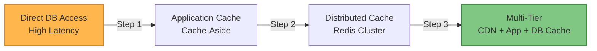

# Caching Strategies

!!! success "🏆 Gold Standard Pattern"
    **Strategic data storage for blazing performance through intelligent caching** • Facebook, Netflix, Reddit proven at scale
    
    Caching is fundamental to achieving web-scale performance. It reduces latency by orders of magnitude, decreases load on backend systems, and enables cost-effective scaling through strategic data placement.
    
    **Key Success Metrics:**
    - Facebook: Trillions of daily cache requests with PB of RAM
    - Netflix: 30+ cache clusters serving 180M+ users globally
    - Reddit: Billions of cached items for instant access to viral content

## Essential Question

**How do we achieve sub-millisecond data access while managing the trade-offs between speed, freshness, and cost?**

## When to Use / When NOT to Use

### ✅ Use When

| Scenario | Example | Impact |
|----------|---------|--------|
| Read-heavy workloads | Social media feeds, product catalogs | 10-100x latency reduction |
| Expensive computations | Search results, ML inferences | Avoid repeated processing costs |
| Database bottlenecks | High query load on primary DB | Reduce database load by 80%+ |
| Geographic distribution | Global user base | Sub-100ms response worldwide |

### ❌ DON'T Use When

| Scenario | Why | Alternative |
|----------|-----|-------------|
| Highly volatile data | Real-time prices, live sports scores | Direct database access |
| Strong consistency required | Financial transactions, inventory | Synchronous replication |
| Limited memory budget | Cost-sensitive applications | Database query optimization |
| Simple, infrequent queries | Admin interfaces, reporting | Direct queries with indexing |

---

## Level 1: Intuition (5 min) {#intuition}

### The Story
Imagine a library where popular books are kept at your desk (L1 cache), frequently used books on a nearby shelf (L2 cache), and rarely accessed books in the archives (database). Instead of walking to archives every time, you strategically place books closer based on usage patterns. Caching works the same way - frequently accessed data stays close and fast.

### Visual Metaphor

📄 View mermaid code (7 lines)

### Core Insight
> **Key Takeaway:** Caching trades memory for speed by keeping frequently accessed data in faster but more expensive storage layers.

### In One Sentence
Caching stores frequently accessed data in fast memory to reduce latency and database load, managing the fundamental trade-off between speed, freshness, and cost.

## Level 2: Foundation (10 min) {#foundation}

### The Problem Space

<h4>🚨 What Happens Without This Pattern</h4>

**E-commerce Giant, 2018**: During Black Friday, their product database couldn't handle 100,000 concurrent queries. Every product page took 3-5 seconds to load, causing 60% cart abandonment. Database servers crashed repeatedly, losing $10M in sales during peak hours. Implementation of multi-tier caching the following year reduced page load times to 200ms and handled 10x traffic.

**Impact**: $10M revenue loss, 60% cart abandonment, system crashes

### How It Works

#### Architecture Overview
#### Key Components

| Component | Purpose | Responsibility |
|-----------|---------|----------------|
| Browser Cache | Client-side storage | Cache static assets and API responses |
| CDN Cache | Geographic distribution | Serve content from edge locations |
| Application Cache | In-memory storage | Cache computed results and database queries |
| Database Cache | Query result storage | Cache at the data layer |

### Basic Example

## Level 3: Deep Dive (15 min) {#deep-dive}

### Implementation Details

#### State Management
#### Critical Design Decisions

| Decision | Options | Trade-off | Recommendation |
|----------|---------|-----------|----------------|
| **Cache Strategy** | Cache-aside vs Write-through | Cache-aside: Lazy loading Write-through: Always fresh | Cache-aside for read-heavy workloads |
| **Eviction Policy** | LRU vs LFU vs TTL | LRU: Recent access LFU: Frequency TTL: Time-based | LRU for general use, TTL for volatile data |
| **Consistency Model** | Eventual vs Strong | Eventual: Better performance Strong: Data accuracy | Eventual for most web applications |

### Common Pitfalls

<h4>⚠️ Avoid These Mistakes</h4>

1. **Cache Everything**: Over-caching wastes memory and hurts hit rates → Profile access patterns first, cache strategically
2. **No TTL Strategy**: Stale data persists indefinitely → Set appropriate TTLs based on data volatility
3. **Cache Stampede**: Multiple processes fetch same expired data → Use distributed locks and jittered expiry

### Production Considerations

#### Performance Characteristics

| Metric | Typical Range | Optimization Target |
|--------|---------------|-------------------|
| Cache Hit Ratio | 70-95% | >80% for most applications |
| Cache Latency | 0.1-10ms | <1ms for in-memory cache |
| TTL Settings | 60s-24h | Based on data change frequency |
| Memory Usage | 20-50% of dataset | Balance cost vs hit rate |

## Level 4: Expert (20 min) {#expert}

### Advanced Techniques

#### Optimization Strategies

1. **Multi-Tier Caching Architecture**
   - When to apply: High-traffic applications with diverse access patterns
   - Impact: 95%+ cache hit ratio with optimized cost structure
   - Trade-off: Complexity vs performance and cost efficiency

2. **Probabilistic Cache Refresh (XFetch)**
   - When to apply: Preventing cache stampede on high-traffic keys
   - Impact: Eliminates thundering herd problems entirely
   - Trade-off: Slightly more complex implementation vs system stability

### Scaling Considerations

### Monitoring & Observability

#### Key Metrics to Track

| Metric | Alert Threshold | Dashboard Panel |
|--------|----------------|-----------------|
| Cache Hit Ratio | <80% | Hit rate trends by cache tier |
| Cache Latency P99 | >10ms | Response time distribution |
| Memory Utilization | >80% | Memory usage and eviction rate |
| Cache Stampede Events | >1 per hour | Concurrent miss detection |

## Level 5: Mastery (30 min) {#mastery}

### Real-World Case Studies

#### Case Study 1: Reddit's Multi-Tier Caching

<h4>💡 Production Insights from Reddit</h4>

**Challenge**: Handle 8 billion page views per month with real-time content updates and personalization

**Implementation**: 
- L1: Local process cache (512MB, <1μs latency)
- L2: Redis cluster (multi-GB, ~1ms latency)
- L3: CDN caching (Fastly, ~10ms globally)
- Dynamic TTL based on content age and popularity

**Results**: 
- Cache Hit Ratio: 94% overall across all tiers
- Page Load Time: 200ms average (down from 2000ms)
- Database Load: 85% reduction in query volume
- Cost Savings: 60% reduction in database infrastructure

**Lessons Learned**: Dynamic TTL based on content characteristics is more effective than static timeouts; cache warming before viral content is crucial

### Pattern Evolution

#### Migration from Direct Database Access

📄 View mermaid code (7 lines)

#### Future Directions

| Trend | Impact on Pattern | Adaptation Strategy |
|-------|------------------|-------------------|
| **Edge Computing** | Push caching to edge devices | Micro-caches on IoT devices |
| **AI/ML Integration** | Predictive cache warming | ML models predict access patterns |
| **Serverless Architecture** | Function-level caching | Event-driven cache invalidation |

### Pattern Combinations

#### Works Well With

| Pattern | Combination Benefit | Integration Point |
|---------|-------------------|------------------|
| [CQRS](../architecture/cqrs.md) | Separate read/write caching | Cache query models separately |
| [Event Sourcing](../data-management/event-sourcing.md) | Event-driven invalidation | Cache computed projections |
| [CDN](../infrastructure/cdn.md) | Geographic caching | Global content distribution |

## Quick Reference

### Decision Matrix

### Comparison with Alternatives

| Aspect | Caching | Database Scaling | CDN Only |
|--------|---------|------------------|----------|
| Latency Reduction | Excellent (10-100x) | Good (2-5x) | Excellent (static only) |
| Implementation Complexity | Medium | High | Low |
| Cost Efficiency | High | Medium | High (static content) |
| Data Freshness | Configurable | Real-time | Poor |
| When to use | Read-heavy apps | Write-heavy apps | Static content delivery |

### Implementation Checklist

**Pre-Implementation**
- [ ] Analyzed access patterns to identify cacheable data
- [ ] Determined acceptable staleness levels for different data types
- [ ] Calculated memory requirements and budget constraints
- [ ] Designed cache key naming strategy and invalidation plan

**Implementation**
- [ ] Deployed cache infrastructure (Redis/Memcached)
- [ ] Implemented cache-aside pattern for critical read paths
- [ ] Set up monitoring for hit rates and performance metrics
- [ ] Configured appropriate TTLs for different data types

**Post-Implementation**
- [ ] Optimized cache sizes based on hit rate analytics
- [ ] Implemented cache warming for predictable high-traffic events
- [ ] Added alerting for cache stampede and performance degradation
- [ ] Documented cache invalidation procedures and troubleshooting

### Related Resources

- :material-book-open-variant:{ .lg .middle } **Related Patterns**
    
    ---
    
    - [CDN](../infrastructure/cdn.md) - Geographic edge caching
    - [Sharding](sharding.md) - Cache per shard strategy
    - [CQRS](../architecture/cqrs.md) - Separate read model caching

- :material-flask:{ .lg .middle } **Fundamental Laws**
    
    ---
    
    - [Law 4: Multidimensional Optimization](../../part1-axioms/law4/) - Speed vs freshness vs cost
    - [Law 7: Economic Reality](../../part1-axioms/law7/) - Cost-effective performance scaling

- :material-pillar:{ .lg .middle } **Foundational Pillars**
    
    ---
    
    - [State Distribution](../../part2-pillars/state/) - Distributed cache management
    - [Work Distribution](../../part2-pillars/work/) - Cache computation distribution

- :material-tools:{ .lg .middle } **Implementation Guides**
    
    ---
    
    - [Caching Setup Guide](../../excellence/guides/cache-setup.md)
    - [Cache Optimization](../../excellence/guides/cache-optimization.md)
    - [Monitoring Guide](../../excellence/guides/cache-monitoring.md)

