# Caching Strategies

## The Complete Blueprint

Caching Strategies represent the **performance multiplication engine** of modern distributed systems, transforming slow database queries into lightning-fast memory lookups while managing the fundamental trade-offs between speed, consistency, and cost. This pattern orchestrates **multi-tier storage hierarchies** that strategically place frequently accessed data closer to consumers, reducing latency by orders of magnitude and enabling systems to handle massive scale with acceptable response times. Effective caching strategy is the difference between systems that buckle under load and those that gracefully scale to millions of users.

<details>
<summary>📄 View Complete Multi-Tier Caching Architecture (22 lines)</summary>


</details>

This blueprint demonstrates **hierarchical cache placement** with latency and capacity optimization at each tier, **intelligent invalidation strategies** that maintain consistency across the hierarchy, and **performance amplification** through strategic hit rate optimization.

### What You'll Master

- **Multi-Tier Architecture Design**: Architect comprehensive caching hierarchies that optimize for latency, capacity, and cost across browser, CDN, application, and database layers
- **Cache Invalidation Orchestration**: Implement sophisticated invalidation strategies including TTL-based, event-driven, and write-through/write-behind patterns for consistency management
- **Performance Analytics**: Master cache hit rate optimization, understanding the exponential performance gains from strategic placement and sizing decisions
- **Strategic Data Placement**: Design intelligent caching policies that predict and pre-load high-value data while managing memory constraints and eviction strategies
- **Production Monitoring**: Build comprehensive observability systems that track cache performance, detect degradation, and automatically optimize cache configurations

## Table of Contents

- [Essential Question](#essential-question)
- [When to Use / When NOT to Use](#when-to-use-when-not-to-use)
  - [✅ Use When](#use-when)
  - [❌ DON'T Use When](#dont-use-when)
- [Level 1: Intuition (5 min) {#intuition}](#level-1-intuition-5-min-intuition)
  - [The Story](#the-story)
  - [Visual Metaphor](#visual-metaphor)
  - [Core Insight](#core-insight)
  - [In One Sentence](#in-one-sentence)
- [Level 2: Foundation (10 min) {#foundation}](#level-2-foundation-10-min-foundation)
  - [The Problem Space](#the-problem-space)
  - [How It Works](#how-it-works)
  - [Cache Invalidation Flow Strategies](#cache-invalidation-flow-strategies)
- [Level 3: Deep Dive (15 min) {#deep-dive}](#level-3-deep-dive-15-min-deep-dive)
  - [Cache Consistency Patterns](#cache-consistency-patterns)
  - [Implementation Details](#implementation-details)
  - [Common Pitfalls](#common-pitfalls)
  - [Production Considerations](#production-considerations)
- [Level 4: Expert (20 min) {#expert}](#level-4-expert-20-min-expert)
  - [Real-World Caching Architectures](#real-world-caching-architectures)
  - [Cost-Benefit Analysis Matrix](#cost-benefit-analysis-matrix)
  - [Advanced Techniques](#advanced-techniques)
  - [Monitoring & Observability](#monitoring-observability)
- [Level 5: Mastery (30 min) {#mastery}](#level-5-mastery-30-min-mastery)
  - [Real-World Case Studies](#real-world-case-studies)
  - [Cache Evolution Roadmap](#cache-evolution-roadmap)
  - [Pattern Combinations](#pattern-combinations)
- [Quick Reference](#quick-reference)
  - [Cache Strategy Selection Matrix](#cache-strategy-selection-matrix)
  - [Architecture Comparison Matrix](#architecture-comparison-matrix)
  - [Implementation Decision Framework](#implementation-decision-framework)
  - [Implementation Checklist](#implementation-checklist)
  - [Related Resources](#related-resources)
- [Related Laws](#related-laws)

!!! success "🏆 Gold Standard Pattern"
    **Strategic data storage for blazing performance through intelligent caching** • Facebook, Netflix, Reddit proven at scale
    
    Caching is fundamental to achieving web-scale performance. It reduces latency by orders of magnitude, decreases load on backend systems, and enables cost-effective scaling through strategic data placement.
    
    **Key Success Metrics:**
    - Facebook: Trillions of daily cache requests with PB of RAM
    - Netflix: 30+ cache clusters serving 180M+ users globally
    - Reddit: Billions of cached items for instant access to viral content

## Essential Question

**How do we achieve sub-millisecond data access while managing the trade-offs between speed, freshness, and cost?**

## When to Use / When NOT to Use

### ✅ Use When

| Scenario | Example | Impact |
|----------|---------|--------|
| Read-heavy workloads | Social media feeds, product catalogs | 10-100x latency reduction |
| Expensive computations | Search results, ML inferences | Avoid repeated processing costs |
| Database bottlenecks | High query load on primary DB | Reduce database load by 80%+ |
| Geographic distribution | Global user base | Sub-100ms response worldwide |

### ❌ DON'T Use When

| Scenario | Why | Alternative |
|----------|-----|-------------|
| Highly volatile data | Real-time prices, live sports scores | Direct database access |
| Strong consistency required | Financial transactions, inventory | Synchronous replication |
| Limited memory budget | Cost-sensitive applications | Database query optimization |
| Simple, infrequent queries | Admin interfaces, reporting | Direct queries with indexing |

---

## Level 1: Intuition (5 min) {#intuition}

### The Story
Imagine a library where popular books are kept at your desk (L1 cache), frequently used books on a nearby shelf (L2 cache), and rarely accessed books in the archives (database). Instead of walking to archives every time, you strategically place books closer based on usage patterns. Caching works the same way - frequently accessed data stays close and fast.

### Visual Metaphor

```mermaid
graph TB
    U[User Request] --> B[Browser Cache<br/>📱 ~0ms]
    B -->|Miss| C[CDN Cache<br/>🌐 ~10ms]
    C -->|Miss| A[App Cache<br/>🔥 ~1ms]
    A -->|Miss| D[DB Cache<br/>💾 ~5ms]
    D -->|Miss| DB[Database<br/>🐌 ~500ms]
    
    B -->|Hit| R1[Response ~0ms]
    C -->|Hit| R2[Response ~10ms]
    A -->|Hit| R3[Response ~1ms]
    D -->|Hit| R4[Response ~5ms]
    DB --> R5[Response ~500ms]
    
    style B fill:#e8f5e8,stroke:#4caf50
    style C fill:#fff3e0,stroke:#ff9800
    style A fill:#f3e5f5,stroke:#9c27b0
    style D fill:#e3f2fd,stroke:#2196f3
    style DB fill:#ffebee,stroke:#f44336
```

<details>
<summary>📄 View mermaid code (17 lines)</summary>



</details>

**Cache Hit Progression**: Each cache tier provides increasingly faster responses, with browser cache delivering near-instantaneous results and database queries serving as the slowest fallback.

### Core Insight
> **Key Takeaway:** Caching trades memory for speed by keeping frequently accessed data in faster but more expensive storage layers.

### In One Sentence
Caching stores frequently accessed data in fast memory to reduce latency and database load, managing the fundamental trade-off between speed, freshness, and cost.

## Level 2: Foundation (10 min) {#foundation}

### The Problem Space

<div class="failure-vignette">
<h4>🚨 What Happens Without This Pattern</h4>

**E-commerce Giant, 2018**: During Black Friday, their product database couldn't handle 100,000 concurrent queries. Every product page took 3-5 seconds to load, causing 60% cart abandonment. Database servers crashed repeatedly, losing $10M in sales during peak hours. Implementation of multi-tier caching the following year reduced page load times to 200ms and handled 10x traffic.

**Impact**: $10M revenue loss, 60% cart abandonment, system crashes
</div>

### How It Works

#### Multi-Tier Caching Hierarchy

```mermaid
graph TB
    subgraph "Client Tier"
        BRC[Browser Cache<br/>📱 Local Storage<br/>~0ms, 5-100MB]
        MBC[Mobile App Cache<br/>📱 Device Storage<br/>~0ms, 10-500MB]
    end
    
    subgraph "Edge Tier"
        CDN[CDN Cache<br/>🌐 Geographic Edge<br/>~10-50ms, 1-100GB]
        ESI[Edge Side Includes<br/>🔗 Fragment Cache<br/>~5-20ms, 100MB-1GB]
    end
    
    subgraph "Application Tier"
        L1[L1 Process Cache<br/>🔥 In-Memory<br/>~0.1ms, 64MB-2GB]
        L2[L2 Distributed Cache<br/>⚡ Redis/Memcached<br/>~1ms, 1-100GB]
        OC[Object Cache<br/>🎯 Serialized Objects<br/>~2ms, 100MB-10GB]
    end
    
    subgraph "Data Tier"
        QC[Query Result Cache<br/>💾 Database Layer<br/>~5ms, 1-50GB]
        BC[Buffer Pool Cache<br/>🗄️ Page Cache<br/>~10ms, 1-100GB]
    end
    
    subgraph "Storage Tier"
        DB[(Primary Database<br/>🐌 Disk Storage<br/>~100-500ms)]
    end
    
    BRC --> CDN
    MBC --> CDN
    CDN --> L1
    ESI --> L1
    L1 --> L2
    L2 --> OC
    OC --> QC
    QC --> BC
    BC --> DB
    
    style BRC fill:#e8f5e8,stroke:#4caf50,stroke-width:2px
    style CDN fill:#fff3e0,stroke:#ff9800,stroke-width:2px
    style L1 fill:#f3e5f5,stroke:#9c27b0,stroke-width:2px
    style L2 fill:#e3f2fd,stroke:#2196f3,stroke-width:2px
    style QC fill:#fce4ec,stroke:#e91e63,stroke-width:2px
    style DB fill:#ffebee,stroke:#f44336,stroke-width:2px
```

<details>
<summary>📄 View mermaid code (32 lines)</summary>



</details>

#### Cache Placement Decision Matrix

| Cache Layer | Latency | Capacity | Cost/GB | Use Case | Hit Rate Target |
|-------------|---------|----------|---------|----------|-----------------|
| **Browser Cache** | ~0ms | 5-100MB | $0 | Static assets, API responses | 60-80% |
| **CDN Cache** | ~10ms | 1-100GB | $50-200 | Global content distribution | 70-90% |
| **Application L1** | ~0.1ms | 64MB-2GB | $5-20 | Hot data, session cache | 80-95% |
| **Application L2** | ~1ms | 1-100GB | $10-50 | Distributed shared cache | 70-85% |
| **Database Cache** | ~5ms | 1-50GB | $20-100 | Query results, indices | 60-80% |

### Cache Invalidation Flow Strategies

<details>
<summary>📄 View mermaid code (28 lines)</summary>


</details>

## Level 3: Deep Dive (15 min) {#deep-dive}

### Cache Consistency Patterns

#### Consistency Model State Diagrams

<details>
<summary>📄 View mermaid code (25 lines)</summary>


</details>

#### Cache Warming Strategies

<details>
<summary>📄 View mermaid code (22 lines)</summary>


</details>

### Implementation Details
#### Cache Architecture Decision Tree

```mermaid
flowchart TD
    A[Cache Architecture Decision] --> B{Read/Write Ratio}
    
    B -->|Read Heavy<br/>>10:1| C{Consistency Requirements}
    B -->|Balanced<br/>1:1 to 10:1| D{Latency SLA}
    B -->|Write Heavy<br/><1:1| E[Write-Behind Pattern]
    
    C -->|Eventual Consistency<br/>OK| F[Cache-Aside Pattern<br/>+ TTL-based invalidation]
    C -->|Strong Consistency<br/>Required| G[Write-Through Pattern<br/>+ Event-based invalidation]
    
    D -->|Sub-millisecond<br/>Required| H[Multi-tier Caching<br/>L1 + L2 + CDN]
    D -->|Milliseconds<br/>Acceptable| I[Distributed Cache<br/>Redis/Memcached]
    
    F --> F1[Implementation:<br/>• Cache-aside pattern<br/>• TTL 5min-24h<br/>• 80%+ hit rate target]
    G --> G1[Implementation:<br/>• Write-through pattern<br/>• Event invalidation<br/>• Strong consistency]
    H --> H1[Implementation:<br/>• Process + distributed cache<br/>• CDN for static content<br/>• <1ms average latency]
    I --> I1[Implementation:<br/>• Single cache tier<br/>• 1-10ms latency<br/>• Cost-optimized]
    E --> E1[Implementation:<br/>• Write-behind pattern<br/>• Async DB updates<br/>• Write conflict handling]
    
    style F fill:#e8f5e8,stroke:#4caf50
    style G fill:#fff3e0,stroke:#ff9800
    style H fill:#f3e5f5,stroke:#9c27b0
    style I fill:#e3f2fd,stroke:#2196f3
    style E fill:#fce4ec,stroke:#e91e63
```

<details>
<summary>📄 View mermaid code (28 lines)</summary>



</details>

#### Performance Impact Visualization

<details>
<summary>📄 View mermaid code (21 lines)</summary>

```mermaid
gantt
    title Cache Hit Rate vs Response Time Impact
    dateFormat X
    axisFormat %s
    
    section No Cache
    Database Query     :done, db1, 0, 500ms
    
    section 50% Hit Rate
    Cache Hit (50%)    :done, c50h, 0, 1ms
    Cache Miss (50%)   :done, c50m, 1ms, 500ms
    
    section 80% Hit Rate  
    Cache Hit (80%)    :done, c80h, 0, 1ms
    Cache Miss (20%)   :done, c80m, 1ms, 500ms
    
    section 95% Hit Rate
    Cache Hit (95%)    :done, c95h, 0, 1ms
    Cache Miss (5%)    :done, c95m, 1ms, 500ms
    
    section 99% Hit Rate
    Cache Hit (99%)    :done, c99h, 0, 1ms
    Cache Miss (1%)    :done, c99m, 1ms, 500ms
```

</details>

| Hit Rate | Average Latency | Improvement | Database Load Reduction |
|----------|----------------|-------------|-------------------------|
| **0% (No Cache)** | 500ms | Baseline | 0% |
| **50% Hit Rate** | 250ms | 2x faster | 50% |
| **80% Hit Rate** | 100ms | 5x faster | 80% |
| **95% Hit Rate** | 26ms | 19x faster | 95% |
| **99% Hit Rate** | 6ms | 83x faster | 99% |

#### Critical Design Decisions Matrix

| Decision Factor | Option A | Option B | Option C | Recommendation Criteria |
|----------------|----------|----------|----------|------------------------|
| **Cache Strategy** | Cache-Aside | Write-Through | Write-Behind | Cache-aside for read-heavy, write-through for consistency, write-behind for write-heavy |
| **Eviction Policy** | LRU (Least Recent) | LFU (Least Frequent) | TTL (Time-based) | LRU for general use, LFU for stable patterns, TTL for volatile data |
| **Distribution** | Single Instance | Clustered | Replicated | Single for simplicity, clustered for scale, replicated for availability |
| **Consistency** | Eventual | Strong | Session | Eventual for performance, strong for accuracy, session for user experience |

### Common Pitfalls

<div class="decision-box">
<h4>⚠️ Avoid These Mistakes</h4>

1. **Cache Everything**: Over-caching wastes memory and hurts hit rates → Profile access patterns first, cache strategically
2. **No TTL Strategy**: Stale data persists indefinitely → Set appropriate TTLs based on data volatility
3. **Cache Stampede**: Multiple processes fetch same expired data → Use distributed locks and jittered expiry
</div>

### Production Considerations

#### Performance Characteristics

| Metric | Typical Range | Optimization Target |
|--------|---------------|-------------------|
| Cache Hit Ratio | 70-95% | >80% for most applications |
| Cache Latency | 0.1-10ms | <1ms for in-memory cache |
| TTL Settings | 60s-24h | Based on data change frequency |
| Memory Usage | 20-50% of dataset | Balance cost vs hit rate |

## Level 4: Expert (20 min) {#expert}

### Real-World Caching Architectures

#### Facebook's Global Caching Architecture

<details>
<summary>📄 View mermaid code (35 lines)</summary>


</details>

#### Twitter's Cache Strategy for Timeline Generation

<details>
<summary>📄 View mermaid code (26 lines)</summary>


</details>

#### LinkedIn's Cache Optimization for Professional Network

<details>
<summary>📄 View mermaid code (30 lines)</summary>


</details>

### Cost-Benefit Analysis Matrix

#### Caching Investment vs Return Analysis

| Cache Tier | Setup Cost | Monthly Cost | Latency Gain | Availability Gain | ROI Timeline |
|------------|------------|--------------|--------------|------------------|--------------|
| **Browser Cache** | $0 | $0 | 500ms → 0ms | +0.1% | Immediate |
| **CDN Cache** | $1K setup | $500-5K/mo | 200ms → 10ms | +0.5% | 1-2 months |
| **Application L1** | $5K setup | $200-2K/mo | 100ms → 0.1ms | +0.2% | 2-3 months |
| **Distributed L2** | $10K setup | $1K-10K/mo | 50ms → 1ms | +1.0% | 3-6 months |
| **Database Cache** | $2K setup | $300-3K/mo | 500ms → 5ms | +0.3% | 1-3 months |

#### Cache Size vs Performance Trade-offs

<details>
<summary>📄 View mermaid code (16 lines)</summary>


</details>

### Advanced Techniques

#### Advanced Cache Optimization Techniques

<details>
<summary>📄 View mermaid code (24 lines)</summary>

```mermaid
graph TD
    subgraph "Probabilistic Cache Refresh"
        PCR1[Key Access] --> PCR2{TTL * β < random()?}
        PCR2 -->|Yes| PCR3[Background Refresh<br/>Serve Stale Data]
        PCR2 -->|No| PCR4[Serve Fresh Data]
        PCR3 --> PCR5[Async Update Cache]
        PCR5 --> PCR6[Fresh Data Available]
    end
    
    subgraph "Cache Stampede Prevention"
        CS1[Multiple Requests<br/>Same Expired Key] --> CS2[Distributed Lock<br/>First Request Locks]
        CS2 --> CS3[Winner Computes<br/>Others Wait]
        CS3 --> CS4[Broadcast Result<br/>to All Waiters]
    end
    
    subgraph "Multi-Tier Coherence"
        MT1[L1 Update Event] --> MT2[Invalidate L2]
        MT2 --> MT3[Invalidate CDN]
        MT3 --> MT4[Event Propagation<br/>Eventually Consistent]
        MT4 --> MT5[Cache Hierarchy<br/>Synchronized]
    end
    
    style PCR1 fill:#e8f5e8,stroke:#4caf50
    style CS1 fill:#fff3e0,stroke:#ff9800
    style MT1 fill:#f3e5f5,stroke:#9c27b0
```

</details>

### Monitoring & Observability

#### Cache Performance Metrics Dashboard

```mermaid
graph LR
    subgraph "Real-time Metrics"
        M1[Hit Rate %<br/>Target: >80%<br/>Current: 87%]
        M2[Latency P99<br/>Target: <10ms<br/>Current: 3.2ms]
        M3[Memory Usage<br/>Target: <80%<br/>Current: 73%]
        M4[Eviction Rate<br/>Target: <5%<br/>Current: 2.1%]
    end
    
    subgraph "Health Indicators"
        H1[🟢 Cache Healthy<br/>All metrics green]
        H2[🟡 Cache Degraded<br/>Hit rate declining]
        H3[🔴 Cache Critical<br/>High eviction rate]
    end
    
    subgraph "Alert Triggers"
        A1[Hit Rate < 70%<br/>Page Engineering]
        A2[P99 > 50ms<br/>Performance Alert]
        A3[Memory > 90%<br/>Scaling Alert]
    end
```

<details>
<summary>📄 View mermaid code (20 lines)</summary>



</details>

| Metric Category | Key Indicator | Alert Threshold | Business Impact |
|----------------|---------------|----------------|-----------------|
| **Performance** | Hit Rate % | <80% | User experience degradation |
| **Performance** | P99 Latency | >10ms | SLA breach risk |
| **Capacity** | Memory Utilization | >85% | Cache efficiency loss |
| **Reliability** | Eviction Rate | >10%/hour | Data freshness issues |
| **Cost** | Cache Miss Rate | >20% | Infrastructure cost increase |

## Level 5: Mastery (30 min) {#mastery}

### Real-World Case Studies

#### Case Study 1: Reddit's Multi-Tier Caching

<div class="truth-box">
<h4>💡 Production Insights from Reddit</h4>

**Challenge**: Handle 8 billion page views per month with real-time content updates and personalization

**Implementation**: 
- L1: Local process cache (512MB, <1μs latency)
- L2: Redis cluster (multi-GB, ~1ms latency)
- L3: CDN caching (Fastly, ~10ms globally)
- Dynamic TTL based on content age and popularity

**Results**: 
- Cache Hit Ratio: 94% overall across all tiers
- Page Load Time: 200ms average (down from 2000ms)
- Database Load: 85% reduction in query volume
- Cost Savings: 60% reduction in database infrastructure

**Lessons Learned**: Dynamic TTL based on content characteristics is more effective than static timeouts; cache warming before viral content is crucial
</div>

### Cache Evolution Roadmap

#### Migration from Direct Database Access

<details>
<summary>📄 View mermaid code (32 lines)</summary>

```mermaid
journey
    title Cache Architecture Evolution Journey
    section Phase 1: Database Only
        Direct Queries: 1: Database
        Response Time: 1: 500ms avg
        Cost: 5: High DB Load
        Scalability: 1: Poor
    
    section Phase 2: Application Cache
        Cache-Aside Pattern: 3: App Server
        Hit Rate: 3: 60-70%
        Response Time: 4: 50ms avg
        Development: 3: Medium
    
    section Phase 3: Distributed Cache
        Redis/Memcached: 4: Cache Cluster
        Hit Rate: 4: 80-85%
        Response Time: 5: 5ms avg
        Ops Complexity: 3: Medium
    
    section Phase 4: Multi-Tier
        CDN + App + DB: 5: Full Stack
        Hit Rate: 5: 95%+
        Response Time: 5: 1ms avg
        Management: 2: Complex
    
    section Phase 5: Intelligent
        ML-Driven Warming: 5: AI-Powered
        Predictive Loading: 5: 99%+ Hit
        Response Time: 5: Sub-ms
        Innovation: 5: Cutting Edge
```

</details>

#### Next-Generation Caching Trends

<details>
<summary>📄 View mermaid code (25 lines)</summary>


</details>

| Innovation Trend | Technology Driver | Cache Impact | Timeline |
|------------------|------------------|--------------|----------|
| **Edge AI Caching** | 5G + Edge Computing | Micro-second latency at network edge | 2024-2025 |
| **Predictive Warming** | ML Access Patterns | 99%+ hit rates through prediction | 2024-2026 |
| **Context-Aware TTL** | Real-time Analytics | Dynamic expiry based on data volatility | 2025-2027 |
| **Quantum Coherence** | Quantum Networking | Instantaneous cache synchronization | 2027+ |

### Pattern Combinations

#### Works Well With

| Pattern | Combination Benefit | Integration Point |
|---------|-------------------|------------------|
| [CQRS](../data-management/cqrs.md) | Separate read/write caching | Cache query models separately |
| [Event Sourcing](../data-management/event-sourcing.md) | Event-driven invalidation | Cache computed projections |
| [CDN](../infrastructure/cdn.md) | Geographic caching | Global content distribution |

## Quick Reference

### Cache Strategy Selection Matrix

<details>
<summary>📄 View mermaid code (25 lines)</summary>

```mermaid
flowchart LR
    subgraph "Client-Side vs Server-Side Decision"
        CS1[Cache Decision] --> CS2{Data Sensitivity}
        CS2 -->|Public Data| CS3[Client-Side Safe<br/>Browser + CDN Cache]
        CS2 -->|Private Data| CS4[Server-Side Only<br/>Application Cache]
        CS2 -->|Mixed Data| CS5[Hybrid Approach<br/>Selective Caching]
        
        CS3 --> CS6[Implementation:<br/>• Long TTL (hours)<br/>• CDN distribution<br/>• Static asset focus]
        CS4 --> CS7[Implementation:<br/>• Short TTL (minutes)<br/>• Session-based keys<br/>• User-specific data]
        CS5 --> CS8[Implementation:<br/>• Public: Client cache<br/>• Private: Server cache<br/>• Dynamic switching]
    end
    
    subgraph "Edge vs Application Decision"
        ED1[Geographic Distribution] --> ED2{User Base}
        ED2 -->|Global Users| ED3[Edge-Heavy Strategy<br/>CDN + Regional Cache]
        ED2 -->|Regional Users| ED4[Application-Heavy<br/>Centralized Cache]
        ED2 -->|Local Users| ED5[Database-Heavy<br/>Minimal Caching]
    end
    
    style CS3 fill:#e8f5e8,stroke:#4caf50
    style CS4 fill:#fff3e0,stroke:#ff9800
    style ED3 fill:#f3e5f5,stroke:#9c27b0
```

</details>

### Architecture Comparison Matrix

| Architecture Pattern | Latency (P50/P99) | Hit Rate Target | Complexity | Cost | Best For |
|----------------------|-------------------|-----------------|-------------|------|----------|
| **No Cache** | 200ms/800ms | N/A | Low | Low | Simple apps, real-time data |
| **Single-Tier** | 10ms/50ms | 80%+ | Low | Medium | Small-medium apps |
| **Multi-Tier** | 1ms/10ms | 95%+ | High | High | Large-scale web apps |
| **CDN Only** | 50ms/200ms | 70%+ | Low | Medium | Static content sites |
| **Edge Computing** | 0.1ms/5ms | 99%+ | Very High | Very High | Ultra-low latency apps |

### Implementation Decision Framework

| Use Case Category | Recommended Strategy | Cache Placement | TTL Strategy |
|------------------|---------------------|-----------------|--------------|
| **E-commerce Product Catalog** | Multi-tier (CDN + App + DB) | Global distribution | Static: 24h, Prices: 5min |
| **Social Media Feed** | Write-through + Fan-out | Regional clusters | Posts: 1h, Timeline: 15min |
| **Real-time Analytics** | Cache-aside + Background refresh | Application tier | Metrics: 30s, Reports: 10min |
| **Content Management** | CDN-heavy + Edge compute | Geographic edges | Static: 7d, Dynamic: 1h |
| **Financial Trading** | Minimal caching | Memory-only | Market data: 1s, Reference: 1h |

### Implementation Checklist

**Pre-Implementation**
- [ ] Analyzed access patterns to identify cacheable data
- [ ] Determined acceptable staleness levels for different data types
- [ ] Calculated memory requirements and budget constraints
- [ ] Designed cache key naming strategy and invalidation plan

**Implementation**
- [ ] Deployed cache infrastructure (Redis/Memcached)
- [ ] Implemented cache-aside pattern for critical read paths
- [ ] Set up monitoring for hit rates and performance metrics
- [ ] Configured appropriate TTLs for different data types

**Post-Implementation**
- [ ] Optimized cache sizes based on hit rate analytics
- [ ] Implemented cache warming for predictable high-traffic events
- [ ] Added alerting for cache stampede and performance degradation
- [ ] Documented cache invalidation procedures and troubleshooting

### Related Resources

<div class="grid cards" markdown>

- :material-book-open-variant:{ .lg .middle } **Related Patterns**
    
    ---
    
    - [CDN](../infrastructure/cdn.md) - Geographic edge caching
    - [Sharding](../scaling/sharding.md) - Cache per shard strategy
    - [CQRS](../data-management/cqrs.md) - Separate read model caching

- :material-flask:{ .lg .middle } **Fundamental Laws**
    
    ---
    
    - [Law 4: Multidimensional Optimization](../../core-principles/laws/multidimensional-optimization.md) - Speed vs freshness vs cost
    - [Law 7: Economic Reality](../../core-principles/laws/economic-reality.md) - Cost-effective performance scaling

- :material-pillar:{ .lg .middle } **Foundational Pillars**
    
    ---
    
    - [State Distribution](../../core-principles/pillars/state-distribution.md) - Distributed cache management
    - [Work Distribution](../../core-principles/pillars/work-distribution.md) - Cache computation distribution

- :material-tools:{ .lg .middle } **Implementation Guides**
    
    ---
    
    - <!-- TODO: Add Caching Setup Guide from Architects Handbook -->
    - <!-- TODO: Add Cache Optimization from Architects Handbook -->
    - <!-- TODO: Add Monitoring Guide from Architects Handbook -->

</div>

## Related Laws

This pattern directly addresses several fundamental distributed systems laws:

- **[Law 1: Correlated Failure](../../core-principles/laws/correlated-failure.md)**: Caching can create correlated failures when cache misses lead to database overload, requiring careful cache warming and circuit breaker patterns
- **[Law 4: Multidimensional Optimization](../../core-principles/laws/multidimensional-optimization.md)**: Caching embodies the classic trade-off between performance (speed), consistency (freshness), and cost (memory/storage)
- **[Law 7: Economic Reality](../../core-principles/laws/economic-reality.md)**: Strategic caching provides massive cost savings by reducing expensive database operations and enabling efficient resource utilization

