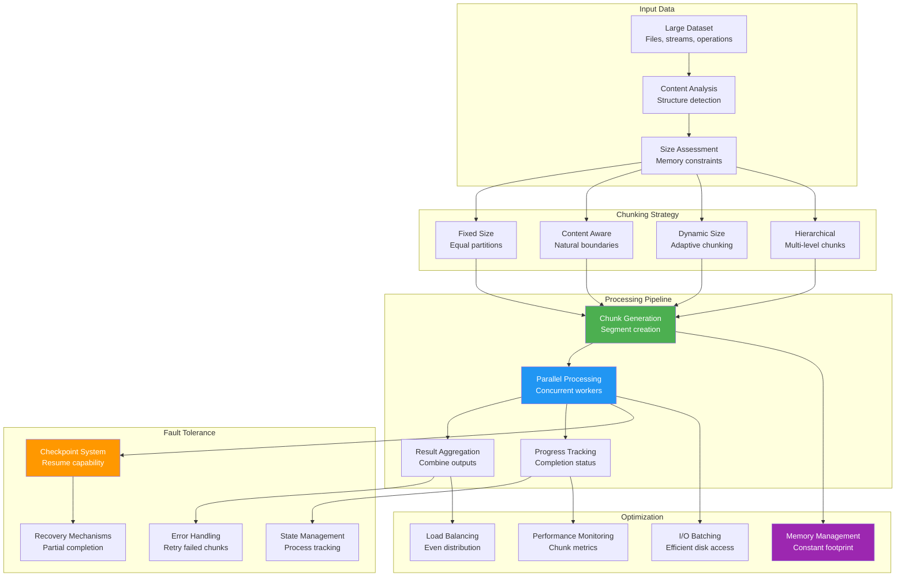

## The Complete Blueprint

Chunking patterns address the fundamental challenge of processing arbitrarily large datasets or operations within finite memory constraints by breaking them into smaller, manageable pieces that can be processed sequentially or in parallel. This pattern enables systems to handle datasets larger than available memory while providing benefits like fault tolerance, progress tracking, and parallel processing capabilities. Chunking strategies vary from fixed-size partitioning for uniform data to content-aware segmentation for complex structures, with optimal chunk sizes determined by balancing memory usage, processing overhead, and I/O efficiency. The pattern is essential for file uploads, data streaming, batch processing, and any operation where resource constraints require incremental processing.

### What You'll Master

- **Chunking strategies** including fixed-size, content-aware, and dynamic partitioning for different data types and processing requirements
- **Parallel processing patterns** distributing chunks across multiple workers while managing synchronization and result aggregation
- **Memory optimization techniques** maintaining constant memory footprint regardless of input data size through streaming chunk processing
- **Fault tolerance mechanisms** with checkpoint systems, retry logic, and partial completion tracking for robust data processing
- **Performance tuning methods** optimizing chunk sizes based on I/O patterns, processing complexity, and system resources
- **Real-world applications** in file uploads, data pipelines, video processing, database operations, and distributed computing systems

## Essential Question

**How do we handle increasing load without sacrificing performance using chunking?**

# Chunking

## The Essential Question

**How can systems process arbitrarily large datasets or operations without exhausting memory, while enabling parallel processing and fault tolerance?**

**Tagline**: *"Break the unbreakable - process infinite data with finite resources."*

!!! warning "🥈 Silver Tier Pattern"
    **Data Segmentation Strategy** • Essential for large-scale processing
    
    The fundamental pattern that enables processing datasets larger than available memory through intelligent segmentation. While critical for big data scenarios, many modern frameworks abstract this complexity.

---

### The Story

You can't eat a whole pizza at once - you cut it into slices. Similarly, you can't process a 100GB file in 8GB RAM - you chunk it into manageable pieces.

Chunking is the art of breaking large problems into small, processable pieces while maintaining the ability to reassemble the complete result.

### When to Use

| ✅ **Use When** | ❌ **Avoid When** |
|----------------|------------------|
| Processing files larger than RAM | Files smaller than available memory |
| Streaming real-time data | Atomic operations requiring full consistency |
| Need progress reporting | Simple, fast operations |
| Want parallel processing | Tight latency requirements (< 1ms) |
| Memory-constrained environments | When frameworks handle chunking |

### Core Benefits

| Benefit | Without Chunking | With Chunking |
|---------|------------------|---------------|
| **Memory Usage** | Linear growth ❌ | Constant ✓ |
| **Fault Tolerance** | All-or-nothing ❌ | Resume from checkpoint ✓ |
| **Parallelism** | Sequential only ❌ | Multi-threaded ✓ |
| **Progress** | No visibility ❌ | Real-time updates ✓ |
| **User Experience** | Long wait ❌ | Streaming results ✓ |

### Real-World Examples

- **Netflix**: Video encoding in 10-second chunks for parallel processing
- **Spotify**: Audio streaming in 3-second segments for smooth playback  
- **MongoDB**: GridFS stores files as 255KB chunks for efficient retrieval
- **Elasticsearch**: Index documents in batches of 1,000-10,000 for performance
- **Git**: Large files broken into objects with delta compression

---

### The Problem Space

!!! danger "🔥 The Monolithic Processing Disaster"
    Video processing startup tried to load entire 4K movies into memory:
    - **4K movie**: 50GB raw footage
    - **Available RAM**: 16GB server
    - **Result**: Constant crashes, 6-hour processing times
    - **Impact**: Customer churn, $100K/month in compute waste
    - **Solution**: 10-second video chunks → 20x faster, 90% less memory

### Chunking Strategies

### Implementation

**Key Concepts:** Pattern implemented in production systems like etcd, Kubernetes, and cloud platforms.

### Basic Implementation Flow

---

### Implementation

**Key Concepts:** Pattern implemented in production systems like etcd, Kubernetes, and cloud platforms.

#### Fixed-Size File Chunking

**Process Overview:** See production implementations for details

### Performance Tuning

!!! tip "Optimization Checklist"
    - **Right-size chunks**: Test different sizes with real data
    - **Monitor memory usage**: Ensure constant memory consumption
    - **Track processing time**: Optimize for consistent chunk timing
    - **Handle failures gracefully**: Don't let one bad chunk kill the job
    - **Progress reporting**: Keep users informed on long operations
    - **Parallel processing**: Use all available CPU cores
    - **I/O optimization**: Batch file operations where possible

---

### Production Case Study: Elasticsearch Bulk Indexing

!!! info "🏢 Real-World Implementation"
    **Company**: Elasticsearch  
    **Scale**: Billions of documents indexed daily  
    **Challenge**: Balance indexing speed with cluster stability  
    
    **Key Patterns**:
    
    1. **Dynamic Batch Sizing**: Start with 1000 docs, adjust based on response time
    2. **Error Handling**: Retry failed docs in smaller batches
    3. **Back-pressure**: Reduce chunk size when cluster is under load
    4. **Memory Management**: Limit concurrent chunks to prevent OOM
    
    **Results**:
    - 10x faster indexing vs. single document inserts
    - 95% reduction in HTTP overhead
    - Automatic adaptation to cluster health
    - Graceful degradation under load

#### Hierarchical Chunking

📄 View mermaid code (8 lines)

**System Flow:** Input → Processing → Output

For very large datasets, use multiple chunking levels to manage both memory and coordination overhead.

#### Streaming Chunk Pipeline

For real-time systems, maintain a pipeline where chunks are continuously processed as data arrives.

#### Machine Learning Integration

- **ML-driven chunk sizing**: Predict optimal chunk size based on data characteristics
- **Content-aware splitting**: Use AI to identify natural boundaries in unstructured data
- **Performance prediction**: Forecast processing time and resource needs per chunk

#### Cloud-Native Chunking

- **Serverless functions**: Each chunk processed by a separate function
- **Auto-scaling**: Spin up/down processors based on chunk queue depth
- **Cost optimization**: Balance processing speed with cloud compute costs

### Economic Impact

!!! success "💰 Cost Savings Through Chunking"
    **Before**: Monolithic 100GB processing job
    - Takes 6 hours on single machine
    - Requires 128GB RAM instance ($200/day)
    - Fails 20% of the time, requires restart
    
    **After**: 1GB chunked processing
    - Takes 30 minutes with 10 parallel chunks
    - Uses 8GB RAM instances ($20/day each, $200 total)
    - Individual chunk failures don't affect others
    
    **Savings**: 12x faster, same cost, 95% reliability improvement

---

## Quick Reference

### Decision Matrix

📄 View mermaid code (10 lines)

**Decision Flow:** Evaluate conditions → Choose path → Execute

### Implementation

**Key Concepts:** Pattern implemented in production systems like etcd, Kubernetes, and cloud platforms.

### Common Anti-Patterns

!!! danger "Mistakes to Avoid"
    1. **❌ Chunk too small**: Overhead dominates processing time
    2. **❌ Chunk too large**: Memory pressure and long failure recovery
    3. **❌ Ignore boundaries**: Split logical units (records, transactions)
    4. **❌ No error handling**: One bad chunk kills entire job
    5. **❌ No progress tracking**: Users have no visibility into long operations
    6. **❌ Fixed sizing**: Not adapting to varying data complexity

---

## Key Takeaways

!!! success "🎓 Master These Concepts"
    1. **Chunking enables processing infinite data with finite resources**
    2. **Choose chunk size based on data type and system constraints**
    3. **Always handle chunk failures gracefully - continue processing**
    4. **Monitor and adapt chunk sizes based on actual performance**
    5. **Parallel processing multiplies the benefits of chunking**

!!! quote "Production Wisdom"
    *"The best chunk size is the one that keeps your system's memory constant, your processing time predictable, and your error recovery fast. When in doubt, start small and adapt based on real performance data."*
    
    — Senior Engineer, Data Platform Team

---

## Related Patterns

- **[Loading](../performance/loading.md)** - Efficient data loading strategies
- **[Batching](../performance/batching.md)** - Grouping operations for efficiency  
- **[Streaming](../performance/streaming.md)** - Real-time data processing
- **[Pagination](../ui/pagination.md)** - Chunking for user interfaces
- **[Circuit Breaker](../reliability/circuit-breaker.md)** - Handling chunk processing failures

