---
best-for:
- File upload/download systems
- Large data processing pipelines
- Memory-constrained environments
- Streaming data processing
category: scaling
current_relevance: mainstream
description: Break large datasets or operations into smaller, manageable pieces for
  improved performance, memory usage, and fault tolerance
difficulty: intermediate
essential_question: How do we handle increasing load without sacrificing performance
  using chunking?
excellence_tier: silver
introduced: 1990-01
last-updated: 2025-08-03
pattern_status: recommended
prerequisites:
- streaming
- batching
- memory-management
reading-time: 30 min
status: complete
tagline: Master chunking for distributed systems success
title: Chunking
trade-offs:
  cons:
  - Increased complexity
  - Chunk boundary handling
  - Potential performance overhead
  pros:
  - Reduced memory footprint
  - Better fault tolerance
  - Progressive processing
type: pattern
when-not-to-use: Small datasets, atomic operations requiring full consistency, real-time
  processing with strict latency requirements
when-to-use: Large data processing, file uploads/downloads, streaming data, memory-constrained
  environments
---

## Essential Question

**How do we handle increasing load without sacrificing performance using chunking?**

# Chunking

## The Essential Question

**How can systems process arbitrarily large datasets or operations without exhausting memory, while enabling parallel processing and fault tolerance?**

**Tagline**: *"Break the unbreakable - process infinite data with finite resources."*

!!! warning "🥈 Silver Tier Pattern"
    **Data Segmentation Strategy** • Essential for large-scale processing
    
    The fundamental pattern that enables processing datasets larger than available memory through intelligent segmentation. While critical for big data scenarios, many modern frameworks abstract this complexity.

---

## Level 1: Intuition (5 minutes)

### The Story

You can't eat a whole pizza at once - you cut it into slices. Similarly, you can't process a 100GB file in 8GB RAM - you chunk it into manageable pieces.

Chunking is the art of breaking large problems into small, processable pieces while maintaining the ability to reassemble the complete result.

### When to Use

| ✅ **Use When** | ❌ **Avoid When** |
|----------------|------------------|
| Processing files larger than RAM | Files smaller than available memory |
| Streaming real-time data | Atomic operations requiring full consistency |
| Need progress reporting | Simple, fast operations |
| Want parallel processing | Tight latency requirements (< 1ms) |
| Memory-constrained environments | When frameworks handle chunking |

### The Problem: Memory Explosion

```mermaid
flowchart LR
    subgraph "Without Chunking ❌"
        F1[100GB File] --> M1[8GB RAM]
        M1 --> X1[❌ OUT OF MEMORY]
        
        style M1 fill:#ef4444,stroke:#dc2626
        style X1 fill:#7f1d1d,stroke:#451a03
    end
    
    subgraph "With Chunking ✓"
        F2[100GB File] --> C1[1MB Chunks]
        C1 --> M2[8GB RAM]
        M2 --> P1[✓ Process Continuously]
        
        style C1 fill:#10b981,stroke:#059669
        style M2 fill:#10b981,stroke:#059669
        style P1 fill:#065f46,stroke:#047857
    end
```



### Core Benefits

| Benefit | Without Chunking | With Chunking |
|---------|------------------|---------------|
| **Memory Usage** | Linear growth ❌ | Constant ✓ |
| **Fault Tolerance** | All-or-nothing ❌ | Resume from checkpoint ✓ |
| **Parallelism** | Sequential only ❌ | Multi-threaded ✓ |
| **Progress** | No visibility ❌ | Real-time updates ✓ |
| **User Experience** | Long wait ❌ | Streaming results ✓ |

### Real-World Examples

- **Netflix**: Video encoding in 10-second chunks for parallel processing
- **Spotify**: Audio streaming in 3-second segments for smooth playback  
- **MongoDB**: GridFS stores files as 255KB chunks for efficient retrieval
- **Elasticsearch**: Index documents in batches of 1,000-10,000 for performance
- **Git**: Large files broken into objects with delta compression

---

## Level 2: Foundation (15 minutes)

### The Problem Space

!!! danger "🔥 The Monolithic Processing Disaster"
    Video processing startup tried to load entire 4K movies into memory:
    - **4K movie**: 50GB raw footage
    - **Available RAM**: 16GB server
    - **Result**: Constant crashes, 6-hour processing times
    - **Impact**: Customer churn, $100K/month in compute waste
    - **Solution**: 10-second video chunks → 20x faster, 90% less memory

### Chunking Strategies


<details>
<summary>View implementation code</summary>



</details>

```mermaid
flowchart TD
    subgraph "Fixed-Size Chunking"
        FS["Fixed Size\n(e.g., 1MB blocks)"]
        FSPros["✓ Simple\n✓ Predictable memory\n✓ Easy parallelization"]
        FSCons["❌ May split logical units\n❌ Fixed overhead"]
        
        FS --> FSPros
        FS --> FSCons
    end
    
    subgraph "Content-Aware Chunking"
        CA["Content Boundaries\n(e.g., by records)"]
        CAPros["✓ Logical units preserved\n✓ Better for processing"]
        CACons["❌ Variable memory usage\n❌ Complex boundary detection"]
        
        CA --> CAPros
        CA --> CACons
    end
    
    subgraph "Adaptive Chunking"
        AD["Dynamic Size\n(based on performance)"]
        ADPros["✓ Self-optimizing\n✓ Handles varying complexity"]
        ADCons["❌ Implementation complexity\n❌ Hard to predict"]
        
        AD --> ADPros
        AD --> ADCons
    end
```

### Implementation Patterns

| Pattern | Use Case | Chunk Size | Memory | Complexity |
|---------|----------|------------|--------|------------|
| **Fixed-Size** | File processing | 1-10MB | Constant | Low |
| **Record-Based** | CSV/JSON processing | 1K-100K records | Variable | Medium |
| **Time-Based** | Stream processing | 1-60 seconds | Bounded | Medium |
| **Adaptive** | Variable complexity | Dynamic | Self-tuning | High |

### Basic Implementation Flow


---

## Level 3: Deep Dive (25 minutes)

### Implementation Approaches

#### Fixed-Size File Chunking

```python
class FileChunker:
    def __init__(self, chunk_size=1024*1024):  # 1MB chunks
        self.chunk_size = chunk_size
        
    def process_large_file(self, filename, processor):
        """Process file in memory-efficient chunks"""
        with open(filename, 'rb') as f:
            chunk_id = 0
            while chunk := f.read(self.chunk_size):
                try:
                    result = processor(chunk)
                    yield f"chunk_{chunk_id:06d}", result
                    chunk_id += 1
                except Exception as e:
                    print(f"Chunk {chunk_id} failed: {e}")
                    # Continue processing other chunks
```

#### Streaming Data Chunker


<details>
<summary>View implementation code</summary>

```python
class StreamChunker:
    def __init__(self, chunk_size=1000, time_window=60):  
        self.chunk_size = chunk_size  # Records per chunk
        self.time_window = time_window  # Seconds per chunk
        
    async def chunk_stream(self, data_stream):
        """Chunk streaming data by size or time"""
        chunk = []
        start_time = time.time()
        
        async for item in data_stream:
            chunk.append(item)
            
            # Chunk full or time window expired
            if (len(chunk) >= self.chunk_size or 
                time.time() - start_time >= self.time_window):
                
                yield chunk.copy()
                chunk.clear()
                start_time = time.time()
        
        # Yield final partial chunk
        if chunk:
            yield chunk
```

</details>

#### Database Query Chunking


<details>
<summary>View implementation code</summary>

```python
class DatabaseChunker:
    """Process large database queries in chunks"""
    
    def __init__(self, chunk_size=1000):
        self.chunk_size = chunk_size
        
    def chunk_query(self, query, params=()):
        """Execute query in chunks using LIMIT/OFFSET"""
        offset = 0
        
        while True:
            # Add LIMIT/OFFSET to query
            chunked_query = f"{query} LIMIT {self.chunk_size} OFFSET {offset}"
            
            results = self.execute_query(chunked_query, params)
            if not results:
                break
                
            yield results
            offset += self.chunk_size
    
    def chunk_by_id(self, table, id_column, where_clause=""):
        """More efficient keyset pagination"""
        last_id = 0
        
        while True:
            query = f"""
                SELECT * FROM {table} 
                WHERE {id_column} > %s {('AND ' + where_clause) if where_clause else ''}
                ORDER BY {id_column} 
                LIMIT {self.chunk_size}
            """
            
            results = self.execute_query(query, (last_id,))
            if not results:
                break
                
            yield results
            last_id = results[-1][id_column]  # Update for next iteration
```

</details>

### Parallel Processing Pattern


<details>
<summary>View implementation code</summary>

```python
import concurrent.futures
import threading

class ParallelChunker:
    def __init__(self, max_workers=4):
        self.max_workers = max_workers
        self.progress_lock = threading.Lock()
        self.completed_chunks = 0
        
    def process_parallel(self, chunks, processor):
        """Process chunks in parallel with progress tracking"""
        results = {}
        total_chunks = len(chunks)
        
        with concurrent.futures.ThreadPoolExecutor(max_workers=self.max_workers) as executor:
            # Submit all chunks
            future_to_chunk = {
                executor.submit(processor, chunk_data): chunk_id 
                for chunk_id, chunk_data in chunks
            }
            
            # Collect results as they complete
            for future in concurrent.futures.as_completed(future_to_chunk):
                chunk_id = future_to_chunk[future]
                try:
                    result = future.result()
                    results[chunk_id] = result
                    
                    with self.progress_lock:
                        self.completed_chunks += 1
                        progress = (self.completed_chunks / total_chunks) * 100
                        print(f"Progress: {progress:.1f}% ({self.completed_chunks}/{total_chunks})")
                        
                except Exception as e:
                    print(f"Chunk {chunk_id} failed: {e}")
                    
        return results
```

</details>

### Memory-Mapped Chunking


<details>
<summary>View implementation code</summary>

```python
import mmap

class MemoryMappedChunker:
    """Ultra-low memory chunking using memory mapping"""
    
    def __init__(self, chunk_size=1024*1024):
        self.chunk_size = chunk_size
    
    def process_huge_file(self, filename, processor):
        """Process file using memory mapping - O(1) memory"""
        with open(filename, 'rb') as f:
            with mmap.mmap(f.fileno(), 0, access=mmap.ACCESS_READ) as mm:
                file_size = len(mm)
                
                for offset in range(0, file_size, self.chunk_size):
                    end_offset = min(offset + self.chunk_size, file_size)
                    chunk_data = mm[offset:end_offset]
                    
                    try:
                        result = processor(chunk_data)
                        yield {'offset': offset, 'result': result}
                    except Exception as e:
                        print(f"Error at offset {offset}: {e}")
```

</details>

---

## Level 4: Expert Practitioner (35 minutes)

### Production Optimization

#### Chunk Size Guidelines

| Scenario | Chunk Size | Memory Impact | Performance |
|----------|------------|---------------|-------------|
| **Large files** | 1-10MB | Predictable | Good I/O efficiency |
| **Database queries** | 1K-10K rows | Variable | Avoids timeouts |
| **API processing** | 100-1K items | Low | Rate limit friendly |
| **Real-time streams** | 1-60 seconds | Bounded | Latency vs throughput |
| **Memory constrained** | 64-256KB | Minimal | Constant memory |

#### Adaptive Chunking Strategy

```python  
class SmartChunker:
    def __init__(self, target_time=1.0):
        self.chunk_size = 1000
        self.target_time = target_time
        
    def auto_adjust(self, processing_time):
        """Adjust chunk size based on performance"""
        if processing_time > self.target_time * 1.5:
            self.chunk_size = max(100, int(self.chunk_size * 0.7))  # Smaller chunks
        elif processing_time < self.target_time * 0.5:
            self.chunk_size = min(10000, int(self.chunk_size * 1.3))  # Larger chunks
```

#### Error Recovery Patterns

| Strategy | Use Case | Recovery Time | Complexity |
|----------|----------|---------------|------------|
| **Skip & Continue** | Non-critical data | Immediate | Low |
| **Retry with Backoff** | Transient failures | Seconds to minutes | Medium |
| **Checkpoint & Resume** | Long-running jobs | Varies | High |
| **Dead Letter Queue** | Persistent failures | Manual intervention | High |

### Monitoring & Optimization


<details>
<summary>View implementation code</summary>


</details>

### Performance Tuning

!!! tip "Optimization Checklist"
    - **Right-size chunks**: Test different sizes with real data
    - **Monitor memory usage**: Ensure constant memory consumption
    - **Track processing time**: Optimize for consistent chunk timing
    - **Handle failures gracefully**: Don't let one bad chunk kill the job
    - **Progress reporting**: Keep users informed on long operations
    - **Parallel processing**: Use all available CPU cores
    - **I/O optimization**: Batch file operations where possible

---

## Level 5: Mastery (45 minutes)

### Production Case Study: Elasticsearch Bulk Indexing

!!! info "🏢 Real-World Implementation"
    **Company**: Elasticsearch  
    **Scale**: Billions of documents indexed daily  
    **Challenge**: Balance indexing speed with cluster stability  
    
    **Key Patterns**:
    
    1. **Dynamic Batch Sizing**: Start with 1000 docs, adjust based on response time
    2. **Error Handling**: Retry failed docs in smaller batches
    3. **Back-pressure**: Reduce chunk size when cluster is under load
    4. **Memory Management**: Limit concurrent chunks to prevent OOM
    
    **Results**:
    - 10x faster indexing vs. single document inserts
    - 95% reduction in HTTP overhead
    - Automatic adaptation to cluster health
    - Graceful degradation under load

### Advanced Patterns

#### Hierarchical Chunking


For very large datasets, use multiple chunking levels to manage both memory and coordination overhead.

#### Streaming Chunk Pipeline


For real-time systems, maintain a pipeline where chunks are continuously processed as data arrives.

### Future Directions

#### Machine Learning Integration

- **ML-driven chunk sizing**: Predict optimal chunk size based on data characteristics
- **Content-aware splitting**: Use AI to identify natural boundaries in unstructured data
- **Performance prediction**: Forecast processing time and resource needs per chunk

#### Cloud-Native Chunking

- **Serverless functions**: Each chunk processed by a separate function
- **Auto-scaling**: Spin up/down processors based on chunk queue depth
- **Cost optimization**: Balance processing speed with cloud compute costs

### Economic Impact

!!! success "💰 Cost Savings Through Chunking"
    **Before**: Monolithic 100GB processing job
    - Takes 6 hours on single machine
    - Requires 128GB RAM instance ($200/day)
    - Fails 20% of the time, requires restart
    
    **After**: 1GB chunked processing
    - Takes 30 minutes with 10 parallel chunks
    - Uses 8GB RAM instances ($20/day each, $200 total)
    - Individual chunk failures don't affect others
    
    **Savings**: 12x faster, same cost, 95% reliability improvement

---

## Quick Reference

### Decision Matrix


### Implementation Checklist

**Phase 1: Planning**
- [ ] Analyze data characteristics (size, structure, complexity)
- [ ] Estimate memory constraints and processing time
- [ ] Choose chunking strategy (fixed, adaptive, content-aware)
- [ ] Design error handling and recovery

**Phase 2: Implementation**
- [ ] Implement basic chunking logic
- [ ] Add progress tracking and monitoring
- [ ] Handle chunk boundaries correctly
- [ ] Test with various data sizes and edge cases

**Phase 3: Optimization**
- [ ] Measure and tune chunk sizes
- [ ] Add parallel processing capabilities
- [ ] Implement adaptive sizing if needed
- [ ] Monitor production performance and adjust

### Quick Start Code

```python
# Simple file chunker
def chunk_file(filename, chunk_size=1024*1024):
    with open(filename, 'rb') as f:
        chunk_id = 0
        while chunk := f.read(chunk_size):
            yield f"chunk_{chunk_id}", chunk
            chunk_id += 1

# Usage
for chunk_id, data in chunk_file('large_file.bin'):
    result = process_chunk(data)
    print(f"Processed {chunk_id}: {len(data)} bytes -> {result}")
```

### Common Anti-Patterns

!!! danger "Mistakes to Avoid"
    1. **❌ Chunk too small**: Overhead dominates processing time
    2. **❌ Chunk too large**: Memory pressure and long failure recovery
    3. **❌ Ignore boundaries**: Split logical units (records, transactions)
    4. **❌ No error handling**: One bad chunk kills entire job
    5. **❌ No progress tracking**: Users have no visibility into long operations
    6. **❌ Fixed sizing**: Not adapting to varying data complexity

---

## Key Takeaways

!!! success "🎓 Master These Concepts"
    1. **Chunking enables processing infinite data with finite resources**
    2. **Choose chunk size based on data type and system constraints**
    3. **Always handle chunk failures gracefully - continue processing**
    4. **Monitor and adapt chunk sizes based on actual performance**
    5. **Parallel processing multiplies the benefits of chunking**

!!! quote "Production Wisdom"
    *"The best chunk size is the one that keeps your system's memory constant, your processing time predictable, and your error recovery fast. When in doubt, start small and adapt based on real performance data."*
    
    — Senior Engineer, Data Platform Team

---

## Related Patterns

- **[Loading](../performance/loading.md)** - Efficient data loading strategies
- **[Batching](../performance/batching.md)** - Grouping operations for efficiency  
- **[Streaming](../performance/streaming.md)** - Real-time data processing
- **[Pagination](../ui/pagination.md)** - Chunking for user interfaces
- **[Circuit Breaker](../reliability/circuit-breaker.md)** - Handling chunk processing failures