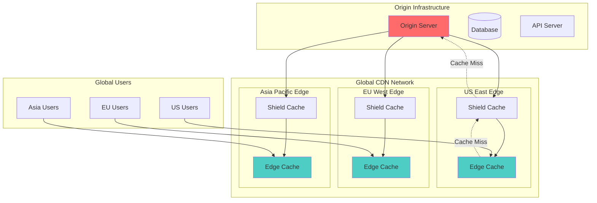

# Content Delivery Network (CDN)

## The Complete Blueprint

Content Delivery Networks revolutionize web performance by caching and serving your content from edge locations distributed globally, dramatically reducing latency and improving user experience. Instead of forcing a user in Sydney to wait for images to load from a server in New York (300ms+ latency), CDNs place cached copies at edge servers near every major population center, delivering content in under 50ms.

This pattern transforms how content reaches users by creating a global network of intelligent caches that automatically replicate, optimize, and serve your static assets, dynamic content, and even API responses from the location closest to each user. When Netflix delivers 4K video streams globally, when e-commerce sites load product images instantly worldwide, or when news sites handle traffic spikes during breaking news, they're leveraging CDN networks that can serve petabytes of content with millisecond latency.

### What You'll Master

- **Global Performance**: Reduce page load times by 50-80% through intelligent edge caching
- **Origin Protection**: Shield your servers from traffic spikes and DDoS attacks
- **Intelligent Caching**: Implement cache strategies for static assets, dynamic content, and API responses
- **Cost Optimization**: Reduce bandwidth costs by up to 90% through efficient edge delivery
- **Real-Time Purging**: Instantly invalidate cached content across the global network

Content delivery at edge

## See Also

- [Eventual Consistency](/pattern-library/data-management/eventual-consistency)
- [Event Streaming](/pattern-library/architecture/event-streaming)
- [Rate Limiting Pattern](/pattern-library/scaling/rate-limiting)
