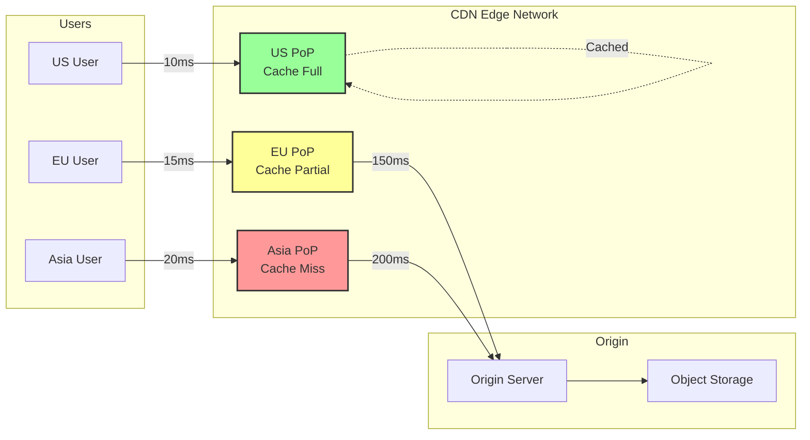

# Content Delivery Network (CDN) Pattern

!!! success "🏆 Gold Standard Pattern"
    **Static Content at the Edge** • Akamai, Cloudflare, Fastly proven
    
    CDNs cache and serve static content from edge locations closest to users, dramatically reducing latency and origin server load. Essential for any global web application.
    
    **Key Success Metrics:**
    - Cloudflare: 35TB/s global capacity
    - Akamai: 95% cache hit ratio average
    - Fastly: <50ms global p50 latency

<div class="axiom-box">
<h4>⚛️ Law 2: Asynchronous Reality</h4>

CDNs are the ultimate acknowledgment of physics - you cannot make light travel faster, but you can move the content closer. By caching at the edge, CDNs transform a 200ms transcontinental request into a 10ms local fetch.

**Key Insight**: Every millisecond of latency directly impacts user engagement. Amazon found that every 100ms of latency costs them 1% in sales.
</div>

## Problem

Serving content from a single origin creates multiple issues:
- **Latency**: Distance adds unavoidable delay
- **Bandwidth**: Origin bandwidth becomes bottleneck
- **Reliability**: Single point of failure
- **Cost**: Egress charges from cloud providers

## Solution



### CDN Architecture Components

| Component | Function | Key Metrics |
|-----------|----------|-------------|
| **Edge Servers** | Cache and serve content | Cache hit ratio, latency |
| **Origin Shield** | Protect origin from thundering herd | Request coalescing rate |
| **Purge System** | Invalidate stale content | Purge propagation time |
| **Analytics** | Usage and performance tracking | Real-time visibility |

## When to Use

### ✅ Perfect For:
- **Static assets**: Images, CSS, JavaScript
- **Video streaming**: Progressive download, HLS/DASH
- **Software distribution**: Updates, packages
- **API acceleration**: GET request caching

### ❌ Avoid For:
- **Dynamic content**: User-specific data
- **Secure data**: Sensitive information
- **Real-time data**: Live scores, stock prices
- **Small audience**: Regional applications

## Implementation Guide

### CDN Configuration Example

```javascript
// Cloudflare Workers for edge logic
addEventListener('fetch', event => {
  event.respondWith(handleRequest(event.request))
})

async function handleRequest(request) {
  const cache = caches.default
  const cacheKey = new Request(request.url, request)
  
  // Check cache first
  let response = await cache.match(cacheKey)
  
  if (!response) {
    // Cache miss - fetch from origin
    response = await fetch(request)
    
    // Cache successful responses
    if (response.status === 200) {
      const headers = new Headers(response.headers)
      headers.set('Cache-Control', 'public, max-age=3600')
      headers.set('X-Cache-Status', 'MISS')
      
      response = new Response(response.body, {
        status: response.status,
        statusText: response.statusText,
        headers: headers
      })
      
      event.waitUntil(cache.put(cacheKey, response.clone()))
    }
  } else {
    // Cache hit
    const headers = new Headers(response.headers)
    headers.set('X-Cache-Status', 'HIT')
    response = new Response(response.body, {
      status: response.status,
      statusText: response.statusText,
      headers: headers
    })
  }
  
  return response
}
```

### Cache Strategy Matrix

| Content Type | TTL | Purge Strategy | Hit Ratio Target |
|--------------|-----|----------------|------------------|
| **Images** | 1 year | URL versioning | >95% |
| **CSS/JS** | 1 week | Hash in filename | >90% |
| **API Responses** | 5 min | Tag-based purge | >80% |
| **HTML** | 10 min | Instant purge | >70% |

## Production Best Practices

### Cache Headers Configuration

```nginx
# Nginx origin configuration
location /static/ {
    expires 1y;
    add_header Cache-Control "public, immutable";
    add_header Vary "Accept-Encoding";
}

location /api/ {
    expires 5m;
    add_header Cache-Control "public, must-revalidate";
    add_header Surrogate-Control "max-age=300";
}

location / {
    expires 10m;
    add_header Cache-Control "public, must-revalidate";
    add_header Surrogate-Key "page-$request_uri";
}
```

## Real-World Examples

### Netflix's Open Connect
- **Scale**: 200+ Tbps peak traffic
- **Approach**: ISP-embedded cache appliances
- **Result**: 95% traffic served from ISP network

### Cloudflare's Global Network
- **Coverage**: 300+ cities worldwide
- **Capacity**: 35+ Tbps network capacity
- **Performance**: <10ms for cached content

## Common Pitfalls

1. **Cache Stampede**: Simultaneous cache misses overwhelming origin
2. **Stale Content**: Improper cache invalidation strategies
3. **HTTPS Overhead**: Not optimizing TLS termination
4. **Cookie Leakage**: Caching personalized content

## Performance Metrics

| Metric | Target | Impact |
|--------|--------|---------|
| **Cache Hit Ratio** | >90% | Origin load reduction |
| **Edge Latency** | <50ms p95 | User experience |
| **Origin Shield Hit** | >80% | Origin protection |
| **Purge Time** | <10s global | Content freshness |

## Related Patterns
- [Edge Computing](./edge-computing.md) - Computation at the edge
- [Geographic Load Balancing](./geographic-load-balancing.md) - Traffic routing
- [Caching Strategies](./caching-strategies.md) - General caching patterns
- [API Gateway](../integration/api-gateway.md) - API edge optimization

## References
- [High Performance Browser Networking](https://hpbn.co/)
- [Cloudflare Learning Center](https://www.cloudflare.com/learning/cdn/what-is-a-cdn/)
- [Netflix Open Connect](https://openconnect.netflix.com/)