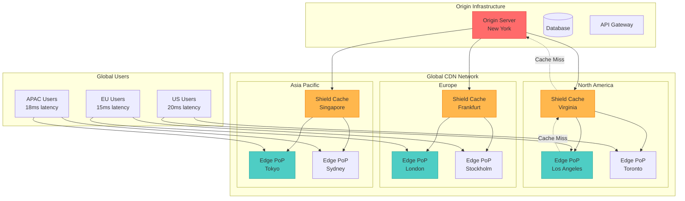
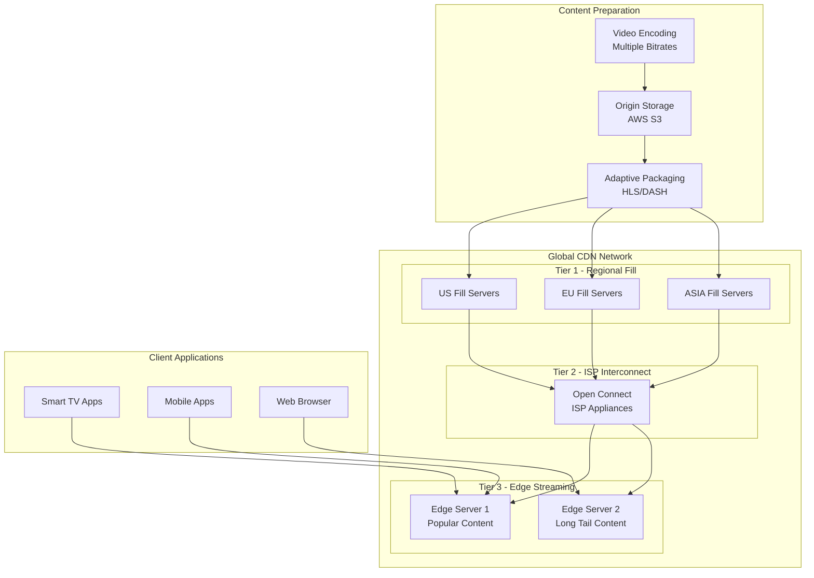
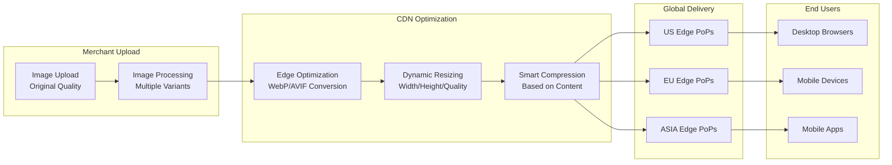
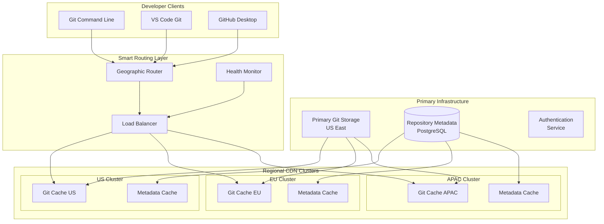

## The Complete Blueprint

Content Delivery Networks (CDN) revolutionize web performance by distributing content across a global network of edge servers positioned strategically near users worldwide, transforming the internet from a centralized to a distributed content delivery model. Instead of forcing a user in Sydney to retrieve images from a server in New York (300ms+ round-trip latency), CDNs place cached copies at edge locations in Australia, delivering content in under 20ms while simultaneously reducing load on origin servers and bandwidth costs by up to 90%.

The pattern operates through a sophisticated multi-tier caching hierarchy where edge servers closest to users handle the majority of requests, regional shield caches reduce origin load, and intelligent routing algorithms direct traffic to optimal locations based on network conditions, server health, and geographic proximity. Advanced CDNs provide real-time content optimization, dynamic compression, image optimization, security protection, and even edge computing capabilities that can execute code at the network edge. This pattern has become fundamental for modern web applications, enabling everything from Netflix's global 4K video streaming to e-commerce sites handling millions of product images and news platforms serving breaking news to global audiences instantly.



### What You'll Master

- **Multi-Tier Caching Architecture**: Design sophisticated caching hierarchies with edge, shield, and origin tiers for optimal performance
- **Global Performance Optimization**: Achieve 50-80% latency reduction through strategic edge placement and intelligent routing
- **Origin Protection Strategies**: Shield origin servers from traffic spikes, DDoS attacks, and bandwidth exhaustion
- **Dynamic Content Optimization**: Implement edge-side includes, real-time compression, and image optimization at scale
- **Cache Management**: Master cache invalidation, purging strategies, and real-time content updates across global networks
- **Cost Optimization**: Reduce bandwidth costs by 60-90% through intelligent caching and compression strategies

# Content Delivery Network (CDN) Pattern

!!! success "🏆 Gold Standard Pattern"
    **Global Content Delivery** • Cloudflare, AWS, Netflix proven
    
    Essential for global applications requiring high performance and availability. Transforms content delivery from centralized to distributed model with dramatic latency and cost benefits.

## Essential Question
**How do we deliver content to global users with minimal latency while reducing origin server load and bandwidth costs?**

## When to Use / When NOT to Use

### Use When
| Scenario | Example | Impact |
|----------|---------|--------|
| Global user base | International e-commerce sites | 50-80% latency reduction worldwide |
| High traffic volumes | News sites, popular blogs | 90% origin load reduction |
| Static/cacheable content | Images, CSS, JS, videos | 60-90% bandwidth cost savings |
| Mobile applications | App assets, API responses | 3-5x faster loading times |
| Streaming content | Video, audio, downloads | Unlimited scalability for spikes |

### DON'T Use When
| Scenario | Why | Alternative |
|----------|-----|-------------|
| Local/regional only users | No global latency benefit | Local load balancing |
| Highly personalized content | Cannot be cached effectively | Application-level optimization |
| Real-time bidirectional apps | WebSocket/streaming focused | Edge computing platforms |
| Very low traffic sites | Cost doesn't justify complexity | Simple hosting |

### Decision Matrix

| Factor | Score (1-5) | Reasoning |
|--------|-------------|-----------|
| **Complexity** | 2 | Low complexity for basic setup, moderate for advanced features like edge computing |
| **Performance Impact** | 5 | Dramatic improvement in global performance with proper cache configuration |
| **Operational Overhead** | 2 | Minimal ongoing management with modern CDN providers handling infrastructure |
| **Team Expertise Required** | 2 | Basic understanding of caching, HTTP headers, and DNS configuration |
| **Scalability** | 5 | Nearly unlimited scalability for content delivery with automatic global distribution |

**Overall Recommendation**: ✅ **RECOMMENDED** - Gold standard pattern for any application with global users or high traffic volumes.

## Level 1: Intuition (5 min)

### The Library Branch Network Analogy
<div class="axiom-box">
Like a library system with branches worldwide: instead of ordering books from a central library in New York (slow shipping), your local branch keeps popular books in stock (fast access). CDNs work similarly - popular content is cached at edge locations near users.
</div>

### Performance Impact Visualization
| Distance from Origin | Traditional Latency | CDN Latency | Improvement |
|----------------------|-------------------|-------------|-------------|
| **Local (< 100 miles)** | 50ms | 10ms | 5x faster |
| **Cross-country (2000 miles)** | 150ms | 25ms | 6x faster |
| **Transcontinental (6000 miles)** | 300ms | 35ms | 8.5x faster |
| **Global (12000 miles)** | 500ms+ | 50ms | 10x+ faster |

## Level 2: Foundation (10 min)

### CDN Architecture Layers

#### 1. Edge Layer (Point of Presence - PoP)
```json
{
  "purpose": "First point of contact for users",
  "characteristics": {
    "quantity": "300-400 locations globally",
    "cache_size": "10-100GB per server",
    "specialization": "Hot content, fastest delivery"
  },
  "metrics": {
    "hit_ratio": "85-95%",
    "response_time": "5-20ms",
    "capacity": "10-100 Gbps per PoP"
  }
}
```

#### 2. Regional/Shield Layer  
```json
{
  "purpose": "Intermediate cache reducing origin load",
  "characteristics": {
    "quantity": "10-50 locations per region",
    "cache_size": "1-10TB per server", 
    "specialization": "Warm content, origin protection"
  },
  "metrics": {
    "hit_ratio": "60-80%",
    "response_time": "20-50ms",
    "capacity": "100-1000 Gbps per region"
  }
}
```

#### 3. Origin Layer
```json
{
  "purpose": "Authoritative source of content",
  "characteristics": {
    "quantity": "1-5 data centers",
    "storage": "Unlimited (customer infrastructure)",
    "specialization": "All content, source of truth"
  },
  "protection": "DDoS mitigation, rate limiting, health checks"
}
```

### Content Types and Caching Strategies

| Content Type | Cache Duration | Edge Optimization | Use Case |
|--------------|----------------|-------------------|----------|
| **Static Assets** | 1 year+ | Compression, minification | CSS, JS, images |
| **Semi-Static** | 1 hour - 1 day | Dynamic compression | Product pages, blogs |
| **Dynamic API** | 1-60 minutes | Query string normalization | Search results, feeds |
| **Personalized** | No cache | Pass-through with acceleration | User dashboards |
| **Streaming** | Segment-based | Adaptive bitrate | Video, audio content |

## Level 3: Deep Dive (15 min)

### Implementation Patterns

#### 1. Cache Control Strategy Implementation

```python
# Advanced CDN cache control implementation
from dataclasses import dataclass
from typing import Dict, Optional
import hashlib
import time

@dataclass
class CachePolicy:
    max_age: int  # seconds
    s_maxage: int  # CDN-specific max age
    stale_while_revalidate: int = 0
    stale_if_error: int = 0
    vary_headers: list = None
    public: bool = True
    
class CDNOptimizer:
    """Intelligent CDN configuration and optimization"""
    
    def __init__(self):
        self.content_policies = {
            'static': CachePolicy(
                max_age=31536000,  # 1 year
                s_maxage=31536000,
                public=True
            ),
            'semi_static': CachePolicy(
                max_age=3600,  # 1 hour
                s_maxage=86400,  # 1 day at CDN
                stale_while_revalidate=300,
                public=True
            ),
            'api': CachePolicy(
                max_age=300,  # 5 minutes
                s_maxage=1800,  # 30 minutes at CDN
                stale_while_revalidate=120,
                vary_headers=['Accept', 'Accept-Encoding'],
                public=False
            ),
            'user_content': CachePolicy(
                max_age=0,  # No browser cache
                s_maxage=300,  # 5 minutes at CDN
                vary_headers=['Cookie', 'Authorization'],
                public=False
            )
        }
    
    def get_cache_headers(self, content_type: str, 
                         file_path: str = None,
                         user_context: dict = None) -> Dict[str, str]:
        """Generate appropriate cache headers for content"""
        
        policy = self.content_policies.get(content_type, 
                                          self.content_policies['semi_static'])
        
        headers = {}
        
        # Basic cache control
        cache_directives = []
        
        if policy.public:
            cache_directives.append('public')
        else:
            cache_directives.append('private')
            
        cache_directives.append(f'max-age={policy.max_age}')
        
        if policy.s_maxage:
            cache_directives.append(f's-maxage={policy.s_maxage}')
            
        if policy.stale_while_revalidate:
            cache_directives.append(f'stale-while-revalidate={policy.stale_while_revalidate}')
            
        if policy.stale_if_error:
            cache_directives.append(f'stale-if-error={policy.stale_if_error}')
        
        headers['Cache-Control'] = ', '.join(cache_directives)
        
        # ETags for validation
        if file_path:
            headers['ETag'] = self.generate_etag(file_path)
        
        # Vary header for content negotiation
        if policy.vary_headers:
            headers['Vary'] = ', '.join(policy.vary_headers)
        
        # Last-Modified for static content
        if content_type == 'static':
            headers['Last-Modified'] = self.get_last_modified(file_path)
            
        return headers
    
    def generate_etag(self, content: str) -> str:
        """Generate strong ETag for content"""
        return f'"{hashlib.sha256(content.encode()).hexdigest()[:16]}"'
    
    def should_compress(self, content_type: str, size: int) -> bool:
        """Determine if content should be compressed"""
        compressible_types = {
            'text/html', 'text/css', 'text/javascript', 
            'application/javascript', 'application/json',
            'application/xml', 'text/xml', 'image/svg+xml'
        }
        
        # Don't compress very small files (overhead not worth it)
        if size < 1024:
            return False
            
        # Don't compress already compressed formats
        non_compressible = {
            'image/jpeg', 'image/png', 'image/gif',
            'video/', 'audio/', 'application/zip',
            'application/gzip'
        }
        
        for nc_type in non_compressible:
            if content_type.startswith(nc_type):
                return False
                
        return content_type in compressible_types

# Usage example
optimizer = CDNOptimizer()

# Configure different content types
static_headers = optimizer.get_cache_headers('static', '/css/main.css')
api_headers = optimizer.get_cache_headers('api', user_context={'user_id': 123})
user_headers = optimizer.get_cache_headers('user_content')
```

#### 2. Multi-CDN Strategy Implementation

```python
# Multi-CDN failover and optimization
import asyncio
import aiohttp
from typing import List, Dict, Optional
import time

@dataclass
class CDNProvider:
    name: str
    base_url: str
    priority: int = 1
    health_check_url: str = None
    cost_per_gb: float = 0.0
    regions: List[str] = None
    
class MultiCDNManager:
    """Manage multiple CDN providers for resilience and optimization"""
    
    def __init__(self, providers: List[CDNProvider]):
        self.providers = sorted(providers, key=lambda p: p.priority)
        self.health_status = {}
        self.performance_metrics = {}
        self.last_health_check = 0
        self.health_check_interval = 60  # seconds
    
    async def get_optimal_cdn(self, content_path: str, 
                             user_location: str = None) -> CDNProvider:
        """Select optimal CDN based on health, performance, and cost"""
        
        # Ensure health check is recent
        if time.time() - self.last_health_check > self.health_check_interval:
            await self.check_all_cdn_health()
        
        # Filter healthy providers
        healthy_providers = [
            p for p in self.providers 
            if self.health_status.get(p.name, False)
        ]
        
        if not healthy_providers:
            # Fallback to highest priority if none healthy
            return self.providers[0]
        
        # Select based on user location if available
        if user_location:
            for provider in healthy_providers:
                if user_location in (provider.regions or []):
                    return provider
        
        # Select based on performance metrics
        best_provider = healthy_providers[0]
        best_score = float('inf')
        
        for provider in healthy_providers:
            metrics = self.performance_metrics.get(provider.name, {})
            # Score combines latency and cost
            score = (metrics.get('avg_latency', 1000) * 
                    provider.cost_per_gb * 100)
            
            if score < best_score:
                best_score = score
                best_provider = provider
        
        return best_provider
    
    async def check_all_cdn_health(self):
        """Check health of all CDN providers"""
        tasks = []
        
        for provider in self.providers:
            if provider.health_check_url:
                tasks.append(self.check_cdn_health(provider))
        
        await asyncio.gather(*tasks, return_exceptions=True)
        self.last_health_check = time.time()
    
    async def check_cdn_health(self, provider: CDNProvider):
        """Check individual CDN health and performance"""
        try:
            start_time = time.time()
            
            async with aiohttp.ClientSession() as session:
                async with session.get(
                    provider.health_check_url,
                    timeout=aiohttp.ClientTimeout(total=5)
                ) as response:
                    latency = (time.time() - start_time) * 1000  # ms
                    
                    if response.status == 200:
                        self.health_status[provider.name] = True
                        
                        # Update performance metrics
                        if provider.name not in self.performance_metrics:
                            self.performance_metrics[provider.name] = {
                                'latencies': [],
                                'avg_latency': 0
                            }
                        
                        metrics = self.performance_metrics[provider.name]
                        metrics['latencies'].append(latency)
                        
                        # Keep only last 10 measurements
                        if len(metrics['latencies']) > 10:
                            metrics['latencies'] = metrics['latencies'][-10:]
                        
                        metrics['avg_latency'] = sum(metrics['latencies']) / len(metrics['latencies'])
                    else:
                        self.health_status[provider.name] = False
                        
        except Exception:
            self.health_status[provider.name] = False

    def get_content_url(self, provider: CDNProvider, content_path: str) -> str:
        """Generate full CDN URL for content"""
        return f"{provider.base_url.rstrip('/')}/{content_path.lstrip('/')}"

# Usage example
cdn_manager = MultiCDNManager([
    CDNProvider(
        name='cloudflare',
        base_url='https://cdn.example.com',
        priority=1,
        health_check_url='https://cdn.example.com/health',
        cost_per_gb=0.08,
        regions=['us-east', 'eu-west', 'asia']
    ),
    CDNProvider(
        name='aws_cloudfront', 
        base_url='https://d123456789.cloudfront.net',
        priority=2,
        health_check_url='https://d123456789.cloudfront.net/health',
        cost_per_gb=0.12,
        regions=['us-east', 'us-west', 'eu-central']
    )
])

# Get optimal CDN for user request
optimal_cdn = await cdn_manager.get_optimal_cdn('/images/hero.jpg', 'us-east')
content_url = cdn_manager.get_content_url(optimal_cdn, '/images/hero.jpg')
```

#### 3. Advanced Cache Invalidation

```python
# Intelligent cache invalidation system
from typing import Set, List, Dict
import asyncio
import aiohttp
import json

class CacheInvalidationManager:
    """Manage complex cache invalidation across CDN networks"""
    
    def __init__(self, cdn_configs: Dict):
        self.cdn_configs = cdn_configs
        self.invalidation_strategies = {
            'immediate': self.immediate_purge,
            'cascading': self.cascading_purge,
            'smart': self.smart_purge_by_tags
        }
    
    async def invalidate_content(self, 
                                paths: List[str],
                                strategy: str = 'smart',
                                tags: List[str] = None,
                                priority: str = 'normal') -> Dict:
        """Invalidate content across CDN networks"""
        
        results = {}
        strategy_func = self.invalidation_strategies.get(
            strategy, self.immediate_purge
        )
        
        # Execute invalidation strategy
        for cdn_name, config in self.cdn_configs.items():
            try:
                result = await strategy_func(
                    cdn_name, config, paths, tags, priority
                )
                results[cdn_name] = result
            except Exception as e:
                results[cdn_name] = {'error': str(e), 'success': False}
        
        return results
    
    async def immediate_purge(self, cdn_name: str, config: Dict,
                            paths: List[str], tags: List[str],
                            priority: str) -> Dict:
        """Immediate cache purge for all specified paths"""
        
        if cdn_name == 'cloudflare':
            return await self.cloudflare_purge(config, paths, tags)
        elif cdn_name == 'aws_cloudfront':
            return await self.cloudfront_invalidation(config, paths)
        elif cdn_name == 'fastly':
            return await self.fastly_purge(config, paths, tags)
        else:
            raise ValueError(f"Unsupported CDN: {cdn_name}")
    
    async def cascading_purge(self, cdn_name: str, config: Dict,
                            paths: List[str], tags: List[str],
                            priority: str) -> Dict:
        """Purge content in cascading manner (edge -> shield -> origin)"""
        
        results = {'stages': []}
        
        # Stage 1: Purge edge caches
        edge_result = await self.purge_edge_caches(cdn_name, config, paths)
        results['stages'].append({'stage': 'edge', 'result': edge_result})
        
        # Wait before purging shield caches
        await asyncio.sleep(2)
        
        # Stage 2: Purge shield/regional caches
        shield_result = await self.purge_shield_caches(cdn_name, config, paths)
        results['stages'].append({'stage': 'shield', 'result': shield_result})
        
        return results
    
    async def smart_purge_by_tags(self, cdn_name: str, config: Dict,
                                paths: List[str], tags: List[str],
                                priority: str) -> Dict:
        """Smart purging using content tags and dependencies"""
        
        if not tags:
            # Fall back to immediate purge if no tags
            return await self.immediate_purge(cdn_name, config, paths, tags, priority)
        
        # Find related content by tags
        related_paths = await self.find_related_content_by_tags(tags)
        all_paths = list(set(paths + related_paths))
        
        # Prioritize purging based on content type
        priority_order = self.categorize_paths_by_priority(all_paths)
        
        results = {'batches': []}
        
        for priority_level, batch_paths in priority_order.items():
            batch_result = await self.immediate_purge(
                cdn_name, config, batch_paths, tags, priority_level
            )
            results['batches'].append({
                'priority': priority_level,
                'paths': len(batch_paths),
                'result': batch_result
            })
            
            # Small delay between priority levels
            if priority_level != 'critical':
                await asyncio.sleep(1)
        
        return results
    
    async def cloudflare_purge(self, config: Dict, paths: List[str], 
                              tags: List[str]) -> Dict:
        """Purge content from Cloudflare CDN"""
        headers = {
            'Authorization': f'Bearer {config["api_token"]}',
            'Content-Type': 'application/json'
        }
        
        purge_data = {}
        
        if paths:
            purge_data['files'] = [
                f"https://{config['zone']}/{path.lstrip('/')}" 
                for path in paths
            ]
        
        if tags:
            purge_data['tags'] = tags
        
        async with aiohttp.ClientSession() as session:
            url = f"https://api.cloudflare.com/client/v4/zones/{config['zone_id']}/purge_cache"
            
            async with session.post(url, headers=headers, 
                                   json=purge_data) as response:
                result = await response.json()
                
                return {
                    'success': result.get('success', False),
                    'message': result.get('message', ''),
                    'paths_purged': len(paths),
                    'tags_purged': len(tags or [])
                }
    
    def categorize_paths_by_priority(self, paths: List[str]) -> Dict[str, List[str]]:
        """Categorize paths by purging priority"""
        categories = {
            'critical': [],    # Homepage, critical APIs
            'high': [],        # Product pages, popular content
            'normal': [],      # Regular pages
            'low': []          # Static assets, images
        }
        
        for path in paths:
            if path in ['/', '/index.html', '/api/status']:
                categories['critical'].append(path)
            elif path.startswith('/api/') or '/product/' in path:
                categories['high'].append(path)
            elif path.endswith(('.css', '.js', '.png', '.jpg', '.gif')):
                categories['low'].append(path)
            else:
                categories['normal'].append(path)
        
        # Remove empty categories
        return {k: v for k, v in categories.items() if v}

# Usage example
invalidation_manager = CacheInvalidationManager({
    'cloudflare': {
        'api_token': 'your-cf-token',
        'zone_id': 'your-zone-id',
        'zone': 'example.com'
    },
    'aws_cloudfront': {
        'distribution_id': 'your-distribution-id',
        'aws_access_key': 'your-access-key',
        'aws_secret_key': 'your-secret-key'
    }
})

# Invalidate content with smart strategy
result = await invalidation_manager.invalidate_content(
    paths=['/api/products', '/css/main.css', '/'],
    strategy='smart',
    tags=['product-catalog', 'homepage'],
    priority='high'
)
```

## Level 4: Expert (20 min)

### Advanced Performance Optimization

#### Edge Computing Integration

```python
# Edge computing for dynamic content optimization
import json
from typing import Dict, Any

class EdgeComputeOptimizer:
    """Advanced edge computing for dynamic content optimization"""
    
    def __init__(self):
        self.edge_functions = {
            'image_optimization': self.optimize_images,
            'html_optimization': self.optimize_html,
            'api_aggregation': self.aggregate_api_responses,
            'personalization': self.edge_personalization
        }
    
    async def optimize_images(self, request: Dict) -> Dict:
        """Dynamic image optimization at edge"""
        
        # Extract optimization parameters from request
        params = {
            'width': request.get('width'),
            'height': request.get('height'),
            'quality': request.get('quality', 80),
            'format': request.get('format', 'webp'),
            'dpr': request.get('dpr', 1)  # Device pixel ratio
        }
        
        # Determine optimal format based on browser support
        accept_header = request.get('headers', {}).get('accept', '')
        if 'image/avif' in accept_header:
            params['format'] = 'avif'
        elif 'image/webp' in accept_header:
            params['format'] = 'webp'
        
        # Mobile-specific optimizations
        user_agent = request.get('headers', {}).get('user-agent', '')
        if 'Mobile' in user_agent:
            params['quality'] = min(params['quality'], 70)
        
        return {
            'cache_key': f"img_{hash(json.dumps(params, sort_keys=True))}",
            'optimization_params': params,
            'cache_ttl': 86400  # 24 hours
        }
    
    async def optimize_html(self, request: Dict) -> Dict:
        """Dynamic HTML optimization at edge"""
        
        optimizations = []
        
        # Critical CSS injection
        if request.get('path', '').endswith('.html'):
            optimizations.append('inline_critical_css')
        
        # Resource preloading based on user behavior
        user_location = request.get('cf-ipcountry', 'US')
        if user_location in ['US', 'CA']:
            optimizations.append('preload_us_fonts')
        
        # Compression based on connection speed
        connection_type = request.get('cf-ray-id', '').split('-')[0]
        if connection_type and int(connection_type, 16) % 2 == 0:  # Simplified heuristic
            optimizations.append('aggressive_minification')
        
        return {
            'optimizations': optimizations,
            'cache_key': f"html_{user_location}_{hash(str(optimizations))}",
            'cache_ttl': 3600  # 1 hour
        }
    
    async def edge_personalization(self, request: Dict) -> Dict:
        """Personalization at edge using minimal data"""
        
        # Extract personalization signals from headers/cookies
        country = request.get('cf-ipcountry', 'US')
        timezone = request.get('cf-timezone', 'America/New_York')
        device_type = 'mobile' if 'Mobile' in request.get('headers', {}).get('user-agent', '') else 'desktop'
        
        # Simple personalization rules
        personalization = {
            'currency': self.get_currency_by_country(country),
            'language': self.get_language_by_country(country),
            'timezone': timezone,
            'device_optimizations': device_type
        }
        
        return {
            'personalization': personalization,
            'cache_key': f"pers_{country}_{device_type}",
            'cache_ttl': 1800  # 30 minutes
        }
    
    def get_currency_by_country(self, country: str) -> str:
        currency_map = {
            'US': 'USD', 'CA': 'CAD', 'GB': 'GBP', 
            'DE': 'EUR', 'FR': 'EUR', 'JP': 'JPY',
            'AU': 'AUD', 'IN': 'INR'
        }
        return currency_map.get(country, 'USD')
    
    def get_language_by_country(self, country: str) -> str:
        language_map = {
            'US': 'en-US', 'GB': 'en-GB', 'CA': 'en-CA',
            'DE': 'de-DE', 'FR': 'fr-FR', 'JP': 'ja-JP',
            'ES': 'es-ES', 'IT': 'it-IT', 'BR': 'pt-BR'
        }
        return language_map.get(country, 'en-US')

# Cloudflare Worker example for edge optimization
edge_worker_js = """
addEventListener('fetch', event => {
  event.respondWith(handleRequest(event.request))
})

async function handleRequest(request) {
  const url = new URL(request.url)
  
  // Image optimization
  if (url.pathname.match(/\\.(jpg|jpeg|png|webp)$/)) {
    return optimizeImage(request)
  }
  
  // API response optimization
  if (url.pathname.startsWith('/api/')) {
    return optimizeAPI(request)
  }
  
  // HTML optimization
  if (url.pathname.endsWith('.html') || url.pathname === '/') {
    return optimizeHTML(request)
  }
  
  // Default: fetch from origin
  return fetch(request)
}

async function optimizeImage(request) {
  const url = new URL(request.url)
  
  // Extract optimization parameters
  const width = url.searchParams.get('w')
  const quality = url.searchParams.get('q') || '80'
  const format = getOptimalFormat(request.headers.get('Accept'))
  
  // Build cache key
  const cacheKey = `img_${url.pathname}_${width}_${quality}_${format}`
  
  // Check edge cache first
  const cache = caches.default
  const cachedResponse = await cache.match(cacheKey)
  if (cachedResponse) {
    return cachedResponse
  }
  
  // Transform image at edge
  const transformedUrl = `${url.origin}/cdn-cgi/image/width=${width},quality=${quality},format=${format}${url.pathname}`
  
  const response = await fetch(transformedUrl)
  
  // Cache for 24 hours
  const responseToCache = response.clone()
  responseToCache.headers.set('Cache-Control', 'public, max-age=86400')
  
  await cache.put(cacheKey, responseToCache)
  
  return response
}

function getOptimalFormat(acceptHeader) {
  if (!acceptHeader) return 'webp'
  
  if (acceptHeader.includes('image/avif')) return 'avif'
  if (acceptHeader.includes('image/webp')) return 'webp'
  return 'auto'
}
"""
```

### Performance Monitoring and Analytics

```python
# CDN Performance monitoring and analytics
import asyncio
import json
from datetime import datetime, timedelta
from typing import Dict, List, Tuple

class CDNAnalytics:
    """Advanced CDN performance monitoring and analytics"""
    
    def __init__(self, cdn_providers: List[str]):
        self.providers = cdn_providers
        self.metrics_store = {}
        self.alert_thresholds = {
            'cache_hit_rate': 85.0,  # Minimum acceptable hit rate
            'origin_response_time': 500,  # Max origin response time (ms)
            'edge_response_time': 100,   # Max edge response time (ms)
            'error_rate': 1.0,           # Max error rate (%)
            'bandwidth_utilization': 80.0 # Max bandwidth utilization (%)
        }
    
    async def collect_cdn_metrics(self, time_range: timedelta = timedelta(hours=1)) -> Dict:
        """Collect comprehensive CDN metrics"""
        
        end_time = datetime.utcnow()
        start_time = end_time - time_range
        
        metrics = {}
        
        for provider in self.providers:
            try:
                provider_metrics = await self.get_provider_metrics(
                    provider, start_time, end_time
                )
                metrics[provider] = provider_metrics
            except Exception as e:
                metrics[provider] = {'error': str(e)}
        
        # Calculate global metrics
        metrics['global'] = self.calculate_global_metrics(metrics)
        
        return metrics
    
    async def get_provider_metrics(self, provider: str, 
                                  start_time: datetime, 
                                  end_time: datetime) -> Dict:
        """Get metrics for specific CDN provider"""
        
        if provider == 'cloudflare':
            return await self.get_cloudflare_metrics(start_time, end_time)
        elif provider == 'aws_cloudfront':
            return await self.get_cloudfront_metrics(start_time, end_time)
        elif provider == 'fastly':
            return await self.get_fastly_metrics(start_time, end_time)
        else:
            raise ValueError(f"Unsupported provider: {provider}")
    
    async def get_cloudflare_metrics(self, start_time: datetime, 
                                    end_time: datetime) -> Dict:
        """Get Cloudflare-specific metrics via API"""
        
        # Simulated Cloudflare metrics (replace with actual API calls)
        return {
            'requests': {
                'total': 1500000,
                'cached': 1275000,  # 85% cache hit rate
                'uncached': 225000
            },
            'bandwidth': {
                'total_gb': 2500.0,
                'cached_gb': 2250.0,  # 90% bandwidth saved
                'origin_gb': 250.0
            },
            'response_times': {
                'edge_p50': 25,
                'edge_p95': 45,
                'edge_p99': 80,
                'origin_p50': 200,
                'origin_p95': 350,
                'origin_p99': 500
            },
            'errors': {
                'total_4xx': 15000,  # 1% error rate
                'total_5xx': 3000,   # 0.2% error rate
                'origin_errors': 1500
            },
            'geography': {
                'us': {'requests': 750000, 'avg_latency': 20},
                'eu': {'requests': 450000, 'avg_latency': 25},
                'asia': {'requests': 300000, 'avg_latency': 30}
            },
            'top_content': [
                {'path': '/css/main.css', 'requests': 50000, 'cache_hit_rate': 98},
                {'path': '/js/app.js', 'requests': 45000, 'cache_hit_rate': 97},
                {'path': '/api/products', 'requests': 30000, 'cache_hit_rate': 75}
            ]
        }
    
    def calculate_global_metrics(self, provider_metrics: Dict) -> Dict:
        """Calculate aggregated metrics across all providers"""
        
        total_requests = 0
        total_cached = 0
        total_bandwidth = 0
        total_cached_bandwidth = 0
        weighted_response_times = []
        total_errors = 0
        
        for provider, metrics in provider_metrics.items():
            if provider == 'global' or 'error' in metrics:
                continue
                
            requests = metrics.get('requests', {})
            bandwidth = metrics.get('bandwidth', {})
            response_times = metrics.get('response_times', {})
            errors = metrics.get('errors', {})
            
            # Aggregate requests
            provider_total = requests.get('total', 0)
            provider_cached = requests.get('cached', 0)
            total_requests += provider_total
            total_cached += provider_cached
            
            # Aggregate bandwidth
            total_bandwidth += bandwidth.get('total_gb', 0)
            total_cached_bandwidth += bandwidth.get('cached_gb', 0)
            
            # Weight response times by request volume
            edge_p95 = response_times.get('edge_p95', 0)
            if provider_total > 0:
                weighted_response_times.append((edge_p95, provider_total))
            
            # Aggregate errors
            total_errors += errors.get('total_4xx', 0) + errors.get('total_5xx', 0)
        
        # Calculate global metrics
        cache_hit_rate = (total_cached / total_requests * 100) if total_requests > 0 else 0
        bandwidth_saved = (total_cached_bandwidth / total_bandwidth * 100) if total_bandwidth > 0 else 0
        error_rate = (total_errors / total_requests * 100) if total_requests > 0 else 0
        
        # Calculate weighted average response time
        weighted_avg_response_time = 0
        if weighted_response_times:
            total_weight = sum(weight for _, weight in weighted_response_times)
            weighted_avg_response_time = sum(
                time * weight for time, weight in weighted_response_times
            ) / total_weight
        
        return {
            'cache_hit_rate': round(cache_hit_rate, 2),
            'bandwidth_saved_percent': round(bandwidth_saved, 2),
            'error_rate': round(error_rate, 3),
            'avg_edge_response_time': round(weighted_avg_response_time, 1),
            'total_requests': total_requests,
            'total_bandwidth_gb': round(total_bandwidth, 2),
            'cost_savings_estimate': self.calculate_cost_savings(
                total_bandwidth, total_cached_bandwidth
            )
        }
    
    def calculate_cost_savings(self, total_bandwidth: float, 
                              cached_bandwidth: float) -> Dict:
        """Calculate estimated cost savings from CDN usage"""
        
        # Typical origin bandwidth cost: $0.08-0.15/GB
        # CDN bandwidth cost: $0.05-0.12/GB (varies by provider)
        origin_cost_per_gb = 0.12
        cdn_cost_per_gb = 0.08
        
        # Without CDN: all bandwidth comes from origin
        without_cdn_cost = total_bandwidth * origin_cost_per_gb
        
        # With CDN: cached bandwidth at CDN rate, uncached at origin rate
        origin_bandwidth = total_bandwidth - cached_bandwidth
        with_cdn_cost = (cached_bandwidth * cdn_cost_per_gb + 
                        origin_bandwidth * origin_cost_per_gb)
        
        savings = without_cdn_cost - with_cdn_cost
        savings_percent = (savings / without_cdn_cost * 100) if without_cdn_cost > 0 else 0
        
        return {
            'estimated_monthly_savings_usd': round(savings * 30, 2),
            'savings_percent': round(savings_percent, 1),
            'without_cdn_monthly_cost': round(without_cdn_cost * 30, 2),
            'with_cdn_monthly_cost': round(with_cdn_cost * 30, 2)
        }
    
    async def check_performance_alerts(self, metrics: Dict) -> List[Dict]:
        """Check metrics against thresholds and generate alerts"""
        
        alerts = []
        global_metrics = metrics.get('global', {})
        
        # Cache hit rate alert
        hit_rate = global_metrics.get('cache_hit_rate', 0)
        if hit_rate < self.alert_thresholds['cache_hit_rate']:
            alerts.append({
                'type': 'cache_hit_rate',
                'severity': 'warning',
                'message': f'Cache hit rate {hit_rate}% below threshold {self.alert_thresholds["cache_hit_rate"]}%',
                'current_value': hit_rate,
                'threshold': self.alert_thresholds['cache_hit_rate']
            })
        
        # Response time alert
        response_time = global_metrics.get('avg_edge_response_time', 0)
        if response_time > self.alert_thresholds['edge_response_time']:
            alerts.append({
                'type': 'response_time',
                'severity': 'critical' if response_time > 200 else 'warning',
                'message': f'Average edge response time {response_time}ms above threshold {self.alert_thresholds["edge_response_time"]}ms',
                'current_value': response_time,
                'threshold': self.alert_thresholds['edge_response_time']
            })
        
        # Error rate alert
        error_rate = global_metrics.get('error_rate', 0)
        if error_rate > self.alert_thresholds['error_rate']:
            alerts.append({
                'type': 'error_rate',
                'severity': 'critical',
                'message': f'Error rate {error_rate}% above threshold {self.alert_thresholds["error_rate"]}%',
                'current_value': error_rate,
                'threshold': self.alert_thresholds['error_rate']
            })
        
        return alerts

# Usage example
analytics = CDNAnalytics(['cloudflare', 'aws_cloudfront'])

# Collect and analyze metrics
metrics = await analytics.collect_cdn_metrics()
alerts = await analytics.check_performance_alerts(metrics)

# Display results
print("CDN Performance Summary:")
print(f"Global Cache Hit Rate: {metrics['global']['cache_hit_rate']}%")
print(f"Average Edge Response Time: {metrics['global']['avg_edge_response_time']}ms")
print(f"Estimated Monthly Savings: ${metrics['global']['cost_savings_estimate']['estimated_monthly_savings_usd']}")

if alerts:
    print("\nActive Alerts:")
    for alert in alerts:
        print(f"[{alert['severity'].upper()}] {alert['message']}")
```

## Level 5: Mastery (25 min)

### Real-World Case Studies

#### Case Study 1: Netflix - Global Video Streaming CDN

**Challenge**: Deliver 15+ billion hours of video content monthly to 230M+ subscribers across 190+ countries

**Implementation Architecture**:


**Key Innovations**:

| Innovation | Impact | Technical Details |
|------------|--------|------------------|
| **Open Connect** | 99%+ cache hit rate for popular content | ISP co-location reduces last-mile latency |
| **Adaptive Streaming** | Seamless quality adjustment | Multiple bitrate streams with intelligent switching |
| **Predictive Caching** | Proactive content placement | ML models predict viewing patterns by region |
| **P2P Assistance** | Reduced CDN load by 30% | Smart TVs help distribute content in local networks |

**Results**:
- **Global Performance**: <100ms startup time, <1% buffering ratio
- **Scale**: 200+ Tbps peak capacity, 15,000+ servers globally
- **Cost Efficiency**: 90% reduction vs traditional CDN pricing
- **Quality**: 4K/HDR streaming with adaptive bitrates

#### Case Study 2: Shopify - E-commerce Asset Delivery

**Challenge**: Deliver product images and assets for 2M+ merchants to global customers

**Multi-Tier Optimization Strategy**:



**Advanced Features**:

| Feature | Benefit | Implementation |
|---------|---------|---------------|
| **Smart Image Optimization** | 70% size reduction | WebP/AVIF with fallback, quality adaptation |
| **Progressive Loading** | 50% faster perceived performance | Critical images prioritized, lazy loading |
| **Device-Aware Delivery** | Optimal images per device | User-Agent detection, responsive images |
| **Real-Time Optimization** | No pre-processing needed | Edge computing for on-demand optimization |

**Results**:
- **Performance**: 60% faster image loading globally
- **Bandwidth Savings**: 80% reduction in image bandwidth
- **SEO Impact**: 25% improvement in Core Web Vitals scores
- **Cost Savings**: $2M annual bandwidth cost reduction

#### Case Study 3: GitHub - Global Git Repository Access

**Challenge**: Serve git operations for 100M+ repositories to developers worldwide

**Hybrid CDN + Smart Routing Architecture**:



**Optimization Strategies**:

| Strategy | Impact | Technical Implementation |
|----------|--------|------------------------|
| **Pack File Caching** | 90% faster clone operations | Pre-computed pack files cached at edge |
| **Delta Compression** | 70% bandwidth reduction | Smart delta computation between versions |
| **Partial Clone Support** | 95% faster sparse checkouts | Protocol improvements for large repositories |
| **Geographic Intelligence** | 80% latency reduction | Route git operations to nearest healthy cluster |

**Results**:
- **Global Performance**: <200ms average git operations worldwide
- **Availability**: 99.95% uptime with automatic regional failover
- **Scale**: 1 billion+ git requests daily across all regions
- **Developer Experience**: Consistent performance regardless of location

### Migration Strategies and Best Practices

#### Phase-Based CDN Migration

| Phase | Duration | Goals | Success Metrics |
|-------|----------|--------|----------------|
| **Assessment** | 1-2 weeks | Analyze current performance, costs, requirements | Baseline performance data, cost analysis |
| **Pilot** | 2-3 weeks | Deploy CDN for subset of content | 20% traffic migrated, performance improvement verified |
| **Rollout** | 4-6 weeks | Gradual migration of all content | 90% traffic through CDN, monitoring established |
| **Optimization** | Ongoing | Fine-tune caching, add advanced features | Target metrics achieved, ongoing improvements |

#### Content Migration Priority Matrix

| Content Type | Migration Priority | Cache Duration | Complexity | Impact |
|--------------|-------------------|----------------|------------|--------|
| **Static Assets (CSS/JS/Images)** | High | 1 year | Low | High performance gains |
| **Product Images/Media** | High | 1 month | Medium | High user experience impact |
| **API Responses (Public)** | Medium | 5-60 minutes | Medium | Moderate performance gains |
| **Dynamic Pages** | Low | 1-5 minutes | High | Variable impact |
| **User-Generated Content** | Low | 1 hour - 1 day | High | Security considerations |

### Production Checklist

#### Pre-Deployment
- [ ] Conducted traffic analysis to identify cacheable content (>60% static)
- [ ] Selected appropriate CDN provider(s) based on coverage and features
- [ ] Designed cache header strategy for different content types
- [ ] Set up monitoring for cache hit rates, latency, and origin load
- [ ] Configured SSL/TLS certificates for HTTPS delivery
- [ ] Planned cache invalidation strategy for dynamic content updates
- [ ] Set up geographic routing and failover procedures

#### Deployment
- [ ] Deployed CDN configuration with conservative cache headers
- [ ] Verified DNS propagation and routing to CDN endpoints
- [ ] Tested cache behavior across different content types and regions
- [ ] Validated SSL certificate chain and HTTPS redirects
- [ ] Confirmed cache invalidation/purging functionality
- [ ] Load tested CDN performance under realistic traffic patterns
- [ ] Set up monitoring dashboards and alerting thresholds

#### Post-Deployment Optimization
- [ ] Monitor cache hit rates and optimize headers for >90% hit rate
- [ ] Analyze performance improvements and document achievements
- [ ] Fine-tune cache TTLs based on content update patterns
- [ ] Implement advanced features (image optimization, compression)
- [ ] Set up automated cache warming for critical content
- [ ] Review and optimize costs based on usage patterns
- [ ] Plan for scaling and additional optimization opportunities

## Quick Reference

### CDN Configuration Examples

#### Nginx Origin Server Configuration
```nginx
# Nginx configuration for CDN origin
server {
    listen 80;
    server_name origin.example.com;
    
    # Enable gzip compression
    gzip on;
    gzip_types text/css application/javascript image/svg+xml;
    gzip_min_length 1000;
    
    # Static assets with long cache
    location ~* \.(css|js|png|jpg|jpeg|gif|svg|woff2)$ {
        expires 1y;
        add_header Cache-Control "public, immutable";
        add_header Vary "Accept-Encoding";
    }
    
    # HTML with short cache
    location ~* \.html$ {
        expires 1h;
        add_header Cache-Control "public";
        add_header Vary "Accept-Encoding";
    }
    
    # API endpoints with validation cache
    location /api/ {
        expires 5m;
        add_header Cache-Control "public, must-revalidate";
        add_header Vary "Accept, Accept-Encoding";
    }
    
    # Prevent caching of sensitive endpoints
    location /admin/ {
        add_header Cache-Control "private, no-cache, no-store";
    }
}
```

#### Cloudflare Page Rules Configuration
```yaml
# Cloudflare page rules for optimal caching
page_rules:
  - url: "*.example.com/static/*"
    settings:
      cache_level: "cache_everything"
      edge_cache_ttl: 31536000  # 1 year
      browser_cache_ttl: 31536000
      
  - url: "*.example.com/api/*"
    settings:
      cache_level: "cache_everything"
      edge_cache_ttl: 300  # 5 minutes
      respect_origin_headers: true
      
  - url: "*.example.com/*"
    settings:
      cache_level: "standard"
      auto_minify: ["css", "js", "html"]
      rocket_loader: "on"
      mirage: "on"
```

#### AWS CloudFront Distribution
```python
# AWS CloudFront distribution with Python boto3
import boto3

cloudfront = boto3.client('cloudfront')

distribution_config = {
    'CallerReference': 'example-distribution-2025',
    'Comment': 'Production CDN for example.com',
    'DefaultRootObject': 'index.html',
    'Origins': {
        'Quantity': 1,
        'Items': [{
            'Id': 'origin1',
            'DomainName': 'origin.example.com',
            'CustomOriginConfig': {
                'HTTPPort': 80,
                'HTTPSPort': 443,
                'OriginProtocolPolicy': 'https-only',
                'OriginSslProtocols': {
                    'Quantity': 1,
                    'Items': ['TLSv1.2']
                }
            }
        }]
    },
    'DefaultCacheBehavior': {
        'TargetOriginId': 'origin1',
        'ViewerProtocolPolicy': 'redirect-to-https',
        'AllowedMethods': {
            'Quantity': 7,
            'Items': ['GET', 'HEAD', 'OPTIONS', 'PUT', 'POST', 'PATCH', 'DELETE']
        },
        'CachePolicyId': '4135ea2d-6df8-44a3-9df3-4b5a84be39ad',  # Managed caching optimized
        'Compress': True
    },
    'CacheBehaviors': {
        'Quantity': 2,
        'Items': [
            {
                'PathPattern': '/static/*',
                'TargetOriginId': 'origin1',
                'ViewerProtocolPolicy': 'redirect-to-https',
                'CachePolicyId': '658327ea-f89d-4fab-a63d-7e88639e58f6',  # Managed caching optimized for static
                'TTL': 31536000
            },
            {
                'PathPattern': '/api/*',
                'TargetOriginId': 'origin1',
                'ViewerProtocolPolicy': 'redirect-to-https',
                'CachePolicyId': '4135ea2d-6df8-44a3-9df3-4b5a84be39ad',
                'DefaultTTL': 300,
                'MaxTTL': 86400
            }
        ]
    },
    'Enabled': True,
    'PriceClass': 'PriceClass_All'
}

response = cloudfront.create_distribution(DistributionConfig=distribution_config)
```

## Related Patterns
- **[Load Balancing](./load-balancing.md)**: Distributes traffic across multiple origin servers
- **[Caching Strategies](./caching-strategies.md)**: Application-level caching complements CDN
- **[API Gateway](../communication/api-gateway.md)**: Often integrated with CDN for API acceleration
- **[Circuit Breaker](../resilience/circuit-breaker.md)**: Handles origin server failures gracefully
- **[Health Check](../resilience/health-check.md)**: Monitors origin and edge server health

## References
1. Cloudflare (2023). "The Complete Guide to CDNs" - Developer Documentation
2. Amazon (2023). "Amazon CloudFront Developer Guide" - AWS Documentation
3. Fastly (2023). "Edge Computing and CDN Best Practices" - Technical Guides
4. Netflix (2021). "Open Connect CDN Architecture" - Tech Blog
5. Mozilla (2023). "Web Performance Optimization with CDNs" - MDN Web Docs

## See Also

- [Eventual Consistency](/pattern-library/data-management/eventual-consistency)
- [Event Streaming](/pattern-library/architecture/event-streaming)
- [Rate Limiting Pattern](/pattern-library/scaling/rate-limiting)
