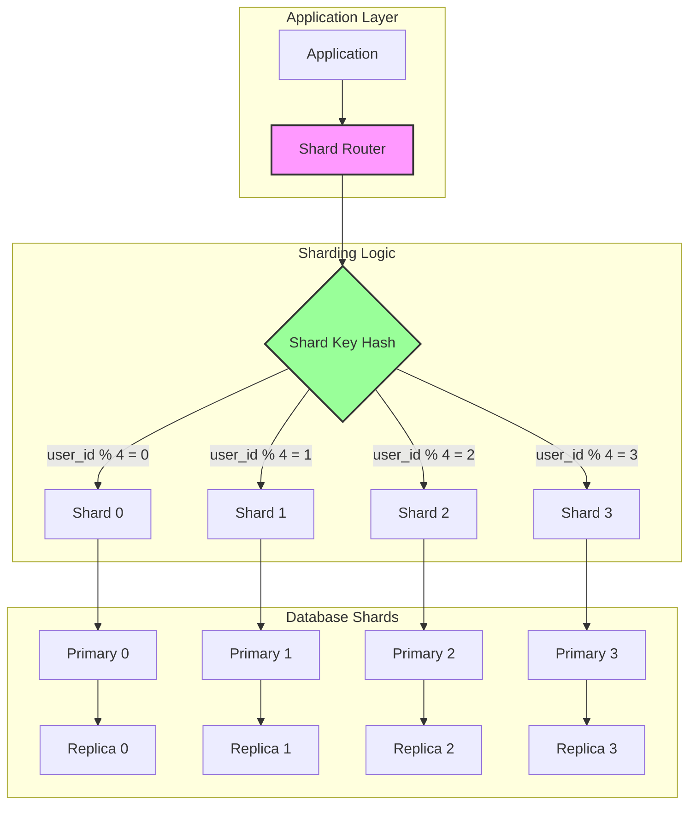

# Database Sharding Pattern

!!! warning "🥈 Silver Standard Pattern"
    **Horizontal Database Partitioning** • Pinterest, Instagram, Uber proven
    
    Database sharding distributes data across multiple database instances based on a shard key, enabling horizontal scaling beyond single-machine limits. Requires careful planning and operational expertise.
    
    **Key Success Metrics:**
    - Pinterest: 1000+ MySQL shards
    - Instagram: Scaled to 1B+ users with sharding
    - Uber: 4000+ Postgres shards globally

<div class="axiom-box">
<h4>⚛️ Law 4: Multidimensional Optimization</h4>

Sharding forces explicit trade-offs between consistency, availability, and partition tolerance. You must choose a sharding strategy that optimizes for your specific access patterns while accepting the limitations it imposes.

**Key Insight**: The choice of shard key is irreversible at scale. A poor sharding strategy will haunt you forever, requiring massive migrations to fix.
</div>

## Problem

Single database instances hit fundamental limits:
- **Storage**: Disk capacity constraints
- **CPU**: Query processing bottlenecks
- **Memory**: Working set exceeds RAM
- **Connections**: Connection pool exhaustion
- **Replication**: Lag under write load

## Solution



### Sharding Strategies

| Strategy | Use Case | Pros | Cons |
|----------|----------|------|------|
| **Range-based** | Time-series data | Easy splits | Hotspots likely |
| **Hash-based** | Uniform distribution | Even load | No range queries |
| **Directory-based** | Complex routing | Flexible | Additional hop |
| **Geographic** | Regional data | Data locality | Cross-region queries hard |

## When to Use

### ✅ Perfect For:
- **Massive scale**: Billions of records
- **Write-heavy**: High insert/update rate
- **Multi-tenant**: Natural isolation boundaries
- **Geographic distribution**: Regional compliance

### ❌ Avoid For:
- **Complex queries**: Many JOINs across shards
- **Transactions**: Cross-shard ACID needs
- **Small datasets**: Premature optimization
- **Analytical workloads**: Full table scans

## Implementation Guide

### Shard Key Selection

```sql
-- Good shard keys have high cardinality and even distribution
-- Example: user_id for user-centric application

-- Hash-based sharding function
CREATE FUNCTION get_shard_id(user_id BIGINT, num_shards INT) 
RETURNS INT
AS $$
    SELECT (hashtext(user_id::text) & 2147483647) % num_shards;
$$ LANGUAGE SQL IMMUTABLE;

-- Range-based sharding for time-series
CREATE FUNCTION get_time_shard(created_at TIMESTAMP) 
RETURNS TEXT
AS $$
    SELECT 'shard_' || to_char(created_at, 'YYYY_MM');
$$ LANGUAGE SQL IMMUTABLE;
```

### Application-Level Sharding

```python
class ShardedDatabase:
    def __init__(self, shard_config):
        self.shards = {}
        self.num_shards = len(shard_config)
        
        for shard_id, config in shard_config.items():
            self.shards[shard_id] = DatabaseConnection(config)
    
    def get_shard(self, shard_key):
        # Consistent hashing for better distribution
        shard_id = hash(str(shard_key)) % self.num_shards
        return self.shards[shard_id]
    
    def execute_query(self, query, shard_key):
        shard = self.get_shard(shard_key)
        return shard.execute(query)
    
    def scatter_gather(self, query):
        # Execute across all shards in parallel
        with ThreadPoolExecutor() as executor:
            futures = []
            for shard in self.shards.values():
                futures.append(executor.submit(shard.execute, query))
            
            results = []
            for future in futures:
                results.extend(future.result())
            
            return results
```

### Cross-Shard Operations

| Operation | Strategy | Performance Impact |
|-----------|----------|-------------------|
| **JOIN** | Denormalize or app-level | High latency |
| **COUNT** | Scatter-gather | Linear with shards |
| **Transaction** | 2PC or Saga | Complex, slow |
| **Unique Constraint** | Global service | Additional dependency |

## Production Considerations

### Resharding Strategy

```python
def reshard_data(old_shards, new_shards):
    """
    Progressive resharding to minimize downtime
    """
    # Step 1: Double-write to old and new shards
    enable_double_writes()
    
    # Step 2: Backfill historical data
    for old_shard in old_shards:
        for record in old_shard.scan():
            new_shard = get_new_shard(record.key)
            if new_shard != old_shard:
                new_shard.insert(record)
    
    # Step 3: Verify data consistency
    verify_shard_consistency()
    
    # Step 4: Switch reads to new shards
    switch_reads_to_new_shards()
    
    # Step 5: Stop writes to old shards
    disable_old_shard_writes()
    
    # Step 6: Cleanup old shards
    cleanup_old_shards()
```

## Real-World Examples

### Instagram's Sharding Evolution
- **Initial**: 1 PostgreSQL database
- **Growth**: Sharded by user_id
- **Scale**: 1000+ shards across regions
- **Lesson**: Pre-shard before you need it

### Pinterest's Sharding Architecture
- **Model**: MySQL shards with Redis cache
- **Key**: User-based and board-based sharding
- **Innovation**: ID generation includes shard info

## Common Pitfalls

1. **Hotspot Shards**: Celebrity user problem
2. **Cross-Shard Queries**: JOIN performance death
3. **Shard Key Changes**: Impossible at scale
4. **Unbalanced Growth**: Some shards grow faster

## Trade-offs Analysis

| Aspect | Benefit | Cost |
|--------|---------|------|
| **Scalability** | Linear with shards | Operational complexity |
| **Performance** | Isolated noisy neighbors | Cross-shard overhead |
| **Availability** | Failure isolation | Partial availability |
| **Cost** | Commodity hardware | More machines |

## Related Patterns
- [Database per Service](./database-per-service.md) - Service-level partitioning
- [CQRS](../data-management/cqrs.md) - Read/write separation
- [Event Sourcing](../data-management/event-sourcing.md) - Alternative to updates
- [Saga Pattern](../coordination/saga.md) - Cross-shard transactions

## References
- [Pinterest Sharding](https://medium.com/pinterest-engineering/sharding-pinterest/)
- [Instagram Engineering](https://instagram-engineering.com/sharding-ids/)
- [Vitess Documentation](https://vitess.io/docs/)