## The Complete Blueprint

Database sharding is the horizontal partitioning of data across multiple database instances, enabling systems to scale beyond the limits of a single database server. This pattern breaks a large dataset into smaller, more manageable pieces (shards) distributed across multiple servers, with each shard containing a subset of the total data. The fundamental challenge is determining how to partition the data - by user ID, geographic region, feature, or other criteria - while maintaining query efficiency and avoiding hot spots. Successful sharding requires careful consideration of four key elements: the sharding key (how to split data), shard routing (how to find the right shard), cross-shard queries (how to handle operations spanning multiple shards), and rebalancing (how to redistribute data as the system grows). The pattern becomes complex when dealing with transactions, joins, and data that doesn't naturally partition.

```mermaid
graph TB
    subgraph "Application Layer"
        App[Application Server]
        Router[Shard Router<br/>Query Coordinator]
    end
    
    subgraph "Sharding Logic"
        ShardKey[Shard Key<br/>user_id % num_shards]
        Mapping[Shard Mapping<br/>Key → Shard Location]
    end
    
    subgraph "Data Shards"
        Shard1[(Shard 1<br/>users 0-999)]
        Shard2[(Shard 2<br/>users 1000-1999)]
        Shard3[(Shard 3<br/>users 2000-2999)]
        ShardN[(Shard N<br/>users N000-N999)]
    end
    
    subgraph "Cross-Shard Operations"
        Aggregator[Result Aggregator]
        Transaction[Distributed Transaction<br/>Coordinator]
    end
    
    subgraph "Management Layer"
        Monitor[Shard Monitor]
        Rebalancer[Data Rebalancer]
        Config[Shard Configuration]
    end
    
    App --> Router
    Router --> ShardKey
    ShardKey --> Mapping
    
    Router --> Shard1
    Router --> Shard2
    Router --> Shard3
    Router --> ShardN
    
    Router --> Aggregator
    Router --> Transaction
    
    Monitor --> Shard1
    Monitor --> Shard2
    Monitor --> Shard3
    Monitor --> ShardN
    
    Monitor --> Rebalancer
    Rebalancer --> Config
    Config --> Mapping
```

### What You'll Master

- **Shard key design**: Choose partitioning strategies that distribute load evenly while enabling efficient queries
- **Query routing**: Implement logic to direct queries to the correct shard(s) based on the sharding key
- **Cross-shard operations**: Handle aggregations, joins, and transactions that span multiple shards
- **Operational management**: Plan for shard rebalancing, monitoring, and disaster recovery across distributed data

# Database Sharding

Horizontal database partitioning

## See Also

- [Eventual Consistency](/pattern-library/data-management/eventual-consistency)
- [Event Streaming](/pattern-library/architecture/event-streaming)
- [Rate Limiting Pattern](/pattern-library/scaling/rate-limiting)
