# Edge Computing/IoT Patterns

!!! success "🏆 Gold Standard Pattern"
    **Computing at the Speed of Light** • Cloudflare, AWS IoT, Azure Edge proven
    
    The essential pattern for ultra-low latency and bandwidth optimization. Edge computing brings processing closer to data sources, enabling real-time decision making and reducing cloud dependencies.
    
    **Key Success Metrics:**
    - Cloudflare Workers: 10M+ req/sec with <50ms global latency
    - AWS Greengrass: 95% reduction in cloud traffic for IoT
    - Azure IoT Edge: Billions of devices, sub-10ms responses

**Bringing computation to the speed of light - literally**

> *"In edge computing, every millisecond saved is a life saved, every byte reduced is a dollar earned, and every computation at the edge is a cloud server unburdened."*

## Decision Matrix: Where to Process Your Data


## Architecture Patterns

### Pattern 1: Hierarchical Edge Processing


### Pattern 2: Edge-Cloud Hybrid Processing

| Processing Stage | Location | Latency | Purpose | Example |
|-----------------|----------|---------|---------|---------|
| **Immediate Response** | Device Edge | <1ms | Safety-critical decisions | Emergency brake |
| **Real-time Analytics** | Local Edge | <10ms | Pattern detection | Anomaly detection |
| **Aggregation** | Regional Edge | <50ms | Data reduction | Hourly summaries |
| **Deep Learning** | Cloud | 100ms+ | Model training | Update ML models |
| **Historical Analysis** | Cloud | Seconds | Business insights | Monthly reports |


## Real-World Deployment Examples

### Example 1: Tesla Autopilot Edge Architecture

| Component | Specification | Purpose | Latency |
|-----------|--------------|---------|----------|
| **FSD Computer** | 2x Neural chips, 144 TOPS | AI inference | <10ms |
| **Cameras** | 8x 1280×960 @ 36fps | 360° vision | 1ms processing |
| **Memory** | 16GB LPDDR4 | Model storage | 0.1ms access |
| **Storage** | 256GB NVMe | Telemetry buffer | Write: 1ms |
| **Decisions/sec** | 2,500+ | Path planning | Must complete in 10ms |

### Example 2: Cloudflare Workers Edge Network


### Example 3: AWS IoT Greengrass Deployment

| Deployment Size | Edge Nodes | Devices/Node | Local Processing | Cloud Sync | Monthly Cost |
|----------------|------------|--------------|------------------|------------|------------|
| **Small Factory** | 5 | 200 | Rules engine | Every 5 min | $250 |
| **Smart Building** | 20 | 500 | ML inference | Every 1 min | $1,000 |
| **Oil Platform** | 50 | 1,000 | Full analytics | On-demand | $5,000 |
| **Smart City** | 500 | 10,000 | Distributed AI | Real-time | $50,000 |

## Edge Infrastructure Components

### Hardware Selection Guide

| Use Case | Device Type | CPU/GPU | Memory | Power | Example Hardware | Unit Cost |
|----------|-------------|---------|--------|-------|-----------------|----------|
| **IoT Gateway** | ARM-based | 4-core 1.5GHz | 2GB | 5W | Raspberry Pi 4 | $75 |
| **Video Analytics** | GPU-enabled | Jetson Nano | 4GB | 10W | NVIDIA Jetson | $99 |
| **Industrial Edge** | x86 Rugged | i5/8-core | 16GB | 35W | Dell Edge Gateway | $1,500 |
| **Telco MEC** | Server-grade | Xeon/32-core | 128GB | 250W | HPE Edgeline | $15,000 |
| **AI Inference** | TPU/NPU | Google Coral | 1GB | 2W | Coral Dev Board | $150 |

### Software Stack Comparison

| Platform | Strengths | Limitations | Best For | Learning Curve |
|----------|-----------|-------------|----------|----------------|
| **AWS Greengrass** | AWS integration, Lambda | AWS lock-in | Existing AWS users | Medium |
| **Azure IoT Edge** | Azure services, Docker | Windows-centric | Enterprise IoT | Medium |
| **K3s/KubeEdge** | Kubernetes-native | Complex setup | Container workloads | High |
| **EdgeX Foundry** | Open source, modular | Limited ML | IoT gateways | Medium |
| **OpenVINO** | Intel optimization | Intel hardware only | Computer vision | Low |

## Core Implementation Patterns

### Pattern 1: Smart Data Filtering

```mermaid
graph LR
    subgraph "Data Flow"
        Raw[Raw Data<br/>1GB/hour] --> Filter{Edge Filter}
        Filter -->|Anomalies<br/>1MB/hour| Priority[Priority Queue]
        Filter -->|Aggregated<br/>10MB/hour| Batch[Batch Queue]
        Filter -->|Discarded<br/>989MB/hour| Drop[/dev/null]
        
        Priority -->|Real-time| Cloud1[Cloud Analytics]
        Batch -->|Every 5min| Cloud2[Cloud Storage]
    end
    
    style Filter fill:#9f9
    style Priority fill:#f99
    style Cloud1 fill:#f9f
    style Cloud2 fill:#f9f
```

| Data Type | Filter Logic | Reduction | Cloud Sync | Example |
|-----------|-------------|-----------|------------|----------|
| **Sensor Readings** | Only changes >5% | 95% | 1 min batch | Temperature |
| **Video Stream** | Motion detection | 99% | On event | Security |
| **Vibration Data** | FFT + threshold | 90% | 5 min summary | Machinery |
| **Log Files** | Error/warning only | 98% | Real-time | System logs |
| **Metrics** | Statistical summary | 80% | 1 min aggregate | Performance |

### Pattern 2: Store-and-Forward for Resilience

```mermaid
stateDiagram-v2
    [*] --> Receive: Data Arrives
    Receive --> Store: Persist Locally
    Store --> Check: Check Connection
    
    Check --> Send: Connected
    Check --> Wait: Disconnected
    
    Send --> Success: ACK Received
    Send --> Retry: Failed/Timeout
    
    Success --> [*]: Complete
    Retry --> Check: Backoff
    
    Wait --> Check: Periodic Retry
    
    note right of Store: SQLite/RocksDB
    note right of Retry: Exponential Backoff
    note right of Wait: 30s → 1m → 5m → 15m
```



| Priority | Max Retries | Initial Timeout | Backoff | TTL | Compression |
|----------|-------------|-----------------|---------|-----|-------------|
| **Critical** | Infinite | 5s | 2x (max 5min) | Never | None |
| **High** | 10 | 10s | 2x (max 1hr) | 24hr | LZ4 |
| **Normal** | 5 | 30s | 3x (max 1hr) | 7d | ZSTD |
| **Low** | 3 | 60s | 4x (max 4hr) | 30d | ZSTD-9 |

### Pattern 3: Edge ML Model Optimization

| Optimization | Technique | Size Reduction | Speed Gain | Accuracy Loss | Best For |
|-------------|-----------|----------------|------------|--------------|----------|
| **Quantization** | FP32→INT8 | 75% | 2-4x | <1% | All models |
| **Pruning** | Remove weights | 50-90% | 1.5-3x | 1-3% | CNNs |
| **Distillation** | Teacher→Student | 80-95% | 5-10x | 2-5% | Complex models |
| **Compilation** | Hardware-specific | 0% | 2-5x | 0% | Deployment |

### Edge ML Framework Comparison


| Framework | Hardware | Languages | Model Format | Strengths | Limitations |
|-----------|----------|-----------|--------------|-----------|-------------|
| **TensorFlow Lite** | Mobile/ARM | Python/Java/C++ | .tflite | Wide support | Limited ops |
| **ONNX Runtime** | Cross-platform | Python/C++/C# | .onnx | Interoperable | Generic optimization |
| **TensorRT** | NVIDIA | Python/C++ | .engine | Fastest on GPU | NVIDIA only |
| **OpenVINO** | Intel | Python/C++ | .xml/.bin | Intel optimized | Intel only |
| **Core ML** | Apple | Swift/ObjC | .mlmodel | iOS integration | Apple only |

## Data Management Strategy

### Edge Storage Tiering

| Tier | Storage Type | Capacity | Access Time | Retention | Use Case |
|------|-------------|----------|-------------|-----------|----------|
| **Hot** | RAM | 1-4GB | <1ms | Minutes | Real-time processing |
| **Warm** | SSD/eMMC | 32-256GB | <10ms | Hours-Days | Recent analytics |
| **Cold** | Cloud | Unlimited | >100ms | Years | Historical data |

### Data Lifecycle Management


## Security Considerations

### Edge Security Threats & Mitigations

| Threat | Risk Level | Impact | Mitigation | Implementation |
|--------|-----------|---------|------------|----------------|
| **Physical Access** | High | Device tampering | TPM + Secure Boot | Hardware security module |
| **Network Attacks** | High | Data interception | mTLS + VPN | Certificate pinning |
| **Malware** | Medium | Compromised edge | Signed containers | Runtime protection |
| **Data Leakage** | High | Privacy breach | Encryption at rest | AES-256 + key rotation |
| **DDoS** | Medium | Service outage | Rate limiting | Edge firewall rules |

### Security Architecture


## Advanced Deployment Patterns

### Pattern 1: Federated Learning Architecture


| Component | Role | Requirements | Scale |
|-----------|------|--------------|-------|
| **Central Server** | Model aggregation | 100GB RAM, 32 cores | 1 per deployment |
| **Edge Nodes** | Local training | 4GB RAM, GPU optional | 10-10,000 nodes |
| **Communication** | Model updates | 10-100MB per round | Async, compressed |
| **Privacy** | Differential privacy | ε=1.0, δ=10^-5 | Per-user guarantees |


### Pattern 2: Intelligent Workload Placement

| Factor | Weight | Score Calculation | Example |
|--------|--------|------------------|----------|
| **CPU Available** | 20% | (Available / Required) | 8 cores free / 2 needed = 4.0 |
| **Memory Available** | 20% | (Available / Required) | 16GB free / 4GB needed = 4.0 |
| **Network Latency** | 25% | 1 - (Actual / Max) | 1 - (5ms / 10ms) = 0.5 |
| **Bandwidth** | 15% | min(1, Available / Required) | min(1, 1Gbps / 100Mbps) = 1.0 |
| **Data Locality** | 10% | Data on same node | 1.0 if local, 0.5 if regional |
| **Reliability** | 5% | Uptime percentage | 99.9% = 0.999 |
| **Cost** | 5% | 1 - (Cost / Budget) | 1 - ($0.10 / $1.00) = 0.9 |


### Pattern 3: Zero-Trust Edge Security


| Security Layer | Implementation | Overhead | Protection Level |
|----------------|----------------|----------|------------------|
| **Hardware** | TPM 2.0 + Secure Boot | <1ms boot delay | Root of trust |
| **OS** | SELinux/AppArmor | 2-5% CPU | Kernel protection |
| **Container** | gVisor/Kata | 10-20% overhead | Process isolation |
| **Network** | mTLS + IPSec | 5-10% bandwidth | Data protection |
| **Application** | OAuth2 + RBAC | <10ms per request | Access control |

## Production Case Studies

### Case Study 1: Tesla Autopilot Edge AI

| Metric | Specification | Challenge | Solution |
|--------|--------------|-----------|----------|
| **Data Rate** | 1.2GB/s from 8 cameras | Bandwidth | Local processing only |
| **Latency** | <10ms for 100Hz control | Compute speed | Custom FSD chip |
| **Reliability** | 99.999% uptime | Hardware failure | Triple redundancy |
| **Updates** | OTA model deployment | Safety validation | Shadow mode testing |
| **Scale** | 1M+ vehicles | Coordination | Fleet learning |

### Edge Processing Pipeline


### Case Study 2: Cloudflare Workers Global Edge

| Metric | Scale | Technology | Impact |
|--------|-------|------------|--------|
| **Locations** | 275+ cities | Anycast network | <50ms globally |
| **Capacity** | 45Tbps | 100Gbps+ per location | No congestion |
| **Compute** | 10M+ req/sec | V8 isolates | Serverless at edge |
| **Deployment** | <15 seconds | Global KV store | Instant updates |
| **Cost** | $0.50/million requests | Shared infrastructure | 90% cheaper than VMs |

### Request Flow Architecture


### Case Study 3: Smart City Video Analytics

| Component | Specification | Processing | Result |
|-----------|--------------|------------|--------|
| **Cameras** | 10,000 @ 4K 30fps | Edge AI inference | 95% local processing |
| **Edge Nodes** | 500 distributed | Object detection | <100ms response |
| **Bandwidth** | 100TB/day raw | Compression + filtering | 1TB/day to cloud |
| **Privacy** | GDPR compliant | Face blurring | On-device processing |
| **Alerts** | Real-time | Local decision | <1 second response |

## Cost Analysis

### Edge vs Cloud Cost Comparison

| Factor | Cloud Only | Edge + Cloud | Savings |
|--------|-----------|--------------|----------|
| **Bandwidth** | $10,000/month | $100/month | 99% |
| **Compute** | $5,000/month | $2,000/month | 60% |
| **Storage** | $3,000/month | $500/month | 83% |
| **Infrastructure** | $0 | $50,000 one-time | - |
| **5-Year TCO** | $1,080,000 | $266,000 | 75% |

### ROI Calculation


## Implementation Checklist

### Pre-Deployment Planning
- [ ] **Latency Requirements**: Measure actual latency needs (<10ms, <100ms, >100ms)
- [ ] **Data Volume Analysis**: Calculate daily data generation (GB/day per device)
- [ ] **Bandwidth Costs**: Current cloud egress costs ($/GB)
- [ ] **Offline Requirements**: Maximum tolerable disconnection time
- [ ] **Privacy Constraints**: Data residency and processing requirements

### Hardware Selection
- [ ] **Compute Requirements**: CPU/GPU/TPU needs for workload
- [ ] **Environmental Factors**: Temperature, humidity, vibration tolerance
- [ ] **Power Budget**: Available power and cooling capacity
- [ ] **Physical Security**: Tamper-proof enclosures if needed
- [ ] **Redundancy**: N+1 or 2N redundancy for critical applications

### Software Architecture
- [ ] **Edge Platform**: Choose platform (Greengrass, Azure IoT, K3s, custom)
- [ ] **ML Framework**: Select edge ML framework (TF Lite, ONNX, OpenVINO)
- [ ] **Data Store**: Local storage strategy (SQLite, RocksDB, time-series DB)
- [ ] **Message Queue**: Store-and-forward implementation
- [ ] **Monitoring**: Edge monitoring and alerting strategy

### Security Implementation
- [ ] **Hardware Security**: TPM/HSM for key storage
- [ ] **Secure Boot**: Verified boot chain
- [ ] **Network Security**: VPN/mTLS for edge-to-cloud
- [ ] **Access Control**: RBAC and API authentication
- [ ] **Update Mechanism**: Secure OTA updates

### Operational Readiness
- [ ] **Deployment Automation**: Zero-touch provisioning
- [ ] **Remote Management**: Out-of-band management
- [ ] **Backup Strategy**: Local and cloud backup
- [ ] **Disaster Recovery**: Failover procedures
- [ ] **Compliance**: Audit logging and reporting

## Common Pitfalls & Solutions

| Pitfall | Impact | Solution | Prevention |
|---------|---------|----------|------------|
| **Underestimating management complexity** | Operational overhead | Centralized orchestration | Start small, automate early |
| **Ignoring security** | Compromised devices | Defense in depth | Security by design |
| **Over-provisioning edge** | Wasted resources | Right-sizing analysis | Pilot deployments |
| **No offline strategy** | Service outages | Store-and-forward | Design for disconnection |
| **Monolithic edge apps** | Update difficulties | Microservices | Modular architecture |

## Future Trends

### Emerging Edge Technologies

| Technology | Timeline | Impact | Use Cases |
|------------|----------|---------|-----------|
| **5G MEC** | Now-2025 | 1ms latency | AR/VR, Gaming |
| **AI Chips** | 2024-2026 | 100x efficiency | Real-time AI |
| **Quantum Edge** | 2028-2030 | Unbreakable security | Finance, Defense |
| **6G Integration** | 2030+ | 0.1ms latency | Holographic comm |
| **Neuromorphic** | 2025-2030 | 1000x power efficiency | Always-on AI |

## Quick Reference Card

### Edge vs Cloud Decision Matrix


### Resource Requirements by Scale

| Scale | Devices | Edge Nodes | Bandwidth | Investment | Example |
|-------|---------|------------|-----------|------------|----------|
| **Pilot** | 10-100 | 1-5 | 10 Mbps | <$10K | PoC |
| **Small** | 100-1K | 5-20 | 100 Mbps | $10-50K | Single site |
| **Medium** | 1K-10K | 20-100 | 1 Gbps | $50-500K | Multi-site |
| **Large** | 10K-100K | 100-1K | 10 Gbps | $500K-5M | Regional |
| **XLarge** | 100K+ | 1K+ | 100 Gbps | >$5M | Global |

## 🎓 Key Takeaways

### Technical Insights
1. **Latency is King**: Every millisecond matters - design for physics, not convenience
2. **Data Gravity**: Process data where it's generated to minimize movement
3. **Hierarchy is Essential**: Device → Edge → Regional → Cloud, each with its role
4. **Security by Design**: Physical access changes the threat model fundamentally
5. **Economics Drive Adoption**: 75%+ cost savings possible with proper implementation

### Strategic Considerations
1. **Start Small**: Pilot with one use case, prove ROI, then scale
2. **Automate Early**: Manual edge management doesn't scale
3. **Plan for Offline**: Design for disconnection as the norm, not exception
4. **Monitor Everything**: Visibility is harder at the edge
5. **Update Carefully**: OTA updates need rigorous testing

### Remember
> *"The best edge architecture is one where users get instant responses without knowing why, and operators save money without complexity."*

---

**Next Steps**:
- Calculate your bandwidth costs to justify edge investment
- Identify your most latency-sensitive workloads
- Run a pilot with 5-10 edge nodes
- Measure actual latency improvements and cost savings
- Scale based on proven ROI

---

**Previous**: [← Sharding Pattern](sharding.md) | **Next**: [Gateway Pattern →](../architecture/gateway.md)
