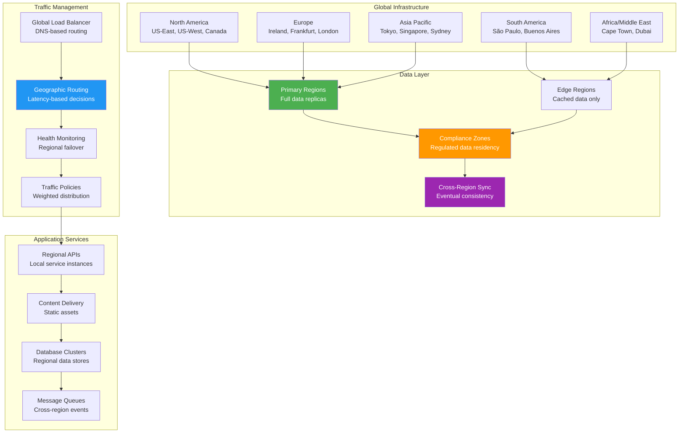
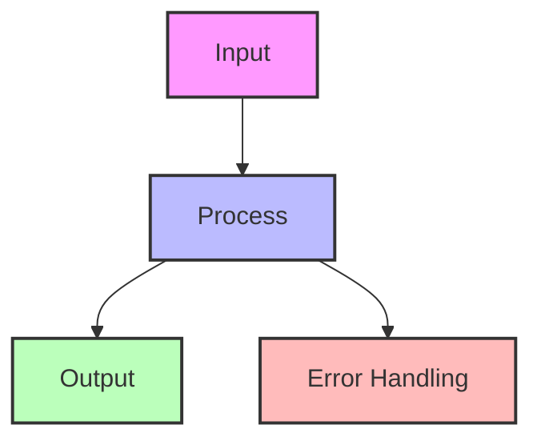

## The Complete Blueprint

Geo-Distribution patterns deploy applications and data across multiple geographic regions to minimize latency for global users, ensure compliance with data sovereignty laws, and provide disaster recovery capabilities. This pattern addresses the fundamental challenge of serving users worldwide while maintaining acceptable performance and meeting regulatory requirements by strategically placing compute resources and data stores close to user populations. The architecture involves complex trade-offs between consistency, availability, and partition tolerance while handling cross-region networking, data replication, and regulatory compliance requirements across different legal jurisdictions.

### What You'll Master

- **Multi-region architecture design** with primary and edge regions, data residency planning, and disaster recovery strategies
- **Global traffic routing** using DNS-based geographic routing, health monitoring, and intelligent failover mechanisms
- **Data consistency models** implementing eventual consistency, conflict resolution, and cross-region synchronization patterns
- **Compliance frameworks** handling GDPR, data sovereignty, and regulatory requirements across different jurisdictions
- **Performance optimization** minimizing latency through strategic placement, CDN integration, and regional caching
- **Operational complexity management** monitoring global infrastructure, coordinating deployments, and handling regional failures

# Geo-Distribution

!!! info "🥈 Silver Pattern"
    **Global Scale Architecture** • Netflix, Spotify, Cloudflare proven worldwide
    
    Geo-distribution places compute and data close to users across multiple geographic regions. Essential for global services requiring low latency and regulatory compliance.
    
    **Key Success Metrics:**
    - Netflix: 230M+ users, <50ms regional latency
    - Spotify: 489M users across 184 markets
    - Cloudflare: 285 cities, 95% of internet users within 50ms

## Essential Questions

🎯 **How do we minimize latency and meet compliance requirements while maintaining data consistency across regions?**

**Critical Sub-questions:**
1. What's our consistency model between regions? (Strong, Eventual, Causal)
2. Which data must stay in-region for compliance? (PII, Financial, Health)
3. How do we handle split-brain scenarios? (Quorum, CRDT, Manual)
4. What's our disaster recovery RPO/RTO? (Minutes, Hours, Days)

## When to Use / When NOT to Use

### ✅ Use Geo-Distribution When:

| Indicator | Threshold | Example |
|-----------|-----------|---------||
| User Distribution | >20% users in 2+ continents | Global SaaS platform |
| Latency Requirements | <100ms for 95th percentile | Real-time collaboration |
| Compliance Needs | Data residency laws apply | GDPR, CCPA, LGPD |
| Availability Target | >99.95% uptime | Financial services |
| Traffic Patterns | Follow-the-sun usage | Enterprise software |

### ❌ Don't Use When:

| Indicator | Reason | Alternative |
|-----------|--------|-------------|
| Single Region Users | Unnecessary complexity | Single region + CDN |
| Strong Consistency Required | CAP theorem limitations | Active-passive replication |
| Budget Constraints | 3-5x infrastructure cost | Edge caching only |
| Small Dataset (<10GB) | Overhead exceeds benefit | Read replicas |
| Prototype/MVP Stage | Premature optimization | Monolithic deployment |

## Architecture Overview

## Geo-Distribution Strategy Matrix

| Strategy | Consistency | Latency | Complexity | Cost | Best For |
|----------|------------|---------|------------|------|----------|
| **Active-Active** | Eventual | Lowest | Highest | $$$$$ | User-facing apps |
| **Active-Passive** | Strong | Higher | Medium | $$$ | Financial systems |
| **Follow-the-Sun** | Session-based | Low | High | $$$$ | Enterprise tools |
| **Edge + Origin** | Cached | Very Low | Low | $$ | Content delivery |
| **Multi-Master** | Conflict-prone | Low | Very High | $$$$$ | Collaborative apps |

## Data Consistency Models

## Level 1: Intuition (5 minutes)

*Start your journey with relatable analogies*

### The Elevator Pitch
[Pattern explanation in simple terms]

### Real-World Analogy
[Everyday comparison that explains the concept]

## Level 2: Foundation (10 minutes)

*Build core understanding*

### Core Concepts
- Key principle 1
- Key principle 2
- Key principle 3

### Basic Example

## Level 3: Deep Dive (15 minutes)

*Understand implementation details*

### How It Really Works
[Technical implementation details]

### Common Patterns
[Typical usage patterns]

## Level 4: Expert (20 minutes)

*Master advanced techniques*

### Advanced Configurations
[Complex scenarios and optimizations]

### Performance Tuning
[Optimization strategies]

## Level 5: Mastery (30 minutes)

*Apply in production*

### Real-World Case Studies
[Production examples from major companies]

### Lessons from the Trenches
[Common pitfalls and solutions]

## Decision Matrix

### Quick Decision Table

| Factor | Low Complexity | Medium Complexity | High Complexity |
|--------|----------------|-------------------|-----------------|
| Team Size | < 5 developers | 5-20 developers | > 20 developers |
| Traffic | < 1K req/s | 1K-100K req/s | > 100K req/s |
| Data Volume | < 1GB | 1GB-1TB | > 1TB |
| **Recommendation** | ❌ Avoid | ⚠️ Consider | ✅ Implement |

## Implementation Strategies

### 1. Database Geo-Distribution

| Database Type | Strategy | Tools | Consistency |
|--------------|----------|-------|-------------|
| **Relational** | Read replicas + sharding | Vitess, CockroachDB | Strong/Eventual |
| **NoSQL** | Multi-region clusters | Cassandra, DynamoDB Global | Eventual/Tunable |
| **Document** | Replica sets | MongoDB Atlas, Cosmos DB | Eventual/Session |
| **Key-Value** | Geo-replicated | Redis Enterprise, Aerospike | Eventual |
| **Time-Series** | Regional buckets | InfluxDB, TimescaleDB | Eventual |

### 2. Application Layer Distribution

### 3. State Management Across Regions

| State Type | Distribution Strategy | Example |
|------------|---------------------|---------||
| **User Session** | Sticky regions + backup | Shopping cart |
| **Configuration** | Global replication | Feature flags |
| **Transactional** | Regional primary | Order processing |
| **Analytics** | Regional aggregation | User metrics |
| **Media/Static** | CDN + origin | Images, videos |

## Production Deployment Guide

### Phase 1: Regional Expansion Checklist
- [ ] **Legal/Compliance Review**
  - [ ] Data residency requirements
  - [ ] Privacy regulations (GDPR, CCPA)
  - [ ] Export control restrictions
  
- [ ] **Infrastructure Setup**
  - [ ] Regional VPCs with peering
  - [ ] Cross-region networking (AWS Transit Gateway, GCP Interconnect)
  - [ ] Regional load balancers
  - [ ] Monitoring in each region

### Phase 2: Data Architecture
### Phase 3: Traffic Management

## Real-World Examples

### Netflix: Active-Active Streaming
- **Regions**: 6 AWS regions globally
- **Strategy**: Regional content caches + global catalog
- **Latency**: <50ms to nearest region
- **Key Innovation**: Predictive regional pre-positioning

### Spotify: Follow-the-User Model
- **Regions**: 4 Google Cloud regions
- **Strategy**: User data follows login location
- **Consistency**: Session-based with eventual sync
- **Scale**: 489M users, 4 petabytes of data

### Stripe: Compliance-First Distribution
- **Regions**: 8 regions for data residency
- **Strategy**: Regional isolation with global routing
- **Compliance**: PCI-DSS + regional regulations
- **Availability**: 99.99% uptime SLA

## Cost Optimization Strategies

| Cost Factor | Optimization | Potential Savings |
|-------------|-------------|------------------|
| **Data Transfer** | Regional caching, compression | 40-60% |
| **Compute** | Auto-scaling, spot instances | 30-50% |
| **Storage** | Tiered storage, deduplication | 25-40% |
| **Network** | Private peering, CDN offload | 35-55% |
| **Operations** | Automation, observability | 20-30% |

## Common Pitfalls

### 1. Data Consistency Conflicts
**Solution**: Implement CRDT or last-write-wins with vector clocks

### 2. Cascading Failures
- **Problem**: Region failure triggers global outage
- **Solution**: Circuit breakers + bulkheads between regions

### 3. Regulatory Violations
- **Problem**: Data crosses borders illegally
- **Solution**: Data classification + routing rules

## Monitoring & Operations

### Key Metrics Dashboard
## Migration Playbook

### From Single Region to Geo-Distributed

1. **Assessment Phase** (2-4 weeks)
   - Analyze traffic patterns
   - Identify compliance requirements
   - Calculate ROI

2. **Pilot Phase** (1-2 months)
   - Deploy read-only replica
   - Route 5% traffic
   - Measure impact

3. **Rollout Phase** (2-4 months)
   - Gradual traffic shift
   - Enable writes
   - Monitor consistency

4. **Optimization Phase** (Ongoing)
   - Tune replication
   - Optimize costs
   - Enhance monitoring

## Decision Framework

## Related Patterns
- [Multi-Region](../architecture/multi-region.md) - Architecture patterns for multi-region systems
- [Edge Computing](../scaling/edge-computing.md) - Computation at network edge
- [CDN Pattern](../performance/cdn.md) - Content delivery networks
- [Database Replication](../data-management/replication.md) - Data replication strategies
- [Global Load Balancing](../architecture/global-load-balancing.md) - Traffic distribution

## References
- [Netflix Global Architecture](https://netflixtechblog.com/)
- [Stripe's Data Residency](https://stripe.com/guides/data-residency/)
- [Google Spanner Paper](https://research.google/pubs/pub39966/)
- [AWS Global Infrastructure](https://aws.amazon.com/about-aws/global-infrastructure/)

