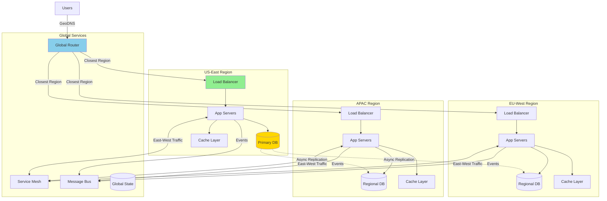
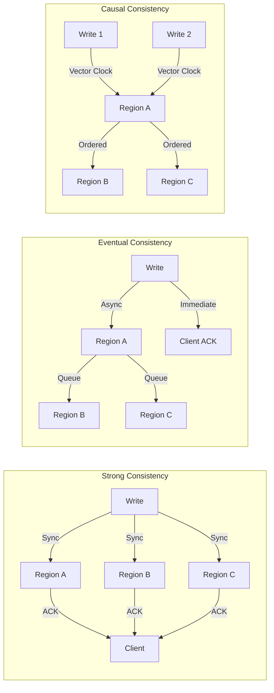
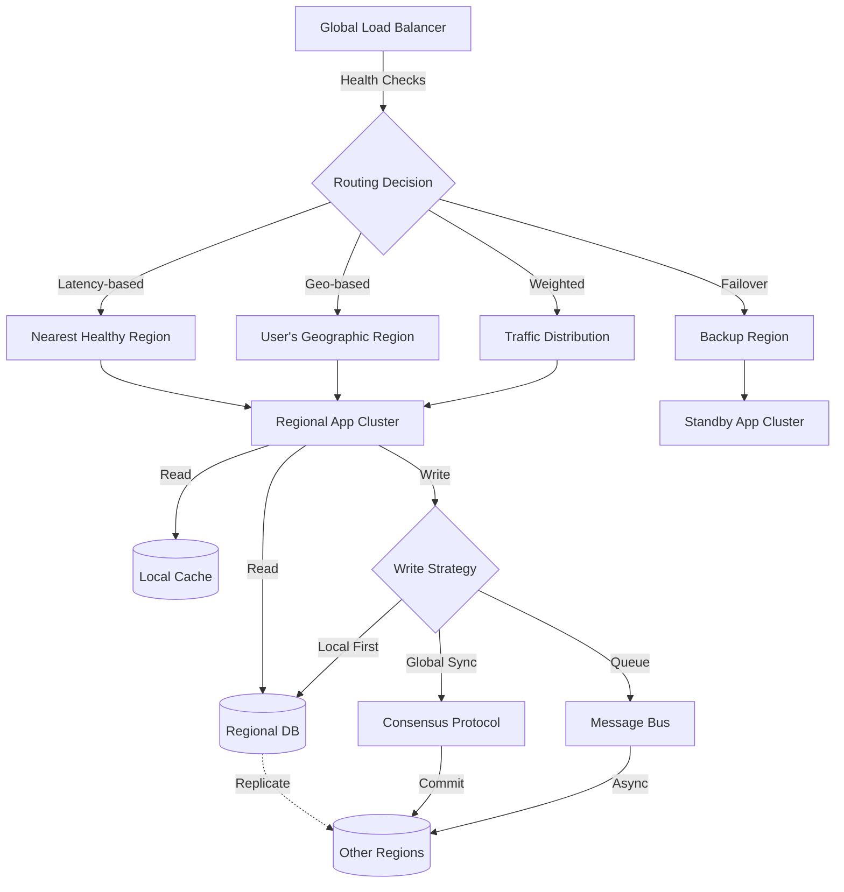
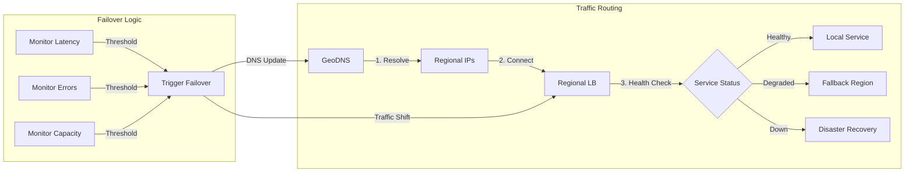
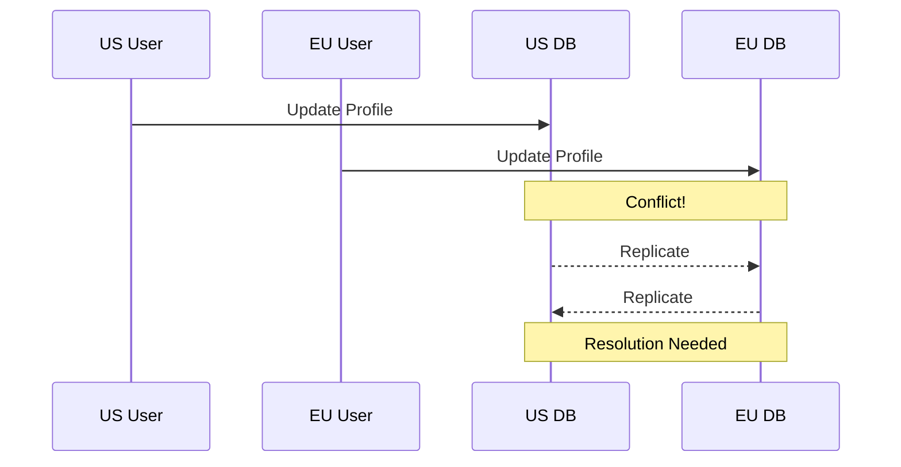
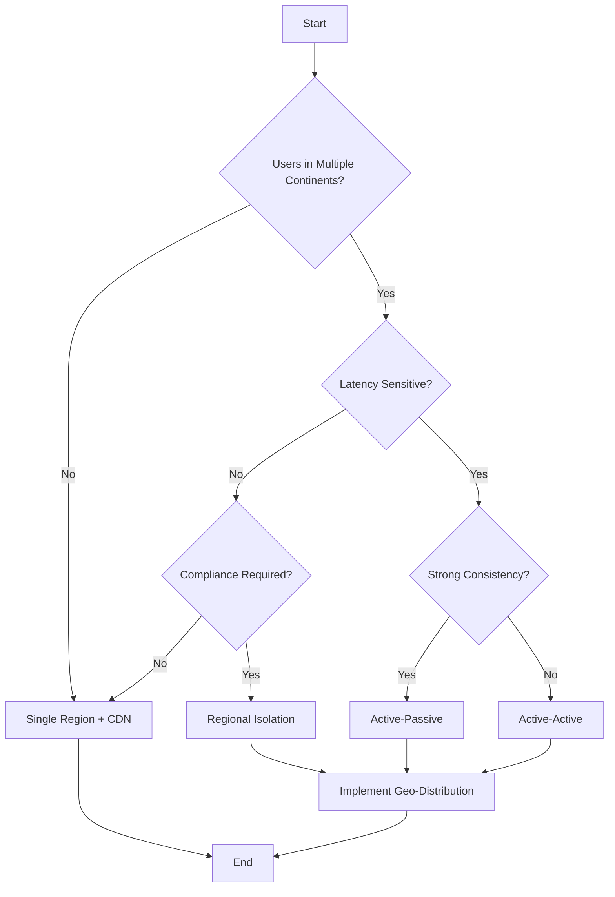

# Geo-Distribution

!!! info "🥈 Silver Pattern"
    **Global Scale Architecture** • Netflix, Spotify, Cloudflare proven worldwide
    
    Geo-distribution places compute and data close to users across multiple geographic regions. Essential for global services requiring low latency and regulatory compliance.
    
    **Key Success Metrics:**
    - Netflix: 230M+ users, <50ms regional latency
    - Spotify: 489M users across 184 markets
    - Cloudflare: 285 cities, 95% of internet users within 50ms

## Essential Questions

🎯 **How do we minimize latency and meet compliance requirements while maintaining data consistency across regions?**

**Critical Sub-questions:**
1. What's our consistency model between regions? (Strong, Eventual, Causal)
2. Which data must stay in-region for compliance? (PII, Financial, Health)
3. How do we handle split-brain scenarios? (Quorum, CRDT, Manual)
4. What's our disaster recovery RPO/RTO? (Minutes, Hours, Days)

## When to Use / When NOT to Use

### ✅ Use Geo-Distribution When:

| Indicator | Threshold | Example |
|-----------|-----------|---------||
| User Distribution | >20% users in 2+ continents | Global SaaS platform |
| Latency Requirements | <100ms for 95th percentile | Real-time collaboration |
| Compliance Needs | Data residency laws apply | GDPR, CCPA, LGPD |
| Availability Target | >99.95% uptime | Financial services |
| Traffic Patterns | Follow-the-sun usage | Enterprise software |

### ❌ Don't Use When:

| Indicator | Reason | Alternative |
|-----------|--------|-------------|
| Single Region Users | Unnecessary complexity | Single region + CDN |
| Strong Consistency Required | CAP theorem limitations | Active-passive replication |
| Budget Constraints | 3-5x infrastructure cost | Edge caching only |
| Small Dataset (<10GB) | Overhead exceeds benefit | Read replicas |
| Prototype/MVP Stage | Premature optimization | Monolithic deployment |

## Architecture Overview



## Geo-Distribution Strategy Matrix

| Strategy | Consistency | Latency | Complexity | Cost | Best For |
|----------|------------|---------|------------|------|----------|
| **Active-Active** | Eventual | Lowest | Highest | $$$$$ | User-facing apps |
| **Active-Passive** | Strong | Higher | Medium | $$$ | Financial systems |
| **Follow-the-Sun** | Session-based | Low | High | $$$$ | Enterprise tools |
| **Edge + Origin** | Cached | Very Low | Low | $$ | Content delivery |
| **Multi-Master** | Conflict-prone | Low | Very High | $$$$$ | Collaborative apps |

## Data Consistency Models



## Implementation Strategies

### 1. Database Geo-Distribution

| Database Type | Strategy | Tools | Consistency |
|--------------|----------|-------|-------------|
| **Relational** | Read replicas + sharding | Vitess, CockroachDB | Strong/Eventual |
| **NoSQL** | Multi-region clusters | Cassandra, DynamoDB Global | Eventual/Tunable |
| **Document** | Replica sets | MongoDB Atlas, Cosmos DB | Eventual/Session |
| **Key-Value** | Geo-replicated | Redis Enterprise, Aerospike | Eventual |
| **Time-Series** | Regional buckets | InfluxDB, TimescaleDB | Eventual |

### 2. Application Layer Distribution



### 3. State Management Across Regions

| State Type | Distribution Strategy | Example |
|------------|---------------------|---------||
| **User Session** | Sticky regions + backup | Shopping cart |
| **Configuration** | Global replication | Feature flags |
| **Transactional** | Regional primary | Order processing |
| **Analytics** | Regional aggregation | User metrics |
| **Media/Static** | CDN + origin | Images, videos |

## Production Deployment Guide

### Phase 1: Regional Expansion Checklist
- [ ] **Legal/Compliance Review**
  - [ ] Data residency requirements
  - [ ] Privacy regulations (GDPR, CCPA)
  - [ ] Export control restrictions
  
- [ ] **Infrastructure Setup**
  - [ ] Regional VPCs with peering
  - [ ] Cross-region networking (AWS Transit Gateway, GCP Interconnect)
  - [ ] Regional load balancers
  - [ ] Monitoring in each region

### Phase 2: Data Architecture
```yaml
Regional Data Classification:
  Hot Data: 
    - User sessions
    - Recent transactions
    - Active configurations
    Strategy: Multi-master or regional primary
    
  Warm Data:
    - User profiles
    - Historical orders
    - Audit logs
    Strategy: Async replication with conflict resolution
    
  Cold Data:
    - Archives
    - Backups
    - Compliance records
    Strategy: Regional storage with cross-region backup
```

### Phase 3: Traffic Management



## Real-World Examples

### Netflix: Active-Active Streaming
- **Regions**: 6 AWS regions globally
- **Strategy**: Regional content caches + global catalog
- **Latency**: <50ms to nearest region
- **Key Innovation**: Predictive regional pre-positioning

### Spotify: Follow-the-User Model
- **Regions**: 4 Google Cloud regions
- **Strategy**: User data follows login location
- **Consistency**: Session-based with eventual sync
- **Scale**: 489M users, 4 petabytes of data

### Stripe: Compliance-First Distribution
- **Regions**: 8 regions for data residency
- **Strategy**: Regional isolation with global routing
- **Compliance**: PCI-DSS + regional regulations
- **Availability**: 99.99% uptime SLA

## Cost Optimization Strategies

| Cost Factor | Optimization | Potential Savings |
|-------------|-------------|------------------|
| **Data Transfer** | Regional caching, compression | 40-60% |
| **Compute** | Auto-scaling, spot instances | 30-50% |
| **Storage** | Tiered storage, deduplication | 25-40% |
| **Network** | Private peering, CDN offload | 35-55% |
| **Operations** | Automation, observability | 20-30% |

## Common Pitfalls

### 1. Data Consistency Conflicts


**Solution**: Implement CRDT or last-write-wins with vector clocks

### 2. Cascading Failures
- **Problem**: Region failure triggers global outage
- **Solution**: Circuit breakers + bulkheads between regions

### 3. Regulatory Violations
- **Problem**: Data crosses borders illegally
- **Solution**: Data classification + routing rules

## Monitoring & Operations

### Key Metrics Dashboard
```yaml
Regional Health:
  - Latency: p50, p95, p99 per region
  - Error Rate: 4xx, 5xx by region
  - Saturation: CPU, memory, connections
  
Cross-Region:
  - Replication Lag: seconds behind primary
  - Network RTT: between all region pairs
  - Consistency Violations: conflict rate
  
Business Metrics:
  - User Distribution: active users per region
  - Transaction Volume: RPM by region
  - Revenue Impact: $ per minute downtime
```

## Migration Playbook

### From Single Region to Geo-Distributed

1. **Assessment Phase** (2-4 weeks)
   - Analyze traffic patterns
   - Identify compliance requirements
   - Calculate ROI

2. **Pilot Phase** (1-2 months)
   - Deploy read-only replica
   - Route 5% traffic
   - Measure impact

3. **Rollout Phase** (2-4 months)
   - Gradual traffic shift
   - Enable writes
   - Monitor consistency

4. **Optimization Phase** (Ongoing)
   - Tune replication
   - Optimize costs
   - Enhance monitoring

## Decision Framework



## Related Patterns
- [Multi-Region](../architecture/multi-region.md) - Architecture patterns for multi-region systems
- [Edge Computing](edge-computing.md) - Computation at network edge
- [CDN Pattern](../performance/cdn.md) - Content delivery networks
- [Database Replication](../data-management/replication.md) - Data replication strategies
- [Global Load Balancing](../architecture/global-load-balancing.md) - Traffic distribution

## References
- [Netflix Global Architecture](https://netflixtechblog.com/)
- [Stripe's Data Residency](https://stripe.com/guides/data-residency)
- [Google Spanner Paper](https://research.google/pubs/pub39966/)
- [AWS Global Infrastructure](https://aws.amazon.com/about-aws/global-infrastructure/)