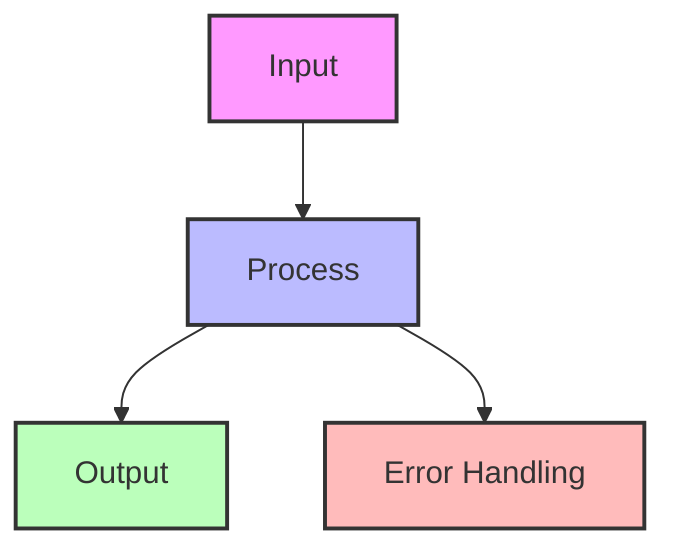
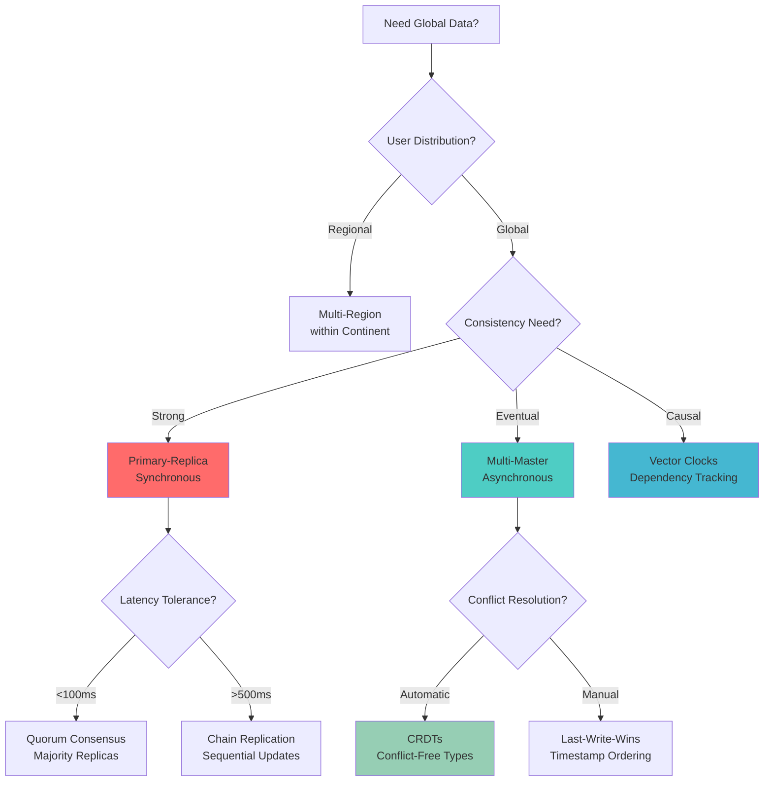
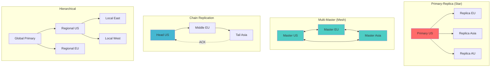
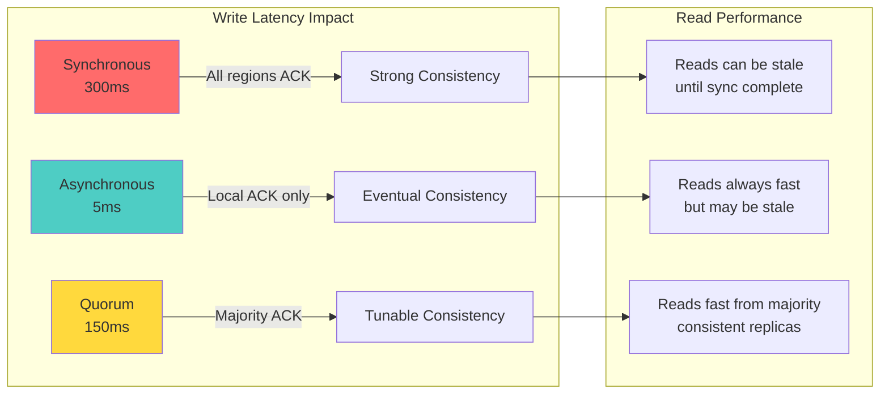
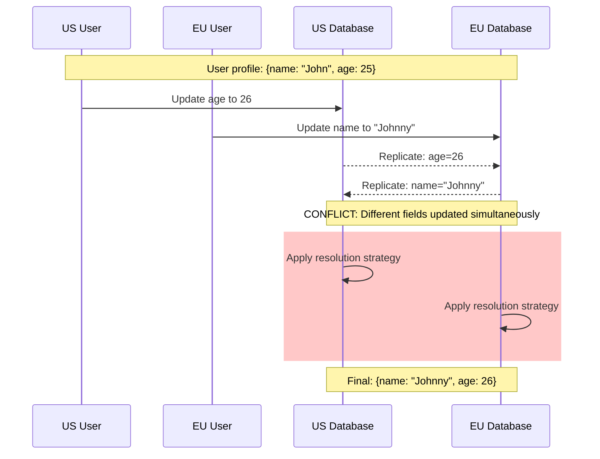
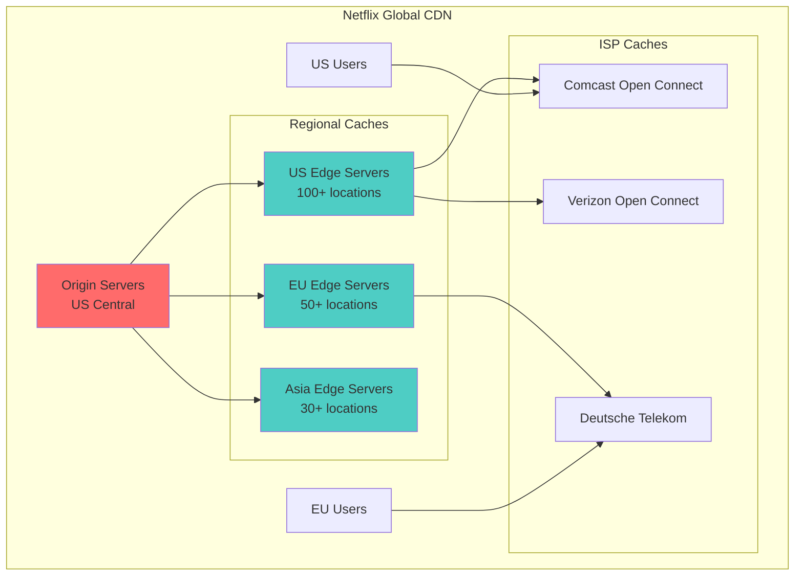
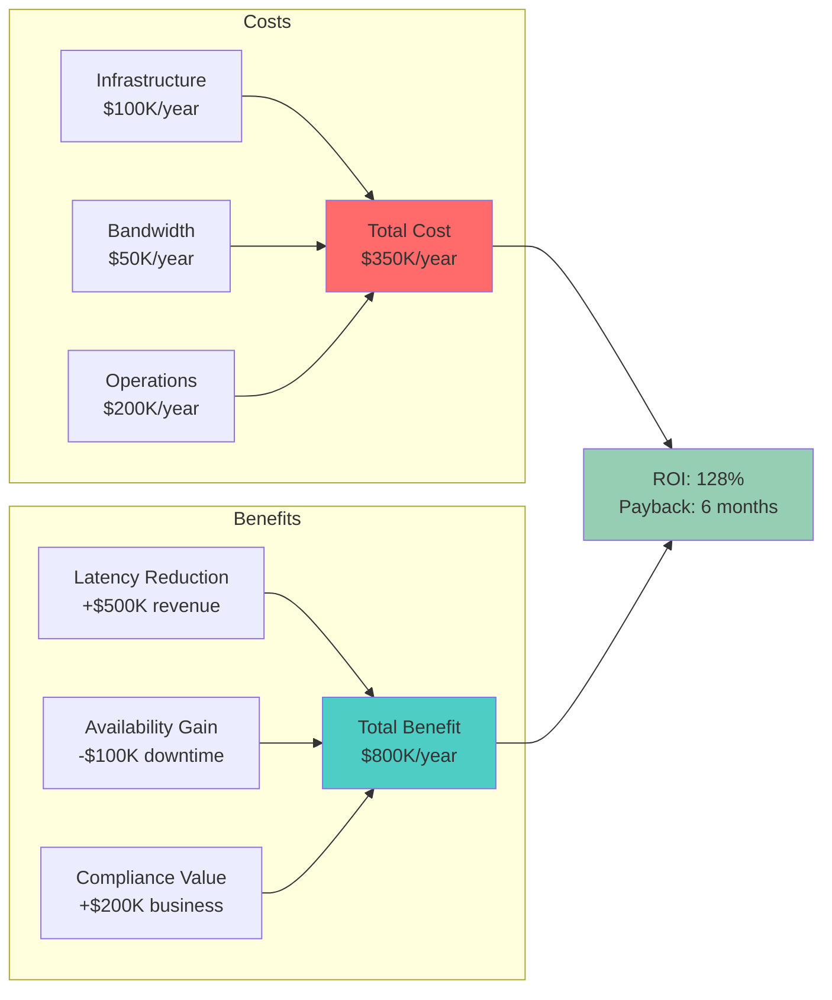
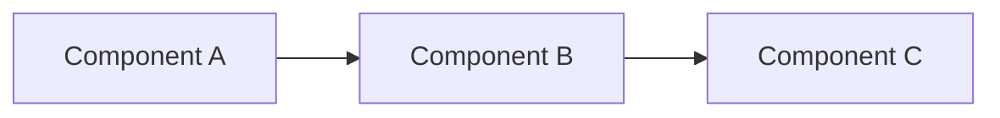
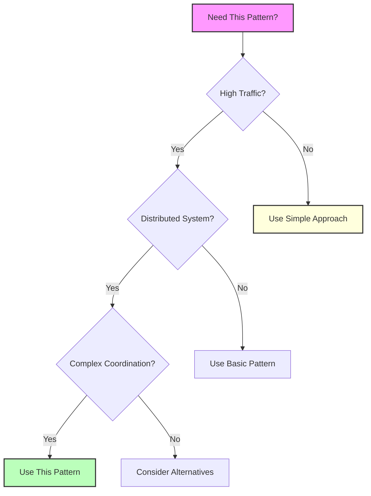
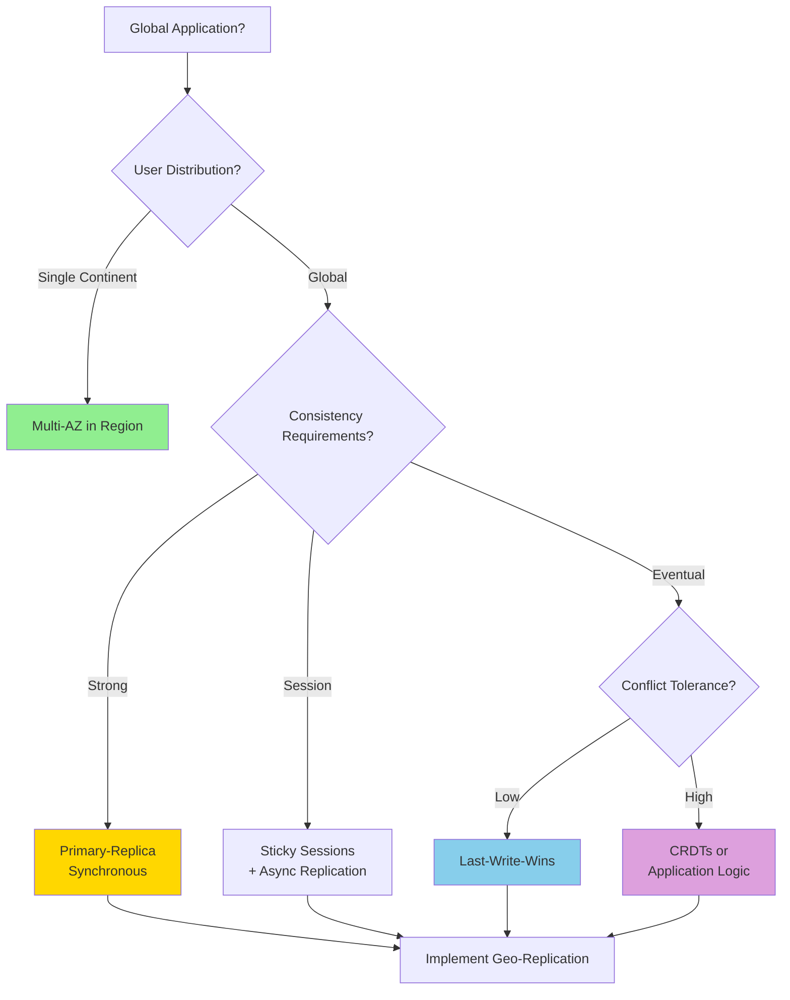

# Geo-Replication Pattern

!!! success "🏆 Gold Standard Pattern"
    **Global Scale with Local Performance** • Netflix, CockroachDB, DynamoDB proven
    
    Essential for truly global applications, geo-replication enables Netflix to serve 200M+ subscribers across 190 countries with <100ms latency while providing disaster recovery and compliance capabilities.

## Essential Questions

!!! question "Critical Geo-Replication Decisions"
    1. **What's your consistency requirement?** Strong, Causal, Eventual, or Custom?
    2. **How will you handle conflicts?** Last-write-wins, CRDTs, or manual resolution?
    3. **What's your partition strategy?** Geographic, user-based, or data-type?
    4. **How much replication lag can you tolerate?** <100ms, <1s, or minutes?
    5. **What's your failover RTO?** Seconds, minutes, or hours?
    6. **Which regions need data residency?** GDPR, CCPA, or other compliance?

## When to Use / When NOT to Use

### Use Geo-Replication When:

| Indicator | Threshold | Example |
|-----------|-----------|---------|
| **Global Users** | >20% users outside home region | SaaS with international customers |
| **Latency Requirements** | <100ms response time needed | Real-time collaboration tools |
| **Availability Target** | >99.95% uptime required | Financial services, healthcare |
| **Disaster Recovery** | <1 hour RTO required | Mission-critical applications |
| **Compliance** | Data residency laws apply | GDPR, CCPA, financial regulations |

### DON'T Use When:

| Scenario | Why Avoid | Alternative |
|----------|-----------|-------------|
| **Single Region Users** | Unnecessary complexity | Single region + CDN |
| **Strong Consistency Required** | Physics limitations | Active-passive replication |
| **Budget Constraints** | 3-5x infrastructure cost | Read replicas only |
| **Small Dataset** | <100GB doesn't justify cost | Database backups |
| **Simple Apps** | MVP/prototype stage | Focus on core features first |

## Architecture Decision Matrix



<details>
<summary>View implementation code</summary>



</details>

## Core Replication Strategies

### Strategy Comparison Matrix

| Strategy | Write Latency | Consistency | Data Loss Risk | Complexity | Best For |
|----------|---------------|-------------|----------------|------------|----------|
| **Primary-Replica** | Low (single write) | Strong | Low | Medium | Financial data |
| **Multi-Master** | Low (local write) | Eventual | Medium | High | Social media |
| **Chain Replication** | Medium | Strong | Very Low | Medium | Log storage |
| **Quorum** | Medium | Strong | Low | High | Distributed databases |
| **CRDT** | Low | Eventual | None | Very High | Collaborative editing |

### Replication Topology Patterns


<details>
<summary>View implementation code</summary>



</details>

## Geographic Latency Reality

### Inter-Region Network Latencies

| Route | Distance | Latency | Bandwidth | Cost/GB |
|-------|----------|---------|-----------|---------|
| **US East ↔ US West** | 4,500km | ~70ms | 100Gbps+ | $0.02 |
| **US East ↔ EU West** | 6,500km | ~80ms | 40Gbps | $0.05 |
| **US East ↔ Asia Pacific** | 17,000km | ~180ms | 10Gbps | $0.12 |
| **EU West ↔ Asia Pacific** | 12,000km | ~160ms | 20Gbps | $0.08 |
| **Within Region** | <2,000km | <20ms | 1Tbps+ | $0.01 |

### Consistency vs Latency Trade-offs



## Conflict Resolution Strategies

### When Conflicts Occur


<details>
<summary>View implementation code</summary>



</details>

### Resolution Strategy Comparison

| Strategy | Complexity | Data Loss | Use Case | Example |
|----------|------------|-----------|----------|---------|
| **Last-Write-Wins** | Low | High | Simple KV stores | Redis, DynamoDB |
| **Vector Clocks** | Medium | Low | Version tracking | Riak, Voldemort |
| **CRDTs** | High | None | Collaborative apps | YJS, Automerge |
| **Application Logic** | Very High | None | Business rules | Custom resolution |
| **Manual Resolution** | Low | None | Critical data | Git merge conflicts |

### CRDT Examples for Common Data Types


<details>
<summary>View implementation code</summary>

```mermaid
graph TB
    subgraph "G-Counter (Increment Only)"
        GC1[Node A: 5] --> GC3[Merge: max(5,3) = 5]
        GC2[Node B: 3] --> GC3
    end
    
    subgraph "PN-Counter (Inc/Dec)"
        PC1[Node A: +7, -2] --> PC3[Merge: (+10,-2) = 8]
        PC2[Node B: +3, -0] --> PC3
    end
    
    subgraph "OR-Set (Add/Remove)"
        OS1[Node A: {add:x, remove:y}] --> OS3[Merge: {x} ∪ {} = {x}]
        OS2[Node B: {add:z, remove:x}] --> OS3
    end
    
    subgraph "LWW-Register (Timestamped)"
        LW1[Node A: val=X, ts=100] --> LW3[Merge: latest timestamp wins]
        LW2[Node B: val=Y, ts=95] --> LW3
    end
```

</details>

## Production Implementation Patterns

### Netflix: Content Distribution Architecture


<details>
<summary>View implementation code</summary>



</details>

**Key Metrics:**
- 15,000+ content servers globally
- 200+ Tbps total capacity
- <10ms latency to 90% of users
- 99.99% availability target

### Database Geo-Replication: CockroachDB

| Feature | Implementation | Benefit |
|---------|----------------|---------|
| **Geo-Partitioning** | Pin data to regions | Compliance + performance |
| **Consensus Replication** | Raft across replicas | Strong consistency |
| **Zone Survival** | 3+ replicas per region | Datacenter failures |
| **Global Transactions** | Two-phase commit | ACID across regions |
| **Follower Reads** | Read from nearest replica | Low latency reads |

```yaml
# CockroachDB Geo-Partitioning Example
CREATE TABLE users (
    id UUID PRIMARY KEY,
    region STRING NOT NULL,
    email STRING,
    data JSONB,
    INDEX region_idx (region)
) PARTITION BY LIST (region) (
    PARTITION us VALUES IN ('us-east', 'us-west'),
    PARTITION eu VALUES IN ('eu-west', 'eu-central'),
    PARTITION asia VALUES IN ('ap-southeast', 'ap-northeast')
);

ALTER PARTITION us CONFIGURE ZONE USING
    constraints = '[+region=us]';
ALTER PARTITION eu CONFIGURE ZONE USING  
    constraints = '[+region=eu]';
ALTER PARTITION asia CONFIGURE ZONE USING
    constraints = '[+region=asia]';
```

## Cost Optimization Strategies

### Cost Breakdown Analysis

| Cost Component | Percentage | Optimization Strategy |
|----------------|------------|----------------------|
| **Cross-Region Bandwidth** | 40-60% | Data compression, selective replication |
| **Additional Infrastructure** | 30-40% | Right-sizing, spot instances |
| **Operational Complexity** | 10-20% | Automation, monitoring tools |
| **Development Time** | 5-15% | Use managed services, proven patterns |

### ROI Calculation Framework


<details>
<summary>View implementation code</summary>



</details>

## Monitoring & Operations

### Critical Metrics Dashboard

| Metric Category | Key Indicators | Alert Thresholds |
|-----------------|----------------|------------------|
| **Replication Health** | Lag time, success rate | >1s lag, <99% success |
| **Regional Performance** | Latency p95/p99, error rate | >200ms, >0.1% errors |
| **Consistency** | Conflict rate, resolution time | >0.01% conflicts |
| **Cost** | Bandwidth usage, compute cost | >20% budget variance |
| **Availability** | Region uptime, failover time | <99.9%, >5min failover |

### Disaster Recovery Procedures

```mermaid
stateDiagram-v2
    [*] --> Healthy: Normal Operations
    Healthy --> Degraded: Region Issues
    Healthy --> Emergency: Region Failure
    
    Degraded --> Investigating: Monitor & Assess
    Emergency --> Failover: Automatic/Manual
    
    Investigating --> Healthy: Issues Resolved
    Investigating --> Emergency: Escalation
    
    Failover --> Recovery: Primary Restored
    Recovery --> Healthy: Sync Complete
    
    note right of Failover: RTO Target: <5 minutes
    note right of Recovery: RPO Target: <1 minute
```

## Common Pitfalls & Solutions

| Pitfall | Impact | Root Cause | Solution |
|---------|---------|------------|----------|
| **Split-Brain Scenarios** | Data corruption | Network partitions | Implement quorum voting |
| **Cascading Failures** | Global outage | Region dependencies | Circuit breakers between regions |
| **Clock Drift** | Ordering issues | System clock skew | Use logical clocks (HLC) |
| **Bandwidth Explosion** | High costs | Full dataset replication | Selective/filtered replication |
| **Operational Complexity** | Human errors | Too many moving parts | Automation and runbooks |


## Level 1: Intuition (5 minutes)

*Start your journey with relatable analogies*

### The Elevator Pitch
[Pattern explanation in simple terms]

### Real-World Analogy
[Everyday comparison that explains the concept]

## Level 2: Foundation (10 minutes)

*Build core understanding*

### Core Concepts
- Key principle 1
- Key principle 2
- Key principle 3

### Basic Example


## Level 3: Deep Dive (15 minutes)

*Understand implementation details*

### How It Really Works
[Technical implementation details]

### Common Patterns
[Typical usage patterns]

## Level 4: Expert (20 minutes)

*Master advanced techniques*

### Advanced Configurations
[Complex scenarios and optimizations]

### Performance Tuning
[Optimization strategies]

## Level 5: Mastery (30 minutes)

*Apply in production*

### Real-World Case Studies
[Production examples from major companies]

### Lessons from the Trenches
[Common pitfalls and solutions]


## Decision Matrix



### Quick Decision Table

| Factor | Low Complexity | Medium Complexity | High Complexity |
|--------|----------------|-------------------|-----------------|
| Team Size | < 5 developers | 5-20 developers | > 20 developers |
| Traffic | < 1K req/s | 1K-100K req/s | > 100K req/s |
| Data Volume | < 1GB | 1GB-1TB | > 1TB |
| **Recommendation** | ❌ Avoid | ⚠️ Consider | ✅ Implement |

## Implementation Roadmap

### Phase 1: Foundation (Month 1-2)
- [ ] Deploy secondary region (read-only)
- [ ] Implement basic replication
- [ ] Set up monitoring and alerting
- [ ] Test failover procedures

### Phase 2: Multi-Region Writes (Month 3-4)  
- [ ] Enable writes in secondary regions
- [ ] Implement conflict resolution
- [ ] Add geo-routing logic
- [ ] Load test across regions

### Phase 3: Optimization (Month 5-6)
- [ ] Optimize replication lag
- [ ] Implement selective replication
- [ ] Add compliance controls
- [ ] Cost optimization review

## Decision Framework


<details>
<summary>View implementation code</summary>



</details>

## Quick Reference

### Regional Latency Expectations

| Source → Destination | Expected RTT | Replication Lag |
|---------------------|--------------|----------------|
| **US East → US West** | ~70ms | <100ms |
| **US → Europe** | ~80ms | <150ms |
| **US → Asia** | ~180ms | <250ms |
| **Europe → Asia** | ~160ms | <200ms |

### Replication Strategy Selection

| If You Need... | Use This Strategy | Trade-off |
|----------------|------------------|-----------|
| **Strong consistency** | Primary-replica sync | Higher latency |
| **Low write latency** | Multi-master async | Conflict resolution |
| **Zero data loss** | Chain replication | Sequential bottleneck |
| **Automatic conflicts** | CRDTs | Limited data types |
| **Simple implementation** | Last-write-wins | Potential data loss |

---

*"In geo-replication, the speed of light isn't just physics—it's your SLA."*

---

**Related Patterns**: [Multi-Region](multi-region.md) | [CDN](../performance/cdn.md) | [Event Sourcing](../data-management/event-sourcing.md)

**Next**: [ID Generation at Scale →](id-generation-scale.md)