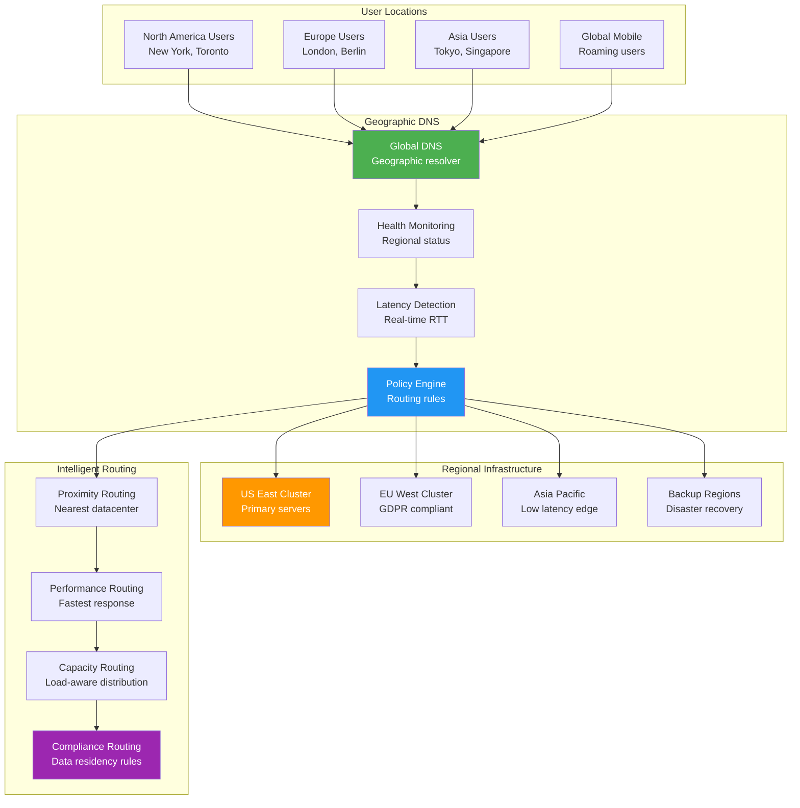

## The Complete Blueprint

Geographic Load Balancing patterns intelligently route user requests to the optimal server locations based on geographic proximity, latency measurements, and regional server health to minimize response times and improve user experience globally. This pattern extends traditional load balancing by incorporating geographic awareness into routing decisions, using techniques like DNS-based routing, anycast networking, and intelligent traffic management systems. The architecture considers factors such as network topology, regional server capacity, compliance requirements, and disaster recovery scenarios while maintaining seamless failover capabilities when regional services become unavailable.

### What You'll Master

- **DNS-based geographic routing** using geolocation databases, anycast addressing, and intelligent DNS resolution for optimal server selection
- **Latency-aware load balancing** measuring real-time round-trip times and network conditions to route traffic to fastest responding regions
- **Health monitoring systems** tracking regional server status, capacity utilization, and automatic failover to backup locations
- **Compliance-aware routing** ensuring data residency requirements and regulatory compliance while maintaining performance
- **Multi-tier routing strategies** combining geographic, performance, and capacity-based routing for optimal user experience
- **Disaster recovery integration** seamless failover between regions during outages while maintaining service availability

# Geographic Load Balancing

Distribute load globally

## See Also

- [Eventual Consistency](/pattern-library/data-management/eventual-consistency)
- [Event Streaming](/pattern-library/architecture/event-streaming)
- [Rate Limiting Pattern](/pattern-library/scaling/rate-limiting)
