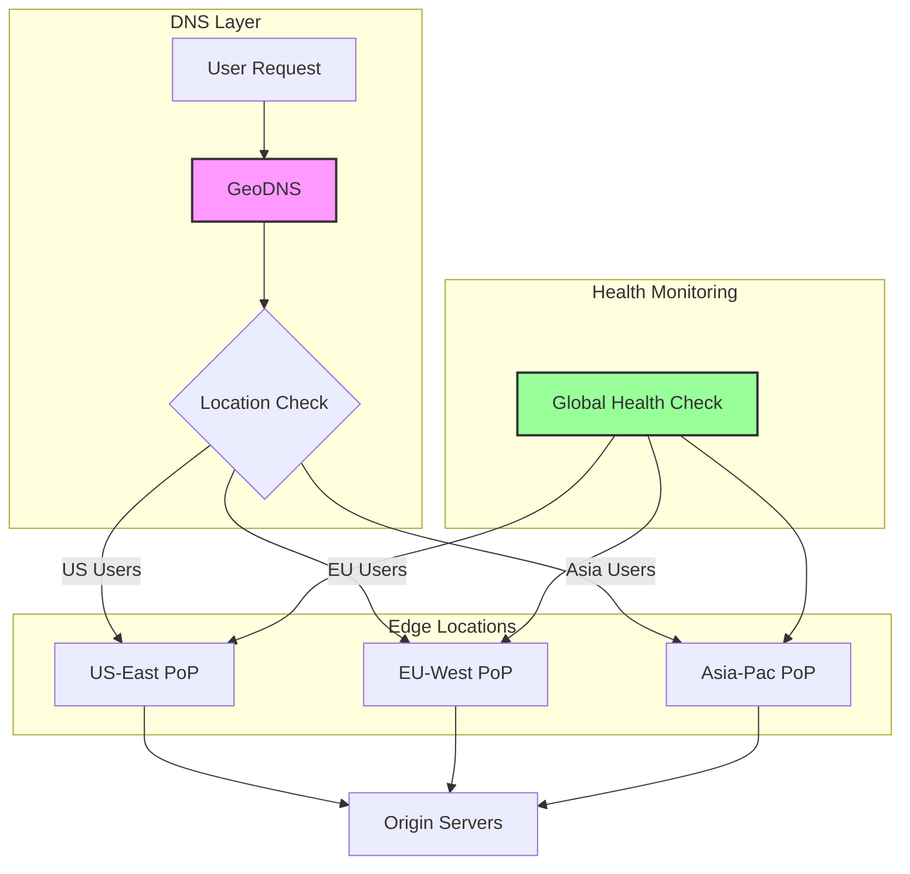

# Geographic Load Balancing Pattern

!!! success "🏆 Gold Standard Pattern"
    **Global Traffic Distribution** • Cloudflare, Akamai, AWS Route 53 proven
    
    Geographic load balancing routes users to the nearest healthy endpoint based on their location, reducing latency and improving reliability through geographic distribution.
    
    **Key Success Metrics:**
    - Cloudflare: 50ms average global latency
    - Netflix: 99.99% availability through geo-redundancy
    - Google: <100ms response time for 90% of users globally

<div class="axiom-box">
<h4>⚛️ Law 2: Asynchronous Reality</h4>

Geographic load balancing must account for the speed of light - the fundamental limit of information transfer. A request from Tokyo to New York faces a minimum 70ms round-trip time due to physics alone. Geographic distribution brings compute closer to users.

**Key Insight**: No amount of optimization can overcome the speed of light. Geographic distribution is the only solution for truly global low-latency services.
</div>

## Problem

Single-region deployments face fundamental limitations:
- **Physics**: Speed of light creates minimum latency
- **Reliability**: Regional outages affect all users
- **Compliance**: Data residency requirements
- **Performance**: Distance degrades user experience

## Solution



### Distribution Strategies

| Strategy | Use Case | Latency | Complexity |
|----------|----------|---------|------------|
| **DNS-based** | Simple geographic routing | Medium | Low |
| **Anycast** | Ultra-low latency | Lowest | Medium |
| **Application-layer** | Complex routing rules | Higher | High |
| **CDN Integration** | Static content | Lowest | Low |

## When to Use

### ✅ Perfect For:
- **Global applications**: Consumer-facing services
- **Latency-sensitive**: Gaming, video streaming
- **High availability**: Critical business services
- **Compliance needs**: Data sovereignty requirements

### ❌ Avoid For:
- **Small user base**: Single-region sufficient
- **Consistency-critical**: Strong consistency needs
- **Budget constraints**: Multi-region is expensive
- **Complex transactions**: Cross-region coordination

## Implementation Guide

### DNS-Based Geographic Routing

```yaml
# AWS Route 53 Example
GeographicRoutingPolicy:
  - Location: "North America"
    Endpoints:
      - us-east-1.example.com (Primary)
      - us-west-2.example.com (Secondary)
    HealthCheck:
      Interval: 30s
      Threshold: 3
      
  - Location: "Europe"
    Endpoints:
      - eu-west-1.example.com (Primary)
      - eu-central-1.example.com (Secondary)
      
  - Location: "Asia Pacific"
    Endpoints:
      - ap-southeast-1.example.com (Primary)
      - ap-northeast-1.example.com (Secondary)
```

### Production Architecture

| Component | Purpose | Best Practice |
|-----------|---------|---------------|
| **GeoDNS** | Route by location | Multiple providers for redundancy |
| **Health Checks** | Detect failures | Multi-point verification |
| **Failover Logic** | Handle outages | Automatic cross-region failover |
| **Data Sync** | Consistency | Eventual consistency acceptable |

## Real-World Examples

### Netflix's Global Streaming
- **Regions**: 190+ countries served
- **Strategy**: ISP-level routing optimization
- **Result**: <2 second startup time globally

### Cloudflare's Anycast Network
- **PoPs**: 300+ cities worldwide
- **Approach**: Anycast IP routing
- **Performance**: 50ms global average latency

## Common Pitfalls

1. **Split Brain**: Network partitions causing routing conflicts
2. **Cascade Failures**: One region overwhelming another
3. **Data Consistency**: Cross-region synchronization issues
4. **Cost Explosion**: Underestimating multi-region expenses

## Trade-offs

| Aspect | Benefit | Cost |
|--------|---------|------|
| **Latency** | 50-80% reduction | Infrastructure complexity |
| **Availability** | 99.99%+ possible | Operational overhead |
| **Scalability** | Region-independent growth | Data synchronization |
| **Compliance** | Data residency met | Legal complexity |

## Related Patterns
- [Load Balancing](./load-balancing.md) - Local traffic distribution
- [Edge Computing](./edge-computing.md) - Computation at the edge
- [Content Delivery Network](./content-delivery-network.md) - Static content distribution
- [Multi-Region Database](../data-management/multi-region-database.md) - Data layer geo-distribution

## References
- [Cloudflare's Anycast Network](https://www.cloudflare.com/learning/cdn/glossary/anycast-network/)
- [Netflix's Edge Architecture](https://netflixtechblog.com/netflix-edge-gateway/)
- [AWS Global Infrastructure](https://aws.amazon.com/about-aws/global-infrastructure/)