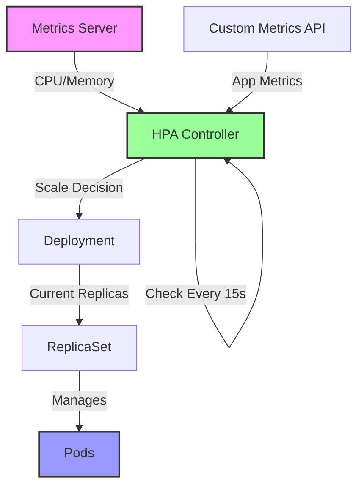

# Horizontal Pod Autoscaler (HPA) Pattern

!!! success "🏆 Gold Standard Pattern"
    **Kubernetes-Native Dynamic Scaling** • Google, Spotify, Airbnb proven
    
    HPA automatically scales the number of pods in a deployment based on observed CPU utilization, memory usage, or custom metrics. Essential for cloud-native applications requiring elastic scaling.
    
    **Key Success Metrics:**
    - Spotify: 90% reduction in over-provisioning costs
    - Airbnb: Sub-minute scaling response times
    - Pinterest: 40% improvement in resource utilization

<div class="axiom-box">
<h4>⚛️ Law 7: Economic Reality</h4>

HPA directly addresses the economic reality of cloud computing - paying for what you use. By automatically scaling pods based on actual demand, it prevents both over-provisioning (wasted money) and under-provisioning (poor performance).

**Key Insight**: Effective HPA configuration must balance scaling speed against thrashing. Too aggressive scaling leads to constant pod churn; too conservative misses traffic spikes.
</div>

## Problem

Manual scaling of containerized applications leads to:
- **Over-provisioning**: Wasting resources during low traffic
- **Under-provisioning**: Performance degradation during spikes
- **Operational overhead**: 24/7 monitoring and manual intervention
- **Slow response**: Human reaction time to traffic changes

## Solution



### Implementation Components

| Component | Purpose | Configuration |
|-----------|---------|---------------|
| **Metrics Server** | Collects resource metrics | CPU, memory usage |
| **HPA Controller** | Makes scaling decisions | Min/max replicas, target utilization |
| **Custom Metrics API** | Application-specific metrics | Request rate, queue depth |
| **VPA Integration** | Vertical scaling coordination | Resource request optimization |

## When to Use

### ✅ Perfect For:
- **Variable workloads**: E-commerce, social media
- **Microservices**: Independent service scaling
- **Cost optimization**: Pay-per-use environments
- **SLA compliance**: Maintaining response times

### ❌ Avoid For:
- **Stateful applications**: Databases, caches
- **Startup-heavy apps**: Long initialization times
- **Predictable loads**: Batch processing
- **Resource-constrained**: Limited cluster capacity

## Implementation Guide

### Basic HPA Configuration

```yaml
apiVersion: autoscaling/v2
kind: HorizontalPodAutoscaler
metadata:
  name: api-hpa
spec:
  scaleTargetRef:
    apiVersion: apps/v1
    kind: Deployment
    name: api-deployment
  minReplicas: 3
  maxReplicas: 100
  metrics:
  - type: Resource
    resource:
      name: cpu
      target:
        type: Utilization
        averageUtilization: 70
  - type: Resource
    resource:
      name: memory
      target:
        type: Utilization
        averageUtilization: 80
  behavior:
    scaleDown:
      stabilizationWindowSeconds: 300
      policies:
      - type: Percent
        value: 10
        periodSeconds: 60
    scaleUp:
      stabilizationWindowSeconds: 0
      policies:
      - type: Percent
        value: 100
        periodSeconds: 60
      - type: Pods
        value: 4
        periodSeconds: 60
```

### Production Considerations

| Aspect | Recommendation | Rationale |
|--------|----------------|-----------|
| **Metric Selection** | Combine CPU + custom metrics | CPU alone misses app-specific bottlenecks |
| **Scaling Velocity** | Gradual scale-down, fast scale-up | Prevent thrashing, respond to spikes |
| **Pod Disruption Budget** | Minimum 2 available | Maintain availability during scaling |
| **Resource Requests** | Accurate CPU/memory requests | HPA decisions based on request ratios |

## Real-World Examples

### Spotify's Microservices Platform
- **Scale**: 100+ microservices with HPA
- **Metrics**: Custom metrics for queue depth
- **Result**: 90% reduction in idle resources

### Airbnb's Search Service
- **Challenge**: 10x traffic spikes during events
- **Solution**: HPA with predictive scaling
- **Outcome**: <100ms p99 latency maintained

## Common Pitfalls

1. **Metric Lag**: Using metrics with high collection delay
2. **Thrashing**: Too aggressive scaling parameters
3. **Resource Limits**: Not setting appropriate requests/limits
4. **Cold Starts**: Not accounting for application startup time

## Related Patterns
- [Auto-Scaling](./auto-scaling.md) - General auto-scaling concepts
- [Circuit Breaker](../resilience/circuit-breaker.md) - Handling downstream failures
- [Load Balancing](./load-balancing.md) - Distributing scaled traffic
- [Predictive Scaling](../intelligence/predictive-scaling.md) - ML-based scaling

## References
- [Kubernetes HPA Documentation](https://kubernetes.io/docs/tasks/run-application/horizontal-pod-autoscale/)
- [Spotify's Autoscaling Journey](https://engineering.atspotify.com/autoscaling/)
- [Airbnb's Kubernetes Platform](https://medium.com/airbnb-engineering/kubernetes-at-airbnb/)