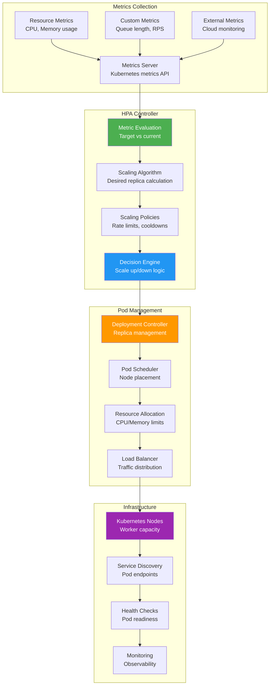

## The Complete Blueprint

Horizontal Pod Autoscaler (HPA) patterns automatically scale Kubernetes applications by adjusting the number of pod replicas based on observed metrics like CPU utilization, memory usage, or custom application metrics. This pattern addresses the fundamental challenge of matching compute resources to dynamic workload demands without manual intervention, ensuring applications maintain performance during traffic spikes while optimizing costs during low usage periods. The HPA controller continuously monitors metrics, makes scaling decisions based on configurable thresholds, and works with the Kubernetes scheduler to deploy or remove pod instances across the cluster infrastructure.

### What You'll Master

- **Kubernetes autoscaling mechanics** with HPA controllers, metrics APIs, and scaling algorithms for automatic pod replica management
- **Metrics-based scaling strategies** using CPU, memory, custom application metrics, and external monitoring data for scaling decisions
- **Scaling policies and configuration** including target thresholds, rate limits, cooldown periods, and scaling behavior tuning
- **Resource management integration** working with node autoscaling, resource quotas, and cluster capacity planning
- **Performance optimization** preventing scaling thrashing, handling metric lag, and optimizing for cost and performance trade-offs
- **Production deployment patterns** monitoring autoscaling behavior, troubleshooting scaling issues, and operational best practices

# Horizontal Pod Autoscaler

Kubernetes autoscaling

## See Also

- [Eventual Consistency](/pattern-library/data-management/eventual-consistency)
- [Event Streaming](/pattern-library/architecture/event-streaming)
- [Rate Limiting Pattern](/pattern-library/scaling/rate-limiting)
