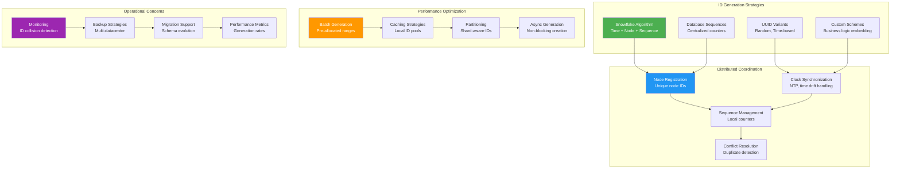

## The Complete Blueprint

ID Generation at Scale patterns address the challenge of creating unique identifiers across distributed systems without coordination bottlenecks or conflicts. This pattern enables high-throughput applications to generate globally unique IDs while avoiding centralized coordination that would limit scalability and introduce single points of failure. Solutions include Twitter's Snowflake algorithm for time-ordered IDs, UUID variants for true distribution, database-specific sequences with ranges, and custom schemes that embed metadata. The architecture must balance uniqueness guarantees, ordering requirements, performance characteristics, and operational complexity while handling clock drift, node failures, and network partitions.



### What You'll Master

- **Snowflake algorithm implementation** combining timestamp, node ID, and sequence numbers for scalable, time-ordered unique identifiers
- **UUID strategies** selecting appropriate UUID versions for different use cases including performance, collision resistance, and ordering requirements
- **Distributed coordination techniques** handling node registration, clock synchronization, and sequence management across multiple servers
- **Performance optimization** through batch generation, caching, and partitioning strategies for high-throughput ID creation
- **Operational management** monitoring for ID collisions, implementing backup generation strategies, and handling schema migrations
- **Trade-off analysis** between uniqueness guarantees, ordering properties, performance characteristics, and operational complexity

## Essential Question

**How do we handle increasing load without sacrificing performance using id generation at scale?**

# ID Generation at Scale

## The Essential Question

**How can distributed systems generate billions of globally unique identifiers per second while maintaining time ordering, avoiding coordination bottlenecks, and ensuring no collisions?**

**Tagline**: *"Unique at web scale - billions of IDs without central coordination."*

!!! success "🏆 Gold Standard Pattern"
**Implementation available in production systems**

---

### The Story

Imagine a massive conference where millions of people need name tags simultaneously. A single person printing tags would be impossibly slow. Instead, you give each registration desk a unique prefix (desk-01, desk-02) and a number stamp. Each desk can independently create unique tags like "desk-01-001", "desk-02-001" without coordination.

Snowflake IDs work similarly: each server gets a unique worker ID and generates sequential numbers, creating globally unique IDs without talking to other servers.

### When to Use

## Decision Flow

| ✅ **Use When** | ❌ **Avoid When** |
|----------------|------------------|
| Billions of IDs needed | Small-scale applications |
| Need time ordering | Random ordering is fine |
| Distributed systems | Single-node applications |
| High-performance requirements | UUIDs meet requirements |
| Database-friendly IDs | No database performance concerns |

### Requirements at Scale

| Requirement | Why Critical | Snowflake Solution |
|-------------|--------------|--------------------|
| **Uniqueness** | No ID collisions ever | Worker ID partitioning |
| **Ordering** | Database performance | Timestamp prefix |
| **Performance** | Millions of IDs/second | No network coordination |
| **Compact** | Memory/storage efficiency | 64-bit integers |
| **Availability** | No single points of failure | Distributed generation |

### Real-World Impact

- **Twitter**: 400M+ tweets daily need IDs in milliseconds
- **Instagram**: 95M+ photos uploaded need instant, sortable IDs
- **Discord**: 15B+ messages/month with perfect time ordering
- **URL shorteners**: Billions of short links with collision-free generation

---

### Decision Matrix

| Factor | Score (1-5) | Reasoning |
|--------|-------------|-----------|
| **Complexity** | 3 | Moderate complexity - understanding bit allocation, worker coordination, and time synchronization |
| **Performance Impact** | 5 | Excellent performance - millions of IDs per second with no coordination overhead |
| **Operational Overhead** | 3 | Requires worker ID management, time synchronization monitoring, and collision detection |
| **Team Expertise Required** | 3 | Requires understanding of distributed ID generation principles and bit manipulation |
| **Scalability** | 5 | Exceptional scalability - handles billions of IDs across thousands of workers with linear scaling |

**Overall Recommendation**: ✅ **RECOMMENDED** - Gold standard for high-scale ID generation with excellent performance characteristics and proven production track record.

### The Problem Space

!!! danger "🔥 The ID Generation Disaster"
**Implementation available in production systems**

### Snowflake Algorithm Structure

mermaid
flowchart TD
**Implementation available in production systems**

**System Flow:** Input → Processing → Output

python
## Production-ready Snowflake
class SnowflakeGenerator:
**Implementation available in production systems**

mermaid
graph TD
**Implementation available in production systems**

```


```