## Essential Question

**How do we handle increasing load without sacrificing performance using id generation at scale?**


# ID Generation at Scale

## The Essential Question

**How can distributed systems generate billions of globally unique identifiers per second while maintaining time ordering, avoiding coordination bottlenecks, and ensuring no collisions?**

**Tagline**: *"Unique at web scale - billions of IDs without central coordination."*

!!! success "🏆 Gold Standard Pattern"
    **Billions of Unique IDs at Millisecond Speed** • Twitter, Instagram, Discord proven
    
    The battle-tested solution for generating billions of unique IDs across distributed systems. Snowflake algorithm and variants power the world's largest platforms.
    
    **Key Success Metrics:**
    - Twitter: 500M+ tweets/day with time-ordered Snowflake IDs
    - Instagram: 95M+ photos/day using modified Snowflake
    - Discord: 15B+ messages/month with globally unique IDs

---

## Level 1: Intuition (5 minutes)

### The Story

Imagine a massive conference where millions of people need name tags simultaneously. A single person printing tags would be impossibly slow. Instead, you give each registration desk a unique prefix (desk-01, desk-02) and a number stamp. Each desk can independently create unique tags like "desk-01-001", "desk-02-001" without coordination.

Snowflake IDs work similarly: each server gets a unique worker ID and generates sequential numbers, creating globally unique IDs without talking to other servers.

### When to Use

| ✅ **Use When** | ❌ **Avoid When** |
|----------------|------------------|
| Billions of IDs needed | Small-scale applications |
| Need time ordering | Random ordering is fine |
| Distributed systems | Single-node applications |
| High-performance requirements | UUIDs meet requirements |
| Database-friendly IDs | No database performance concerns |

### The Problem: Scale Kills Traditional Approaches


### Requirements at Scale

| Requirement | Why Critical | Snowflake Solution |
|-------------|--------------|--------------------|
| **Uniqueness** | No ID collisions ever | Worker ID partitioning |
| **Ordering** | Database performance | Timestamp prefix |
| **Performance** | Millions of IDs/second | No network coordination |
| **Compact** | Memory/storage efficiency | 64-bit integers |
| **Availability** | No single points of failure | Distributed generation |

### Real-World Impact

- **Twitter**: 400M+ tweets daily need IDs in milliseconds
- **Instagram**: 95M+ photos uploaded need instant, sortable IDs
- **Discord**: 15B+ messages/month with perfect time ordering
- **URL shorteners**: Billions of short links with collision-free generation

---

## Level 2: Foundation (15 minutes)

### The Problem Space

!!! danger "🔥 The ID Generation Disaster"
    Social media startup used database auto-increment for post IDs:
    - **Scale**: 10,000 posts/second at peak
    - **Problem**: Single database became bottleneck
    - **Impact**: 5-second delays, timeouts, user frustration
    - **Cost**: Lost 40% of users during viral event
    - **Solution**: Snowflake IDs → Sub-millisecond generation

### Snowflake Algorithm Structure


<details>
<summary>View implementation code</summary>


</details>

### Core Algorithm


<details>
<summary>View implementation code</summary>

```python
class SnowflakeGenerator:
    def __init__(self, worker_id):
        self.worker_id = worker_id & 0x3FF  # 10 bits max
        self.sequence = 0
        self.last_timestamp = -1
        self.epoch = 1288834974657  # Twitter's epoch
    
    def generate_id(self):
        timestamp = int(time.time() * 1000)
        
        # Handle clock issues
        if timestamp < self.last_timestamp:
            raise Exception("Clock went backwards!")
        
        # Same millisecond - increment sequence
        if timestamp == self.last_timestamp:
            self.sequence = (self.sequence + 1) & 0xFFF
            if self.sequence == 0:  # Overflow
                timestamp = self._wait_next_ms(timestamp)
        else:
            self.sequence = 0
        
        self.last_timestamp = timestamp
        
        # Combine: timestamp + worker + sequence
        return ((timestamp - self.epoch) << 22) | \
               (self.worker_id << 12) | \
               self.sequence
```

</details>

### How It Works


<details>
<summary>View implementation code</summary>


</details>

### Trade-offs Analysis

| Aspect | Benefit | Limitation |
|--------|---------|------------|
| **Performance** | 2M+ IDs/second per worker | Clock dependency |
| **Uniqueness** | Mathematically guaranteed | Need unique worker IDs |
| **Ordering** | Time-ordered globally | Slight clock skew possible |
| **Size** | 64-bit efficiency | Less compact than integers |
| **Scalability** | 1024 workers max | Worker ID coordination needed |

### Capacity Planning

```mermaid
graph TB
    subgraph "Snowflake Limits"
        T["41-bit timestamp<br/>69 years capacity"]
        W["10-bit worker ID<br/>1024 machines"]
        S["12-bit sequence<br/>4096 IDs/ms/worker"]
    end
    
    subgraph "Scale Math"
        Peak["Peak capacity per worker:<br/>4096 × 1000 = 4M IDs/second"]
        Total["Total system capacity:<br/>1024 × 4M = 4B IDs/second"]
    end
    
    T --> Peak
    W --> Total
    S --> Peak
    
    style Peak fill:#10b981,stroke:#059669
    style Total fill:#065f46,stroke:#047857
```



---

## Level 3: Deep Dive (25 minutes)

### ID Generation Variants

#### Instagram's Database-Aware Approach


**Key Innovation**: Embed database shard information in the ID, enabling efficient routing and query optimization.

```sql
-- Simplified Instagram approach
CREATE FUNCTION generate_instagram_id(shard_id int) RETURNS bigint AS $$
BEGIN
    RETURN (EXTRACT(EPOCH FROM NOW()) * 1000)::bigint << 23 |
           shard_id << 10 |
           (nextval('sequence') % 1024);
END;
$$ LANGUAGE plpgsql;
```

#### MongoDB ObjectId Pattern


**Use Case**: Document databases where 96-bit IDs are acceptable and natural time ordering is desired.

```javascript
// Simplified ObjectId concept
class SimpleObjectId {
    constructor() {
        this.timestamp = Math.floor(Date.now() / 1000);  // 4 bytes
        this.machineId = this.getMachineId();            // 3 bytes
        this.processId = process.pid & 0xFFFF;           // 2 bytes
        this.counter = SimpleObjectId.getNextCounter();  // 3 bytes
    }
    
    static getNextCounter() {
        this._counter = (this._counter + 1) % 0xFFFFFF;
        return this._counter;
    }
}
```
 
```

## ULID (Universally Unique Lexicographically Sortable Identifier)

Combines timestamp and randomness for sortability:

```python
import time
import random
import base32_crockford

class ULID:
 def __init__(self):
 self.encoding = "0123456789ABCDEFGHJKMNPQRSTVWXYZ"
 
 def generate(self):
# 48-bit timestamp (milliseconds)
 timestamp = int(time.time() * 1000)
 
# 80-bit randomness
 randomness = random.getrandbits(80)
 
# Encode to base32
 timestamp_str = self._encode_timestamp(timestamp)
 random_str = self._encode_randomness(randomness)
 
 return timestamp_str + random_str
 
 def _encode_timestamp(self, timestamp):
# Convert to 10-character base32 string
 result = ""
 for _ in range(10):
 result = self.encoding[timestamp % 32] + result
 timestamp //= 32
 return result
 
 def _encode_randomness(self, randomness):
# Convert to 16-character base32 string
 result = ""
 for _ in range(16):
 result = self.encoding[randomness % 32] + result
 randomness //= 32
 return result

# Usage
ulid = ULID()
id = ulid.generate()
print(f"ULID: {id}") # e.g., 01ARZ3NDEKTSV4RRFFQ69G5FAV
```

## Sonyflake (Sony's Variation)

39-bit timestamp, 16-bit sequence, 8-bit machine ID:

```go
package main

import (
 "fmt"
 "sync"
 "time"
)

type Sonyflake struct {
 mutex sync.Mutex
 startTime int64
 machineID uint16
 sequence uint16
 lastTime int64
}

func NewSonyflake(machineID uint8) *Sonyflake {
 return &Sonyflake{
 startTime: time.Date(2014, 9, 1, 0, 0, 0, 0, time.UTC).Unix(),
 machineID: uint16(machineID),
 sequence: 0,
 lastTime: -1,
 }
}

func (sf *Sonyflake) NextID() (uint64, error) {
 sf.mutex.Lock()
 defer sf.mutex.Unlock()
 
 now := time.Now().Unix()
 
 if now < sf.lastTime {
 return 0, fmt.Errorf("clock moved backwards")
 }
 
 if now == sf.lastTime {
 sf.sequence = (sf.sequence + 1) & 0xFFFF
 if sf.sequence == 0 {
 // Wait for next second
 for now <= sf.lastTime {
 time.Sleep(time.Millisecond)
 now = time.Now().Unix()
 }
 }
 } else {
 sf.sequence = 0
 }
 
 sf.lastTime = now
 
 // Combine components (63 bits total)
 id := uint64((now-sf.startTime)&0x7FFFFFFFFF) << 24 // 39 bits
 id |= uint64(sf.sequence&0xFFFF) << 8 // 16 bits
 id |= uint64(sf.machineID & 0xFF) // 8 bits
 
 return id, nil
}
```

## Flake ID (Boundary's Approach)

128-bit IDs for even higher scale:

```python
import struct
import socket
import os
import time

class FlakeID:
 def __init__(self):
 self.worker_id = self._generate_worker_id()
 self.sequence = 0
 self.last_timestamp = 0
 
 def _generate_worker_id(self):
# Combine hostname and process ID
 hostname = socket.gethostname()
 pid = os.getpid()
 combined = f"{hostname}-{pid}"
 return hash(combined) & 0xFFFF # 16 bits
 
 def generate(self):
 timestamp = int(time.time() * 1000) # milliseconds
 
 if timestamp < self.last_timestamp:
 raise ValueError("Clock moved backwards")
 
 if timestamp == self.last_timestamp:
 self.sequence = (self.sequence + 1) & 0xFFF
 if self.sequence == 0:
# Wait for next millisecond
 while timestamp <= self.last_timestamp:
 timestamp = int(time.time() * 1000)
 else:
 self.sequence = 0
 
 self.last_timestamp = timestamp
 
# 128-bit ID structure
# 64-bit timestamp + 16-bit worker + 12-bit sequence + 36-bit random
 random_bits = os.urandom(5) # 40 bits, use 36
 
 high_64 = timestamp << 16 | self.worker_id
 low_64 = self.sequence << 36 | (int.from_bytes(random_bits, 'big') & 0xFFFFFFFFF)
 
 return (high_64 << 64) | low_64

# Usage
flake = FlakeID()
id = flake.generate()
print(f"FlakeID: {id:032x}") # 128-bit hex
```

## Performance Comparison

```python
import time
import threading
from concurrent.futures import ThreadPoolExecutor

def benchmark_generator(generator_class, iterations=1000000):
 generator = generator_class()
 
 start_time = time.time()
 
 def generate_batch(count):
 for _ in range(count):
 generator.generate()
 
# Multi-threaded test
 with ThreadPoolExecutor(max_workers=10) as executor:
 batch_size = iterations // 10
 futures = [
 executor.submit(generate_batch, batch_size) 
 for _ in range(10)
 ]
 
 for future in futures:
 future.result()
 
 duration = time.time() - start_time
 ids_per_second = iterations / duration
 
 return ids_per_second

### Performance Benchmarks

| Algorithm | IDs/Second/Core | Memory/ID | CPU Cost | Use Case |
|-----------|----------------|-----------|----------|----------|
| **Snowflake** | 2M | 8 bytes | Low | General purpose |
| **ObjectId** | 800K | 12 bytes | Low | Document DBs |
| **ULID** | 500K | 26 bytes | Medium | String-based |
| **UUID4** | 300K | 16 bytes | High | Simple uniqueness |

!!! tip "Performance Optimization"
    - **Pre-allocate sequences**: Generate batches in advance
    - **Lock-free algorithms**: Use atomic operations where possible
    - **Hot/cold partitioning**: Keep active generators in L1 cache
    - **Batch generation**: Generate multiple IDs per clock read

### URL Shortener Patterns


**Key Pattern**: Generate Snowflake ID, then encode to Base62 for short, readable URLs.

```python
# URL shortener ID generation
class URLShortener:
    ALPHABET = "0123456789abcdefghijklmnopqrstuvwxyzABCDEFGHIJKLMNOPQRSTUVWXYZ"
    
    def __init__(self, worker_id):
        self.snowflake = SnowflakeGenerator(worker_id)
    
    def create_short_url(self, long_url):
        # Generate unique ID
        id = self.snowflake.generate_id()
        
        # Encode to base62 for short URL
        short_code = self.encode_base62(id)
        
        # Store mapping
        self.store_mapping(short_code, long_url)
        
        return f"https://short.ly/{short_code}"
```

---

## Level 5: Mastery (45 minutes)

### Production Case Study: Discord's ID System

!!! info "🏢 Real-World Implementation"
    **Company**: Discord  
    **Scale**: 15B+ messages/month, millions of concurrent users  
    **Challenge**: Generate IDs for messages, users, channels, servers with perfect ordering  
    
    **Implementation**: Modified Snowflake with custom epoch
    
    ```python
    # Discord's approach (simplified)
    class DiscordIDGenerator:
        DISCORD_EPOCH = 1420070400000  # First second of 2015
        
        def generate_id(self, worker_id):
            timestamp = int(time.time() * 1000) - self.DISCORD_EPOCH
            return (timestamp << 22) | (worker_id << 17) | (sequence << 12)
    ```
    
    **Results**:
    - Perfect message ordering in channels
    - 99.9% ID generation success rate
    - <1ms average generation time
    - Zero collisions in 8+ years
    
    **Key Lessons**:
    1. Custom epoch extends ID lifespan
    2. Bit allocation optimized for specific use case
    3. Monitoring and alerting critical for worker ID conflicts
    4. Clock synchronization is non-negotiable

### Advanced Techniques

#### Collision Detection


<details>
<summary>View implementation code</summary>

```python
class CollisionSafeGenerator:
    """Add collision detection layer for critical systems"""
    
    def __init__(self, primary_generator, store):
        self.primary = primary_generator
        self.store = store  # Redis/DB for collision tracking
    
    def generate_with_check(self, max_retries=3):
        for attempt in range(max_retries):
            candidate_id = self.primary.generate_id()
            
            # Check for collision (rare but possible)
            if not self.store.exists(f"id:{candidate_id}"):
                self.store.setex(f"id:{candidate_id}", 3600, "reserved")
                return candidate_id
            
            # Collision detected - add entropy and retry
            self.add_entropy(attempt)
        
        raise IDGenerationError("Failed after retries")
```

</details>

#### Multi-Datacenter Coordination


<details>
<summary>View implementation code</summary>


</details>


<details>
<summary>View implementation code</summary>

```

### Economic Impact Analysis

!!! success "💰 ROI of Proper ID Generation"
    **Before**: Database auto-increment at scale
    - Single bottleneck limited to 10K IDs/second
    - Required expensive database scaling
    - Frequent outages during traffic spikes
    - $50K/month in database costs
    
    **After**: Snowflake distributed generation
    - 2M+ IDs/second per worker
    - Horizontal scaling with commodity servers
    - Zero outages from ID generation
    - $5K/month in compute costs
    
    **ROI**: 200x performance improvement, 90% cost reduction

### Future Directions

#### Quantum-Safe ID Generation
- **Post-quantum cryptography**: Prepare for quantum computing threats
- **Extended bit lengths**: 128-bit or 256-bit IDs for quantum resistance
- **Hybrid approaches**: Combine multiple entropy sources

#### Edge Computing IDs
- **Hierarchical generation**: Edge → Regional → Global coordination
- **Offline capability**: Generate IDs without network connectivity
- **Conflict resolution**: Handle network partition scenarios


!!! note
 <strong>Decision Framework</strong>:
 - **High throughput, ordering important**: Snowflake
 - **Database-friendly, moderate scale**: MongoDB ObjectId
 - **Lexicographic sorting needed**: ULID
 - **URL shortening**: Custom base62 with collision detection
 - **Multi-datacenter**: Hierarchical IDs
 - **Extremely high scale**: 128-bit Flake IDs
 - **Simple, no coordination**: UUID4

## Trade-offs

| Approach | Uniqueness | Ordering | Size | Performance | Complexity |
|----------|------------|----------|------|-------------|------------|
| Snowflake | Guaranteed | Time-ordered | 64-bit | Very High | Medium |
| ObjectId | Guaranteed | Time-ordered | 96-bit | High | Low |
| ULID | Guaranteed | Lexicographic | 128-bit | Medium | Low |
| UUID4 | Very High | Random | 128-bit | High | Very Low |
| FlakeID | Guaranteed | Time-ordered | 128-bit | Very High | High |


## Failure Modes

1. **Clock Skew**: Timestamps drift between nodes
 - **Solution**: NTP synchronization, clock skew detection

2. **Sequence Overflow**: Too many IDs per time unit
 - **Solution**: Wait for next time unit, increase sequence bits

3. **Node ID Conflicts**: Multiple nodes use same ID
 - **Solution**: Central node registry, MAC address derivation

4. **Network Partitions**: Coordination service unavailable
---

## Quick Reference

### Decision Matrix

```

</details>mermaid
flowchart TD
    Start["Need Unique IDs"] --> Scale{"Scale Requirements?"}
    
    Scale -->|"< 1M/day"| Simple["UUID4\nSimple & sufficient"]
    Scale -->|"> 1M/day"| Ordered{"Need Ordering?"}
    
    Ordered -->|No| UUID["UUID4\nHigh performance"]
    Ordered -->|Yes| Type{"System Type?"}
    
    Type -->|"General web app"| Snowflake["Snowflake\n64-bit, time-ordered"]
    Type -->|"Document database"| ObjectId["ObjectId\n96-bit, rich metadata"]
    Type -->|"URL shortener"| Base62["Snowflake + Base62\nCompact URLs"]
    Type -->|"String-based"| ULID["ULID\nLexicographically sortable"]
    
    style Snowflake fill:#10b981,stroke:#059669,stroke-width:3px
    style ObjectId fill:#3b82f6,stroke:#2563eb
    style Base62 fill:#f59e0b,stroke:#d97706
    style ULID fill:#8b5cf6,stroke:#7c3aed


<details>
<summary>View implementation code</summary>

```

### Implementation Checklist

**Phase 1: Planning**
- [ ] Estimate ID generation volume (current and projected)
- [ ] Determine ordering requirements (time-based vs random)
- [ ] Choose bit allocation (timestamp/worker/sequence)
- [ ] Plan worker ID assignment strategy

**Phase 2: Implementation**
- [ ] Implement core ID generation algorithm
- [ ] Add thread safety and error handling
- [ ] Set up worker ID coordination
- [ ] Configure clock synchronization (NTP)

**Phase 3: Production**
- [ ] Add monitoring and alerting
- [ ] Test clock rollback scenarios
- [ ] Implement collision detection (if needed)
- [ ] Plan for capacity scaling

### Production Insights

!!! warning "The 41-10-12 Rule (Snowflake)"
    - **41 bits**: Timestamp (69 years from epoch)
    - **10 bits**: Worker ID (1024 machines max)
    - **12 bits**: Sequence (4096 IDs/millisecond/worker)
    
    **Clock Reality**: 1-10ms NTP drift is normal. Always handle rollback scenarios.

### Quick Start Code

```

</details>python
# Production-ready Snowflake
class SnowflakeGenerator:
    def __init__(self, worker_id, epoch=1288834974657):
        self.worker_id = worker_id & 0x3FF
        self.sequence = 0
        self.last_timestamp = -1
        self.epoch = epoch
        self.lock = threading.Lock()
    
    def generate_id(self):
        with self.lock:
            timestamp = int(time.time() * 1000)
            
            if timestamp < self.last_timestamp:
                raise Exception("Clock rollback detected")
            
            if timestamp == self.last_timestamp:
                self.sequence = (self.sequence + 1) & 0xFFF
                if self.sequence == 0:
                    timestamp = self._wait_next_ms(timestamp)
            else:
                self.sequence = 0
            
            self.last_timestamp = timestamp
            
            return ((timestamp - self.epoch) << 22) | \
                   (self.worker_id << 12) | \
                   self.sequence
```

### Common Failure Modes

| Issue | Impact | Solution |
|-------|--------|---------|
| **Clock skew** | Out-of-order IDs | NTP sync <1ms |
| **Worker ID collision** | Massive duplicates | Central registry |
| **Sequence overflow** | Generation blocking | Wait or scale |
| **Clock rollback** | Potential duplicates | Detect and refuse |

---

## Key Takeaways

!!! success "🎓 Master These Concepts"
    1. **Snowflake is the gold standard** for distributed ID generation at scale
    2. **Clock synchronization is critical** - invest in proper NTP setup
    3. **Worker ID management matters** - avoid conflicts at all costs
    4. **Choose the right algorithm** for your specific use case and scale
    5. **Monitor everything** - ID generation failures cascade quickly

!!! quote "Production Wisdom"
    *"The best ID generation system is the one you never have to think about. It just works, scales infinitely, and never collides. Snowflake isn't just an algorithm - it's a philosophy of distributed system design."*
    
    — Senior Engineer, Platform Infrastructure Team

---

## Related Patterns

- **[Sharding](../scaling/sharding.md)** - Use IDs for data partitioning
- **[Consistent Hashing](../scaling/consistent-hashing.md)** - ID-based load distribution  
- **[Event Sourcing](../data-management/event-sourcing.md)** - Event IDs and ordering
- **[CQRS](../architecture/cqrs.md)** - Command and event identification