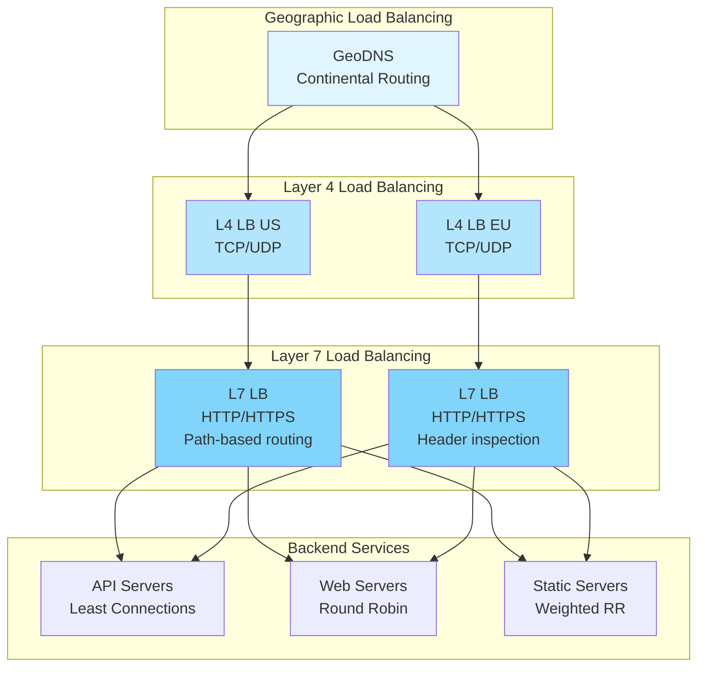
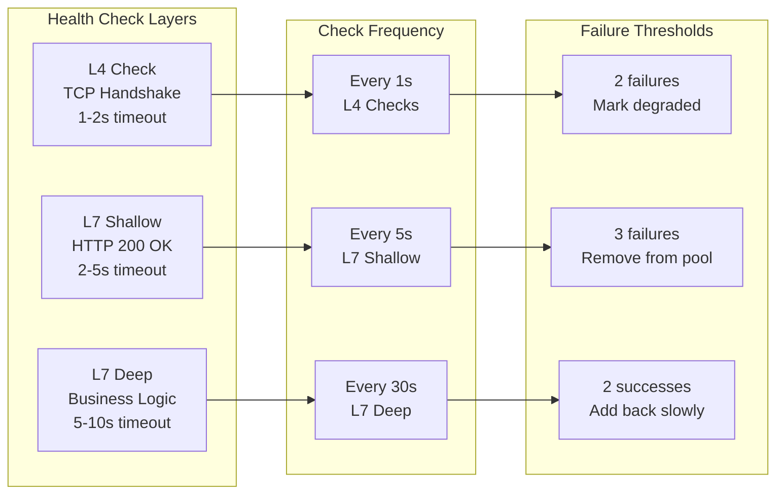
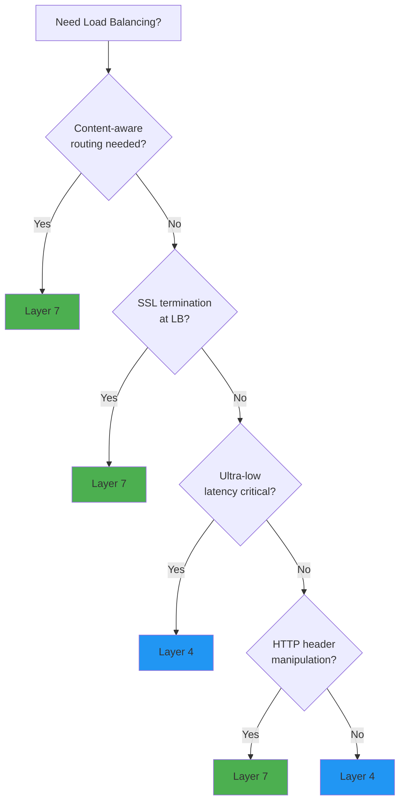
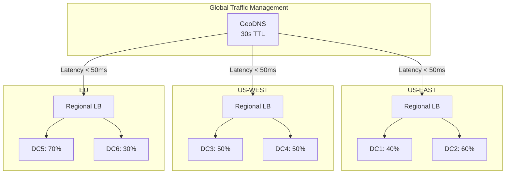

# Load Balancing Pattern

## 🎯 Essential Questions

!!! question "Critical Load Balancing Decisions"
    1. **Which algorithm?** Round-robin vs least-connections vs weighted vs geographic?
    2. **Layer 4 or Layer 7?** TCP/UDP routing vs HTTP-aware routing?
    3. **Health check depth?** TCP handshake vs application-level checks?
    4. **Session affinity needed?** Stateless vs sticky sessions?
    5. **Geographic distribution?** Single region vs multi-region routing?
    6. **SSL termination point?** At LB vs pass-through to backends?

!!! success "🏆 Gold Standard Pattern"
    **Foundation of Scalable Systems** • Battle-tested at Google, AWS, Cloudflare
    
    **Production Metrics:**
    - Google Maglev: 1M+ requests/sec per instance
    - AWS ELB: Trillions of requests daily
    - Cloudflare: 45M+ requests/sec globally
    - Typical latency overhead: 1-5ms

## When to Use / When NOT to Use

<div class="grid cards" markdown>

- :material-check-circle:{ .lg .middle } **USE When**
    
    ---
    
    - Multiple backend servers available
    - Need high availability (>99.9%)
    - Horizontal scaling required
    - Geographic distribution needed
    - Session management complexity
    - SSL termination centralization

- :material-close-circle:{ .lg .middle } **DON'T USE When**
    
    ---
    
    - Single server sufficient
    - Ultra-low latency required (<1ms)
    - Client-server affinity critical
    - Stateful protocols (non-HTTP)
    - Budget constraints (hardware LB)
    - Simple proof-of-concept

</div>

## Core Architecture



## Algorithm Decision Matrix

| Algorithm | Best For | Latency | CPU Cost | Session Support | Distribution Quality |
|-----------|----------|---------|----------|-----------------|---------------------|
| **Round Robin** | Equal capacity servers | Minimal | Very Low | No | Perfect with identical servers |
| **Least Connections** | Varying request times | Minimal | Low | No | Excellent for mixed workloads |
| **Weighted Round Robin** | Different server sizes | Minimal | Very Low | No | Good with proper weights |
| **Least Response Time** | Latency-critical apps | Optimal | Medium | No | Excellent for user experience |
| **IP Hash** | Session persistence | Minimal | Low | Yes | Can be uneven |
| **Consistent Hash** | Cache-friendly | Minimal | Medium | Yes | Good with virtual nodes |

## Health Check Strategy



<div class="decision-box">
<h4>🎯 Health Check Best Practices</h4>

**Critical Rules:**
1. **Never check external dependencies** - That's a cascade failure waiting
2. **Separate endpoint for health** - Don't use business endpoints
3. **Include version info** - Detect bad deployments
4. **Return degraded state** - Not just up/down
5. **Log but don't page** - For flapping services

**Example Response:**
```json
{
  "status": "healthy|degraded|unhealthy",
  "version": "v2.3.1",
  "uptime": 3600,
  "checks": {
    "database": "ok",
    "cache": "degraded",
    "disk": "ok"
  }
}
```
</div>

## Production Implementation Patterns

### Layer 4 vs Layer 7 Decision Tree



### Real-World Configurations

<div class="grid cards" markdown>

- :material-nginx:{ .lg .middle } **NGINX (Most Common)**
    
    ```nginx
    upstream backend {
        least_conn;
        server 10.0.1.1:8080 weight=3;
        server 10.0.1.2:8080 weight=2;
        server 10.0.1.3:8080 backup;
        keepalive 32;
    }
    
    server {
        location / {
            proxy_pass http://backend;
            proxy_next_upstream error timeout;
            proxy_connect_timeout 1s;
        }
    }
    ```

- :material-aws:{ .lg .middle } **AWS ALB (Cloud Native)**
    
    ```yaml
    TargetGroup:
      HealthCheck:
        Path: /health
        Interval: 5
        Timeout: 3
        HealthyThreshold: 2
        UnhealthyThreshold: 3
      Algorithm: least_outstanding_requests
      DeregistrationDelay: 30
      SlowStart: 60
    ```

</div>

## Session Management Strategies

| Strategy | Pros | Cons | Use Case |
|----------|------|------|----------|
| **Stateless** | Infinitely scalable | Requires external session store | Modern microservices |
| **Sticky Sessions** | Simple implementation | Uneven distribution, complex failover | Legacy applications |
| **Session Replication** | Good failover | High overhead, consistency issues | Small clusters |
| **Client-Side Sessions** | No server state | Security concerns, size limits | JWT tokens |

## Geographic Load Balancing Architecture



<div class="failure-vignette">
<h4>💥 GitHub's Load Balancer Cascade (2018)</h4>

**24-hour outage from LB misconfiguration during network partition**

**What Failed:**
- Health checks couldn't distinguish "server down" vs "network partition"
- LBs marked ALL database servers unhealthy
- Automatic failover created split-brain with multiple primaries
- LB kept switching between conflicting primaries

**Lessons:**
1. **Quorum-based health decisions** - Not simple majority
2. **Circuit breakers prevent cascades** - Limit failover rate
3. **Manual override essential** - Automation has limits
4. **Separate data plane decisions** - LBs shouldn't control DB failover

**Cost:** $36M in lost productivity (24 hours × $1.5M/hour)
</div>

## Production Readiness Checklist

### Essential Configuration

- [ ] **Health Checks**
  - [ ] Separate health endpoint implemented
  - [ ] Appropriate check intervals (3x faster than timeout)
  - [ ] Multi-level checks (L4 + L7)
  - [ ] Graceful degradation support

- [ ] **Traffic Management**
  - [ ] Connection draining configured (30-60s)
  - [ ] Request timeout settings
  - [ ] Retry policies defined
  - [ ] Circuit breaker integration

- [ ] **Monitoring**
  - [ ] Request rate by backend
  - [ ] Error rate by backend
  - [ ] Response time percentiles
  - [ ] Connection pool metrics

- [ ] **Security**
  - [ ] SSL/TLS termination configured
  - [ ] DDoS protection enabled
  - [ ] Rate limiting implemented
  - [ ] IP allowlisting if needed

### Performance Optimization

| Optimization | Impact | Implementation |
|--------------|---------|----------------|
| **Connection Pooling** | -50% latency | `keepalive 32` in NGINX |
| **SSL Session Reuse** | -30% CPU | Enable session cache |
| **HTTP/2** | -25% latency | Modern LBs support |
| **TCP Fast Open** | -15% latency | Kernel tuning required |

## Common Pitfalls & Solutions

<div class="grid cards" markdown>

- :material-alert:{ .lg .middle } **Thundering Herd**
    
    ---
    **Problem:** All connections retry simultaneously
    
    **Solution:** Exponential backoff with jitter
    ```python
    delay = min(cap, base * 2^attempt)
    jitter = random(0, delay * 0.1)
    ```

- :material-alert:{ .lg .middle } **Uneven Distribution**
    
    ---
    **Problem:** Some servers get more traffic
    
    **Solution:** Virtual nodes in consistent hashing
    ```python
    virtual_nodes = 150  # per server
    ```

- :material-alert:{ .lg .middle } **Slow Start Issues**
    
    ---
    **Problem:** New servers overwhelmed
    
    **Solution:** Gradual traffic increase
    ```nginx
    server 10.0.1.1:8080 slow_start=30s;
    ```

- :material-alert:{ .lg .middle } **Health Check Storms**
    
    ---
    **Problem:** Checks overwhelm servers
    
    **Solution:** Stagger check timing
    ```python
    check_interval = base + random(0, base * 0.2)
    ```

</div>

<div class="truth-box">
<h4>💡 Production Insights</h4>

**The 80/20 Rules:**
- 80% of outages: Health check misconfiguration
- 20% of servers: Handle 80% of traffic (monitor hot spots)
- 80% of gains: From fixing slowest 20% of servers

**Real-World Wisdom:**
- "Least connections" beats "round robin" for 90% of workloads
- Sticky sessions = 10x complexity cost
- Geographic LB saves 40-60% bandwidth costs
- Connection draining prevents 99% of deploy errors

**Three-Layer Production Stack:**
1. **DNS** (GeoDNS): Continental, 60s TTL
2. **L4** (Network LB): Datacenter, TCP/UDP
3. **L7** (App LB): Service-level, HTTP
</div>

## Modern Examples at Scale

| Company | Scale | Algorithm | Key Innovation |
|---------|-------|-----------|----------------|
| **Google Maglev** | 1M+ RPS/instance | Consistent hashing | Software-defined, no hardware |
| **AWS ELB** | Trillions/day | Least outstanding requests | Auto-scaling integration |
| **Cloudflare** | 45M+ RPS | Anycast + GeoDNS | Edge computing integration |
| **Netflix Zuul** | 50K+ RPS/instance | Weighted response time | Predictive routing |

## Related Patterns

<div class="grid cards" markdown>

- :material-link:{ .lg .middle } **Core Patterns**
    
    ---
    - [Auto-Scaling](../scaling/auto-scaling.md) - Dynamic capacity
    - [Health Check](../resilience/health-check.md) - Service monitoring
    - [Circuit Breaker](../resilience/circuit-breaker.md) - Failure protection

- :material-link:{ .lg .middle } **Advanced Patterns**
    
    ---
    - [Service Mesh](../architecture/service-mesh.md) - L7 evolution
    - [API Gateway](../architecture/api-gateway.md) - Entry point LB
    - [Geographic Distribution](../scaling/geographic-distribution.md) - Global LB

</div>

---

*"Perfect balance is not the goal—effective distribution is."*