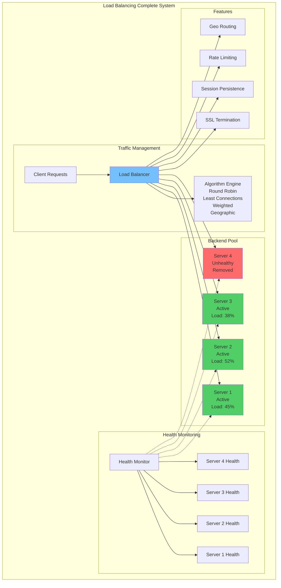
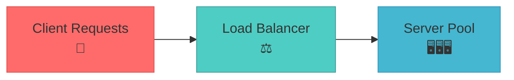
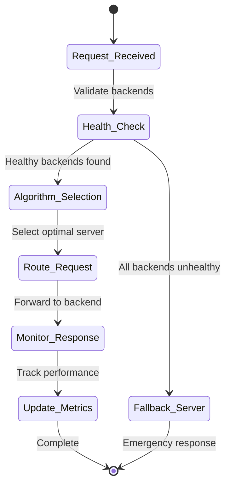
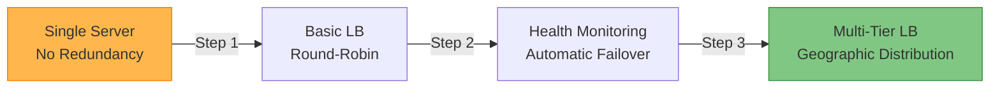

## Fundamental Law Connections

### Single Point of Failure (Law 1)
Load balancer creates both correlation reduction and new correlation risks:
- **LB as SPOF**: Single load balancer failure affects all traffic
- **Health Check Correlation**: Simultaneous health check failures
- **Connection Pool Exhaustion**: Shared connection limits create correlation
- **DNS Correlation**: DNS-based load balancing shares DNS failure risk
- **Mitigation**: Multiple LBs, anycast, DNS failover, active-passive pairs

### Routing Timing (Law 2)
Load balancing involves complex timing considerations:
- **Health Check Intervals**: 5-30 second delays in detecting failures
- **Connection Draining**: Graceful shutdown can take minutes
- **DNS Propagation**: DNS changes take minutes to hours
- **Sticky Sessions**: Session affinity creates temporal coupling
- **Algorithm Convergence**: Consistent hashing changes propagate slowly

### Algorithm Complexity (Law 3)
- **Algorithm Selection**: Round-robin vs weighted vs least connections
- **Debugging Difficulty**: Why did request go to that server?
- **Configuration Complexity**: Health checks, weights, pools
- **Mental Model**: Understanding traffic distribution patterns

### Backend Knowledge (Law 5)
- **Server Registry**: Maintains list of healthy backends
- **Capacity Awareness**: Tracks server load and capacity
- **Health Status**: Continuous monitoring of backend health
- **Configuration Sync**: Keeping LB config aligned with reality

### Multi-Criteria Routing (Law 6)
- **Latency vs Throughput**: Closest server vs least loaded
- **Availability vs Performance**: More backends vs quality
- **Cost vs Performance**: Cheaper regions vs faster
- **Consistency vs Distribution**: Sticky sessions vs even spread

## Case Studies with Law Applications

### Google Maglev
**Laws Demonstrated**:
- **Law 1**: ECMP (Equal Cost Multi-Path) eliminates LB as SPOF
- **Law 2**: Consistent hashing minimizes connection disruption
- **Law 5**: Distributed backend knowledge via gossip protocol

**Key Insights**:
- Software load balancing at network speed
- Connection table sharing prevents correlation
- 5-tuple hashing for consistent routing

### AWS Elastic Load Balancer
**Laws Demonstrated**:
- **Law 1**: Multi-AZ deployment prevents zone correlation
- **Law 6**: Application LB routes on multiple criteria
- **Law 7**: Pay-per-use model aligns with traffic

**Key Insights**:
- Automatic scaling based on traffic
- Cross-zone load balancing for even distribution
- Connection draining for zero-downtime deployments

### Cloudflare Anycast
**Laws Demonstrated**:
- **Law 1**: Anycast eliminates single point of failure
- **Law 2**: BGP convergence affects routing timing
- **Law 5**: Edge locations share backend knowledge

**Key Insights**:
- Global load balancing via BGP
- DDoS mitigation at edge
- Geographic routing for latency optimization

## The Complete Blueprint

Load balancing serves as the traffic orchestration layer that intelligently distributes incoming requests across multiple backend servers, transforming a collection of individual machines into a unified, scalable, and highly available service that can handle massive concurrent loads while providing seamless failover capabilities. This foundational pattern operates as the entry point for virtually all high-scale web applications, APIs, and distributed systems, making routing decisions based on sophisticated algorithms that consider server health, current load, geographic location, and response times to optimize both performance and resource utilization. Beyond simple round-robin distribution, modern load balancers act as intelligent proxy layers that terminate SSL connections, perform health checks, handle session persistence, implement rate limiting, and provide geographic traffic routing to minimize latency for global user bases. The pattern enables horizontal scaling by allowing systems to add or remove backend capacity dynamically, supports zero-downtime deployments through traffic shifting capabilities, and provides fault tolerance by automatically routing traffic away from failed or unhealthy servers. Whether implemented as hardware appliances, software solutions like NGINX or HAProxy, cloud services like AWS ELB, or service mesh sidecars like Istio, load balancing is essential for any system that needs to serve more traffic than a single server can handle or requires high availability guarantees.



### What You'll Master

!!! success "By understanding Load Balancing, you'll be able to:"
    - **Scale horizontally** - Add server capacity to handle increased traffic seamlessly
    - **Ensure high availability** - Automatically route traffic away from failed servers
    - **Optimize performance** - Distribute load based on server capacity and response times
    - **Enable zero-downtime deployments** - Update services without interrupting user traffic
    - **Implement geographic routing** - Route users to the closest data center for best performance
    - **Provide SSL termination** - Centrally manage certificates and encryption at scale

# Load Balancing Pattern

!!! success "🏆 Gold Standard Pattern"
    **Traffic distribution foundation for scalable systems** • Google, AWS, Cloudflare proven at scale
    
    Load balancing is essential for high availability and horizontal scaling. It distributes traffic across multiple servers, provides failover capabilities, and enables seamless capacity scaling.
    
    **Key Success Metrics:**
    - Google Maglev: 1M+ requests/sec per instance with consistent hashing
    - AWS ELB: Trillions of requests daily with automatic scaling
    - Cloudflare: 45M+ requests/sec globally with <50ms latency

## Essential Question

**How do we distribute incoming requests across multiple servers to achieve high availability and horizontal scalability?**

## When to Use / When NOT to Use

### ✅ Use When

| Scenario | Example | Impact |
|----------|---------|--------|
| Multiple backend servers | Web applications, APIs | High availability and horizontal scaling |
| Need failover capability | Critical business services | Zero-downtime deployments |
| Geographic distribution | Global user base | Reduced latency and improved performance |
| Traffic spikes expected | E-commerce, media sites | Automatic capacity utilization |

### ❌ DON'T Use When

| Scenario | Why | Alternative |
|----------|-----|-------------|
| Single server sufficient | Simple applications | Direct server access |
| Ultra-low latency required (<1ms) | High-frequency trading | Direct connections |
| Stateful protocols required | Legacy TCP applications | Connection-specific routing |
| Simple proof-of-concept | Development testing | Local development setup |

---

## Level 1: Intuition (5 min) {#intuition}

### The Story
Imagine a busy restaurant with multiple chefs. Without a maitre d' (load balancer), customers would randomly pick chefs, causing some to be overwhelmed while others stay idle. The maitre d' intelligently distributes orders based on each chef's current workload, ensuring faster service and happier customers. Load balancing works the same way for web traffic.

### Visual Metaphor
<details>
<summary>📄 View mermaid code (7 lines)</summary>



</details>

### Core Insight
> **Key Takeaway:** Load balancing transforms multiple servers into a single, more powerful and reliable system by intelligently distributing work.

### In One Sentence
Load balancing distributes incoming requests across multiple backend servers using algorithms that optimize for performance, availability, and resource utilization.

## Level 2: Foundation (10 min) {#foundation}

### The Problem Space

<div class="failure-vignette">
<h4>🚨 What Happens Without This Pattern</h4>

**E-commerce Company, 2019**: During Black Friday, all traffic went to a single server while backup servers sat idle. The main server crashed under load, causing 4-hour outage and $3M lost sales. Customers couldn't complete purchases, and reputation damage lasted months. Load balancing implementation the following year distributed traffic evenly and handled 10x more load.

**Impact**: 4-hour outage, $3M revenue loss, reputation damage
</div>

### How It Works

#### Architecture Overview
#### Key Components

| Component | Purpose | Responsibility |
|-----------|---------|----------------|
| Load Balancer | Request distribution | Route traffic using selected algorithm |
| Health Monitor | Backend health tracking | Monitor server availability and performance |
| Session Manager | State management | Handle sticky sessions or stateless routing |
| Backend Pool | Request processing | Process distributed requests |

### Basic Example

```python
# Production-ready Load Balancer Implementation
import time
import threading
from abc import ABC, abstractmethod
from collections import defaultdict
from enum import Enum
from typing import List, Optional, Dict
import random
import hashlib

class ServerStatus(Enum):
    HEALTHY = "healthy"
    UNHEALTHY = "unhealthy"
    DRAINING = "draining"

class Server:
    def __init__(self, host: str, port: int, weight: int = 1):
        self.host = host
        self.port = port
        self.weight = weight
        self.status = ServerStatus.HEALTHY
        self.active_connections = 0
        self.total_requests = 0
        self.response_time_ms = 0
        self.error_count = 0
        self._lock = threading.RLock()
    
    def handle_request(self):
        with self._lock:
            self.active_connections += 1
            self.total_requests += 1
    
    def complete_request(self, response_time_ms: float, success: bool):
        with self._lock:
            self.active_connections = max(0, self.active_connections - 1)
            self.response_time_ms = response_time_ms
            if not success:
                self.error_count += 1
    
    def health_check(self) -> bool:
        if self.error_count > 10:
            self.status = ServerStatus.UNHEALTHY
            return False
        self.status = ServerStatus.HEALTHY
        return True

class LoadBalancingAlgorithm(ABC):
    @abstractmethod
    def select_server(self, servers: List[Server], client_ip: str = None) -> Optional[Server]:
        pass

class LeastConnectionsAlgorithm(LoadBalancingAlgorithm):
    def select_server(self, servers: List[Server], client_ip: str = None) -> Optional[Server]:
        healthy_servers = [s for s in servers if s.status == ServerStatus.HEALTHY]
        if not healthy_servers:
            return None
        
        # Select server with lowest load score
        return min(healthy_servers, key=lambda s: s.active_connections / max(1, s.weight))

class LoadBalancer:
    def __init__(self, algorithm: LoadBalancingAlgorithm):
        self.servers: List[Server] = []
        self.algorithm = algorithm
        self.metrics = {'total_requests': 0, 'failed_requests': 0}
        self._lock = threading.RLock()
    
    def add_server(self, server: Server):
        with self._lock:
            if server not in self.servers:
                self.servers.append(server)
    
    def get_server(self, client_ip: str = None) -> Optional[Server]:
        server = self.algorithm.select_server(self.servers, client_ip)
        if server:
            server.handle_request()
            self.metrics['total_requests'] += 1
        return server

# Usage Example
lb = LoadBalancer(LeastConnectionsAlgorithm())
lb.add_server(Server("192.168.1.10", 8080, weight=3))
lb.add_server(Server("192.168.1.11", 8080, weight=2))

# Route request
selected_server = lb.get_server(client_ip="192.168.2.100")
```

<details>
<summary>📄 View implementation code</summary>

## Load balancing core concept
class LoadBalancer:
    def __init__(self):
        self.servers = []
        self.current = 0
    
    def add_server(self, server):
        if server.health_check():
            self.servers.append(server)
    
    def get_server(self):
        """Round-robin load balancing"""
        if not self.servers:
            return None
        
        server = self.servers[self.current]
        self.current = (self.current + 1) % len(self.servers)
        return server

</details>

## Level 3: Deep Dive (15 min) {#deep-dive}

### Implementation Details

#### State Management
<details>
<summary>📄 View mermaid code (10 lines)</summary>



</details>

#### Critical Design Decisions

| Decision | Options | Trade-off | Recommendation |
|----------|---------|-----------|----------------|
| **Layer Choice** | Layer 4 vs Layer 7 | L4: Fast but basic<br>L7: Feature-rich but slower | L7 for HTTP, L4 for performance |
| **Algorithm** | Round-robin vs Least-connections | Round-robin: Simple<br>Least-connections: Better distribution | Least-connections for variable workloads |
| **Session Handling** | Stateless vs Sticky | Stateless: Scalable<br>Sticky: Application compatibility | Stateless with external session store |

### Common Pitfalls

<div class="decision-box">
<h4>⚠️ Avoid These Mistakes</h4>

1. **Inadequate Health Checks**: Only checking TCP connectivity → Implement application-level health checks
2. **No Connection Draining**: Abrupt server removal during deployments → Configure graceful connection draining
3. **Single Point of Failure**: Using single load balancer → Deploy multiple load balancers with failover
</div>

### Production Considerations

#### Performance Characteristics

| Metric | Typical Range | Optimization Target | Production Examples |
|--------|---------------|---------------------|---------------------|
| **Latency Overhead** | 1-5ms | <2ms for L4, <5ms for L7 | HAProxy: 0.1-0.5ms, NGINX: 0.2-1ms |
| **Throughput** | 10K-1M+ req/s | Scale with backend capacity | Maglev: 1M+ req/s, Envoy: 100K+ req/s |
| **Health Check Frequency** | 1-30 seconds | Balance accuracy vs overhead | AWS ELB: 30s, Google Cloud: 10s |
| **Failover Time** | 5-60 seconds | <30 seconds for critical services | Kubernetes: 10-15s, Consul: 5-10s |
| **Memory Usage** | 10MB-1GB | <100MB for most workloads | HAProxy: ~50MB, NGINX: ~100MB |
| **CPU Utilization** | 5-20% | <10% under normal load | Modern LBs: 5-10% CPU at 80% capacity |

#### Algorithm Performance Comparison

| Algorithm | Latency (μs) | Memory (KB) | Distribution Quality | Best Use Case |
|-----------|--------------|-------------|---------------------|---------------|
| **Round Robin** | 0.1-0.5 | 1-5 | Good for equal servers | Web servers |
| **Weighted Round Robin** | 0.2-1.0 | 5-20 | Excellent for mixed capacity | App servers |
| **Least Connections** | 1-5 | 10-50 | Excellent for variable load | Database connections |
| **Consistent Hashing** | 5-20 | 50-500 | Good with cache affinity | CDN, caching layers |
| **IP Hash** | 0.5-2 | 5-10 | Perfect for session affinity | Stateful applications |

#### Quantified Production Results

**Google Maglev Metrics:**
- Throughput: 1M+ requests/sec per instance
- Latency: P50: 0.2ms, P99: 2.1ms overhead
- Memory: 2GB RAM handles 1M requests/sec
- CPU: 8 cores at 30% utilization for peak load
- Hash Consistency: 99.9% connections maintain server affinity during changes

**AWS Application Load Balancer:**
- Throughput: Scales to millions of requests/sec automatically
- Latency: P50: <1ms, P99: <5ms additional latency
- Availability: 99.99% SLA with multi-AZ deployment
- Failover: <30 seconds to detect and route around failures

**Cloudflare Global Load Balancer:**
- Scale: 45M+ requests/sec globally
- Latency: <50ms to nearest edge location
- Geographic Routing: Sub-10ms DNS resolution
- DDoS Protection: Handles 100+ Gbps attacks transparently

## Level 4: Expert (20 min) {#expert}

### Advanced Techniques

#### Optimization Strategies

1. **Consistent Hashing with Virtual Nodes**
   - When to apply: Cache-aware routing, session affinity needs
   - Impact: Minimal disruption during server changes
   - Trade-off: Complexity vs stable routing

2. **Geographic Load Balancing**
   - When to apply: Global applications with latency requirements
   - Impact: 40-60% latency reduction through proximity routing
   - Trade-off: Infrastructure complexity vs user experience

### Scaling Considerations

### Monitoring & Observability

#### Key Metrics to Track

| Metric | Alert Threshold | Dashboard Panel |
|--------|----------------|-----------------|
| Backend Health | >1 unhealthy server | Server status by pool |
| Request Rate | >80% capacity | Requests per second trends |
| Error Rate | >1% for any backend | Error rate by server |
| Response Time | >2x normal latency | P50/P95/P99 latency distribution |

## Level 5: Mastery (30 min) {#mastery}

### Real-World Case Studies

#### Case Study 1: Google's Maglev Load Balancer

<div class="truth-box">
<h4>💡 Production Insights from Google</h4>

**Challenge**: Handle millions of requests per second with consistent routing and zero downtime deployments

**Implementation**: 
- Software-defined load balancing with consistent hashing
- Virtual IP (VIP) abstraction for service discovery
- Distributed health checking across multiple datacenters
- Equal-cost multi-path (ECMP) routing for traffic distribution

**Results**: 
- Throughput: 1M+ requests/sec per Maglev instance
- Availability: 99.99% uptime with seamless failover
- Deployment: Zero-downtime rolling updates
- Cost: 50% reduction compared to hardware load balancers

**Lessons Learned**: Software-defined load balancing scales better than hardware; consistent hashing maintains cache efficiency during server changes
</div>

### Pattern Evolution

#### Migration from Single Server

<details>
<summary>📄 View mermaid code (7 lines)</summary>



</details>

#### Future Directions

| Trend | Impact on Pattern | Adaptation Strategy |
|-------|------------------|-------------------|
| **Serverless Computing** | Function-level load balancing | Event-driven routing mechanisms |
| **Service Mesh** | Sidecar proxy load balancing | Distributed load balancing logic |
| **Edge Computing** | Micro-load balancers at edge | Hierarchical load balancing architecture |

### Pattern Combinations

#### Works Well With

| Pattern | Combination Benefit | Integration Point |
|---------|-------------------|------------------|
| [Auto-scaling](../scaling/auto-scaling.md) | Dynamic capacity management | LB triggers scaling events |
| [Circuit Breaker](../resilience/circuit-breaker.md) | Cascade failure prevention | Circuit state affects routing |
| [Health Check](../resilience/health-check.md) | Service monitoring | Health status drives routing decisions |

## Quick Reference

### Decision Matrix

### Comparison with Alternatives

| Aspect | Load Balancing | DNS Round Robin | Client-Side LB |
|--------|-------------|-----------------|----------------|
| Failover Speed | Fast (<30s) | Slow (TTL dependent) | Immediate |
| Health Monitoring | Built-in | None | Client-dependent |
| Session Persistence | Configurable | None | Full control |
| Operational Complexity | Medium | Low | High |
| When to use | Production systems | Simple setups | Microservices |

### Implementation Checklist

**Pre-Implementation**
- [ ] Analyzed traffic patterns and capacity requirements
- [ ] Selected appropriate load balancing layer (L4 vs L7)
- [ ] Designed health check strategy for backend monitoring
- [ ] Planned session management approach (stateless vs sticky)

**Implementation**
- [ ] Deployed load balancer infrastructure with redundancy
- [ ] Configured routing algorithms based on workload characteristics
- [ ] Set up comprehensive health checks for all backends
- [ ] Implemented SSL termination and certificate management

**Post-Implementation**
- [ ] Load tested with realistic traffic patterns and failover scenarios
- [ ] Configured monitoring and alerting for all critical metrics
- [ ] Documented runbooks for common operational procedures
- [ ] Implemented automated deployment procedures with connection draining

## Related Laws

This pattern directly addresses several fundamental laws:

- **[Law 1: Correlated Failure](../../core-principles/laws/correlated-failure.md)**: Load balancing prevents single server failures from bringing down entire systems by distributing traffic across multiple backends
- **[Law 2: Asynchronous Reality](../../core-principles/laws/asynchronous-reality.md)**: Handles the reality that requests arrive at unpredictable times by managing request distribution and backend response coordination
- **[Law 4: Multidimensional Optimization](../../core-principles/laws/multidimensional-optimization.md)**: Embodies the trade-offs between latency, throughput, availability, and cost in traffic distribution decisions
- **[Law 6: Cognitive Load](../../core-principles/laws/cognitive-load.md)**: Simplifies system architecture by providing a single entry point that hides backend complexity from clients

## Related Patterns

### Complementary Patterns (Work Well Together)

| Pattern | Relationship | Integration Strategy | When to Combine |
|---------|--------------|---------------------|------------------|
| **[Health Check](../resilience/health-check.md)** | **Backend monitoring** - Essential for intelligent routing decisions | Implement multi-layer health checks: L4 (TCP connectivity) + L7 (application health). Remove unhealthy backends from rotation | Always - Load balancing without health checks leads to traffic routing to failed servers |
| **[Circuit Breaker](../resilience/circuit-breaker.md)** | **Failure protection** - Prevents load balancer from routing to failing services | Integrate circuit breaker state with load balancer. Remove services with open circuits from active backend pool | Always - Prevents routing traffic to known-failing backends |
| **[Auto-scaling](../scaling/auto-scaling.md)** | **Dynamic capacity management** - Adds/removes backends based on load | Load balancer metrics (request rate, response time) trigger auto-scaling events. New instances automatically added to backend pool | Variable load patterns where static capacity is insufficient |
| **[Service Discovery](../communication/service-discovery.md)** | **Dynamic backend management** - Automatically discovers and registers available backends | Load balancer subscribes to service registry for backend changes. Automatic registration/deregistration of service instances | Dynamic environments with frequent instance changes (Kubernetes, cloud auto-scaling) |

### Prerequisite Patterns (Required for Load Balancing)

| Pattern | Relationship | Implementation | Why It's Required |
|---------|--------------|----------------|------------------|
| **[Timeout](../resilience/timeout.md)** | **Request boundaries** - Load balancer needs timeout policies | Configure timeouts for backend connections, health checks, and request processing. Use cascading timeouts across layers | Prevents load balancer from waiting indefinitely for unresponsive backends |
| **[Retry Logic](../resilience/retry-backoff.md)** | **Transient failure handling** - Load balancer should retry on different backends | Implement intelligent retry: try different backend instances, avoid thundering herd with jitter | Improves success rates by trying alternate backends on transient failures |

### Extension Patterns (Build Upon Load Balancing)

| Pattern | Relationship | Implementation | When to Extend |
|---------|--------------|----------------|----------------|
| **[Rate Limiting](../scaling/rate-limiting.md)** | **Traffic management** - Controls flow through load balancer | Implement rate limiting at load balancer level: per-client, per-endpoint, global limits. Use different policies for different backends | High-traffic APIs requiring traffic shaping and DDoS protection |
| **[Geographic Distribution](../scaling/geo-distribution.md)** | **Global load balancing** - Routes traffic based on client location | Deploy load balancers in multiple regions. Use DNS-based routing or anycast for geographic traffic distribution | Global applications requiring low latency for distributed user base |
| **[SSL Termination](../security/ssl-termination.md)** | **Security layer** - Centralized certificate management and encryption | Load balancer handles SSL/TLS termination, certificate management, and re-encryption to backends if needed | HTTPS services requiring certificate management and encryption overhead reduction |

### Alternative Patterns (Different Traffic Distribution Approaches)

| Pattern | Relationship | Trade-offs | When to Choose Load Balancing |
|---------|--------------|------------|------------------------------|
| **[DNS Round Robin](../communication/dns-round-robin.md)** | **Simple traffic distribution** - DNS-level load distribution vs application-level | DNS: Simple, no SPOF vs Load Balancer: Health checks, session affinity, SSL termination | When you need health monitoring, SSL termination, or complex routing logic |
| **[Client-side Load Balancing](../communication/client-side-lb.md)** | **Distributed routing** - Clients choose backends vs centralized load balancer | Client-side: No SPOF, better performance vs Load Balancer: Centralized control, simpler clients | When centralized policy management and SSL termination are priorities |
| **[Service Mesh](../communication/service-mesh.md)** | **Sidecar-based routing** - Per-service load balancing vs centralized | Service Mesh: Per-service policies, zero-trust vs Load Balancer: Simpler deployment, centralized management | When you need centralized traffic entry point and simpler architecture |

### Advanced Pattern Combinations

#### Multi-Tier Load Balancing with Auto-scaling
```yaml
load_balancing_tiers:
  global_tier:
    type: dns_geographic
    providers: [cloudflare, route53]
    health_check_interval: 30s
    
  regional_tier:
    type: application_load_balancer
    algorithm: least_connections
    health_check: "/health"
    auto_scaling:
      target_utilization: 70
      scale_up_threshold: 80
      scale_down_threshold: 30
      
  service_tier:
    type: service_mesh
    algorithm: weighted_round_robin
    circuit_breaker:
      failure_threshold: 5
      timeout: 30s
```

#### Smart Load Balancing with Circuit Breakers
```python
class CircuitAwareLoadBalancer:
    def __init__(self):
        self.backends = {}
        self.circuit_breakers = {}
        self.health_checker = HealthChecker()
        
    def select_backend(self, request):
        available_backends = []
        
        for backend_id, backend in self.backends.items():
            # Check circuit breaker state
            circuit = self.circuit_breakers.get(backend_id)
            if circuit and circuit.is_open():
                continue
                
            # Check health status
            if not self.health_checker.is_healthy(backend_id):
                continue
                
            available_backends.append(backend)
        
        if not available_backends:
            raise NoHealthyBackendsException()
            
        # Use least connections algorithm
        return min(available_backends, key=lambda b: b.active_connections)
    
    def handle_backend_failure(self, backend_id, error):
        circuit = self.circuit_breakers.get(backend_id)
        if circuit:
            circuit.record_failure()
            
        # Remove from rotation if circuit opens
        if circuit and circuit.is_open():
            self.remove_backend_from_rotation(backend_id)
```

#### Load Balancing with Rate Limiting and Priority
```python
class PriorityAwareLoadBalancer:
    def __init__(self):
        self.backend_pools = {
            'premium': PremiumBackendPool(capacity=100),
            'standard': StandardBackendPool(capacity=200),
            'basic': BasicBackendPool(capacity=300)
        }
        self.rate_limiters = {
            'premium': RateLimiter(rate=1000),  # Higher rate for premium
            'standard': RateLimiter(rate=500),
            'basic': RateLimiter(rate=200)
        }
    
    def route_request(self, request):
        client_tier = self.get_client_tier(request)
        
        # Try rate limiting for client's tier
        if not self.rate_limiters[client_tier].allow_request():
            # Fallback to lower tier if available
            for tier in ['basic', 'standard', 'premium']:
                if tier != client_tier and self.rate_limiters[tier].allow_request():
                    return self.backend_pools[tier].get_backend()
            raise RateLimitedException()
        
        # Route to appropriate backend pool
        pool = self.backend_pools[client_tier]
        return pool.get_backend()
```

### Implementation Priority Guide

**Phase 1: Basic Load Balancing (Week 1)**
1. **Health Check Integration** - Implement L4 and L7 health checks
2. **Algorithm Selection** - Start with least connections for most workloads
3. **Basic Monitoring** - Track request distribution and response times

**Phase 2: Resilience Features (Week 2)**
1. **Circuit Breaker Integration** - Remove failing backends from rotation
2. **Timeout Configuration** - Set appropriate connection and request timeouts
3. **Retry Logic** - Implement intelligent retry on different backends

**Phase 3: Advanced Features (Week 3+)**
1. **Auto-scaling Integration** - Dynamic backend pool management
2. **SSL Termination** - Centralized certificate management
3. **Rate Limiting** - Traffic shaping and DDoS protection
4. **Geographic Distribution** - Multi-region load balancing

!!! experiment "💡 Quick Thought Experiment: Dependency Elimination Strategy"
    **Apply the 5-step framework to eliminate load balancer single point of failure:**
    
    1. **INVENTORY**: Map all components depending on single load balancer (DNS, health checks, SSL termination, routing rules)
    2. **PRIORITIZE**: Rank by traffic volume × failure impact (main application LB = highest priority, admin LB = lower)
    3. **ISOLATE**: Deploy multiple load balancer instances, DNS-based failover, geo-distributed endpoints
    4. **MIGRATE**: Implement client-side load balancing, service mesh, anycast routing
    5. **MONITOR**: Track LB instance health, traffic distribution, failover times, DNS propagation
    
    **Success Metric**: Achieve load balancer redundancy - when primary LB fails, traffic routes through secondaries with <5s detection + <30s DNS TTL

### Related Resources

<div class="grid cards" markdown>

- :material-flask:{ .lg .middle } **Fundamental Laws**
    
    ---
    
    - [Law 1: Correlated Failure](../../core-principles/laws/correlated-failure.md) - Preventing single points of failure
    - [Law 2: Asynchronous Reality](../../core-principles/laws/asynchronous-reality.md) - Distributed request handling

- :material-pillar:{ .lg .middle } **Foundational Pillars**
    
    ---
    
    - [Work Distribution](../../core-principles/pillars/work-distribution.md) - Distributing requests across servers
    - [Control Distribution](../../core-principles/pillars/control-distribution.md) - Distributed routing decisions

</div>

