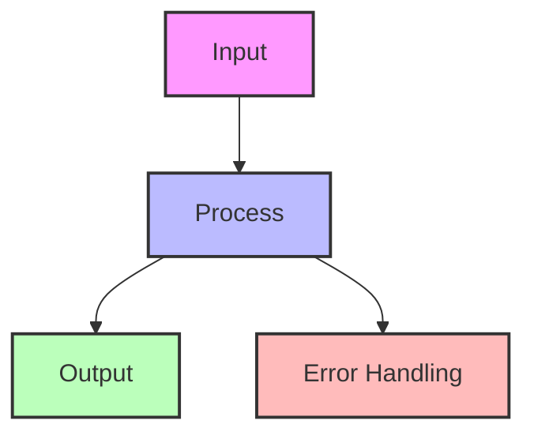
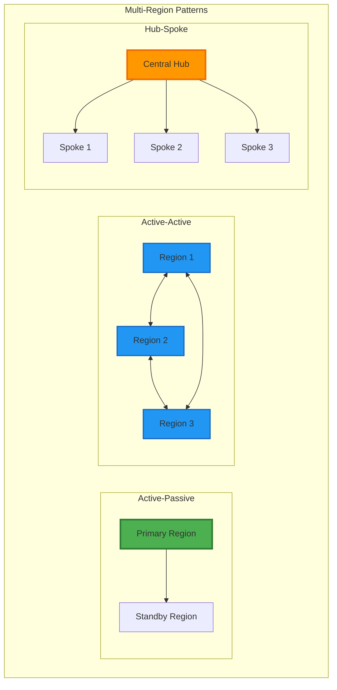
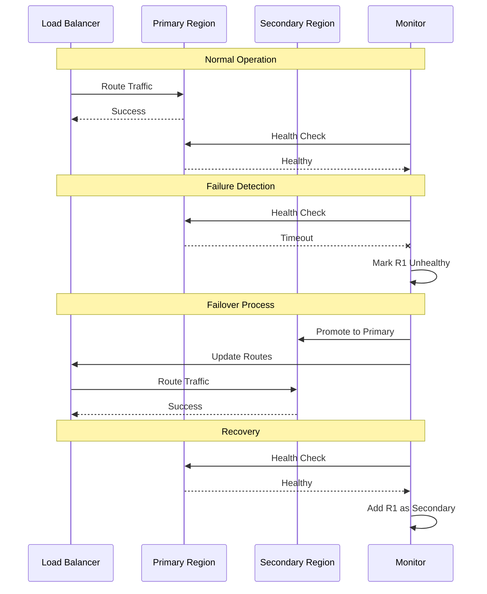
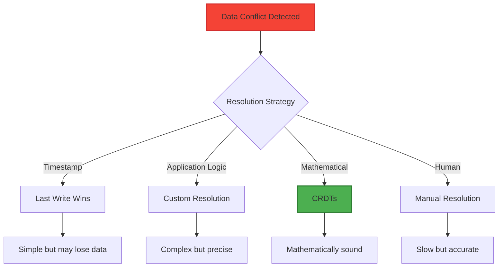
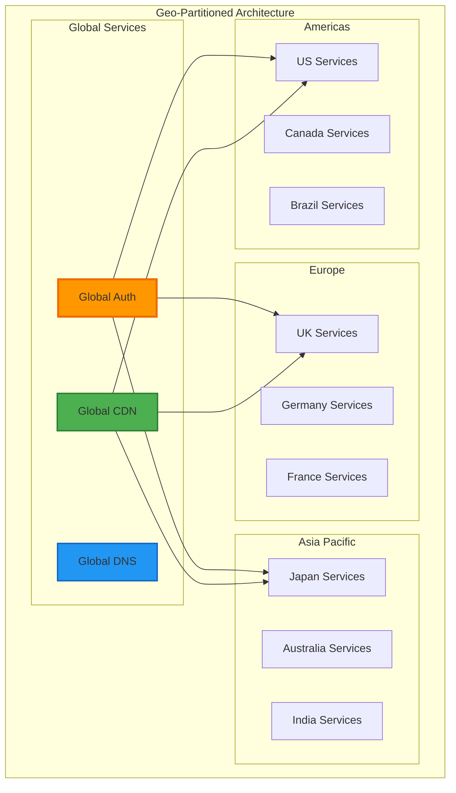
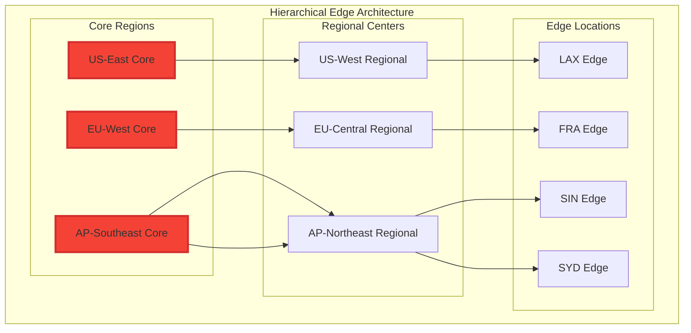

---
best-for:
- Global applications with geographically distributed users
- Systems requiring disaster recovery across regions
- Applications with regulatory data residency requirements
- High-traffic services needing load distribution
category: scaling
current_relevance: mainstream
description: Deployment pattern that spans multiple geographic regions for disaster
  recovery and latency optimization
essential_question: How do we handle increasing load without sacrificing performance
  using multi-region architecture?
excellence_tier: silver
introduced: 2024-01
pattern_status: recommended
tagline: Master multi-region architecture for distributed systems success
title: Multi-Region Architecture
trade-offs:
  cons:
  - Complex data consistency challenges
  - High operational overhead
  - Increased infrastructure costs
  - Cross-region latency for coordination
  pros:
  - Global latency optimization
  - Disaster recovery capability
  - Regulatory compliance support
  - Load distribution across regions
---

## Essential Question
## When to Use / When NOT to Use

### When to Use

| Scenario | Why It Fits | Alternative If Not |
|----------|-------------|-------------------|
| High availability required | Pattern provides resilience | Consider simpler approach |
| Scalability is critical | Handles load distribution | Monolithic might suffice |
| Distributed coordination needed | Manages complexity | Centralized coordination |

### When NOT to Use

| Scenario | Why to Avoid | Better Alternative |
|----------|--------------|-------------------|
| Simple applications | Unnecessary complexity | Direct implementation |
| Low traffic systems | Overhead not justified | Basic architecture |
| Limited resources | High operational cost | Simpler patterns |
**How do we handle increasing load without sacrificing performance using multi-region architecture?**

# Multi-Region Architecture

!!! success "🥈 Silver Tier Pattern"
    **Powerful but Complex** • Requires careful coordination
    
    Multi-region architecture excels at global scale and disaster recovery, but introduces significant complexity in data consistency, cross-region coordination, and operational overhead. Consider simpler alternatives like CDNs for content and single-region with backups for most applications.

## The Essential Question

**How can we deploy applications across multiple geographic regions to achieve global scale, low latency, high availability, and regulatory compliance?**

---

## Level 1: Intuition (5 minutes)

### The Story

McDonald's doesn't run all restaurants from one kitchen. Each location prepares food locally while following global standards. Some items (fries) are made everywhere, others (McRice in Asia) are regional.

Multi-region architecture works similarly: deploy your application in multiple geographic locations, each serving local users while maintaining global consistency where needed.

### Visual Metaphor

```
Single Region:               Multi-Region:

 Users Users                 ↓ ↓ ↓
 ↙ ↓ ↘                      ┌─US─┐ ┌─EU─┐ ┌─ASIA┐
┌─────────────┐              │ App │ │ App │ │ App │
│ Region      │              │ DB  │ │ DB  │ │ DB  │
│ App         │              └─────┘ └─────┘ └─────┘
│ DB          │                 ↕     ↕     ↕
└─────────────┘              Replication/Sync

All users → One location     Users → Nearest region
High latency for distant     Low latency globally
Total failure possible       Region failures survivable
```

### In One Sentence

**Multi-Region Architecture**: Deploying applications across multiple geographic regions to minimize latency, maximize availability, and meet compliance requirements.

### Real-World Parallel

Like a global retail chain - stores in every region stock local preferences while maintaining brand consistency and sharing inventory data.

---

## Level 2: Foundation (10 minutes)

### The Problem Space

!!! danger "🔥 Without Multi-Region: Gaming Platform Disaster"
    Online game hosted in US-East only:
    - Asian players: 300ms+ latency, unplayable
    - AWS us-east-1 outage: 8 hours global downtime
    - Lost 2M daily active users
    - $10M revenue impact
    - Competitors gained permanent market share

### Core Architecture Patterns



<details>
<summary>View implementation code</summary>



</details>

### Pattern Comparison

| Pattern | Description | Use Case | Complexity |
|---------|-------------|----------|------------|
| **Active-Passive** | Primary region + standby | DR focus | Low |
| **Active-Active** | All regions serve traffic | Performance | High |
| **Pilot Light** | Minimal standby infrastructure | Cost-sensitive | Medium |
| **Read Replicas** | Read in all, write in one | Read-heavy | Medium |
| **Follow-the-Sun** | Active region follows daylight | Batch processing | Medium |

### Key Design Decisions

1. **Consistency Model**: Strong, eventual, or tunable?
2. **Conflict Resolution**: Last-write-wins, CRDTs, or custom?
3. **Data Sovereignty**: Where can data live?
4. **Failover Strategy**: Automatic or manual?
5. **Cost Optimization**: Full replicas or selective sync?

### Trade-offs

| Aspect | Benefit | Cost |
|--------|---------|------|
| Performance | Low global latency | Complex deployment |
| Availability | Survive region failures | Higher infrastructure cost |
| Compliance | Meet local regulations | Data segregation complexity |
| Scalability | Regional load isolation | Operational overhead |

---

## Level 3: Deep Dive (20 minutes)

### Regional Failover Strategy


<details>
<summary>View implementation code</summary>



</details>

### Data Consistency Models

| Consistency Level | Latency | Availability | Use Case | CAP Trade-off |
|------------------|---------|--------------|----------|---------------|
| **Strong** | High | Lower | Financial transactions | Consistency + Partition tolerance |
| **Eventual** | Low | Higher | Social media feeds | Availability + Partition tolerance |
| **Session** | Medium | Medium | User profile updates | Balanced approach |
| **Causal** | Medium | Medium | Collaborative editing | Maintains causality |
| **Monotonic Read** | Low | High | Cache invalidation | Read consistency |

### Conflict Resolution Strategies



### Implementation Concepts

```python
# Multi-region deployment patterns
from enum import Enum

class ConsistencyLevel(Enum):
    STRONG = "strong"      # All regions must agree - High latency
    EVENTUAL = "eventual"  # Async replication - Low latency
    QUORUM = "quorum"     # Majority consensus - Balanced

class RegionType(Enum):
    PRIMARY = "primary"    # Main serving region
    SECONDARY = "secondary" # Backup/read replica
    EDGE = "edge"         # CDN/cache layer

# Example: Three-region deployment
regions_config = {
    "us-east-1": {"type": "primary", "consistency": "strong"},
    "eu-west-1": {"type": "secondary", "consistency": "eventual"}, 
    "ap-southeast-1": {"type": "secondary", "consistency": "eventual"}
}
```

---

## Level 4: Expert Practitioner (30 minutes)

### Advanced Multi-Region Patterns

#### Geo-Partitioned Services


<details>
<summary>View implementation code</summary>



</details>

#### Edge Computing Integration


<details>
<summary>View implementation code</summary>



</details>

### Performance Optimization

!!! note "🎯 Multi-Region Performance Tips"
    - **Smart Caching**: Cache at edge, invalidate globally
    - **Read Replicas**: Place read replicas near users
    - **Async Replication**: Don't block on cross-region sync
    - **Regional Sharding**: Shard data by user geography
    - **Connection Pooling**: Reuse cross-region connections
    - **Compression**: Compress cross-region transfers
    - **Batching**: Batch updates to reduce round trips
    - **CDN Integration**: Use CDN for static content

### Common Pitfalls

!!! danger "⚠️ Pitfall: Ignoring CAP Theorem"
    Tried to maintain strong consistency across regions during network partition.
    **Result**: Complete system halt when regions couldn't communicate.
    **Solution**: Design for partition tolerance, choose appropriate consistency level.

!!! danger "⚠️ Pitfall: Underestimating Costs"
    Replicated everything everywhere without considering transfer costs.
    **Result**: $100K+ monthly bill for cross-region transfers.
    **Solution**: Selective replication, regional data tiers, transfer optimization.

---

## Level 5: Mastery (45 minutes)

### Case Study: Spotify's Global Architecture

!!! info "🏢 Real-World Implementation"
    **Company**: Spotify
    **Scale**: 500M+ users, 180+ countries, 4B+ streams/day
    **Challenge**: Stream music with <200ms startup time globally while maintaining catalog consistency.
    **Architecture**:
    ```mermaid
graph TD
    A[Input] --> B[Process]
    B --> C[Output]
    B --> D[Error Handling]
    
    style A fill:#f9f,stroke:#333,stroke-width:2px
    style B fill:#bbf,stroke:#333,stroke-width:2px
    style C fill:#bfb,stroke:#333,stroke-width:2px
    style D fill:#fbb,stroke:#333,stroke-width:2px
```

<details>
<summary>View implementation code</summary>

```mermaid
    graph TB
        subgraph "User Layer"
            US[US Users]
            EU[EU Users]
            AS[Asia Users]
        end
        subgraph "Edge PoPs"
            CDN1[CDN US]
            CDN2[CDN EU]
            CDN3[CDN Asia]
        end
        subgraph "Regional Clusters"
            R1[US Cluster<br/>- API<br/>- Metadata<br/>- ML]
            R2[EU Cluster<br/>- API<br/>- Metadata<br/>- ML]
            R3[Asia Cluster<br/>- API<br/>- Metadata<br/>- ML]
        end
        subgraph "Global Services"
            CAT[Catalog Master]
            USER[User Profile Master]
            ML[ML Training]
        end
        US --> CDN1 --> R1
        EU --> CDN2 --> R2
        AS --> CDN3 --> R3
        R1 <--> CAT
        R2 <--> CAT
        R3 <--> CAT
        R1 <--> USER
        R2 <--> USER
        R3 <--> USER
        style CAT fill:#4caf50,stroke:#2e7d32,stroke-width:3px
    ```

</details>
    **Key Decisions**:
    1. **Audio cached at edge**: 90% hit rate reduces latency
    2. **Metadata replicated regionally**: Fast browsing
    3. **User data geo-sharded**: Compliance + performance
    4. **ML models deployed regionally**: Personalized recommendations
    5. **Async catalog updates**: Eventually consistent
    **Results**:
    - 150ms average start time globally
    - 99.95% availability
    - 60% reduction in infrastructure costs
    - Seamless regional failovers
    **Lessons**:
    1. Cache aggressively at edge
    2. Shard by user geography when possible
    3. Async replication for non-critical data
    4. Regional ML inference beats centralized

### Economic Analysis

#### Cost Model

When multi-region pays off:
- **Break-even**: 3x peak ratio or 1% failure rate
- **High ROI**: Variable traffic, microservices, event-driven, pipelines
- **Low ROI**: Constant low traffic, simple request-response, latency-sensitive gaming

#### ROI Calculation Framework

| Factor | Single Region Cost | Multi-Region Benefit | Impact |
|--------|-------------------|---------------------|--------|
| **Peak Capacity** | $100K/month for 10x peaks | 60% reduction with buffering | $60K savings |
| **Downtime Prevention** | $1M/hour outage cost | 95% reduction in total outages | $950K/hour savings |
| **Latency Improvement** | 15% user drop at 500ms | <100ms globally | 15% user retention |
| **Compliance** | $10M fine risk | Regional data residency | Risk eliminated |

### Future Directions

**Emerging Trends**:

1. **Edge Queuing**: Message routing at edge locations
2. **ML-Driven Routing**: Smart message routing based on content
3. **Quantum-Safe Regions**: Post-quantum encryption for cross-region
4. **Cross-Cloud Multi-Region**: Seamless multi-cloud deployments

---

## Quick Reference

### Decision Matrix

```mermaid
graph TD
    Start[Global application?] --> Q1{Users in<br/>multiple regions?}
    Q1 -->|No| Single[Single region<br/>deployment]
    Q1 -->|Yes| Q2{Latency<br/>sensitive?}
    
    Q2 -->|No| Q3{Need<br/>DR?}
    Q2 -->|Yes| Q4{Data<br/>regulations?}
    
    Q3 -->|No| Single
    Q3 -->|Yes| ActivePassive[Active-Passive<br/>multi-region]
    
    Q4 -->|No| Q5{Write<br/>heavy?}
    Q4 -->|Yes| GeoPartitioned[Geo-partitioned<br/>architecture]
    
    Q5 -->|No| ReadReplicas[Multi-region<br/>read replicas]
    Q5 -->|Yes| Q6{Conflict<br/>tolerance?}
    
    Q6 -->|Low| SingleMaster[Single master<br/>multi-region]
    Q6 -->|High| MultiMaster[Multi-master<br/>with CRDTs]
```

### Configuration Template


<details>
<summary>View implementation code</summary>

```yaml
# Multi-Region Configuration
multi_region:
  regions:
    - name: us-east-1
      primary: true
      endpoint: app-us.example.com
      services: [api, database, cache]
    
    - name: eu-west-1
      primary: false
      endpoint: app-eu.example.com
      services: [api, database-replica, cache]
    
    - name: ap-southeast-1
      primary: false
      endpoint: app-asia.example.com
      services: [api, database-replica, cache]
  
  replication:
    strategy: async # async, sync, semi-sync
    consistency: eventual # strong, eventual, bounded
    conflict_resolution: last_write_wins
    lag_threshold: 5s
  
  routing:
    strategy: latency # latency, geolocation, weighted
    health_check_interval: 30s
    failover_threshold: 3
  
  data_governance:
    gdpr_regions: [eu-west-1]
    data_residency:
      - type: user_pii
        allowed_regions: [eu-west-1]
      - type: financial
        allowed_regions: [us-east-1]
  
  cost_controls:
    max_cross_region_transfer_gb: 10000
    auto_scale_regions: true
    idle_region_shutdown: true
  
  monitoring:
    cross_region_latency: true
    replication_lag: true
    regional_availability: true
    cost_tracking: true
```

</details>

### Latency Expectations

| Distance | Theoretical Min | Typical | Degraded |
|----------|----------------|---------|----------|
| Same Region | 1ms | 5-10ms | 50ms |
| Same Continent | 20ms | 30-50ms | 200ms |
| Cross-Atlantic | 60ms | 80-100ms | 300ms |
| Cross-Pacific | 90ms | 120-150ms | 500ms |
| Opposite Side | 133ms | 200-250ms | 1000ms |

---

## Related Resources

### Patterns
- [Geo-Replication](geo-replication.md) - Data replication strategies
- [Edge Computing](../architecture/edge-computing.md) - Processing at network edge
- [Tunable Consistency](../data-management/tunable-consistency.md) - Consistency models
- [CQRS](../data-management/cqrs.md) - Separate read/write paths

### Laws
- [Law 2 (Asynchronous Reality)](../../part1-axioms/law2-asynchrony/index.md) - Speed of light constraints
- [Law 7 (Economic Reality)](../../part1-axioms/law7-economics/index.md) - Cost implications
- [Law 1 (Correlated Failure)](../../part1-axioms/law1-failure/index.md) - Regional failure modes
- [Law 4 (Multidimensional Optimization)](../../part1-axioms/law4-tradeoffs/index.md) - Regional capacity planning

### Tools & Technologies
- **Cloud Providers**: AWS Global Infrastructure, Azure Regions, GCP Regions
- **CDN**: CloudFlare, Akamai, Fastly
- **DNS**: Route53, Azure Traffic Manager, Cloud DNS
- **Databases**: CockroachDB, YugabyteDB, Amazon Aurora Global
- **Orchestration**: Kubernetes Federation, Consul, Nomad

---

<div class="prev-link">
<a href="/patterns/geo-replication">← Previous: Geo-Replication</a>
<a href="/patterns/edge-computing">Next: Edge Computing →</a>
</div>