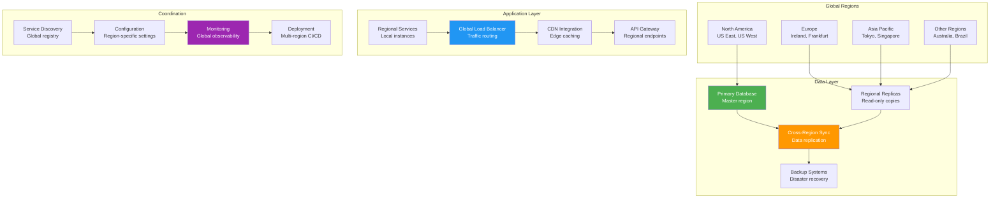

## The Complete Blueprint

Multi-Region Architecture patterns deploy applications and data across multiple geographic regions to achieve global scale, minimize latency for distributed users, provide disaster recovery capabilities, and meet regulatory compliance requirements. This pattern addresses the challenges of serving users worldwide while maintaining consistency, handling cross-region coordination, and managing the complexity of distributed infrastructure. The architecture involves strategic placement of application components, intelligent data replication strategies, traffic routing mechanisms, and sophisticated failure handling across regions while considering factors like network latency, data sovereignty laws, and cost optimization.

### What You'll Master

- **Multi-region deployment strategies** including active-active, active-passive, and hybrid approaches for global application distribution
- **Cross-region data synchronization** implementing replication strategies, conflict resolution, and consistency models across geographic boundaries  
- **Global traffic management** using DNS-based routing, load balancing, and failover mechanisms for optimal user experience
- **Disaster recovery planning** designing backup systems, data recovery procedures, and business continuity across regions
- **Compliance and data residency** handling regulatory requirements, data sovereignty laws, and region-specific compliance needs
- **Operational complexity management** monitoring global infrastructure, coordinating deployments, and managing cross-region dependencies

## Essential Question
## When to Use / When NOT to Use

### When to Use

| Scenario | Why It Fits | Alternative If Not |
|----------|-------------|-------------------|
| High availability required | Pattern provides resilience | Consider simpler approach |
| Scalability is critical | Handles load distribution | Monolithic might suffice |
| Distributed coordination needed | Manages complexity | Centralized coordination |

### When NOT to Use

| Scenario | Why to Avoid | Better Alternative |
|----------|--------------|-------------------|
| Simple applications | Unnecessary complexity | Direct implementation |
| Low traffic systems | Overhead not justified | Basic architecture |
| Limited resources | High operational cost | Simpler patterns |
**How do we handle increasing load without sacrificing performance using multi-region architecture?**

# Multi-Region Architecture

!!! success "🥈 Silver Tier Pattern"
    **Powerful but Complex** • Requires careful coordination
    
    Multi-region architecture excels at global scale and disaster recovery, but introduces significant complexity in data consistency, cross-region coordination, and operational overhead. Consider simpler alternatives like CDNs for content and single-region with backups for most applications.

## The Essential Question

**How can we deploy applications across multiple geographic regions to achieve global scale, low latency, high availability, and regulatory compliance?**

---

### The Story

McDonald's doesn't run all restaurants from one kitchen. Each location prepares food locally while following global standards. Some items (fries) are made everywhere, others (McRice in Asia) are regional.

Multi-region architecture works similarly: deploy your application in multiple geographic locations, each serving local users while maintaining global consistency where needed.

### In One Sentence

**Multi-Region Architecture**: Deploying applications across multiple geographic regions to minimize latency, maximize availability, and meet compliance requirements.

### Real-World Parallel

Like a global retail chain - stores in every region stock local preferences while maintaining brand consistency and sharing inventory data.

---

### The Problem Space

!!! danger "🔥 Without Multi-Region: Gaming Platform Disaster"
    Online game hosted in US-East only:
    - Asian players: 300ms+ latency, unplayable
    - AWS us-east-1 outage: 8 hours global downtime
    - Lost 2M daily active users
    - $10M revenue impact
    - Competitors gained permanent market share

### Core Architecture Patterns

### Pattern Comparison

| Pattern | Description | Use Case | Complexity |
|---------|-------------|----------|------------|
| **Active-Passive** | Primary region + standby | DR focus | Low |
| **Active-Active** | All regions serve traffic | Performance | High |
| **Pilot Light** | Minimal standby infrastructure | Cost-sensitive | Medium |
| **Read Replicas** | Read in all, write in one | Read-heavy | Medium |
| **Follow-the-Sun** | Active region follows daylight | Batch processing | Medium |

### Decision Matrix

| Factor | Score (1-5) | Reasoning |
|--------|-------------|-----------|
| **Complexity** | 4 | Cross-region coordination, data consistency, network partitions, and regulatory compliance add significant complexity |
| **Performance Impact** | 4 | Reduces latency for global users but introduces cross-region coordination overhead and consistency challenges |
| **Operational Overhead** | 4 | Managing multiple regions, monitoring global infrastructure, and handling region-specific failures requires extensive operations |
| **Team Expertise Required** | 4 | Requires expertise in global networking, data consistency, regulatory compliance, and distributed systems at scale |
| **Scalability** | 5 | Excellent for global scale - distributes load geographically and provides disaster recovery capabilities |

**Overall Recommendation**: ⚠️ **USE WITH EXPERTISE** - Essential for global applications but introduces significant complexity in coordination, consistency, and operations.

### Key Design Decisions

**Process Steps:**
- Initialize system
- Process requests
- Handle responses
- Manage failures

