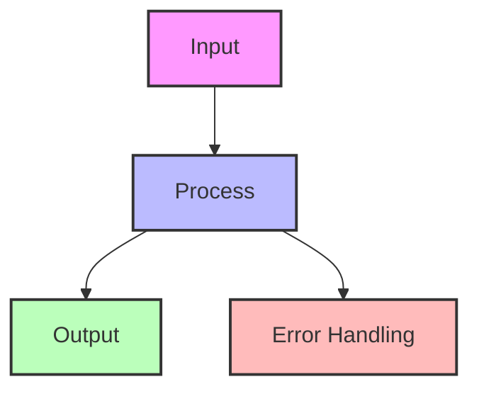
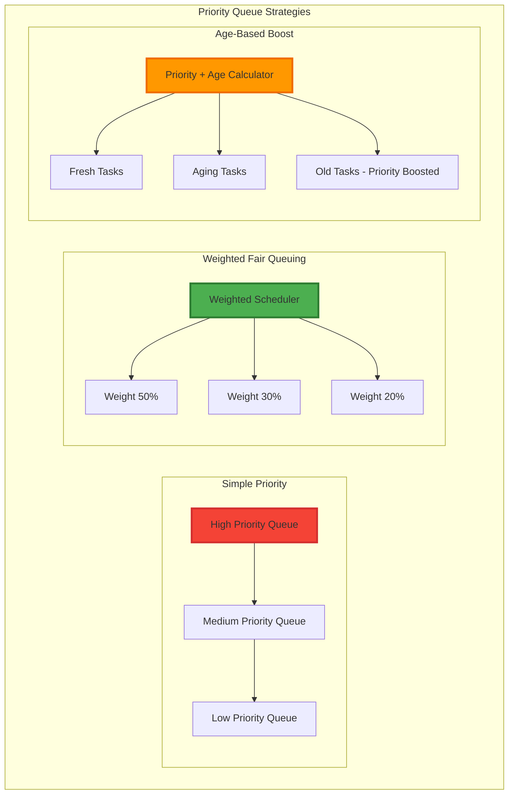
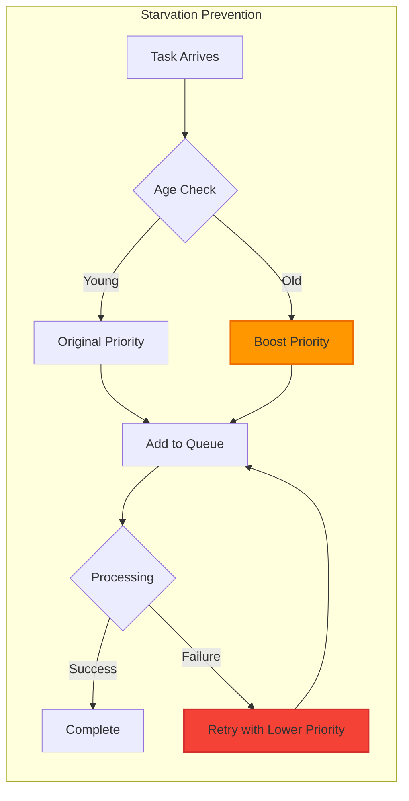
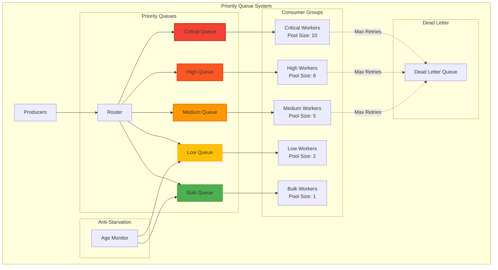
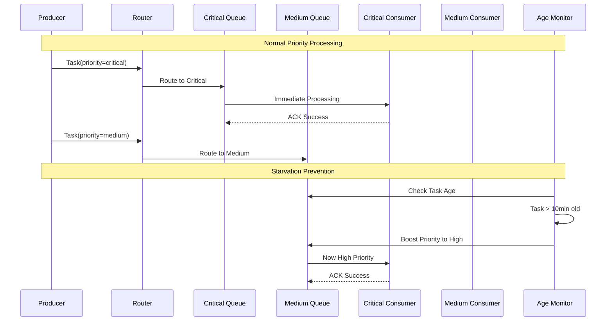
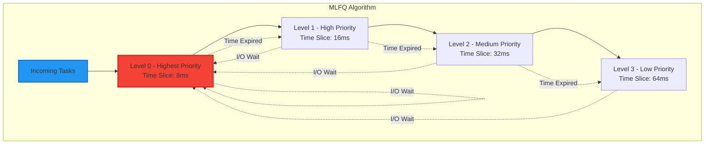
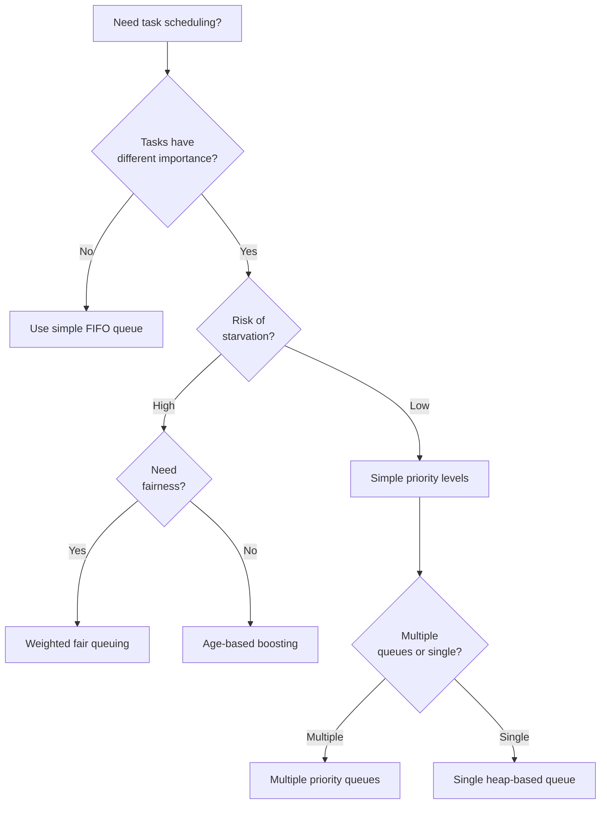

---
best-for:
- Emergency systems with critical vs routine tasks
- Job schedulers with varying importance
- Web crawlers with priority URLs
- Resource allocators where importance varies significantly
category: scaling
current_relevance: mainstream
description: Distributed priority queue systems that process messages based on importance
  rather than arrival order
essential_question: How do we handle increasing load without sacrificing performance
  using priority queue?
excellence_tier: silver
introduced: 1960s
pattern_status: use-with-caution
tagline: Master priority queue for distributed systems success
title: Priority Queue
trade-offs:
  cons:
  - Risk of low-priority starvation
  - Complex distributed implementation
  - Priority inversion problems
  - Hard to tune correctly
  pros:
  - Ensures critical tasks processed first
  - Flexible priority schemes
  - Better resource utilization under load
  - Supports emergency escalation
---

## Essential Question
## When to Use / When NOT to Use

### When to Use

| Scenario | Why It Fits | Alternative If Not |
|----------|-------------|-------------------|
| High availability required | Pattern provides resilience | Consider simpler approach |
| Scalability is critical | Handles load distribution | Monolithic might suffice |
| Distributed coordination needed | Manages complexity | Centralized coordination |

### When NOT to Use

| Scenario | Why to Avoid | Better Alternative |
|----------|--------------|-------------------|
| Simple applications | Unnecessary complexity | Direct implementation |
| Low traffic systems | Overhead not justified | Basic architecture |
| Limited resources | High operational cost | Simpler patterns |
**How do we handle increasing load without sacrificing performance using priority queue?**

# Priority Queue

!!! warning "🥈 Silver Tier Pattern"
    **Powerful but Complex** • Use when priority truly matters
    
    Priority queues excel at ensuring critical work happens first, but beware of starvation risks and implementation complexity in distributed systems. Consider simpler alternatives like multiple queues by priority level for most use cases.

## The Essential Question

**How can we ensure high-importance tasks are processed before low-importance ones while preventing starvation and maintaining system fairness?**

---

## Level 1: Intuition (5 minutes)

### The Story

Hospital emergency room without triage: patients served first-come-first-served. Heart attack patient waits behind common cold.

With triage: critical patients go first, but common cold patients still get treated (eventually).

Priority queues bring triage to software systems.

### Visual Metaphor

```
FIFO Queue:                   Priority Queue:

Tasks arrive: A B C D E       Tasks arrive: A(3) B(1) C(5) D(2) E(1)
Process: A → B → C → D → E    Process: B(1) → E(1) → D(2) → A(3) → C(5)

Order: Arrival time          Order: Priority first, then arrival
Risk: Critical tasks wait    Risk: Low priority may starve
```

### In One Sentence

**Priority Queue**: Process messages based on importance rather than arrival order, ensuring critical work happens first.

### Real-World Parallel

Like airline boarding - first class boards first, but economy passengers don't wait forever.

---

## Level 2: Foundation (10 minutes)

### The Problem Space

!!! danger "🔥 Without Priorities: Black Friday Crash"
    E-commerce site on Black Friday:
    - Payment processing mixed with log writes
    - Customer payments failed due to low-priority logs
    - 30-minute queue backup
    - $2M in abandoned carts
    - Brand reputation damage
    Priority queues would have processed payments first.

### Core Priority Patterns



<details>
<summary>View implementation code</summary>



</details>

### Priority Levels

| Level | Use Cases | Examples | SLA |
|-------|-----------|----------|-----|
| **Critical (1)** | System failures, security | Outage alerts, security breaches | <1 minute |
| **High (2)** | User-facing errors | Payment failures, login issues | <5 minutes |
| **Medium (3)** | Regular operations | User requests, data sync | <30 minutes |
| **Low (4)** | Background tasks | Cleanup, reporting | <2 hours |
| **Bulk (5)** | Batch processing | Analytics, backups | <24 hours |

### Anti-Starvation Mechanisms



### Key Design Decisions

1. **Priority Levels**: How many priority levels?
2. **Starvation Prevention**: Age-based boosting or fair queuing?
3. **Failure Handling**: Lower priority on retry?
4. **Dynamic Priorities**: Can priorities change over time?
5. **Global vs Local**: Single queue or distributed priority?

---

## Level 3: Deep Dive (20 minutes)

### Priority Queue Architecture


<details>
<summary>View implementation code</summary>



</details>

### Processing Flow


<details>
<summary>View implementation code</summary>



</details>

### Implementation Patterns


<details>
<summary>View implementation code</summary>

```python
from enum import Enum
from dataclasses import dataclass
from datetime import datetime, timedelta
import heapq
from typing import Any, Optional, List

class Priority(Enum):
    CRITICAL = 1  # System failures
    HIGH = 2      # User errors
    MEDIUM = 3    # Regular tasks
    LOW = 4       # Background
    BULK = 5      # Batch jobs

@dataclass
class PriorityTask:
    id: str
    priority: Priority
    payload: Any
    created_at: datetime
    retry_count: int = 0
    max_retries: int = 3
    
    def __lt__(self, other):
        # Lower number = higher priority
        if self.priority.value != other.priority.value:
            return self.priority.value < other.priority.value
        # Same priority: older tasks first
        return self.created_at < other.created_at
    
    def age_in_minutes(self) -> float:
        return (datetime.now() - self.created_at).total_seconds() / 60
    
    def should_boost_priority(self, age_threshold_minutes: int = 10) -> bool:
        return (self.age_in_minutes() > age_threshold_minutes and 
                self.priority.value > 1)  # Don't boost CRITICAL further

class PriorityQueueManager:
    def __init__(self):
        self.heap = []
        self.age_boost_threshold = 10  # minutes
        self.consumer_pools = {
            Priority.CRITICAL: 10,  # 10 workers
            Priority.HIGH: 8,       # 8 workers  
            Priority.MEDIUM: 5,     # 5 workers
            Priority.LOW: 2,        # 2 workers
            Priority.BULK: 1        # 1 worker
        }
    
    def enqueue(self, task: PriorityTask):
        # Apply age-based priority boost
        if task.should_boost_priority(self.age_boost_threshold):
            original_priority = task.priority.value
            boosted_priority = max(1, original_priority - 1)
            task.priority = Priority(boosted_priority)
        
        heapq.heappush(self.heap, task)
    
    def dequeue(self) -> Optional[PriorityTask]:
        if self.heap:
            return heapq.heappop(self.heap)
        return None
    
    def get_available_workers(self, priority: Priority) -> int:
        return self.consumer_pools.get(priority, 1)
```

</details>

### Distributed Priority Queues


<details>
<summary>View implementation code</summary>

```python
# Redis-based distributed priority queue
import redis
import json
import time

class DistributedPriorityQueue:
    def __init__(self, redis_client: redis.Redis, queue_name: str):
        self.redis = redis_client
        self.queue_name = queue_name
        self.priority_key = f"{queue_name}:priorities"
        self.data_key = f"{queue_name}:data"
    
    def enqueue(self, task_id: str, priority: int, payload: dict):
        # Score = priority + timestamp fraction for tie-breaking
        score = priority + (time.time() / 1e10)
        
        pipeline = self.redis.pipeline()
        # Add to sorted set with priority score
        pipeline.zadd(self.priority_key, {task_id: score})
        # Store task data
        pipeline.hset(self.data_key, task_id, json.dumps(payload))
        pipeline.execute()
    
    def dequeue(self, timeout: int = 5) -> Optional[dict]:
        # Blocking pop from sorted set (lowest score first)
        result = self.redis.bzpopmin(self.priority_key, timeout=timeout)
        
        if result:
            _, task_id, score = result
            task_id = task_id.decode()
            
            # Get task data
            task_data = self.redis.hget(self.data_key, task_id)
            self.redis.hdel(self.data_key, task_id)
            
            return {
                'id': task_id,
                'priority': int(score),
                'payload': json.loads(task_data) if task_data else None
            }
        
        return None
```

</details>

---

## Level 4: Expert Practitioner (30 minutes)

### Advanced Scheduling Algorithms

#### Multi-Level Feedback Queue



#### Weighted Fair Queuing


<details>
<summary>View implementation code</summary>

```python
class WeightedFairQueue:
    def __init__(self):
        self.queues = {
            Priority.CRITICAL: [],
            Priority.HIGH: [], 
            Priority.MEDIUM: [],
            Priority.LOW: [],
            Priority.BULK: []
        }
        self.weights = {
            Priority.CRITICAL: 50,  # 50% of processing time
            Priority.HIGH: 25,      # 25% of processing time
            Priority.MEDIUM: 15,    # 15% of processing time  
            Priority.LOW: 8,        # 8% of processing time
            Priority.BULK: 2        # 2% of processing time
        }
        self.last_served = {p: 0 for p in Priority}
    
    def dequeue_fair(self) -> Optional[PriorityTask]:
        """Dequeue using weighted fair scheduling"""
        now = time.time()
        best_priority = None
        best_deficit = 0
        
        for priority in Priority:
            if self.queues[priority]:
                # Calculate service deficit
                time_since_last = now - self.last_served[priority]
                expected_service = self.weights[priority] / 100.0
                deficit = time_since_last * expected_service
                
                if deficit > best_deficit:
                    best_deficit = deficit
                    best_priority = priority
        
        if best_priority:
            self.last_served[best_priority] = now
            return self.queues[best_priority].pop(0)
        
        return None
```

</details>

### Production Monitoring


<details>
<summary>View implementation code</summary>

```yaml
# Priority queue metrics
metrics:
  # Queue Depth by Priority  
  - name: queue_depth_by_priority
    description: Tasks waiting by priority level
    labels: [priority_level]
    alert_threshold: 
      critical: > 10
      high: > 100
      medium: > 1000
  
  # Age of Oldest Task
  - name: oldest_task_age_seconds
    description: Age of oldest unprocessed task
    labels: [priority_level]
    alert_threshold: 
      critical: > 60
      high: > 300
      medium: > 1800
  
  # Starvation Detection
  - name: tasks_starved_total
    description: Tasks that waited too long
    labels: [priority_level]
    alert_threshold: > 0
  
  # Processing Rate
  - name: tasks_processed_per_second
    description: Task processing throughput
    labels: [priority_level, consumer_id]
  
  # Priority Inversions
  - name: priority_inversions_total
    description: Lower priority processed before higher
    alert_threshold: > 10/hour
```

</details>

### Common Pitfalls

!!! danger "⚠️ Pitfall: Priority Inversion"
    High priority task waiting for resource held by low priority task.
    **Result**: Critical tasks delayed by background work.
    **Solution**: Priority inheritance or separate resource pools.

!!! danger "⚠️ Pitfall: Starvation"
    Low priority tasks never executed due to constant high priority load.
    **Result**: Background maintenance never runs, system degradation.
    **Solution**: Age-based priority boosting and fair queuing.

!!! danger "⚠️ Pitfall: Too Many Priority Levels"
    Used 20+ priority levels thinking more granularity = better control.
    **Result**: Complex configuration, no real benefit over 5 levels.
    **Solution**: Keep it simple - 3-5 priority levels maximum.

---

## Level 5: Mastery (45 minutes)

### Case Study: Linux CPU Scheduler

!!! info "🏢 Real-World Implementation"
    **System**: Linux Completely Fair Scheduler (CFS)
    **Scale**: Billions of processes across millions of servers
    **Challenge**: Balance fairness, responsiveness, and throughput
    **Algorithm**: 
    - Virtual runtime tracking per process
    - Red-black tree for O(log n) operations
    - Nice values provide priority weights
    - Interactive processes get priority boosts
    **Key Innovations**:
    1. **Virtual Runtime**: Tracks CPU time adjusted by priority
    2. **Fair Queuing**: Ensures all processes get proportional CPU
    3. **Sleeper Fairness**: Sleeping processes get catch-up time
    4. **Load Balancing**: Distributes work across CPU cores
    **Results**:
    - Sub-millisecond scheduling latency
    - Perfect fairness over time windows
    - Scales to thousands of processes
    - Used by billions of devices
    **Lessons**:
    1. Mathematical fairness beats ad-hoc priorities
    2. Tree structures enable efficient priority queues
    3. Track service time, not just priorities
    4. Age-based boosting prevents starvation

### Economic Analysis

#### When Priority Queues Pay Off

| Scenario | Value | Cost | ROI |
|----------|-------|------|-----|
| **Emergency Systems** | $1M/hour outage prevention | $50K implementation | 20:1 |
| **Payment Processing** | 10% revenue increase from reliability | $100K system | 50:1 |
| **Batch vs Interactive** | 30% user satisfaction increase | $75K optimization | 15:1 |
| **Resource Contention** | 60% efficiency improvement | $25K queuing | 25:1 |

#### Break-Even Analysis

Priority queues become cost-effective when:
- **Task importance varies** by 10x or more
- **Failure costs differ** significantly by task type
- **Resource contention** causes delays
- **SLA requirements** vary by priority
- **User experience** depends on response time

### Design Patterns

#### Circuit Breaker Integration


<details>
<summary>View implementation code</summary>

```python
class PriorityCircuitBreaker:
    def __init__(self):
        self.circuit_states = {p: 'CLOSED' for p in Priority}
        self.failure_counts = {p: 0 for p in Priority}
        self.failure_thresholds = {
            Priority.CRITICAL: 3,   # Low tolerance for critical
            Priority.HIGH: 5,
            Priority.MEDIUM: 10,
            Priority.LOW: 20,
            Priority.BULK: 50       # High tolerance for bulk
        }
    
    def should_process(self, task: PriorityTask) -> bool:
        priority = task.priority
        
        if self.circuit_states[priority] == 'OPEN':
            # Circuit open - reject lower priority, allow critical
            return priority == Priority.CRITICAL
        
        return True  # Process normally
```

</details>

### Future Directions

**Emerging Trends**:

1. **ML-Driven Priorities**: Machine learning predicts task importance
2. **Adaptive Thresholds**: Dynamic priority adjustment based on system load
3. **Cross-Service Priorities**: Global priority coordination across microservices
4. **Quantum Priority Queues**: Quantum algorithms for complex scheduling

---

## Quick Reference

### Decision Matrix



### Priority Level Guidelines

| System Type | Levels | Examples |
|-------------|--------|----------|
| **Web Application** | 3 | Critical (security), Normal (users), Background |
| **Job Scheduler** | 4 | Urgent, High, Normal, Low |
| **Message Queue** | 5 | Critical, High, Medium, Low, Bulk |
| **OS Scheduler** | 140 | Real-time (0-99), Normal (100-139) |

### Configuration Template


<details>
<summary>View implementation code</summary>

```yaml
# Priority Queue Configuration
priority_queue:
  levels:
    critical:
      priority: 1
      timeout_seconds: 10
      max_retries: 5
      worker_pool_size: 10
      
    high:
      priority: 2  
      timeout_seconds: 30
      max_retries: 3
      worker_pool_size: 8
      
    medium:
      priority: 3
      timeout_seconds: 120
      max_retries: 2
      worker_pool_size: 5
      
    low:
      priority: 4
      timeout_seconds: 600
      max_retries: 1
      worker_pool_size: 2
  
  anti_starvation:
    enabled: true
    age_boost_threshold_minutes: 10
    boost_factor: 1  # Increase priority by 1 level
    
  monitoring:
    metrics_enabled: true
    starvation_alerts: true
    depth_threshold: 1000
    age_threshold_seconds: 3600
```

</details>

---

## Related Resources

### Patterns
- [Queue-Based Load Leveling](../messaging/queue-load-leveling.md) - Basic queue patterns
- [Competing Consumers](../messaging/competing-consumers.md) - Consumer scaling
- [Circuit Breaker](../resilience/circuit-breaker.md) - Failure protection
- [Bulkhead](../resilience/bulkhead.md) - Resource isolation

### Laws
- [Law 4 (Multidimensional Optimization)](../../part1-axioms/law4-tradeoffs/index.md) - Balancing priorities
- [Law 6 (Cognitive Load)](../../part1-axioms/law6-complexity/index.md) - Keeping priorities simple
- [Law 7 (Economic Reality)](../../part1-axioms/law7-economics/index.md) - Cost-benefit of priorities

### Tools & Technologies
- **Message Brokers**: RabbitMQ, Apache Kafka, Azure Service Bus
- **Databases**: Redis Sorted Sets, PostgreSQL, MongoDB  
- **Libraries**: Python heapq, Java PriorityQueue, Go container/heap
- **Monitoring**: Prometheus, Grafana, DataDog

---

<div class="prev-link">
<a href="/patterns/load-balancing">← Previous: Load Balancing</a>
<a href="/patterns/queues-streaming">Next: Queues & Streaming →</a>
</div>