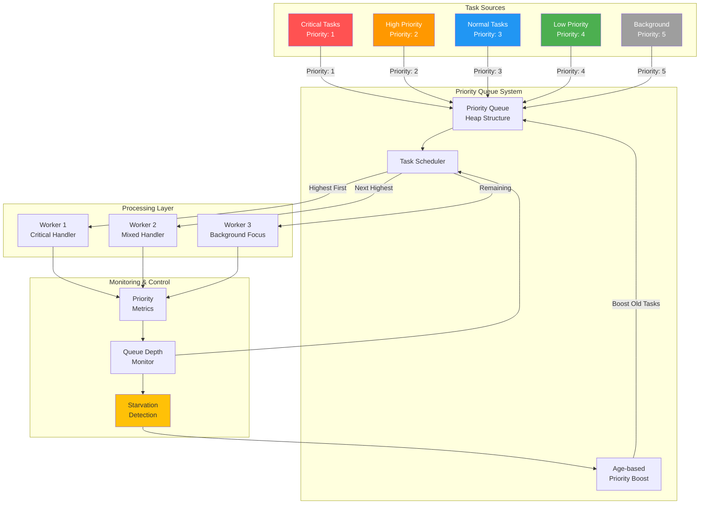

## The Complete Blueprint

Priority queue is a task scheduling pattern that processes messages or requests based on their importance level rather than arrival order, ensuring that critical operations receive resources before less urgent ones. This pattern implements a multi-tier processing system where each task is assigned a priority value, and the queue mechanism continuously serves the highest-priority available work first. The pattern addresses the fundamental challenge in resource-constrained systems where not all work is equally important—emergency alerts must be processed before routine reports, payment processing takes precedence over analytics jobs, and user-facing requests trump background maintenance tasks. Priority queues use heap data structures or multiple separate queues to efficiently maintain priority ordering, with careful mechanisms to prevent low-priority task starvation through aging, time-based priority boosts, or guaranteed minimum service windows. Success requires balancing fairness with urgency, implementing proper priority assignment policies, and managing the complexity of distributed priority coordination across multiple workers and queue partitions.

### What You'll Master

By implementing priority queues, you'll achieve **critical task prioritization** where urgent operations never wait behind routine work, **resource allocation optimization** that maximizes the business value delivered per unit of compute time, **system responsiveness** where important user actions receive immediate attention even under heavy load, **fairness mechanisms** that prevent low-priority work starvation through aging and guaranteed service windows, and **operational control** over workload handling that allows dynamic priority adjustment based on business conditions. You'll master the complex balance between efficiency, fairness, and business priority alignment in distributed systems.

## Essential Question
## When to Use / When NOT to Use

### When to Use

| Scenario | Why It Fits | Alternative If Not |
|----------|-------------|-------------------|
| High availability required | Pattern provides resilience | Consider simpler approach |
| Scalability is critical | Handles load distribution | Monolithic might suffice |
| Distributed coordination needed | Manages complexity | Centralized coordination |

### When NOT to Use

| Scenario | Why to Avoid | Better Alternative |
|----------|--------------|-------------------|
| Simple applications | Unnecessary complexity | Direct implementation |
| Low traffic systems | Overhead not justified | Basic architecture |
| Limited resources | High operational cost | Simpler patterns |
**How do we handle increasing load without sacrificing performance using priority queue?**

# Priority Queue

!!! warning "🥈 Silver Tier Pattern"
    **Powerful but Complex** • Use when priority truly matters
    
    Priority queues excel at ensuring critical work happens first, but beware of starvation risks and implementation complexity in distributed systems. Consider simpler alternatives like multiple queues by priority level for most use cases.

## The Essential Question

**How can we ensure high-importance tasks are processed before low-importance ones while preventing starvation and maintaining system fairness?**

---

### The Story

Hospital emergency room without triage: patients served first-come-first-served. Heart attack patient waits behind common cold.

With triage: critical patients go first, but common cold patients still get treated (eventually).

Priority queues bring triage to software systems.

### Visual Metaphor

### Priority Levels

| Level | Use Cases | Examples | SLA |
|-------|-----------|----------|-----|
| **Critical (1)** | System failures, security | Outage alerts, security breaches | <1 minute |
| **High (2)** | User-facing errors | Payment failures, login issues | <5 minutes |
| **Medium (3)** | Regular operations | User requests, data sync | <30 minutes |
| **Low (4)** | Background tasks | Cleanup, reporting | <2 hours |
| **Bulk (5)** | Batch processing | Analytics, backups | <24 hours |

## Decision Matrix

| Factor | Score (1-5) | Reasoning |
|--------|-------------|-----------|
| **Complexity** | 4 | Priority ordering, heap management, starvation prevention, distributed coordination |
| **Performance Impact** | 4 | Excellent - O(log n) operations, efficient resource utilization, prevents overload |
| **Operational Overhead** | 4 | Monitoring queue depths, priority distribution, tuning starvation prevention |
| **Team Expertise Required** | 4 | Understanding of queue theory, priority algorithms, fairness mechanisms |
| **Scalability** | 4 | Scales well with proper partitioning and priority distribution strategies |

**Overall Recommendation: ⚠️ USE WITH CAUTION** - Powerful for differentiated service levels but requires careful tuning to prevent starvation.

### Key Design Decisions

**Process Steps:**
- Initialize system
- Process requests  
- Handle responses
- Manage failures

