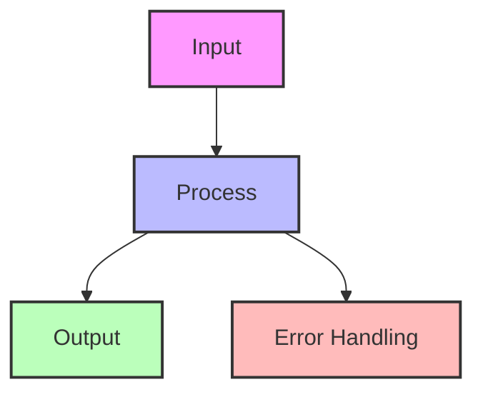

## Essential Question
## When to Use / When NOT to Use

### When to Use

| Scenario | Why It Fits | Alternative If Not |
|----------|-------------|-------------------|
| High availability required | Pattern provides resilience | Consider simpler approach |
| Scalability is critical | Handles load distribution | Monolithic might suffice |
| Distributed coordination needed | Manages complexity | Centralized coordination |

### When NOT to Use

| Scenario | Why to Avoid | Better Alternative |
|----------|--------------|-------------------|
| Simple applications | Unnecessary complexity | Direct implementation |
| Low traffic systems | Overhead not justified | Basic architecture |
| Limited resources | High operational cost | Simpler patterns |
**How do we handle increasing load without sacrificing performance using queues & stream processing?**

# Queues & Stream Processing

!!! success "🏆 Gold Standard Pattern"
    **Real-Time Event Processing at Scale** • Uber, LinkedIn, Netflix proven
    
    Modern applications run on event streams - from Uber processing 1M+ messages/second for trip matching to LinkedIn's 7 trillion daily messages. Queues and streams enable decoupled, scalable architectures.
    
    **Key Success Metrics:**
    - Uber: 1M+ messages/second for real-time operations
    - LinkedIn: 7 trillion messages/day across Kafka
    - Netflix: 500B+ events/day for personalization

## The Essential Question

**How can we handle variable workloads and protect services from being overwhelmed while maintaining system reliability?**

---

## Level 1: Intuition (5 minutes)

### The Story

Friday night restaurant without queues: overwhelmed servers, swamped kitchen, indefinite waits, blocking.

With a host managing a waiting list: numbered check-ins, sustainable pace, multiple servers, handled rushes.

Queues do the same for software.

### Visual Metaphor

### Message Flow Patterns

### Key Benefits

1. **Resilience**: Works despite consumer downtime
2. **Elasticity**: Queue-based scaling
3. **Buffering**: No dropped requests
4. **Replay**: Stream reprocessing

### Trade-offs

| Aspect | Gain | Cost |
|--------|------|------|
| Coupling | Loose coupling | Additional complexity |
| Reliability | Message durability | Storage overhead |
| Scalability | Independent scaling | Queue management |
| Latency | Consistent processing | Added hop latency |

---

## Level 3: Deep Dive (20 minutes)

### Detailed Architecture

### Implementation Patterns

#### Queue Implementation Patterns

##### Message Flow Sequence

##### Queue State Machine

##### Core Queue Operations

### Queue vs Stream Comparison

| Aspect | Message Queue | Event Stream |
|--------|--------------|-------------|
| **Message Retention** | Deleted after consumption | Retained for configured period |
| **Consumer Model** | Competing consumers | Consumer groups with offsets |
| **Message Order** | Best effort (FIFO) | Guaranteed within partition |
| **Replay** | Not supported | Full replay from any offset |
| **Scaling** | Add more consumers | Add partitions and consumers |
| **Use Cases** | Task distribution, commands | Event sourcing, audit logs |
| **Delivery** | At-least-once typical | Exactly-once possible |
| **Performance** | Lower latency | Higher throughput |

### Common Variations

1. **Work Queues**: Task distribution → Simple, no broadcast
2. **Pub/Sub Topics**: Fan-out → All get all messages
3. **Event Streams**: Sourcing/analytics → Complex but replayable

### Integration Points

- **CQRS**: Commands via queues, queries from reads
- **Event Sourcing**: Stream as event store
- **Saga**: Orchestration messages
- **Circuit Breaker**: Consumer protection

---

## Level 4: Expert Practitioner (30 minutes)

### Advanced Techniques

#### Exactly-Once Processing

### Common Pitfalls

!!! danger "⚠️ Pitfall: Poison Messages"
 Malformed message crashed consumers repeatedly, blocked entire queue.
 **Solution**: Retry limits, DLQ, message validation.

!!! danger "⚠️ Pitfall: Unbounded Queue Growth"
 Traffic spike → Unbounded growth → Memory exhaustion → Crash.
 **Solution**: Size limits, backpressure, depth monitoring.

### Production Checklist

- [ ] **Message validation** before processing
- [ ] **Dead letter queue** configured
- [ ] **Retry policy** with exponential backoff
- [ ] **Monitoring** for queue depth and consumer lag
- [ ] **Alerting** for queue issues
- [ ] **Scaling policies** based on queue metrics
- [ ] **Message compression** for large payloads
- [ ] **Security** with encryption and access control

---

## Level 5: Mastery (45 minutes)

### Case Study: LinkedIn's Kafka Infrastructure

!!! info "🏢 Real-World Implementation"
 **Company**: LinkedIn
 **Scale**: 7T messages/day, 100+ clusters, 4K+ brokers, PBs of data
 **Challenge**: Real-time pipelines with sub-second latency.
 **Architecture**: Producers → Kafka → Stream Processors → Consumers
 **Design**:
 1. Partition by member ID
 2. 3x cross-AZ replication
 3. 3-7 day retention
 4. Snappy compression
 **Optimizations**: Custom partitioning, tiered storage, adaptive batching, zero-copy
 **Results**: <10ms p99, 99.99% availability, 30MB/s/broker, <30s recovery
 **Lessons**:
 1. Monitor everything
 2. Thoughtful partitioning
 3. Plan for failure
 4. Workload-specific tuning

### Economic Analysis

#### Cost Model

#### When It Pays Off

- **Break-even**: 3x peak ratio or 1% failure rate
- **High ROI**: Variable traffic, microservices, event-driven, pipelines
- **Low ROI**: Constant low traffic, simple request-response, latency-sensitive gaming

### Pattern Evolution

### Law Connections

!!! abstract "🔗 Fundamental Laws"

 This pattern directly addresses:

 1. **[Law 4 (Multidimensional Optimization ⚖️)](../../core-principles/laws/multidimensional-optimization)**: Buffers handle capacity mismatches
 2. **[Law 2 (Asynchronous Reality ⏳/index)](../../core-principles/laws/asynchronous-reality)**: Decoupling reduces blocking
 3. **[Law 1 (Correlated Failure ⛓️/index)](../../core-principles/laws/correlated-failure)**: Messages survive consumer failures
 4. **[Law 4 (Multidimensional Optimization ⚖️/index)](../../core-principles/laws/multidimensional-optimization)**: Async coordination via messages
 5. **[Law 5 (Distributed Knowledge 🧠/index)](core-principles/laws/distributed-knowledge/index)**: Message flow visibility

### Future Directions

**Emerging Trends**:

1. **Edge Queuing**: Message routing at edge locations
2. **ML-Driven Routing**: Smart message routing based on content
3. **Quantum-Safe Queues**: Post-quantum encryption for messages
4. **Cross-Cloud Streaming**: Seamless multi-cloud message flow

**What's Next**:
- Automatic queue sizing based on traffic patterns
- Self-healing message flows
- Declarative stream processing
- Zero-latency message passing for critical paths

---

## Quick Reference

### Decision Matrix

### Configuration Template

---

## Related Resources

### Patterns
- [Event-Driven Architecture](../pattern-library/architecture/event-driven.md) - Built on queues/streams
- [CQRS](../pattern-library/data-management/cqrs.md) - Commands via queues
- [Saga Pattern](../pattern-library/data-management/saga.md) - Orchestration via queues
- [Circuit Breaker](../pattern-library/resilience/circuit-breaker.md) - Protect consumers

### Laws
- [Law 4 (Multidimensional Optimization )](../../core-principles/laws/multidimensional-optimization) - Why buffering matters
- [Law 2 (Asynchronous Reality /index)](../../core-principles/laws/asynchronous-reality) - Async vs sync trade-offs
- [Law 1 (Correlated Failure /index)](core-principles/laws/correlated-failure/index) - Message durability

### Further Reading
- [Kafka: The Definitive Guide](https://www.confluent.io/resources/kafka-the-definitive-guide/) - O'Reilly
- [Designing Data-Intensive Applications](https://dataintensive.net/) - Chapter 11 on streams
- [Enterprise Integration Patterns](https://www.enterpriseintegrationpatterns.com/) - Messaging patterns
- [AWS SQS Best Practices](https://docs.aws.amazon.com/AWSSimpleQueueService/latest/SQSDeveloperGuide/sqs-best-practices.html)

### Tools & Libraries
- **Message Queues**: RabbitMQ, AWS SQS, Azure Service Bus, Redis
- **Event Streams**: Apache Kafka, AWS Kinesis, Azure Event Hubs, Pulsar
- **Stream Processing**: Apache Flink, Spark Streaming, Kafka Streams
- **Libraries**: 
 - Java: Spring Cloud Stream
 - Python: Celery, aiokafka
 - Go: Sarama, NATS
 - Node.js: Bull, KafkaJS

---

<a href="/pattern-library/index.md">← Previous: Patterns Overview</a>
<a href="/pattern-library/cqrs">Next: CQRS →</a>

