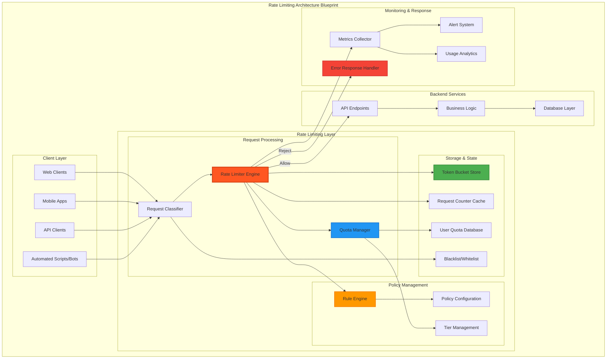

# Rate Limiting Pattern

## The Complete Blueprint

Rate limiting is a traffic control mechanism that restricts the number of requests a client can make within a specified time window, protecting systems from overload while ensuring fair resource allocation. Instead of allowing unlimited requests that could overwhelm servers, rate limiting acts as a gatekeeper that enforces quotas based on various criteria like user identity, API keys, or IP addresses. This pattern prevents abuse, maintains system stability, and ensures quality of service for legitimate users by implementing algorithms like token bucket, sliding window, or leaky bucket to control request flow.



### What You'll Master

- **Rate Limiting Algorithms**: Implement token bucket, sliding window, fixed window, and leaky bucket algorithms for different use cases
- **Multi-Tier Quota Management**: Design hierarchical rate limiting with different limits for users, API tiers, endpoints, and operations
- **Distributed Rate Limiting**: Build scalable rate limiting across multiple servers using distributed caches and coordination mechanisms
- **Dynamic Policy Management**: Create adaptive rate limiting that adjusts based on system load, user behavior, and threat detection
- **Client Communication**: Implement proper HTTP headers, error responses, and retry guidance for rate-limited requests
- **Monitoring & Analytics**: Build comprehensive tracking of rate limiting effectiveness, user patterns, and system protection metrics

!!! success "🏆 Gold Standard Pattern"
    **Request flow control that prevents abuse while maintaining system availability** • Stripe, Twitter, GitHub proven at scale
    
    Rate limiting prevents system overload, ensures fair resource usage, and protects against DoS attacks. Essential for any public-facing API or service, providing the first line of defense against abuse.
    
    **Key Success Metrics:**
    - Stripe: Billions of API requests protected with sophisticated fair queuing
    - Twitter: 500M+ tweets/day with per-endpoint rate limiting  
    - GitHub: 100M+ developers managed with cost-based quotas

## Essential Question

**How do we protect our systems from overload while ensuring fair access to resources across users and clients?**

## When to Use / When NOT to Use

### ✅ Use When

| Scenario | Example | Impact |
|----------|---------|--------|
| Public-facing APIs | REST/GraphQL endpoints | Prevent abuse and ensure availability |
| Expensive operations | AI/ML inference, report generation | Control resource consumption costs |
| Multi-tenant systems | SaaS platforms, shared services | Fair resource allocation across tenants |
| DDoS protection | All external services | First line of defense against attacks |

### ❌ DON'T Use When

| Scenario | Why | Alternative |
|----------|-----|-------------|
| Internal trusted microservices | Adds unnecessary latency | Circuit breakers for failure protection |
| Batch processing systems | Not request-based paradigm | Resource quotas and scheduling |
| Event streaming systems | Different flow control model | Backpressure mechanisms |
| Emergency/health endpoints | Must always be available | Separate infrastructure tier |

---

## Level 1: Intuition (5 min) {#intuition}

### The Story
Imagine a popular restaurant that can serve 100 customers per hour. Without reservations or waiting limits, 1000 people might show up during lunch, creating chaos and poor service for everyone. Rate limiting is like a reservation system - it controls how many requests (customers) can access your service (restaurant) within a time window, ensuring quality service for legitimate users.

### Visual Metaphor
<details>
<summary>📄 View mermaid code (7 lines)</summary>


</details>

### Core Insight
> **Key Takeaway:** Rate limiting trades some request acceptance for system stability, protecting your service from being overwhelmed while maintaining predictable performance.

### In One Sentence
Rate limiting controls the number of requests a client can make within a time window, preventing system overload while ensuring fair resource access across users.

## Level 2: Foundation (10 min) {#foundation}

### The Problem Space

<div class="failure-vignette">
<h4>🚨 What Happens Without This Pattern</h4>

**API Company, 2020**: A single malicious client sent 1 million requests per minute to their public API, overwhelming database connections and causing 3-hour outage for all 50,000 legitimate users. Lost revenue: $500K. Implementation of rate limiting the following month reduced attack impact to <30 seconds and prevented all subsequent overload incidents.

**Impact**: 3-hour outage, $500K revenue loss, 50,000 affected users
</div>

### How It Works

#### Architecture Overview
#### Key Components

| Component | Purpose | Responsibility |
|-----------|---------|----------------|
| Rate Limiter | Request evaluation | Apply rate limiting algorithms and rules |
| Token Store | State management | Track request counts and quotas per client |
| Quota Manager | Policy enforcement | Manage different limits for users/tiers/operations |
| Monitoring | Observability | Track metrics and adjust thresholds |

### Basic Example

## Level 3: Deep Dive (15 min) {#deep-dive}

### Implementation Details

#### State Management
#### Critical Design Decisions

| Decision | Options | Trade-off | Recommendation |
|----------|---------|-----------|----------------|
| **Algorithm Choice** | Token Bucket vs Sliding Window | Token Bucket: Burst support<br>Sliding Window: Precise control | Token bucket for APIs, sliding window for precision |
| **Storage Layer** | In-memory vs Redis | In-memory: Fast but local<br>Redis: Shared but network overhead | Redis for distributed systems |
| **Granularity** | Global vs Per-user vs Per-IP | Global: Simple<br>Per-user: Fair<br>Per-IP: Abuse protection | Multi-tier approach |

### Common Pitfalls

<div class="decision-box">
<h4>⚠️ Avoid These Mistakes</h4>

1. **Fixed Limits Only**: Static limits can't adapt to different usage patterns → Implement tiered limits based on user behavior
2. **No Retry Guidance**: Clients don't know when to retry → Always include Retry-After headers
3. **Clock Synchronization**: Distributed systems have timing issues → Use logical timestamps or centralized time
</div>

### Production Considerations

#### Performance Characteristics

| Metric | Typical Range | Optimization Target |
|--------|---------------|-------------------|
| Rate Limiter Latency | 1-10ms | <5ms for in-memory, <20ms for Redis |
| Rejection Rate | 1-5% normal traffic | <1% for legitimate users |
| Memory per User | 1-100KB | Depends on algorithm and window size |
| Accuracy | 95-99% | Balance with performance requirements |

## Level 4: Expert (20 min) {#expert}

### Advanced Techniques

#### Optimization Strategies

1. **Hierarchical Rate Limiting**
   - When to apply: Complex applications with multiple resource constraints
   - Impact: Granular control prevents abuse while allowing normal usage
   - Trade-off: Configuration complexity vs precise control

2. **Adaptive Rate Limiting**
   - When to apply: Variable capacity systems or dynamic threat response
   - Impact: Automatically adjusts limits based on system health
   - Trade-off: Implementation complexity vs automatic optimization

### Scaling Considerations

### Monitoring & Observability

#### Key Metrics to Track

| Metric | Alert Threshold | Dashboard Panel |
|--------|----------------|-----------------|
| Request Rate | >80% of capacity | Requests per second by endpoint |
| Rejection Rate | >5% for legitimate users | Rate limit violations by client |
| Latency Impact | >10ms p99 overhead | Rate limiter performance |
| False Positives | >1% legitimate requests blocked | Client behavior analysis |

## Level 5: Mastery (30 min) {#mastery}

### Real-World Case Studies

#### Case Study 1: GitHub's GraphQL Rate Limiting

<div class="truth-box">
<h4>💡 Production Insights from GitHub</h4>

**Challenge**: GraphQL queries vary dramatically in complexity and cost, making traditional request-based rate limiting ineffective

**Implementation**: 
- Cost-based rate limiting where each field/operation has a cost
- Personal access tokens get 5000 points/hour
- Complex queries consume more points than simple ones
- Rate limit headers include cost information for client optimization

**Results**: 
- API Abuse: 99.9% reduction in resource-intensive query abuse
- Fair Usage: Complex operations properly limited without blocking simple queries
- Developer Experience: Clear cost feedback helps optimize client queries
- System Stability: GraphQL endpoint maintains consistent performance

**Lessons Learned**: Cost-based limiting is essential for variable-complexity operations; transparent cost calculation helps developers optimize usage
</div>

### Pattern Evolution

#### Migration from No Rate Limiting

<details>
<summary>📄 View mermaid code (7 lines)</summary>


</details>

#### Future Directions

| Trend | Impact on Pattern | Adaptation Strategy |
|-------|------------------|-------------------|
| **AI/ML Workloads** | Variable cost operations | Dynamic cost calculation based on model complexity |
| **Edge Computing** | Distributed enforcement | Regional rate limiting with global coordination |
| **Serverless Architecture** | Per-invocation limiting | Function-level quotas with burst capabilities |

### Pattern Combinations

#### Works Well With

| Pattern | Combination Benefit | Integration Point |
|---------|-------------------|------------------|
| [Circuit Breaker](../resilience/circuit-breaker.md) | Cascading failure prevention | Rate limits trigger circuit opening |
| [API Gateway](../communication/api-gateway.md) | Centralized policy enforcement | Gateway handles all rate limiting logic |
| [Bulkhead](../resilience/bulkhead.md) | Resource isolation | Separate limits per resource pool |

## Quick Reference

### Decision Matrix

### Comparison with Alternatives

| Aspect | Rate Limiting | Circuit Breaker | Bulkhead |
|--------|-------------|----------------|----------|
| Protection Scope | Client abuse | Service failures | Resource exhaustion |
| Response Time | Immediate | Failure detection delay | Immediate |
| Resource Usage | Low overhead | Minimal | Resource partitioning |
| Client Impact | Predictable (429) | Variable (503) | Transparent |
| When to use | Public APIs | Service dependencies | Resource contention |

### Implementation Checklist

**Pre-Implementation**
- [ ] Analyzed traffic patterns to determine appropriate limits
- [ ] Identified different user tiers and their access requirements
- [ ] Designed rate limiting hierarchy (global/user/IP/endpoint)
- [ ] Selected appropriate algorithm based on traffic characteristics

**Implementation**
- [ ] Deployed distributed rate limiting infrastructure (Redis cluster)
- [ ] Implemented proper HTTP response headers and error messages
- [ ] Set up monitoring for rate limiting metrics and violations
- [ ] Configured graceful degradation for rate limiter failures

**Post-Implementation**
- [ ] Load tested rate limiting under various attack scenarios
- [ ] Tuned limits based on legitimate user behavior analysis
- [ ] Implemented adaptive limits for different system load conditions
- [ ] Created runbooks for rate limit adjustment and incident response

## Related Patterns

### Complementary Patterns (Work Well Together)

| Pattern | Relationship | Integration Strategy | When to Combine |
|---------|--------------|---------------------|------------------|
| **[Circuit Breaker](../resilience/circuit-breaker.md)** | **Failure protection** - Rate limiting prevents overload, circuit breaker handles downstream failures | Rate limiting reduces load to prevent circuit breaker activation. When circuit is open, rate limits can be relaxed to allow recovery | Always - Prevents both overload and cascade failures |
| **[Retry with Backoff](../resilience/retry-backoff.md)** | **Request management** - Rate limiting controls incoming flow, retry manages failing requests | Implement retry budget limits that work within rate limit quotas. Use rate limit headers to inform retry timing | High-traffic APIs where both patterns prevent system overload |
| **[Load Balancing](./load-balancing.md)** | **Traffic distribution** - Distribute rate-limited traffic across healthy backends | Implement rate limiting at load balancer level, then distribute allowed traffic. Consider per-backend rate limits | Always - Rate limiting without load balancing creates bottlenecks |
| **[API Gateway](../communication/api-gateway.md)** | **Centralized control** - Single point for rate limiting policies across all services | Gateway implements global rate limiting, per-service limits, and request routing. Provides consistent rate limit headers | Microservices architectures requiring unified rate limiting policy |

### Extension Patterns (Build Upon Rate Limiting)

| Pattern | Relationship | Implementation | When to Extend |
|---------|--------------|----------------|----------------|
| **[Bulkhead](../resilience/bulkhead.md)** | **Resource isolation** - Separate rate limits for different resource pools | Implement per-bulkhead rate limiting: VIP users get dedicated quotas, different limits for different service tiers | Multi-tenant systems with different SLA requirements |
| **[Priority Queue](./priority-queue.md)** | **Request prioritization** - Rate limit different request types differently | High-priority requests get higher rate limits or reserved capacity. Lower-priority requests get throttled first | Systems with mixed-criticality workloads |
| **[Graceful Degradation](../resilience/graceful-degradation.md)** | **Rate limit overflow handling** - Defines behavior when rate limits are exceeded | Instead of rejecting requests, degrade to lower-cost operations: cached responses, simplified processing | User-facing systems where rejection provides poor experience |

### Alternative Patterns (Different Flow Control Approaches)

| Pattern | Relationship | Trade-offs | When to Choose Rate Limiting |
|---------|--------------|------------|------------------------------|
| **[Load Shedding](../resilience/load-shedding.md)** | **Traffic dropping** - Proactive vs reactive traffic control | Rate Limiting: Predictable, fair vs Load Shedding: Adaptive, priority-based | When you need predictable, fair access rather than adaptive dropping |
| **[Backpressure](./backpressure.md)** | **Flow control** - Client-side awareness vs server-side enforcement | Backpressure: Cooperative, efficient vs Rate Limiting: Enforced, simple | When you need enforcement rather than cooperation |
| **[Queue-based Processing](../coordination/distributed-queue.md)** | **Async processing** - Immediate rejection vs queued processing | Queue: Higher throughput, eventual processing vs Rate Limiting: Immediate feedback, bounded latency | When immediate response is required and queuing latency is unacceptable |

### Specialized Pattern Combinations

#### Adaptive Rate Limiting with Circuit Breaker
```python
class AdaptiveRateLimiter:
    def __init__(self):
        self.circuit_breaker = CircuitBreaker()
        self.rate_limiter = TokenBucketRateLimiter()
        self.system_health = SystemHealthMonitor()
        
    def allow_request(self, client_id):
        # Adjust rate limits based on system health
        health_score = self.system_health.get_health_score()
        
        if health_score > 0.9:
            # System healthy - allow normal rates
            multiplier = 1.0
        elif health_score > 0.7:
            # System stressed - reduce by 20%
            multiplier = 0.8
        else:
            # System unhealthy - aggressive limiting
            multiplier = 0.5
            
        adjusted_limit = self.rate_limiter.base_limit * multiplier
        
        # Check circuit breaker state
        if self.circuit_breaker.is_open():
            # Circuit open - very restrictive limiting
            adjusted_limit *= 0.1
            
        return self.rate_limiter.allow_request(client_id, adjusted_limit)
```

#### Multi-tier Rate Limiting with Priority
```python
class PriorityRateLimiter:
    def __init__(self):
        self.tiers = {
            'premium': RateLimiter(limit=1000, window=60),  # 1000/min
            'standard': RateLimiter(limit=100, window=60),   # 100/min  
            'basic': RateLimiter(limit=10, window=60),       # 10/min
            'global': RateLimiter(limit=5000, window=60)     # Global cap
        }
        self.priority_queue = PriorityQueue()
        
    def handle_request(self, request):
        client_tier = self.get_client_tier(request.client_id)
        
        # Check global limit first
        if not self.tiers['global'].allow_request('global'):
            raise GlobalRateLimitException()
            
        # Check tier-specific limit
        if not self.tiers[client_tier].allow_request(request.client_id):
            # Add to priority queue for later processing
            priority = self.get_priority_for_tier(client_tier)
            self.priority_queue.enqueue(request, priority)
            raise TierRateLimitException(f"Tier {client_tier} limit exceeded")
            
        return self.process_request(request)
```

#### Cost-based Rate Limiting
```python
class CostBasedRateLimiter:
    def __init__(self):
        self.cost_calculator = OperationCostCalculator()
        self.token_bucket = TokenBucket(capacity=1000, refill_rate=100)  # 1000 cost units
        
    def allow_request(self, request):
        operation_cost = self.cost_calculator.calculate_cost(request)
        
        # Different operations have different costs
        # Simple read: 1 token
        # Complex query: 10 tokens  
        # Write operation: 5 tokens
        # Expensive analytics: 50 tokens
        
        if self.token_bucket.consume(operation_cost):
            return True
        else:
            # Calculate how long to wait for tokens
            wait_time = self.token_bucket.time_until_tokens(operation_cost)
            raise RateLimitException(f"Rate limited, retry after {wait_time}s")
```

### Implementation Priority Guide

**Phase 1: Basic Rate Limiting (Week 1)**
1. **Algorithm Selection** - Choose token bucket for most use cases
2. **Single-tier Implementation** - Start with simple per-client limiting
3. **Basic Headers** - Return X-RateLimit-* headers for client guidance

**Phase 2: Multi-tier and Distribution (Week 2)**
1. **Client Tiers** - Implement different limits for different client types
2. **Distributed Coordination** - Use Redis or similar for multi-instance rate limiting
3. **Circuit Breaker Integration** - Coordinate with downstream failure handling

**Phase 3: Advanced Features (Week 3+)**
1. **Adaptive Limits** - Adjust limits based on system health and load
2. **Cost-based Quotas** - Implement operation-cost-aware limiting
3. **Priority Handling** - Add request prioritization and queuing

### Anti-Patterns and Common Mistakes

| Anti-Pattern | Why It's Bad | Correct Approach |
|--------------|--------------|------------------|
| **Same limit for all operations** | Expensive operations consume same quota as cheap ones | Use cost-based or operation-specific rate limits |
| **No graceful handling of exceeded limits** | Poor user experience with hard rejections | Implement queuing, graceful degradation, or retry guidance |
| **Rate limiting without load balancing** | Creates bottlenecks at rate limiter | Distribute rate-limited requests across multiple backends |
| **Ignoring distributed coordination** | Inconsistent limits across service instances | Use shared state (Redis) or distributed algorithms |

### Related Resources

<div class="grid cards" markdown>

- :material-flask:{ .lg .middle } **Fundamental Laws**
    
    ---
    
    - [Law 1: Correlated Failure](../../core-principles/laws/correlated-failure.md) - Preventing cascade failures
    - [Law 7: Economic Reality](../../core-principles/laws/economic-reality.md) - Resource cost management

- :material-pillar:{ .lg .middle } **Foundational Pillars**
    
    ---
    
    - [Control Distribution](../../core-principles/pillars/control-distribution.md) - Distributed rate limiting coordination
    - [Work Distribution](../../core-principles/pillars/work-distribution.md) - Fair resource allocation

- :material-tools:{ .lg .middle } **Implementation Guides**
    
    ---
    
    - <!-- TODO: Add Rate Limiting Setup from Architects Handbook -->
    - <!-- TODO: Add Algorithm Selection from Architects Handbook -->
    - <!-- TODO: Add Monitoring Guide from Architects Handbook -->

</div>

