# Rate Limiting Pattern

!!! success "🏆 Gold Standard Pattern"
    **API Protection Essential** • Stripe, Twitter, GitHub proven at scale
    
    Rate limiting prevents system overload, ensures fair resource usage, and protects against DoS attacks. Essential for any public-facing API or service.

## Essential Questions This Pattern Answers

!!! question "Critical Decision Points"
    1. **Is your API public or externally accessible?**
       - If yes → Rate limiting is mandatory for protection
       - If no → Still consider for internal service protection
    
    2. **Can a single user overwhelm your system?**
       - If yes → Implement per-user rate limits
       - If no → Global rate limits may suffice
    
    3. **Do you need to support burst traffic?**
       - If yes → Use token bucket algorithm
       - If no → Sliding window is simpler and effective
    
    4. **Are some operations more expensive than others?**
       - If yes → Implement cost-based quotas
       - If no → Simple request counting works

## When to Use vs When NOT to Use

### ✅ Use Rate Limiting When
| Scenario | Why | Example |
|----------|-----|---------|
| **Public APIs** | Prevent abuse & ensure availability | REST/GraphQL endpoints |
| **Expensive operations** | Control resource consumption | AI/ML inference, reports |
| **Multi-tenant systems** | Fair resource allocation | SaaS platforms |
| **DDoS protection** | First line of defense | All external services |

### ❌ DON'T Use Rate Limiting When
| Scenario | Why | Alternative |
|----------|-----|-------------|
| **Internal microservices** | Adds unnecessary latency | Circuit breakers |
| **Batch processing** | Not request-based | Resource quotas |
| **Event streams** | Different paradigm | Backpressure |
| **Emergency endpoints** | Must always work | Separate infrastructure |

## Level 1: Core Concepts

### Rate Limiting Visualization


## Level 2: Algorithm Selection

### Algorithm Decision Matrix

```mermaid
graph TD
    Start[Choose Algorithm] --> Q1{Need Bursts?}
    Q1 -->|Yes| Q2{Memory Constrained?}
    Q1 -->|No| Q3{Need Perfect Accuracy?}
    
    Q2 -->|Yes| TB[Token Bucket]
    Q2 -->|No| TB
    
    Q3 -->|Yes| SL[Sliding Log]
    Q3 -->|No| SW[Sliding Window]
    
    TB --> TBD["✅ Allows bursts<br/>✅ O(1) memory<br/>❌ Less accurate"]
    SW --> SWD["✅ Good accuracy<br/>✅ O(1) memory<br/>❌ No burst control"]
    SL --> SLD["✅ Perfect accuracy<br/>❌ O(n) memory<br/>❌ Complex"]
    
    style TB fill:#4ade80
    style SW fill:#60a5fa
    style SL fill:#f59e0b
```



### Algorithm Comparison

| Algorithm | Memory | Accuracy | Burst | Best For |
|-----------|--------|----------|-------|----------|
| **Fixed Window** | O(1) | Low | Poor | Simple APIs |
| **Sliding Window** | O(1) | High | Good | Most apps |
| **Token Bucket** | O(1) | Medium | Configurable | Bursty traffic |
| **Sliding Log** | O(n) | Perfect | Natural | Critical systems |

## Level 3: Distributed Rate Limiting

### Distribution Challenge


### Distributed Strategies

| Strategy | Description | Pros | Cons | Use When |
|----------|-------------|------|------|----------|
| **Centralized** | Single Redis/DB | Simple, accurate | SPOF | <10K req/s |
| **Sharded** | Multiple stores | Scalable | Less accurate | >10K req/s |
| **Local+Sync** | Cache + sync | Fast, scalable | Complex | >100K req/s |

## Level 4: Advanced Patterns

### Progressive Rate Limiting


### Cost-Based Rate Limiting

| Operation | Cost Units | Example |
|-----------|------------|---------|
| **Simple Read** | 1 | GET /user |
| **Complex Query** | 10 | GraphQL nested |
| **Write Operation** | 5 | POST /order |
| **AI Inference** | 100 | POST /predict |

**Budget**: 1000 units/minute per user

## Level 5: Production Implementation

### Response Headers

```http
HTTP/1.1 429 Too Many Requests
X-RateLimit-Limit: 1000
X-RateLimit-Remaining: 0
X-RateLimit-Reset: 1640995200
Retry-After: 3600
Content-Type: application/json

{
  "error": "rate_limit_exceeded",
  "message": "API rate limit exceeded",
  "retry_after": 3600
}
```

### Monitoring Dashboard


## Production Checklist

### Essential Implementation

| Component | Configuration | Validation |
|-----------|---------------|------------|
| **Algorithm** | Token bucket for APIs, sliding window for precision | Load test both |
| **Storage** | Redis with persistence, local cache for speed | Failover test |
| **Headers** | X-RateLimit-*, Retry-After | Client compliance |
| **Monitoring** | Request/rejection rates, latency | Dashboard setup |
| **Tiers** | Free/Pro/Enterprise limits | A/B test limits |
| **Graceful Degradation** | Queue overflow handling | Stress test |

### Common Pitfalls

| Pitfall | Impact | Solution |
|---------|--------|----------|
| **Clock skew** | Inconsistent limits | NTP sync |
| **Memory leaks** | OOM crashes | TTL on all keys |
| **No retry guidance** | Client storms | Retry-After header |
| **Fixed limits** | Can't adapt | Dynamic adjustment |
| **No monitoring** | Blind to issues | Real-time metrics |

## Quick Reference

### Implementation Decision Tree


### Key Insights

<div class="truth-box">
<h4>💡 Rate Limiting Reality</h4>

**The 90/10 Rule**: 90% of your traffic comes from 10% of users. Design limits accordingly.

**Progressive Enhancement**: Start strict, loosen based on behavior. It's easier to increase limits than decrease.

**Client Education**: Good clients respect rate limits. Bad clients ignore them. Design for both.

**Cost vs Complexity**: Simple rate limiting prevents 90% of problems. Complex systems prevent the last 10% at 10x the cost.
</div>

## Related Patterns
- [Circuit Breaker](../resilience/circuit-breaker.md) - Complementary protection
- [Bulkhead](../resilience/bulkhead.md) - Resource isolation
- [API Gateway](../architecture/api-gateway.md) - Central rate limiting
- [Load Balancing](load-balancing.md) - Distribute rate limit load

---

<div class="page-nav" markdown>
[:material-arrow-left: Caching Strategies](caching-strategies.md) | 
[:material-arrow-up: Scaling Patterns](index.md) | 
[:material-arrow-right: Load Balancing](load-balancing.md)
</div>