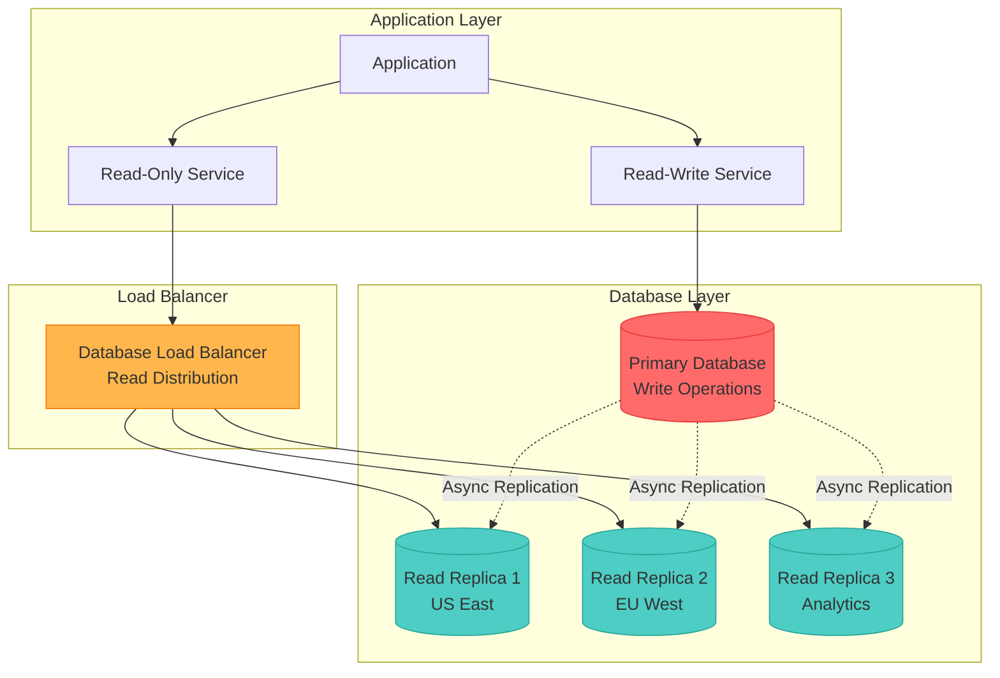
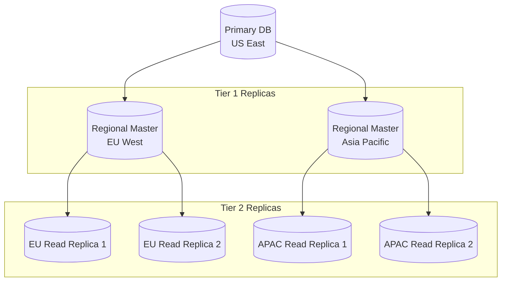
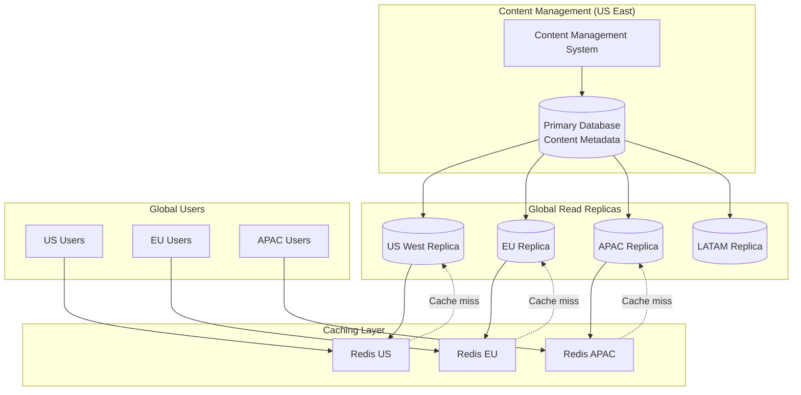
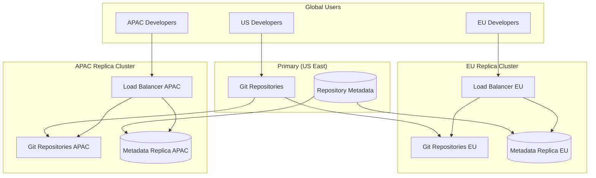

## The Complete Blueprint

Read Replicas pattern enables horizontal scaling of database read operations by maintaining synchronized copies of your primary database that handle queries while the primary focuses on writes. This pattern transforms read-heavy applications from bottlenecked single-database architectures into distributed systems capable of handling massive read workloads across geographic regions. The pattern operates through asynchronous replication where changes from the primary database are continuously propagated to one or more read-only replicas, allowing applications to distribute read queries across multiple database instances while centralizing writes to maintain data consistency. Advanced implementations support cross-region replicas for global applications, automatic failover for high availability, and intelligent read routing that considers replica lag and geographic proximity. This pattern has become fundamental for modern applications requiring high read throughput, global data access, and separation of analytical workloads from transactional operations.



### What You'll Master

- **Read-Write Splitting**: Implement intelligent query routing that directs writes to primary and reads to replicas
- **Replication Topologies**: Design master-slave, master-master, and chain replication architectures
- **Lag Management**: Handle replication lag and implement read-your-writes consistency patterns
- **Geographic Distribution**: Deploy cross-region replicas for global applications and disaster recovery
- **Failover Strategies**: Implement automatic replica promotion during primary database failures
- **Performance Optimization**: Optimize replica configurations for different workload patterns

# Read Replicas Pattern

!!! success "🏆 Gold Standard Pattern"
    **Database Read Scaling** • Netflix, Amazon, Shopify proven
    
    Essential for read-heavy applications requiring global scale and high availability. Enables horizontal scaling of database reads while maintaining write consistency.

## Essential Question
**How do we scale database read performance beyond a single instance while maintaining data consistency and availability?**

## When to Use / When NOT to Use

### Use When
| Scenario | Example | Impact |
|----------|---------|--------|
| Read-heavy workloads (>70% reads) | E-commerce product catalogs | 5-10x read performance increase |
| Global applications | Multi-region SaaS platforms | <100ms read latency worldwide |
| Analytics separation | Business intelligence queries | Isolate heavy analytics from OLTP |
| High availability needs | Mission-critical applications | 99.9%+ availability with failover |

### DON'T Use When
| Scenario | Why | Alternative |
|----------|-----|-------------|
| Write-heavy workloads (>50% writes) | Replicas can't help write bottlenecks | Database sharding |
| Strong consistency requirements | Async replication has lag | Synchronous replication or single DB |
| Simple applications | Added complexity not justified | Vertical scaling |
| Small datasets (<10GB) | Single instance sufficient | Database optimization |

### Decision Matrix

| Factor | Score (1-5) | Reasoning |
|--------|-------------|-----------|
| **Complexity** | 3 | Moderate complexity implementing read-write splitting, monitoring lag, and failover procedures |
| **Performance Impact** | 5 | Dramatic read performance improvement with proper implementation and workload distribution |
| **Operational Overhead** | 3 | Requires monitoring replication lag, managing multiple databases, and coordination procedures |
| **Team Expertise Required** | 3 | Understanding of replication concepts, database administration, and distributed system consistency |
| **Scalability** | 5 | Excellent horizontal read scaling with ability to add replicas based on demand |

**Overall Recommendation**: ✅ **RECOMMENDED** - Gold standard pattern for read-heavy applications requiring scale and availability.

## Level 1: Intuition (5 min)

### The Library Branch Analogy
<div class="axiom-box">
Like a library system with multiple branches: the main library (primary) handles book purchases and cataloging (writes), while branch libraries (replicas) serve readers with copies of books (reads). Changes at the main library are periodically synchronized to all branches.
</div>

### Read vs Write Distribution
| Operation Type | Destination | Latency | Consistency |
|----------------|-------------|---------|-------------|
| **Writes** | Primary database only | Normal | Strong |
| **Reads** | Any replica | Reduced | Eventually consistent |
| **Critical Reads** | Primary database | Normal | Strong |
| **Analytics** | Dedicated replica | Optimized | Eventual |

## Level 2: Foundation (10 min)

### Replication Architecture Types

#### 1. Master-Slave Architecture
```json
{
  "topology": "master-slave",
  "components": {
    "master": "single write node",
    "slaves": "multiple read-only nodes",
    "replication": "async from master to slaves"
  },
  "use_case": "Standard read scaling"
}
```

#### 2. Master-Master Architecture
```json
{
  "topology": "master-master", 
  "components": {
    "masters": "multiple write-capable nodes",
    "replication": "bidirectional async",
    "conflict_resolution": "required"
  },
  "use_case": "Multi-region writes with conflict resolution"
}
```

#### 3. Chain Replication
```json
{
  "topology": "chain",
  "components": {
    "head": "writes only",
    "middle": "replication only", 
    "tail": "reads only"
  },
  "use_case": "Strong consistency with read scaling"
}
```

### Replication Methods

| Method | Consistency | Performance | Complexity | Use Case |
|--------|-------------|-------------|------------|----------|
| **Asynchronous** | Eventual | High | Low | Standard read replicas |
| **Semi-Synchronous** | Strong with lag | Medium | Medium | Important transactions |
| **Synchronous** | Strong | Low | High | Critical consistency needs |

## Level 3: Deep Dive (15 min)

### Implementation Patterns

#### 1. Application-Level Read-Write Splitting

```python
# Production-ready read-write splitting implementation
import random
from typing import List, Optional
from dataclasses import dataclass
from enum import Enum

class ReplicaHealth(Enum):
    HEALTHY = "healthy"
    LAGGING = "lagging" 
    UNHEALTHY = "unhealthy"

@dataclass
class ReplicaConfig:
    host: str
    port: int
    weight: int = 1
    max_lag_seconds: int = 60
    region: str = "default"

class DatabaseRouter:
    """Intelligent database routing for read replicas"""
    
    def __init__(self, primary_config: dict, replica_configs: List[ReplicaConfig]):
        self.primary = self.create_connection(primary_config)
        self.replicas = {r.host: self.create_connection(r.__dict__) for r in replica_configs}
        self.replica_configs = {r.host: r for r in replica_configs}
        self.replica_health = {}
        
    def execute_write(self, query: str, params: dict = None):
        """All writes go to primary"""
        return self.primary.execute(query, params)
        
    def execute_read(self, query: str, params: dict = None, 
                    consistency: str = "eventual", region: str = None):
        """Intelligent read routing with consistency preferences"""
        
        if consistency == "strong":
            return self.primary.execute(query, params)
            
        # Get healthy replicas
        healthy_replicas = self.get_healthy_replicas(region)
        
        if not healthy_replicas:
            # Fallback to primary if no healthy replicas
            return self.primary.execute(query, params)
            
        # Weighted random selection
        replica = self.select_replica(healthy_replicas)
        
        try:
            return replica.execute(query, params)
        except Exception as e:
            # Fallback to primary on replica failure
            self.mark_replica_unhealthy(replica)
            return self.primary.execute(query, params)
    
    def get_healthy_replicas(self, region: str = None) -> List:
        """Get replicas that are healthy and within acceptable lag"""
        healthy = []
        
        for host, replica in self.replicas.items():
            config = self.replica_configs[host]
            
            # Filter by region if specified
            if region and config.region != region:
                continue
                
            # Check health and lag
            if self.check_replica_health(host):
                healthy.append((host, replica, config.weight))
                
        return healthy
    
    def check_replica_health(self, host: str) -> bool:
        """Check replica health and replication lag"""
        try:
            replica = self.replicas[host]
            config = self.replica_configs[host]
            
            # Check replication lag
            lag_query = "SELECT EXTRACT(EPOCH FROM (now() - pg_last_xact_replay_timestamp()))"
            result = replica.execute(lag_query)
            lag_seconds = result[0][0] if result else float('inf')
            
            if lag_seconds > config.max_lag_seconds:
                self.replica_health[host] = ReplicaHealth.LAGGING
                return False
                
            # Basic connectivity check
            replica.execute("SELECT 1")
            self.replica_health[host] = ReplicaHealth.HEALTHY
            return True
            
        except Exception:
            self.replica_health[host] = ReplicaHealth.UNHEALTHY
            return False
    
    def select_replica(self, healthy_replicas: List) -> object:
        """Weighted random selection of replica"""
        if not healthy_replicas:
            return None
            
        total_weight = sum(weight for _, _, weight in healthy_replicas)
        random_value = random.uniform(0, total_weight)
        
        cumulative_weight = 0
        for host, replica, weight in healthy_replicas:
            cumulative_weight += weight
            if random_value <= cumulative_weight:
                return replica
                
        return healthy_replicas[0][1]  # Fallback to first replica

# Usage example
router = DatabaseRouter(
    primary_config={"host": "primary.db", "port": 5432},
    replica_configs=[
        ReplicaConfig("replica1.db", 5432, weight=2, region="us-east"),
        ReplicaConfig("replica2.db", 5432, weight=1, region="us-west"),
        ReplicaConfig("analytics.db", 5432, weight=3, region="us-east")
    ]
)

# Write operations
router.execute_write("INSERT INTO users (name, email) VALUES (%s, %s)", 
                    ("John Doe", "john@example.com"))

# Read operations with different consistency levels
users = router.execute_read("SELECT * FROM users WHERE active = true")
user_detail = router.execute_read("SELECT * FROM users WHERE id = %s", 
                                 (user_id,), consistency="strong")
analytics = router.execute_read("SELECT COUNT(*) FROM user_events", 
                               region="us-east")
```

#### 2. Connection Pool Management

```python
# Advanced connection pool management for read replicas
import asyncio
import asyncpg
from typing import Dict, List
import time

class ReplicaConnectionPool:
    """Manages connection pools for primary and replica databases"""
    
    def __init__(self, primary_dsn: str, replica_dsns: List[str]):
        self.primary_pool = None
        self.replica_pools = {}
        self.primary_dsn = primary_dsn
        self.replica_dsns = replica_dsns
        self.health_check_interval = 30
        self.max_lag_threshold = 60
        
    async def initialize(self):
        """Initialize connection pools"""
        # Primary pool
        self.primary_pool = await asyncpg.create_pool(
            self.primary_dsn,
            min_size=5,
            max_size=20,
            command_timeout=60
        )
        
        # Replica pools
        for i, dsn in enumerate(self.replica_dsns):
            self.replica_pools[f"replica_{i}"] = await asyncpg.create_pool(
                dsn,
                min_size=3,
                max_size=15,
                command_timeout=30
            )
        
        # Start health monitoring
        asyncio.create_task(self.monitor_replica_health())
    
    async def execute_write(self, query: str, *args):
        """Execute write on primary"""
        async with self.primary_pool.acquire() as conn:
            return await conn.fetch(query, *args)
    
    async def execute_read(self, query: str, *args, 
                          prefer_replica: bool = True,
                          max_lag: int = None):
        """Execute read with replica preference"""
        
        if not prefer_replica:
            async with self.primary_pool.acquire() as conn:
                return await conn.fetch(query, *args)
        
        # Try replicas first
        healthy_replicas = await self.get_healthy_replicas(max_lag)
        
        if healthy_replicas:
            replica_name = random.choice(healthy_replicas)
            try:
                async with self.replica_pools[replica_name].acquire() as conn:
                    return await conn.fetch(query, *args)
            except Exception:
                # Fallback to primary
                pass
        
        # Fallback to primary
        async with self.primary_pool.acquire() as conn:
            return await conn.fetch(query, *args)
    
    async def get_healthy_replicas(self, max_lag: int = None) -> List[str]:
        """Get list of healthy replica names"""
        healthy = []
        max_lag = max_lag or self.max_lag_threshold
        
        for name, pool in self.replica_pools.items():
            try:
                async with pool.acquire() as conn:
                    # Check replication lag
                    lag_result = await conn.fetchval("""
                        SELECT EXTRACT(EPOCH FROM (now() - pg_last_xact_replay_timestamp()))
                    """)
                    
                    if lag_result is None or lag_result <= max_lag:
                        healthy.append(name)
                        
            except Exception:
                continue
        
        return healthy
    
    async def monitor_replica_health(self):
        """Background task to monitor replica health"""
        while True:
            try:
                for name, pool in self.replica_pools.items():
                    try:
                        async with pool.acquire() as conn:
                            await conn.execute("SELECT 1")
                            # Log health status
                    except Exception as e:
                        # Log unhealthy replica
                        pass
                        
                await asyncio.sleep(self.health_check_interval)
            except Exception:
                await asyncio.sleep(5)
```

### Common Patterns & Anti-Patterns

#### Do's ✓
- Implement read-write splitting at application layer
- Monitor replication lag continuously 
- Use connection pooling for both primary and replicas
- Implement graceful degradation when replicas fail
- Consider geographic proximity for replica selection
- Separate analytical workloads to dedicated replicas

#### Don'ts ✗
- Route writes to replicas (data loss risk)
- Ignore replication lag in critical reads
- Use replicas for transactions requiring strong consistency
- Create too many replicas (management overhead)
- Forget to monitor replica health and performance

## Level 4: Expert (20 min)

### Advanced Replication Topologies

#### 1. Cascading Replication


**Benefits**: Reduces load on primary, enables regional distribution
**Use Case**: Global applications with heavy read workloads

#### 2. Cross-Region Disaster Recovery

| Component | Primary Region | DR Region | Failover Time |
|-----------|----------------|-----------|---------------|
| **Primary DB** | Active | Standby replica | 30-60 seconds |
| **Application** | Active | Warm standby | 2-5 minutes |
| **Load Balancer** | Active | DNS failover | 1-2 minutes |
| **Data Sync** | Real-time | <5 seconds lag | N/A |

### Performance Optimization Strategies

#### Replica Configuration Tuning

```sql
-- PostgreSQL replica optimization
-- On replica servers
shared_preload_libraries = 'pg_stat_statements'
max_connections = 200
shared_buffers = '4GB'
effective_cache_size = '12GB' 
work_mem = '64MB'
maintenance_work_mem = '1GB'

-- Read-only optimizations
hot_standby = on
max_standby_streaming_delay = 30s
hot_standby_feedback = on

-- Monitoring settings
log_min_duration_statement = 1000
log_checkpoints = on
log_connections = on
log_disconnections = on
```

#### Lag Monitoring and Alerting

```python
# Advanced replication lag monitoring
class ReplicationMonitor:
    """Monitor replication lag and performance"""
    
    def __init__(self, replicas: List[ReplicaConfig]):
        self.replicas = replicas
        self.lag_thresholds = {
            'warning': 30,  # seconds
            'critical': 300  # seconds
        }
    
    async def check_all_replicas(self):
        """Check lag for all replicas"""
        results = {}
        
        for replica in self.replicas:
            try:
                lag_info = await self.check_replica_lag(replica)
                results[replica.host] = lag_info
                
                # Alert on thresholds
                if lag_info['lag_seconds'] > self.lag_thresholds['critical']:
                    await self.send_alert('critical', replica, lag_info)
                elif lag_info['lag_seconds'] > self.lag_thresholds['warning']:
                    await self.send_alert('warning', replica, lag_info)
                    
            except Exception as e:
                results[replica.host] = {'error': str(e)}
                await self.send_alert('error', replica, {'error': str(e)})
        
        return results
    
    async def check_replica_lag(self, replica: ReplicaConfig) -> Dict:
        """Get detailed lag information for a replica"""
        conn = await asyncpg.connect(
            host=replica.host,
            port=replica.port,
            database='postgres'
        )
        
        try:
            # Get replication stats
            result = await conn.fetchrow("""
                SELECT 
                    pg_last_wal_receive_lsn(),
                    pg_last_wal_replay_lsn(),
                    EXTRACT(EPOCH FROM (now() - pg_last_xact_replay_timestamp())) as lag_seconds,
                    pg_is_wal_replay_paused()
            """)
            
            # Get replica status
            status = await conn.fetchrow("""
                SELECT 
                    state,
                    sent_lsn,
                    write_lsn,
                    flush_lsn,
                    replay_lsn
                FROM pg_stat_replication 
                WHERE application_name = $1
            """, replica.host)
            
            return {
                'lag_seconds': result['lag_seconds'] or 0,
                'receive_lsn': result['pg_last_wal_receive_lsn'],
                'replay_lsn': result['pg_last_wal_replay_lsn'],
                'replay_paused': result['pg_is_wal_replay_paused'],
                'replication_state': status['state'] if status else 'unknown'
            }
            
        finally:
            await conn.close()
```

## Level 5: Mastery (25 min)

### Real-World Case Studies

#### Case Study 1: Netflix - Global Content Metadata

**Challenge**: Serve movie/show metadata to 230M+ subscribers globally with <100ms latency

**Implementation**:
- **Primary**: Single writer in US East for content updates
- **Regional Replicas**: Read replicas in 15+ regions worldwide
- **Caching Layer**: Redis caches in front of replicas for hot data
- **Smart Routing**: Application routes reads to nearest healthy replica

**Architecture**:


**Results**:
- **Global Latency**: <50ms P95 for content metadata queries
- **Availability**: 99.99% uptime with automatic failover
- **Scale**: 1B+ metadata requests per day
- **Consistency**: Content updates propagated globally within 5 seconds

#### Case Study 2: Shopify - Merchant Analytics

**Challenge**: Provide real-time analytics to 2M+ merchants without impacting transaction processing

**Implementation**:
- **Transactional**: Primary handles all orders, payments, inventory updates
- **Analytics Replica**: Dedicated replica optimized for heavy analytical queries
- **ETL Pipeline**: Continuous data sync to data warehouse
- **Query Optimization**: Analytical queries optimized for replica hardware

**Replication Strategy**:

| Workload Type | Database | Optimization | Update Frequency |
|---------------|----------|--------------|------------------|
| **Order Processing** | Primary | OLTP optimized, fast writes | Real-time |
| **Merchant Dashboards** | Read replica | Query optimization, indexes | 30 second lag |
| **Business Intelligence** | Analytics replica | Columnar storage, aggregations | 5 minute lag |
| **Reporting** | Data warehouse | Historical data, complex queries | Hourly batch |

**Results**:
- **Transaction Performance**: No impact on checkout performance
- **Analytics Speed**: 80% faster dashboard loading times  
- **Resource Isolation**: Analytics queries don't affect transactional load
- **Scalability**: Independent scaling of analytical and transactional workloads

#### Case Study 3: GitHub - Global Git Operations

**Challenge**: Serve git operations globally while maintaining repository consistency

**Implementation**:
- **Git Storage**: Distributed replicas for git repositories
- **Metadata**: Database replicas for repository metadata and permissions
- **Geographic Routing**: Route git operations to nearest replica cluster
- **Eventual Consistency**: Accept eventual consistency for non-critical operations

**Multi-Tier Architecture**:



**Results**:
- **Global Performance**: 70% reduction in git clone times globally
- **High Availability**: Regional failover with <30 second detection
- **Scale**: 100M+ repositories with global access
- **Developer Experience**: <200ms response time for git operations

### Production Checklist

#### Pre-Deployment
- [ ] Analyzed read/write ratio to confirm replica benefit (>70% reads)
- [ ] Designed replication topology for requirements
- [ ] Configured monitoring for replication lag and health
- [ ] Implemented read-write splitting in application code
- [ ] Set up connection pooling for primary and replicas
- [ ] Established replica promotion procedures
- [ ] Configured backup and recovery for all instances

#### Deployment
- [ ] Deployed replicas with proper configuration
- [ ] Verified replication is working and lag is acceptable
- [ ] Tested application with read-write splitting
- [ ] Validated failover procedures work correctly
- [ ] Set up monitoring dashboards and alerts
- [ ] Load tested with realistic traffic patterns
- [ ] Documented operational procedures

#### Post-Deployment
- [ ] Monitor replication lag continuously
- [ ] Track query distribution across replicas
- [ ] Optimize replica performance based on workload
- [ ] Test disaster recovery procedures regularly
- [ ] Review and tune alert thresholds
- [ ] Plan for replica scaling based on growth
- [ ] Document lessons learned and best practices

### Migration Strategies

#### Phase 1: Single Read Replica (Week 1-2)
- Deploy single read replica
- Implement basic read-write splitting
- Monitor performance and lag
- Validate application behavior

#### Phase 2: Multiple Replicas (Week 3-4)  
- Add additional read replicas
- Implement load balancing across replicas
- Add replica health monitoring
- Optimize query distribution

#### Phase 3: Geographic Distribution (Month 2)
- Deploy cross-region replicas
- Implement geographic routing
- Add disaster recovery procedures
- Optimize for global performance

#### Phase 4: Advanced Optimization (Month 3+)
- Implement predictive scaling
- Add specialized analytical replicas
- Optimize replication topology
- Fine-tune for specific workloads

## Quick Reference

### Replication Configuration Examples

#### MySQL Read Replica Setup
```sql
-- Primary server configuration
[mysqld]
server-id = 1
log-bin = mysql-bin
binlog-format = ROW
sync_binlog = 1
innodb_flush_log_at_trx_commit = 1

-- Read replica configuration  
[mysqld]
server-id = 2
relay-log = relay-bin
read_only = 1
log_slave_updates = 1
slave_parallel_workers = 4
```

#### PostgreSQL Streaming Replication
```sql
-- Primary postgresql.conf
wal_level = replica
max_wal_senders = 10
wal_keep_segments = 32
synchronous_commit = off

-- Replica postgresql.conf
hot_standby = on
max_standby_streaming_delay = 30s
hot_standby_feedback = on
```

#### AWS RDS Read Replica
```python
# Create read replica via AWS SDK
import boto3

rds = boto3.client('rds')

response = rds.create_db_instance_read_replica(
    DBInstanceIdentifier='myapp-read-replica-1',
    SourceDBInstanceIdentifier='myapp-primary',
    DBInstanceClass='db.r5.xlarge',
    AvailabilityZone='us-west-2b',
    MultiAZ=False,
    PubliclyAccessible=False,
    MonitoringInterval=60,
    EnablePerformanceInsights=True
)
```

## Related Patterns
- **[Load Balancing](./load-balancing.md)**: Distributes traffic across read replicas
- **[Circuit Breaker](../resilience/circuit-breaker.md)**: Handles replica failures gracefully  
- **[Database Sharding](./sharding.md)**: Complements read replicas for write scaling
- **[Caching](./caching-strategies.md)**: Reduces load on both primary and replicas
- **[Health Check](../resilience/health-check.md)**: Monitors replica health and availability

## References
1. Amazon (2023). "Amazon RDS Read Replicas" - AWS Documentation
2. PostgreSQL (2023). "High Availability, Load Balancing, and Replication" - Official Docs
3. MySQL (2023). "Replication" - MySQL 8.0 Reference Manual
4. Netflix (2021). "Scaling Netflix's Data Infrastructure" - Engineering Blog
5. GitHub (2020). "How GitHub Scaled Git Repository Access" - Engineering Blog