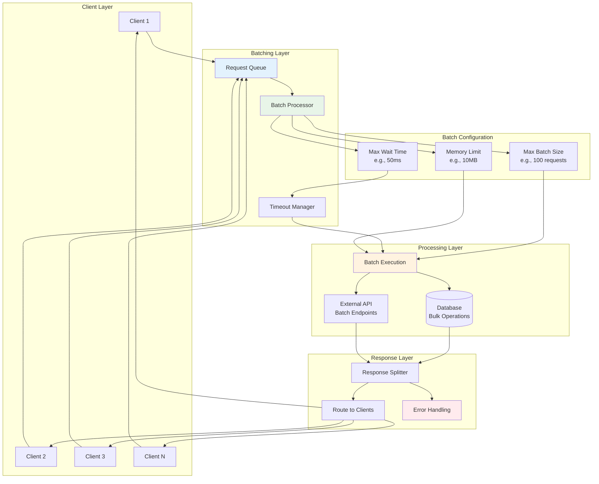
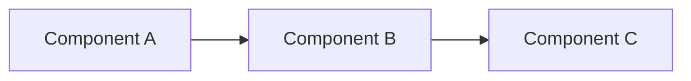
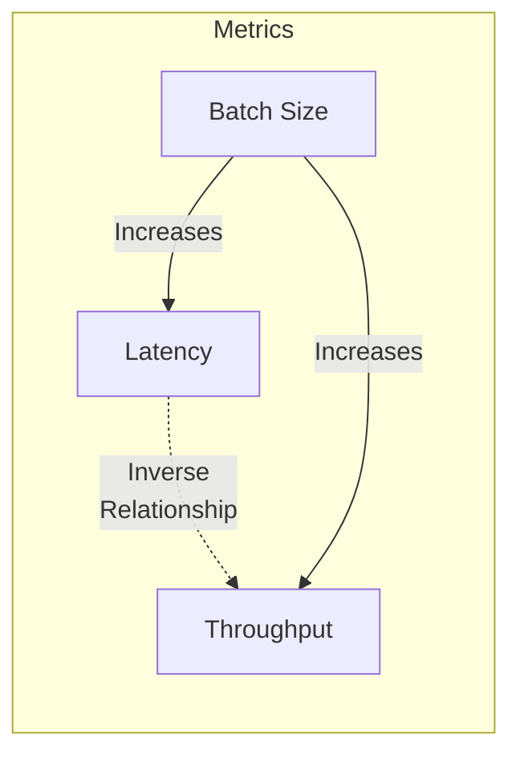
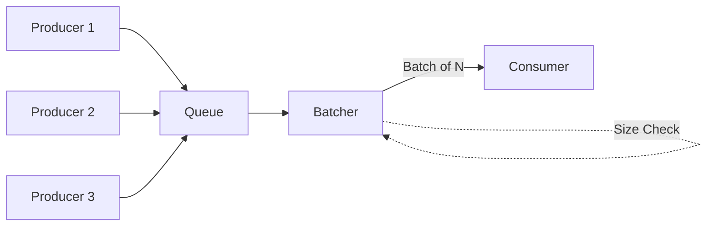
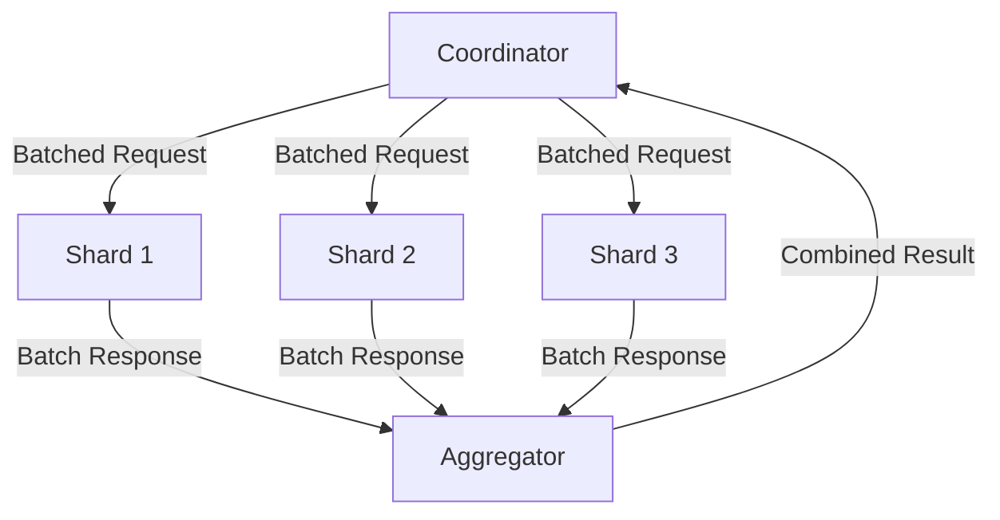
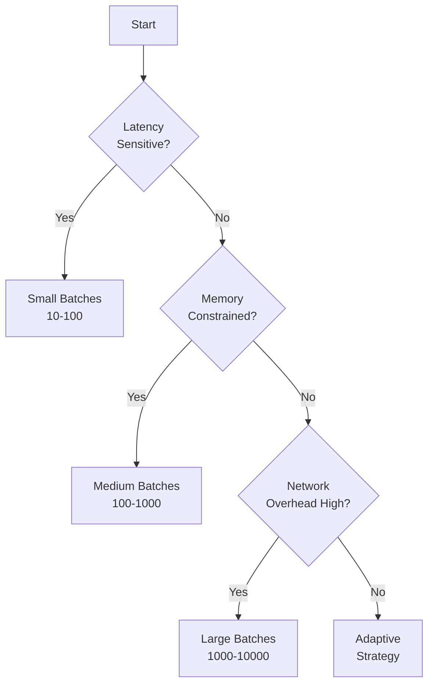
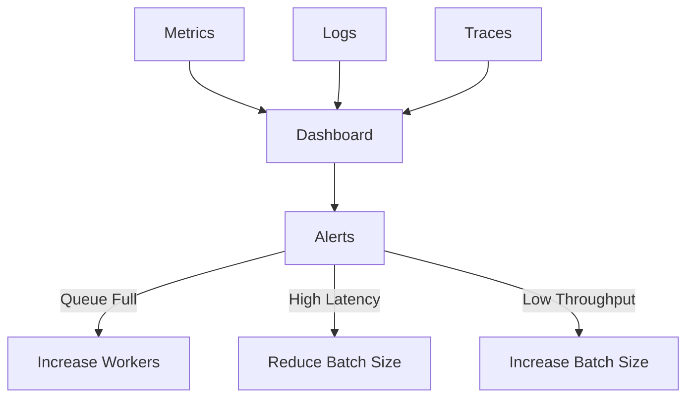

## The Complete Blueprint

Request batching is a performance optimization pattern that aggregates multiple individual operations into larger, more efficient batch operations to amortize fixed costs and dramatically improve system throughput. Instead of processing each request individually with its associated overhead (network round-trips, protocol handshakes, context switching), this pattern collects multiple requests over a time window or until a size threshold is reached, then processes them together as a single unit. The pattern transforms high-overhead individual operations into efficient bulk operations, particularly effective when fixed costs dominate variable costs—such as database connections, network latency, or authentication overhead. Request batching can improve throughput by 10-100x for small operations while trading individual request latency for overall system efficiency. The pattern requires careful tuning of batch sizes and timeout windows to balance latency requirements with throughput gains, and works best with homogeneous operations that can be meaningfully grouped together. Success depends on implementing proper error handling for partial batch failures, managing memory usage for request buffering, and designing idempotent operations to handle retry scenarios.

### What You'll Master

By implementing request batching, you'll achieve **throughput multiplication** where small operations become 10-100x more efficient through fixed cost amortization, **resource optimization** that reduces network round-trips and connection overhead, **scalability enhancement** that allows systems to handle much higher request volumes without proportional resource increases, **latency management** through careful tuning of batch sizes and timeouts for your specific workload patterns, and **operational efficiency** where infrastructure costs decrease while maintaining or improving service quality. You'll master the critical balance between individual request latency and system-wide throughput optimization.

## Essential Question

**How do we handle increasing load without sacrificing performance using request batching/pipelining?**

## When to Use / When NOT to Use

### When to Use

| Scenario | Why It Fits | Example |
|----------|-------------|---------|
| High-volume APIs | Amortizes per-request overhead | Database bulk operations |
| Network-bound operations | Reduces round trips | GraphQL query batching |
| Similar requests | Groups compatible operations | Cache warming |
| Fixed processing costs | Spreads costs across requests | Bulk email sending |

### When NOT to Use

| Scenario | Why to Avoid | Example |
|----------|--------------|---------|
| Real-time systems | Added latency violates SLAs | Gaming, trading systems |
| Large individual items | Minimal benefit from batching | 1MB+ file uploads |
| Heterogeneous operations | Mixing types causes conflicts | Read + write operations |
| Stateful operations | Depend on previous results | Sequential transactions |
| Memory-constrained | Buffering causes OOM | Edge devices, lambdas |

# Request Batching/Pipelining

!!! warning "🥈 Silver Tier Pattern"
    **Massive throughput gains with latency trade-offs** • Use when amortizing fixed costs matters more than individual request latency
    
    Request batching can improve throughput by 10-100x for small operations, but adds complexity in error handling and increases p99 latency. Requires careful tuning of batch sizes and timeouts for each use case.

## The Pattern

Request batching and pipelining are performance optimization techniques that amortize fixed costs across multiple operations by grouping them together.

  

    <h3>🎯 Purpose</h3>
    
Transform multiple individual requests into grouped operations to reduce overhead and improve throughput

  

  

    <h3>🔧 Problem</h3>
    
Individual requests incur fixed costs (network RTT, protocol overhead, context switching) that dominate for small operations

  

  

    <h3>💡 Solution</h3>
    
Aggregate multiple requests and process them together, amortizing fixed costs across the batch

  

## Core Concepts

### Batching vs Pipelining

| Aspect | Batching | Pipelining |
|--------|----------|------------|
| **Mechanism** | Combine multiple requests into one | Send requests without waiting for responses |
| **Latency** | Higher (wait for batch) | Lower (immediate send) |
| **Throughput** | Maximum | High |
| **Complexity** | Medium | Low |
| **Error Handling** | All-or-nothing | Per-request |
| **Memory Usage** | Higher (buffering) | Lower |

## Level 1: Intuition (5 minutes)

*Start your journey with relatable analogies*

### The Elevator Pitch
[Pattern explanation in simple terms]

### Real-World Analogy
[Everyday comparison that explains the concept]

## Level 2: Foundation (10 minutes)

*Build core understanding*

### Core Concepts
- Key principle 1
- Key principle 2
- Key principle 3

### Basic Example

## Level 3: Deep Dive (15 minutes)

*Understand implementation details*

### How It Really Works
[Technical implementation details]

### Common Patterns
[Typical usage patterns]

## Level 4: Expert (20 minutes)

*Master advanced techniques*

### Advanced Configurations
[Complex scenarios and optimizations]

### Performance Tuning
[Optimization strategies]

## Level 5: Mastery (30 minutes)

*Apply in production*

### Real-World Case Studies
[Production examples from major companies]

### Lessons from the Trenches
[Common pitfalls and solutions]

## Decision Matrix

### Quick Decision Table

| Factor | Low Complexity | Medium Complexity | High Complexity |
|--------|----------------|-------------------|-----------------|
| Team Size | < 5 developers | 5-20 developers | > 20 developers |
| Traffic | < 1K req/s | 1K-100K req/s | > 100K req/s |
| Data Volume | < 1GB | 1GB-1TB | > 1TB |
| **Recommendation** | ❌ Avoid | ⚠️ Consider | ✅ Implement |

## Implementation Strategies

### Strategy Comparison

| Strategy | Pros | Cons | Use When |
|----------|------|------|----------|
| **Time-Based** | Predictable latency | May send small batches | Latency-sensitive |
| **Size-Based** | Optimal batch size | Unpredictable latency | Throughput-focused |
| **Hybrid** | Balanced approach | More complex | General purpose |
| **Adaptive** | Self-tuning | Most complex | Variable workloads |

### Adaptive Batching Algorithm

## Performance Characteristics

### Latency vs Throughput Trade-off

📄 View mermaid code (7 lines)

| Batch Size | Latency | Throughput | Overhead/Request |
|------------|---------|------------|------------------|
| 1 | Minimum | Minimum | Maximum |
| 10 | +5ms | 8x | 10% |
| 100 | +20ms | 50x | 1% |
| 1000 | +100ms | 200x | 0.1% |

### Cost Analysis

<h4>🔍 When Batching Wins</h4>

**Fixed Cost per Request**: `C_fixed`  
**Variable Cost per Item**: `C_var`  
**Batch Size**: `N`

**Without Batching**: `N × (C_fixed + C_var)`  
**With Batching**: `C_fixed + N × C_var`

**Savings**: `(N - 1) × C_fixed`

## Real-World Implementations

### Redis Pipelining

**Performance Impact**:
- Single commands: ~100 ops/sec (network limited)
- Pipelined: ~500,000 ops/sec (CPU limited)
- 5000x improvement for small operations

### HTTP/2 Multiplexing

### Database Batch Operations

| Operation Type | Individual Time | Batch Time (1000) | Speedup |
|----------------|-----------------|-------------------|---------|
| INSERT | 5ms × 1000 = 5s | 50ms | 100x |
| UPDATE | 4ms × 1000 = 4s | 40ms | 100x |
| DELETE | 3ms × 1000 = 3s | 30ms | 100x |

## Level 1: Intuition (5 minutes)

*Start your journey with relatable analogies*

### The Elevator Pitch
[Pattern explanation in simple terms]

### Real-World Analogy
[Everyday comparison that explains the concept]

## Level 2: Foundation (10 minutes)

*Build core understanding*

### Core Concepts
- Key principle 1
- Key principle 2
- Key principle 3

### Basic Example

## Level 3: Deep Dive (15 minutes)

*Understand implementation details*

### How It Really Works
[Technical implementation details]

### Common Patterns
[Typical usage patterns]

## Level 4: Expert (20 minutes)

*Master advanced techniques*

### Advanced Configurations
[Complex scenarios and optimizations]

### Performance Tuning
[Optimization strategies]

## Level 5: Mastery (30 minutes)

*Apply in production*

### Real-World Case Studies
[Production examples from major companies]

### Lessons from the Trenches
[Common pitfalls and solutions]

## Decision Matrix

### Quick Decision Table

| Factor | Low Complexity | Medium Complexity | High Complexity |
|--------|----------------|-------------------|-----------------|
| Team Size | < 5 developers | 5-20 developers | > 20 developers |
| Traffic | < 1K req/s | 1K-100K req/s | > 100K req/s |
| Data Volume | < 1GB | 1GB-1TB | > 1TB |
| **Recommendation** | ❌ Avoid | ⚠️ Consider | ✅ Implement |

## Implementation Patterns

### Producer-Consumer with Batching

📄 View mermaid code (10 lines)

### Scatter-Gather with Batching

📄 View mermaid code (10 lines)

## Anti-Patterns and Pitfalls

<h4>❌ Common Batching Failures</h4>

**Avoid these scenarios where batching often backfires:**

1. **Large Individual Items**: Batching 1MB objects provides minimal benefit
2. **Heterogeneous Operations**: Mixing reads and writes can cause conflicts  
3. **Real-time Systems**: Added latency violates SLA requirements
4. **Stateful Operations**: Operations that depend on previous results
5. **Limited Memory**: Buffering can cause OOM in constrained environments

### Implementation Pitfalls

| Pitfall | Symptom | Solution |
|---------|---------|----------|
| **Head-of-line Blocking** | One slow item delays entire batch | Use timeouts, split batches |
| **Memory Exhaustion** | OOM from large buffers | Set maximum batch size |
| **Latency Spikes** | P99 latency increases | Use hybrid strategy |
| **Error Amplification** | One error fails entire batch | Implement partial success |

## Design Decisions

### Choosing Batch Size

📄 View mermaid code (8 lines)

#
## Level 1: Intuition (5 minutes)

*Start your journey with relatable analogies*

### The Elevator Pitch
[Pattern explanation in simple terms]

### Real-World Analogy
[Everyday comparison that explains the concept]

## Level 2: Foundation (10 minutes)

*Build core understanding*

### Core Concepts
- Key principle 1
- Key principle 2
- Key principle 3

### Basic Example

## Level 3: Deep Dive (15 minutes)

*Understand implementation details*

### How It Really Works
[Technical implementation details]

### Common Patterns
[Typical usage patterns]

## Level 4: Expert (20 minutes)

*Master advanced techniques*

### Advanced Configurations
[Complex scenarios and optimizations]

### Performance Tuning
[Optimization strategies]

## Level 5: Mastery (30 minutes)

*Apply in production*

### Real-World Case Studies
[Production examples from major companies]

### Lessons from the Trenches
[Common pitfalls and solutions]

## Decision Matrix

### Quick Decision Table

| Factor | Low Complexity | Medium Complexity | High Complexity |
|--------|----------------|-------------------|-----------------|
| Team Size | < 5 developers | 5-20 developers | > 20 developers |
| Traffic | < 1K req/s | 1K-100K req/s | > 100K req/s |
| Data Volume | < 1GB | 1GB-1TB | > 1TB |
| **Recommendation** | ❌ Avoid | ⚠️ Consider | ✅ Implement |

## Implementation Checklist

<h4>✅ Batching Implementation Guide</h4>

**Must Have**:
- [ ] Maximum batch size limit
- [ ] Timeout mechanism
- [ ] Error handling per item
- [ ] Metrics collection
- [ ] Back-pressure handling

**Should Have**:
- [ ] Adaptive sizing
- [ ] Priority queues
- [ ] Partial batch sending
- [ ] Circuit breaker
- [ ] Request deduplication

**Nice to Have**:
- [ ] Compression
- [ ] Request coalescing
- [ ] Predictive batching
- [ ] Multi-level batching

## Performance Monitoring

### Key Metrics

| Metric | Description | Target |
|--------|-------------|--------|
| **Batch Size** | Items per batch | Depends on use case |
| **Queue Depth** | Pending items | < 1000 |
| **Batch Latency** | Time to fill batch | < 50ms |
| **Processing Time** | Batch execution time | < 100ms |
| **Throughput** | Items/second | Maximize |
| **Error Rate** | Failed batches | < 0.1% |

### Observability

📄 View mermaid code (9 lines)

## Related Patterns

- [Work Distribution](../../core-principles/pillars/1-work-distribution.md) - Batching as work distribution strategy
- [Circuit Breaker](../resilience/circuit-breaker.md) - Protecting batch processors
- [Bulkhead](../resilience/bulkhead.md) - Isolating batch processing
- [Queue-Based Load Leveling](queue-load-leveling.md) - Buffering for batches
- [Saga Pattern](../data-management/saga.md) - Managing batch transactions

## References

<h4>🔑 Key Insights</h4>

1. **Amortization is Key**: Fixed costs dominate small operations
2. **Latency vs Throughput**: Fundamental trade-off in batch sizing
3. **Adaptive is Best**: Self-tuning based on workload
4. **Partial Success**: Design for item-level error handling
5. **Monitor Everything**: Batch performance is highly workload-dependent

### Further Reading

- [Little's Law](../../architects-handbook/quantitative-analysis/littles-law.md) - Queue theory for batch systems
- [Queueing Theory](../../architects-handbook/quantitative-analysis/queueing-models.md) - Mathematical foundations
- [Capacity Planning](../../architects-handbook/quantitative-analysis/capacity-planning.md) - Sizing batch systems
- [Performance Testing](../../architects-handbook/human-factors/performance-testing.md) - Validating batch performance

