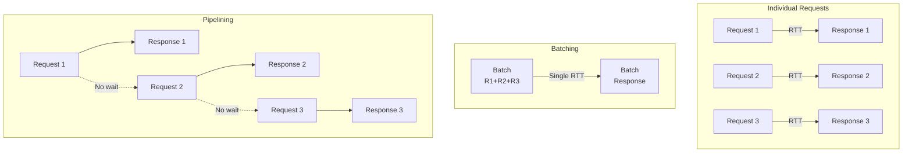
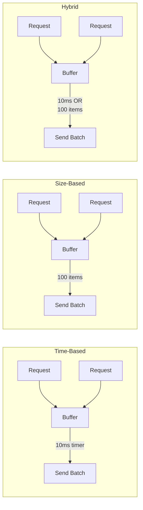
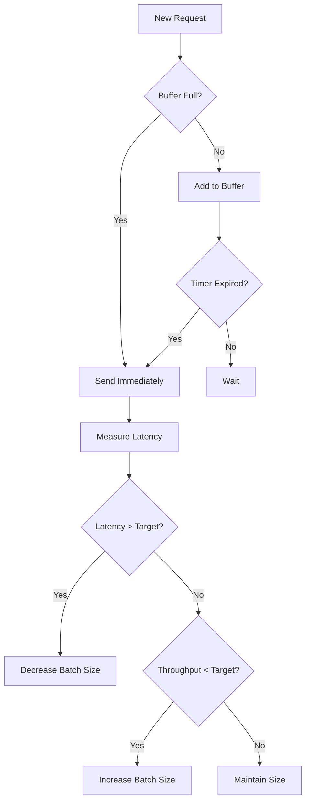
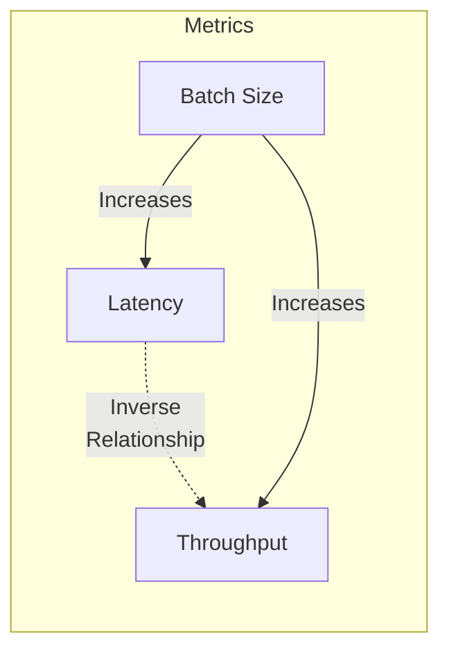
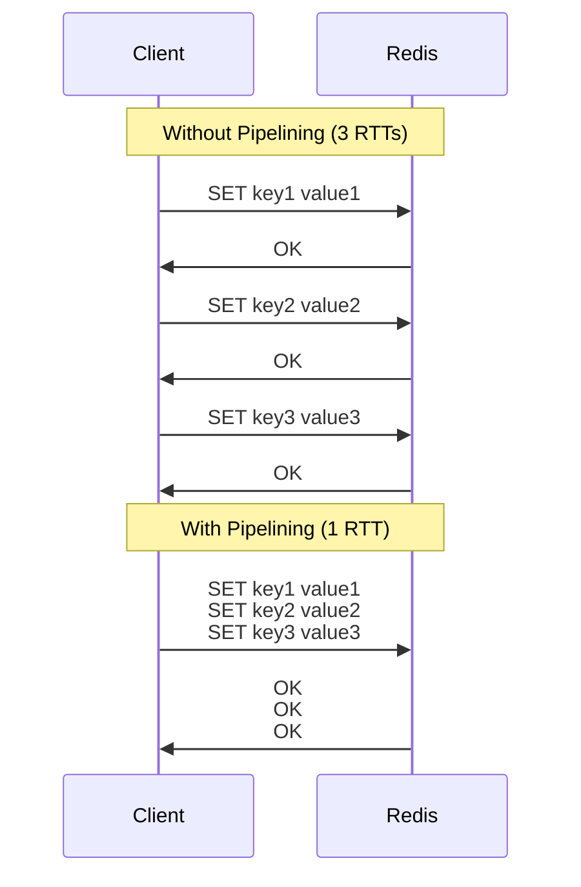
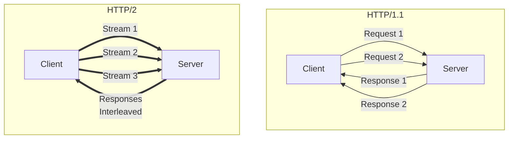
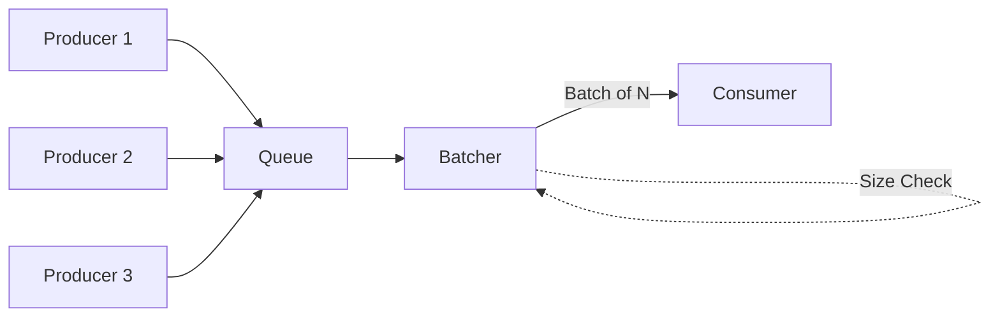
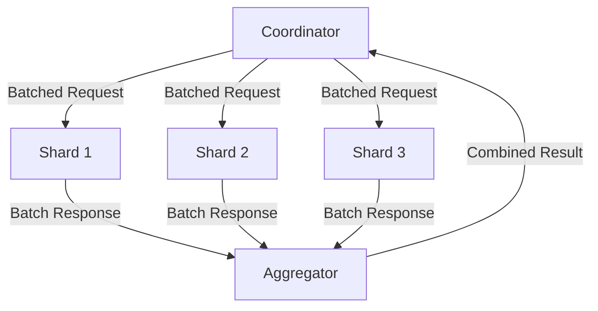
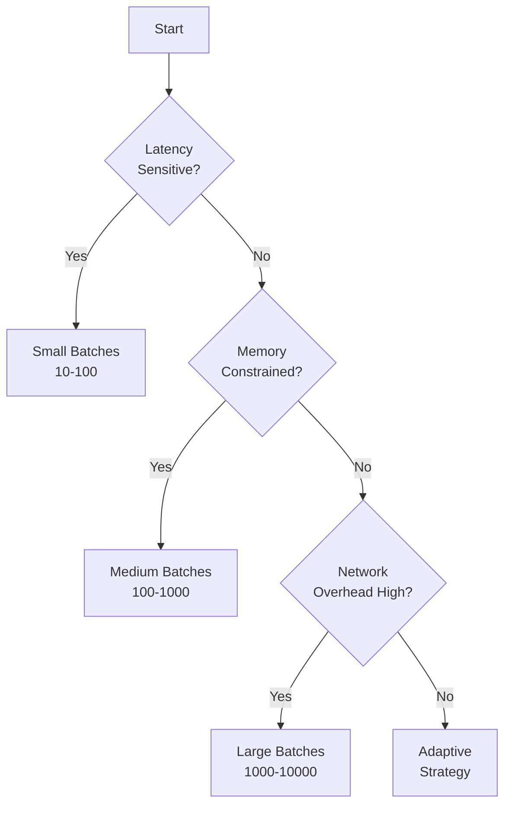
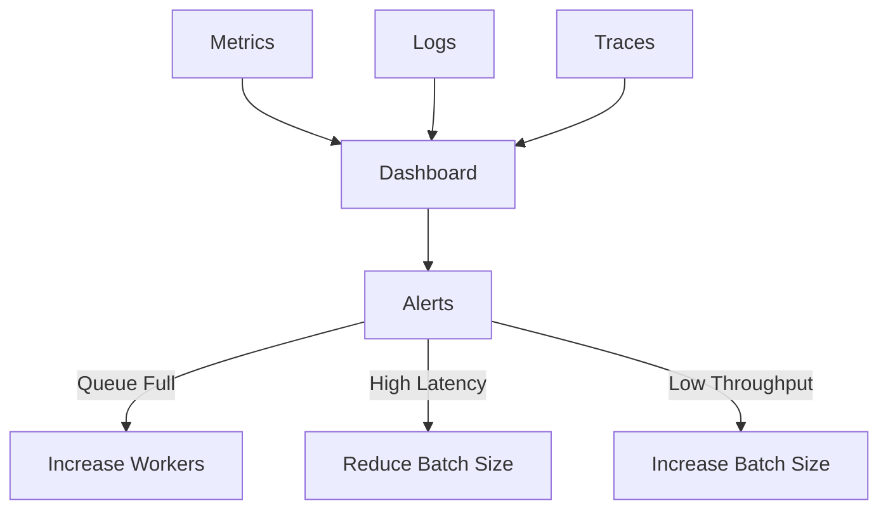

# Request Batching/Pipelining

!!! warning "🥈 Silver Tier Pattern"
    **Massive throughput gains with latency trade-offs** • Use when amortizing fixed costs matters more than individual request latency
    
    Request batching can improve throughput by 10-100x for small operations, but adds complexity in error handling and increases p99 latency. Requires careful tuning of batch sizes and timeouts for each use case.

## The Pattern

Request batching and pipelining are performance optimization techniques that amortize fixed costs across multiple operations by grouping them together.

  

    <h3>🎯 Purpose</h3>
    
Transform multiple individual requests into grouped operations to reduce overhead and improve throughput

  

  

    <h3>🔧 Problem</h3>
    
Individual requests incur fixed costs (network RTT, protocol overhead, context switching) that dominate for small operations

  

  

    <h3>💡 Solution</h3>
    
Aggregate multiple requests and process them together, amortizing fixed costs across the batch

  

## Core Concepts

### Batching vs Pipelining

| Aspect | Batching | Pipelining |
|--------|----------|------------|
| **Mechanism** | Combine multiple requests into one | Send requests without waiting for responses |
| **Latency** | Higher (wait for batch) | Lower (immediate send) |
| **Throughput** | Maximum | High |
| **Complexity** | Medium | Low |
| **Error Handling** | All-or-nothing | Per-request |
| **Memory Usage** | Higher (buffering) | Lower |

## Implementation Strategies

### Strategy Comparison

| Strategy | Pros | Cons | Use When |
|----------|------|------|----------|
| **Time-Based** | Predictable latency | May send small batches | Latency-sensitive |
| **Size-Based** | Optimal batch size | Unpredictable latency | Throughput-focused |
| **Hybrid** | Balanced approach | More complex | General purpose |
| **Adaptive** | Self-tuning | Most complex | Variable workloads |

### Adaptive Batching Algorithm

## Performance Characteristics

### Latency vs Throughput Trade-off

| Batch Size | Latency | Throughput | Overhead/Request |
|------------|---------|------------|------------------|
| 1 | Minimum | Minimum | Maximum |
| 10 | +5ms | 8x | 10% |
| 100 | +20ms | 50x | 1% |
| 1000 | +100ms | 200x | 0.1% |

### Cost Analysis

<h4>🔍 When Batching Wins</h4>

**Fixed Cost per Request**: `C_fixed`  
**Variable Cost per Item**: `C_var`  
**Batch Size**: `N`

**Without Batching**: `N × (C_fixed + C_var)`  
**With Batching**: `C_fixed + N × C_var`

**Savings**: `(N - 1) × C_fixed`

## Real-World Implementations

### Redis Pipelining

**Performance Impact**:
- Single commands: ~100 ops/sec (network limited)
- Pipelined: ~500,000 ops/sec (CPU limited)
- 5000x improvement for small operations

### HTTP/2 Multiplexing

### Database Batch Operations

| Operation Type | Individual Time | Batch Time (1000) | Speedup |
|----------------|-----------------|-------------------|---------|
| INSERT | 5ms × 1000 = 5s | 50ms | 100x |
| UPDATE | 4ms × 1000 = 4s | 40ms | 100x |
| DELETE | 3ms × 1000 = 3s | 30ms | 100x |

## Implementation Patterns

### Producer-Consumer with Batching

### Scatter-Gather with Batching

## Anti-Patterns

### When NOT to Use Batching

<h4>❌ Batching Failures</h4>

1. **Large Individual Items**: Batching 1MB objects provides minimal benefit
2. **Heterogeneous Operations**: Mixing reads and writes can cause conflicts
3. **Real-time Systems**: Added latency violates SLA requirements
4. **Stateful Operations**: Operations that depend on previous results
5. **Limited Memory**: Buffering can cause OOM in constrained environments

### Common Pitfalls

| Pitfall | Symptom | Solution |
|---------|---------|----------|
| **Head-of-line Blocking** | One slow item delays entire batch | Use timeouts, split batches |
| **Memory Exhaustion** | OOM from large buffers | Set maximum batch size |
| **Latency Spikes** | P99 latency increases | Use hybrid strategy |
| **Error Amplification** | One error fails entire batch | Implement partial success |

## Design Decisions

### Choosing Batch Size

### Implementation Checklist

<h4>✅ Batching Implementation Guide</h4>

**Must Have**:
- [ ] Maximum batch size limit
- [ ] Timeout mechanism
- [ ] Error handling per item
- [ ] Metrics collection
- [ ] Back-pressure handling

**Should Have**:
- [ ] Adaptive sizing
- [ ] Priority queues
- [ ] Partial batch sending
- [ ] Circuit breaker
- [ ] Request deduplication

**Nice to Have**:
- [ ] Compression
- [ ] Request coalescing
- [ ] Predictive batching
- [ ] Multi-level batching

## Performance Monitoring

### Key Metrics

| Metric | Description | Target |
|--------|-------------|--------|
| **Batch Size** | Items per batch | Depends on use case |
| **Queue Depth** | Pending items | < 1000 |
| **Batch Latency** | Time to fill batch | < 50ms |
| **Processing Time** | Batch execution time | < 100ms |
| **Throughput** | Items/second | Maximize |
| **Error Rate** | Failed batches | < 0.1% |

### Observability

## Related Patterns

- [Work Distribution](../part2-pillars/1-work-distribution/index.md) - Batching as work distribution strategy
- [Circuit Breaker](circuit-breaker.md) - Protecting batch processors
- [Bulkhead](bulkhead.md) - Isolating batch processing
- [Queue-Based Load Leveling](queue-load-leveling.md) - Buffering for batches
- [Saga Pattern](saga.md) - Managing batch transactions

## References

<h4>🔑 Key Insights</h4>

1. **Amortization is Key**: Fixed costs dominate small operations
2. **Latency vs Throughput**: Fundamental trade-off in batch sizing
3. **Adaptive is Best**: Self-tuning based on workload
4. **Partial Success**: Design for item-level error handling
5. **Monitor Everything**: Batch performance is highly workload-dependent

### Further Reading

- [Little's Law](../quantitative/littles-law.md) - Queue theory for batch systems
- [Queueing Theory](../quantitative/queueing-models.md) - Mathematical foundations
- [Capacity Planning](../quantitative/capacity-planning.md) - Sizing batch systems
- [Performance Testing](../human-factors/performance-testing.md) - Validating batch performance