---
best-for:
- Search engines aggregating from multiple shards
- Microservice API composition and aggregation
- Real-time dashboards pulling from multiple sources
category: scaling
current_relevance: mainstream
description: Parallel request distribution and result aggregation pattern for efficient
  distributed processing
difficulty: intermediate
essential_question: How do we handle increasing load without sacrificing performance
  using scatter-gather?
excellence_tier: silver
introduced: 2008-06
last-updated: 2025-01-26
pattern_status: use-with-expertise
prerequisites:
- async-messaging
- load-balancing
- circuit-breaker
reading-time: 15 min
status: complete
tagline: Master scatter-gather for distributed systems success
title: Scatter-Gather
trade-offs:
  cons:
  - Increased resource consumption from parallelism
  - Complex error handling and timeout management
  - Potential for thundering herd problems
  pros:
  - Reduces overall latency through parallelization
  - Enables graceful degradation with partial results
  - Scales well with independent services
type: pattern
when-not-to-use: When sequential processing is required or when the overhead of parallelization
  exceeds benefits
when-to-use: When you need to query multiple services in parallel and aggregate results
---

## Essential Question

**How do we handle increasing load without sacrificing performance using scatter-gather?**

# Scatter-Gather

!!! warning "🥈 Silver Tier Pattern"
    **Parallel power with coordination complexity** • Use when parallelization benefits outweigh orchestration overhead
    
    Scatter-Gather can reduce latency by up to 10x for independent service calls but requires careful timeout tuning, error handling strategies, and resource pool management. Consider simpler sequential calls for small request volumes.

!!! success "Problem → Solution"
    **Problem**: Need to query multiple services and aggregate results efficiently  
    **Solution**: Distribute requests in parallel, then gather and combine responses

## Architecture

View implementation code

## Request Flow Patterns

View implementation code

## Aggregation Strategies

| Strategy | Description | Use Case | Pros | Cons |
|----------|-------------|----------|------|------|
| **All Responses** | Wait for all services | Complete data required | Full result set | Slowest service bottleneck |
| **First-N** | Return after N responses | Speed critical | Fast response | Potentially incomplete |
| **Quorum** | Majority agreement | Consensus needed | Balance speed/accuracy | Complex for ties |
| **Timeout-Based** | Best effort within time | SLA constrained | Predictable latency | May miss responses |
| **Quality-Based** | Sufficient quality threshold | Search/recommendations | Adaptive performance | Quality metrics needed |

## Level 1: Intuition (5 minutes)

*Start your journey with relatable analogies*

### The Elevator Pitch
[Pattern explanation in simple terms]

### Real-World Analogy
[Everyday comparison that explains the concept]

## Level 2: Foundation (10 minutes)

*Build core understanding*

### Core Concepts
- Key principle 1
- Key principle 2
- Key principle 3

### Basic Example

## Level 3: Deep Dive (15 minutes)

*Understand implementation details*

### How It Really Works
[Technical implementation details]

### Common Patterns
[Typical usage patterns]

## Level 4: Expert (20 minutes)

*Master advanced techniques*

### Advanced Configurations
[Complex scenarios and optimizations]

### Performance Tuning
[Optimization strategies]

## Level 5: Mastery (30 minutes)

*Apply in production*

### Real-World Case Studies
[Production examples from major companies]

### Lessons from the Trenches
[Common pitfalls and solutions]

## Decision Matrix

### Quick Decision Table

| Factor | Low Complexity | Medium Complexity | High Complexity |
|--------|----------------|-------------------|-----------------|
| Team Size | < 5 developers | 5-20 developers | > 20 developers |
| Traffic | < 1K req/s | 1K-100K req/s | > 100K req/s |
| Data Volume | < 1GB | 1GB-1TB | > 1TB |
| **Recommendation** | ❌ Avoid | ⚠️ Consider | ✅ Implement |

## Implementation Patterns

### Futures-Based Approach

View implementation code

### Error Handling Strategies

View implementation code

```mermaid
graph TB
    Request[Request]
    Scatter[Scatter Phase]
    
    S1[Service 1<br/>✓ Success]
    S2[Service 2<br/>✗ Timeout]
    S3[Service 3<br/>✓ Success]
    S4[Service 4<br/>✗ Error]
    
    Request --> Scatter
    Scatter --> S1
    Scatter --> S2
    Scatter --> S3
    Scatter --> S4
    
    Gather[Gather Phase]
    S1 --> Gather
    S2 -.->|Timeout| Gather
    S3 --> Gather
    S4 -.->|Error| Gather
    
    Decision{Error<br/>Strategy}
    Gather --> Decision
    
    Partial[Return Partial<br/>Results]
    Retry[Retry Failed<br/>Services]
    Fail[Fail Entire<br/>Request]
    Fallback[Use Fallback<br/>Values]
    
    Decision -->|Degrade Gracefully| Partial
    Decision -->|Critical Service| Retry
    Decision -->|All Required| Fail
    Decision -->|Default Available| Fallback
    
    style Decision fill:#F44336,stroke:#333,stroke-width:2px,color:#fff
```

## Performance Optimization

### Parallel Execution Benefits

| Scenario | Sequential Time | Scatter-Gather Time | Improvement |
|----------|----------------|---------------------|-------------|
| 4 services × 100ms | 400ms | 100ms | 4× faster |
| 10 services × 50ms | 500ms | 50ms | 10× faster |
| Mixed latencies (50,100,150,200ms) | 500ms | 200ms | 2.5× faster |

### Resource Pool Management

View implementation code

## Real-World Examples

### Search Engine Architecture

View implementation code

### Microservices Aggregation

View implementation code

## Comparison with Related Patterns

| Pattern | Scatter-Gather | Map-Reduce | Fork-Join | Pub-Sub |
|---------|---------------|------------|-----------|---------|
| **Purpose** | Query aggregation | Data processing | Divide & conquer | Event distribution |
| **Communication** | Request-response | Batch processing | Recursive splitting | Fire-and-forget |
| **Result Handling** | Real-time aggregation | Staged reduction | Recursive merge | Independent handlers |
| **Latency** | Low (parallel) | High (batch) | Medium | N/A |
| **Use Case** | Service queries | Big data | Computation | Events |

## Level 1: Intuition (5 minutes)

*Start your journey with relatable analogies*

### The Elevator Pitch
[Pattern explanation in simple terms]

### Real-World Analogy
[Everyday comparison that explains the concept]

## Level 2: Foundation (10 minutes)

*Build core understanding*

### Core Concepts
- Key principle 1
- Key principle 2
- Key principle 3

### Basic Example

## Level 3: Deep Dive (15 minutes)

*Understand implementation details*

### How It Really Works
[Technical implementation details]

### Common Patterns
[Typical usage patterns]

## Level 4: Expert (20 minutes)

*Master advanced techniques*

### Advanced Configurations
[Complex scenarios and optimizations]

### Performance Tuning
[Optimization strategies]

## Level 5: Mastery (30 minutes)

*Apply in production*

### Real-World Case Studies
[Production examples from major companies]

### Lessons from the Trenches
[Common pitfalls and solutions]

## Decision Matrix

### Quick Decision Table

| Factor | Low Complexity | Medium Complexity | High Complexity |
|--------|----------------|-------------------|-----------------|
| Team Size | < 5 developers | 5-20 developers | > 20 developers |
| Traffic | < 1K req/s | 1K-100K req/s | > 100K req/s |
| Data Volume | < 1GB | 1GB-1TB | > 1TB |
| **Recommendation** | ❌ Avoid | ⚠️ Consider | ✅ Implement |

## Implementation Considerations

!!! warning "Common Pitfalls"
    - **Thread exhaustion**: Limit concurrent requests
    - **Timeout cascades**: Set appropriate timeouts
    - **Memory pressure**: Stream large results
    - **Partial failures**: Define clear degradation strategy

!!! tip "Best Practices"
    - Use circuit breakers for each downstream service
    - Implement request deduplication
    - Cache aggregated results when appropriate
    - Monitor individual service latencies
    - Set service-specific timeouts

## When to Use

✅ **Use Scatter-Gather when:**
- Multiple independent data sources
- Parallel processing improves latency
- Partial results are acceptable
- Services have similar response times

❌ **Avoid when:**
- Sequential dependencies exist
- Single source of truth required
- Overhead exceeds parallelization benefits
- Strong consistency needed

## Related Patterns

- [**Circuit Breaker**](circuit-breaker.md) - Protect against service failures
- [**Load Balancing**](load-balancing.md) - Distribute scatter requests
- [**Saga**](saga.md) - Coordinate distributed transactions
- [**API Gateway**](api-gateway.md) - Common implementation location