# Serverless Event Processing

!!! info "🥇 Gold Tier Pattern"
    **Event-Driven Scaling** • Essential for modern cloud-native applications
    
    Serverless event processing transforms how we handle variable workloads by eliminating server management while providing automatic scaling and cost optimization. Critical for organizations prioritizing agility and cost efficiency in event-driven architectures.
    
    **Best For:** IoT data processing, real-time notifications, batch job processing, API backends with variable traffic

## Essential Question

**How do we process events at scale without managing servers while maintaining cost efficiency and high availability?**

## When to Use / When NOT to Use

### ✅ Use When

| Scenario | Example | Impact |
|----------|---------|--------|
| Variable/unpredictable workloads | IoT sensor data, webhook processing | Automatic scaling prevents over/under-provisioning |
| Event-driven microservices | Order processing, notification systems | Loose coupling with automatic event handling |
| Rapid prototyping | MVPs, proof of concepts | Fast deployment without infrastructure setup |
| Cost optimization | Infrequent batch jobs, scheduled tasks | Pay only for actual execution time |
| Integration scenarios | Data transformation, API orchestration | Simplified glue code between systems |

### ❌ DON'T Use When

| Scenario | Why | Alternative |
|----------|-----|-------------|
| Long-running processes | > 15 minute execution limits | Container-based workloads or batch services |
| Consistent high-volume traffic | Always-on workloads more cost-effective | Traditional servers or containers |
| Stateful applications | Functions are inherently stateless | Stateful services with persistent storage |
| Ultra-low latency requirements | Cold starts add 100-1000ms latency | Dedicated servers or containers |
| Complex debugging needs | Limited debugging capabilities | Traditional deployment models |

## Level 1: Intuition (5 min) {#intuition}

### The Story

Imagine hiring workers only when you have tasks, paying them only for the exact time they work, and having them automatically appear whenever work arrives - even if it's 1 person or 1000 people simultaneously. Serverless event processing is like having an infinitely elastic workforce that materializes instantly to handle whatever events occur, then disappears when work is done, with you paying only for the actual work performed.

### Visual Metaphor

```mermaid
graph TD
    subgraph "Event Sources"
        A[HTTP Requests<br/>API calls]
        B[File Uploads<br/>S3, Storage]
        C[Database Changes<br/>DynamoDB, SQL]
        D[IoT Events<br/>Sensors, devices]
        E[Scheduled Tasks<br/>Cron-like triggers]
    end
    
    subgraph "Event Router"
        F[Event Bus<br/>Routes to appropriate functions]
        G[Event Filters<br/>Content-based routing]
    end
    
    subgraph "Serverless Functions"
        H[Function 1<br/>Image processing<br/>Auto-scale: 0→1000]
        I[Function 2<br/>Data validation<br/>Auto-scale: 0→500]
        J[Function 3<br/>Notification sender<br/>Auto-scale: 0→100]
        K[Function N<br/>Custom logic<br/>Auto-scale: 0→N]
    end
    
    subgraph "Output Destinations"
        L[(Database<br/>Processed data)]
        M[Message Queue<br/>Async processing]
        N[External API<br/>Third-party integration]
        O[Storage<br/>Files, logs]
    end
    
    A --> F
    B --> F
    C --> F
    D --> F
    E --> F
    
    F --> G
    G --> H
    G --> I
    G --> J
    G --> K
    
    H --> L
    H --> M
    I --> N
    J --> O
    K --> L
    
    style F fill:#e3f2fd,stroke:#1976d2
    style H fill:#e8f5e8,stroke:#2e7d32
    style I fill:#e8f5e8,stroke:#2e7d32
    style J fill:#e8f5e8,stroke:#2e7d32
    style K fill:#e8f5e8,stroke:#2e7d32
```



### Core Insight
> **Key Takeaway:** Serverless event processing provides infinite elasticity and cost optimization by automatically scaling function execution to match event volume without any infrastructure management.

### In One Sentence
Serverless event processing enables automatic, cost-effective scaling of event-driven workloads by executing functions on-demand without server management.

## Level 2: Foundation (10 min) {#foundation}

### The Problem Space

<div class="failure-vignette">
<h4>🚨 What Happens Without Serverless Event Processing</h4>

**E-commerce Company, 2022**: Managed a fleet of 50 servers to handle Black Friday traffic spikes that occurred only a few times per year. During normal periods, servers ran at 5-10% utilization but still incurred full costs. Manual scaling during traffic spikes caused 2-hour delays and several outages.

**Impact**: $300K annual server costs for low utilization, $2M revenue loss during scaling delays, 40 hours monthly spent on server maintenance
</div>

### How It Works

#### Architecture Overview


#### Key Components

| Component | Purpose | Responsibility |
|-----------|---------|----------------|
| **Event Trigger** | Event detection | Identify and capture events from various sources |
| **Function Runtime** | Code execution | Provide isolated environment for function execution |
| **Auto-scaler** | Capacity management | Scale function instances based on event volume |
| **Cold Start Manager** | Instance initialization | Prepare new function instances when needed |
| **Cost Tracker** | Billing optimization | Track and optimize per-invocation costs |
| **Monitoring** | Observability | Collect metrics, logs, and traces for functions |

### Basic Example

```python
# AWS Lambda example for serverless event processing
import json
import boto3
import logging
from datetime import datetime
from typing import Dict, Any, List
import base64

# Configure logging
logger = logging.getLogger()
logger.setLevel(logging.INFO)

# AWS clients (initialized outside handler for reuse)
dynamodb = boto3.resource('dynamodb')
s3 = boto3.client('s3')
sns = boto3.client('sns')

def lambda_handler(event: Dict[str, Any], context) -> Dict[str, Any]:
    """
    Main Lambda handler for processing various event types
    """
    try:
        # Determine event source and route appropriately
        event_source = identify_event_source(event)
        
        logger.info(f"Processing event from source: {event_source}")
        logger.info(f"Request ID: {context.aws_request_id}")
        
        # Route to appropriate processor
        if event_source == 'api_gateway':
            return handle_api_request(event, context)
        elif event_source == 's3':
            return handle_s3_event(event, context)
        elif event_source == 'dynamodb':
            return handle_dynamodb_event(event, context)
        elif event_source == 'sqs':
            return handle_sqs_event(event, context)
        elif event_source == 'schedule':
            return handle_scheduled_event(event, context)
        else:
            raise ValueError(f"Unsupported event source: {event_source}")
            
    except Exception as e:
        logger.error(f"Error processing event: {str(e)}")
        
        # Send to dead letter queue or notification
        send_error_notification({
            'error': str(e),
            'event': event,
            'request_id': context.aws_request_id,
            'function_name': context.function_name
        })
        
        # Re-raise for Lambda to handle
        raise

def identify_event_source(event: Dict[str, Any]) -> str:
    """Identify the source of the incoming event"""
    if 'httpMethod' in event:
        return 'api_gateway'
    elif 'Records' in event:
        if event['Records'] and 's3' in event['Records'][0]:
            return 's3'
        elif event['Records'] and 'dynamodb' in event['Records'][0]:
            return 'dynamodb'
        elif event['Records'] and 'eventSource' in event['Records'][0]:
            if event['Records'][0]['eventSource'] == 'aws:sqs':
                return 'sqs'
    elif 'source' in event and event['source'] == 'aws.events':
        return 'schedule'
    
    return 'unknown'

def handle_api_request(event: Dict[str, Any], context) -> Dict[str, Any]:
    """Handle HTTP API requests"""
    method = event['httpMethod']
    path = event['path']
    query_params = event.get('queryStringParameters') or {}
    body = event.get('body')
    
    logger.info(f"API Request: {method} {path}")
    
    try:
        # Parse request body if present
        request_data = {}
        if body:
            request_data = json.loads(body)
            
        # Route based on path and method
        if path == '/process-order' and method == 'POST':
            result = process_order(request_data)
        elif path == '/user-profile' and method == 'GET':
            user_id = query_params.get('user_id')
            result = get_user_profile(user_id)
        else:
            return {
                'statusCode': 404,
                'body': json.dumps({'error': 'Endpoint not found'})
            }
            
        return {
            'statusCode': 200,
            'headers': {
                'Content-Type': 'application/json',
                'Access-Control-Allow-Origin': '*'
            },
            'body': json.dumps(result)
        }
        
    except Exception as e:
        logger.error(f"API request error: {str(e)}")
        return {
            'statusCode': 500,
            'body': json.dumps({'error': 'Internal server error'})
        }

def handle_s3_event(event: Dict[str, Any], context) -> Dict[str, Any]:
    """Handle S3 file upload/change events"""
    processed_files = []
    
    for record in event['Records']:
        bucket_name = record['s3']['bucket']['name']
        object_key = record['s3']['object']['key']
        event_type = record['eventName']
        
        logger.info(f"S3 Event: {event_type} for {bucket_name}/{object_key}")
        
        try:
            if event_type.startswith('ObjectCreated'):
                # Process uploaded file
                result = process_uploaded_file(bucket_name, object_key)
                processed_files.append({
                    'file': object_key,
                    'status': 'processed',
                    'result': result
                })
                
                # Optional: Send completion notification
                send_processing_notification(bucket_name, object_key, 'completed')
                
        except Exception as e:
            logger.error(f"Error processing S3 file {object_key}: {str(e)}")
            processed_files.append({
                'file': object_key,
                'status': 'error',
                'error': str(e)
            })
            
            # Send error notification
            send_processing_notification(bucket_name, object_key, 'failed')
            
    return {'processed_files': processed_files}

def handle_dynamodb_event(event: Dict[str, Any], context) -> Dict[str, Any]:
    """Handle DynamoDB stream events"""
    processed_records = 0
    
    for record in event['Records']:
        event_name = record['eventName']  # INSERT, MODIFY, REMOVE
        
        if event_name in ['INSERT', 'MODIFY']:
            # Get new item values
            new_image = record['dynamodb'].get('NewImage', {})
            old_image = record['dynamodb'].get('OldImage', {}) if event_name == 'MODIFY' else {}
            
            # Process the change
            process_data_change(event_name, new_image, old_image)
            processed_records += 1
            
        logger.info(f"Processed DynamoDB {event_name} event")
        
    return {'processed_records': processed_records}

def handle_sqs_event(event: Dict[str, Any], context) -> Dict[str, Any]:
    """Handle SQS queue messages"""
    processed_messages = []
    
    for record in event['Records']:
        message_body = record['body']
        receipt_handle = record['receiptHandle']
        
        try:
            # Parse message
            message_data = json.loads(message_body)
            
            # Process message
            result = process_queue_message(message_data)
            
            processed_messages.append({
                'message_id': record['messageId'],
                'status': 'processed',
                'result': result
            })
            
            logger.info(f"Processed SQS message: {record['messageId']}")
            
        except Exception as e:
            logger.error(f"Error processing SQS message: {str(e)}")
            processed_messages.append({
                'message_id': record['messageId'],
                'status': 'error',
                'error': str(e)
            })
            
            # Message will be retried or sent to DLQ based on SQS configuration
            
    return {'processed_messages': processed_messages}

def handle_scheduled_event(event: Dict[str, Any], context) -> Dict[str, Any]:
    """Handle scheduled/cron events"""
    rule_name = event.get('id', 'unknown')
    logger.info(f"Processing scheduled event: {rule_name}")
    
    # Perform scheduled task
    if 'cleanup' in rule_name.lower():
        result = perform_cleanup_task()
    elif 'backup' in rule_name.lower():
        result = perform_backup_task()
    elif 'report' in rule_name.lower():
        result = generate_report()
    else:
        result = {'message': 'Unknown scheduled task'}
        
    return result

# Business logic functions
def process_order(order_data: Dict[str, Any]) -> Dict[str, Any]:
    """Process an order (example business logic)"""
    # Validate order
    if not order_data.get('customer_id') or not order_data.get('items'):
        raise ValueError("Invalid order data")
        
    # Save to database
    table = dynamodb.Table('orders')
    order_id = f"order_{datetime.now().strftime('%Y%m%d_%H%M%S')}_{context.aws_request_id[:8]}"
    
    table.put_item(Item={
        'order_id': order_id,
        'customer_id': order_data['customer_id'],
        'items': order_data['items'],
        'total_amount': calculate_total(order_data['items']),
        'status': 'processing',
        'created_at': datetime.now().isoformat()
    })
    
    # Send confirmation
    send_order_confirmation(order_data['customer_id'], order_id)
    
    return {'order_id': order_id, 'status': 'created'}

def process_uploaded_file(bucket: str, key: str) -> Dict[str, Any]:
    """Process an uploaded file"""
    try:
        # Download file
        response = s3.get_object(Bucket=bucket, Key=key)
        file_content = response['Body'].read()
        
        # Determine file type and process accordingly
        if key.endswith('.json'):
            data = json.loads(file_content)
            return process_json_data(data)
        elif key.endswith('.csv'):
            return process_csv_data(file_content)
        elif key.endswith(('.jpg', '.png', '.jpeg')):
            return process_image_file(bucket, key)
        else:
            return {'message': f'Unsupported file type: {key}'}
            
    except Exception as e:
        raise Exception(f"Failed to process file {key}: {str(e)}")

def send_error_notification(error_data: Dict[str, Any]) -> None:
    """Send error notification to SNS topic"""
    try:
        topic_arn = os.environ.get('ERROR_NOTIFICATION_TOPIC')
        if topic_arn:
            sns.publish(
                TopicArn=topic_arn,
                Subject=f"Lambda Function Error: {error_data['function_name']}",
                Message=json.dumps(error_data, indent=2)
            )
    except Exception as e:
        logger.error(f"Failed to send error notification: {str(e)}")

# Additional utility functions would be implemented here...
def calculate_total(items: List[Dict]) -> float:
    return sum(item.get('price', 0) * item.get('quantity', 1) for item in items)

def get_user_profile(user_id: str) -> Dict[str, Any]:
    table = dynamodb.Table('users')
    response = table.get_item(Key={'user_id': user_id})
    return response.get('Item', {})

def process_data_change(event_type: str, new_data: Dict, old_data: Dict) -> None:
    # Implement data change processing logic
    pass

def process_queue_message(message_data: Dict[str, Any]) -> Dict[str, Any]:
    # Implement queue message processing logic
    return {'processed': True}

def perform_cleanup_task() -> Dict[str, Any]:
    # Implement cleanup logic
    return {'cleaned_items': 0}

def perform_backup_task() -> Dict[str, Any]:
    # Implement backup logic
    return {'backup_status': 'completed'}

def generate_report() -> Dict[str, Any]:
    # Implement report generation logic
    return {'report_generated': True}
```

## Level 3: Deep Dive (15 min) {#deep-dive}

### Implementation Details

#### Event Processing Patterns


#### Critical Design Decisions

| Decision | Options | Trade-off | Recommendation |
|----------|---------|-----------|----------------|
| **Event Source** | Push vs Pull | Latency vs control<br>Simple vs complex | Push for real-time, Pull for batch processing |
| **Function Size** | Monolithic vs Micro | Cold start vs complexity<br>Simple vs maintainable | Single responsibility functions |
| **State Management** | External storage vs Context | Performance vs consistency<br>Fast vs reliable | External for persistent state |
| **Error Handling** | Retry vs DLQ | Resilience vs cost<br>Automatic vs manual | Exponential backoff + DLQ |

### Advanced Implementation Patterns

#### 1. Cold Start Optimization

```python
# Cold start optimization techniques
import os
import json
import time
from functools import lru_cache
from typing import Dict, Any, Optional
import logging

# Global variables for connection reuse
_database_connection = None
_api_clients = {}
_cached_config = None

# Configure logging once
logger = logging.getLogger()
if not logger.handlers:
    logger.setLevel(logging.INFO)

class ColdStartOptimizer:
    """Optimize Lambda cold starts through various techniques"""
    
    def __init__(self):
        self.initialization_start = time.time()
        self.warm_start = False
        
    @staticmethod
    @lru_cache(maxsize=1)
    def get_database_connection():
        """Cached database connection to reduce cold start time"""
        import boto3
        
        global _database_connection
        if _database_connection is None:
            _database_connection = boto3.resource('dynamodb')
        return _database_connection
    
    @staticmethod
    @lru_cache(maxsize=128)
    def get_configuration(config_key: str) -> Dict[str, Any]:
        """Cache configuration to avoid repeated API calls"""
        import boto3
        
        ssm = boto3.client('ssm')
        try:
            response = ssm.get_parameter(
                Name=f'/app/config/{config_key}',
                WithDecryption=True
            )
            return json.loads(response['Parameter']['Value'])
        except Exception as e:
            logger.warning(f"Failed to get config {config_key}: {e}")
            return {}
    
    @staticmethod
    def initialize_external_clients():
        """Pre-initialize external API clients"""
        global _api_clients
        
        if not _api_clients:
            import requests
            
            # Create session with connection pooling
            session = requests.Session()
            adapter = requests.adapters.HTTPAdapter(
                pool_connections=10,
                pool_maxsize=20
            )
            session.mount('http://', adapter)
            session.mount('https://', adapter)
            
            _api_clients['http'] = session
            
            # Initialize other clients as needed
            _api_clients['initialized_at'] = time.time()
            
        return _api_clients
    
    def optimize_memory_allocation(self, expected_memory_mb: int) -> None:
        """Pre-allocate memory to reduce garbage collection overhead"""
        # Pre-allocate some memory for predictable performance
        if expected_memory_mb > 128:
            # Create a large list to trigger memory allocation
            _ = [0] * (expected_memory_mb * 1000)  # Rough memory pre-allocation
            
    def warm_up_function(self) -> Dict[str, Any]:
        """Warm up function with pre-initialization"""
        start_time = time.time()
        
        # Check if this is a warm start
        global _cached_config
        if _cached_config is not None:
            self.warm_start = True
            
        # Initialize connections and clients
        self.get_database_connection()
        self.initialize_external_clients()
        
        # Pre-load configuration
        if not self.warm_start:
            _cached_config = self.get_configuration('app')
            
        initialization_time = time.time() - start_time
        
        return {
            'warm_start': self.warm_start,
            'initialization_time_ms': initialization_time * 1000,
            'memory_used_mb': self._get_memory_usage()
        }
    
    def _get_memory_usage(self) -> float:
        """Get current memory usage in MB"""
        import psutil
        try:
            process = psutil.Process()
            return process.memory_info().rss / 1024 / 1024
        except:
            return 0.0

# Event processing with batch optimization
class BatchEventProcessor:
    """Efficiently process batch events to minimize function invocations"""
    
    def __init__(self, batch_size: int = 100, max_wait_time: int = 5):
        self.batch_size = batch_size
        self.max_wait_time = max_wait_time
        self.batch_buffer = []
        self.last_process_time = time.time()
        
    def process_events_batch(self, events: list) -> Dict[str, Any]:
        """Process events in optimized batches"""
        results = {
            'processed_count': 0,
            'failed_count': 0,
            'batch_metrics': []
        }
        
        # Process events in batches
        for i in range(0, len(events), self.batch_size):
            batch = events[i:i + self.batch_size]
            batch_start = time.time()
            
            try:
                batch_results = self._process_single_batch(batch)
                
                results['processed_count'] += batch_results['processed']
                results['failed_count'] += batch_results['failed']
                
                batch_time = time.time() - batch_start
                results['batch_metrics'].append({
                    'batch_size': len(batch),
                    'processing_time_ms': batch_time * 1000,
                    'throughput_per_sec': len(batch) / batch_time
                })
                
            except Exception as e:
                logger.error(f"Batch processing error: {e}")
                results['failed_count'] += len(batch)
                
        return results
    
    def _process_single_batch(self, batch: list) -> Dict[str, int]:
        """Process a single batch of events"""
        processed = 0
        failed = 0
        
        # Use database connection pooling for batch operations
        db = ColdStartOptimizer.get_database_connection()
        
        # Batch database operations
        with db.Table('events').batch_writer() as batch_writer:
            for event in batch:
                try:
                    # Process individual event
                    processed_event = self._process_single_event(event)
                    
                    # Batch write to database
                    batch_writer.put_item(Item=processed_event)
                    processed += 1
                    
                except Exception as e:
                    logger.error(f"Event processing error: {e}")
                    failed += 1
                    
        return {'processed': processed, 'failed': failed}
    
    def _process_single_event(self, event: Dict[str, Any]) -> Dict[str, Any]:
        """Process individual event with optimization"""
        # Add processing timestamp
        event['processed_at'] = int(time.time())
        
        # Add processing metadata
        event['processor_version'] = '1.0'
        
        # Perform event-specific processing
        if event.get('type') == 'user_action':
            event['processed_data'] = self._process_user_action(event)
        elif event.get('type') == 'system_event':
            event['processed_data'] = self._process_system_event(event)
            
        return event
    
    def _process_user_action(self, event: Dict[str, Any]) -> Dict[str, Any]:
        """Process user action events"""
        return {
            'action': event.get('action', 'unknown'),
            'user_id': event.get('user_id'),
            'timestamp': event.get('timestamp'),
            'processed': True
        }
    
    def _process_system_event(self, event: Dict[str, Any]) -> Dict[str, Any]:
        """Process system events"""
        return {
            'system': event.get('system', 'unknown'),
            'event_type': event.get('event_type'),
            'severity': event.get('severity', 'info'),
            'processed': True
        }

# Error handling and retry logic
class ServerlessErrorHandler:
    """Advanced error handling for serverless functions"""
    
    def __init__(self, max_retries: int = 3, base_delay: float = 1.0):
        self.max_retries = max_retries
        self.base_delay = base_delay
        
    def with_retry(self, func, *args, **kwargs):
        """Execute function with exponential backoff retry"""
        last_exception = None
        
        for attempt in range(self.max_retries + 1):
            try:
                return func(*args, **kwargs)
            except Exception as e:
                last_exception = e
                
                if attempt < self.max_retries:
                    delay = self.base_delay * (2 ** attempt)
                    logger.warning(f"Attempt {attempt + 1} failed, retrying in {delay}s: {e}")
                    time.sleep(delay)
                else:
                    logger.error(f"All retry attempts failed: {e}")
                    
        # All retries failed
        raise last_exception
    
    def handle_permanent_failure(self, event: Dict[str, Any], error: Exception) -> None:
        """Handle permanent failures by sending to DLQ"""
        try:
            import boto3
            sqs = boto3.client('sqs')
            
            dlq_url = os.environ.get('DEAD_LETTER_QUEUE_URL')
            if dlq_url:
                sqs.send_message(
                    QueueUrl=dlq_url,
                    MessageBody=json.dumps({
                        'original_event': event,
                        'error': str(error),
                        'error_type': type(error).__name__,
                        'failed_at': time.time()
                    })
                )
                logger.info("Sent failed event to DLQ")
                
        except Exception as dlq_error:
            logger.error(f"Failed to send to DLQ: {dlq_error}")

# Optimized Lambda handler with all improvements
def optimized_lambda_handler(event: Dict[str, Any], context) -> Dict[str, Any]:
    """Optimized Lambda handler with cold start optimization"""
    
    # Initialize optimizer
    optimizer = ColdStartOptimizer()
    warmup_info = optimizer.warm_up_function()
    
    # Log cold/warm start info
    logger.info(f"Function start: {warmup_info}")
    
    try:
        # Initialize components
        batch_processor = BatchEventProcessor()
        error_handler = ServerlessErrorHandler()
        
        # Process events based on source
        if 'Records' in event and isinstance(event['Records'], list):
            # Batch processing for multiple records
            result = error_handler.with_retry(
                batch_processor.process_events_batch,
                event['Records']
            )
        else:
            # Single event processing
            result = error_handler.with_retry(
                process_single_event_optimized,
                event
            )
            
        # Add performance metadata
        result['performance'] = warmup_info
        result['execution_time_ms'] = (time.time() - optimizer.initialization_start) * 1000
        
        return result
        
    except Exception as e:
        logger.error(f"Handler error: {e}")
        
        # Handle permanent failure
        error_handler.handle_permanent_failure(event, e)
        
        raise

def process_single_event_optimized(event: Dict[str, Any]) -> Dict[str, Any]:
    """Optimized single event processing"""
    # Use cached connections and configuration
    db = ColdStartOptimizer.get_database_connection()
    config = ColdStartOptimizer.get_configuration('app')
    
    # Process event with cached resources
    processed_event = {
        'event_id': event.get('id', 'unknown'),
        'processed_at': time.time(),
        'config_version': config.get('version', '1.0'),
        'result': 'processed'
    }
    
    return processed_event
```

### Common Pitfalls

<div class="decision-box">
<h4>⚠️ Avoid These Mistakes</h4>

1. **Ignoring cold start optimization**: Functions taking 5+ seconds to initialize → Pre-initialize connections and cache configuration
2. **No dead letter queues**: Failed events lost forever → Implement DLQ for error handling and replay
3. **Unbounded concurrent executions**: Functions scaling to thousands causing downstream failures → Set appropriate concurrency limits
4. **Large deployment packages**: Slow cold starts due to large ZIP files → Minimize dependencies and use layers
</div>

### Production Considerations

#### Performance Characteristics

| Metric | Target Range | Optimization Strategy |
|--------|--------------|----------------------|
| **Cold Start Time** | 100-500ms | Connection reuse + smaller packages + provisioned concurrency |
| **Warm Execution** | 10-100ms | Efficient code + cached resources + optimized runtime |
| **Error Rate** | < 0.1% | Proper retry logic + dead letter queues + input validation |
| **Cost Efficiency** | 50-90% savings vs servers | Right-size memory + optimize execution time + use spot pricing |

## Level 4: Expert (20 min) {#expert}

### Advanced Scaling Patterns

#### Intelligent Auto-scaling with Predictive Scaling


### Advanced Optimization Techniques

#### 1. Multi-Runtime Function Orchestration

```python
# Advanced serverless orchestration across multiple runtimes
import json
import asyncio
import time
from typing import Dict, Any, List, Optional
from dataclasses import dataclass
from enum import Enum

class RuntimeType(Enum):
    PYTHON = "python"
    NODEJS = "nodejs"
    GO = "go"
    JAVA = "java"
    DOTNET = "dotnet"

class ExecutionTier(Enum):
    HOT = "hot"          # < 10ms - pre-warmed
    WARM = "warm"        # < 100ms - recently used
    COLD = "cold"        # < 1000ms - on-demand

@dataclass
class FunctionSpec:
    name: str
    runtime: RuntimeType
    memory_mb: int
    timeout_seconds: int
    environment_vars: Dict[str, str]
    tier_preference: ExecutionTier
    estimated_cost_per_gb_second: float

class ServerlessOrchestrator:
    """Advanced orchestration across multiple serverless runtimes"""
    
    def __init__(self):
        self.function_registry = {}
        self.execution_history = {}
        self.performance_metrics = {}
        self.cost_tracker = {}
        
    def register_function(self, spec: FunctionSpec) -> None:
        """Register a function with optimization metadata"""
        self.function_registry[spec.name] = spec
        self.execution_history[spec.name] = []
        self.performance_metrics[spec.name] = {
            'avg_duration_ms': 0,
            'cold_start_rate': 0,
            'error_rate': 0,
            'cost_per_execution': 0
        }
        
    async def execute_workflow(self, workflow_config: Dict[str, Any]) -> Dict[str, Any]:
        """Execute complex workflow across multiple functions"""
        workflow_start = time.time()
        results = {}
        
        try:
            # Parse workflow steps
            steps = workflow_config.get('steps', [])
            
            # Execute steps with optimal orchestration
            for step in steps:
                step_result = await self._execute_step(step)
                results[step['name']] = step_result
                
                # Pass data between steps if needed
                if step.get('pass_result_to_next'):
                    if len(steps) > steps.index(step) + 1:
                        next_step = steps[steps.index(step) + 1]
                        next_step['input'] = step_result
                        
            workflow_time = (time.time() - workflow_start) * 1000
            
            return {
                'workflow_results': results,
                'execution_time_ms': workflow_time,
                'total_cost': self._calculate_workflow_cost(results),
                'optimization_suggestions': self._generate_optimization_suggestions(results)
            }
            
        except Exception as e:
            return {
                'error': str(e),
                'partial_results': results,
                'failed_at': len(results)
            }
    
    async def _execute_step(self, step_config: Dict[str, Any]) -> Dict[str, Any]:
        """Execute individual workflow step with optimization"""
        function_name = step_config['function']
        input_data = step_config.get('input', {})
        
        # Get function specification
        func_spec = self.function_registry.get(function_name)
        if not func_spec:
            raise ValueError(f"Function {function_name} not registered")
            
        # Choose optimal execution strategy
        execution_strategy = self._choose_execution_strategy(func_spec, input_data)
        
        # Execute function
        start_time = time.time()
        
        if execution_strategy == 'parallel':
            result = await self._execute_parallel(func_spec, input_data)
        elif execution_strategy == 'batch':
            result = await self._execute_batch(func_spec, input_data)
        else:
            result = await self._execute_single(func_spec, input_data)
            
        execution_time = (time.time() - start_time) * 1000
        
        # Update performance metrics
        self._update_performance_metrics(function_name, execution_time, result)
        
        return {
            'result': result,
            'execution_time_ms': execution_time,
            'execution_strategy': execution_strategy,
            'estimated_cost': self._calculate_execution_cost(func_spec, execution_time)
        }
    
    def _choose_execution_strategy(self, func_spec: FunctionSpec, 
                                 input_data: Dict[str, Any]) -> str:
        """Choose optimal execution strategy based on input and history"""
        # Analyze input data size and complexity
        input_size = len(json.dumps(input_data))
        
        # Check if input can be parallelized
        if isinstance(input_data.get('data'), list) and len(input_data['data']) > 100:
            return 'parallel'
        elif input_size > 1024 * 1024:  # > 1MB
            return 'batch'
        else:
            return 'single'
    
    async def _execute_parallel(self, func_spec: FunctionSpec, 
                              input_data: Dict[str, Any]) -> Dict[str, Any]:
        """Execute function in parallel for large datasets"""
        data_items = input_data.get('data', [])
        chunk_size = max(1, len(data_items) // 10)  # Create ~10 parallel executions
        
        # Split data into chunks
        chunks = [data_items[i:i + chunk_size] 
                 for i in range(0, len(data_items), chunk_size)]
        
        # Execute chunks in parallel
        tasks = []
        for chunk in chunks:
            chunk_input = {**input_data, 'data': chunk}
            task = self._invoke_function(func_spec, chunk_input)
            tasks.append(task)
            
        # Wait for all parallel executions
        chunk_results = await asyncio.gather(*tasks, return_exceptions=True)
        
        # Combine results
        combined_result = {'processed_items': []}
        for chunk_result in chunk_results:
            if isinstance(chunk_result, Exception):
                # Handle partial failures
                continue
            combined_result['processed_items'].extend(
                chunk_result.get('processed_items', [])
            )
            
        return combined_result
    
    async def _execute_batch(self, func_spec: FunctionSpec, 
                           input_data: Dict[str, Any]) -> Dict[str, Any]:
        """Execute function with batch optimization"""
        # Split large input into manageable batches
        batch_size = 1024 * 512  # 512KB per batch
        
        if len(json.dumps(input_data)) > batch_size:
            # Process in batches
            batches = self._create_batches(input_data, batch_size)
            batch_results = []
            
            for batch in batches:
                batch_result = await self._invoke_function(func_spec, batch)
                batch_results.append(batch_result)
                
            return {'batch_results': batch_results}
        else:
            return await self._invoke_function(func_spec, input_data)
    
    async def _execute_single(self, func_spec: FunctionSpec, 
                            input_data: Dict[str, Any]) -> Dict[str, Any]:
        """Execute single function invocation"""
        return await self._invoke_function(func_spec, input_data)
    
    async def _invoke_function(self, func_spec: FunctionSpec, 
                             input_data: Dict[str, Any]) -> Dict[str, Any]:
        """Invoke serverless function with optimization"""
        # This would integrate with actual serverless platforms
        # (AWS Lambda, Google Cloud Functions, Azure Functions)
        
        # Simulate function execution
        execution_time = self._predict_execution_time(func_spec, input_data)
        
        # Simulate processing delay
        await asyncio.sleep(execution_time / 1000)
        
        return {
            'status': 'completed',
            'processed_items': input_data.get('data', []),
            'runtime': func_spec.runtime.value,
            'memory_used_mb': func_spec.memory_mb * 0.8  # Simulated usage
        }
    
    def _predict_execution_time(self, func_spec: FunctionSpec, 
                              input_data: Dict[str, Any]) -> float:
        """Predict function execution time based on history and input"""
        base_time = {
            RuntimeType.PYTHON: 100,
            RuntimeType.NODEJS: 80,
            RuntimeType.GO: 50,
            RuntimeType.JAVA: 200,
            RuntimeType.DOTNET: 150
        }.get(func_spec.runtime, 100)
        
        # Adjust based on input size
        input_size_factor = len(json.dumps(input_data)) / 1024  # KB
        
        # Adjust based on memory allocation
        memory_factor = func_spec.memory_mb / 128
        
        return base_time + (input_size_factor * 10) + (memory_factor * 5)
    
    def _update_performance_metrics(self, function_name: str, 
                                  execution_time: float, result: Dict[str, Any]):
        """Update function performance metrics"""
        metrics = self.performance_metrics[function_name]
        history = self.execution_history[function_name]
        
        # Add to history
        history.append({
            'timestamp': time.time(),
            'execution_time_ms': execution_time,
            'success': 'error' not in result
        })
        
        # Keep only recent history (last 100 executions)
        if len(history) > 100:
            history.pop(0)
            
        # Update average metrics
        recent_executions = history[-20:]  # Last 20 executions
        if recent_executions:
            metrics['avg_duration_ms'] = sum(
                e['execution_time_ms'] for e in recent_executions
            ) / len(recent_executions)
            
            metrics['error_rate'] = (
                1 - sum(e['success'] for e in recent_executions) / len(recent_executions)
            )
    
    def _calculate_execution_cost(self, func_spec: FunctionSpec, 
                                execution_time_ms: float) -> float:
        """Calculate estimated execution cost"""
        # AWS Lambda pricing model (simplified)
        gb_seconds = (func_spec.memory_mb / 1024) * (execution_time_ms / 1000)
        return gb_seconds * func_spec.estimated_cost_per_gb_second
    
    def _calculate_workflow_cost(self, results: Dict[str, Any]) -> float:
        """Calculate total workflow cost"""
        total_cost = 0
        for step_result in results.values():
            if isinstance(step_result, dict):
                total_cost += step_result.get('estimated_cost', 0)
        return total_cost
    
    def _generate_optimization_suggestions(self, results: Dict[str, Any]) -> List[str]:
        """Generate optimization suggestions based on execution results"""
        suggestions = []
        
        for step_name, step_result in results.items():
            if isinstance(step_result, dict):
                execution_time = step_result.get('execution_time_ms', 0)
                
                if execution_time > 5000:  # > 5 seconds
                    suggestions.append(
                        f"Consider breaking down {step_name} into smaller functions"
                    )
                    
                if step_result.get('execution_strategy') == 'single' and execution_time > 1000:
                    suggestions.append(
                        f"Consider parallel execution for {step_name}"
                    )
                    
        return suggestions

# Usage example
async def main():
    # Initialize orchestrator
    orchestrator = ServerlessOrchestrator()
    
    # Register functions
    data_processor = FunctionSpec(
        name="data-processor",
        runtime=RuntimeType.PYTHON,
        memory_mb=512,
        timeout_seconds=300,
        environment_vars={"BATCH_SIZE": "1000"},
        tier_preference=ExecutionTier.WARM,
        estimated_cost_per_gb_second=0.0000166667
    )
    
    ml_inference = FunctionSpec(
        name="ml-inference",
        runtime=RuntimeType.PYTHON,
        memory_mb=1024,
        timeout_seconds=60,
        environment_vars={"MODEL_VERSION": "v2.0"},
        tier_preference=ExecutionTier.HOT,
        estimated_cost_per_gb_second=0.0000166667
    )
    
    notification_sender = FunctionSpec(
        name="notification-sender",
        runtime=RuntimeType.NODEJS,
        memory_mb=128,
        timeout_seconds=30,
        environment_vars={"SNS_TOPIC": "user-notifications"},
        tier_preference=ExecutionTier.COLD,
        estimated_cost_per_gb_second=0.0000166667
    )
    
    orchestrator.register_function(data_processor)
    orchestrator.register_function(ml_inference)
    orchestrator.register_function(notification_sender)
    
    # Define workflow
    workflow = {
        'name': 'ml-pipeline',
        'steps': [
            {
                'name': 'process-data',
                'function': 'data-processor',
                'input': {
                    'data': list(range(1000)),  # Large dataset
                    'processing_type': 'batch'
                },
                'pass_result_to_next': True
            },
            {
                'name': 'ml-inference',
                'function': 'ml-inference',
                'input': {},  # Will receive from previous step
                'pass_result_to_next': True
            },
            {
                'name': 'send-notifications',
                'function': 'notification-sender',
                'input': {
                    'notification_type': 'processing_complete'
                }
            }
        ]
    }
    
    # Execute workflow
    result = await orchestrator.execute_workflow(workflow)
    print(json.dumps(result, indent=2))

# Run example
# asyncio.run(main())
```

## Level 5: Mastery (30 min) {#mastery}

### Real-World Case Studies

#### Case Study 1: Netflix's Serverless Content Processing

<div class="truth-box">
<h4>💡 Production Insights from Netflix</h4>

**Challenge**: Process massive amounts of video content uploads, encoding, and thumbnail generation with highly variable workloads

**Implementation**:
- AWS Lambda functions for video processing pipeline with S3 triggers
- Dynamic scaling from 0 to 10,000+ concurrent executions during peak times
- Multi-stage processing with Step Functions orchestration
- Cost optimization through right-sizing memory allocation per processing stage

**Architecture**:
- **Scale**: 1B+ monthly function invocations
- **Processing**: 100TB+ video content monthly
- **Cost**: 80% reduction vs traditional server infrastructure
- **Reliability**: 99.99% processing success rate with automatic retry

**Results**:
- **Performance**: 90% reduction in content processing time
- **Cost Efficiency**: $2M annual savings vs managed infrastructure
- **Scalability**: Handles 100x traffic spikes during popular releases

**Key Innovation**: Multi-tier memory optimization based on content type and complexity
</div>

#### Case Study 2: Coca-Cola's IoT Event Processing

<div class="truth-box">
<h4>💡 Production Insights from Coca-Cola</h4>

**Challenge**: Process real-time data from 100,000+ vending machines worldwide with variable event patterns

**Implementation**:
- Serverless event processing for IoT telemetry data
- Geographic event routing for regional processing compliance
- Predictive maintenance algorithms running on Lambda
- Real-time inventory tracking and automated reordering

**Results**:
- **Scale**: 100M+ IoT events processed daily
- **Global Reach**: 200+ countries with regional processing
- **Cost**: 75% reduction in operational costs vs dedicated servers
- **Innovation**: Predictive maintenance reduced machine downtime by 40%

**Key Insight**: Geographic function deployment essential for global IoT applications with data locality requirements
</div>

### Pattern Evolution and Future Directions

#### Evolution Timeline


#### Future Directions

| Trend | Impact on Pattern | Adaptation Strategy |
|-------|------------------|---------------------|
| **Edge Computing** | Functions distributed globally at edge locations | Multi-region function deployment with intelligent routing |
| **AI/ML Integration** | Native ML inference capabilities in serverless functions | Specialized AI function runtimes and model serving |
| **WebAssembly (WASM)** | Portable, fast-starting function execution | WASM-based functions with near-native performance |
| **Quantum Computing** | Quantum-accelerated serverless processing | Hybrid classical-quantum function architectures |

### Pattern Combinations

#### Exceptional Synergies

| Pattern | Integration Benefit | Implementation Strategy |
|---------|-------------------|------------------------|
| **Event Streaming** | Real-time event processing with automatic scaling | Kafka triggers with Lambda consumers |
| **API Gateway** | Serverless API backends with automatic scaling | Gateway routing to serverless functions |
| **Circuit Breaker** | Resilient serverless workflows with failure isolation | Function-level circuit breakers and fallbacks |
| **CQRS** | Separate read/write operations with optimal scaling | Query/command functions with different scaling profiles |

## Quick Reference

### Decision Matrix

| Workload Type | Traffic Pattern | Duration | Latency Requirements | Recommendation |
|---------------|----------------|----------|---------------------|----------------|
| API Backends | Variable | < 5 minutes | < 1 second | Serverless with provisioned concurrency |
| Batch Processing | Scheduled | < 15 minutes | Not critical | Standard serverless functions |
| Real-time Processing | Constant high | < 1 minute | < 100ms | Hybrid serverless + containers |
| Long-running Tasks | Infrequent | > 15 minutes | Not critical | Container-based processing |

### Implementation Roadmap

**Phase 1: Foundation (Weeks 1-4)**
- [ ] Set up basic serverless functions with simple event triggers
- [ ] Implement error handling and dead letter queues
- [ ] Add basic monitoring and alerting
- [ ] Create deployment and testing automation

**Phase 2: Optimization (Weeks 5-8)**
- [ ] Implement cold start optimization techniques
- [ ] Add batch processing and parallel execution
- [ ] Set up advanced error handling and retry logic
- [ ] Create cost monitoring and optimization

**Phase 3: Scale (Weeks 9-12)**
- [ ] Add multi-runtime function orchestration
- [ ] Implement predictive scaling and pre-warming
- [ ] Create advanced monitoring and observability
- [ ] Build comprehensive testing and debugging tools

### Related Resources

<div class="grid cards" markdown>

- :material-book-open-variant:{ .lg .middle } **Related Patterns**
    
    ---
    
    - [Event Streaming](../architecture/event-streaming.md) - Real-time event processing
    - [API Gateway](../communication/api-gateway.md) - Serverless API management
    - [Auto Scaling](auto-scaling.md) - Dynamic resource scaling

- :material-flask:{ .lg .middle } **Fundamental Laws**
    
    ---
    
    - [Economic Reality](../../core-principles/laws/economic-reality.md) - Cost optimization through pay-per-use
    - [Asynchronous Reality](../../core-principles/laws/asynchronous-reality.md) - Event-driven processing patterns

- :material-pillar:{ .lg .middle } **Foundational Pillars**
    
    ---
    
    - [Work Distribution](../../core-principles/pillars/work-distribution.md) - Distributed function execution
    - [Economics](../../core-principles/pillars/economics.md) - Cost-effective scaling models

- :material-tools:{ .lg .middle } **Implementation Guides**
    
    ---
    
    - [AWS Lambda Best Practices](../../excellence/guides/lambda-best-practices.md)
    - [Serverless Cost Optimization](../../excellence/guides/serverless-cost-optimization.md)
    - [Cold Start Optimization Guide](../../excellence/guides/cold-start-optimization.md)

</div>

---