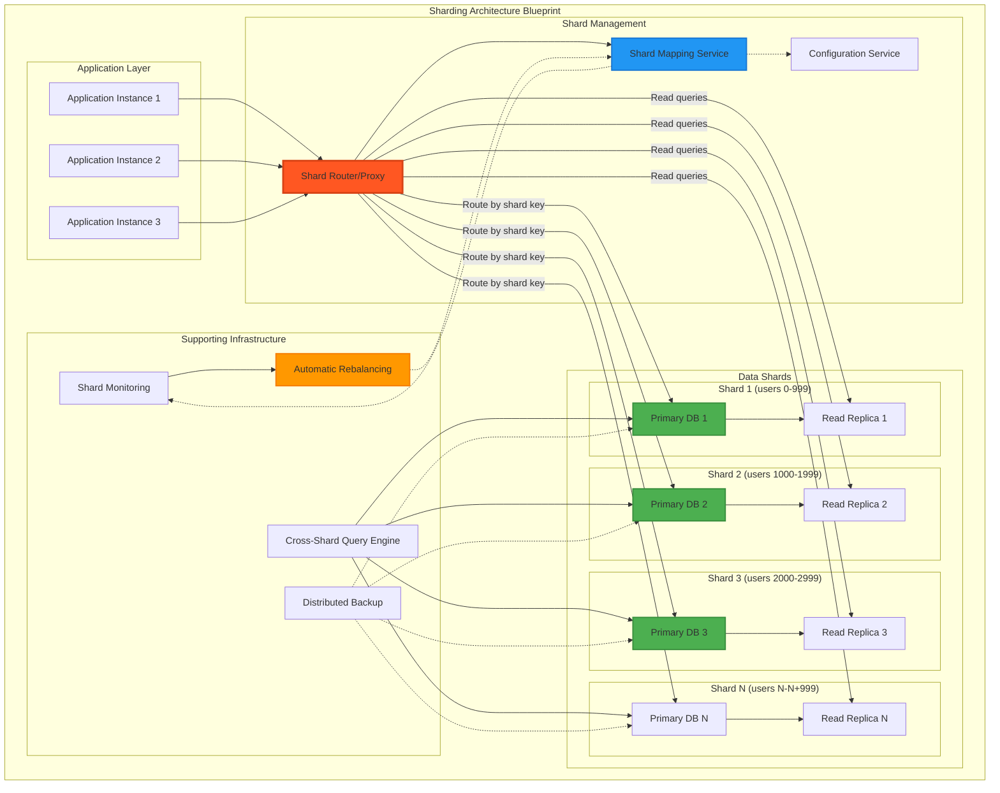

# Sharding (Data Partitioning)

## The Complete Blueprint

Sharding is a database scaling technique that horizontally partitions data across multiple database instances, enabling systems to scale beyond the capacity of a single machine. Instead of storing all data in one database, sharding distributes data based on a partition key (like user_id or geographic region), with each shard handling a subset of the total data. This approach transforms single-database bottlenecks into distributed systems capable of handling massive scale by parallelizing both storage and compute resources.



### What You'll Master

- **Horizontal Partitioning Strategies**: Design effective shard key selection and data distribution algorithms for optimal performance
- **Shard Routing & Mapping**: Build intelligent routing systems that direct queries to the correct shards with minimal overhead
- **Rebalancing & Migration**: Implement zero-downtime shard rebalancing and data migration strategies as your system grows
- **Cross-Shard Operations**: Handle complex queries, transactions, and joins that span multiple shards efficiently
- **Monitoring & Operations**: Build comprehensive monitoring for shard health, balance, and performance optimization
- **Failure Handling**: Design resilient systems that can handle individual shard failures without affecting overall system availability

!!! success "🏆 Gold Standard Pattern"
    **Horizontal Scaling Foundation** • Discord, Pinterest, YouTube proven at planet scale
    
    Sharding enables linear scaling by distributing data across multiple machines based on a partition key. Essential when vertical scaling hits its limits.
    
    **Key Success Metrics:**
    - Discord: 1T+ messages across 4,096 logical shards
    - Pinterest: 240B+ pins on 8,192 virtual shards  
    - YouTube: 100,000+ MySQL instances via Vitess

## Essential Question
**How do we scale beyond single-machine database limits while maintaining query performance?**

## When to Use / When NOT to Use

✅ **Use Sharding When:**
| Indicator | Threshold | Example |
|-----------|-----------|---------|
| Data size | > 5TB | User profiles, messages |
| Write throughput | > 10K/sec | Social media posts |
| Growth rate | > 2x/year | Viral applications |
| Geographic distribution | Multi-region | Global services |

❌ **Avoid Sharding When:**
| Scenario | Why | Alternative |
|----------|-----|-------------|
| < 1TB data | Complexity not worth it | Vertical scaling |
| Complex JOINs | Cross-shard queries kill performance | Denormalization |
| ACID critical | Distributed transactions are hard | Single master |
| Small team | High operational overhead | Managed services |

## Sharding Decision Framework

## Level 1: Intuition

### The Library Card Catalog Analogy
Think of a massive library with millions of books. Instead of one enormous catalog:
- A-F → Catalog 1
- G-M → Catalog 2  
- N-S → Catalog 3
- T-Z → Catalog 4

Each catalog is smaller, faster to search, and can be updated independently.

### Single Database vs Sharded

| Metric | Single Database | Sharded (4 shards) | Improvement |
|--------|-----------------|--------------------|--------------| 
| Max Storage | 10TB | 40TB | 4x |
| Write Throughput | 10K/s | 40K/s | 4x |
| Fault Impact | 100% down | 25% affected | 75% better |
| Query Latency | 500ms | 50ms | 10x faster |

### Visual Architecture

## Level 2: Foundation

### Sharding Strategy Comparison Matrix

| Strategy | Distribution | Query Support | Resharding | Best For |
|----------|--------------|---------------|------------|----------|
| **Hash-Based** | ⭐⭐⭐⭐⭐ Even | ❌ No range queries | 🔴 Very Hard | User profiles, sessions |
| **Range-Based** | ⭐⭐ Can hotspot | ✅ Range queries | 🟡 Hard | Time-series, logs |
| **Geographic** | ⭐⭐⭐ By region | ✅ Location queries | 🟢 Natural | Global apps, CDN |
| **Directory** | ⭐⭐⭐⭐ Flexible | ✅ Any query type | 🟢 Easy | Multi-tenant SaaS |
| **Composite** | ⭐⭐⭐ Custom | 🟡 Complex | 🔴 Very Complex | Enterprise systems |

### Sharding Key Selection Guide

### Core Implementation Patterns

## Level 3: Deep Dive

### Rebalancing Strategies

| Strategy | Complexity | Downtime | When to Use |
|----------|------------|----------|-------------|
| **Virtual Shards** | Low | None | Default choice - map multiple logical shards to physical |
| **Consistent Hashing** | Low | None | Dynamic clusters with frequent node changes |
| **Split & Merge** | High | Minimal | When virtual shards insufficient |
| **Shadow Writes** | Medium | None | Zero-downtime migrations |
| **Read-Write Split** | Medium | None | Gradual migration with verification |

### Rebalancing Decision Flow

### Cross-Shard Query Patterns

| Pattern | Performance | Use Case | Optimization |
|---------|-------------|----------|---------------|
| **Scatter-Gather** | O(n) shards | Global search | Parallel execution, result caching |
| **Targeted Multi-Shard** | O(k) shards | Known subset | Shard pruning, query routing |
| **Shard-Local** | O(1) | 95% of queries | Co-locate related data |
| **Two-Phase Lookup** | 2x latency | Secondary indexes | Denormalize hot paths |

### Common Pitfalls & Solutions

| Pitfall | Impact | Solution |
|---------|--------|----------|
| **Hot Shards** | One shard gets 80% traffic | Composite keys, virtual shards, time-based sub-sharding |
| **Cross-Shard JOINs** | 100x slower queries | Denormalize, maintain read views, use CQRS |
| **Shard Key Changes** | Can't move data | Immutable keys, directory-based sharding |
| **Unbalanced Growth** | Some shards fill faster | Predictive rebalancing, usage-based splitting |

## Level 4: Expert

### Production Case Studies

<div class="failure-vignette">
<h4>💥 Discord's Resharding Crisis (2020)</h4>

**Scale**: 1T+ messages, growing 100M/day
**Problem**: Popular channels created 100x shard imbalance
**Impact**: P99 latency degraded from 50ms → 5 seconds

**Solution Architecture**:
```
Before: channel_id % 128 → Direct shard mapping
After:  channel_id → bucket (1 of 4096) → shard (1 of 128)
```

**Results**: 
- 95% reduction in P99 latency
- Zero-downtime rebalancing capability
- Handles 1M+ messages/second
</div>

### Architecture Comparison

| Company | Sharding Strategy | Scale | Key Innovation |
|---------|------------------|-------|----------------|
| **Discord** | Bucket-based (4096→128) | 1T+ messages | Dynamic bucket remapping |
| **Pinterest** | Virtual shards (8192→800) | 240B+ pins | MySQL at massive scale |
| **YouTube** | Vitess auto-sharding | 100K+ MySQL | Transparent resharding |
| **Uber** | Schemaless layers | 1M+ QPS | Cell-based architecture |

### Discord's Virtual Shard Mapping

### Vitess Architecture (YouTube)

## Level 5: Mastery

### Economic Analysis

| Cost Factor | Single DB (10TB) | 4-Shard Setup | Annual Savings |
|-------------|------------------|---------------|----------------|
| **Infrastructure** | $15K/mo (r5.24xl) | $8K/mo (4×r5.4xl) | $84K |
| **Storage + IOPS** | $8K/mo | $7K/mo | $12K |
| **Downtime Impact** | $20K/mo (2hr) | $2K/mo (0.5hr) | $216K |
| **Total Monthly** | $43K | $17K | **$312K/year** |

**ROI Timeline**: 
- Implementation cost: ~$200K (engineering time)
- Payback period: 7.7 months
- 5-year ROI: 680%

### Zero-Downtime Migration Playbook

### Production-Ready Configurations

## Quick Reference

### Decision Matrix

| Your Situation | Recommended Approach |
|----------------|---------------------|
| 5-10TB, growing slowly | Vertical scaling + read replicas |
| 10TB+, doubling yearly | Start sharding project now |
| Complex queries, <5TB | Optimize queries first |
| Multi-tenant SaaS | Directory-based sharding |
| Time-series data | Range sharding by time |
| Global users | Geographic sharding |

### Common Commands

### Key Metrics to Monitor

| Metric | Target | Alert Threshold |
|--------|--------|-----------------|
| Shard size variance | < 20% | > 50% |
| Cross-shard queries | < 5% | > 10% |
| Resharding frequency | Quarterly | Monthly |
| Hot shard traffic | < 2x average | > 3x average |

## 🎓 Key Takeaways

1. **Start with more shards than you need** - Merging is easier than splitting
2. **Choose your shard key wisely** - It determines everything
3. **Monitor shard balance religiously** - Hotspots kill performance
4. **Plan for resharding from day one** - You will need it
5. **Avoid cross-shard operations** - They're expensive at scale


## Related Laws

This pattern directly addresses several fundamental distributed systems laws:

- **[Law 4: Multidimensional Optimization](../../core-principles/laws/multidimensional-optimization.md)**: Sharding represents the classic trade-off between scalability and complexity - gaining horizontal scale at the cost of cross-shard operation difficulty
- **[Law 5: Distributed Knowledge](../../core-principles/laws/distributed-knowledge.md)**: Data is partitioned across shards, meaning no single node has complete knowledge of the dataset
- **[Law 7: Economic Reality](../../core-principles/laws/economic-reality.md)**: Enables cost-effective scaling by allowing horizontal scaling on commodity hardware rather than expensive vertical scaling

## Related Patterns

### Foundation
- [Consistent Hashing](../scaling/consistent-hashing.md) - Core algorithm for sharding
- [Database per Service](../data/database-per-service.md) - Natural sharding boundary
- [CQRS](../data/cqrs.md) - Separate read/write sharding strategies

### Operations  
- [Circuit Breaker](../resilience/circuit-breaker.md) - Handle shard failures
- [Bulkhead](../resilience/bulkhead.md) - Isolate shard impacts
- [Service Mesh](../infrastructure/service-mesh.md) - Shard-aware routing

### Case Studies
- [Discord: Message Sharding](../../architects-handbook/case-studies/discord-messages.md)
- [Pinterest: MySQL Sharding](../../architects-handbook/case-studies/pinterest-sharding.md)
- [Uber: Schemaless](../../architects-handbook/case-studies/uber-schemaless.md)

---

*"The best shard key is the one you'll never need to change."*

