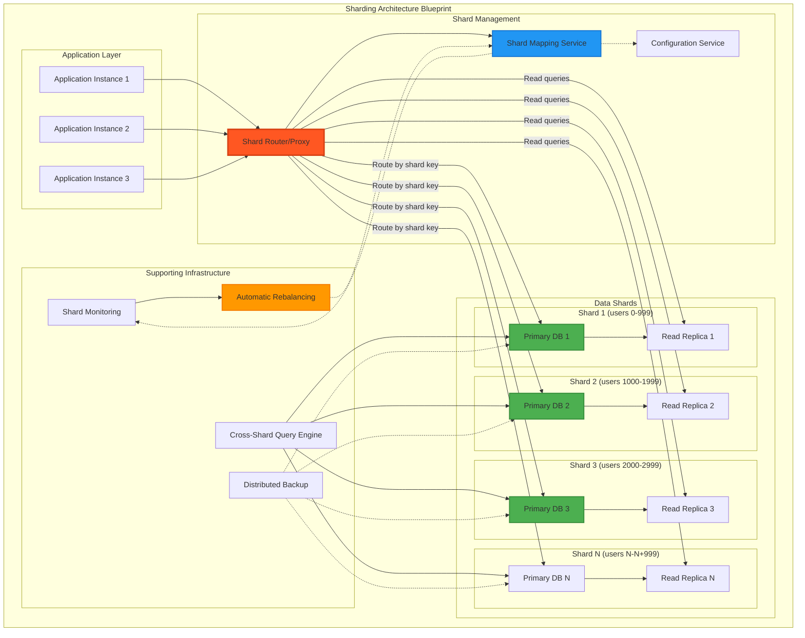
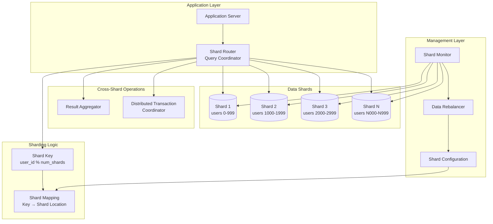

# Sharding (Data Partitioning)

## The Complete Blueprint

Sharding is a database scaling technique that horizontally partitions data across multiple database instances, enabling systems to scale beyond the capacity of a single machine. Instead of storing all data in one database, sharding distributes data based on a partition key (like user_id or geographic region), with each shard handling a subset of the total data. This approach transforms single-database bottlenecks into distributed systems capable of handling massive scale by parallelizing both storage and compute resources.



### What You'll Master

- **Horizontal Partitioning Strategies**: Design effective shard key selection and data distribution algorithms for optimal performance
- **Shard Routing & Mapping**: Build intelligent routing systems that direct queries to the correct shards with minimal overhead
- **Rebalancing & Migration**: Implement zero-downtime shard rebalancing and data migration strategies as your system grows
- **Cross-Shard Operations**: Handle complex queries, transactions, and joins that span multiple shards efficiently
- **Monitoring & Operations**: Build comprehensive monitoring for shard health, balance, and performance optimization
- **Failure Handling**: Design resilient systems that can handle individual shard failures without affecting overall system availability

!!! success "🏆 Gold Standard Pattern"
    **Horizontal Scaling Foundation** • Discord, Pinterest, YouTube proven at planet scale
    
    Sharding enables linear scaling by distributing data across multiple machines based on a partition key. Essential when vertical scaling hits its limits.
    
    **Key Success Metrics:**
    - Discord: 1T+ messages across 4,096 logical shards
    - Pinterest: 240B+ pins on 8,192 virtual shards  
    - YouTube: 100,000+ MySQL instances via Vitess

## Essential Question
**How do we scale beyond single-machine database limits while maintaining query performance?**

## When to Use / When NOT to Use

✅ **Use Sharding When:**
| Indicator | Threshold | Example |
|-----------|-----------|---------|
| Data size | > 5TB | User profiles, messages |
| Write throughput | > 10K/sec | Social media posts |
| Growth rate | > 2x/year | Viral applications |
| Geographic distribution | Multi-region | Global services |

❌ **Avoid Sharding When:**
| Scenario | Why | Alternative |
|----------|-----|-------------|
| < 1TB data | Complexity not worth it | Vertical scaling |
| Complex JOINs | Cross-shard queries kill performance | Denormalization |
| ACID critical | Distributed transactions are hard | Single master |
| Small team | High operational overhead | Managed services |

## Sharding Decision Framework

## Level 1: Intuition

### The Library Card Catalog Analogy
Think of a massive library with millions of books. Instead of one enormous catalog:
- A-F → Catalog 1
- G-M → Catalog 2  
- N-S → Catalog 3
- T-Z → Catalog 4

Each catalog is smaller, faster to search, and can be updated independently.

### Single Database vs Sharded

| Metric | Single Database | Sharded (4 shards) | Improvement |
|--------|-----------------|--------------------|--------------| 
| Max Storage | 10TB | 40TB | 4x |
| Write Throughput | 10K/s | 40K/s | 4x |
| Fault Impact | 100% down | 25% affected | 75% better |
| Query Latency | 500ms | 50ms | 10x faster |

### Visual Architecture

## Level 2: Foundation

### Sharding Strategy Comparison Matrix

| Strategy | Distribution | Query Support | Resharding | Best For |
|----------|--------------|---------------|------------|----------|
| **Hash-Based** | ⭐⭐⭐⭐⭐ Even | ❌ No range queries | 🔴 Very Hard | User profiles, sessions |
| **Range-Based** | ⭐⭐ Can hotspot | ✅ Range queries | 🟡 Hard | Time-series, logs |
| **Geographic** | ⭐⭐⭐ By region | ✅ Location queries | 🟢 Natural | Global apps, CDN |
| **Directory** | ⭐⭐⭐⭐ Flexible | ✅ Any query type | 🟢 Easy | Multi-tenant SaaS |
| **Composite** | ⭐⭐⭐ Custom | 🟡 Complex | 🔴 Very Complex | Enterprise systems |

### Detailed Partitioning Strategies

#### 1. Hash-Based Sharding

**Algorithm**: `hash(shard_key) % num_shards`

**Best Practice**: Use consistent hashing for stable distribution

```python
import hashlib
from typing import List, Dict, Any

class ConsistentHashRing:
    def __init__(self, nodes: List[str], virtual_nodes: int = 150):
        self.virtual_nodes = virtual_nodes
        self.ring = {}
        self.sorted_keys = []
        
        for node in nodes:
            self.add_node(node)
    
    def _hash(self, key: str) -> int:
        return int(hashlib.md5(key.encode()).hexdigest(), 16)
    
    def add_node(self, node: str):
        """Add a node with virtual replicas for better distribution"""
        for i in range(self.virtual_nodes):
            virtual_key = f"{node}:{i}"
            key = self._hash(virtual_key)
            self.ring[key] = node
            
        self.sorted_keys = sorted(self.ring.keys())
    
    def remove_node(self, node: str):
        """Remove node and its virtual replicas"""
        for i in range(self.virtual_nodes):
            virtual_key = f"{node}:{i}"
            key = self._hash(virtual_key)
            if key in self.ring:
                del self.ring[key]
                
        self.sorted_keys = sorted(self.ring.keys())
    
    def get_node(self, key: str) -> str:
        """Find the node responsible for this key"""
        if not self.ring:
            return None
            
        key_hash = self._hash(key)
        
        # Find the first node clockwise from this position
        for ring_key in self.sorted_keys:
            if key_hash <= ring_key:
                return self.ring[ring_key]
        
        # Wrap around to the first node
        return self.ring[self.sorted_keys[0]]

# Usage example
nodes = ["shard-1", "shard-2", "shard-3", "shard-4"]
hash_ring = ConsistentHashRing(nodes)

# Route user data to appropriate shard
user_id = "user_12345"
shard = hash_ring.get_node(user_id)
print(f"User {user_id} belongs to {shard}")
```

**Pros**: Perfect distribution, simple implementation, scales horizontally
**Cons**: No range queries, resharding requires data migration
**Production Example**: **DynamoDB** uses consistent hashing with 128-bit MD5 hash space for even distribution across partitions

#### 2. Range-Based Sharding

**Algorithm**: `if start_range <= key < end_range: use shard_X`

```python
from datetime import datetime, timedelta
from typing import List, Tuple, Optional

class RangeShardManager:
    def __init__(self):
        self.ranges: List[Tuple[str, str, str]] = []
    
    def add_range(self, start_key: str, end_key: str, shard: str):
        """Add a range mapping to a shard"""
        self.ranges.append((start_key, end_key, shard))
        # Keep ranges sorted for efficient lookup
        self.ranges.sort(key=lambda x: x[0])
    
    def get_shard(self, key: str) -> Optional[str]:
        """Find shard for given key using binary search"""
        for start, end, shard in self.ranges:
            if start <= key < end:
                return shard
        return None

# Time-series sharding example
shard_manager = RangeShardManager()

# Shard by month for time-series data
shard_manager.add_range("2024-01", "2024-02", "ts-shard-2024-01")
shard_manager.add_range("2024-02", "2024-03", "ts-shard-2024-02")
shard_manager.add_range("2024-03", "2024-04", "ts-shard-2024-03")

# Geographic sharding example for users
class GeographicShardManager:
    def __init__(self):
        self.regions = {
            "US_WEST": ["CA", "OR", "WA", "NV", "AZ"],
            "US_EAST": ["NY", "FL", "MA", "PA", "VA"],
            "EU_WEST": ["UK", "FR", "DE", "NL", "BE"],
            "ASIA_PACIFIC": ["JP", "AU", "SG", "KR", "IN"]
        }
    
    def get_shard(self, country_code: str) -> str:
        """Route to regional shard based on geography"""
        for region, countries in self.regions.items():
            if country_code in countries:
                return f"shard-{region.lower()}"
        return "shard-global"  # Default fallback
```

**Pros**: Efficient range queries, natural data locality
**Cons**: Hotspots possible, uneven growth patterns
**Production Example**: **Cassandra** uses token ranges with consistent hashing for distributed data placement

#### 3. Directory-Based Sharding

**Algorithm**: Maintain explicit mapping table: `tenant_id → shard_location`

```python
import json
from typing import Dict, List, Optional

class DirectoryShardManager:
    def __init__(self, config_file: str = None):
        self.mapping: Dict[str, str] = {}
        self.shard_capacity: Dict[str, int] = {}
        self.shard_usage: Dict[str, int] = {}
        
        if config_file:
            self.load_config(config_file)
    
    def assign_tenant(self, tenant_id: str, preferred_shard: str = None) -> str:
        """Assign tenant to optimal shard based on capacity"""
        if tenant_id in self.mapping:
            return self.mapping[tenant_id]
        
        # Find shard with available capacity
        target_shard = preferred_shard
        if not target_shard:
            target_shard = self._find_optimal_shard()
        
        if self._can_accommodate(target_shard):
            self.mapping[tenant_id] = target_shard
            self.shard_usage[target_shard] = self.shard_usage.get(target_shard, 0) + 1
            return target_shard
        
        raise Exception(f"Cannot accommodate tenant {tenant_id}")
    
    def _find_optimal_shard(self) -> str:
        """Find shard with lowest utilization"""
        min_usage = float('inf')
        optimal_shard = None
        
        for shard, capacity in self.shard_capacity.items():
            usage = self.shard_usage.get(shard, 0)
            utilization = usage / capacity
            
            if utilization < min_usage:
                min_usage = utilization
                optimal_shard = shard
        
        return optimal_shard
    
    def get_shard(self, tenant_id: str) -> Optional[str]:
        """Get shard assignment for tenant"""
        return self.mapping.get(tenant_id)
    
    def migrate_tenant(self, tenant_id: str, new_shard: str) -> bool:
        """Move tenant to different shard"""
        old_shard = self.mapping.get(tenant_id)
        if not old_shard:
            return False
        
        if self._can_accommodate(new_shard):
            self.mapping[tenant_id] = new_shard
            self.shard_usage[old_shard] -= 1
            self.shard_usage[new_shard] = self.shard_usage.get(new_shard, 0) + 1
            return True
        
        return False
    
    def _can_accommodate(self, shard: str) -> bool:
        """Check if shard has available capacity"""
        capacity = self.shard_capacity.get(shard, 0)
        usage = self.shard_usage.get(shard, 0)
        return usage < capacity
    
    def load_config(self, config_file: str):
        """Load shard configuration from file"""
        with open(config_file, 'r') as f:
            config = json.load(f)
            self.shard_capacity = config.get('shard_capacity', {})
            self.mapping = config.get('tenant_mapping', {})
            self._recalculate_usage()
    
    def _recalculate_usage(self):
        """Recalculate shard usage from current mappings"""
        self.shard_usage = {}
        for shard in self.mapping.values():
            self.shard_usage[shard] = self.shard_usage.get(shard, 0) + 1
```

**Pros**: Maximum flexibility, easy resharding, optimal load balancing
**Cons**: Additional lookup overhead, directory service single point of failure
**Production Example**: **Shopify** uses directory-based sharding for multi-tenant shop data with over 1M merchants

### Sharding Key Selection Guide

#### The Golden Rules of Shard Key Design

1. **High Cardinality**: Keys should have many distinct values
2. **Even Distribution**: Values should spread evenly across the key space
3. **Query-Friendly**: Most queries should target single shards
4. **Immutable**: Keys should never change after initial assignment
5. **Predictable**: Applications should easily determine which shard to query

#### Shard Key Patterns and Anti-Patterns

| Pattern Type | Example | Distribution Quality | Query Efficiency |
|--------------|---------|---------------------|------------------|
| **✅ User ID** | `user_123456` | ⭐⭐⭐⭐⭐ Excellent | ⭐⭐⭐⭐⭐ Single-shard queries |
| **✅ Hash(email)** | `md5(user@domain.com)` | ⭐⭐⭐⭐⭐ Perfect | ⭐⭐⭐⭐ Good for user operations |
| **✅ Geographic** | `user_region_id` | ⭐⭐⭐⭐ Good | ⭐⭐⭐⭐⭐ Excellent locality |
| **❌ Timestamp** | `created_at` | ⭐ Terrible hotspots | ⭐⭐⭐⭐⭐ Great for time queries |
| **❌ Status** | `active/inactive` | ⭐ Creates hotspots | ⭐⭐ Poor distribution |
| **❌ Sequential** | `auto_increment_id` | ⭐ Always hot shard | ⭐⭐⭐ Predictable but uneven |

```python
import hashlib
from datetime import datetime
from typing import Union, Dict, Any

class ShardKeyValidator:
    @staticmethod
    def calculate_cardinality_score(sample_keys: list) -> float:
        """Estimate cardinality distribution quality"""
        unique_keys = len(set(sample_keys))
        total_keys = len(sample_keys)
        return unique_keys / total_keys if total_keys > 0 else 0
    
    @staticmethod
    def test_distribution(sample_keys: list, num_shards: int) -> Dict[int, int]:
        """Test how evenly keys distribute across shards"""
        shard_counts = {i: 0 for i in range(num_shards)}
        
        for key in sample_keys:
            key_hash = int(hashlib.md5(str(key).encode()).hexdigest(), 16)
            shard = key_hash % num_shards
            shard_counts[shard] += 1
        
        return shard_counts
    
    @staticmethod
    def analyze_hotspots(shard_distribution: Dict[int, int]) -> Dict[str, Any]:
        """Analyze distribution for hotspots and imbalance"""
        counts = list(shard_distribution.values())
        total = sum(counts)
        avg = total / len(counts)
        
        variance = sum((count - avg) ** 2 for count in counts) / len(counts)
        std_dev = variance ** 0.5
        
        # Find hottest and coldest shards
        hottest_shard = max(shard_distribution, key=shard_distribution.get)
        coldest_shard = min(shard_distribution, key=shard_distribution.get)
        
        balance_ratio = shard_distribution[coldest_shard] / shard_distribution[hottest_shard]
        
        return {
            "total_keys": total,
            "avg_keys_per_shard": avg,
            "std_deviation": std_dev,
            "balance_ratio": balance_ratio,  # Closer to 1.0 is better
            "hottest_shard": hottest_shard,
            "hottest_count": shard_distribution[hottest_shard],
            "coldest_shard": coldest_shard,
            "coldest_count": shard_distribution[coldest_shard],
            "is_balanced": balance_ratio > 0.8  # 80% threshold
        }

# Example: Testing different shard key strategies
sample_user_ids = [f"user_{i}" for i in range(10000)]
sample_timestamps = [datetime.now().timestamp() + i for i in range(10000)]
sample_emails = [f"user{i}@example.com" for i in range(10000)]

validator = ShardKeyValidator()

# Test user ID distribution (good)
user_distribution = validator.test_distribution(sample_user_ids, 16)
user_analysis = validator.analyze_hotspots(user_distribution)
print(f"User ID balance ratio: {user_analysis['balance_ratio']:.3f}")

# Test timestamp distribution (bad - always hits newest shard)
time_distribution = validator.test_distribution(sample_timestamps, 16)
time_analysis = validator.analyze_hotspots(time_distribution)
print(f"Timestamp balance ratio: {time_analysis['balance_ratio']:.3f}")
```

#### Composite Shard Keys for Complex Systems

```python
class CompositeShardKey:
    def __init__(self, tenant_weight: float = 0.7, time_weight: float = 0.3):
        self.tenant_weight = tenant_weight
        self.time_weight = time_weight
    
    def generate_key(self, tenant_id: str, timestamp: datetime) -> str:
        """Create composite key balancing tenant isolation and time locality"""
        
        # Hash tenant for even distribution
        tenant_hash = hashlib.md5(tenant_id.encode()).hexdigest()[:8]
        
        # Time bucket (hour granularity for time locality)
        time_bucket = timestamp.strftime("%Y%m%d%H")
        
        # Weighted combination
        composite = f"{tenant_hash}_{time_bucket}"
        
        return composite
    
    def get_shard(self, composite_key: str, num_shards: int) -> int:
        """Route composite key to appropriate shard"""
        key_hash = int(hashlib.md5(composite_key.encode()).hexdigest(), 16)
        return key_hash % num_shards

# Usage for multi-tenant time-series data
composite_key_gen = CompositeShardKey()

tenant_id = "tenant_abc_corp"
timestamp = datetime.now()
composite_key = composite_key_gen.generate_key(tenant_id, timestamp)
shard = composite_key_gen.get_shard(composite_key, 64)

print(f"Tenant {tenant_id} at {timestamp} → Key: {composite_key} → Shard: {shard}")
```

### Core Implementation Patterns

#### Smart Shard Routing Implementation

```python
import asyncio
import logging
from typing import Dict, List, Optional, Any, Callable
from dataclasses import dataclass
from enum import Enum

class ShardStatus(Enum):
    HEALTHY = "healthy"
    DEGRADED = "degraded"
    OFFLINE = "offline"
    MAINTENANCE = "maintenance"

@dataclass
class ShardInfo:
    shard_id: str
    host: str
    port: int
    status: ShardStatus
    last_health_check: float
    current_load: float
    max_capacity: int
    current_connections: int

class ShardRouter:
    def __init__(self, health_check_interval: int = 30):
        self.shards: Dict[str, ShardInfo] = {}
        self.shard_ring = ConsistentHashRing([])
        self.health_check_interval = health_check_interval
        self.circuit_breakers: Dict[str, bool] = {}
        self.logger = logging.getLogger(__name__)
        
    async def add_shard(self, shard_info: ShardInfo):
        """Add new shard to the routing table"""
        self.shards[shard_info.shard_id] = shard_info
        self.shard_ring.add_node(shard_info.shard_id)
        self.circuit_breakers[shard_info.shard_id] = False
        
        self.logger.info(f"Added shard {shard_info.shard_id} to routing table")
        
    async def remove_shard(self, shard_id: str):
        """Remove shard from routing table"""
        if shard_id in self.shards:
            del self.shards[shard_id]
            self.shard_ring.remove_node(shard_id)
            del self.circuit_breakers[shard_id]
            
            self.logger.warning(f"Removed shard {shard_id} from routing table")
    
    async def route_query(self, shard_key: str, query: Dict[str, Any], 
                         retry_count: int = 3) -> Optional[Any]:
        """Route query to appropriate shard with failover"""
        primary_shard = self.shard_ring.get_node(shard_key)
        
        if not primary_shard or self.circuit_breakers.get(primary_shard, False):
            # Find backup shard
            primary_shard = self._find_healthy_shard()
            
        if not primary_shard:
            raise Exception("No healthy shards available")
        
        for attempt in range(retry_count):
            try:
                result = await self._execute_query(primary_shard, query)
                
                # Reset circuit breaker on success
                self.circuit_breakers[primary_shard] = False
                return result
                
            except Exception as e:
                self.logger.warning(f"Query failed on {primary_shard}: {e}")
                
                # Open circuit breaker
                self.circuit_breakers[primary_shard] = True
                
                if attempt < retry_count - 1:
                    # Try different shard on retry
                    primary_shard = self._find_healthy_shard(exclude=[primary_shard])
                    if not primary_shard:
                        break
        
        raise Exception(f"Query failed after {retry_count} attempts")
    
    def _find_healthy_shard(self, exclude: List[str] = None) -> Optional[str]:
        """Find a healthy shard for failover"""
        exclude = exclude or []
        
        for shard_id, shard in self.shards.items():
            if (shard_id not in exclude and 
                shard.status == ShardStatus.HEALTHY and 
                not self.circuit_breakers.get(shard_id, False)):
                return shard_id
        
        return None
    
    async def _execute_query(self, shard_id: str, query: Dict[str, Any]) -> Any:
        """Execute query on specific shard"""
        shard = self.shards[shard_id]
        
        # Simulate database connection and query execution
        # In production, this would be actual database calls
        await asyncio.sleep(0.01)  # Simulate network latency
        
        if shard.status != ShardStatus.HEALTHY:
            raise Exception(f"Shard {shard_id} is not healthy")
        
        return {"shard": shard_id, "result": "query_result"}
    
    async def health_check_loop(self):
        """Continuous health checking of all shards"""
        while True:
            for shard_id, shard in self.shards.items():
                try:
                    # Perform health check
                    health_result = await self._check_shard_health(shard_id)
                    
                    if health_result:
                        shard.status = ShardStatus.HEALTHY
                        self.circuit_breakers[shard_id] = False
                    else:
                        shard.status = ShardStatus.DEGRADED
                        
                except Exception as e:
                    self.logger.error(f"Health check failed for {shard_id}: {e}")
                    shard.status = ShardStatus.OFFLINE
                    self.circuit_breakers[shard_id] = True
            
            await asyncio.sleep(self.health_check_interval)
    
    async def _check_shard_health(self, shard_id: str) -> bool:
        """Check if a specific shard is healthy"""
        try:
            # Simulate health check query
            await asyncio.sleep(0.001)
            return True  # Simplified - would check actual connectivity
        except:
            return False

# Cross-shard query aggregation
class CrossShardQueryExecutor:
    def __init__(self, router: ShardRouter):
        self.router = router
        self.logger = logging.getLogger(__name__)
    
    async def execute_scatter_gather(self, query: Dict[str, Any], 
                                   target_shards: List[str] = None) -> Dict[str, Any]:
        """Execute query across multiple shards and aggregate results"""
        if not target_shards:
            target_shards = list(self.router.shards.keys())
        
        # Execute queries in parallel
        tasks = []
        for shard_id in target_shards:
            if shard_id in self.router.shards:
                task = self.router._execute_query(shard_id, query)
                tasks.append((shard_id, task))
        
        # Gather results
        results = {}
        for shard_id, task in tasks:
            try:
                result = await task
                results[shard_id] = result
            except Exception as e:
                self.logger.warning(f"Cross-shard query failed on {shard_id}: {e}")
                results[shard_id] = {"error": str(e)}
        
        return self._aggregate_results(results, query)
    
    def _aggregate_results(self, shard_results: Dict[str, Any], 
                          query: Dict[str, Any]) -> Dict[str, Any]:
        """Aggregate results from multiple shards"""
        aggregated = {
            "total_shards_queried": len(shard_results),
            "successful_shards": sum(1 for r in shard_results.values() if "error" not in r),
            "results": []
        }
        
        for shard_id, result in shard_results.items():
            if "error" not in result:
                aggregated["results"].append({
                    "shard": shard_id,
                    "data": result
                })
        
        # Add query-specific aggregation logic here
        if query.get("operation") == "count":
            aggregated["total_count"] = sum(
                r.get("count", 0) for r in aggregated["results"]
            )
        
        return aggregated
```

## Level 3: Deep Dive

### Rebalancing Strategies

| Strategy | Complexity | Downtime | When to Use |
|----------|------------|----------|-------------|
| **Virtual Shards** | Low | None | Default choice - map multiple logical shards to physical |
| **Consistent Hashing** | Low | None | Dynamic clusters with frequent node changes |
| **Split & Merge** | High | Minimal | When virtual shards insufficient |
| **Shadow Writes** | Medium | None | Zero-downtime migrations |
| **Read-Write Split** | Medium | None | Gradual migration with verification |

### Rebalancing Decision Flow

### Cross-Shard Query Patterns

| Pattern | Performance | Use Case | Optimization |
|---------|-------------|----------|---------------|
| **Scatter-Gather** | O(n) shards | Global search | Parallel execution, result caching |
| **Targeted Multi-Shard** | O(k) shards | Known subset | Shard pruning, query routing |
| **Shard-Local** | O(1) | 95% of queries | Co-locate related data |
| **Two-Phase Lookup** | 2x latency | Secondary indexes | Denormalize hot paths |

### Common Pitfalls & Solutions

| Pitfall | Impact | Solution |
|---------|--------|----------|
| **Hot Shards** | One shard gets 80% traffic | Composite keys, virtual shards, time-based sub-sharding |
| **Cross-Shard JOINs** | 100x slower queries | Denormalize, maintain read views, use CQRS |
| **Shard Key Changes** | Can't move data | Immutable keys, directory-based sharding |
| **Unbalanced Growth** | Some shards fill faster | Predictive rebalancing, usage-based splitting |

## Level 4: Expert

### Production Case Studies

<div class="failure-vignette">
<h4>💥 Discord's Resharding Crisis (2020)</h4>

**Scale**: 1T+ messages, growing 100M/day
**Problem**: Popular channels created 100x shard imbalance
**Impact**: P99 latency degraded from 50ms → 5 seconds

**Solution Architecture**:
```
Before: channel_id % 128 → Direct shard mapping
After:  channel_id → bucket (1 of 4096) → shard (1 of 128)
```

**Results**: 
- 95% reduction in P99 latency
- Zero-downtime rebalancing capability
- Handles 1M+ messages/second
</div>

### Architecture Comparison

| Company | Sharding Strategy | Scale | Key Innovation |
|---------|------------------|-------|----------------|
| **Discord** | Bucket-based (4096→128) | 1T+ messages | Dynamic bucket remapping |
| **Pinterest** | Virtual shards (8192→800) | 240B+ pins | MySQL at massive scale |
| **YouTube** | Vitess auto-sharding | 100K+ MySQL | Transparent resharding |
| **Uber** | Schemaless layers | 1M+ QPS | Cell-based architecture |

### Discord's Virtual Shard Mapping

### Vitess Architecture (YouTube)

## Level 5: Mastery

### Economic Analysis

| Cost Factor | Single DB (10TB) | 4-Shard Setup | Annual Savings |
|-------------|------------------|---------------|----------------|
| **Infrastructure** | $15K/mo (r5.24xl) | $8K/mo (4×r5.4xl) | $84K |
| **Storage + IOPS** | $8K/mo | $7K/mo | $12K |
| **Downtime Impact** | $20K/mo (2hr) | $2K/mo (0.5hr) | $216K |
| **Total Monthly** | $43K | $17K | **$312K/year** |

**ROI Timeline**: 
- Implementation cost: ~$200K (engineering time)
- Payback period: 7.7 months
- 5-year ROI: 680%

### Zero-Downtime Migration Playbook

### Production-Ready Configurations

## Quick Reference

### Decision Matrix

| Your Situation | Recommended Approach |
|----------------|---------------------|
| 5-10TB, growing slowly | Vertical scaling + read replicas |
| 10TB+, doubling yearly | Start sharding project now |
| Complex queries, <5TB | Optimize queries first |
| Multi-tenant SaaS | Directory-based sharding |
| Time-series data | Range sharding by time |
| Global users | Geographic sharding |

### Common Commands

### Key Metrics to Monitor

| Metric | Target | Alert Threshold |
|--------|--------|-----------------|
| Shard size variance | < 20% | > 50% |
| Cross-shard queries | < 5% | > 10% |
| Resharding frequency | Quarterly | Monthly |
| Hot shard traffic | < 2x average | > 3x average |

## 🎓 Key Takeaways

1. **Start with more shards than you need** - Merging is easier than splitting
2. **Choose your shard key wisely** - It determines everything
3. **Monitor shard balance religiously** - Hotspots kill performance
4. **Plan for resharding from day one** - You will need it
5. **Avoid cross-shard operations** - They're expensive at scale


## Related Laws

This pattern directly addresses several fundamental distributed systems laws:

- **[Law 4: Multidimensional Optimization](../../core-principles/laws/multidimensional-optimization.md)**: Sharding represents the classic trade-off between scalability and complexity - gaining horizontal scale at the cost of cross-shard operation difficulty
- **[Law 5: Distributed Knowledge](../../core-principles/laws/distributed-knowledge.md)**: Data is partitioned across shards, meaning no single node has complete knowledge of the dataset
- **[Law 7: Economic Reality](../../core-principles/laws/economic-reality.md)**: Enables cost-effective scaling by allowing horizontal scaling on commodity hardware rather than expensive vertical scaling

## Related Patterns

### Foundational Patterns (Essential for Sharding)

| Pattern | Relationship | Integration Strategy | Why It's Essential |
|---------|--------------|---------------------|-------------------|
| **[Consistent Hashing](../data-management/consistent-hashing.md)** | **Core sharding algorithm** - Provides stable, even distribution of data across shards | Use consistent hashing ring to assign data to shards. Add virtual nodes for better distribution. Rehashing only affects adjacent shards | Essential - Provides the fundamental algorithm for determining which shard stores which data |
| **[Load Balancing](./load-balancing.md)** | **Shard traffic distribution** - Routes queries to appropriate shards | Implement shard-aware load balancing that understands data location. Use partition key to route requests to correct shard | Always - Sharded systems need intelligent request routing |
| **[Service Discovery](../communication/service-discovery.md)** | **Dynamic shard location** - Tracks which shards are available and their locations | Maintain shard registry with location metadata. Update routing tables when shards are added/removed/moved | Dynamic environments where shards can be added, removed, or relocated |

### Complementary Patterns (Work Well Together)

| Pattern | Relationship | Integration Strategy | When to Combine |
|---------|--------------|---------------------|------------------|
| **[Circuit Breaker](../resilience/circuit-breaker.md)** | **Shard failure isolation** - Prevents failed shards from impacting entire system | Implement per-shard circuit breakers. When a shard circuit opens, route traffic to read replicas or return degraded responses | Always - Individual shard failures should not cascade |
| **[Bulkhead](../resilience/bulkhead.md)** | **Resource isolation per shard** - Prevents one hot shard from consuming all resources | Use separate connection pools, thread pools, and memory allocations per shard. Isolate shard resources to prevent cross-contamination | High-traffic systems where shard load imbalances are common |
| **[CQRS](../data-management/cqrs.md)** | **Read/Write optimization** - Separate sharding strategies for reads vs writes | Shard writes by partition key, replicate reads across multiple shards for query optimization. Use different shard counts for read and write sides | Complex query patterns that don't align with write partitioning |
| **[Database per Service](./database-per-service.md)** | **Service-level sharding boundary** - Each microservice manages its own shards | Each service implements its own sharding strategy based on its data access patterns. No cross-service shard dependencies | Microservices architectures where different services have different scaling needs |

### Extension Patterns (Build Upon Sharding)

| Pattern | Relationship | Implementation | When to Extend |
|---------|--------------|----------------|----------------|
| **[Auto-scaling](./auto-scaling.md)** | **Dynamic shard management** - Automatically adds/removes shards based on load | Monitor per-shard metrics to trigger shard splits or merges. Implement automatic rebalancing and data migration | Variable workloads where shard load patterns change over time |
| **[Geo-distribution](./geo-distribution.md)** | **Geographic sharding** - Distribute shards across regions for locality | Shard data by geographic region (user location, data center). Implement cross-region replication for global data | Global applications requiring data locality for performance or compliance |
| **[Caching Strategies](./caching-strategies.md)** | **Per-shard caching** - Cache frequently accessed data from each shard | Implement shard-aware caching that understands partition keys. Use cache keys that include shard information | High read volumes where caching can reduce shard load |

### Alternative Patterns (Different Scaling Approaches)

| Pattern | Relationship | Trade-offs | When to Choose Sharding |
|---------|--------------|------------|------------------------|
| **[Read Replicas](../data-management/read-replicas.md)** | **Read scaling** - Scales reads without data partitioning | Replication: Simpler, eventual consistency vs Sharding: Complex, immediate consistency, scales writes | When you need to scale both reads and writes, not just reads |
| **[Vertical Scaling](../scaling/vertical-scaling.md)** | **Scale up vs scale out** - Bigger machines vs more machines | Vertical: Simpler, ACID guarantees vs Sharding: Complex, eventual consistency, unlimited scale | When single-machine limits are reached and horizontal scaling is needed |
| **[Polyglot Persistence](../data-management/polyglot-persistence.md)** | **Database specialization** - Different databases for different uses vs partitioned single database | Polyglot: Different models for different needs vs Sharding: Same model, more capacity | When you need massive scale within the same data model |

### Implementation Priority Guide

**Phase 1: Foundation (Week 1-2)**
1. **Sharding Key Selection** - Analyze access patterns and choose optimal partition key
2. **Consistent Hashing Implementation** - Set up basic shard assignment algorithm  
3. **Shard-aware Routing** - Implement application logic to route queries to correct shards

**Phase 2: Resilience (Week 3-4)**
1. **Circuit Breaker Integration** - Add per-shard failure handling
2. **Connection Pooling** - Implement shard-aware connection management
3. **Basic Monitoring** - Track per-shard performance and utilization

**Phase 3: Optimization (Week 5+)**
1. **Auto-scaling Integration** - Implement dynamic shard management
2. **Cross-shard Query Optimization** - Add scatter-gather query capabilities
3. **Automatic Rebalancing** - Implement load-based shard rebalancing

### Production Case Studies
- **Discord**: Channel-based sharding for 1T+ messages across 4,096 logical shards on 177 Cassandra nodes
- **Pinterest**: User-based sharding with virtual buckets for 240B+ pins on 8,192 virtual shards across 800 MySQL servers  
- **YouTube/Vitess**: Automatic sharding proxy handling 100,000+ MySQL instances with exabytes of data

---

*"The best shard key is the one you'll never need to change."*

## The Complete Blueprint

Database sharding is the horizontal partitioning of data across multiple database instances, enabling systems to scale beyond the limits of a single database server. This pattern breaks a large dataset into smaller, more manageable pieces (shards) distributed across multiple servers, with each shard containing a subset of the total data. The fundamental challenge is determining how to partition the data - by user ID, geographic region, feature, or other criteria - while maintaining query efficiency and avoiding hot spots. Successful sharding requires careful consideration of four key elements: the sharding key (how to split data), shard routing (how to find the right shard), cross-shard queries (how to handle operations spanning multiple shards), and rebalancing (how to redistribute data as the system grows). The pattern becomes complex when dealing with transactions, joins, and data that doesn't naturally partition.



### What You'll Master

- **Shard key design**: Choose partitioning strategies that distribute load evenly while enabling efficient queries
- **Query routing**: Implement logic to direct queries to the correct shard(s) based on the sharding key
- **Cross-shard operations**: Handle aggregations, joins, and transactions that span multiple shards
- **Operational management**: Plan for shard rebalancing, monitoring, and disaster recovery across distributed data

# Database Sharding

Horizontal database partitioning
